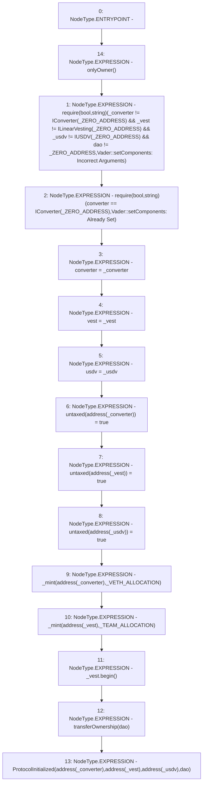

# Context: Vader.setComponents

**Contract:** `Vader` (Inherits: Ownable, ERC20, IERC20Metadata, IERC20, Context, ProtocolConstants, IVader)
**Signature:** `setComponents(IConverter,ILinearVesting,IUSDV,address)`
**Method Selector ID:** `0x45afdc8d`
**Visibility:** `external`
**Environment-Free:** `No (reads EVM state context)`
**Modifiers:**
- `onlyOwner`
  ```solidity
  modifier onlyOwner() {
          _checkOwner();
          _;
      }
  ```

### State Variables Interaction
- **Reads:** _TEAM_ALLOCATION, _VETH_ALLOCATION, _ZERO_ADDRESS, converter
- **Writes:** converter, untaxed, usdv, vest

### Assertion Checks & Business Requirements
- require/assert: `require(bool,string)(_converter != IConverter(_ZERO_ADDRESS) && _vest != ILinearVesting(_ZERO_ADDRESS) && _usdv != IUSDV(_ZERO_ADDRESS) && dao != _ZERO_ADDRESS,Vader::setComponents: Incorrect Arguments)`
- require/assert: `require(bool,string)(converter == IConverter(_ZERO_ADDRESS),Vader::setComponents: Already Set)`

### Environment & Verification Flags
- **Uses Foundry Cheatcodes:** No
- **Has Echidna Properties:** No

### Internal Calls Tree
- None

### External Calls / Value Transfers
- `ILinearVesting.HIGH_LEVEL_CALL, dest:_vest(ILinearVesting), function:begin, arguments:[]  `

### Control Flow Graph (CFG)


### Source Mapping
Declared in: `certora-ac-datasets/detasets/web3bugs/dataset/web3bugs/52/contracts/tokens/Vader.sol` on lines **148** to **186**

```solidity
    function setComponents(
        IConverter _converter,
        ILinearVesting _vest,
        IUSDV _usdv,
        address dao
    ) external onlyOwner {
        require(
            _converter != IConverter(_ZERO_ADDRESS) &&
                _vest != ILinearVesting(_ZERO_ADDRESS) &&
                _usdv != IUSDV(_ZERO_ADDRESS) &&
                dao != _ZERO_ADDRESS,
            "Vader::setComponents: Incorrect Arguments"
        );
        require(
            converter == IConverter(_ZERO_ADDRESS),
            "Vader::setComponents: Already Set"
        );

        converter = _converter;
        vest = _vest;
        usdv = _usdv;

        untaxed[address(_converter)] = true;
        untaxed[address(_vest)] = true;
        untaxed[address(_usdv)] = true;

        _mint(address(_converter), _VETH_ALLOCATION);
        _mint(address(_vest), _TEAM_ALLOCATION);

        _vest.begin();
        transferOwnership(dao);

        emit ProtocolInitialized(
            address(_converter),
            address(_vest),
            address(_usdv),
            dao
        );
    }

```
