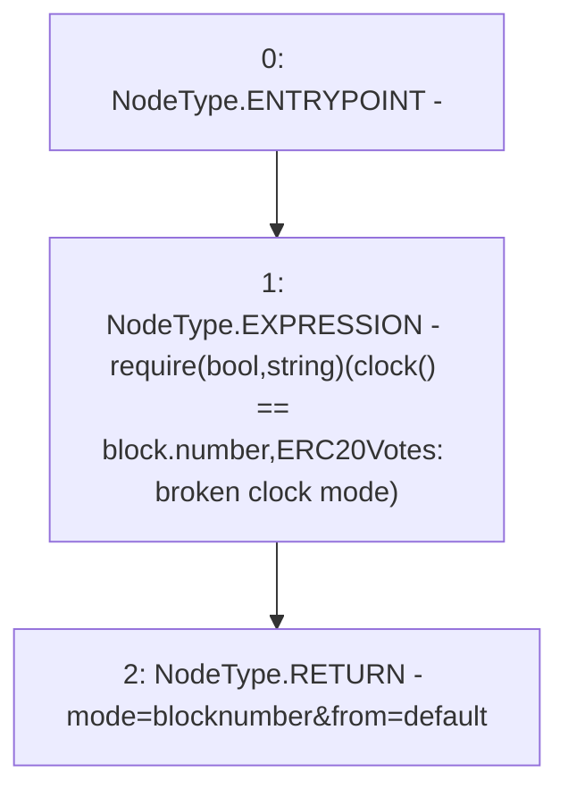

# Context: XVader.CLOCK_MODE

**Contract:** `XVader` (Inherits: ReentrancyGuard, ERC20Votes, IERC5805, IVotes, IERC6372, ERC20Permit, EIP712, IERC5267, IERC20Permit, ERC20, IERC20Metadata, IERC20, Context, ProtocolConstants)
**Signature:** `CLOCK_MODE() returns (string)`
**Method Selector ID:** `0x4bf5d7e9`
**Visibility:** `public`
**Environment-Free:** `No (reads EVM state context)`
**Modifiers:** None

### State Variables Interaction
- **Reads:** None
- **Writes:** None

### Assertion Checks & Business Requirements
- require/assert: `require(bool,string)(clock() == block.number,ERC20Votes: broken clock mode)`

### Environment & Verification Flags
- **Uses Foundry Cheatcodes:** No
- **Has Echidna Properties:** No

### Internal Calls Tree
- None

### External Calls / Value Transfers
- None

### Control Flow Graph (CFG)


### Source Mapping
Declared in: `certora-ac-datasets/detasets/web3bugs/dataset/web3bugs/52/node_modules/@openzeppelin/contracts/token/ERC20/extensions/ERC20Votes.sol` on lines **51** to **55**

```solidity
    function CLOCK_MODE() public view virtual override returns (string memory) {
        // Check that the clock was not modified
        require(clock() == block.number, "ERC20Votes: broken clock mode");
        return "mode=blocknumber&from=default";
    }

```
