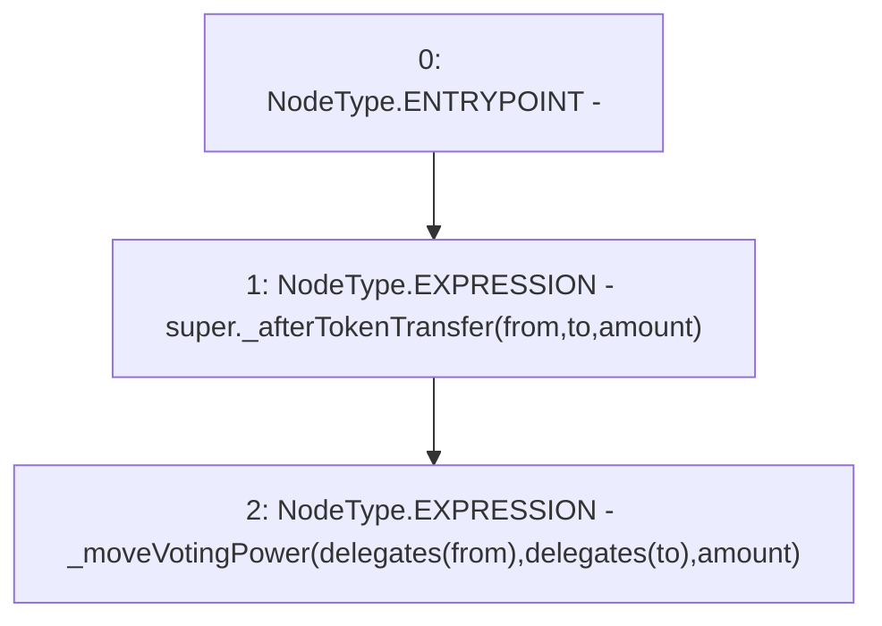

# Context: XVader._afterTokenTransfer

**Contract:** `XVader` (Inherits: ReentrancyGuard, ERC20Votes, IERC5805, IVotes, IERC6372, ERC20Permit, EIP712, IERC5267, IERC20Permit, ERC20, IERC20Metadata, IERC20, Context, ProtocolConstants)
**Signature:** `_afterTokenTransfer(address,address,uint256)`
**Method Selector ID:** `Internal (No Method ID)`
**Visibility:** `internal`
**Environment-Free:** `No (reads EVM state context)`
**Modifiers:** None

### State Variables Interaction
- **Reads:** None
- **Writes:** None

### Environment & Verification Flags
- **Uses Foundry Cheatcodes:** No
- **Has Echidna Properties:** No

### Internal Calls Tree
- None

### External Calls / Value Transfers
- None

### Control Flow Graph (CFG)


### Source Mapping
Declared in: `certora-ac-datasets/detasets/web3bugs/dataset/web3bugs/52/node_modules/@openzeppelin/contracts/token/ERC20/extensions/ERC20Votes.sol` on lines **217** to **221**

```solidity
    function _afterTokenTransfer(address from, address to, uint256 amount) internal virtual override {
        super._afterTokenTransfer(from, to, amount);

        _moveVotingPower(delegates(from), delegates(to), amount);
    }

```
