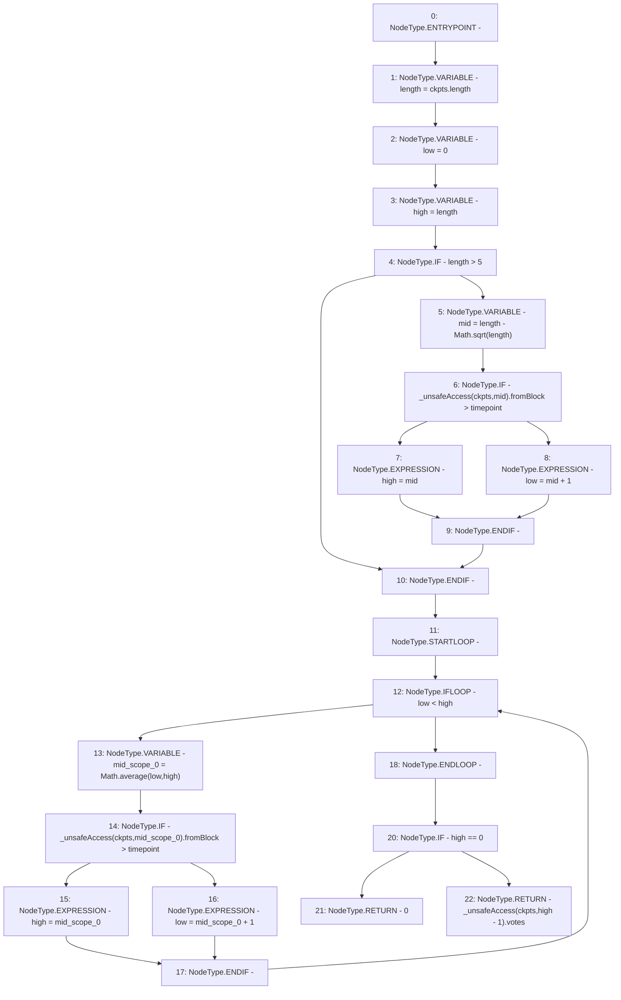

# Context: XVader._checkpointsLookup

**Contract:** `XVader` (Inherits: ReentrancyGuard, ERC20Votes, IERC5805, IVotes, IERC6372, ERC20Permit, EIP712, IERC5267, IERC20Permit, ERC20, IERC20Metadata, IERC20, Context, ProtocolConstants)
**Signature:** `_checkpointsLookup(ERC20Votes.Checkpoint[],uint256) returns (uint256)`
**Method Selector ID:** `Internal (No Method ID)`
**Visibility:** `private`
**Environment-Free:** `Yes`
**Modifiers:** None

### State Variables Interaction
- **Reads:** _totalSupplyCheckpoints
- **Writes:** None

### Environment & Verification Flags
- **Uses Foundry Cheatcodes:** No
- **Has Echidna Properties:** No

### Internal Calls Tree
- None

### External Calls / Value Transfers
- `Math.TMP_977(uint256) = LIBRARY_CALL, dest:Math, function:Math.average(uint256,uint256), arguments:['low', 'high'] `
- `Math.TMP_971(uint256) = LIBRARY_CALL, dest:Math, function:Math.sqrt(uint256), arguments:['length'] `

### Control Flow Graph (CFG)


### Source Mapping
Declared in: `certora-ac-datasets/detasets/web3bugs/dataset/web3bugs/52/node_modules/@openzeppelin/contracts/token/ERC20/extensions/ERC20Votes.sol` on lines **116** to **155**

```solidity
    function _checkpointsLookup(Checkpoint[] storage ckpts, uint256 timepoint) private view returns (uint256) {
        // We run a binary search to look for the last (most recent) checkpoint taken before (or at) `timepoint`.
        //
        // Initially we check if the block is recent to narrow the search range.
        // During the loop, the index of the wanted checkpoint remains in the range [low-1, high).
        // With each iteration, either `low` or `high` is moved towards the middle of the range to maintain the invariant.
        // - If the middle checkpoint is after `timepoint`, we look in [low, mid)
        // - If the middle checkpoint is before or equal to `timepoint`, we look in [mid+1, high)
        // Once we reach a single value (when low == high), we've found the right checkpoint at the index high-1, if not
        // out of bounds (in which case we're looking too far in the past and the result is 0).
        // Note that if the latest checkpoint available is exactly for `timepoint`, we end up with an index that is
        // past the end of the array, so we technically don't find a checkpoint after `timepoint`, but it works out
        // the same.
        uint256 length = ckpts.length;

        uint256 low = 0;
        uint256 high = length;

        if (length > 5) {
            uint256 mid = length - Math.sqrt(length);
            if (_unsafeAccess(ckpts, mid).fromBlock > timepoint) {
                high = mid;
            } else {
                low = mid + 1;
            }
        }

        while (low < high) {
            uint256 mid = Math.average(low, high);
            if (_unsafeAccess(ckpts, mid).fromBlock > timepoint) {
                high = mid;
            } else {
                low = mid + 1;
            }
        }

        unchecked {
            return high == 0 ? 0 : _unsafeAccess(ckpts, high - 1).votes;
        }
    }

```
