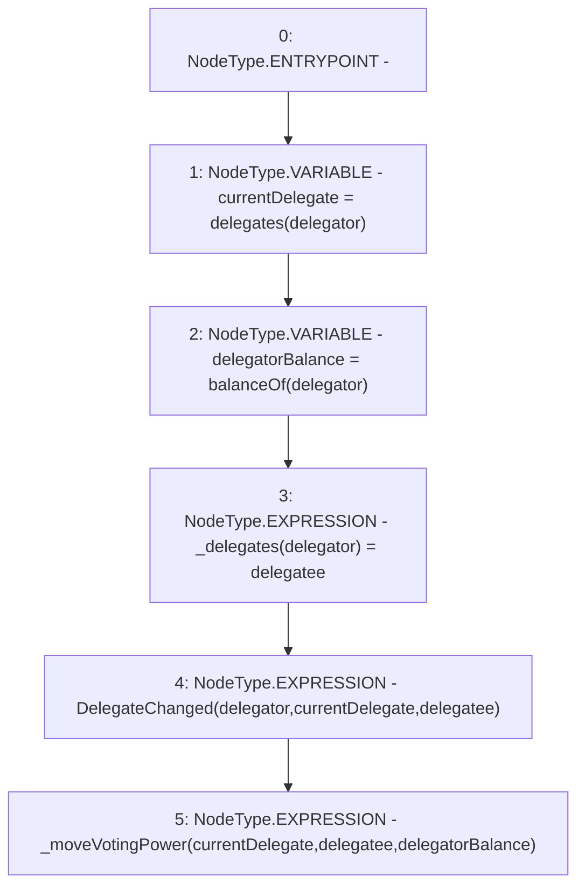

# Context: XVader._delegate

**Contract:** `XVader` (Inherits: ReentrancyGuard, ERC20Votes, IERC5805, IVotes, IERC6372, ERC20Permit, EIP712, IERC5267, IERC20Permit, ERC20, IERC20Metadata, IERC20, Context, ProtocolConstants)
**Signature:** `_delegate(address,address)`
**Method Selector ID:** `Internal (No Method ID)`
**Visibility:** `internal`
**Environment-Free:** `No (reads EVM state context)`
**Modifiers:** None

### State Variables Interaction
- **Reads:** None
- **Writes:** _delegates

### Environment & Verification Flags
- **Uses Foundry Cheatcodes:** No
- **Has Echidna Properties:** No

### Internal Calls Tree
- None

### External Calls / Value Transfers
- None

### Control Flow Graph (CFG)


### Source Mapping
Declared in: `certora-ac-datasets/detasets/web3bugs/dataset/web3bugs/52/node_modules/@openzeppelin/contracts/token/ERC20/extensions/ERC20Votes.sol` on lines **228** to **236**

```solidity
    function _delegate(address delegator, address delegatee) internal virtual {
        address currentDelegate = delegates(delegator);
        uint256 delegatorBalance = balanceOf(delegator);
        _delegates[delegator] = delegatee;

        emit DelegateChanged(delegator, currentDelegate, delegatee);

        _moveVotingPower(currentDelegate, delegatee, delegatorBalance);
    }

```
