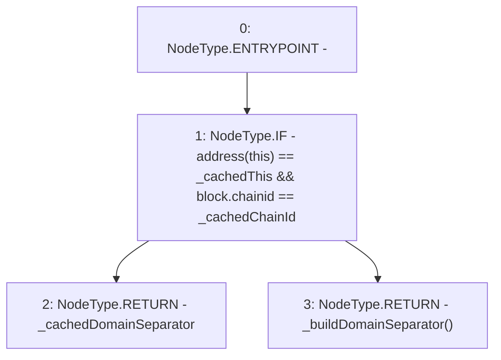

# Context: XVader._domainSeparatorV4

**Contract:** `XVader` (Inherits: ReentrancyGuard, ERC20Votes, IERC5805, IVotes, IERC6372, ERC20Permit, EIP712, IERC5267, IERC20Permit, ERC20, IERC20Metadata, IERC20, Context, ProtocolConstants)
**Signature:** `_domainSeparatorV4() returns (bytes32)`
**Method Selector ID:** `Internal (No Method ID)`
**Visibility:** `internal`
**Environment-Free:** `Yes`
**Modifiers:** None

### State Variables Interaction
- **Reads:** _cachedChainId, _cachedDomainSeparator, _cachedThis
- **Writes:** None

### Environment & Verification Flags
- **Uses Foundry Cheatcodes:** No
- **Has Echidna Properties:** No

### Internal Calls Tree
- None

### External Calls / Value Transfers
- None

### Control Flow Graph (CFG)


### Source Mapping
Declared in: `certora-ac-datasets/detasets/web3bugs/dataset/web3bugs/52/node_modules/@openzeppelin/contracts/utils/cryptography/EIP712.sol` on lines **81** to **87**

```solidity
    function _domainSeparatorV4() internal view returns (bytes32) {
        if (address(this) == _cachedThis && block.chainid == _cachedChainId) {
            return _cachedDomainSeparator;
        } else {
            return _buildDomainSeparator();
        }
    }

```
