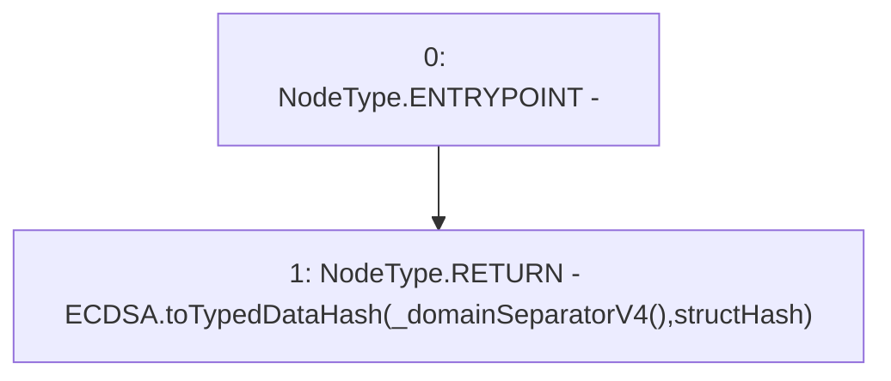

# Context: XVader._hashTypedDataV4

**Contract:** `XVader` (Inherits: ReentrancyGuard, ERC20Votes, IERC5805, IVotes, IERC6372, ERC20Permit, EIP712, IERC5267, IERC20Permit, ERC20, IERC20Metadata, IERC20, Context, ProtocolConstants)
**Signature:** `_hashTypedDataV4(bytes32) returns (bytes32)`
**Method Selector ID:** `Internal (No Method ID)`
**Visibility:** `internal`
**Environment-Free:** `Yes`
**Modifiers:** None

### State Variables Interaction
- **Reads:** None
- **Writes:** None

### Environment & Verification Flags
- **Uses Foundry Cheatcodes:** No
- **Has Echidna Properties:** No

### Internal Calls Tree
- None

### External Calls / Value Transfers
- `ECDSA.TMP_1077(bytes32) = LIBRARY_CALL, dest:ECDSA, function:ECDSA.toTypedDataHash(bytes32,bytes32), arguments:['TMP_1076', 'structHash'] `

### Control Flow Graph (CFG)


### Source Mapping
Declared in: `certora-ac-datasets/detasets/web3bugs/dataset/web3bugs/52/node_modules/@openzeppelin/contracts/utils/cryptography/EIP712.sol` on lines **108** to **110**

```solidity
    function _hashTypedDataV4(bytes32 structHash) internal view virtual returns (bytes32) {
        return ECDSA.toTypedDataHash(_domainSeparatorV4(), structHash);
    }

```
