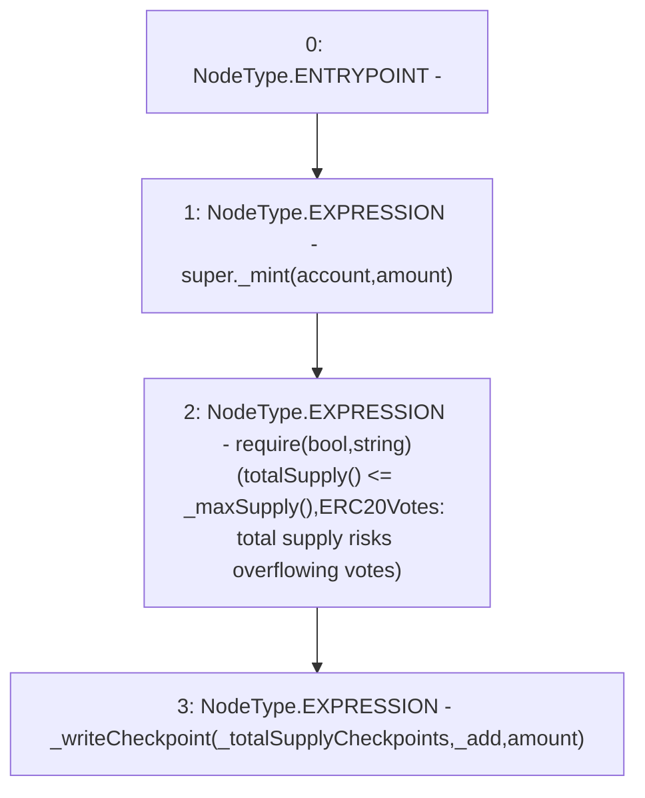

# Context: XVader._mint

**Contract:** `XVader` (Inherits: ReentrancyGuard, ERC20Votes, IERC5805, IVotes, IERC6372, ERC20Permit, EIP712, IERC5267, IERC20Permit, ERC20, IERC20Metadata, IERC20, Context, ProtocolConstants)
**Signature:** `_mint(address,uint256)`
**Method Selector ID:** `Internal (No Method ID)`
**Visibility:** `internal`
**Environment-Free:** `No (reads EVM state context)`
**Modifiers:** None

### State Variables Interaction
- **Reads:** _totalSupplyCheckpoints
- **Writes:** None

### Assertion Checks & Business Requirements
- require/assert: `require(bool,string)(totalSupply() <= _maxSupply(),ERC20Votes: total supply risks overflowing votes)`

### Environment & Verification Flags
- **Uses Foundry Cheatcodes:** No
- **Has Echidna Properties:** No

### Internal Calls Tree
- None

### External Calls / Value Transfers
- None

### Control Flow Graph (CFG)


### Source Mapping
Declared in: `certora-ac-datasets/detasets/web3bugs/dataset/web3bugs/52/node_modules/@openzeppelin/contracts/token/ERC20/extensions/ERC20Votes.sol` on lines **196** to **201**

```solidity
    function _mint(address account, uint256 amount) internal virtual override {
        super._mint(account, amount);
        require(totalSupply() <= _maxSupply(), "ERC20Votes: total supply risks overflowing votes");

        _writeCheckpoint(_totalSupplyCheckpoints, _add, amount);
    }

```
