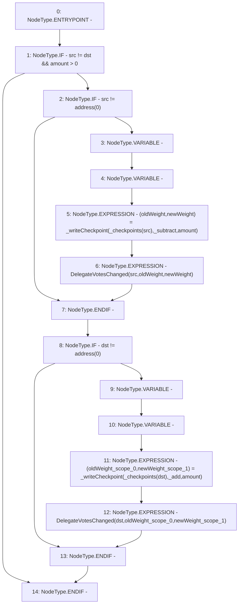

# Context: XVader._moveVotingPower

**Contract:** `XVader` (Inherits: ReentrancyGuard, ERC20Votes, IERC5805, IVotes, IERC6372, ERC20Permit, EIP712, IERC5267, IERC20Permit, ERC20, IERC20Metadata, IERC20, Context, ProtocolConstants)
**Signature:** `_moveVotingPower(address,address,uint256)`
**Method Selector ID:** `Internal (No Method ID)`
**Visibility:** `private`
**Environment-Free:** `No (reads EVM state context)`
**Modifiers:** None

### State Variables Interaction
- **Reads:** _checkpoints
- **Writes:** None

### Environment & Verification Flags
- **Uses Foundry Cheatcodes:** No
- **Has Echidna Properties:** No

### Internal Calls Tree
- None

### External Calls / Value Transfers
- None

### Control Flow Graph (CFG)


### Source Mapping
Declared in: `certora-ac-datasets/detasets/web3bugs/dataset/web3bugs/52/node_modules/@openzeppelin/contracts/token/ERC20/extensions/ERC20Votes.sol` on lines **238** to **250**

```solidity
    function _moveVotingPower(address src, address dst, uint256 amount) private {
        if (src != dst && amount > 0) {
            if (src != address(0)) {
                (uint256 oldWeight, uint256 newWeight) = _writeCheckpoint(_checkpoints[src], _subtract, amount);
                emit DelegateVotesChanged(src, oldWeight, newWeight);
            }

            if (dst != address(0)) {
                (uint256 oldWeight, uint256 newWeight) = _writeCheckpoint(_checkpoints[dst], _add, amount);
                emit DelegateVotesChanged(dst, oldWeight, newWeight);
            }
        }
    }

```
