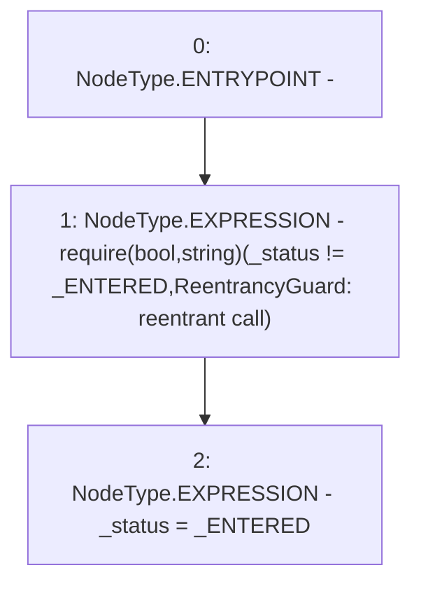

# Context: XVader._nonReentrantBefore

**Contract:** `XVader` (Inherits: ReentrancyGuard, ERC20Votes, IERC5805, IVotes, IERC6372, ERC20Permit, EIP712, IERC5267, IERC20Permit, ERC20, IERC20Metadata, IERC20, Context, ProtocolConstants)
**Signature:** `_nonReentrantBefore()`
**Method Selector ID:** `Internal (No Method ID)`
**Visibility:** `private`
**Environment-Free:** `Yes`
**Modifiers:** None

### State Variables Interaction
- **Reads:** _ENTERED, _status
- **Writes:** _status

### Assertion Checks & Business Requirements
- require/assert: `require(bool,string)(_status != _ENTERED,ReentrancyGuard: reentrant call)`

### Environment & Verification Flags
- **Uses Foundry Cheatcodes:** No
- **Has Echidna Properties:** No

### Internal Calls Tree
- None

### External Calls / Value Transfers
- None

### Control Flow Graph (CFG)


### Source Mapping
Declared in: `certora-ac-datasets/detasets/web3bugs/dataset/web3bugs/52/node_modules/@openzeppelin/contracts/security/ReentrancyGuard.sol` on lines **56** to **62**

```solidity
    function _nonReentrantBefore() private {
        // On the first call to nonReentrant, _status will be _NOT_ENTERED
        require(_status != _ENTERED, "ReentrancyGuard: reentrant call");

        // Any calls to nonReentrant after this point will fail
        _status = _ENTERED;
    }

```
