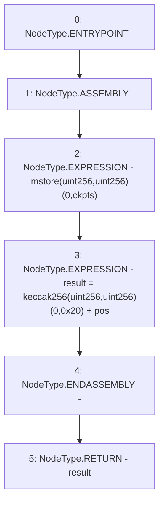

# Context: XVader._unsafeAccess

**Contract:** `XVader` (Inherits: ReentrancyGuard, ERC20Votes, IERC5805, IVotes, IERC6372, ERC20Permit, EIP712, IERC5267, IERC20Permit, ERC20, IERC20Metadata, IERC20, Context, ProtocolConstants)
**Signature:** `_unsafeAccess(ERC20Votes.Checkpoint[],uint256) returns (ERC20Votes.Checkpoint)`
**Method Selector ID:** `Internal (No Method ID)`
**Visibility:** `private`
**Environment-Free:** `Yes`
**Modifiers:** None

### State Variables Interaction
- **Reads:** _totalSupplyCheckpoints
- **Writes:** None

### Environment & Verification Flags
- **Uses Foundry Cheatcodes:** No
- **Has Echidna Properties:** No

### Internal Calls Tree
- None

### External Calls / Value Transfers
- None

### Control Flow Graph (CFG)


### Source Mapping
Declared in: `certora-ac-datasets/detasets/web3bugs/dataset/web3bugs/52/node_modules/@openzeppelin/contracts/token/ERC20/extensions/ERC20Votes.sol` on lines **284** to **289**

```solidity
    function _unsafeAccess(Checkpoint[] storage ckpts, uint256 pos) private pure returns (Checkpoint storage result) {
        assembly {
            mstore(0, ckpts.slot)
            result.slot := add(keccak256(0, 0x20), pos)
        }
    }

```
