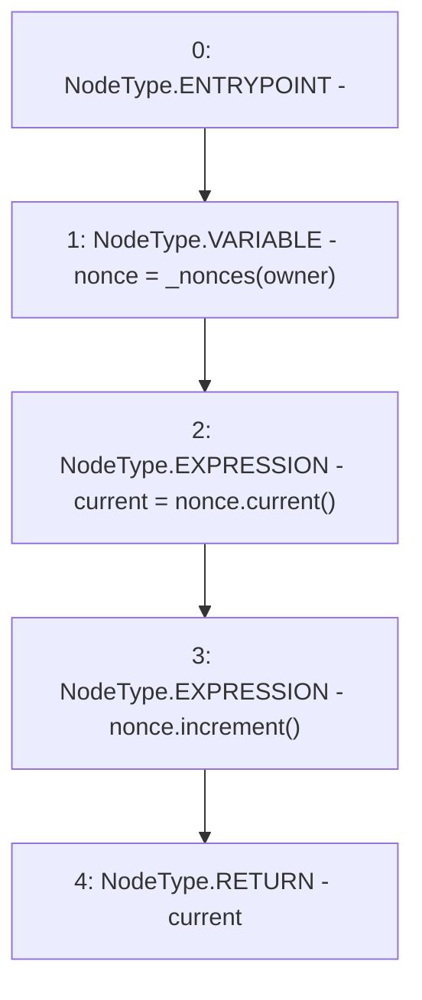

# Context: XVader._useNonce

**Contract:** `XVader` (Inherits: ReentrancyGuard, ERC20Votes, IERC5805, IVotes, IERC6372, ERC20Permit, EIP712, IERC5267, IERC20Permit, ERC20, IERC20Metadata, IERC20, Context, ProtocolConstants)
**Signature:** `_useNonce(address) returns (uint256)`
**Method Selector ID:** `Internal (No Method ID)`
**Visibility:** `internal`
**Environment-Free:** `Yes`
**Modifiers:** None

### State Variables Interaction
- **Reads:** _nonces
- **Writes:** None

### Environment & Verification Flags
- **Uses Foundry Cheatcodes:** No
- **Has Echidna Properties:** No

### Internal Calls Tree
- None

### External Calls / Value Transfers
- `Counters.TMP_1058(uint256) = LIBRARY_CALL, dest:Counters, function:Counters.current(Counters.Counter), arguments:['nonce'] `
- `Counters.LIBRARY_CALL, dest:Counters, function:Counters.increment(Counters.Counter), arguments:['nonce'] `

### Control Flow Graph (CFG)


### Source Mapping
Declared in: `certora-ac-datasets/detasets/web3bugs/dataset/web3bugs/52/node_modules/@openzeppelin/contracts/token/ERC20/extensions/ERC20Permit.sol` on lines **90** to **94**

```solidity
    function _useNonce(address owner) internal virtual returns (uint256 current) {
        Counters.Counter storage nonce = _nonces[owner];
        current = nonce.current();
        nonce.increment();
    }

```
