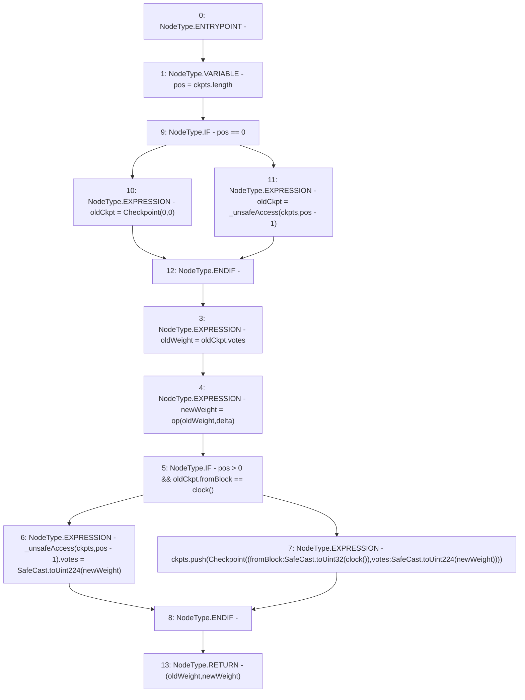

# Context: XVader._writeCheckpoint

**Contract:** `XVader` (Inherits: ReentrancyGuard, ERC20Votes, IERC5805, IVotes, IERC6372, ERC20Permit, EIP712, IERC5267, IERC20Permit, ERC20, IERC20Metadata, IERC20, Context, ProtocolConstants)
**Signature:** `_writeCheckpoint(ERC20Votes.Checkpoint[],function(uint256,uint256) returns(uint256),uint256) returns (uint256, uint256)`
**Method Selector ID:** `Internal (No Method ID)`
**Visibility:** `private`
**Environment-Free:** `No (reads EVM state context)`
**Modifiers:** None

### State Variables Interaction
- **Reads:** _totalSupplyCheckpoints
- **Writes:** _totalSupplyCheckpoints

### Environment & Verification Flags
- **Uses Foundry Cheatcodes:** No
- **Has Echidna Properties:** No

### Internal Calls Tree
- None

### External Calls / Value Transfers
- `SafeCast.TMP_1030(uint32) = LIBRARY_CALL, dest:SafeCast, function:SafeCast.toUint32(uint256), arguments:['TMP_1029'] `
- `SafeCast.TMP_1031(uint224) = LIBRARY_CALL, dest:SafeCast, function:SafeCast.toUint224(uint256), arguments:['newWeight'] `
- `SafeCast.TMP_1028(uint224) = LIBRARY_CALL, dest:SafeCast, function:SafeCast.toUint224(uint256), arguments:['newWeight'] `

### Control Flow Graph (CFG)


### Source Mapping
Declared in: `certora-ac-datasets/detasets/web3bugs/dataset/web3bugs/52/node_modules/@openzeppelin/contracts/token/ERC20/extensions/ERC20Votes.sol` on lines **252** to **271**

```solidity
    function _writeCheckpoint(
        Checkpoint[] storage ckpts,
        function(uint256, uint256) view returns (uint256) op,
        uint256 delta
    ) private returns (uint256 oldWeight, uint256 newWeight) {
        uint256 pos = ckpts.length;

        unchecked {
            Checkpoint memory oldCkpt = pos == 0 ? Checkpoint(0, 0) : _unsafeAccess(ckpts, pos - 1);

            oldWeight = oldCkpt.votes;
            newWeight = op(oldWeight, delta);

            if (pos > 0 && oldCkpt.fromBlock == clock()) {
                _unsafeAccess(ckpts, pos - 1).votes = SafeCast.toUint224(newWeight);
            } else {
                ckpts.push(Checkpoint({fromBlock: SafeCast.toUint32(clock()), votes: SafeCast.toUint224(newWeight)}));
            }
        }
    }

```
