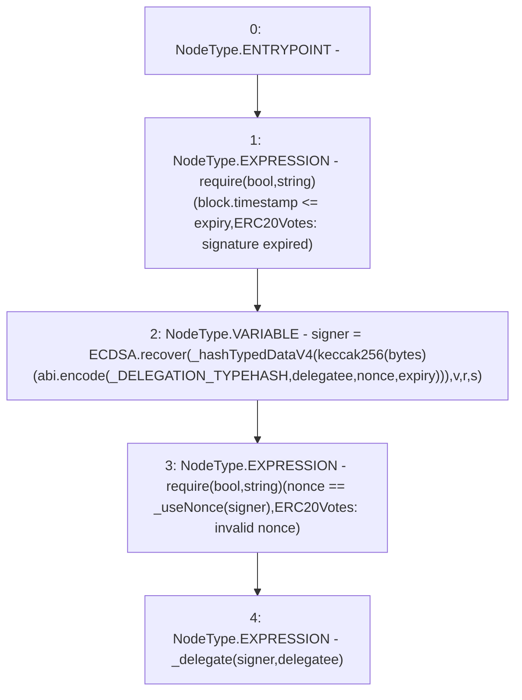

# Context: XVader.delegateBySig

**Contract:** `XVader` (Inherits: ReentrancyGuard, ERC20Votes, IERC5805, IVotes, IERC6372, ERC20Permit, EIP712, IERC5267, IERC20Permit, ERC20, IERC20Metadata, IERC20, Context, ProtocolConstants)
**Signature:** `delegateBySig(address,uint256,uint256,uint8,bytes32,bytes32)`
**Method Selector ID:** `0xc3cda520`
**Visibility:** `public`
**Environment-Free:** `No (reads EVM state context)`
**Modifiers:** None

### State Variables Interaction
- **Reads:** _DELEGATION_TYPEHASH
- **Writes:** None

### Assertion Checks & Business Requirements
- require/assert: `require(bool,string)(block.timestamp <= expiry,ERC20Votes: signature expired)`
- require/assert: `require(bool,string)(nonce == _useNonce(signer),ERC20Votes: invalid nonce)`

### Environment & Verification Flags
- **Uses Foundry Cheatcodes:** No
- **Has Echidna Properties:** No

### Internal Calls Tree
- None

### External Calls / Value Transfers
- `ECDSA.TMP_991(address) = LIBRARY_CALL, dest:ECDSA, function:ECDSA.recover(bytes32,uint8,bytes32,bytes32), arguments:['TMP_990', 'v', 'r', 's'] `

### Control Flow Graph (CFG)


### Source Mapping
Declared in: `certora-ac-datasets/detasets/web3bugs/dataset/web3bugs/52/node_modules/@openzeppelin/contracts/token/ERC20/extensions/ERC20Votes.sol` on lines **167** to **184**

```solidity
    function delegateBySig(
        address delegatee,
        uint256 nonce,
        uint256 expiry,
        uint8 v,
        bytes32 r,
        bytes32 s
    ) public virtual override {
        require(block.timestamp <= expiry, "ERC20Votes: signature expired");
        address signer = ECDSA.recover(
            _hashTypedDataV4(keccak256(abi.encode(_DELEGATION_TYPEHASH, delegatee, nonce, expiry))),
            v,
            r,
            s
        );
        require(nonce == _useNonce(signer), "ERC20Votes: invalid nonce");
        _delegate(signer, delegatee);
    }

```
