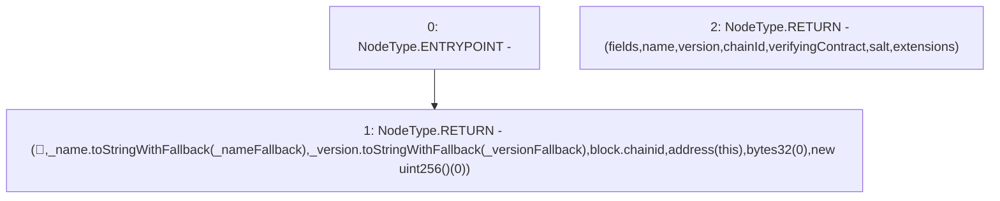

# Context: XVader.eip712Domain

**Contract:** `XVader` (Inherits: ReentrancyGuard, ERC20Votes, IERC5805, IVotes, IERC6372, ERC20Permit, EIP712, IERC5267, IERC20Permit, ERC20, IERC20Metadata, IERC20, Context, ProtocolConstants)
**Signature:** `eip712Domain() returns (bytes1, string, string, uint256, address, bytes32, uint256[])`
**Method Selector ID:** `0x84b0196e`
**Visibility:** `public`
**Environment-Free:** `Yes`
**Modifiers:** None

### State Variables Interaction
- **Reads:** _name, _nameFallback, _version, _versionFallback
- **Writes:** None

### Environment & Verification Flags
- **Uses Foundry Cheatcodes:** No
- **Has Echidna Properties:** No

### Internal Calls Tree
- None

### External Calls / Value Transfers
- `ShortStrings.TMP_1078(string) = LIBRARY_CALL, dest:ShortStrings, function:ShortStrings.toStringWithFallback(ShortString,string), arguments:['_name', '_nameFallback'] `
- `ShortStrings.TMP_1079(string) = LIBRARY_CALL, dest:ShortStrings, function:ShortStrings.toStringWithFallback(ShortString,string), arguments:['_version', '_versionFallback'] `

### Control Flow Graph (CFG)


### Source Mapping
Declared in: `certora-ac-datasets/detasets/web3bugs/dataset/web3bugs/52/node_modules/@openzeppelin/contracts/utils/cryptography/EIP712.sol` on lines **117** to **141**

```solidity
    function eip712Domain()
        public
        view
        virtual
        override
        returns (
            bytes1 fields,
            string memory name,
            string memory version,
            uint256 chainId,
            address verifyingContract,
            bytes32 salt,
            uint256[] memory extensions
        )
    {
        return (
            hex"0f", // 01111
            _name.toStringWithFallback(_nameFallback),
            _version.toStringWithFallback(_versionFallback),
            block.chainid,
            address(this),
            bytes32(0),
            new uint256[](0)
        );
    }

```
