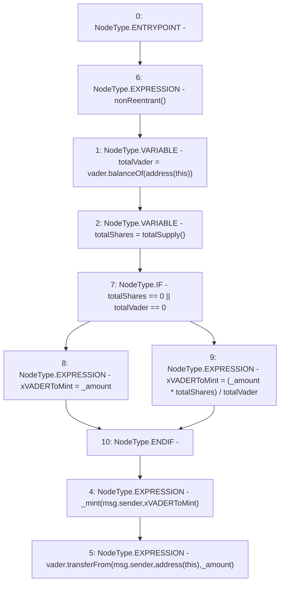

# Context: XVader.enter

**Contract:** `XVader` (Inherits: ReentrancyGuard, ERC20Votes, IERC5805, IVotes, IERC6372, ERC20Permit, EIP712, IERC5267, IERC20Permit, ERC20, IERC20Metadata, IERC20, Context, ProtocolConstants)
**Signature:** `enter(uint256)`
**Method Selector ID:** `0xa59f3e0c`
**Visibility:** `external`
**Environment-Free:** `No (reads EVM state context)`
**Modifiers:**
- `nonReentrant`
  ```solidity
  modifier nonReentrant() {
          _nonReentrantBefore();
          _;
          _nonReentrantAfter();
      }
  ```

### State Variables Interaction
- **Reads:** vader
- **Writes:** None

### Environment & Verification Flags
- **Uses Foundry Cheatcodes:** No
- **Has Echidna Properties:** No

### Internal Calls Tree
- None

### External Calls / Value Transfers
- `IERC20.TMP_1159(bool) = HIGH_LEVEL_CALL, dest:vader(IERC20), function:transferFrom, arguments:['msg.sender', 'TMP_1158', '_amount']  `
- `IERC20.TMP_1155(uint256) = HIGH_LEVEL_CALL, dest:vader(IERC20), function:balanceOf, arguments:['TMP_1154']  `

### Control Flow Graph (CFG)


### Source Mapping
Declared in: `certora-ac-datasets/detasets/web3bugs/dataset/web3bugs/52/contracts/x-vader/XVader.sol` on lines **29** to **47**

```solidity
    function enter(uint256 _amount) external nonReentrant {
        // Gets the amount of vader locked in the contract
        uint256 totalVader = vader.balanceOf(address(this));
        // Gets the amount of xVader in existence
        uint256 totalShares = totalSupply();

        uint256 xVADERToMint = totalShares == 0 || totalVader == 0
            // If no xVader exists, mint it 1:1 to the amount put in
            ? _amount
            // Calculate and mint the amount of xVader the vader is worth.
            // The ratio will change overtime, as xVader is burned/minted and
            // vader deposited + gained from fees / withdrawn.
            : (_amount * totalShares) / totalVader;

        _mint(msg.sender, xVADERToMint);

        // Lock the vader in the contract
        vader.transferFrom(msg.sender, address(this), _amount);
    }

```
