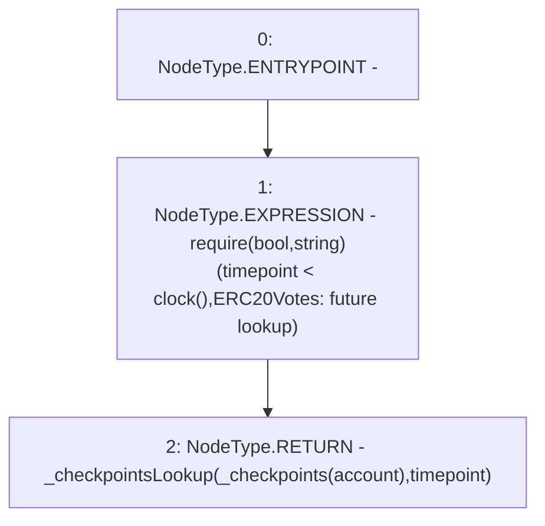

# Context: XVader.getPastVotes

**Contract:** `XVader` (Inherits: ReentrancyGuard, ERC20Votes, IERC5805, IVotes, IERC6372, ERC20Permit, EIP712, IERC5267, IERC20Permit, ERC20, IERC20Metadata, IERC20, Context, ProtocolConstants)
**Signature:** `getPastVotes(address,uint256) returns (uint256)`
**Method Selector ID:** `0x3a46b1a8`
**Visibility:** `public`
**Environment-Free:** `No (reads EVM state context)`
**Modifiers:** None

### State Variables Interaction
- **Reads:** _checkpoints
- **Writes:** None

### Assertion Checks & Business Requirements
- require/assert: `require(bool,string)(timepoint < clock(),ERC20Votes: future lookup)`

### Environment & Verification Flags
- **Uses Foundry Cheatcodes:** No
- **Has Echidna Properties:** No

### Internal Calls Tree
- None

### External Calls / Value Transfers
- None

### Control Flow Graph (CFG)


### Source Mapping
Declared in: `certora-ac-datasets/detasets/web3bugs/dataset/web3bugs/52/node_modules/@openzeppelin/contracts/token/ERC20/extensions/ERC20Votes.sol` on lines **95** to **98**

```solidity
    function getPastVotes(address account, uint256 timepoint) public view virtual override returns (uint256) {
        require(timepoint < clock(), "ERC20Votes: future lookup");
        return _checkpointsLookup(_checkpoints[account], timepoint);
    }

```
