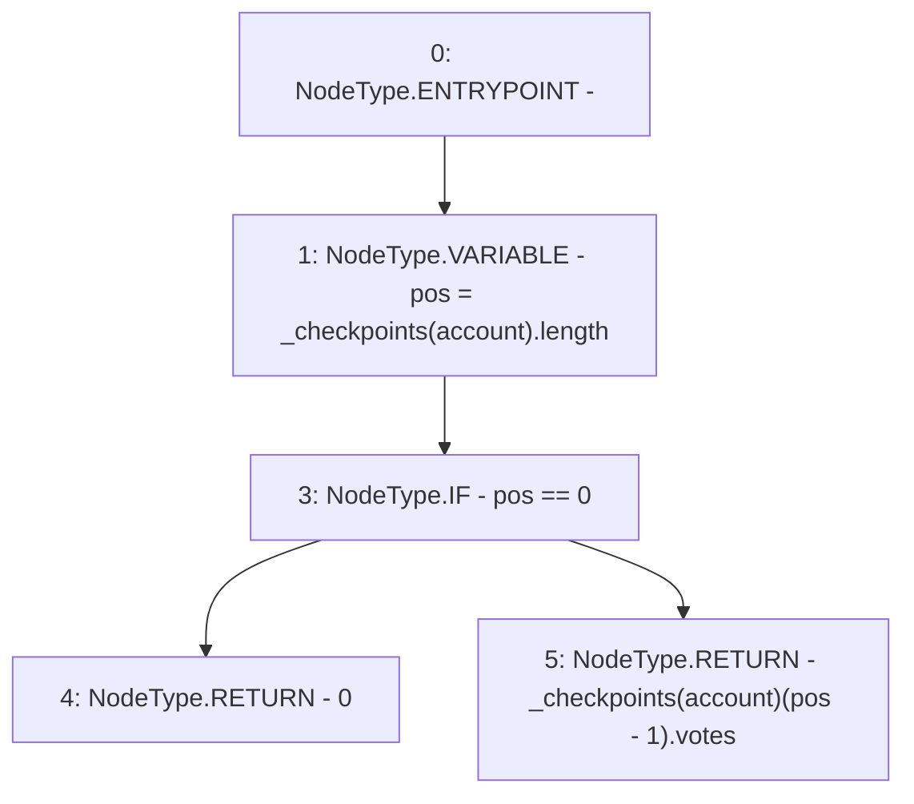

# Context: XVader.getVotes

**Contract:** `XVader` (Inherits: ReentrancyGuard, ERC20Votes, IERC5805, IVotes, IERC6372, ERC20Permit, EIP712, IERC5267, IERC20Permit, ERC20, IERC20Metadata, IERC20, Context, ProtocolConstants)
**Signature:** `getVotes(address) returns (uint256)`
**Method Selector ID:** `0x9ab24eb0`
**Visibility:** `public`
**Environment-Free:** `Yes`
**Modifiers:** None

### State Variables Interaction
- **Reads:** _checkpoints
- **Writes:** None

### Environment & Verification Flags
- **Uses Foundry Cheatcodes:** No
- **Has Echidna Properties:** No

### Internal Calls Tree
- None

### External Calls / Value Transfers
- None

### Control Flow Graph (CFG)


### Source Mapping
Declared in: `certora-ac-datasets/detasets/web3bugs/dataset/web3bugs/52/node_modules/@openzeppelin/contracts/token/ERC20/extensions/ERC20Votes.sol` on lines **81** to **86**

```solidity
    function getVotes(address account) public view virtual override returns (uint256) {
        uint256 pos = _checkpoints[account].length;
        unchecked {
            return pos == 0 ? 0 : _checkpoints[account][pos - 1].votes;
        }
    }

```
