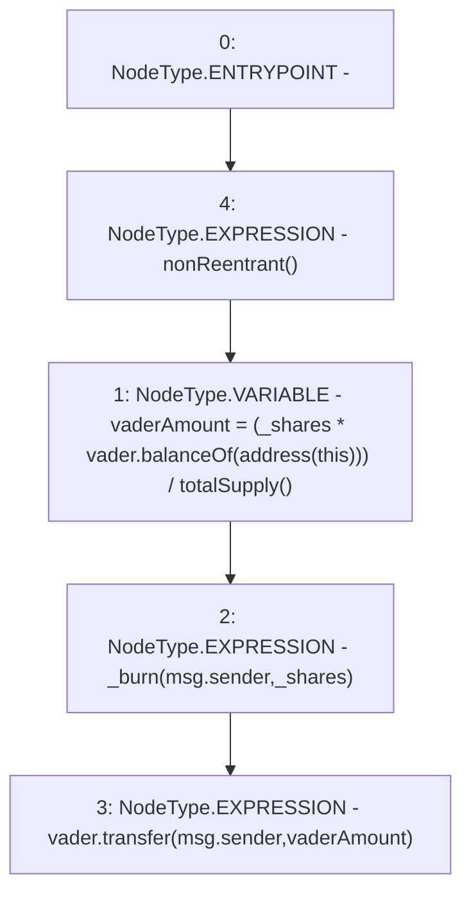

# Context: XVader.leave

**Contract:** `XVader` (Inherits: ReentrancyGuard, ERC20Votes, IERC5805, IVotes, IERC6372, ERC20Permit, EIP712, IERC5267, IERC20Permit, ERC20, IERC20Metadata, IERC20, Context, ProtocolConstants)
**Signature:** `leave(uint256)`
**Method Selector ID:** `0x67dfd4c9`
**Visibility:** `external`
**Environment-Free:** `No (reads EVM state context)`
**Modifiers:**
- `nonReentrant`
  ```solidity
  modifier nonReentrant() {
          _nonReentrantBefore();
          _;
          _nonReentrantAfter();
      }
  ```

### State Variables Interaction
- **Reads:** vader
- **Writes:** None

### Environment & Verification Flags
- **Uses Foundry Cheatcodes:** No
- **Has Echidna Properties:** No

### Internal Calls Tree
- None

### External Calls / Value Transfers
- `IERC20.TMP_1172(bool) = HIGH_LEVEL_CALL, dest:vader(IERC20), function:transfer, arguments:['msg.sender', 'vaderAmount']  `
- `IERC20.TMP_1167(uint256) = HIGH_LEVEL_CALL, dest:vader(IERC20), function:balanceOf, arguments:['TMP_1166']  `

### Control Flow Graph (CFG)


### Source Mapping
Declared in: `certora-ac-datasets/detasets/web3bugs/dataset/web3bugs/52/contracts/x-vader/XVader.sol` on lines **51** to **57**

```solidity
    function leave(uint256 _shares) external nonReentrant {
        // Calculates the amount of vader the xVader is worth
        uint vaderAmount = (_shares * vader.balanceOf(address(this))) / totalSupply();

        _burn(msg.sender, _shares);
        vader.transfer(msg.sender, vaderAmount);
    }

```
