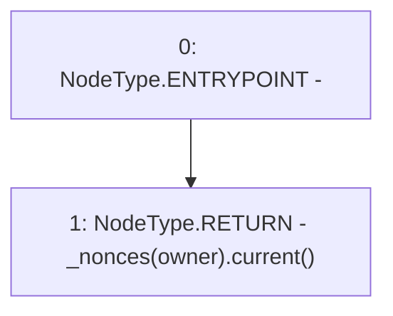

# Context: XVader.nonces

**Contract:** `XVader` (Inherits: ReentrancyGuard, ERC20Votes, IERC5805, IVotes, IERC6372, ERC20Permit, EIP712, IERC5267, IERC20Permit, ERC20, IERC20Metadata, IERC20, Context, ProtocolConstants)
**Signature:** `nonces(address) returns (uint256)`
**Method Selector ID:** `0x7ecebe00`
**Visibility:** `public`
**Environment-Free:** `Yes`
**Modifiers:** None

### State Variables Interaction
- **Reads:** _nonces
- **Writes:** None

### Environment & Verification Flags
- **Uses Foundry Cheatcodes:** No
- **Has Echidna Properties:** No

### Internal Calls Tree
- None

### External Calls / Value Transfers
- `Counters.TMP_1056(uint256) = LIBRARY_CALL, dest:Counters, function:Counters.current(Counters.Counter), arguments:['REF_174'] `

### Control Flow Graph (CFG)


### Source Mapping
Declared in: `certora-ac-datasets/detasets/web3bugs/dataset/web3bugs/52/node_modules/@openzeppelin/contracts/token/ERC20/extensions/ERC20Permit.sol` on lines **73** to **75**

```solidity
    function nonces(address owner) public view virtual override returns (uint256) {
        return _nonces[owner].current();
    }

```
