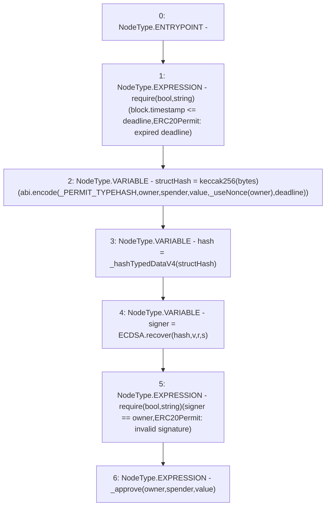

# Context: XVader.permit

**Contract:** `XVader` (Inherits: ReentrancyGuard, ERC20Votes, IERC5805, IVotes, IERC6372, ERC20Permit, EIP712, IERC5267, IERC20Permit, ERC20, IERC20Metadata, IERC20, Context, ProtocolConstants)
**Signature:** `permit(address,address,uint256,uint256,uint8,bytes32,bytes32)`
**Method Selector ID:** `0xd505accf`
**Visibility:** `public`
**Environment-Free:** `No (reads EVM state context)`
**Modifiers:** None

### State Variables Interaction
- **Reads:** _PERMIT_TYPEHASH
- **Writes:** None

### Assertion Checks & Business Requirements
- require/assert: `require(bool,string)(block.timestamp <= deadline,ERC20Permit: expired deadline)`
- require/assert: `require(bool,string)(signer == owner,ERC20Permit: invalid signature)`

### Environment & Verification Flags
- **Uses Foundry Cheatcodes:** No
- **Has Echidna Properties:** No

### Internal Calls Tree
- None

### External Calls / Value Transfers
- `ECDSA.TMP_1052(address) = LIBRARY_CALL, dest:ECDSA, function:ECDSA.recover(bytes32,uint8,bytes32,bytes32), arguments:['hash', 'v', 'r', 's'] `

### Control Flow Graph (CFG)


### Source Mapping
Declared in: `certora-ac-datasets/detasets/web3bugs/dataset/web3bugs/52/node_modules/@openzeppelin/contracts/token/ERC20/extensions/ERC20Permit.sol` on lines **49** to **68**

```solidity
    function permit(
        address owner,
        address spender,
        uint256 value,
        uint256 deadline,
        uint8 v,
        bytes32 r,
        bytes32 s
    ) public virtual override {
        require(block.timestamp <= deadline, "ERC20Permit: expired deadline");

        bytes32 structHash = keccak256(abi.encode(_PERMIT_TYPEHASH, owner, spender, value, _useNonce(owner), deadline));

        bytes32 hash = _hashTypedDataV4(structHash);

        address signer = ECDSA.recover(hash, v, r, s);
        require(signer == owner, "ERC20Permit: invalid signature");

        _approve(owner, spender, value);
    }

```
