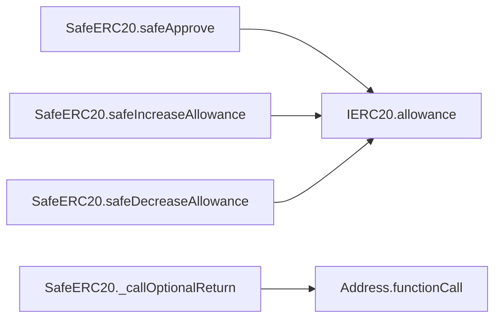
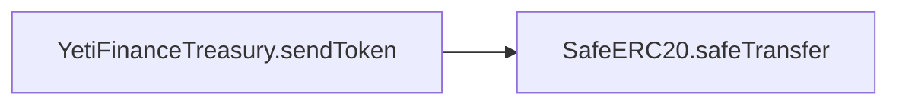
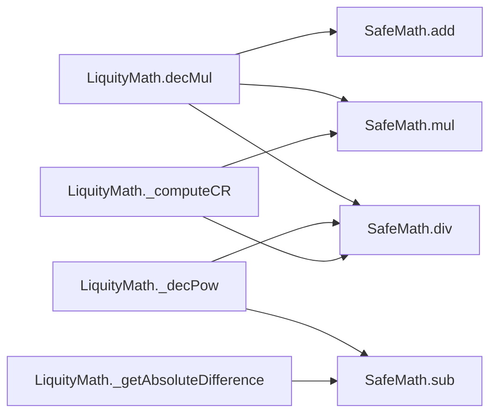

```mermaid
flowchart LR
    BorrowerOperations._getCompositeDebt --> SafeMath.add
    BorrowerOperations._getNetDebt --> SafeMath.sub
    BorrowerOperations.getEntireSystemColl --> SafeMath.add
    BorrowerOperations.getEntireSystemColl --> IActivePool.getVC
    BorrowerOperations.getEntireSystemColl --> IDefaultPool.getVC
    BorrowerOperations.getEntireSystemDebt --> SafeMath.add
    BorrowerOperations.getEntireSystemDebt --> IActivePool.getYUSDDebt
    BorrowerOperations.getEntireSystemDebt --> IDefaultPool.getYUSDDebt
    BorrowerOperations._getICRColls --> LiquityMath._computeCR
    BorrowerOperations._getVC --> SafeMath.add
    BorrowerOperations._getVC --> IWhitelist.getValueVC
    BorrowerOperations._getVCColls --> IWhitelist.getValueVC
    BorrowerOperations._getVCColls --> SafeMath.add
    BorrowerOperations._getUSDColls --> IWhitelist.getValueUSD
    BorrowerOperations._getUSDColls --> SafeMath.add
    BorrowerOperations._getTCR --> LiquityMath._computeCR
    BorrowerOperations._requireUserAcceptsFee --> SafeMath.mul
    BorrowerOperations._requireUserAcceptsFee --> SafeMath.div
    BorrowerOperations._checkPotentialRecoveryMode --> LiquityMath._computeCR
    BorrowerOperations._sumColls --> SafeMath.add
    BorrowerOperations._sumColls --> IWhitelist.getValidCollateral
    BorrowerOperations._sumColls --> IWhitelist.getIndex
    BorrowerOperations._leftSumColls --> SafeMath.add
    BorrowerOperations._leftSumColls --> IWhitelist.getIndex
    BorrowerOperations._leftSubColls --> IWhitelist.getIndex
    BorrowerOperations._leftSubColls --> SafeMath.sub
    BorrowerOperations._subColls --> SafeMath.sub
    BorrowerOperations._subColls --> IWhitelist.getValidCollateral
    BorrowerOperations._subColls --> IWhitelist.getIndex
    BorrowerOperations.openTroveLeverUp --> SafeMath.add
    BorrowerOperations._singleLeverUp --> SafeMath.mul
    BorrowerOperations._singleLeverUp --> IYUSDToken.mint
    BorrowerOperations._singleLeverUp --> IYUSDToken.approve
    BorrowerOperations._singleLeverUp --> SafeMath.div
    BorrowerOperations._singleLeverUp --> IYetiRouter.route
    BorrowerOperations._singleLeverUp --> IWhitelist.getDefaultRouterAddress
    BorrowerOperations._singleLeverUp --> SafeMath.sub
    BorrowerOperations._singleLeverUp --> IERC20.balanceOf
    BorrowerOperations._singleLeverUp --> SafeMath.add
    BorrowerOperations._singleLeverUp --> IWhitelist.getValueUSD
    BorrowerOperations._openTroveInternal --> ITroveManager.updateTroveRewardSnapshots
    BorrowerOperations._openTroveInternal --> SafeMath.add
    BorrowerOperations._openTroveInternal --> SafeMath.sub
    BorrowerOperations._openTroveInternal --> ITroveManager.setTroveStatus
    BorrowerOperations._openTroveInternal --> ITroveManager.updateStakeAndTotalStakes
    BorrowerOperations._openTroveInternal --> LiquityMath._computeCR
    BorrowerOperations._openTroveInternal --> ITroveManager.updateTroveColl
    BorrowerOperations._openTroveInternal --> ISortedTroves.insert
    BorrowerOperations._openTroveInternal --> IActivePool.receiveCollateral
    BorrowerOperations._openTroveInternal --> SafeMath.mul
    BorrowerOperations._openTroveInternal --> ITroveManager.increaseTroveDebt
    BorrowerOperations._openTroveInternal --> ITroveManager.addTroveOwnerToArray
    BorrowerOperations._openTroveInternal --> SafeMath.div
    BorrowerOperations.addCollLeverUp --> SafeMath.add
    BorrowerOperations._adjustTrove --> IActivePool.sendCollateralsUnwrap
    BorrowerOperations._adjustTrove --> LiquityMath._computeCR
    BorrowerOperations._adjustTrove --> SafeMath.sub
    BorrowerOperations._adjustTrove --> ITroveManager.updateStakeAndTotalStakes
    BorrowerOperations._adjustTrove --> SafeMath.add
    BorrowerOperations._adjustTrove --> ITroveManager.applyPendingRewards
    BorrowerOperations._adjustTrove --> SafeMath.mul
    BorrowerOperations._adjustTrove --> ITroveManager.getTroveColls
    BorrowerOperations._adjustTrove --> SafeMath.div
    BorrowerOperations._adjustTrove --> ITroveManager.getTroveDebt
    BorrowerOperations._adjustTrove --> LiquityMath._max
    BorrowerOperations._adjustTrove --> ISortedTroves.reInsert
    BorrowerOperations._adjustTrove --> IActivePool.receiveCollateral
    BorrowerOperations._singleUnleverUp --> SafeMath.mul
    BorrowerOperations._singleUnleverUp --> IYetiRouter.unRoute
    BorrowerOperations._singleUnleverUp --> SafeMath.div
    BorrowerOperations._singleUnleverUp --> IERC20.approve
    BorrowerOperations._singleUnleverUp --> IWhitelist.getDefaultRouterAddress
    BorrowerOperations._singleUnleverUp --> IERC20.balanceOf
    BorrowerOperations._singleUnleverUp --> SafeMath.add
    BorrowerOperations._singleUnleverUp --> IWhitelist.getValueUSD
    BorrowerOperations._singleUnleverUp --> IYUSDToken.balanceOf
    BorrowerOperations._singleUnleverUp --> SafeMath.sub
    BorrowerOperations._unleverColls --> IActivePool.sendSingleCollateral
    BorrowerOperations._unleverColls --> IActivePool.sendSingleCollateralUnwrap
    BorrowerOperations._closeTrove --> ITroveManager.getTroveColls
    BorrowerOperations._closeTrove --> SafeMath.sub
    BorrowerOperations._closeTrove --> ITroveManager.closeTrove
    BorrowerOperations._closeTrove --> ITroveManager.getTroveDebt
    BorrowerOperations._closeTrove --> IActivePool.sendCollateralsUnwrap
    BorrowerOperations._closeTrove --> ITroveManager.removeStake
    BorrowerOperations._closeTrove --> ITroveManager.applyPendingRewards
    BorrowerOperations._closeTrove --> ITroveManager.getTroveVC
    BorrowerOperations.claimCollateral --> ICollSurplusPool.claimColl
    BorrowerOperations._getTotalVariableDepositFee --> IDefaultPool.getCollateralVC
    BorrowerOperations._getTotalVariableDepositFee --> SafeMath.add
    BorrowerOperations._getTotalVariableDepositFee --> IActivePool.getVC
    BorrowerOperations._getTotalVariableDepositFee --> IDefaultPool.getVC
    BorrowerOperations._getTotalVariableDepositFee --> SafeMath.sub
    BorrowerOperations._getTotalVariableDepositFee --> SafeMath.mul
    BorrowerOperations._getTotalVariableDepositFee --> IWhitelist.getFeeAndUpdate
    BorrowerOperations._getTotalVariableDepositFee --> IWhitelist.getValueVC
    BorrowerOperations._getTotalVariableDepositFee --> LiquityMath._min
    BorrowerOperations._getTotalVariableDepositFee --> SafeMath.div
    BorrowerOperations._getTotalVariableDepositFee --> IActivePool.getCollateralVC
    BorrowerOperations._singleTransferCollateralIntoActivePool --> IERC20.transferFrom
    BorrowerOperations._singleTransferCollateralIntoActivePool --> IWhitelist.isWrapped
    BorrowerOperations._singleTransferCollateralIntoActivePool --> IWAsset.wrap
    BorrowerOperations._triggerBorrowingFee --> ITroveManager.getBorrowingFee
    BorrowerOperations._triggerBorrowingFee --> IYUSDToken.mint
    BorrowerOperations._triggerBorrowingFee --> ITroveManager.decayBaseRateFromBorrowing
    BorrowerOperations._triggerDepositFee --> IYUSDToken.mint
    BorrowerOperations._updateTroveFromAdjustment --> ITroveManager.decreaseTroveDebt
    BorrowerOperations._updateTroveFromAdjustment --> ITroveManager.updateTroveColl
    BorrowerOperations._updateTroveFromAdjustment --> SafeMath.add
    BorrowerOperations._updateTroveFromAdjustment --> ITroveManager.increaseTroveDebt
    BorrowerOperations._withdrawYUSD --> IActivePool.increaseYUSDDebt
    BorrowerOperations._withdrawYUSD --> IYUSDToken.mint
    BorrowerOperations._repayYUSD --> IActivePool.decreaseYUSDDebt
    BorrowerOperations._repayYUSD --> IYUSDToken.burn
    BorrowerOperations._requireValidDepositCollateral --> IWhitelist.getIsActive
    BorrowerOperations._requireTroveisActive --> ITroveManager.isTroveActive
    BorrowerOperations._requireTroveisNotActive --> ITroveManager.isTroveActive
    BorrowerOperations._requireNoDuplicateColls --> SafeMath.add
    BorrowerOperations._requireValidYUSDRepayment --> SafeMath.sub
    BorrowerOperations._requireSufficientYUSDBalance --> IYUSDToken.balanceOf
    BorrowerOperations._getNewICRFromTroveChange --> SafeMath.add
    BorrowerOperations._getNewICRFromTroveChange --> SafeMath.sub
    BorrowerOperations._getNewICRFromTroveChange --> LiquityMath._computeCR
    BorrowerOperations._getNewTCRFromTroveChange --> LiquityMath._computeCR
    BorrowerOperations._getNewTCRFromTroveChange --> SafeMath.add
    BorrowerOperations._getNewTCRFromTroveChange --> SafeMath.sub
```

# 🧬 Flow Graphs, Constructor Sequences & SSA Representations

## Contract: Address
### Linearised Constructor Execution sequence
- No constructors configured in hierarchy.

### Inter-Contract & Function Call Graph (Mermaid)
```mermaid
flowchart LR
```

### Functions Intermediate Code Operations (SlithIR & SSA)

---

## Contract: SafeERC20
### Linearised Constructor Execution sequence
- No constructors configured in hierarchy.

### Inter-Contract & Function Call Graph (Mermaid)


### Functions Intermediate Code Operations (SlithIR & SSA)

---

## Contract: IERC20
### Linearised Constructor Execution sequence
- No constructors configured in hierarchy.

### Inter-Contract & Function Call Graph (Mermaid)
```mermaid
flowchart LR
```

### Functions Intermediate Code Operations (SlithIR & SSA)
#### Function: `totalSupply`
<details><summary>View SlithIR Operations</summary>

```
No SlithIR operations.
```
</details>
<details><summary>View SSA Operations</summary>

```
No SSA operations.
```
</details>

#### Function: `balanceOf`
<details><summary>View SlithIR Operations</summary>

```
No SlithIR operations.
```
</details>
<details><summary>View SSA Operations</summary>

```
No SSA operations.
```
</details>

#### Function: `transfer`
<details><summary>View SlithIR Operations</summary>

```
No SlithIR operations.
```
</details>
<details><summary>View SSA Operations</summary>

```
No SSA operations.
```
</details>

#### Function: `allowance`
<details><summary>View SlithIR Operations</summary>

```
No SlithIR operations.
```
</details>
<details><summary>View SSA Operations</summary>

```
No SSA operations.
```
</details>

#### Function: `increaseAllowance`
<details><summary>View SlithIR Operations</summary>

```
No SlithIR operations.
```
</details>
<details><summary>View SSA Operations</summary>

```
No SSA operations.
```
</details>

#### Function: `decreaseAllowance`
<details><summary>View SlithIR Operations</summary>

```
No SlithIR operations.
```
</details>
<details><summary>View SSA Operations</summary>

```
No SSA operations.
```
</details>

#### Function: `approve`
<details><summary>View SlithIR Operations</summary>

```
No SlithIR operations.
```
</details>
<details><summary>View SSA Operations</summary>

```
No SSA operations.
```
</details>

#### Function: `transferFrom`
<details><summary>View SlithIR Operations</summary>

```
No SlithIR operations.
```
</details>
<details><summary>View SSA Operations</summary>

```
No SSA operations.
```
</details>

#### Function: `name`
<details><summary>View SlithIR Operations</summary>

```
No SlithIR operations.
```
</details>
<details><summary>View SSA Operations</summary>

```
No SSA operations.
```
</details>

#### Function: `symbol`
<details><summary>View SlithIR Operations</summary>

```
No SlithIR operations.
```
</details>
<details><summary>View SSA Operations</summary>

```
No SSA operations.
```
</details>

#### Function: `decimals`
<details><summary>View SlithIR Operations</summary>

```
No SlithIR operations.
```
</details>
<details><summary>View SSA Operations</summary>

```
No SSA operations.
```
</details>


---

## Contract: YetiFinanceTreasury
### Linearised Constructor Execution sequence
- No constructors configured in hierarchy.

### Inter-Contract & Function Call Graph (Mermaid)


### Functions Intermediate Code Operations (SlithIR & SSA)
#### Function: `sendToken`
<details><summary>View SlithIR Operations</summary>

```
LIBRARY_CALL, dest:SafeERC20, function:SafeERC20.safeTransfer(IERC20,address,uint256), arguments:['_token', '_to', '_amount'] 
MODIFIER_CALL, YetiFinanceTreasury.onlyTeam()()
```
</details>
<details><summary>View SSA Operations</summary>

```
No SSA operations.
```
</details>

#### Function: `updateTeamWallet`
<details><summary>View SlithIR Operations</summary>

```
TMP_61 = CONVERT 0 to address
TMP_62(bool) = _newTeamWallet != TMP_61
TMP_63(None) = SOLIDITY_CALL require(bool,string)(TMP_62,New team wallet cannot be 0)
teamWallet(address) := _newTeamWallet(address)
Emit teamWalletUpdated(_newTeamWallet)
MODIFIER_CALL, YetiFinanceTreasury.onlyTeam()()
```
</details>
<details><summary>View SSA Operations</summary>

```
No SSA operations.
```
</details>

#### Function: `getTeamWallet`
<details><summary>View SlithIR Operations</summary>

```
RETURN teamWallet
```
</details>
<details><summary>View SSA Operations</summary>

```
No SSA operations.
```
</details>


---

## Contract: BorrowerOperations
### Linearised Constructor Execution sequence
1. `Ownable.constructor()`
2. `ReentrancyGuard.constructor()`

### Inter-Contract & Function Call Graph (Mermaid)


### Functions Intermediate Code Operations (SlithIR & SSA)
#### Function: `setAddresses`
<details><summary>View SlithIR Operations</summary>

```
No SlithIR operations.
```
</details>
<details><summary>View SSA Operations</summary>

```
No SSA operations.
```
</details>

#### Function: `openTrove`
<details><summary>View SlithIR Operations</summary>

```
No SlithIR operations.
```
</details>
<details><summary>View SSA Operations</summary>

```
No SSA operations.
```
</details>

#### Function: `openTroveLeverUp`
<details><summary>View SlithIR Operations</summary>

```
No SlithIR operations.
```
</details>
<details><summary>View SSA Operations</summary>

```
No SSA operations.
```
</details>

#### Function: `closeTroveUnlever`
<details><summary>View SlithIR Operations</summary>

```
No SlithIR operations.
```
</details>
<details><summary>View SSA Operations</summary>

```
No SSA operations.
```
</details>

#### Function: `closeTrove`
<details><summary>View SlithIR Operations</summary>

```
No SlithIR operations.
```
</details>
<details><summary>View SSA Operations</summary>

```
No SSA operations.
```
</details>

#### Function: `adjustTrove`
<details><summary>View SlithIR Operations</summary>

```
No SlithIR operations.
```
</details>
<details><summary>View SSA Operations</summary>

```
No SSA operations.
```
</details>

#### Function: `addColl`
<details><summary>View SlithIR Operations</summary>

```
No SlithIR operations.
```
</details>
<details><summary>View SSA Operations</summary>

```
No SSA operations.
```
</details>

#### Function: `addCollLeverUp`
<details><summary>View SlithIR Operations</summary>

```
No SlithIR operations.
```
</details>
<details><summary>View SSA Operations</summary>

```
No SSA operations.
```
</details>

#### Function: `withdrawColl`
<details><summary>View SlithIR Operations</summary>

```
No SlithIR operations.
```
</details>
<details><summary>View SSA Operations</summary>

```
No SSA operations.
```
</details>

#### Function: `withdrawCollUnleverUp`
<details><summary>View SlithIR Operations</summary>

```
No SlithIR operations.
```
</details>
<details><summary>View SSA Operations</summary>

```
No SSA operations.
```
</details>

#### Function: `withdrawYUSD`
<details><summary>View SlithIR Operations</summary>

```
No SlithIR operations.
```
</details>
<details><summary>View SSA Operations</summary>

```
No SSA operations.
```
</details>

#### Function: `repayYUSD`
<details><summary>View SlithIR Operations</summary>

```
No SlithIR operations.
```
</details>
<details><summary>View SSA Operations</summary>

```
No SSA operations.
```
</details>

#### Function: `claimCollateral`
<details><summary>View SlithIR Operations</summary>

```
No SlithIR operations.
```
</details>
<details><summary>View SSA Operations</summary>

```
No SSA operations.
```
</details>

#### Function: `getCompositeDebt`
<details><summary>View SlithIR Operations</summary>

```
No SlithIR operations.
```
</details>
<details><summary>View SSA Operations</summary>

```
No SSA operations.
```
</details>

#### Function: `owner`
<details><summary>View SlithIR Operations</summary>

```
RETURN _owner
```
</details>
<details><summary>View SSA Operations</summary>

```
No SSA operations.
```
</details>

#### Function: `isOwner`
<details><summary>View SlithIR Operations</summary>

```
TMP_7(bool) = msg.sender == _owner
RETURN TMP_7
```
</details>
<details><summary>View SSA Operations</summary>

```
No SSA operations.
```
</details>

#### Function: `getEntireSystemColl`
<details><summary>View SlithIR Operations</summary>

```
TMP_13(uint256) = HIGH_LEVEL_CALL, dest:activePool(IActivePool), function:getVC, arguments:[]  
activeColl(uint256) := TMP_13(uint256)
TMP_14(uint256) = HIGH_LEVEL_CALL, dest:defaultPool(IDefaultPool), function:getVC, arguments:[]  
liquidatedColl(uint256) := TMP_14(uint256)
TMP_15(uint256) = LIBRARY_CALL, dest:SafeMath, function:SafeMath.add(uint256,uint256), arguments:['activeColl', 'liquidatedColl'] 
RETURN TMP_15
```
</details>
<details><summary>View SSA Operations</summary>

```
No SSA operations.
```
</details>

#### Function: `getEntireSystemDebt`
<details><summary>View SlithIR Operations</summary>

```
TMP_16(uint256) = HIGH_LEVEL_CALL, dest:activePool(IActivePool), function:getYUSDDebt, arguments:[]  
activeDebt(uint256) := TMP_16(uint256)
TMP_17(uint256) = HIGH_LEVEL_CALL, dest:defaultPool(IDefaultPool), function:getYUSDDebt, arguments:[]  
closedDebt(uint256) := TMP_17(uint256)
TMP_18(uint256) = LIBRARY_CALL, dest:SafeMath, function:SafeMath.add(uint256,uint256), arguments:['activeDebt', 'closedDebt'] 
RETURN TMP_18
```
</details>
<details><summary>View SSA Operations</summary>

```
No SSA operations.
```
</details>

#### Function: `getEntireSystemDebt`
<details><summary>View SlithIR Operations</summary>

```
No SlithIR operations.
```
</details>
<details><summary>View SSA Operations</summary>

```
No SSA operations.
```
</details>

#### Function: `setAddresses`
<details><summary>View SlithIR Operations</summary>

```
TMP_103(bool) = MIN_NET_DEBT != 0
TMP_104(None) = SOLIDITY_CALL require(bool,string)(TMP_103,BO:MIN_NET_DEBT==0)
deploymentTime(uint256) := block.timestamp(uint256)
INTERNAL_CALL, CheckContract.checkContract(address)(_troveManagerAddress)
INTERNAL_CALL, CheckContract.checkContract(address)(_activePoolAddress)
INTERNAL_CALL, CheckContract.checkContract(address)(_defaultPoolAddress)
INTERNAL_CALL, CheckContract.checkContract(address)(_stabilityPoolAddress)
INTERNAL_CALL, CheckContract.checkContract(address)(_gasPoolAddress)
INTERNAL_CALL, CheckContract.checkContract(address)(_collSurplusPoolAddress)
INTERNAL_CALL, CheckContract.checkContract(address)(_sortedTrovesAddress)
INTERNAL_CALL, CheckContract.checkContract(address)(_yusdTokenAddress)
INTERNAL_CALL, CheckContract.checkContract(address)(_sYETIAddress)
INTERNAL_CALL, CheckContract.checkContract(address)(_whitelistAddress)
TMP_115 = CONVERT _troveManagerAddress to ITroveManager
troveManager(ITroveManager) := TMP_115(ITroveManager)
TMP_116 = CONVERT _activePoolAddress to IActivePool
activePool(IActivePool) := TMP_116(IActivePool)
TMP_117 = CONVERT _defaultPoolAddress to IDefaultPool
defaultPool(IDefaultPool) := TMP_117(IDefaultPool)
TMP_118 = CONVERT _whitelistAddress to IWhitelist
whitelist(IWhitelist) := TMP_118(IWhitelist)
stabilityPoolAddress(address) := _stabilityPoolAddress(address)
gasPoolAddress(address) := _gasPoolAddress(address)
TMP_119 = CONVERT _collSurplusPoolAddress to ICollSurplusPool
collSurplusPool(ICollSurplusPool) := TMP_119(ICollSurplusPool)
TMP_120 = CONVERT _sortedTrovesAddress to ISortedTroves
sortedTroves(ISortedTroves) := TMP_120(ISortedTroves)
TMP_121 = CONVERT _yusdTokenAddress to IYUSDToken
yusdToken(IYUSDToken) := TMP_121(IYUSDToken)
sYETIAddress(address) := _sYETIAddress(address)
Emit TroveManagerAddressChanged(_troveManagerAddress)
Emit ActivePoolAddressChanged(_activePoolAddress)
Emit DefaultPoolAddressChanged(_defaultPoolAddress)
Emit StabilityPoolAddressChanged(_stabilityPoolAddress)
Emit GasPoolAddressChanged(_gasPoolAddress)
Emit CollSurplusPoolAddressChanged(_collSurplusPoolAddress)
Emit SortedTrovesAddressChanged(_sortedTrovesAddress)
Emit YUSDTokenAddressChanged(_yusdTokenAddress)
Emit SYETIAddressChanged(_sYETIAddress)
INTERNAL_CALL, Ownable._renounceOwnership()()
MODIFIER_CALL, Ownable.onlyOwner()()
```
</details>
<details><summary>View SSA Operations</summary>

```
No SSA operations.
```
</details>

#### Function: `openTrove`
<details><summary>View SlithIR Operations</summary>

```
REF_141 -> LENGTH _amounts
INTERNAL_CALL, BorrowerOperations._requireLengthNonzero(uint256)(REF_141)
INTERNAL_CALL, BorrowerOperations._requireValidDepositCollateral(address[],uint256[])(_colls,_amounts)
INTERNAL_CALL, BorrowerOperations._requireNoDuplicateColls(address[])(_colls)
INTERNAL_CALL, BorrowerOperations._transferCollateralsIntoActivePool(address,address[],uint256[])(msg.sender,_colls,_amounts)
INTERNAL_CALL, BorrowerOperations._openTroveInternal(address,uint256,uint256,uint256,address,address,address[],uint256[])(msg.sender,_maxFeePercentage,_YUSDAmount,0,_upperHint,_lowerHint,_colls,_amounts)
MODIFIER_CALL, ReentrancyGuard.nonReentrant()()
```
</details>
<details><summary>View SSA Operations</summary>

```
No SSA operations.
```
</details>

#### Function: `openTroveLeverUp`
<details><summary>View SlithIR Operations</summary>

```
REF_142 -> LENGTH _colls
collsLen(uint256) := REF_142(uint256)
INTERNAL_CALL, BorrowerOperations._requireLengthNonzero(uint256)(collsLen)
INTERNAL_CALL, BorrowerOperations._requireValidDepositCollateral(address[],uint256[])(_colls,_amounts)
REF_143 -> LENGTH _leverages
INTERNAL_CALL, BorrowerOperations._requireLengthsEqual(uint256,uint256)(collsLen,REF_143)
REF_144 -> LENGTH _maxSlippages
INTERNAL_CALL, BorrowerOperations._requireLengthsEqual(uint256,uint256)(collsLen,REF_144)
INTERNAL_CALL, BorrowerOperations._requireNoDuplicateColls(address[])(_colls)
TMP_144(bool) = i < collsLen
CONDITION TMP_144
REF_145(uint256) -> _leverages[i]
TMP_145(bool) = REF_145 != 0
CONDITION TMP_145
REF_146(address) -> _colls[i]
REF_147(uint256) -> _amounts[i]
REF_148(uint256) -> _leverages[i]
REF_149(uint256) -> _maxSlippages[i]
TUPLE_0(uint256,uint256) = INTERNAL_CALL, BorrowerOperations._singleLeverUp(address,uint256,uint256,uint256)(REF_146,REF_147,REF_148,REF_149)
additionalTokenAmount(uint256)= UNPACK TUPLE_0 index: 0 
additionalYUSDDebt(uint256)= UNPACK TUPLE_0 index: 1 
REF_150(address) -> _colls[i]
REF_151(uint256) -> _amounts[i]
INTERNAL_CALL, BorrowerOperations._singleTransferCollateralIntoActivePool(address,address,uint256)(msg.sender,REF_150,REF_151)
REF_152(uint256) -> _amounts[i]
REF_154(uint256) -> _amounts[i]
TMP_147(uint256) = LIBRARY_CALL, dest:SafeMath, function:SafeMath.add(uint256,uint256), arguments:['additionalTokenAmount', 'REF_154'] 
REF_152(uint256) (->_amounts) := TMP_147(uint256)
TMP_148(uint256) = LIBRARY_CALL, dest:SafeMath, function:SafeMath.add(uint256,uint256), arguments:['totalYUSDDebtFromLever', 'additionalYUSDDebt'] 
totalYUSDDebtFromLever(uint256) := TMP_148(uint256)
REF_156(address) -> _colls[i]
REF_157(uint256) -> _amounts[i]
INTERNAL_CALL, BorrowerOperations._singleTransferCollateralIntoActivePool(address,address,uint256)(msg.sender,REF_156,REF_157)
i(uint256) = i + 1
TMP_150(uint256) = LIBRARY_CALL, dest:SafeMath, function:SafeMath.add(uint256,uint256), arguments:['_YUSDAmount', 'totalYUSDDebtFromLever'] 
_YUSDAmount(uint256) := TMP_150(uint256)
INTERNAL_CALL, BorrowerOperations._openTroveInternal(address,uint256,uint256,uint256,address,address,address[],uint256[])(msg.sender,_maxFeePercentage,_YUSDAmount,totalYUSDDebtFromLever,_upperHint,_lowerHint,_colls,_amounts)
MODIFIER_CALL, ReentrancyGuard.nonReentrant()()
```
</details>
<details><summary>View SSA Operations</summary>

```
No SSA operations.
```
</details>

#### Function: `addColl`
<details><summary>View SlithIR Operations</summary>

```
REF_239(address[]) -> params._collsIn
REF_239(address[]) (->params) := _collsIn(address[])
REF_240(uint256[]) -> params._amountsIn
REF_240(uint256[]) (->params) := _amountsIn(uint256[])
REF_241(address) -> params._upperHint
REF_241(address) (->params) := _upperHint(address)
REF_242(address) -> params._lowerHint
REF_242(address) (->params) := _lowerHint(address)
REF_243(uint256) -> params._maxFeePercentage
REF_243(uint256) (->params) := _maxFeePercentage(uint256)
REF_244(uint256[]) -> params._amountsIn
INTERNAL_CALL, BorrowerOperations._requireValidDepositCollateral(address[],uint256[])(_collsIn,REF_244)
INTERNAL_CALL, BorrowerOperations._requireNoDuplicateColls(address[])(_collsIn)
REF_245(address[]) -> params._collsIn
REF_246(uint256[]) -> params._amountsIn
INTERNAL_CALL, BorrowerOperations._transferCollateralsIntoActivePool(address,address[],uint256[])(msg.sender,REF_245,REF_246)
INTERNAL_CALL, BorrowerOperations._adjustTrove(BorrowerOperations.AdjustTrove_Params)(params)
MODIFIER_CALL, ReentrancyGuard.nonReentrant()()
```
</details>
<details><summary>View SSA Operations</summary>

```
No SSA operations.
```
</details>

#### Function: `addCollLeverUp`
<details><summary>View SlithIR Operations</summary>

```
REF_247(address) -> params._upperHint
REF_247(address) (->params) := _upperHint(address)
REF_248(address) -> params._lowerHint
REF_248(address) (->params) := _lowerHint(address)
REF_249(uint256) -> params._maxFeePercentage
REF_249(uint256) (->params) := _maxFeePercentage(uint256)
REF_250 -> LENGTH _collsIn
collsLen(uint256) := REF_250(uint256)
INTERNAL_CALL, BorrowerOperations._requireValidDepositCollateral(address[],uint256[])(_collsIn,_amountsIn)
REF_251 -> LENGTH _leverages
INTERNAL_CALL, BorrowerOperations._requireLengthsEqual(uint256,uint256)(collsLen,REF_251)
REF_252 -> LENGTH _maxSlippages
INTERNAL_CALL, BorrowerOperations._requireLengthsEqual(uint256,uint256)(collsLen,REF_252)
REF_253(address[]) -> params._collsIn
INTERNAL_CALL, BorrowerOperations._requireNoDuplicateColls(address[])(REF_253)
TMP_224(bool) = i < collsLen
CONDITION TMP_224
REF_254(uint256) -> _leverages[i]
TMP_225(bool) = REF_254 != 0
CONDITION TMP_225
REF_255(address) -> _collsIn[i]
REF_256(uint256) -> _amountsIn[i]
REF_257(uint256) -> _leverages[i]
REF_258(uint256) -> _maxSlippages[i]
TUPLE_1(uint256,uint256) = INTERNAL_CALL, BorrowerOperations._singleLeverUp(address,uint256,uint256,uint256)(REF_255,REF_256,REF_257,REF_258)
additionalTokenAmount(uint256)= UNPACK TUPLE_1 index: 0 
additionalYUSDDebt(uint256)= UNPACK TUPLE_1 index: 1 
REF_259(address) -> _collsIn[i]
REF_260(uint256) -> _amountsIn[i]
INTERNAL_CALL, BorrowerOperations._singleTransferCollateralIntoActivePool(address,address,uint256)(msg.sender,REF_259,REF_260)
REF_261(uint256) -> _amountsIn[i]
REF_263(uint256) -> _amountsIn[i]
TMP_227(uint256) = LIBRARY_CALL, dest:SafeMath, function:SafeMath.add(uint256,uint256), arguments:['additionalTokenAmount', 'REF_263'] 
REF_261(uint256) (->_amountsIn) := TMP_227(uint256)
TMP_228(uint256) = LIBRARY_CALL, dest:SafeMath, function:SafeMath.add(uint256,uint256), arguments:['totalYUSDDebtFromLever', 'additionalYUSDDebt'] 
totalYUSDDebtFromLever(uint256) := TMP_228(uint256)
REF_265(address) -> _collsIn[i]
REF_266(uint256) -> _amountsIn[i]
INTERNAL_CALL, BorrowerOperations._singleTransferCollateralIntoActivePool(address,address,uint256)(msg.sender,REF_265,REF_266)
i(uint256) = i + 1
TMP_230(uint256) = LIBRARY_CALL, dest:SafeMath, function:SafeMath.add(uint256,uint256), arguments:['_YUSDAmount', 'totalYUSDDebtFromLever'] 
_YUSDAmount(uint256) := TMP_230(uint256)
REF_268(uint256) -> params._totalYUSDDebtFromLever
REF_268(uint256) (->params) := totalYUSDDebtFromLever(uint256)
REF_269(uint256) -> params._YUSDChange
REF_269(uint256) (->params) := _YUSDAmount(uint256)
REF_270(bool) -> params._isDebtIncrease
REF_270(bool) (->params) := True(bool)
REF_271(address[]) -> params._collsIn
REF_271(address[]) (->params) := _collsIn(address[])
REF_272(uint256[]) -> params._amountsIn
REF_272(uint256[]) (->params) := _amountsIn(uint256[])
INTERNAL_CALL, BorrowerOperations._adjustTrove(BorrowerOperations.AdjustTrove_Params)(params)
MODIFIER_CALL, ReentrancyGuard.nonReentrant()()
```
</details>
<details><summary>View SSA Operations</summary>

```
No SSA operations.
```
</details>

#### Function: `withdrawColl`
<details><summary>View SlithIR Operations</summary>

```
REF_273(address[]) -> params._collsOut
REF_273(address[]) (->params) := _collsOut(address[])
REF_274(uint256[]) -> params._amountsOut
REF_274(uint256[]) (->params) := _amountsOut(uint256[])
REF_275(address) -> params._upperHint
REF_275(address) (->params) := _upperHint(address)
REF_276(address) -> params._lowerHint
REF_276(address) (->params) := _lowerHint(address)
REF_277(address[]) -> params._collsOut
REF_278(uint256[]) -> params._amountsOut
INTERNAL_CALL, BorrowerOperations._requireValidDepositCollateral(address[],uint256[])(REF_277,REF_278)
REF_279(address[]) -> params._collsOut
INTERNAL_CALL, BorrowerOperations._requireNoDuplicateColls(address[])(REF_279)
INTERNAL_CALL, BorrowerOperations._adjustTrove(BorrowerOperations.AdjustTrove_Params)(params)
MODIFIER_CALL, ReentrancyGuard.nonReentrant()()
```
</details>
<details><summary>View SSA Operations</summary>

```
No SSA operations.
```
</details>

#### Function: `withdrawYUSD`
<details><summary>View SlithIR Operations</summary>

```
REF_280(uint256) -> params._YUSDChange
REF_280(uint256) (->params) := _YUSDAmount(uint256)
REF_281(uint256) -> params._maxFeePercentage
REF_281(uint256) (->params) := _maxFeePercentage(uint256)
REF_282(address) -> params._upperHint
REF_282(address) (->params) := _upperHint(address)
REF_283(address) -> params._lowerHint
REF_283(address) (->params) := _lowerHint(address)
REF_284(bool) -> params._isDebtIncrease
REF_284(bool) (->params) := True(bool)
INTERNAL_CALL, BorrowerOperations._adjustTrove(BorrowerOperations.AdjustTrove_Params)(params)
MODIFIER_CALL, ReentrancyGuard.nonReentrant()()
```
</details>
<details><summary>View SSA Operations</summary>

```
No SSA operations.
```
</details>

#### Function: `repayYUSD`
<details><summary>View SlithIR Operations</summary>

```
REF_285(uint256) -> params._YUSDChange
REF_285(uint256) (->params) := _YUSDAmount(uint256)
REF_286(address) -> params._upperHint
REF_286(address) (->params) := _upperHint(address)
REF_287(address) -> params._lowerHint
REF_287(address) (->params) := _lowerHint(address)
REF_288(bool) -> params._isDebtIncrease
REF_288(bool) (->params) := False(bool)
INTERNAL_CALL, BorrowerOperations._adjustTrove(BorrowerOperations.AdjustTrove_Params)(params)
MODIFIER_CALL, ReentrancyGuard.nonReentrant()()
```
</details>
<details><summary>View SSA Operations</summary>

```
No SSA operations.
```
</details>

#### Function: `adjustTrove`
<details><summary>View SlithIR Operations</summary>

```
INTERNAL_CALL, BorrowerOperations._requireValidDepositCollateral(address[],uint256[])(_collsIn,_amountsIn)
INTERNAL_CALL, BorrowerOperations._requireValidDepositCollateral(address[],uint256[])(_collsOut,_amountsOut)
INTERNAL_CALL, BorrowerOperations._requireNoOverlapColls(address[],address[])(_collsIn,_collsOut)
INTERNAL_CALL, BorrowerOperations._requireNoDuplicateColls(address[])(_collsIn)
INTERNAL_CALL, BorrowerOperations._requireNoDuplicateColls(address[])(_collsOut)
INTERNAL_CALL, BorrowerOperations._transferCollateralsIntoActivePool(address,address[],uint256[])(msg.sender,_collsIn,_amountsIn)
TMP_248(uint256[])  = new uint256[](0)
maxSlippages(uint256[]) = ['TMP_248(uint256[])']
TMP_249(BorrowerOperations.AdjustTrove_Params) = new AdjustTrove_Params(_collsIn,_amountsIn,_collsOut,_amountsOut,maxSlippages,_YUSDChange,0,_isDebtIncrease,False,_upperHint,_lowerHint,_maxFeePercentage)
params(BorrowerOperations.AdjustTrove_Params) := TMP_249(BorrowerOperations.AdjustTrove_Params)
INTERNAL_CALL, BorrowerOperations._adjustTrove(BorrowerOperations.AdjustTrove_Params)(params)
MODIFIER_CALL, ReentrancyGuard.nonReentrant()()
```
</details>
<details><summary>View SSA Operations</summary>

```
No SSA operations.
```
</details>

#### Function: `withdrawCollUnleverUp`
<details><summary>View SlithIR Operations</summary>

```
INTERNAL_CALL, BorrowerOperations._requireValidDepositCollateral(address[],uint256[])(_collsOut,_amountsOut)
INTERNAL_CALL, BorrowerOperations._requireNoDuplicateColls(address[])(_collsOut)
REF_474 -> LENGTH _amountsOut
REF_475 -> LENGTH _maxSlippages
INTERNAL_CALL, BorrowerOperations._requireLengthsEqual(uint256,uint256)(REF_474,REF_475)
REF_476(address[]) -> params._collsOut
REF_476(address[]) (->params) := _collsOut(address[])
REF_477(uint256[]) -> params._amountsOut
REF_477(uint256[]) (->params) := _amountsOut(uint256[])
REF_478(uint256[]) -> params._maxSlippages
REF_478(uint256[]) (->params) := _maxSlippages(uint256[])
REF_479(uint256) -> params._YUSDChange
REF_479(uint256) (->params) := _YUSDAmount(uint256)
REF_480(address) -> params._upperHint
REF_480(address) (->params) := _upperHint(address)
REF_481(address) -> params._lowerHint
REF_481(address) (->params) := _lowerHint(address)
REF_482(bool) -> params._isUnlever
REF_482(bool) (->params) := True(bool)
INTERNAL_CALL, BorrowerOperations._adjustTrove(BorrowerOperations.AdjustTrove_Params)(params)
MODIFIER_CALL, ReentrancyGuard.nonReentrant()()
```
</details>
<details><summary>View SSA Operations</summary>

```
No SSA operations.
```
</details>

#### Function: `closeTroveUnlever`
<details><summary>View SlithIR Operations</summary>

```
TMP_341(BorrowerOperations.CloseTrove_Params) = new CloseTrove_Params(_collsOut,_amountsOut,_maxSlippages,True)
params(BorrowerOperations.CloseTrove_Params) := TMP_341(BorrowerOperations.CloseTrove_Params)
INTERNAL_CALL, BorrowerOperations._closeTrove(BorrowerOperations.CloseTrove_Params)(params)
MODIFIER_CALL, ReentrancyGuard.nonReentrant()()
```
</details>
<details><summary>View SSA Operations</summary>

```
No SSA operations.
```
</details>

#### Function: `closeTrove`
<details><summary>View SlithIR Operations</summary>

```
INTERNAL_CALL, BorrowerOperations._closeTrove(BorrowerOperations.CloseTrove_Params)(params)
MODIFIER_CALL, ReentrancyGuard.nonReentrant()()
```
</details>
<details><summary>View SSA Operations</summary>

```
No SSA operations.
```
</details>

#### Function: `claimCollateral`
<details><summary>View SlithIR Operations</summary>

```
HIGH_LEVEL_CALL, dest:collSurplusPool(ICollSurplusPool), function:claimColl, arguments:['msg.sender']  
```
</details>
<details><summary>View SSA Operations</summary>

```
No SSA operations.
```
</details>

#### Function: `getCompositeDebt`
<details><summary>View SlithIR Operations</summary>

```
TMP_500(uint256) = INTERNAL_CALL, LiquityBase._getCompositeDebt(uint256)(_debt)
RETURN TMP_500
```
</details>
<details><summary>View SSA Operations</summary>

```
No SSA operations.
```
</details>


---

## Contract: LiquityMath
### Linearised Constructor Execution sequence
- No constructors configured in hierarchy.

### Inter-Contract & Function Call Graph (Mermaid)


### Functions Intermediate Code Operations (SlithIR & SSA)

---

## Contract: SafeMath
### Linearised Constructor Execution sequence
- No constructors configured in hierarchy.

### Inter-Contract & Function Call Graph (Mermaid)
```mermaid
flowchart LR
```

### Functions Intermediate Code Operations (SlithIR & SSA)

---

## Contract: IActivePool
### Linearised Constructor Execution sequence
- No constructors configured in hierarchy.

### Inter-Contract & Function Call Graph (Mermaid)
```mermaid
flowchart LR
```

### Functions Intermediate Code Operations (SlithIR & SSA)
#### Function: `getVC`
<details><summary>View SlithIR Operations</summary>

```
No SlithIR operations.
```
</details>
<details><summary>View SSA Operations</summary>

```
No SSA operations.
```
</details>

#### Function: `getCollateral`
<details><summary>View SlithIR Operations</summary>

```
No SlithIR operations.
```
</details>
<details><summary>View SSA Operations</summary>

```
No SSA operations.
```
</details>

#### Function: `getAllCollateral`
<details><summary>View SlithIR Operations</summary>

```
No SlithIR operations.
```
</details>
<details><summary>View SSA Operations</summary>

```
No SSA operations.
```
</details>

#### Function: `getYUSDDebt`
<details><summary>View SlithIR Operations</summary>

```
No SlithIR operations.
```
</details>
<details><summary>View SSA Operations</summary>

```
No SSA operations.
```
</details>

#### Function: `increaseYUSDDebt`
<details><summary>View SlithIR Operations</summary>

```
No SlithIR operations.
```
</details>
<details><summary>View SSA Operations</summary>

```
No SSA operations.
```
</details>

#### Function: `decreaseYUSDDebt`
<details><summary>View SlithIR Operations</summary>

```
No SlithIR operations.
```
</details>
<details><summary>View SSA Operations</summary>

```
No SSA operations.
```
</details>

#### Function: `receiveCollateral`
<details><summary>View SlithIR Operations</summary>

```
No SlithIR operations.
```
</details>
<details><summary>View SSA Operations</summary>

```
No SSA operations.
```
</details>

#### Function: `sendCollaterals`
<details><summary>View SlithIR Operations</summary>

```
No SlithIR operations.
```
</details>
<details><summary>View SSA Operations</summary>

```
No SSA operations.
```
</details>

#### Function: `sendCollateralsUnwrap`
<details><summary>View SlithIR Operations</summary>

```
No SlithIR operations.
```
</details>
<details><summary>View SSA Operations</summary>

```
No SSA operations.
```
</details>

#### Function: `sendSingleCollateral`
<details><summary>View SlithIR Operations</summary>

```
No SlithIR operations.
```
</details>
<details><summary>View SSA Operations</summary>

```
No SSA operations.
```
</details>

#### Function: `sendSingleCollateralUnwrap`
<details><summary>View SlithIR Operations</summary>

```
No SlithIR operations.
```
</details>
<details><summary>View SSA Operations</summary>

```
No SSA operations.
```
</details>

#### Function: `getCollateralVC`
<details><summary>View SlithIR Operations</summary>

```
No SlithIR operations.
```
</details>
<details><summary>View SSA Operations</summary>

```
No SSA operations.
```
</details>

#### Function: `addCollateralType`
<details><summary>View SlithIR Operations</summary>

```
No SlithIR operations.
```
</details>
<details><summary>View SSA Operations</summary>

```
No SSA operations.
```
</details>


---

## Contract: ICollSurplusPool
### Linearised Constructor Execution sequence
- No constructors configured in hierarchy.

### Inter-Contract & Function Call Graph (Mermaid)
```mermaid
flowchart LR
```

### Functions Intermediate Code Operations (SlithIR & SSA)
#### Function: `receiveCollateral`
<details><summary>View SlithIR Operations</summary>

```
No SlithIR operations.
```
</details>
<details><summary>View SSA Operations</summary>

```
No SSA operations.
```
</details>

#### Function: `setAddresses`
<details><summary>View SlithIR Operations</summary>

```
No SlithIR operations.
```
</details>
<details><summary>View SSA Operations</summary>

```
No SSA operations.
```
</details>

#### Function: `getCollVC`
<details><summary>View SlithIR Operations</summary>

```
No SlithIR operations.
```
</details>
<details><summary>View SSA Operations</summary>

```
No SSA operations.
```
</details>

#### Function: `getAmountClaimable`
<details><summary>View SlithIR Operations</summary>

```
No SlithIR operations.
```
</details>
<details><summary>View SSA Operations</summary>

```
No SSA operations.
```
</details>

#### Function: `getCollateral`
<details><summary>View SlithIR Operations</summary>

```
No SlithIR operations.
```
</details>
<details><summary>View SSA Operations</summary>

```
No SSA operations.
```
</details>

#### Function: `getAllCollateral`
<details><summary>View SlithIR Operations</summary>

```
No SlithIR operations.
```
</details>
<details><summary>View SSA Operations</summary>

```
No SSA operations.
```
</details>

#### Function: `accountSurplus`
<details><summary>View SlithIR Operations</summary>

```
No SlithIR operations.
```
</details>
<details><summary>View SSA Operations</summary>

```
No SSA operations.
```
</details>

#### Function: `claimColl`
<details><summary>View SlithIR Operations</summary>

```
No SlithIR operations.
```
</details>
<details><summary>View SSA Operations</summary>

```
No SSA operations.
```
</details>

#### Function: `addCollateralType`
<details><summary>View SlithIR Operations</summary>

```
No SlithIR operations.
```
</details>
<details><summary>View SSA Operations</summary>

```
No SSA operations.
```
</details>


---

## Contract: IDefaultPool
### Linearised Constructor Execution sequence
- No constructors configured in hierarchy.

### Inter-Contract & Function Call Graph (Mermaid)
```mermaid
flowchart LR
```

### Functions Intermediate Code Operations (SlithIR & SSA)
#### Function: `getVC`
<details><summary>View SlithIR Operations</summary>

```
No SlithIR operations.
```
</details>
<details><summary>View SSA Operations</summary>

```
No SSA operations.
```
</details>

#### Function: `getCollateral`
<details><summary>View SlithIR Operations</summary>

```
No SlithIR operations.
```
</details>
<details><summary>View SSA Operations</summary>

```
No SSA operations.
```
</details>

#### Function: `getAllCollateral`
<details><summary>View SlithIR Operations</summary>

```
No SlithIR operations.
```
</details>
<details><summary>View SSA Operations</summary>

```
No SSA operations.
```
</details>

#### Function: `getYUSDDebt`
<details><summary>View SlithIR Operations</summary>

```
No SlithIR operations.
```
</details>
<details><summary>View SSA Operations</summary>

```
No SSA operations.
```
</details>

#### Function: `increaseYUSDDebt`
<details><summary>View SlithIR Operations</summary>

```
No SlithIR operations.
```
</details>
<details><summary>View SSA Operations</summary>

```
No SSA operations.
```
</details>

#### Function: `decreaseYUSDDebt`
<details><summary>View SlithIR Operations</summary>

```
No SlithIR operations.
```
</details>
<details><summary>View SSA Operations</summary>

```
No SSA operations.
```
</details>

#### Function: `receiveCollateral`
<details><summary>View SlithIR Operations</summary>

```
No SlithIR operations.
```
</details>
<details><summary>View SSA Operations</summary>

```
No SSA operations.
```
</details>

#### Function: `sendCollsToActivePool`
<details><summary>View SlithIR Operations</summary>

```
No SlithIR operations.
```
</details>
<details><summary>View SSA Operations</summary>

```
No SSA operations.
```
</details>

#### Function: `addCollateralType`
<details><summary>View SlithIR Operations</summary>

```
No SlithIR operations.
```
</details>
<details><summary>View SSA Operations</summary>

```
No SSA operations.
```
</details>

#### Function: `getCollateralVC`
<details><summary>View SlithIR Operations</summary>

```
No SlithIR operations.
```
</details>
<details><summary>View SSA Operations</summary>

```
No SSA operations.
```
</details>


---

## Contract: IPriceFeed
### Linearised Constructor Execution sequence
- No constructors configured in hierarchy.

### Inter-Contract & Function Call Graph (Mermaid)
```mermaid
flowchart LR
```

### Functions Intermediate Code Operations (SlithIR & SSA)
#### Function: `fetchPrice_v`
<details><summary>View SlithIR Operations</summary>

```
No SlithIR operations.
```
</details>
<details><summary>View SSA Operations</summary>

```
No SSA operations.
```
</details>


---

## Contract: ISYETI
### Linearised Constructor Execution sequence
- No constructors configured in hierarchy.

### Inter-Contract & Function Call Graph (Mermaid)
```mermaid
flowchart LR
```

### Functions Intermediate Code Operations (SlithIR & SSA)
#### Function: `totalSupply`
<details><summary>View SlithIR Operations</summary>

```
No SlithIR operations.
```
</details>
<details><summary>View SSA Operations</summary>

```
No SSA operations.
```
</details>

#### Function: `balanceOf`
<details><summary>View SlithIR Operations</summary>

```
No SlithIR operations.
```
</details>
<details><summary>View SSA Operations</summary>

```
No SSA operations.
```
</details>

#### Function: `transfer`
<details><summary>View SlithIR Operations</summary>

```
No SlithIR operations.
```
</details>
<details><summary>View SSA Operations</summary>

```
No SSA operations.
```
</details>

#### Function: `allowance`
<details><summary>View SlithIR Operations</summary>

```
No SlithIR operations.
```
</details>
<details><summary>View SSA Operations</summary>

```
No SSA operations.
```
</details>

#### Function: `increaseAllowance`
<details><summary>View SlithIR Operations</summary>

```
No SlithIR operations.
```
</details>
<details><summary>View SSA Operations</summary>

```
No SSA operations.
```
</details>

#### Function: `decreaseAllowance`
<details><summary>View SlithIR Operations</summary>

```
No SlithIR operations.
```
</details>
<details><summary>View SSA Operations</summary>

```
No SSA operations.
```
</details>

#### Function: `approve`
<details><summary>View SlithIR Operations</summary>

```
No SlithIR operations.
```
</details>
<details><summary>View SSA Operations</summary>

```
No SSA operations.
```
</details>

#### Function: `transferFrom`
<details><summary>View SlithIR Operations</summary>

```
No SlithIR operations.
```
</details>
<details><summary>View SSA Operations</summary>

```
No SSA operations.
```
</details>

#### Function: `name`
<details><summary>View SlithIR Operations</summary>

```
No SlithIR operations.
```
</details>
<details><summary>View SSA Operations</summary>

```
No SSA operations.
```
</details>

#### Function: `symbol`
<details><summary>View SlithIR Operations</summary>

```
No SlithIR operations.
```
</details>
<details><summary>View SSA Operations</summary>

```
No SSA operations.
```
</details>

#### Function: `decimals`
<details><summary>View SlithIR Operations</summary>

```
No SlithIR operations.
```
</details>
<details><summary>View SSA Operations</summary>

```
No SSA operations.
```
</details>

#### Function: `mint`
<details><summary>View SlithIR Operations</summary>

```
No SlithIR operations.
```
</details>
<details><summary>View SSA Operations</summary>

```
No SSA operations.
```
</details>

#### Function: `burn`
<details><summary>View SlithIR Operations</summary>

```
No SlithIR operations.
```
</details>
<details><summary>View SSA Operations</summary>

```
No SSA operations.
```
</details>


---

## Contract: ISortedTroves
### Linearised Constructor Execution sequence
- No constructors configured in hierarchy.

### Inter-Contract & Function Call Graph (Mermaid)
```mermaid
flowchart LR
```

### Functions Intermediate Code Operations (SlithIR & SSA)
#### Function: `setParams`
<details><summary>View SlithIR Operations</summary>

```
No SlithIR operations.
```
</details>
<details><summary>View SSA Operations</summary>

```
No SSA operations.
```
</details>

#### Function: `insert`
<details><summary>View SlithIR Operations</summary>

```
No SlithIR operations.
```
</details>
<details><summary>View SSA Operations</summary>

```
No SSA operations.
```
</details>

#### Function: `remove`
<details><summary>View SlithIR Operations</summary>

```
No SlithIR operations.
```
</details>
<details><summary>View SSA Operations</summary>

```
No SSA operations.
```
</details>

#### Function: `reInsert`
<details><summary>View SlithIR Operations</summary>

```
No SlithIR operations.
```
</details>
<details><summary>View SSA Operations</summary>

```
No SSA operations.
```
</details>

#### Function: `contains`
<details><summary>View SlithIR Operations</summary>

```
No SlithIR operations.
```
</details>
<details><summary>View SSA Operations</summary>

```
No SSA operations.
```
</details>

#### Function: `isFull`
<details><summary>View SlithIR Operations</summary>

```
No SlithIR operations.
```
</details>
<details><summary>View SSA Operations</summary>

```
No SSA operations.
```
</details>

#### Function: `isEmpty`
<details><summary>View SlithIR Operations</summary>

```
No SlithIR operations.
```
</details>
<details><summary>View SSA Operations</summary>

```
No SSA operations.
```
</details>

#### Function: `getSize`
<details><summary>View SlithIR Operations</summary>

```
No SlithIR operations.
```
</details>
<details><summary>View SSA Operations</summary>

```
No SSA operations.
```
</details>

#### Function: `getMaxSize`
<details><summary>View SlithIR Operations</summary>

```
No SlithIR operations.
```
</details>
<details><summary>View SSA Operations</summary>

```
No SSA operations.
```
</details>

#### Function: `getFirst`
<details><summary>View SlithIR Operations</summary>

```
No SlithIR operations.
```
</details>
<details><summary>View SSA Operations</summary>

```
No SSA operations.
```
</details>

#### Function: `getLast`
<details><summary>View SlithIR Operations</summary>

```
No SlithIR operations.
```
</details>
<details><summary>View SSA Operations</summary>

```
No SSA operations.
```
</details>

#### Function: `getNext`
<details><summary>View SlithIR Operations</summary>

```
No SlithIR operations.
```
</details>
<details><summary>View SSA Operations</summary>

```
No SSA operations.
```
</details>

#### Function: `getPrev`
<details><summary>View SlithIR Operations</summary>

```
No SlithIR operations.
```
</details>
<details><summary>View SSA Operations</summary>

```
No SSA operations.
```
</details>

#### Function: `getOldICR`
<details><summary>View SlithIR Operations</summary>

```
No SlithIR operations.
```
</details>
<details><summary>View SSA Operations</summary>

```
No SSA operations.
```
</details>

#### Function: `validInsertPosition`
<details><summary>View SlithIR Operations</summary>

```
No SlithIR operations.
```
</details>
<details><summary>View SSA Operations</summary>

```
No SSA operations.
```
</details>

#### Function: `findInsertPosition`
<details><summary>View SlithIR Operations</summary>

```
No SlithIR operations.
```
</details>
<details><summary>View SSA Operations</summary>

```
No SSA operations.
```
</details>


---

## Contract: IStabilityPool
### Linearised Constructor Execution sequence
- No constructors configured in hierarchy.

### Inter-Contract & Function Call Graph (Mermaid)
```mermaid
flowchart LR
```

### Functions Intermediate Code Operations (SlithIR & SSA)
#### Function: `receiveCollateral`
<details><summary>View SlithIR Operations</summary>

```
No SlithIR operations.
```
</details>
<details><summary>View SSA Operations</summary>

```
No SSA operations.
```
</details>

#### Function: `setAddresses`
<details><summary>View SlithIR Operations</summary>

```
No SlithIR operations.
```
</details>
<details><summary>View SSA Operations</summary>

```
No SSA operations.
```
</details>

#### Function: `provideToSP`
<details><summary>View SlithIR Operations</summary>

```
No SlithIR operations.
```
</details>
<details><summary>View SSA Operations</summary>

```
No SSA operations.
```
</details>

#### Function: `withdrawFromSP`
<details><summary>View SlithIR Operations</summary>

```
No SlithIR operations.
```
</details>
<details><summary>View SSA Operations</summary>

```
No SSA operations.
```
</details>

#### Function: `registerFrontEnd`
<details><summary>View SlithIR Operations</summary>

```
No SlithIR operations.
```
</details>
<details><summary>View SSA Operations</summary>

```
No SSA operations.
```
</details>

#### Function: `offset`
<details><summary>View SlithIR Operations</summary>

```
No SlithIR operations.
```
</details>
<details><summary>View SSA Operations</summary>

```
No SSA operations.
```
</details>

#### Function: `getDepositorGains`
<details><summary>View SlithIR Operations</summary>

```
No SlithIR operations.
```
</details>
<details><summary>View SSA Operations</summary>

```
No SSA operations.
```
</details>

#### Function: `getVC`
<details><summary>View SlithIR Operations</summary>

```
No SlithIR operations.
```
</details>
<details><summary>View SSA Operations</summary>

```
No SSA operations.
```
</details>

#### Function: `getTotalYUSDDeposits`
<details><summary>View SlithIR Operations</summary>

```
No SlithIR operations.
```
</details>
<details><summary>View SSA Operations</summary>

```
No SSA operations.
```
</details>

#### Function: `getDepositorYETIGain`
<details><summary>View SlithIR Operations</summary>

```
No SlithIR operations.
```
</details>
<details><summary>View SSA Operations</summary>

```
No SSA operations.
```
</details>

#### Function: `getFrontEndYETIGain`
<details><summary>View SlithIR Operations</summary>

```
No SlithIR operations.
```
</details>
<details><summary>View SSA Operations</summary>

```
No SSA operations.
```
</details>

#### Function: `getCompoundedYUSDDeposit`
<details><summary>View SlithIR Operations</summary>

```
No SlithIR operations.
```
</details>
<details><summary>View SSA Operations</summary>

```
No SSA operations.
```
</details>

#### Function: `getCompoundedFrontEndStake`
<details><summary>View SlithIR Operations</summary>

```
No SlithIR operations.
```
</details>
<details><summary>View SSA Operations</summary>

```
No SSA operations.
```
</details>

#### Function: `addCollateralType`
<details><summary>View SlithIR Operations</summary>

```
No SlithIR operations.
```
</details>
<details><summary>View SSA Operations</summary>

```
No SSA operations.
```
</details>

#### Function: `getDepositSnapshotS`
<details><summary>View SlithIR Operations</summary>

```
No SlithIR operations.
```
</details>
<details><summary>View SSA Operations</summary>

```
No SSA operations.
```
</details>

#### Function: `getCollateral`
<details><summary>View SlithIR Operations</summary>

```
No SlithIR operations.
```
</details>
<details><summary>View SSA Operations</summary>

```
No SSA operations.
```
</details>

#### Function: `getAllCollateral`
<details><summary>View SlithIR Operations</summary>

```
No SlithIR operations.
```
</details>
<details><summary>View SSA Operations</summary>

```
No SSA operations.
```
</details>


---

## Contract: ITroveManager
### Linearised Constructor Execution sequence
- No constructors configured in hierarchy.

### Inter-Contract & Function Call Graph (Mermaid)
```mermaid
flowchart LR
```

### Functions Intermediate Code Operations (SlithIR & SSA)
#### Function: `getEntireSystemDebt`
<details><summary>View SlithIR Operations</summary>

```
No SlithIR operations.
```
</details>
<details><summary>View SSA Operations</summary>

```
No SSA operations.
```
</details>

#### Function: `setAddresses`
<details><summary>View SlithIR Operations</summary>

```
No SlithIR operations.
```
</details>
<details><summary>View SSA Operations</summary>

```
No SSA operations.
```
</details>

#### Function: `stabilityPool`
<details><summary>View SlithIR Operations</summary>

```
No SlithIR operations.
```
</details>
<details><summary>View SSA Operations</summary>

```
No SSA operations.
```
</details>

#### Function: `yusdToken`
<details><summary>View SlithIR Operations</summary>

```
No SlithIR operations.
```
</details>
<details><summary>View SSA Operations</summary>

```
No SSA operations.
```
</details>

#### Function: `yetiToken`
<details><summary>View SlithIR Operations</summary>

```
No SlithIR operations.
```
</details>
<details><summary>View SSA Operations</summary>

```
No SSA operations.
```
</details>

#### Function: `sYETI`
<details><summary>View SlithIR Operations</summary>

```
No SlithIR operations.
```
</details>
<details><summary>View SSA Operations</summary>

```
No SSA operations.
```
</details>

#### Function: `getTroveOwnersCount`
<details><summary>View SlithIR Operations</summary>

```
No SlithIR operations.
```
</details>
<details><summary>View SSA Operations</summary>

```
No SSA operations.
```
</details>

#### Function: `getTroveFromTroveOwnersArray`
<details><summary>View SlithIR Operations</summary>

```
No SlithIR operations.
```
</details>
<details><summary>View SSA Operations</summary>

```
No SSA operations.
```
</details>

#### Function: `getCurrentICR`
<details><summary>View SlithIR Operations</summary>

```
No SlithIR operations.
```
</details>
<details><summary>View SSA Operations</summary>

```
No SSA operations.
```
</details>

#### Function: `liquidate`
<details><summary>View SlithIR Operations</summary>

```
No SlithIR operations.
```
</details>
<details><summary>View SSA Operations</summary>

```
No SSA operations.
```
</details>

#### Function: `batchLiquidateTroves`
<details><summary>View SlithIR Operations</summary>

```
No SlithIR operations.
```
</details>
<details><summary>View SSA Operations</summary>

```
No SSA operations.
```
</details>

#### Function: `redeemCollateral`
<details><summary>View SlithIR Operations</summary>

```
No SlithIR operations.
```
</details>
<details><summary>View SSA Operations</summary>

```
No SSA operations.
```
</details>

#### Function: `updateStakeAndTotalStakes`
<details><summary>View SlithIR Operations</summary>

```
No SlithIR operations.
```
</details>
<details><summary>View SSA Operations</summary>

```
No SSA operations.
```
</details>

#### Function: `updateTroveCollTMR`
<details><summary>View SlithIR Operations</summary>

```
No SlithIR operations.
```
</details>
<details><summary>View SSA Operations</summary>

```
No SSA operations.
```
</details>

#### Function: `updateTroveRewardSnapshots`
<details><summary>View SlithIR Operations</summary>

```
No SlithIR operations.
```
</details>
<details><summary>View SSA Operations</summary>

```
No SSA operations.
```
</details>

#### Function: `addTroveOwnerToArray`
<details><summary>View SlithIR Operations</summary>

```
No SlithIR operations.
```
</details>
<details><summary>View SSA Operations</summary>

```
No SSA operations.
```
</details>

#### Function: `applyPendingRewards`
<details><summary>View SlithIR Operations</summary>

```
No SlithIR operations.
```
</details>
<details><summary>View SSA Operations</summary>

```
No SSA operations.
```
</details>

#### Function: `getPendingCollRewards`
<details><summary>View SlithIR Operations</summary>

```
No SlithIR operations.
```
</details>
<details><summary>View SSA Operations</summary>

```
No SSA operations.
```
</details>

#### Function: `getPendingYUSDDebtReward`
<details><summary>View SlithIR Operations</summary>

```
No SlithIR operations.
```
</details>
<details><summary>View SSA Operations</summary>

```
No SSA operations.
```
</details>

#### Function: `hasPendingRewards`
<details><summary>View SlithIR Operations</summary>

```
No SlithIR operations.
```
</details>
<details><summary>View SSA Operations</summary>

```
No SSA operations.
```
</details>

#### Function: `closeTrove`
<details><summary>View SlithIR Operations</summary>

```
No SlithIR operations.
```
</details>
<details><summary>View SSA Operations</summary>

```
No SSA operations.
```
</details>

#### Function: `removeStake`
<details><summary>View SlithIR Operations</summary>

```
No SlithIR operations.
```
</details>
<details><summary>View SSA Operations</summary>

```
No SSA operations.
```
</details>

#### Function: `removeStakeTMR`
<details><summary>View SlithIR Operations</summary>

```
No SlithIR operations.
```
</details>
<details><summary>View SSA Operations</summary>

```
No SSA operations.
```
</details>

#### Function: `updateTroveDebt`
<details><summary>View SlithIR Operations</summary>

```
No SlithIR operations.
```
</details>
<details><summary>View SSA Operations</summary>

```
No SSA operations.
```
</details>

#### Function: `getRedemptionRate`
<details><summary>View SlithIR Operations</summary>

```
No SlithIR operations.
```
</details>
<details><summary>View SSA Operations</summary>

```
No SSA operations.
```
</details>

#### Function: `getRedemptionRateWithDecay`
<details><summary>View SlithIR Operations</summary>

```
No SlithIR operations.
```
</details>
<details><summary>View SSA Operations</summary>

```
No SSA operations.
```
</details>

#### Function: `getRedemptionFeeWithDecay`
<details><summary>View SlithIR Operations</summary>

```
No SlithIR operations.
```
</details>
<details><summary>View SSA Operations</summary>

```
No SSA operations.
```
</details>

#### Function: `getBorrowingRate`
<details><summary>View SlithIR Operations</summary>

```
No SlithIR operations.
```
</details>
<details><summary>View SSA Operations</summary>

```
No SSA operations.
```
</details>

#### Function: `getBorrowingRateWithDecay`
<details><summary>View SlithIR Operations</summary>

```
No SlithIR operations.
```
</details>
<details><summary>View SSA Operations</summary>

```
No SSA operations.
```
</details>

#### Function: `getBorrowingFee`
<details><summary>View SlithIR Operations</summary>

```
No SlithIR operations.
```
</details>
<details><summary>View SSA Operations</summary>

```
No SSA operations.
```
</details>

#### Function: `getBorrowingFeeWithDecay`
<details><summary>View SlithIR Operations</summary>

```
No SlithIR operations.
```
</details>
<details><summary>View SSA Operations</summary>

```
No SSA operations.
```
</details>

#### Function: `decayBaseRateFromBorrowing`
<details><summary>View SlithIR Operations</summary>

```
No SlithIR operations.
```
</details>
<details><summary>View SSA Operations</summary>

```
No SSA operations.
```
</details>

#### Function: `getTroveStatus`
<details><summary>View SlithIR Operations</summary>

```
No SlithIR operations.
```
</details>
<details><summary>View SSA Operations</summary>

```
No SSA operations.
```
</details>

#### Function: `isTroveActive`
<details><summary>View SlithIR Operations</summary>

```
No SlithIR operations.
```
</details>
<details><summary>View SSA Operations</summary>

```
No SSA operations.
```
</details>

#### Function: `getTroveStake`
<details><summary>View SlithIR Operations</summary>

```
No SlithIR operations.
```
</details>
<details><summary>View SSA Operations</summary>

```
No SSA operations.
```
</details>

#### Function: `getTotalStake`
<details><summary>View SlithIR Operations</summary>

```
No SlithIR operations.
```
</details>
<details><summary>View SSA Operations</summary>

```
No SSA operations.
```
</details>

#### Function: `getTroveDebt`
<details><summary>View SlithIR Operations</summary>

```
No SlithIR operations.
```
</details>
<details><summary>View SSA Operations</summary>

```
No SSA operations.
```
</details>

#### Function: `getL_Coll`
<details><summary>View SlithIR Operations</summary>

```
No SlithIR operations.
```
</details>
<details><summary>View SSA Operations</summary>

```
No SSA operations.
```
</details>

#### Function: `getL_YUSD`
<details><summary>View SlithIR Operations</summary>

```
No SlithIR operations.
```
</details>
<details><summary>View SSA Operations</summary>

```
No SSA operations.
```
</details>

#### Function: `getRewardSnapshotColl`
<details><summary>View SlithIR Operations</summary>

```
No SlithIR operations.
```
</details>
<details><summary>View SSA Operations</summary>

```
No SSA operations.
```
</details>

#### Function: `getRewardSnapshotYUSD`
<details><summary>View SlithIR Operations</summary>

```
No SlithIR operations.
```
</details>
<details><summary>View SSA Operations</summary>

```
No SSA operations.
```
</details>

#### Function: `getTroveVC`
<details><summary>View SlithIR Operations</summary>

```
No SlithIR operations.
```
</details>
<details><summary>View SSA Operations</summary>

```
No SSA operations.
```
</details>

#### Function: `getTroveColls`
<details><summary>View SlithIR Operations</summary>

```
No SlithIR operations.
```
</details>
<details><summary>View SSA Operations</summary>

```
No SSA operations.
```
</details>

#### Function: `getCurrentTroveState`
<details><summary>View SlithIR Operations</summary>

```
No SlithIR operations.
```
</details>
<details><summary>View SSA Operations</summary>

```
No SSA operations.
```
</details>

#### Function: `setTroveStatus`
<details><summary>View SlithIR Operations</summary>

```
No SlithIR operations.
```
</details>
<details><summary>View SSA Operations</summary>

```
No SSA operations.
```
</details>

#### Function: `updateTroveColl`
<details><summary>View SlithIR Operations</summary>

```
No SlithIR operations.
```
</details>
<details><summary>View SSA Operations</summary>

```
No SSA operations.
```
</details>

#### Function: `increaseTroveDebt`
<details><summary>View SlithIR Operations</summary>

```
No SlithIR operations.
```
</details>
<details><summary>View SSA Operations</summary>

```
No SSA operations.
```
</details>

#### Function: `decreaseTroveDebt`
<details><summary>View SlithIR Operations</summary>

```
No SlithIR operations.
```
</details>
<details><summary>View SSA Operations</summary>

```
No SSA operations.
```
</details>

#### Function: `getTCR`
<details><summary>View SlithIR Operations</summary>

```
No SlithIR operations.
```
</details>
<details><summary>View SSA Operations</summary>

```
No SSA operations.
```
</details>

#### Function: `checkRecoveryMode`
<details><summary>View SlithIR Operations</summary>

```
No SlithIR operations.
```
</details>
<details><summary>View SSA Operations</summary>

```
No SSA operations.
```
</details>

#### Function: `closeTroveRedemption`
<details><summary>View SlithIR Operations</summary>

```
No SlithIR operations.
```
</details>
<details><summary>View SSA Operations</summary>

```
No SSA operations.
```
</details>

#### Function: `closeTroveLiquidation`
<details><summary>View SlithIR Operations</summary>

```
No SlithIR operations.
```
</details>
<details><summary>View SSA Operations</summary>

```
No SSA operations.
```
</details>

#### Function: `removeStakeTLR`
<details><summary>View SlithIR Operations</summary>

```
No SlithIR operations.
```
</details>
<details><summary>View SSA Operations</summary>

```
No SSA operations.
```
</details>

#### Function: `updateBaseRate`
<details><summary>View SlithIR Operations</summary>

```
No SlithIR operations.
```
</details>
<details><summary>View SSA Operations</summary>

```
No SSA operations.
```
</details>

#### Function: `calcDecayedBaseRate`
<details><summary>View SlithIR Operations</summary>

```
No SlithIR operations.
```
</details>
<details><summary>View SSA Operations</summary>

```
No SSA operations.
```
</details>

#### Function: `redistributeDebtAndColl`
<details><summary>View SlithIR Operations</summary>

```
No SlithIR operations.
```
</details>
<details><summary>View SSA Operations</summary>

```
No SSA operations.
```
</details>

#### Function: `updateSystemSnapshots_excludeCollRemainder`
<details><summary>View SlithIR Operations</summary>

```
No SlithIR operations.
```
</details>
<details><summary>View SSA Operations</summary>

```
No SSA operations.
```
</details>

#### Function: `getEntireDebtAndColls`
<details><summary>View SlithIR Operations</summary>

```
No SlithIR operations.
```
</details>
<details><summary>View SSA Operations</summary>

```
No SSA operations.
```
</details>

#### Function: `movePendingTroveRewardsToActivePool`
<details><summary>View SlithIR Operations</summary>

```
No SlithIR operations.
```
</details>
<details><summary>View SSA Operations</summary>

```
No SSA operations.
```
</details>

#### Function: `collSurplusUpdate`
<details><summary>View SlithIR Operations</summary>

```
No SlithIR operations.
```
</details>
<details><summary>View SSA Operations</summary>

```
No SSA operations.
```
</details>


---

## Contract: IWAsset
### Linearised Constructor Execution sequence
- No constructors configured in hierarchy.

### Inter-Contract & Function Call Graph (Mermaid)
```mermaid
flowchart LR
```

### Functions Intermediate Code Operations (SlithIR & SSA)
#### Function: `wrap`
<details><summary>View SlithIR Operations</summary>

```
No SlithIR operations.
```
</details>
<details><summary>View SSA Operations</summary>

```
No SSA operations.
```
</details>

#### Function: `unwrapFor`
<details><summary>View SlithIR Operations</summary>

```
No SlithIR operations.
```
</details>
<details><summary>View SSA Operations</summary>

```
No SSA operations.
```
</details>

#### Function: `updateReward`
<details><summary>View SlithIR Operations</summary>

```
No SlithIR operations.
```
</details>
<details><summary>View SSA Operations</summary>

```
No SSA operations.
```
</details>

#### Function: `claimReward`
<details><summary>View SlithIR Operations</summary>

```
No SlithIR operations.
```
</details>
<details><summary>View SSA Operations</summary>

```
No SSA operations.
```
</details>

#### Function: `claimRewardFor`
<details><summary>View SlithIR Operations</summary>

```
No SlithIR operations.
```
</details>
<details><summary>View SSA Operations</summary>

```
No SSA operations.
```
</details>

#### Function: `getPendingRewards`
<details><summary>View SlithIR Operations</summary>

```
No SlithIR operations.
```
</details>
<details><summary>View SSA Operations</summary>

```
No SSA operations.
```
</details>

#### Function: `endTreasuryReward`
<details><summary>View SlithIR Operations</summary>

```
No SlithIR operations.
```
</details>
<details><summary>View SSA Operations</summary>

```
No SSA operations.
```
</details>


---

## Contract: IWhitelist
### Linearised Constructor Execution sequence
- No constructors configured in hierarchy.

### Inter-Contract & Function Call Graph (Mermaid)
```mermaid
flowchart LR
```

### Functions Intermediate Code Operations (SlithIR & SSA)
#### Function: `getValidCollateral`
<details><summary>View SlithIR Operations</summary>

```
No SlithIR operations.
```
</details>
<details><summary>View SSA Operations</summary>

```
No SSA operations.
```
</details>

#### Function: `setAddresses`
<details><summary>View SlithIR Operations</summary>

```
No SlithIR operations.
```
</details>
<details><summary>View SSA Operations</summary>

```
No SSA operations.
```
</details>

#### Function: `isValidRouter`
<details><summary>View SlithIR Operations</summary>

```
No SlithIR operations.
```
</details>
<details><summary>View SSA Operations</summary>

```
No SSA operations.
```
</details>

#### Function: `getOracle`
<details><summary>View SlithIR Operations</summary>

```
No SlithIR operations.
```
</details>
<details><summary>View SSA Operations</summary>

```
No SSA operations.
```
</details>

#### Function: `getRatio`
<details><summary>View SlithIR Operations</summary>

```
No SlithIR operations.
```
</details>
<details><summary>View SSA Operations</summary>

```
No SSA operations.
```
</details>

#### Function: `getIsActive`
<details><summary>View SlithIR Operations</summary>

```
No SlithIR operations.
```
</details>
<details><summary>View SSA Operations</summary>

```
No SSA operations.
```
</details>

#### Function: `getPriceCurve`
<details><summary>View SlithIR Operations</summary>

```
No SlithIR operations.
```
</details>
<details><summary>View SSA Operations</summary>

```
No SSA operations.
```
</details>

#### Function: `getDecimals`
<details><summary>View SlithIR Operations</summary>

```
No SlithIR operations.
```
</details>
<details><summary>View SSA Operations</summary>

```
No SSA operations.
```
</details>

#### Function: `getFee`
<details><summary>View SlithIR Operations</summary>

```
No SlithIR operations.
```
</details>
<details><summary>View SSA Operations</summary>

```
No SSA operations.
```
</details>

#### Function: `getFeeAndUpdate`
<details><summary>View SlithIR Operations</summary>

```
No SlithIR operations.
```
</details>
<details><summary>View SSA Operations</summary>

```
No SSA operations.
```
</details>

#### Function: `getIndex`
<details><summary>View SlithIR Operations</summary>

```
No SlithIR operations.
```
</details>
<details><summary>View SSA Operations</summary>

```
No SSA operations.
```
</details>

#### Function: `isWrapped`
<details><summary>View SlithIR Operations</summary>

```
No SlithIR operations.
```
</details>
<details><summary>View SSA Operations</summary>

```
No SSA operations.
```
</details>

#### Function: `setDefaultRouter`
<details><summary>View SlithIR Operations</summary>

```
No SlithIR operations.
```
</details>
<details><summary>View SSA Operations</summary>

```
No SSA operations.
```
</details>

#### Function: `getValueVC`
<details><summary>View SlithIR Operations</summary>

```
No SlithIR operations.
```
</details>
<details><summary>View SSA Operations</summary>

```
No SSA operations.
```
</details>

#### Function: `getValueUSD`
<details><summary>View SlithIR Operations</summary>

```
No SlithIR operations.
```
</details>
<details><summary>View SSA Operations</summary>

```
No SSA operations.
```
</details>

#### Function: `getDefaultRouterAddress`
<details><summary>View SlithIR Operations</summary>

```
No SlithIR operations.
```
</details>
<details><summary>View SSA Operations</summary>

```
No SSA operations.
```
</details>


---

## Contract: IYETIToken
### Linearised Constructor Execution sequence
- No constructors configured in hierarchy.

### Inter-Contract & Function Call Graph (Mermaid)
```mermaid
flowchart LR
```

### Functions Intermediate Code Operations (SlithIR & SSA)
#### Function: `permit`
<details><summary>View SlithIR Operations</summary>

```
No SlithIR operations.
```
</details>
<details><summary>View SSA Operations</summary>

```
No SSA operations.
```
</details>

#### Function: `nonces`
<details><summary>View SlithIR Operations</summary>

```
No SlithIR operations.
```
</details>
<details><summary>View SSA Operations</summary>

```
No SSA operations.
```
</details>

#### Function: `version`
<details><summary>View SlithIR Operations</summary>

```
No SlithIR operations.
```
</details>
<details><summary>View SSA Operations</summary>

```
No SSA operations.
```
</details>

#### Function: `permitTypeHash`
<details><summary>View SlithIR Operations</summary>

```
No SlithIR operations.
```
</details>
<details><summary>View SSA Operations</summary>

```
No SSA operations.
```
</details>

#### Function: `domainSeparator`
<details><summary>View SlithIR Operations</summary>

```
No SlithIR operations.
```
</details>
<details><summary>View SSA Operations</summary>

```
No SSA operations.
```
</details>

#### Function: `totalSupply`
<details><summary>View SlithIR Operations</summary>

```
No SlithIR operations.
```
</details>
<details><summary>View SSA Operations</summary>

```
No SSA operations.
```
</details>

#### Function: `balanceOf`
<details><summary>View SlithIR Operations</summary>

```
No SlithIR operations.
```
</details>
<details><summary>View SSA Operations</summary>

```
No SSA operations.
```
</details>

#### Function: `transfer`
<details><summary>View SlithIR Operations</summary>

```
No SlithIR operations.
```
</details>
<details><summary>View SSA Operations</summary>

```
No SSA operations.
```
</details>

#### Function: `allowance`
<details><summary>View SlithIR Operations</summary>

```
No SlithIR operations.
```
</details>
<details><summary>View SSA Operations</summary>

```
No SSA operations.
```
</details>

#### Function: `increaseAllowance`
<details><summary>View SlithIR Operations</summary>

```
No SlithIR operations.
```
</details>
<details><summary>View SSA Operations</summary>

```
No SSA operations.
```
</details>

#### Function: `decreaseAllowance`
<details><summary>View SlithIR Operations</summary>

```
No SlithIR operations.
```
</details>
<details><summary>View SSA Operations</summary>

```
No SSA operations.
```
</details>

#### Function: `approve`
<details><summary>View SlithIR Operations</summary>

```
No SlithIR operations.
```
</details>
<details><summary>View SSA Operations</summary>

```
No SSA operations.
```
</details>

#### Function: `transferFrom`
<details><summary>View SlithIR Operations</summary>

```
No SlithIR operations.
```
</details>
<details><summary>View SSA Operations</summary>

```
No SSA operations.
```
</details>

#### Function: `name`
<details><summary>View SlithIR Operations</summary>

```
No SlithIR operations.
```
</details>
<details><summary>View SSA Operations</summary>

```
No SSA operations.
```
</details>

#### Function: `symbol`
<details><summary>View SlithIR Operations</summary>

```
No SlithIR operations.
```
</details>
<details><summary>View SSA Operations</summary>

```
No SSA operations.
```
</details>

#### Function: `decimals`
<details><summary>View SlithIR Operations</summary>

```
No SlithIR operations.
```
</details>
<details><summary>View SSA Operations</summary>

```
No SSA operations.
```
</details>

#### Function: `sendToSYETI`
<details><summary>View SlithIR Operations</summary>

```
No SlithIR operations.
```
</details>
<details><summary>View SSA Operations</summary>

```
No SSA operations.
```
</details>

#### Function: `getDeploymentStartTime`
<details><summary>View SlithIR Operations</summary>

```
No SlithIR operations.
```
</details>
<details><summary>View SSA Operations</summary>

```
No SSA operations.
```
</details>


---

## Contract: IYUSDToken
### Linearised Constructor Execution sequence
- No constructors configured in hierarchy.

### Inter-Contract & Function Call Graph (Mermaid)
```mermaid
flowchart LR
```

### Functions Intermediate Code Operations (SlithIR & SSA)
#### Function: `permit`
<details><summary>View SlithIR Operations</summary>

```
No SlithIR operations.
```
</details>
<details><summary>View SSA Operations</summary>

```
No SSA operations.
```
</details>

#### Function: `nonces`
<details><summary>View SlithIR Operations</summary>

```
No SlithIR operations.
```
</details>
<details><summary>View SSA Operations</summary>

```
No SSA operations.
```
</details>

#### Function: `version`
<details><summary>View SlithIR Operations</summary>

```
No SlithIR operations.
```
</details>
<details><summary>View SSA Operations</summary>

```
No SSA operations.
```
</details>

#### Function: `permitTypeHash`
<details><summary>View SlithIR Operations</summary>

```
No SlithIR operations.
```
</details>
<details><summary>View SSA Operations</summary>

```
No SSA operations.
```
</details>

#### Function: `domainSeparator`
<details><summary>View SlithIR Operations</summary>

```
No SlithIR operations.
```
</details>
<details><summary>View SSA Operations</summary>

```
No SSA operations.
```
</details>

#### Function: `totalSupply`
<details><summary>View SlithIR Operations</summary>

```
No SlithIR operations.
```
</details>
<details><summary>View SSA Operations</summary>

```
No SSA operations.
```
</details>

#### Function: `balanceOf`
<details><summary>View SlithIR Operations</summary>

```
No SlithIR operations.
```
</details>
<details><summary>View SSA Operations</summary>

```
No SSA operations.
```
</details>

#### Function: `transfer`
<details><summary>View SlithIR Operations</summary>

```
No SlithIR operations.
```
</details>
<details><summary>View SSA Operations</summary>

```
No SSA operations.
```
</details>

#### Function: `allowance`
<details><summary>View SlithIR Operations</summary>

```
No SlithIR operations.
```
</details>
<details><summary>View SSA Operations</summary>

```
No SSA operations.
```
</details>

#### Function: `increaseAllowance`
<details><summary>View SlithIR Operations</summary>

```
No SlithIR operations.
```
</details>
<details><summary>View SSA Operations</summary>

```
No SSA operations.
```
</details>

#### Function: `decreaseAllowance`
<details><summary>View SlithIR Operations</summary>

```
No SlithIR operations.
```
</details>
<details><summary>View SSA Operations</summary>

```
No SSA operations.
```
</details>

#### Function: `approve`
<details><summary>View SlithIR Operations</summary>

```
No SlithIR operations.
```
</details>
<details><summary>View SSA Operations</summary>

```
No SSA operations.
```
</details>

#### Function: `transferFrom`
<details><summary>View SlithIR Operations</summary>

```
No SlithIR operations.
```
</details>
<details><summary>View SSA Operations</summary>

```
No SSA operations.
```
</details>

#### Function: `name`
<details><summary>View SlithIR Operations</summary>

```
No SlithIR operations.
```
</details>
<details><summary>View SSA Operations</summary>

```
No SSA operations.
```
</details>

#### Function: `symbol`
<details><summary>View SlithIR Operations</summary>

```
No SlithIR operations.
```
</details>
<details><summary>View SSA Operations</summary>

```
No SSA operations.
```
</details>

#### Function: `decimals`
<details><summary>View SlithIR Operations</summary>

```
No SlithIR operations.
```
</details>
<details><summary>View SSA Operations</summary>

```
No SSA operations.
```
</details>

#### Function: `mint`
<details><summary>View SlithIR Operations</summary>

```
No SlithIR operations.
```
</details>
<details><summary>View SSA Operations</summary>

```
No SSA operations.
```
</details>

#### Function: `burn`
<details><summary>View SlithIR Operations</summary>

```
No SlithIR operations.
```
</details>
<details><summary>View SSA Operations</summary>

```
No SSA operations.
```
</details>

#### Function: `sendToPool`
<details><summary>View SlithIR Operations</summary>

```
No SlithIR operations.
```
</details>
<details><summary>View SSA Operations</summary>

```
No SSA operations.
```
</details>

#### Function: `returnFromPool`
<details><summary>View SlithIR Operations</summary>

```
No SlithIR operations.
```
</details>
<details><summary>View SSA Operations</summary>

```
No SSA operations.
```
</details>


---

## Contract: IYetiRouter
### Linearised Constructor Execution sequence
- No constructors configured in hierarchy.

### Inter-Contract & Function Call Graph (Mermaid)
```mermaid
flowchart LR
```

### Functions Intermediate Code Operations (SlithIR & SSA)
#### Function: `route`
<details><summary>View SlithIR Operations</summary>

```
No SlithIR operations.
```
</details>
<details><summary>View SSA Operations</summary>

```
No SSA operations.
```
</details>

#### Function: `unRoute`
<details><summary>View SlithIR Operations</summary>

```
No SlithIR operations.
```
</details>
<details><summary>View SSA Operations</summary>

```
No SSA operations.
```
</details>


---

## Contract: ITroveManagerLiquidations
### Linearised Constructor Execution sequence
- No constructors configured in hierarchy.

### Inter-Contract & Function Call Graph (Mermaid)
```mermaid
flowchart LR
```

### Functions Intermediate Code Operations (SlithIR & SSA)
#### Function: `batchLiquidateTroves`
<details><summary>View SlithIR Operations</summary>

```
No SlithIR operations.
```
</details>
<details><summary>View SSA Operations</summary>

```
No SSA operations.
```
</details>


---

## Contract: ITroveManagerRedemptions
### Linearised Constructor Execution sequence
- No constructors configured in hierarchy.

### Inter-Contract & Function Call Graph (Mermaid)
```mermaid
flowchart LR
```

### Functions Intermediate Code Operations (SlithIR & SSA)
#### Function: `redeemCollateral`
<details><summary>View SlithIR Operations</summary>

```
No SlithIR operations.
```
</details>
<details><summary>View SSA Operations</summary>

```
No SSA operations.
```
</details>


---

## Contract: TroveManager
### Linearised Constructor Execution sequence
1. `Ownable.constructor()`
2. `TroveManagerBase.constructor()`
3. `ReentrancyGuard.constructor()`

### Inter-Contract & Function Call Graph (Mermaid)
```mermaid
flowchart LR
    TroveManager._getCompositeDebt --> SafeMath.add
    TroveManager._getNetDebt --> SafeMath.sub
    TroveManager.getEntireSystemColl --> SafeMath.add
    TroveManager.getEntireSystemColl --> IActivePool.getVC
    TroveManager.getEntireSystemColl --> IDefaultPool.getVC
    TroveManager.getEntireSystemDebt --> IActivePool.getYUSDDebt
    TroveManager.getEntireSystemDebt --> IDefaultPool.getYUSDDebt
    TroveManager.getEntireSystemDebt --> SafeMath.add
    TroveManager._getICRColls --> LiquityMath._computeCR
    TroveManager._getVC --> IWhitelist.getValueVC
    TroveManager._getVC --> SafeMath.add
    TroveManager._getVCColls --> SafeMath.add
    TroveManager._getVCColls --> IWhitelist.getValueVC
    TroveManager._getUSDColls --> SafeMath.add
    TroveManager._getUSDColls --> IWhitelist.getValueUSD
    TroveManager._getTCR --> LiquityMath._computeCR
    TroveManager._requireUserAcceptsFee --> SafeMath.mul
    TroveManager._requireUserAcceptsFee --> SafeMath.div
    TroveManager._checkPotentialRecoveryMode --> LiquityMath._computeCR
    TroveManager._sumColls --> IWhitelist.getValidCollateral
    TroveManager._sumColls --> SafeMath.add
    TroveManager._sumColls --> IWhitelist.getIndex
    TroveManager._leftSumColls --> SafeMath.add
    TroveManager._leftSumColls --> IWhitelist.getIndex
    TroveManager._leftSubColls --> SafeMath.sub
    TroveManager._leftSubColls --> IWhitelist.getIndex
    TroveManager._subColls --> IWhitelist.getIndex
    TroveManager._subColls --> IWhitelist.getValidCollateral
    TroveManager._subColls --> SafeMath.sub
    TroveManager.liquidate --> ITroveManagerLiquidations.batchLiquidateTroves
    TroveManager.batchLiquidateTroves --> ITroveManagerLiquidations.batchLiquidateTroves
    TroveManager.collSurplusUpdate --> ICollSurplusPool.accountSurplus
    TroveManager._movePendingTroveRewardsToActivePool --> IDefaultPool.decreaseYUSDDebt
    TroveManager._movePendingTroveRewardsToActivePool --> IDefaultPool.sendCollsToActivePool
    TroveManager._movePendingTroveRewardsToActivePool --> IActivePool.increaseYUSDDebt
    TroveManager._updateTrove --> ISortedTroves.reInsert
    TroveManager.redeemCollateral --> ITroveManagerRedemptions.redeemCollateral
    TroveManager._getCurrentTroveState --> SafeMath.add
    TroveManager._applyPendingRewards --> SafeMath.add
    TroveManager._updateTroveRewardSnapshots --> IWhitelist.getValidCollateral
    TroveManager._getPendingCollRewards --> IWhitelist.getValidCollateral
    TroveManager._getPendingCollRewards --> SafeMath.mul
    TroveManager._getPendingCollRewards --> SafeMath.sub
    TroveManager._getPendingCollRewards --> SafeMath.div
    TroveManager._getPendingCollRewards --> IERC20.decimals
    TroveManager.getPendingYUSDDebtReward --> IWhitelist.getValidCollateral
    TroveManager.getPendingYUSDDebtReward --> SafeMath.div
    TroveManager.getPendingYUSDDebtReward --> SafeMath.sub
    TroveManager.getPendingYUSDDebtReward --> SafeMath.add
    TroveManager.getPendingYUSDDebtReward --> SafeMath.mul
    TroveManager.getEntireDebtAndColls --> SafeMath.add
    TroveManager._removeStake --> SafeMath.sub
    TroveManager._updateStakeAndTotalStakes --> SafeMath.sub
    TroveManager._updateStakeAndTotalStakes --> SafeMath.add
    TroveManager._computeNewStake --> SafeMath.mul
    TroveManager._computeNewStake --> SafeMath.div
    TroveManager.redistributeDebtAndColl --> SafeMath.div
    TroveManager.redistributeDebtAndColl --> IWhitelist.getValueVC
    TroveManager.redistributeDebtAndColl --> SafeMath.mul
    TroveManager.redistributeDebtAndColl --> SafeMath.sub
    TroveManager.redistributeDebtAndColl --> IERC20.decimals
    TroveManager.redistributeDebtAndColl --> SafeMath.add
    TroveManager.redistributeDebtAndColl --> IDefaultPool.increaseYUSDDebt
    TroveManager.redistributeDebtAndColl --> IActivePool.decreaseYUSDDebt
    TroveManager.redistributeDebtAndColl --> IActivePool.sendCollaterals
    TroveManager._closeTrove --> IWhitelist.getValidCollateral
    TroveManager._closeTrove --> ISortedTroves.remove
    TroveManager.updateSystemSnapshots_excludeCollRemainder --> SafeMath.add
    TroveManager.updateSystemSnapshots_excludeCollRemainder --> IActivePool.getCollateral
    TroveManager.updateSystemSnapshots_excludeCollRemainder --> SafeMath.sub
    TroveManager.updateSystemSnapshots_excludeCollRemainder --> IDefaultPool.getCollateral
    TroveManager._addTroveOwnerToArray --> SafeMath.sub
    TroveManager._removeTroveOwner --> SafeMath.sub
    TroveManager._calcRedemptionRate --> SafeMath.add
    TroveManager._calcRedemptionRate --> LiquityMath._min
    TroveManager._calcRedemptionFee --> SafeMath.mul
    TroveManager._calcRedemptionFee --> SafeMath.div
    TroveManager._calcBorrowingRate --> LiquityMath._min
    TroveManager._calcBorrowingRate --> SafeMath.add
    TroveManager._calcBorrowingFee --> SafeMath.mul
    TroveManager._calcBorrowingFee --> SafeMath.div
    TroveManager._updateLastFeeOpTime --> SafeMath.sub
    TroveManager.calcDecayedBaseRate --> LiquityMath._decPow
    TroveManager.calcDecayedBaseRate --> SafeMath.mul
    TroveManager.calcDecayedBaseRate --> SafeMath.div
    TroveManager._minutesPassedSinceLastFeeOp --> SafeMath.sub
    TroveManager._minutesPassedSinceLastFeeOp --> SafeMath.div
    TroveManager._requireMoreThanOneTroveInSystem --> ISortedTroves.getSize
    TroveManager.increaseTroveDebt --> SafeMath.add
    TroveManager.decreaseTroveDebt --> SafeMath.sub
```

### Functions Intermediate Code Operations (SlithIR & SSA)
#### Function: `setAddresses`
<details><summary>View SlithIR Operations</summary>

```
No SlithIR operations.
```
</details>
<details><summary>View SSA Operations</summary>

```
No SSA operations.
```
</details>

#### Function: `stabilityPool`
<details><summary>View SlithIR Operations</summary>

```
No SlithIR operations.
```
</details>
<details><summary>View SSA Operations</summary>

```
No SSA operations.
```
</details>

#### Function: `yusdToken`
<details><summary>View SlithIR Operations</summary>

```
No SlithIR operations.
```
</details>
<details><summary>View SSA Operations</summary>

```
No SSA operations.
```
</details>

#### Function: `yetiToken`
<details><summary>View SlithIR Operations</summary>

```
No SlithIR operations.
```
</details>
<details><summary>View SSA Operations</summary>

```
No SSA operations.
```
</details>

#### Function: `sYETI`
<details><summary>View SlithIR Operations</summary>

```
No SlithIR operations.
```
</details>
<details><summary>View SSA Operations</summary>

```
No SSA operations.
```
</details>

#### Function: `getTroveOwnersCount`
<details><summary>View SlithIR Operations</summary>

```
No SlithIR operations.
```
</details>
<details><summary>View SSA Operations</summary>

```
No SSA operations.
```
</details>

#### Function: `getTroveFromTroveOwnersArray`
<details><summary>View SlithIR Operations</summary>

```
No SlithIR operations.
```
</details>
<details><summary>View SSA Operations</summary>

```
No SSA operations.
```
</details>

#### Function: `getCurrentICR`
<details><summary>View SlithIR Operations</summary>

```
No SlithIR operations.
```
</details>
<details><summary>View SSA Operations</summary>

```
No SSA operations.
```
</details>

#### Function: `liquidate`
<details><summary>View SlithIR Operations</summary>

```
No SlithIR operations.
```
</details>
<details><summary>View SSA Operations</summary>

```
No SSA operations.
```
</details>

#### Function: `batchLiquidateTroves`
<details><summary>View SlithIR Operations</summary>

```
No SlithIR operations.
```
</details>
<details><summary>View SSA Operations</summary>

```
No SSA operations.
```
</details>

#### Function: `redeemCollateral`
<details><summary>View SlithIR Operations</summary>

```
No SlithIR operations.
```
</details>
<details><summary>View SSA Operations</summary>

```
No SSA operations.
```
</details>

#### Function: `updateStakeAndTotalStakes`
<details><summary>View SlithIR Operations</summary>

```
No SlithIR operations.
```
</details>
<details><summary>View SSA Operations</summary>

```
No SSA operations.
```
</details>

#### Function: `updateTroveCollTMR`
<details><summary>View SlithIR Operations</summary>

```
No SlithIR operations.
```
</details>
<details><summary>View SSA Operations</summary>

```
No SSA operations.
```
</details>

#### Function: `updateTroveRewardSnapshots`
<details><summary>View SlithIR Operations</summary>

```
No SlithIR operations.
```
</details>
<details><summary>View SSA Operations</summary>

```
No SSA operations.
```
</details>

#### Function: `addTroveOwnerToArray`
<details><summary>View SlithIR Operations</summary>

```
No SlithIR operations.
```
</details>
<details><summary>View SSA Operations</summary>

```
No SSA operations.
```
</details>

#### Function: `applyPendingRewards`
<details><summary>View SlithIR Operations</summary>

```
No SlithIR operations.
```
</details>
<details><summary>View SSA Operations</summary>

```
No SSA operations.
```
</details>

#### Function: `getPendingCollRewards`
<details><summary>View SlithIR Operations</summary>

```
No SlithIR operations.
```
</details>
<details><summary>View SSA Operations</summary>

```
No SSA operations.
```
</details>

#### Function: `getPendingYUSDDebtReward`
<details><summary>View SlithIR Operations</summary>

```
No SlithIR operations.
```
</details>
<details><summary>View SSA Operations</summary>

```
No SSA operations.
```
</details>

#### Function: `hasPendingRewards`
<details><summary>View SlithIR Operations</summary>

```
No SlithIR operations.
```
</details>
<details><summary>View SSA Operations</summary>

```
No SSA operations.
```
</details>

#### Function: `closeTrove`
<details><summary>View SlithIR Operations</summary>

```
No SlithIR operations.
```
</details>
<details><summary>View SSA Operations</summary>

```
No SSA operations.
```
</details>

#### Function: `removeStake`
<details><summary>View SlithIR Operations</summary>

```
No SlithIR operations.
```
</details>
<details><summary>View SSA Operations</summary>

```
No SSA operations.
```
</details>

#### Function: `removeStakeTMR`
<details><summary>View SlithIR Operations</summary>

```
No SlithIR operations.
```
</details>
<details><summary>View SSA Operations</summary>

```
No SSA operations.
```
</details>

#### Function: `updateTroveDebt`
<details><summary>View SlithIR Operations</summary>

```
No SlithIR operations.
```
</details>
<details><summary>View SSA Operations</summary>

```
No SSA operations.
```
</details>

#### Function: `getRedemptionRate`
<details><summary>View SlithIR Operations</summary>

```
No SlithIR operations.
```
</details>
<details><summary>View SSA Operations</summary>

```
No SSA operations.
```
</details>

#### Function: `getRedemptionRateWithDecay`
<details><summary>View SlithIR Operations</summary>

```
No SlithIR operations.
```
</details>
<details><summary>View SSA Operations</summary>

```
No SSA operations.
```
</details>

#### Function: `getRedemptionFeeWithDecay`
<details><summary>View SlithIR Operations</summary>

```
No SlithIR operations.
```
</details>
<details><summary>View SSA Operations</summary>

```
No SSA operations.
```
</details>

#### Function: `getBorrowingRate`
<details><summary>View SlithIR Operations</summary>

```
No SlithIR operations.
```
</details>
<details><summary>View SSA Operations</summary>

```
No SSA operations.
```
</details>

#### Function: `getBorrowingRateWithDecay`
<details><summary>View SlithIR Operations</summary>

```
No SlithIR operations.
```
</details>
<details><summary>View SSA Operations</summary>

```
No SSA operations.
```
</details>

#### Function: `getBorrowingFee`
<details><summary>View SlithIR Operations</summary>

```
No SlithIR operations.
```
</details>
<details><summary>View SSA Operations</summary>

```
No SSA operations.
```
</details>

#### Function: `getBorrowingFeeWithDecay`
<details><summary>View SlithIR Operations</summary>

```
No SlithIR operations.
```
</details>
<details><summary>View SSA Operations</summary>

```
No SSA operations.
```
</details>

#### Function: `decayBaseRateFromBorrowing`
<details><summary>View SlithIR Operations</summary>

```
No SlithIR operations.
```
</details>
<details><summary>View SSA Operations</summary>

```
No SSA operations.
```
</details>

#### Function: `getTroveStatus`
<details><summary>View SlithIR Operations</summary>

```
No SlithIR operations.
```
</details>
<details><summary>View SSA Operations</summary>

```
No SSA operations.
```
</details>

#### Function: `isTroveActive`
<details><summary>View SlithIR Operations</summary>

```
No SlithIR operations.
```
</details>
<details><summary>View SSA Operations</summary>

```
No SSA operations.
```
</details>

#### Function: `getTroveStake`
<details><summary>View SlithIR Operations</summary>

```
No SlithIR operations.
```
</details>
<details><summary>View SSA Operations</summary>

```
No SSA operations.
```
</details>

#### Function: `getTotalStake`
<details><summary>View SlithIR Operations</summary>

```
No SlithIR operations.
```
</details>
<details><summary>View SSA Operations</summary>

```
No SSA operations.
```
</details>

#### Function: `getTroveDebt`
<details><summary>View SlithIR Operations</summary>

```
No SlithIR operations.
```
</details>
<details><summary>View SSA Operations</summary>

```
No SSA operations.
```
</details>

#### Function: `getL_Coll`
<details><summary>View SlithIR Operations</summary>

```
No SlithIR operations.
```
</details>
<details><summary>View SSA Operations</summary>

```
No SSA operations.
```
</details>

#### Function: `getL_YUSD`
<details><summary>View SlithIR Operations</summary>

```
No SlithIR operations.
```
</details>
<details><summary>View SSA Operations</summary>

```
No SSA operations.
```
</details>

#### Function: `getRewardSnapshotColl`
<details><summary>View SlithIR Operations</summary>

```
No SlithIR operations.
```
</details>
<details><summary>View SSA Operations</summary>

```
No SSA operations.
```
</details>

#### Function: `getRewardSnapshotYUSD`
<details><summary>View SlithIR Operations</summary>

```
No SlithIR operations.
```
</details>
<details><summary>View SSA Operations</summary>

```
No SSA operations.
```
</details>

#### Function: `getTroveVC`
<details><summary>View SlithIR Operations</summary>

```
No SlithIR operations.
```
</details>
<details><summary>View SSA Operations</summary>

```
No SSA operations.
```
</details>

#### Function: `getTroveColls`
<details><summary>View SlithIR Operations</summary>

```
No SlithIR operations.
```
</details>
<details><summary>View SSA Operations</summary>

```
No SSA operations.
```
</details>

#### Function: `getCurrentTroveState`
<details><summary>View SlithIR Operations</summary>

```
No SlithIR operations.
```
</details>
<details><summary>View SSA Operations</summary>

```
No SSA operations.
```
</details>

#### Function: `setTroveStatus`
<details><summary>View SlithIR Operations</summary>

```
No SlithIR operations.
```
</details>
<details><summary>View SSA Operations</summary>

```
No SSA operations.
```
</details>

#### Function: `updateTroveColl`
<details><summary>View SlithIR Operations</summary>

```
No SlithIR operations.
```
</details>
<details><summary>View SSA Operations</summary>

```
No SSA operations.
```
</details>

#### Function: `increaseTroveDebt`
<details><summary>View SlithIR Operations</summary>

```
No SlithIR operations.
```
</details>
<details><summary>View SSA Operations</summary>

```
No SSA operations.
```
</details>

#### Function: `decreaseTroveDebt`
<details><summary>View SlithIR Operations</summary>

```
No SlithIR operations.
```
</details>
<details><summary>View SSA Operations</summary>

```
No SSA operations.
```
</details>

#### Function: `getTCR`
<details><summary>View SlithIR Operations</summary>

```
No SlithIR operations.
```
</details>
<details><summary>View SSA Operations</summary>

```
No SSA operations.
```
</details>

#### Function: `checkRecoveryMode`
<details><summary>View SlithIR Operations</summary>

```
No SlithIR operations.
```
</details>
<details><summary>View SSA Operations</summary>

```
No SSA operations.
```
</details>

#### Function: `closeTroveRedemption`
<details><summary>View SlithIR Operations</summary>

```
No SlithIR operations.
```
</details>
<details><summary>View SSA Operations</summary>

```
No SSA operations.
```
</details>

#### Function: `closeTroveLiquidation`
<details><summary>View SlithIR Operations</summary>

```
No SlithIR operations.
```
</details>
<details><summary>View SSA Operations</summary>

```
No SSA operations.
```
</details>

#### Function: `removeStakeTLR`
<details><summary>View SlithIR Operations</summary>

```
No SlithIR operations.
```
</details>
<details><summary>View SSA Operations</summary>

```
No SSA operations.
```
</details>

#### Function: `updateBaseRate`
<details><summary>View SlithIR Operations</summary>

```
No SlithIR operations.
```
</details>
<details><summary>View SSA Operations</summary>

```
No SSA operations.
```
</details>

#### Function: `calcDecayedBaseRate`
<details><summary>View SlithIR Operations</summary>

```
No SlithIR operations.
```
</details>
<details><summary>View SSA Operations</summary>

```
No SSA operations.
```
</details>

#### Function: `redistributeDebtAndColl`
<details><summary>View SlithIR Operations</summary>

```
No SlithIR operations.
```
</details>
<details><summary>View SSA Operations</summary>

```
No SSA operations.
```
</details>

#### Function: `updateSystemSnapshots_excludeCollRemainder`
<details><summary>View SlithIR Operations</summary>

```
No SlithIR operations.
```
</details>
<details><summary>View SSA Operations</summary>

```
No SSA operations.
```
</details>

#### Function: `getEntireDebtAndColls`
<details><summary>View SlithIR Operations</summary>

```
No SlithIR operations.
```
</details>
<details><summary>View SSA Operations</summary>

```
No SSA operations.
```
</details>

#### Function: `movePendingTroveRewardsToActivePool`
<details><summary>View SlithIR Operations</summary>

```
No SlithIR operations.
```
</details>
<details><summary>View SSA Operations</summary>

```
No SSA operations.
```
</details>

#### Function: `collSurplusUpdate`
<details><summary>View SlithIR Operations</summary>

```
No SlithIR operations.
```
</details>
<details><summary>View SSA Operations</summary>

```
No SSA operations.
```
</details>

#### Function: `getEntireSystemDebt`
<details><summary>View SlithIR Operations</summary>

```
No SlithIR operations.
```
</details>
<details><summary>View SSA Operations</summary>

```
No SSA operations.
```
</details>

#### Function: `owner`
<details><summary>View SlithIR Operations</summary>

```
RETURN _owner
```
</details>
<details><summary>View SSA Operations</summary>

```
No SSA operations.
```
</details>

#### Function: `isOwner`
<details><summary>View SlithIR Operations</summary>

```
TMP_330(bool) = msg.sender == _owner
RETURN TMP_330
```
</details>
<details><summary>View SSA Operations</summary>

```
No SSA operations.
```
</details>

#### Function: `getEntireSystemColl`
<details><summary>View SlithIR Operations</summary>

```
TMP_336(uint256) = HIGH_LEVEL_CALL, dest:activePool(IActivePool), function:getVC, arguments:[]  
activeColl(uint256) := TMP_336(uint256)
TMP_337(uint256) = HIGH_LEVEL_CALL, dest:defaultPool(IDefaultPool), function:getVC, arguments:[]  
liquidatedColl(uint256) := TMP_337(uint256)
TMP_338(uint256) = LIBRARY_CALL, dest:SafeMath, function:SafeMath.add(uint256,uint256), arguments:['activeColl', 'liquidatedColl'] 
RETURN TMP_338
```
</details>
<details><summary>View SSA Operations</summary>

```
No SSA operations.
```
</details>

#### Function: `getEntireSystemDebt`
<details><summary>View SlithIR Operations</summary>

```
TMP_339(uint256) = HIGH_LEVEL_CALL, dest:activePool(IActivePool), function:getYUSDDebt, arguments:[]  
activeDebt(uint256) := TMP_339(uint256)
TMP_340(uint256) = HIGH_LEVEL_CALL, dest:defaultPool(IDefaultPool), function:getYUSDDebt, arguments:[]  
closedDebt(uint256) := TMP_340(uint256)
TMP_341(uint256) = LIBRARY_CALL, dest:SafeMath, function:SafeMath.add(uint256,uint256), arguments:['activeDebt', 'closedDebt'] 
RETURN TMP_341
```
</details>
<details><summary>View SSA Operations</summary>

```
No SSA operations.
```
</details>

#### Function: `setAddresses`
<details><summary>View SlithIR Operations</summary>

```
INTERNAL_CALL, CheckContract.checkContract(address)(_borrowerOperationsAddress)
INTERNAL_CALL, CheckContract.checkContract(address)(_activePoolAddress)
INTERNAL_CALL, CheckContract.checkContract(address)(_defaultPoolAddress)
INTERNAL_CALL, CheckContract.checkContract(address)(_stabilityPoolAddress)
INTERNAL_CALL, CheckContract.checkContract(address)(_gasPoolAddress)
INTERNAL_CALL, CheckContract.checkContract(address)(_collSurplusPoolAddress)
INTERNAL_CALL, CheckContract.checkContract(address)(_yusdTokenAddress)
INTERNAL_CALL, CheckContract.checkContract(address)(_sortedTrovesAddress)
INTERNAL_CALL, CheckContract.checkContract(address)(_yetiTokenAddress)
INTERNAL_CALL, CheckContract.checkContract(address)(_sYETIAddress)
INTERNAL_CALL, CheckContract.checkContract(address)(_whitelistAddress)
INTERNAL_CALL, CheckContract.checkContract(address)(_troveManagerRedemptionsAddress)
INTERNAL_CALL, CheckContract.checkContract(address)(_troveManagerLiquidationsAddress)
borrowerOperationsAddress(address) := _borrowerOperationsAddress(address)
TMP_439 = CONVERT _activePoolAddress to IActivePool
activePool(IActivePool) := TMP_439(IActivePool)
TMP_440 = CONVERT _defaultPoolAddress to IDefaultPool
defaultPool(IDefaultPool) := TMP_440(IDefaultPool)
TMP_441 = CONVERT _stabilityPoolAddress to IStabilityPool
stabilityPoolContract(IStabilityPool) := TMP_441(IStabilityPool)
TMP_442 = CONVERT _whitelistAddress to IWhitelist
whitelist(IWhitelist) := TMP_442(IWhitelist)
gasPoolAddress(address) := _gasPoolAddress(address)
TMP_443 = CONVERT _collSurplusPoolAddress to ICollSurplusPool
collSurplusPool(ICollSurplusPool) := TMP_443(ICollSurplusPool)
TMP_444 = CONVERT _yusdTokenAddress to IYUSDToken
yusdTokenContract(IYUSDToken) := TMP_444(IYUSDToken)
TMP_445 = CONVERT _sortedTrovesAddress to ISortedTroves
sortedTroves(ISortedTroves) := TMP_445(ISortedTroves)
TMP_446 = CONVERT _yetiTokenAddress to IYETIToken
yetiTokenContract(IYETIToken) := TMP_446(IYETIToken)
TMP_447 = CONVERT _sYETIAddress to ISYETI
sYETIContract(ISYETI) := TMP_447(ISYETI)
troveManagerRedemptionsAddress(address) := _troveManagerRedemptionsAddress(address)
troveManagerLiquidationsAddress(address) := _troveManagerLiquidationsAddress(address)
TMP_448 = CONVERT _troveManagerRedemptionsAddress to ITroveManagerRedemptions
troveManagerRedemptions(ITroveManagerRedemptions) := TMP_448(ITroveManagerRedemptions)
TMP_449 = CONVERT _troveManagerLiquidationsAddress to ITroveManagerLiquidations
troveManagerLiquidations(ITroveManagerLiquidations) := TMP_449(ITroveManagerLiquidations)
INTERNAL_CALL, Ownable._renounceOwnership()()
MODIFIER_CALL, Ownable.onlyOwner()()
```
</details>
<details><summary>View SSA Operations</summary>

```
No SSA operations.
```
</details>

#### Function: `getTroveOwnersCount`
<details><summary>View SlithIR Operations</summary>

```
REF_534 -> LENGTH TroveOwners
RETURN REF_534
```
</details>
<details><summary>View SSA Operations</summary>

```
No SSA operations.
```
</details>

#### Function: `getTroveFromTroveOwnersArray`
<details><summary>View SlithIR Operations</summary>

```
REF_535(address) -> TroveOwners[_index]
RETURN REF_535
```
</details>
<details><summary>View SSA Operations</summary>

```
No SSA operations.
```
</details>

#### Function: `liquidate`
<details><summary>View SlithIR Operations</summary>

```
INTERNAL_CALL, TroveManager._requireTroveIsActive(address)(_borrower)
TMP_454(address[])  = new address[](1)
borrowers(address[]) = ['TMP_454(address[])']
REF_536(address) -> borrowers[0]
REF_536(address) (->borrowers) := _borrower(address)
HIGH_LEVEL_CALL, dest:troveManagerLiquidations(ITroveManagerLiquidations), function:batchLiquidateTroves, arguments:['borrowers', 'msg.sender']  
MODIFIER_CALL, ReentrancyGuard.nonReentrant()()
```
</details>
<details><summary>View SSA Operations</summary>

```
No SSA operations.
```
</details>

#### Function: `batchLiquidateTroves`
<details><summary>View SlithIR Operations</summary>

```
HIGH_LEVEL_CALL, dest:troveManagerLiquidations(ITroveManagerLiquidations), function:batchLiquidateTroves, arguments:['_troveArray', '_liquidator']  
MODIFIER_CALL, ReentrancyGuard.nonReentrant()()
```
</details>
<details><summary>View SSA Operations</summary>

```
No SSA operations.
```
</details>

#### Function: `collSurplusUpdate`
<details><summary>View SlithIR Operations</summary>

```
INTERNAL_CALL, TroveManager._requireCallerIsTML()()
HIGH_LEVEL_CALL, dest:collSurplusPool(ICollSurplusPool), function:accountSurplus, arguments:['_account', '_tokens', '_amounts']  
```
</details>
<details><summary>View SSA Operations</summary>

```
No SSA operations.
```
</details>

#### Function: `movePendingTroveRewardsToActivePool`
<details><summary>View SlithIR Operations</summary>

```
INTERNAL_CALL, TroveManager._requireCallerIsTML()()
INTERNAL_CALL, TroveManager._movePendingTroveRewardsToActivePool(IActivePool,IDefaultPool,uint256,address[],uint256[],address)(_activePool,_defaultPool,_YUSD,_tokens,_amounts,_borrower)
```
</details>
<details><summary>View SSA Operations</summary>

```
No SSA operations.
```
</details>

#### Function: `updateTroves`
<details><summary>View SlithIR Operations</summary>

```
REF_546 -> LENGTH _lowerHints
lowerHintsLen(uint256) := REF_546(uint256)
REF_547 -> LENGTH _borrowers
TMP_468(bool) = REF_547 == lowerHintsLen
TMP_469(None) = SOLIDITY_CALL require(bool,string)(TMP_468,TM: borrowers length mismatch)
REF_548 -> LENGTH _upperHints
TMP_470(bool) = lowerHintsLen == REF_548
TMP_471(None) = SOLIDITY_CALL require(bool,string)(TMP_470,TM: hints length mismatch)
TMP_472(bool) = i < lowerHintsLen
CONDITION TMP_472
REF_549(address) -> _borrowers[i]
REF_550(address) -> _lowerHints[i]
REF_551(address) -> _upperHints[i]
INTERNAL_CALL, TroveManager._updateTrove(address,address,address)(REF_549,REF_550,REF_551)
i(uint256) = i + 1
```
</details>
<details><summary>View SSA Operations</summary>

```
No SSA operations.
```
</details>

#### Function: `redeemCollateral`
<details><summary>View SlithIR Operations</summary>

```
HIGH_LEVEL_CALL, dest:troveManagerRedemptions(ITroveManagerRedemptions), function:redeemCollateral, arguments:['_YUSDamount', '_YUSDMaxFee', '_firstRedemptionHint', '_upperPartialRedemptionHint', '_lowerPartialRedemptionHint', '_partialRedemptionHintICR', '_maxIterations', 'msg.sender']  
MODIFIER_CALL, ReentrancyGuard.nonReentrant()()
```
</details>
<details><summary>View SSA Operations</summary>

```
No SSA operations.
```
</details>

#### Function: `getCurrentICR`
<details><summary>View SlithIR Operations</summary>

```
TUPLE_1(YetiCustomBase.newColls,uint256) = INTERNAL_CALL, TroveManager._getCurrentTroveState(address)(_borrower)
colls(YetiCustomBase.newColls)= UNPACK TUPLE_1 index: 0 
currentYUSDDebt(uint256)= UNPACK TUPLE_1 index: 1 
TMP_476(uint256) = INTERNAL_CALL, LiquityBase._getICRColls(YetiCustomBase.newColls,uint256)(colls,currentYUSDDebt)
ICR(uint256) := TMP_476(uint256)
RETURN ICR
```
</details>
<details><summary>View SSA Operations</summary>

```
No SSA operations.
```
</details>

#### Function: `applyPendingRewards`
<details><summary>View SlithIR Operations</summary>

```
INTERNAL_CALL, TroveManager._requireCallerIsBOorTMR()()
INTERNAL_CALL, TroveManager._applyPendingRewards(IActivePool,IDefaultPool,address)(activePool,defaultPool,_borrower)
RETURN TMP_482
```
</details>
<details><summary>View SSA Operations</summary>

```
No SSA operations.
```
</details>

#### Function: `updateTroveRewardSnapshots`
<details><summary>View SlithIR Operations</summary>

```
INTERNAL_CALL, TroveManager._requireCallerIsBorrowerOperations()()
INTERNAL_CALL, TroveManager._updateTroveRewardSnapshots(address)(_borrower)
```
</details>
<details><summary>View SSA Operations</summary>

```
No SSA operations.
```
</details>

#### Function: `getPendingCollRewards`
<details><summary>View SlithIR Operations</summary>

```
TMP_497(YetiCustomBase.newColls) = INTERNAL_CALL, TroveManager._getPendingCollRewards(address)(_borrower)
pendingCollRewards(YetiCustomBase.newColls) := TMP_497(YetiCustomBase.newColls)
REF_589(address[]) -> pendingCollRewards.tokens
REF_590(uint256[]) -> pendingCollRewards.amounts
RETURN REF_589,REF_590
```
</details>
<details><summary>View SSA Operations</summary>

```
No SSA operations.
```
</details>

#### Function: `getPendingYUSDDebtReward`
<details><summary>View SlithIR Operations</summary>

```
REF_615(TroveManagerBase.Trove) -> Troves[_borrower]
REF_616(TroveManagerBase.Status) -> REF_615.status
REF_617(TroveManagerBase.Status) -> Status.active
TMP_510(bool) = REF_616 != REF_617
CONDITION TMP_510
RETURN 0
TMP_511(address[]) = HIGH_LEVEL_CALL, dest:whitelist(IWhitelist), function:getValidCollateral, arguments:[]  
allColls(address[]) = ['TMP_511(address[])']
REF_619 -> LENGTH allColls
allCollsLen(uint256) := REF_619(uint256)
TMP_512(bool) = i < allCollsLen
CONDITION TMP_512
REF_620(address) -> allColls[i]
coll(address) := REF_620(address)
REF_621(TroveManager.RewardSnapshot) -> rewardSnapshots[_borrower]
REF_622(mapping(address => uint256)) -> REF_621.YUSDDebts
REF_623(uint256) -> REF_622[coll]
snapshotYUSDDebt(uint256) := REF_623(uint256)
REF_624(address) -> allColls[i]
REF_625(uint256) -> L_YUSDDebt[REF_624]
TMP_513(uint256) = LIBRARY_CALL, dest:SafeMath, function:SafeMath.sub(uint256,uint256), arguments:['REF_625', 'snapshotYUSDDebt'] 
rewardPerUnitStaked(uint256) := TMP_513(uint256)
TMP_514(bool) = rewardPerUnitStaked == 0
CONDITION TMP_514
REF_627(TroveManagerBase.Trove) -> Troves[_borrower]
REF_628(mapping(address => uint256)) -> REF_627.stakes
REF_629(uint256) -> REF_628[coll]
stake(uint256) := REF_629(uint256)
TMP_515(uint256) = LIBRARY_CALL, dest:SafeMath, function:SafeMath.mul(uint256,uint256), arguments:['stake', 'rewardPerUnitStaked'] 
TMP_516(uint256) = LIBRARY_CALL, dest:SafeMath, function:SafeMath.div(uint256,uint256), arguments:['TMP_515', 'DECIMAL_PRECISION'] 
assetYUSDDebtReward(uint256) := TMP_516(uint256)
TMP_517(uint256) = LIBRARY_CALL, dest:SafeMath, function:SafeMath.add(uint256,uint256), arguments:['pendingYUSDDebtReward', 'assetYUSDDebtReward'] 
pendingYUSDDebtReward(uint256) := TMP_517(uint256)
i(uint256) = i + 1
RETURN pendingYUSDDebtReward
```
</details>
<details><summary>View SSA Operations</summary>

```
No SSA operations.
```
</details>

#### Function: `hasPendingRewards`
<details><summary>View SlithIR Operations</summary>

```
REF_633(TroveManagerBase.Trove) -> Troves[_borrower]
REF_634(TroveManagerBase.Status) -> REF_633.status
REF_635(TroveManagerBase.Status) -> Status.active
TMP_518(bool) = REF_634 != REF_635
CONDITION TMP_518
RETURN False
REF_636(TroveManagerBase.Trove) -> Troves[_borrower]
REF_637(YetiCustomBase.newColls) -> REF_636.colls
REF_638(address[]) -> REF_637.tokens
assets(address[]) = ['REF_638(address[])']
REF_639 -> LENGTH assets
assetsLen(uint256) := REF_639(uint256)
TMP_519(bool) = i < assetsLen
CONDITION TMP_519
REF_640(address) -> assets[i]
token(address) := REF_640(address)
REF_641(TroveManager.RewardSnapshot) -> rewardSnapshots[_borrower]
REF_642(mapping(address => uint256)) -> REF_641.CollRewards
REF_643(uint256) -> REF_642[token]
REF_644(uint256) -> L_Coll[token]
TMP_520(bool) = REF_643 < REF_644
CONDITION TMP_520
RETURN True
i(uint256) = i + 1
RETURN False
```
</details>
<details><summary>View SSA Operations</summary>

```
No SSA operations.
```
</details>

#### Function: `getEntireDebtAndColls`
<details><summary>View SlithIR Operations</summary>

```
REF_645(TroveManagerBase.Trove) -> Troves[_borrower]
REF_646(uint256) -> REF_645.debt
debt(uint256) := REF_646(uint256)
REF_647(TroveManagerBase.Trove) -> Troves[_borrower]
REF_648(YetiCustomBase.newColls) -> REF_647.colls
colls(YetiCustomBase.newColls) := REF_648(YetiCustomBase.newColls)
TMP_521(uint256) = INTERNAL_CALL, TroveManager.getPendingYUSDDebtReward(address)(_borrower)
pendingYUSDDebtReward(uint256) := TMP_521(uint256)
TMP_522(YetiCustomBase.newColls) = INTERNAL_CALL, TroveManager._getPendingCollRewards(address)(_borrower)
pendingCollReward(YetiCustomBase.newColls) := TMP_522(YetiCustomBase.newColls)
TMP_523(uint256) = LIBRARY_CALL, dest:SafeMath, function:SafeMath.add(uint256,uint256), arguments:['debt', 'pendingYUSDDebtReward'] 
debt(uint256) := TMP_523(uint256)
TMP_524(YetiCustomBase.newColls) = INTERNAL_CALL, YetiCustomBase._sumColls(YetiCustomBase.newColls,YetiCustomBase.newColls)(colls,pendingCollReward)
colls(YetiCustomBase.newColls) := TMP_524(YetiCustomBase.newColls)
REF_650(address[]) -> colls.tokens
REF_651(uint256[]) -> colls.amounts
REF_652(address[]) -> pendingCollReward.tokens
REF_653(uint256[]) -> pendingCollReward.amounts
RETURN debt,REF_650,REF_651,pendingYUSDDebtReward,REF_652,REF_653
```
</details>
<details><summary>View SSA Operations</summary>

```
No SSA operations.
```
</details>

#### Function: `removeStake`
<details><summary>View SlithIR Operations</summary>

```
INTERNAL_CALL, TroveManager._requireCallerIsBorrowerOperations()()
INTERNAL_CALL, TroveManager._removeStake(address)(_borrower)
RETURN TMP_526
```
</details>
<details><summary>View SSA Operations</summary>

```
No SSA operations.
```
</details>

#### Function: `updateStakeAndTotalStakes`
<details><summary>View SlithIR Operations</summary>

```
INTERNAL_CALL, TroveManager._requireCallerIsBOorTMR()()
INTERNAL_CALL, TroveManager._updateStakeAndTotalStakes(address)(_borrower)
```
</details>
<details><summary>View SSA Operations</summary>

```
No SSA operations.
```
</details>

#### Function: `redistributeDebtAndColl`
<details><summary>View SlithIR Operations</summary>

```
INTERNAL_CALL, TroveManager._requireCallerIsTML()()
REF_697 -> LENGTH _tokens
tokensLen(uint256) := REF_697(uint256)
REF_698 -> LENGTH _amounts
TMP_542(bool) = tokensLen == REF_698
TMP_543(None) = SOLIDITY_CALL require(bool,string)(TMP_542,TM: len tokens amounts)
TMP_544(bool) = _debt == 0
CONDITION TMP_544
TMP_545(uint256) = INTERNAL_CALL, LiquityBase._getVC(address[],uint256[])(_tokens,_amounts)
totalCollateralVC(uint256) := TMP_545(uint256)
TMP_546(bool) = i < tokensLen
CONDITION TMP_546
REF_699(address) -> _tokens[i]
token(address) := REF_699(address)
REF_700(uint256) -> _amounts[i]
amount(uint256) := REF_700(uint256)
TMP_547(uint256) = HIGH_LEVEL_CALL, dest:whitelist(IWhitelist), function:getValueVC, arguments:['token', 'amount']  
collateralVC(uint256) := TMP_547(uint256)
TMP_548(uint256) = LIBRARY_CALL, dest:SafeMath, function:SafeMath.mul(uint256,uint256), arguments:['collateralVC', '_debt'] 
TMP_549(uint256) = LIBRARY_CALL, dest:SafeMath, function:SafeMath.div(uint256,uint256), arguments:['TMP_548', 'totalCollateralVC'] 
proratedDebtForCollateral(uint256) := TMP_549(uint256)
TMP_550 = CONVERT token to IERC20
TMP_551(uint8) = HIGH_LEVEL_CALL, dest:TMP_550(IERC20), function:decimals, arguments:[]  
dec(uint256) := TMP_551(uint8)
TMP_552(uint256) = 10 ** dec
TMP_553(uint256) = LIBRARY_CALL, dest:SafeMath, function:SafeMath.mul(uint256,uint256), arguments:['amount', 'TMP_552'] 
REF_707(uint256) -> lastCollError_Redistribution[token]
TMP_554(uint256) = LIBRARY_CALL, dest:SafeMath, function:SafeMath.add(uint256,uint256), arguments:['TMP_553', 'REF_707'] 
CollNumerator(uint256) := TMP_554(uint256)
TMP_555(uint256) = LIBRARY_CALL, dest:SafeMath, function:SafeMath.mul(uint256,uint256), arguments:['proratedDebtForCollateral', 'DECIMAL_PRECISION'] 
REF_710(uint256) -> lastYUSDDebtError_Redistribution[token]
TMP_556(uint256) = LIBRARY_CALL, dest:SafeMath, function:SafeMath.add(uint256,uint256), arguments:['TMP_555', 'REF_710'] 
YUSDDebtNumerator(uint256) := TMP_556(uint256)
REF_711(uint256) -> totalStakes[token]
TMP_557(bool) = REF_711 != 0
CONDITION TMP_557
REF_712(uint256) -> totalStakes[token]
thisTotalStakes(uint256) := REF_712(uint256)
TMP_558(uint256) = LIBRARY_CALL, dest:SafeMath, function:SafeMath.div(uint256,uint256), arguments:['CollNumerator', 'thisTotalStakes'] 
CollRewardPerUnitStaked(uint256) := TMP_558(uint256)
TMP_559(uint256) = 18 - dec
TMP_560(uint256) = 10 ** TMP_559
TMP_561(uint256) = LIBRARY_CALL, dest:SafeMath, function:SafeMath.mul(uint256,uint256), arguments:['thisTotalStakes', 'TMP_560'] 
TMP_562(uint256) = LIBRARY_CALL, dest:SafeMath, function:SafeMath.div(uint256,uint256), arguments:['YUSDDebtNumerator', 'TMP_561'] 
YUSDDebtRewardPerUnitStaked(uint256) := TMP_562(uint256)
REF_716(uint256) -> lastCollError_Redistribution[token]
TMP_563(uint256) = LIBRARY_CALL, dest:SafeMath, function:SafeMath.mul(uint256,uint256), arguments:['CollRewardPerUnitStaked', 'thisTotalStakes'] 
TMP_564(uint256) = LIBRARY_CALL, dest:SafeMath, function:SafeMath.sub(uint256,uint256), arguments:['CollNumerator', 'TMP_563'] 
REF_716(uint256) (->lastCollError_Redistribution) := TMP_564(uint256)
REF_719(uint256) -> lastYUSDDebtError_Redistribution[token]
TMP_565(uint256) = 18 - dec
TMP_566(uint256) = 10 ** TMP_565
TMP_567(uint256) = LIBRARY_CALL, dest:SafeMath, function:SafeMath.mul(uint256,uint256), arguments:['thisTotalStakes', 'TMP_566'] 
TMP_568(uint256) = LIBRARY_CALL, dest:SafeMath, function:SafeMath.mul(uint256,uint256), arguments:['YUSDDebtRewardPerUnitStaked', 'TMP_567'] 
TMP_569(uint256) = LIBRARY_CALL, dest:SafeMath, function:SafeMath.sub(uint256,uint256), arguments:['YUSDDebtNumerator', 'TMP_568'] 
REF_719(uint256) (->lastYUSDDebtError_Redistribution) := TMP_569(uint256)
REF_723(uint256) -> L_Coll[token]
REF_724(uint256) -> L_Coll[token]
TMP_570(uint256) = LIBRARY_CALL, dest:SafeMath, function:SafeMath.add(uint256,uint256), arguments:['REF_724', 'CollRewardPerUnitStaked'] 
REF_723(uint256) (->L_Coll) := TMP_570(uint256)
REF_726(uint256) -> L_YUSDDebt[token]
REF_727(uint256) -> L_YUSDDebt[token]
TMP_571(uint256) = LIBRARY_CALL, dest:SafeMath, function:SafeMath.add(uint256,uint256), arguments:['REF_727', 'YUSDDebtRewardPerUnitStaked'] 
REF_726(uint256) (->L_YUSDDebt) := TMP_571(uint256)
REF_729(uint256) -> L_Coll[token]
REF_730(uint256) -> L_YUSDDebt[token]
Emit LTermsUpdated(token,REF_729,REF_730)
i(uint256) = i + 1
HIGH_LEVEL_CALL, dest:_activePool(IActivePool), function:decreaseYUSDDebt, arguments:['_debt']  
HIGH_LEVEL_CALL, dest:_defaultPool(IDefaultPool), function:increaseYUSDDebt, arguments:['_debt']  
TMP_575 = CONVERT _defaultPool to address
TMP_576(bool) = HIGH_LEVEL_CALL, dest:_activePool(IActivePool), function:sendCollaterals, arguments:['TMP_575', '_tokens', '_amounts']  
```
</details>
<details><summary>View SSA Operations</summary>

```
No SSA operations.
```
</details>

#### Function: `closeTrove`
<details><summary>View SlithIR Operations</summary>

```
INTERNAL_CALL, TroveManager._requireCallerIsBorrowerOperations()()
REF_734(TroveManagerBase.Status) -> Status.closedByOwner
INTERNAL_CALL, TroveManager._closeTrove(address,TroveManagerBase.Status)(_borrower,REF_734)
RETURN TMP_578
```
</details>
<details><summary>View SSA Operations</summary>

```
No SSA operations.
```
</details>

#### Function: `closeTroveLiquidation`
<details><summary>View SlithIR Operations</summary>

```
INTERNAL_CALL, TroveManager._requireCallerIsTML()()
REF_735(TroveManagerBase.Status) -> Status.closedByLiquidation
INTERNAL_CALL, TroveManager._closeTrove(address,TroveManagerBase.Status)(_borrower,REF_735)
RETURN TMP_580
```
</details>
<details><summary>View SSA Operations</summary>

```
No SSA operations.
```
</details>

#### Function: `closeTroveRedemption`
<details><summary>View SlithIR Operations</summary>

```
INTERNAL_CALL, TroveManager._requireCallerIsTMR()()
REF_736(TroveManagerBase.Status) -> Status.closedByRedemption
INTERNAL_CALL, TroveManager._closeTrove(address,TroveManagerBase.Status)(_borrower,REF_736)
RETURN TMP_582
```
</details>
<details><summary>View SSA Operations</summary>

```
No SSA operations.
```
</details>

#### Function: `updateSystemSnapshots_excludeCollRemainder`
<details><summary>View SlithIR Operations</summary>

```
INTERNAL_CALL, TroveManager._requireCallerIsTML()()
REF_756 -> LENGTH _tokens
tokensLen(uint256) := REF_756(uint256)
TMP_593(bool) = i < tokensLen
CONDITION TMP_593
REF_757(address) -> _tokens[i]
token(address) := REF_757(address)
REF_758(uint256) -> totalStakesSnapshot[token]
REF_759(uint256) -> totalStakes[token]
REF_758(uint256) (->totalStakesSnapshot) := REF_759(uint256)
REF_760(uint256) -> _amounts[i]
_tokenRemainder(uint256) := REF_760(uint256)
TMP_594(uint256) = HIGH_LEVEL_CALL, dest:_activePool(IActivePool), function:getCollateral, arguments:['token']  
activeColl(uint256) := TMP_594(uint256)
TMP_595(uint256) = HIGH_LEVEL_CALL, dest:defaultPool(IDefaultPool), function:getCollateral, arguments:['token']  
liquidatedColl(uint256) := TMP_595(uint256)
REF_763(uint256) -> totalCollateralSnapshot[token]
TMP_596(uint256) = LIBRARY_CALL, dest:SafeMath, function:SafeMath.sub(uint256,uint256), arguments:['activeColl', '_tokenRemainder'] 
TMP_597(uint256) = LIBRARY_CALL, dest:SafeMath, function:SafeMath.add(uint256,uint256), arguments:['TMP_596', 'liquidatedColl'] 
REF_763(uint256) (->totalCollateralSnapshot) := TMP_597(uint256)
i(uint256) = i + 1
Emit SystemSnapshotsUpdated(block.timestamp)
```
</details>
<details><summary>View SSA Operations</summary>

```
No SSA operations.
```
</details>

#### Function: `addTroveOwnerToArray`
<details><summary>View SlithIR Operations</summary>

```
INTERNAL_CALL, TroveManager._requireCallerIsBorrowerOperations()()
TMP_600(uint128) = INTERNAL_CALL, TroveManager._addTroveOwnerToArray(address)(_borrower)
RETURN TMP_600
```
</details>
<details><summary>View SSA Operations</summary>

```
No SSA operations.
```
</details>

#### Function: `getTCR`
<details><summary>View SlithIR Operations</summary>

```
TMP_616(uint256) = INTERNAL_CALL, LiquityBase._getTCR()()
RETURN TMP_616
```
</details>
<details><summary>View SSA Operations</summary>

```
No SSA operations.
```
</details>

#### Function: `checkRecoveryMode`
<details><summary>View SlithIR Operations</summary>

```
TMP_617(bool) = INTERNAL_CALL, LiquityBase._checkRecoveryMode()()
RETURN TMP_617
```
</details>
<details><summary>View SSA Operations</summary>

```
No SSA operations.
```
</details>

#### Function: `updateBaseRate`
<details><summary>View SlithIR Operations</summary>

```
INTERNAL_CALL, TroveManager._requireCallerIsTMR()()
TMP_619(bool) = newBaseRate != 0
TMP_620(None) = SOLIDITY_CALL require(bool,string)(TMP_619,TM: newBaseRate must be > 0)
baseRate(uint256) := newBaseRate(uint256)
Emit BaseRateUpdated(newBaseRate)
INTERNAL_CALL, TroveManager._updateLastFeeOpTime()()
```
</details>
<details><summary>View SSA Operations</summary>

```
No SSA operations.
```
</details>

#### Function: `getRedemptionRate`
<details><summary>View SlithIR Operations</summary>

```
TMP_623(uint256) = INTERNAL_CALL, TroveManager._calcRedemptionRate(uint256)(baseRate)
RETURN TMP_623
```
</details>
<details><summary>View SSA Operations</summary>

```
No SSA operations.
```
</details>

#### Function: `getRedemptionRateWithDecay`
<details><summary>View SlithIR Operations</summary>

```
TMP_624(uint256) = INTERNAL_CALL, TroveManager.calcDecayedBaseRate()()
TMP_625(uint256) = INTERNAL_CALL, TroveManager._calcRedemptionRate(uint256)(TMP_624)
RETURN TMP_625
```
</details>
<details><summary>View SSA Operations</summary>

```
No SSA operations.
```
</details>

#### Function: `getRedemptionFeeWithDecay`
<details><summary>View SlithIR Operations</summary>

```
TMP_630(uint256) = INTERNAL_CALL, TroveManager.getRedemptionRateWithDecay()()
TMP_631(uint256) = INTERNAL_CALL, TroveManager._calcRedemptionFee(uint256,uint256)(TMP_630,_YUSDRedeemed)
RETURN TMP_631
```
</details>
<details><summary>View SSA Operations</summary>

```
No SSA operations.
```
</details>

#### Function: `getBorrowingRate`
<details><summary>View SlithIR Operations</summary>

```
TMP_636(uint256) = INTERNAL_CALL, TroveManager._calcBorrowingRate(uint256)(baseRate)
RETURN TMP_636
```
</details>
<details><summary>View SSA Operations</summary>

```
No SSA operations.
```
</details>

#### Function: `getBorrowingRateWithDecay`
<details><summary>View SlithIR Operations</summary>

```
TMP_637(uint256) = INTERNAL_CALL, TroveManager.calcDecayedBaseRate()()
TMP_638(uint256) = INTERNAL_CALL, TroveManager._calcBorrowingRate(uint256)(TMP_637)
RETURN TMP_638
```
</details>
<details><summary>View SSA Operations</summary>

```
No SSA operations.
```
</details>

#### Function: `getBorrowingFee`
<details><summary>View SlithIR Operations</summary>

```
TMP_641(uint256) = INTERNAL_CALL, TroveManager.getBorrowingRate()()
TMP_642(uint256) = INTERNAL_CALL, TroveManager._calcBorrowingFee(uint256,uint256)(TMP_641,_YUSDDebt)
RETURN TMP_642
```
</details>
<details><summary>View SSA Operations</summary>

```
No SSA operations.
```
</details>

#### Function: `getBorrowingFeeWithDecay`
<details><summary>View SlithIR Operations</summary>

```
TMP_643(uint256) = INTERNAL_CALL, TroveManager.getBorrowingRateWithDecay()()
TMP_644(uint256) = INTERNAL_CALL, TroveManager._calcBorrowingFee(uint256,uint256)(TMP_643,_YUSDDebt)
RETURN TMP_644
```
</details>
<details><summary>View SSA Operations</summary>

```
No SSA operations.
```
</details>

#### Function: `decayBaseRateFromBorrowing`
<details><summary>View SlithIR Operations</summary>

```
INTERNAL_CALL, TroveManager._requireCallerIsBorrowerOperations()()
TMP_648(uint256) = INTERNAL_CALL, TroveManager.calcDecayedBaseRate()()
decayedBaseRate(uint256) := TMP_648(uint256)
TMP_649(bool) = decayedBaseRate <= DECIMAL_PRECISION
TMP_650(None) = SOLIDITY_CALL require(bool,string)(TMP_649,TM: decayed base rate too small)
baseRate(uint256) := decayedBaseRate(uint256)
Emit BaseRateUpdated(decayedBaseRate)
INTERNAL_CALL, TroveManager._updateLastFeeOpTime()()
```
</details>
<details><summary>View SSA Operations</summary>

```
No SSA operations.
```
</details>

#### Function: `calcDecayedBaseRate`
<details><summary>View SlithIR Operations</summary>

```
TMP_656(uint256) = INTERNAL_CALL, TroveManager._minutesPassedSinceLastFeeOp()()
minutesPassed(uint256) := TMP_656(uint256)
TMP_657(uint256) = LIBRARY_CALL, dest:LiquityMath, function:LiquityMath._decPow(uint256,uint256), arguments:['MINUTE_DECAY_FACTOR', 'minutesPassed'] 
decayFactor(uint256) := TMP_657(uint256)
TMP_658(uint256) = LIBRARY_CALL, dest:SafeMath, function:SafeMath.mul(uint256,uint256), arguments:['baseRate', 'decayFactor'] 
TMP_659(uint256) = LIBRARY_CALL, dest:SafeMath, function:SafeMath.div(uint256,uint256), arguments:['TMP_658', 'DECIMAL_PRECISION'] 
RETURN TMP_659
```
</details>
<details><summary>View SSA Operations</summary>

```
No SSA operations.
```
</details>

#### Function: `getTroveStatus`
<details><summary>View SlithIR Operations</summary>

```
REF_806(TroveManagerBase.Trove) -> Troves[_borrower]
REF_807(TroveManagerBase.Status) -> REF_806.status
TMP_680 = CONVERT REF_807 to uint256
RETURN TMP_680
```
</details>
<details><summary>View SSA Operations</summary>

```
No SSA operations.
```
</details>

#### Function: `isTroveActive`
<details><summary>View SlithIR Operations</summary>

```
REF_808(TroveManagerBase.Trove) -> Troves[_borrower]
REF_809(TroveManagerBase.Status) -> REF_808.status
REF_810(TroveManagerBase.Status) -> Status.active
TMP_681(bool) = REF_809 == REF_810
RETURN TMP_681
```
</details>
<details><summary>View SSA Operations</summary>

```
No SSA operations.
```
</details>

#### Function: `getTroveStake`
<details><summary>View SlithIR Operations</summary>

```
REF_811(TroveManagerBase.Trove) -> Troves[_borrower]
REF_812(mapping(address => uint256)) -> REF_811.stakes
REF_813(uint256) -> REF_812[_token]
RETURN REF_813
```
</details>
<details><summary>View SSA Operations</summary>

```
No SSA operations.
```
</details>

#### Function: `getTroveDebt`
<details><summary>View SlithIR Operations</summary>

```
REF_814(TroveManagerBase.Trove) -> Troves[_borrower]
REF_815(uint256) -> REF_814.debt
RETURN REF_815
```
</details>
<details><summary>View SSA Operations</summary>

```
No SSA operations.
```
</details>

#### Function: `getTotalStake`
<details><summary>View SlithIR Operations</summary>

```
REF_816(uint256) -> totalStakes[_token]
RETURN REF_816
```
</details>
<details><summary>View SSA Operations</summary>

```
No SSA operations.
```
</details>

#### Function: `getL_Coll`
<details><summary>View SlithIR Operations</summary>

```
REF_817(uint256) -> L_Coll[_token]
RETURN REF_817
```
</details>
<details><summary>View SSA Operations</summary>

```
No SSA operations.
```
</details>

#### Function: `getL_YUSD`
<details><summary>View SlithIR Operations</summary>

```
REF_818(uint256) -> L_YUSDDebt[_token]
RETURN REF_818
```
</details>
<details><summary>View SSA Operations</summary>

```
No SSA operations.
```
</details>

#### Function: `getRewardSnapshotColl`
<details><summary>View SlithIR Operations</summary>

```
REF_819(TroveManager.RewardSnapshot) -> rewardSnapshots[_borrower]
REF_820(mapping(address => uint256)) -> REF_819.CollRewards
REF_821(uint256) -> REF_820[_token]
RETURN REF_821
```
</details>
<details><summary>View SSA Operations</summary>

```
No SSA operations.
```
</details>

#### Function: `getRewardSnapshotYUSD`
<details><summary>View SlithIR Operations</summary>

```
REF_822(TroveManager.RewardSnapshot) -> rewardSnapshots[_borrower]
REF_823(mapping(address => uint256)) -> REF_822.YUSDDebts
REF_824(uint256) -> REF_823[_token]
RETURN REF_824
```
</details>
<details><summary>View SSA Operations</summary>

```
No SSA operations.
```
</details>

#### Function: `getTroveVC`
<details><summary>View SlithIR Operations</summary>

```
REF_825(TroveManagerBase.Trove) -> Troves[_borrower]
REF_826(YetiCustomBase.newColls) -> REF_825.colls
TMP_682(uint256) = INTERNAL_CALL, LiquityBase._getVCColls(YetiCustomBase.newColls)(REF_826)
RETURN TMP_682
```
</details>
<details><summary>View SSA Operations</summary>

```
No SSA operations.
```
</details>

#### Function: `getTroveColls`
<details><summary>View SlithIR Operations</summary>

```
REF_827(TroveManagerBase.Trove) -> Troves[_borrower]
REF_828(YetiCustomBase.newColls) -> REF_827.colls
REF_829(address[]) -> REF_828.tokens
REF_830(TroveManagerBase.Trove) -> Troves[_borrower]
REF_831(YetiCustomBase.newColls) -> REF_830.colls
REF_832(uint256[]) -> REF_831.amounts
RETURN REF_829,REF_832
```
</details>
<details><summary>View SSA Operations</summary>

```
No SSA operations.
```
</details>

#### Function: `getCurrentTroveState`
<details><summary>View SlithIR Operations</summary>

```
TUPLE_2(YetiCustomBase.newColls,uint256) = INTERNAL_CALL, TroveManager._getCurrentTroveState(address)(_borrower)
colls(YetiCustomBase.newColls)= UNPACK TUPLE_2 index: 0 
currentYUSDDebt(uint256)= UNPACK TUPLE_2 index: 1 
REF_833(address[]) -> colls.tokens
REF_834(uint256[]) -> colls.amounts
RETURN REF_833,REF_834,currentYUSDDebt
```
</details>
<details><summary>View SSA Operations</summary>

```
No SSA operations.
```
</details>

#### Function: `updateTroveDebt`
<details><summary>View SlithIR Operations</summary>

```
INTERNAL_CALL, TroveManager._requireCallerIsTMR()()
REF_835(TroveManagerBase.Trove) -> Troves[_borrower]
REF_836(uint256) -> REF_835.debt
REF_836(uint256) (->Troves) := debt(uint256)
```
</details>
<details><summary>View SSA Operations</summary>

```
No SSA operations.
```
</details>

#### Function: `updateTroveCollTMR`
<details><summary>View SlithIR Operations</summary>

```
INTERNAL_CALL, TroveManager._requireCallerIsTMR()()
REF_837(TroveManagerBase.Trove) -> Troves[_borrower]
REF_838(YetiCustomBase.newColls) -> REF_837.colls
REF_839(address[]) -> REF_838.tokens
REF_840(TroveManagerBase.Trove) -> Troves[_borrower]
REF_841(YetiCustomBase.newColls) -> REF_840.colls
REF_842(uint256[]) -> REF_841.amounts
REF_839(address[]) (->Troves) := addresses(address[])
REF_842(uint256[]) (->Troves) := amounts(uint256[])
```
</details>
<details><summary>View SSA Operations</summary>

```
No SSA operations.
```
</details>

#### Function: `removeStakeTMR`
<details><summary>View SlithIR Operations</summary>

```
INTERNAL_CALL, TroveManager._requireCallerIsTMR()()
INTERNAL_CALL, TroveManager._removeStake(address)(_borrower)
```
</details>
<details><summary>View SSA Operations</summary>

```
No SSA operations.
```
</details>

#### Function: `removeStakeTLR`
<details><summary>View SlithIR Operations</summary>

```
INTERNAL_CALL, TroveManager._requireCallerIsTML()()
INTERNAL_CALL, TroveManager._removeStake(address)(_borrower)
```
</details>
<details><summary>View SSA Operations</summary>

```
No SSA operations.
```
</details>

#### Function: `setTroveStatus`
<details><summary>View SlithIR Operations</summary>

```
INTERNAL_CALL, TroveManager._requireCallerIsBorrowerOperations()()
REF_843(TroveManagerBase.Trove) -> Troves[_borrower]
REF_844(TroveManagerBase.Status) -> REF_843.status
TMP_690 = CONVERT _num to TroveManagerBase.Status
REF_844(TroveManagerBase.Status) (->Troves) := TMP_690(TroveManagerBase.Status)
```
</details>
<details><summary>View SSA Operations</summary>

```
No SSA operations.
```
</details>

#### Function: `updateTroveColl`
<details><summary>View SlithIR Operations</summary>

```
INTERNAL_CALL, TroveManager._requireCallerIsBorrowerOperations()()
REF_845 -> LENGTH _tokens
REF_846 -> LENGTH _amounts
TMP_692(bool) = REF_845 == REF_846
TMP_693(None) = SOLIDITY_CALL require(bool,string)(TMP_692,TM: length mismatch)
REF_847(TroveManagerBase.Trove) -> Troves[_borrower]
REF_848(YetiCustomBase.newColls) -> REF_847.colls
REF_849(address[]) -> REF_848.tokens
REF_849(address[]) (->Troves) := _tokens(address[])
REF_850(TroveManagerBase.Trove) -> Troves[_borrower]
REF_851(YetiCustomBase.newColls) -> REF_850.colls
REF_852(uint256[]) -> REF_851.amounts
REF_852(uint256[]) (->Troves) := _amounts(uint256[])
```
</details>
<details><summary>View SSA Operations</summary>

```
No SSA operations.
```
</details>

#### Function: `increaseTroveDebt`
<details><summary>View SlithIR Operations</summary>

```
INTERNAL_CALL, TroveManager._requireCallerIsBorrowerOperations()()
REF_853(TroveManagerBase.Trove) -> Troves[_borrower]
REF_854(uint256) -> REF_853.debt
TMP_695(uint256) = LIBRARY_CALL, dest:SafeMath, function:SafeMath.add(uint256,uint256), arguments:['REF_854', '_debtIncrease'] 
newDebt(uint256) := TMP_695(uint256)
REF_856(TroveManagerBase.Trove) -> Troves[_borrower]
REF_857(uint256) -> REF_856.debt
REF_857(uint256) (->Troves) := newDebt(uint256)
RETURN newDebt
```
</details>
<details><summary>View SSA Operations</summary>

```
No SSA operations.
```
</details>

#### Function: `decreaseTroveDebt`
<details><summary>View SlithIR Operations</summary>

```
INTERNAL_CALL, TroveManager._requireCallerIsBorrowerOperations()()
REF_858(TroveManagerBase.Trove) -> Troves[_borrower]
REF_859(uint256) -> REF_858.debt
TMP_697(uint256) = LIBRARY_CALL, dest:SafeMath, function:SafeMath.sub(uint256,uint256), arguments:['REF_859', '_debtDecrease'] 
newDebt(uint256) := TMP_697(uint256)
REF_861(TroveManagerBase.Trove) -> Troves[_borrower]
REF_862(uint256) -> REF_861.debt
REF_862(uint256) (->Troves) := newDebt(uint256)
RETURN newDebt
```
</details>
<details><summary>View SSA Operations</summary>

```
No SSA operations.
```
</details>

#### Function: `stabilityPool`
<details><summary>View SlithIR Operations</summary>

```
RETURN stabilityPoolContract
```
</details>
<details><summary>View SSA Operations</summary>

```
No SSA operations.
```
</details>

#### Function: `yusdToken`
<details><summary>View SlithIR Operations</summary>

```
RETURN yusdTokenContract
```
</details>
<details><summary>View SSA Operations</summary>

```
No SSA operations.
```
</details>

#### Function: `yetiToken`
<details><summary>View SlithIR Operations</summary>

```
RETURN yetiTokenContract
```
</details>
<details><summary>View SSA Operations</summary>

```
No SSA operations.
```
</details>

#### Function: `sYETI`
<details><summary>View SlithIR Operations</summary>

```
RETURN sYETIContract
```
</details>
<details><summary>View SSA Operations</summary>

```
No SSA operations.
```
</details>


---

## Contract: DefaultPool
### Linearised Constructor Execution sequence
1. `Ownable.constructor()`

### Inter-Contract & Function Call Graph (Mermaid)
```mermaid
flowchart LR
    DefaultPool._sumColls --> IWhitelist.getValidCollateral
    DefaultPool._sumColls --> IWhitelist.getIndex
    DefaultPool._sumColls --> SafeMath.add
    DefaultPool._leftSumColls --> IWhitelist.getIndex
    DefaultPool._leftSumColls --> SafeMath.add
    DefaultPool._leftSubColls --> IWhitelist.getIndex
    DefaultPool._leftSubColls --> SafeMath.sub
    DefaultPool._subColls --> IWhitelist.getIndex
    DefaultPool._subColls --> SafeMath.sub
    DefaultPool._subColls --> IWhitelist.getValidCollateral
    DefaultPool.getCollateral --> IWhitelist.getIndex
    DefaultPool.getCollateralVC --> IWhitelist.getValueVC
    DefaultPool.getVC --> SafeMath.add
    DefaultPool.getVC --> IWhitelist.getValueVC
    DefaultPool._sendCollateral --> IWhitelist.getIndex
    DefaultPool._sendCollateral --> SafeERC20.safeTransfer
    DefaultPool._sendCollateral --> SafeMath.sub
    DefaultPool.sendCollsToActivePool --> IWAsset.updateReward
    DefaultPool.sendCollsToActivePool --> IWAsset.endTreasuryReward
    DefaultPool.sendCollsToActivePool --> IWhitelist.isWrapped
    DefaultPool.sendCollsToActivePool --> IActivePool.receiveCollateral
    DefaultPool.increaseYUSDDebt --> SafeMath.add
    DefaultPool.decreaseYUSDDebt --> SafeMath.sub
```

### Functions Intermediate Code Operations (SlithIR & SSA)
#### Function: `sendCollsToActivePool`
<details><summary>View SlithIR Operations</summary>

```
No SlithIR operations.
```
</details>
<details><summary>View SSA Operations</summary>

```
No SSA operations.
```
</details>

#### Function: `addCollateralType`
<details><summary>View SlithIR Operations</summary>

```
No SlithIR operations.
```
</details>
<details><summary>View SSA Operations</summary>

```
No SSA operations.
```
</details>

#### Function: `getCollateralVC`
<details><summary>View SlithIR Operations</summary>

```
No SlithIR operations.
```
</details>
<details><summary>View SSA Operations</summary>

```
No SSA operations.
```
</details>

#### Function: `getVC`
<details><summary>View SlithIR Operations</summary>

```
No SlithIR operations.
```
</details>
<details><summary>View SSA Operations</summary>

```
No SSA operations.
```
</details>

#### Function: `getCollateral`
<details><summary>View SlithIR Operations</summary>

```
No SlithIR operations.
```
</details>
<details><summary>View SSA Operations</summary>

```
No SSA operations.
```
</details>

#### Function: `getAllCollateral`
<details><summary>View SlithIR Operations</summary>

```
No SlithIR operations.
```
</details>
<details><summary>View SSA Operations</summary>

```
No SSA operations.
```
</details>

#### Function: `getYUSDDebt`
<details><summary>View SlithIR Operations</summary>

```
No SlithIR operations.
```
</details>
<details><summary>View SSA Operations</summary>

```
No SSA operations.
```
</details>

#### Function: `increaseYUSDDebt`
<details><summary>View SlithIR Operations</summary>

```
No SlithIR operations.
```
</details>
<details><summary>View SSA Operations</summary>

```
No SSA operations.
```
</details>

#### Function: `decreaseYUSDDebt`
<details><summary>View SlithIR Operations</summary>

```
No SlithIR operations.
```
</details>
<details><summary>View SSA Operations</summary>

```
No SSA operations.
```
</details>

#### Function: `receiveCollateral`
<details><summary>View SlithIR Operations</summary>

```
No SlithIR operations.
```
</details>
<details><summary>View SSA Operations</summary>

```
No SSA operations.
```
</details>

#### Function: `owner`
<details><summary>View SlithIR Operations</summary>

```
RETURN _owner
```
</details>
<details><summary>View SSA Operations</summary>

```
No SSA operations.
```
</details>

#### Function: `isOwner`
<details><summary>View SlithIR Operations</summary>

```
TMP_65(bool) = msg.sender == _owner
RETURN TMP_65
```
</details>
<details><summary>View SSA Operations</summary>

```
No SSA operations.
```
</details>

#### Function: `setAddresses`
<details><summary>View SlithIR Operations</summary>

```
INTERNAL_CALL, CheckContract.checkContract(address)(_troveManagerAddress)
INTERNAL_CALL, CheckContract.checkContract(address)(_activePoolAddress)
INTERNAL_CALL, CheckContract.checkContract(address)(_whitelistAddress)
INTERNAL_CALL, CheckContract.checkContract(address)(_yetiTreasuryAddress)
troveManagerAddress(address) := _troveManagerAddress(address)
activePoolAddress(address) := _activePoolAddress(address)
TMP_73 = CONVERT _whitelistAddress to IWhitelist
whitelist(IWhitelist) := TMP_73(IWhitelist)
whitelistAddress(address) := _whitelistAddress(address)
yetiFinanceTreasury(address) := _yetiTreasuryAddress(address)
Emit TroveManagerAddressChanged(_troveManagerAddress)
Emit ActivePoolAddressChanged(_activePoolAddress)
INTERNAL_CALL, Ownable._renounceOwnership()()
MODIFIER_CALL, Ownable.onlyOwner()()
```
</details>
<details><summary>View SSA Operations</summary>

```
No SSA operations.
```
</details>

#### Function: `getCollateral`
<details><summary>View SlithIR Operations</summary>

```
REF_102(uint256[]) -> poolColl.amounts
TMP_78(uint256) = HIGH_LEVEL_CALL, dest:whitelist(IWhitelist), function:getIndex, arguments:['_collateral']  
REF_104(uint256) -> REF_102[TMP_78]
RETURN REF_104
```
</details>
<details><summary>View SSA Operations</summary>

```
No SSA operations.
```
</details>

#### Function: `getAllCollateral`
<details><summary>View SlithIR Operations</summary>

```
REF_105(address[]) -> poolColl.tokens
REF_106(uint256[]) -> poolColl.amounts
RETURN REF_105,REF_106
```
</details>
<details><summary>View SSA Operations</summary>

```
No SSA operations.
```
</details>

#### Function: `getCollateralVC`
<details><summary>View SlithIR Operations</summary>

```
TMP_79(uint256) = INTERNAL_CALL, DefaultPool.getCollateral(address)(_collateral)
TMP_80(uint256) = HIGH_LEVEL_CALL, dest:whitelist(IWhitelist), function:getValueVC, arguments:['_collateral', 'TMP_79']  
RETURN TMP_80
```
</details>
<details><summary>View SSA Operations</summary>

```
No SSA operations.
```
</details>

#### Function: `getVC`
<details><summary>View SlithIR Operations</summary>

```
REF_108(address[]) -> poolColl.tokens
REF_109 -> LENGTH REF_108
tokensLen(uint256) := REF_109(uint256)
TMP_81(bool) = i < tokensLen
CONDITION TMP_81
REF_110(address[]) -> poolColl.tokens
REF_111(address) -> REF_110[i]
collateral(address) := REF_111(address)
REF_112(uint256[]) -> poolColl.amounts
REF_113(uint256) -> REF_112[i]
amount(uint256) := REF_113(uint256)
TMP_82(uint256) = HIGH_LEVEL_CALL, dest:whitelist(IWhitelist), function:getValueVC, arguments:['collateral', 'amount']  
collateralVC(uint256) := TMP_82(uint256)
TMP_83(uint256) = LIBRARY_CALL, dest:SafeMath, function:SafeMath.add(uint256,uint256), arguments:['totalVC', 'collateralVC'] 
totalVC(uint256) := TMP_83(uint256)
i(uint256) = i + 1
RETURN totalVC
```
</details>
<details><summary>View SSA Operations</summary>

```
No SSA operations.
```
</details>

#### Function: `getYUSDDebt`
<details><summary>View SlithIR Operations</summary>

```
RETURN YUSDDebt
```
</details>
<details><summary>View SSA Operations</summary>

```
No SSA operations.
```
</details>

#### Function: `sendCollsToActivePool`
<details><summary>View SlithIR Operations</summary>

```
INTERNAL_CALL, DefaultPool._requireCallerIsTroveManager()()
REF_123 -> LENGTH _tokens
tokensLen(uint256) := REF_123(uint256)
REF_124 -> LENGTH _amounts
TMP_91(bool) = tokensLen == REF_124
TMP_92(None) = SOLIDITY_CALL require(bool,string)(TMP_91,DP:Length mismatch)
TMP_93(bool) = i < tokensLen
CONDITION TMP_93
REF_125(uint256) -> _amounts[i]
thisAmounts(uint256) := REF_125(uint256)
TMP_94(bool) = thisAmounts != 0
CONDITION TMP_94
REF_126(address) -> _tokens[i]
thisToken(address) := REF_126(address)
TMP_95(bool) = HIGH_LEVEL_CALL, dest:whitelist(IWhitelist), function:isWrapped, arguments:['thisToken']  
CONDITION TMP_95
TMP_96 = CONVERT thisToken to IWAsset
TMP_97 = CONVERT this to address
HIGH_LEVEL_CALL, dest:TMP_96(IWAsset), function:endTreasuryReward, arguments:['TMP_97', 'thisAmounts']  
INTERNAL_CALL, DefaultPool._sendCollateral(address,uint256)(thisToken,thisAmounts)
TMP_100 = CONVERT thisToken to IWAsset
TMP_101 = CONVERT this to address
HIGH_LEVEL_CALL, dest:TMP_100(IWAsset), function:updateReward, arguments:['TMP_101', '_borrower', 'thisAmounts']  
INTERNAL_CALL, DefaultPool._sendCollateral(address,uint256)(thisToken,thisAmounts)
i(uint256) = i + 1
TMP_104 = CONVERT activePoolAddress to IActivePool
HIGH_LEVEL_CALL, dest:TMP_104(IActivePool), function:receiveCollateral, arguments:['_tokens', '_amounts']  
```
</details>
<details><summary>View SSA Operations</summary>

```
No SSA operations.
```
</details>

#### Function: `increaseYUSDDebt`
<details><summary>View SlithIR Operations</summary>

```
INTERNAL_CALL, DefaultPool._requireCallerIsTroveManager()()
TMP_107(uint256) = LIBRARY_CALL, dest:SafeMath, function:SafeMath.add(uint256,uint256), arguments:['YUSDDebt', '_amount'] 
YUSDDebt(uint256) := TMP_107(uint256)
Emit DefaultPoolYUSDDebtUpdated(YUSDDebt)
```
</details>
<details><summary>View SSA Operations</summary>

```
No SSA operations.
```
</details>

#### Function: `decreaseYUSDDebt`
<details><summary>View SlithIR Operations</summary>

```
INTERNAL_CALL, DefaultPool._requireCallerIsTroveManager()()
TMP_110(uint256) = LIBRARY_CALL, dest:SafeMath, function:SafeMath.sub(uint256,uint256), arguments:['YUSDDebt', '_amount'] 
YUSDDebt(uint256) := TMP_110(uint256)
Emit DefaultPoolYUSDDebtUpdated(YUSDDebt)
```
</details>
<details><summary>View SSA Operations</summary>

```
No SSA operations.
```
</details>

#### Function: `receiveCollateral`
<details><summary>View SlithIR Operations</summary>

```
INTERNAL_CALL, DefaultPool._requireCallerIsActivePool()()
REF_133(uint256[]) -> poolColl.amounts
TMP_120(uint256[]) = INTERNAL_CALL, YetiCustomBase._leftSumColls(YetiCustomBase.newColls,address[],uint256[])(poolColl,_tokens,_amounts)
REF_133(uint256[]) (->poolColl) := TMP_120(uint256[])
Emit DefaultPoolBalancesUpdated(_tokens,_amounts)
```
</details>
<details><summary>View SSA Operations</summary>

```
No SSA operations.
```
</details>

#### Function: `addCollateralType`
<details><summary>View SlithIR Operations</summary>

```
INTERNAL_CALL, DefaultPool._requireCallerIsWhitelist()()
REF_134(address[]) -> poolColl.tokens
REF_136 -> LENGTH REF_134
TMP_124(uint256) := REF_136(uint256)
TMP_125(uint256) = TMP_124 + 1
REF_136(uint256) (->poolColl) := TMP_125(uint256)
REF_137(address) -> REF_134[TMP_124]
REF_137(address) (->poolColl) := _collateral(address)
REF_138(uint256[]) -> poolColl.amounts
REF_140 -> LENGTH REF_138
TMP_127(uint256) := REF_140(uint256)
TMP_128(uint256) = TMP_127 + 1
REF_140(uint256) (->poolColl) := TMP_128(uint256)
REF_141(uint256) -> REF_138[TMP_127]
REF_141(uint256) (->poolColl) := 0(uint256)
```
</details>
<details><summary>View SSA Operations</summary>

```
No SSA operations.
```
</details>


---

## Contract: YUSDToken
### Linearised Constructor Execution sequence
- No constructors configured in hierarchy.

### Inter-Contract & Function Call Graph (Mermaid)
```mermaid
flowchart LR
    YUSDToken.transferFrom --> SafeMath.sub
    YUSDToken.increaseAllowance --> SafeMath.add
    YUSDToken.decreaseAllowance --> SafeMath.sub
    YUSDToken._transfer --> SafeMath.sub
    YUSDToken._transfer --> SafeMath.add
    YUSDToken._mint --> SafeMath.add
    YUSDToken._burn --> SafeMath.sub
```

### Functions Intermediate Code Operations (SlithIR & SSA)
#### Function: `mint`
<details><summary>View SlithIR Operations</summary>

```
No SlithIR operations.
```
</details>
<details><summary>View SSA Operations</summary>

```
No SSA operations.
```
</details>

#### Function: `burn`
<details><summary>View SlithIR Operations</summary>

```
No SlithIR operations.
```
</details>
<details><summary>View SSA Operations</summary>

```
No SSA operations.
```
</details>

#### Function: `sendToPool`
<details><summary>View SlithIR Operations</summary>

```
No SlithIR operations.
```
</details>
<details><summary>View SSA Operations</summary>

```
No SSA operations.
```
</details>

#### Function: `returnFromPool`
<details><summary>View SlithIR Operations</summary>

```
No SlithIR operations.
```
</details>
<details><summary>View SSA Operations</summary>

```
No SSA operations.
```
</details>

#### Function: `permit`
<details><summary>View SlithIR Operations</summary>

```
No SlithIR operations.
```
</details>
<details><summary>View SSA Operations</summary>

```
No SSA operations.
```
</details>

#### Function: `nonces`
<details><summary>View SlithIR Operations</summary>

```
No SlithIR operations.
```
</details>
<details><summary>View SSA Operations</summary>

```
No SSA operations.
```
</details>

#### Function: `version`
<details><summary>View SlithIR Operations</summary>

```
No SlithIR operations.
```
</details>
<details><summary>View SSA Operations</summary>

```
No SSA operations.
```
</details>

#### Function: `permitTypeHash`
<details><summary>View SlithIR Operations</summary>

```
No SlithIR operations.
```
</details>
<details><summary>View SSA Operations</summary>

```
No SSA operations.
```
</details>

#### Function: `domainSeparator`
<details><summary>View SlithIR Operations</summary>

```
No SlithIR operations.
```
</details>
<details><summary>View SSA Operations</summary>

```
No SSA operations.
```
</details>

#### Function: `totalSupply`
<details><summary>View SlithIR Operations</summary>

```
No SlithIR operations.
```
</details>
<details><summary>View SSA Operations</summary>

```
No SSA operations.
```
</details>

#### Function: `balanceOf`
<details><summary>View SlithIR Operations</summary>

```
No SlithIR operations.
```
</details>
<details><summary>View SSA Operations</summary>

```
No SSA operations.
```
</details>

#### Function: `transfer`
<details><summary>View SlithIR Operations</summary>

```
No SlithIR operations.
```
</details>
<details><summary>View SSA Operations</summary>

```
No SSA operations.
```
</details>

#### Function: `allowance`
<details><summary>View SlithIR Operations</summary>

```
No SlithIR operations.
```
</details>
<details><summary>View SSA Operations</summary>

```
No SSA operations.
```
</details>

#### Function: `increaseAllowance`
<details><summary>View SlithIR Operations</summary>

```
No SlithIR operations.
```
</details>
<details><summary>View SSA Operations</summary>

```
No SSA operations.
```
</details>

#### Function: `decreaseAllowance`
<details><summary>View SlithIR Operations</summary>

```
No SlithIR operations.
```
</details>
<details><summary>View SSA Operations</summary>

```
No SSA operations.
```
</details>

#### Function: `approve`
<details><summary>View SlithIR Operations</summary>

```
No SlithIR operations.
```
</details>
<details><summary>View SSA Operations</summary>

```
No SSA operations.
```
</details>

#### Function: `transferFrom`
<details><summary>View SlithIR Operations</summary>

```
No SlithIR operations.
```
</details>
<details><summary>View SSA Operations</summary>

```
No SSA operations.
```
</details>

#### Function: `name`
<details><summary>View SlithIR Operations</summary>

```
No SlithIR operations.
```
</details>
<details><summary>View SSA Operations</summary>

```
No SSA operations.
```
</details>

#### Function: `symbol`
<details><summary>View SlithIR Operations</summary>

```
No SlithIR operations.
```
</details>
<details><summary>View SSA Operations</summary>

```
No SSA operations.
```
</details>

#### Function: `decimals`
<details><summary>View SlithIR Operations</summary>

```
No SlithIR operations.
```
</details>
<details><summary>View SSA Operations</summary>

```
No SSA operations.
```
</details>

#### Function: `mint`
<details><summary>View SlithIR Operations</summary>

```
INTERNAL_CALL, YUSDToken._requireCallerIsBorrowerOperations()()
INTERNAL_CALL, YUSDToken._mint(address,uint256)(_account,_amount)
```
</details>
<details><summary>View SSA Operations</summary>

```
No SSA operations.
```
</details>

#### Function: `burn`
<details><summary>View SlithIR Operations</summary>

```
INTERNAL_CALL, YUSDToken._requireCallerIsBOorTroveMorSP()()
INTERNAL_CALL, YUSDToken._burn(address,uint256)(_account,_amount)
```
</details>
<details><summary>View SSA Operations</summary>

```
No SSA operations.
```
</details>

#### Function: `sendToPool`
<details><summary>View SlithIR Operations</summary>

```
INTERNAL_CALL, YUSDToken._requireCallerIsStabilityPool()()
INTERNAL_CALL, YUSDToken._transfer(address,address,uint256)(_sender,_poolAddress,_amount)
```
</details>
<details><summary>View SSA Operations</summary>

```
No SSA operations.
```
</details>

#### Function: `returnFromPool`
<details><summary>View SlithIR Operations</summary>

```
INTERNAL_CALL, YUSDToken._requireCallerIsTMLorSP()()
INTERNAL_CALL, YUSDToken._transfer(address,address,uint256)(_poolAddress,_receiver,_amount)
```
</details>
<details><summary>View SSA Operations</summary>

```
No SSA operations.
```
</details>

#### Function: `totalSupply`
<details><summary>View SlithIR Operations</summary>

```
RETURN _totalSupply
```
</details>
<details><summary>View SSA Operations</summary>

```
No SSA operations.
```
</details>

#### Function: `balanceOf`
<details><summary>View SlithIR Operations</summary>

```
REF_2(uint256) -> _balances[account]
RETURN REF_2
```
</details>
<details><summary>View SSA Operations</summary>

```
No SSA operations.
```
</details>

#### Function: `transfer`
<details><summary>View SlithIR Operations</summary>

```
INTERNAL_CALL, YUSDToken._requireValidRecipient(address)(recipient)
INTERNAL_CALL, YUSDToken._transfer(address,address,uint256)(msg.sender,recipient,amount)
RETURN True
```
</details>
<details><summary>View SSA Operations</summary>

```
No SSA operations.
```
</details>

#### Function: `allowance`
<details><summary>View SlithIR Operations</summary>

```
REF_3(mapping(address => uint256)) -> _allowances[owner]
REF_4(uint256) -> REF_3[spender]
RETURN REF_4
```
</details>
<details><summary>View SSA Operations</summary>

```
No SSA operations.
```
</details>

#### Function: `approve`
<details><summary>View SlithIR Operations</summary>

```
INTERNAL_CALL, YUSDToken._approve(address,address,uint256)(msg.sender,spender,amount)
RETURN True
```
</details>
<details><summary>View SSA Operations</summary>

```
No SSA operations.
```
</details>

#### Function: `transferFrom`
<details><summary>View SlithIR Operations</summary>

```
INTERNAL_CALL, YUSDToken._requireValidRecipient(address)(recipient)
INTERNAL_CALL, YUSDToken._transfer(address,address,uint256)(sender,recipient,amount)
REF_5(mapping(address => uint256)) -> _allowances[sender]
REF_6(uint256) -> REF_5[msg.sender]
TMP_59(uint256) = LIBRARY_CALL, dest:SafeMath, function:SafeMath.sub(uint256,uint256,string), arguments:['REF_6', 'amount', 'ERC20: transfer amount exceeds allowance'] 
INTERNAL_CALL, YUSDToken._approve(address,address,uint256)(sender,msg.sender,TMP_59)
RETURN True
```
</details>
<details><summary>View SSA Operations</summary>

```
No SSA operations.
```
</details>

#### Function: `increaseAllowance`
<details><summary>View SlithIR Operations</summary>

```
REF_8(mapping(address => uint256)) -> _allowances[msg.sender]
REF_9(uint256) -> REF_8[spender]
TMP_61(uint256) = LIBRARY_CALL, dest:SafeMath, function:SafeMath.add(uint256,uint256), arguments:['REF_9', 'addedValue'] 
INTERNAL_CALL, YUSDToken._approve(address,address,uint256)(msg.sender,spender,TMP_61)
RETURN True
```
</details>
<details><summary>View SSA Operations</summary>

```
No SSA operations.
```
</details>

#### Function: `decreaseAllowance`
<details><summary>View SlithIR Operations</summary>

```
REF_11(mapping(address => uint256)) -> _allowances[msg.sender]
REF_12(uint256) -> REF_11[spender]
TMP_63(uint256) = LIBRARY_CALL, dest:SafeMath, function:SafeMath.sub(uint256,uint256,string), arguments:['REF_12', 'subtractedValue', 'ERC20: decreased allowance below zero'] 
INTERNAL_CALL, YUSDToken._approve(address,address,uint256)(msg.sender,spender,TMP_63)
RETURN True
```
</details>
<details><summary>View SSA Operations</summary>

```
No SSA operations.
```
</details>

#### Function: `domainSeparator`
<details><summary>View SlithIR Operations</summary>

```
TMP_65(uint256) = INTERNAL_CALL, YUSDToken._chainID()()
TMP_66(bool) = TMP_65 == _CACHED_CHAIN_ID
CONDITION TMP_66
RETURN _CACHED_DOMAIN_SEPARATOR
TMP_67(bytes32) = INTERNAL_CALL, YUSDToken._buildDomainSeparator(bytes32,bytes32,bytes32)(_TYPE_HASH,_HASHED_NAME,_HASHED_VERSION)
RETURN TMP_67
```
</details>
<details><summary>View SSA Operations</summary>

```
No SSA operations.
```
</details>

#### Function: `permit`
<details><summary>View SlithIR Operations</summary>

```
TMP_68(bool) = deadline >= block.timestamp
TMP_69(None) = SOLIDITY_CALL require(bool,string)(TMP_68,YUSD: expired deadline)
TMP_70(bytes32) = INTERNAL_CALL, YUSDToken.domainSeparator()()
REF_16(uint256) -> _nonces[owner]
TMP_71(uint256) := REF_16(uint256)
REF_16(-> _nonces) = REF_16 + 1
TMP_72(bytes) = SOLIDITY_CALL abi.encode()(_PERMIT_TYPEHASH,owner,spender,amount,TMP_71,deadline)
TMP_73(bytes32) = SOLIDITY_CALL keccak256(bytes)(TMP_72)
TMP_74(bytes) = SOLIDITY_CALL abi.encodePacked()(,TMP_70,TMP_73)
TMP_75(bytes32) = SOLIDITY_CALL keccak256(bytes)(TMP_74)
digest(bytes32) := TMP_75(bytes32)
TMP_76(address) = SOLIDITY_CALL ecrecover(bytes32,uint8,bytes32,bytes32)(digest,v,r,s)
recoveredAddress(address) := TMP_76(address)
TMP_77(bool) = recoveredAddress == owner
TMP_78 = CONVERT 0 to address
TMP_79(bool) = recoveredAddress != TMP_78
TMP_80(bool) = TMP_77 || TMP_79
TMP_81(None) = SOLIDITY_CALL require(bool,string)(TMP_80,YUSD: invalid signature)
INTERNAL_CALL, YUSDToken._approve(address,address,uint256)(owner,spender,amount)
```
</details>
<details><summary>View SSA Operations</summary>

```
No SSA operations.
```
</details>

#### Function: `nonces`
<details><summary>View SlithIR Operations</summary>

```
REF_17(uint256) -> _nonces[owner]
RETURN REF_17
```
</details>
<details><summary>View SSA Operations</summary>

```
No SSA operations.
```
</details>

#### Function: `name`
<details><summary>View SlithIR Operations</summary>

```
RETURN _NAME
```
</details>
<details><summary>View SSA Operations</summary>

```
No SSA operations.
```
</details>

#### Function: `symbol`
<details><summary>View SlithIR Operations</summary>

```
RETURN _SYMBOL
```
</details>
<details><summary>View SSA Operations</summary>

```
No SSA operations.
```
</details>

#### Function: `decimals`
<details><summary>View SlithIR Operations</summary>

```
RETURN _DECIMALS
```
</details>
<details><summary>View SSA Operations</summary>

```
No SSA operations.
```
</details>

#### Function: `version`
<details><summary>View SlithIR Operations</summary>

```
RETURN _VERSION
```
</details>
<details><summary>View SSA Operations</summary>

```
No SSA operations.
```
</details>

#### Function: `permitTypeHash`
<details><summary>View SlithIR Operations</summary>

```
RETURN _PERMIT_TYPEHASH
```
</details>
<details><summary>View SSA Operations</summary>

```
No SSA operations.
```
</details>


---

## Contract: TroveManagerRedemptions
### Linearised Constructor Execution sequence
1. `Ownable.constructor()`
2. `TroveManagerBase.constructor()`

### Inter-Contract & Function Call Graph (Mermaid)
```mermaid
flowchart LR
    TroveManagerRedemptions._getCompositeDebt --> SafeMath.add
    TroveManagerRedemptions._getNetDebt --> SafeMath.sub
    TroveManagerRedemptions.getEntireSystemColl --> IActivePool.getVC
    TroveManagerRedemptions.getEntireSystemColl --> IDefaultPool.getVC
    TroveManagerRedemptions.getEntireSystemColl --> SafeMath.add
    TroveManagerRedemptions.getEntireSystemDebt --> SafeMath.add
    TroveManagerRedemptions.getEntireSystemDebt --> IActivePool.getYUSDDebt
    TroveManagerRedemptions.getEntireSystemDebt --> IDefaultPool.getYUSDDebt
    TroveManagerRedemptions._getICRColls --> LiquityMath._computeCR
    TroveManagerRedemptions._getVC --> IWhitelist.getValueVC
    TroveManagerRedemptions._getVC --> SafeMath.add
    TroveManagerRedemptions._getVCColls --> IWhitelist.getValueVC
    TroveManagerRedemptions._getVCColls --> SafeMath.add
    TroveManagerRedemptions._getUSDColls --> IWhitelist.getValueUSD
    TroveManagerRedemptions._getUSDColls --> SafeMath.add
    TroveManagerRedemptions._getTCR --> LiquityMath._computeCR
    TroveManagerRedemptions._requireUserAcceptsFee --> SafeMath.div
    TroveManagerRedemptions._requireUserAcceptsFee --> SafeMath.mul
    TroveManagerRedemptions._checkPotentialRecoveryMode --> LiquityMath._computeCR
    TroveManagerRedemptions._sumColls --> IWhitelist.getIndex
    TroveManagerRedemptions._sumColls --> IWhitelist.getValidCollateral
    TroveManagerRedemptions._sumColls --> SafeMath.add
    TroveManagerRedemptions._leftSumColls --> SafeMath.add
    TroveManagerRedemptions._leftSumColls --> IWhitelist.getIndex
    TroveManagerRedemptions._leftSubColls --> SafeMath.sub
    TroveManagerRedemptions._leftSubColls --> IWhitelist.getIndex
    TroveManagerRedemptions._subColls --> SafeMath.sub
    TroveManagerRedemptions._subColls --> IWhitelist.getValidCollateral
    TroveManagerRedemptions._subColls --> IWhitelist.getIndex
    TroveManagerRedemptions.redeemCollateral --> ISortedTroves.getPrev
    TroveManagerRedemptions.redeemCollateral --> ITroveManager.getCurrentICR
    TroveManagerRedemptions.redeemCollateral --> IActivePool.decreaseYUSDDebt
    TroveManagerRedemptions.redeemCollateral --> SafeERC20.safeTransferFrom
    TroveManagerRedemptions.redeemCollateral --> SafeMath.add
    TroveManagerRedemptions.redeemCollateral --> ITroveManager.applyPendingRewards
    TroveManagerRedemptions.redeemCollateral --> IActivePool.sendCollateralsUnwrap
    TroveManagerRedemptions.redeemCollateral --> IYUSDToken.burn
    TroveManagerRedemptions.redeemCollateral --> IYUSDToken.balanceOf
    TroveManagerRedemptions.redeemCollateral --> ISortedTroves.getLast
    TroveManagerRedemptions.redeemCollateral --> SafeMath.sub
    TroveManagerRedemptions.redeemCollateralSingle --> IActivePool.sendCollateralsUnwrap
    TroveManagerRedemptions.redeemCollateralSingle --> SafeMath.sub
    TroveManagerRedemptions.redeemCollateralSingle --> LiquityMath._computeCR
    TroveManagerRedemptions.redeemCollateralSingle --> IYUSDToken.balanceOf
    TroveManagerRedemptions.redeemCollateralSingle --> SafeMath.add
    TroveManagerRedemptions.redeemCollateralSingle --> ITroveManager.removeStakeTMR
    TroveManagerRedemptions.redeemCollateralSingle --> SafeMath.mul
    TroveManagerRedemptions.redeemCollateralSingle --> SafeMath.div
    TroveManagerRedemptions.redeemCollateralSingle --> ITroveManager.applyPendingRewards
    TroveManagerRedemptions.redeemCollateralSingle --> ITroveManager.closeTroveRedemption
    TroveManagerRedemptions.redeemCollateralSingle --> LiquityMath._min
    TroveManagerRedemptions.redeemCollateralSingle --> SafeERC20.safeTransferFrom
    TroveManagerRedemptions.redeemCollateralSingle --> ITroveManager.getCurrentICR
    TroveManagerRedemptions.redeemCollateralSingle --> ISortedTroves.reInsert
    TroveManagerRedemptions.redeemCollateralSingle --> ITroveManager.getTroveDebt
    TroveManagerRedemptions.redeemCollateralSingle --> ITroveManager.updateTroveDebt
    TroveManagerRedemptions.redeemCollateralSingle --> IWhitelist.getValueUSD
    TroveManagerRedemptions.redeemCollateralSingle --> ITroveManager.getCurrentTroveState
    TroveManagerRedemptions.redeemCollateralSingle --> IYUSDToken.burn
    TroveManagerRedemptions.redeemCollateralSingle --> ITroveManager.updateTroveCollTMR
    TroveManagerRedemptions.redeemCollateralSingle --> ITroveManager.updateStakeAndTotalStakes
    TroveManagerRedemptions.redeemCollateralSingle --> IActivePool.decreaseYUSDDebt
    TroveManagerRedemptions._redeemCollateralFromTrove --> LiquityMath._computeCR
    TroveManagerRedemptions._redeemCollateralFromTrove --> SafeMath.mul
    TroveManagerRedemptions._redeemCollateralFromTrove --> ITroveManager.removeStakeTMR
    TroveManagerRedemptions._redeemCollateralFromTrove --> IWAsset.updateReward
    TroveManagerRedemptions._redeemCollateralFromTrove --> SafeMath.div
    TroveManagerRedemptions._redeemCollateralFromTrove --> ITroveManager.getTroveDebt
    TroveManagerRedemptions._redeemCollateralFromTrove --> IWhitelist.isWrapped
    TroveManagerRedemptions._redeemCollateralFromTrove --> LiquityMath._min
    TroveManagerRedemptions._redeemCollateralFromTrove --> ITroveManager.closeTroveRedemption
    TroveManagerRedemptions._redeemCollateralFromTrove --> ISortedTroves.reInsert
    TroveManagerRedemptions._redeemCollateralFromTrove --> ITroveManager.updateTroveDebt
    TroveManagerRedemptions._redeemCollateralFromTrove --> ITroveManager.getCurrentTroveState
    TroveManagerRedemptions._redeemCollateralFromTrove --> SafeMath.sub
    TroveManagerRedemptions._redeemCollateralFromTrove --> ITroveManager.updateTroveCollTMR
    TroveManagerRedemptions._redeemCollateralFromTrove --> SafeMath.add
    TroveManagerRedemptions._redeemCollateralFromTrove --> ITroveManager.updateStakeAndTotalStakes
    TroveManagerRedemptions._redeemCloseTrove --> IActivePool.sendCollaterals
    TroveManagerRedemptions._redeemCloseTrove --> IYUSDToken.burn
    TroveManagerRedemptions._redeemCloseTrove --> ICollSurplusPool.accountSurplus
    TroveManagerRedemptions._redeemCloseTrove --> IActivePool.decreaseYUSDDebt
    TroveManagerRedemptions._updateBaseRateFromRedemption --> SafeMath.div
    TroveManagerRedemptions._updateBaseRateFromRedemption --> LiquityMath._min
    TroveManagerRedemptions._updateBaseRateFromRedemption --> ITroveManager.calcDecayedBaseRate
    TroveManagerRedemptions._updateBaseRateFromRedemption --> SafeMath.add
    TroveManagerRedemptions._updateBaseRateFromRedemption --> ITroveManager.updateBaseRate
    TroveManagerRedemptions._updateBaseRateFromRedemption --> SafeMath.mul
    TroveManagerRedemptions._isValidFirstRedemptionHint --> ISortedTroves.getNext
    TroveManagerRedemptions._isValidFirstRedemptionHint --> ISortedTroves.contains
    TroveManagerRedemptions._isValidFirstRedemptionHint --> ITroveManager.getCurrentICR
    TroveManagerRedemptions._requireValidMaxFee --> SafeMath.mul
    TroveManagerRedemptions._requireValidMaxFee --> SafeMath.div
    TroveManagerRedemptions._requireAfterBootstrapPeriod --> IYETIToken.getDeploymentStartTime
    TroveManagerRedemptions._requireYUSDBalanceCoversRedemption --> IYUSDToken.balanceOf
    TroveManagerRedemptions._getRedemptionFee --> ITroveManager.getRedemptionRate
    TroveManagerRedemptions._calcRedemptionFee --> SafeMath.mul
    TroveManagerRedemptions._calcRedemptionFee --> SafeMath.div
    TroveManagerRedemptions._calcRedemptionRate --> LiquityMath._min
    TroveManagerRedemptions._calcRedemptionRate --> SafeMath.add
```

### Functions Intermediate Code Operations (SlithIR & SSA)
#### Function: `redeemCollateral`
<details><summary>View SlithIR Operations</summary>

```
No SlithIR operations.
```
</details>
<details><summary>View SSA Operations</summary>

```
No SSA operations.
```
</details>

#### Function: `owner`
<details><summary>View SlithIR Operations</summary>

```
RETURN _owner
```
</details>
<details><summary>View SSA Operations</summary>

```
No SSA operations.
```
</details>

#### Function: `isOwner`
<details><summary>View SlithIR Operations</summary>

```
TMP_386(bool) = msg.sender == _owner
RETURN TMP_386
```
</details>
<details><summary>View SSA Operations</summary>

```
No SSA operations.
```
</details>

#### Function: `getEntireSystemColl`
<details><summary>View SlithIR Operations</summary>

```
TMP_392(uint256) = HIGH_LEVEL_CALL, dest:activePool(IActivePool), function:getVC, arguments:[]  
activeColl(uint256) := TMP_392(uint256)
TMP_393(uint256) = HIGH_LEVEL_CALL, dest:defaultPool(IDefaultPool), function:getVC, arguments:[]  
liquidatedColl(uint256) := TMP_393(uint256)
TMP_394(uint256) = LIBRARY_CALL, dest:SafeMath, function:SafeMath.add(uint256,uint256), arguments:['activeColl', 'liquidatedColl'] 
RETURN TMP_394
```
</details>
<details><summary>View SSA Operations</summary>

```
No SSA operations.
```
</details>

#### Function: `getEntireSystemDebt`
<details><summary>View SlithIR Operations</summary>

```
TMP_395(uint256) = HIGH_LEVEL_CALL, dest:activePool(IActivePool), function:getYUSDDebt, arguments:[]  
activeDebt(uint256) := TMP_395(uint256)
TMP_396(uint256) = HIGH_LEVEL_CALL, dest:defaultPool(IDefaultPool), function:getYUSDDebt, arguments:[]  
closedDebt(uint256) := TMP_396(uint256)
TMP_397(uint256) = LIBRARY_CALL, dest:SafeMath, function:SafeMath.add(uint256,uint256), arguments:['activeDebt', 'closedDebt'] 
RETURN TMP_397
```
</details>
<details><summary>View SSA Operations</summary>

```
No SSA operations.
```
</details>

#### Function: `getEntireSystemDebt`
<details><summary>View SlithIR Operations</summary>

```
No SlithIR operations.
```
</details>
<details><summary>View SSA Operations</summary>

```
No SSA operations.
```
</details>

#### Function: `setAddresses`
<details><summary>View SlithIR Operations</summary>

```
INTERNAL_CALL, CheckContract.checkContract(address)(_borrowerOperationsAddress)
INTERNAL_CALL, CheckContract.checkContract(address)(_activePoolAddress)
INTERNAL_CALL, CheckContract.checkContract(address)(_defaultPoolAddress)
INTERNAL_CALL, CheckContract.checkContract(address)(_stabilityPoolAddress)
INTERNAL_CALL, CheckContract.checkContract(address)(_gasPoolAddress)
INTERNAL_CALL, CheckContract.checkContract(address)(_collSurplusPoolAddress)
INTERNAL_CALL, CheckContract.checkContract(address)(_yusdTokenAddress)
INTERNAL_CALL, CheckContract.checkContract(address)(_sortedTrovesAddress)
INTERNAL_CALL, CheckContract.checkContract(address)(_yetiTokenAddress)
INTERNAL_CALL, CheckContract.checkContract(address)(_sYETIAddress)
INTERNAL_CALL, CheckContract.checkContract(address)(_whitelistAddress)
INTERNAL_CALL, CheckContract.checkContract(address)(_troveManagerAddress)
borrowerOperationsAddress(address) := _borrowerOperationsAddress(address)
TMP_494 = CONVERT _activePoolAddress to IActivePool
activePool(IActivePool) := TMP_494(IActivePool)
TMP_495 = CONVERT _defaultPoolAddress to IDefaultPool
defaultPool(IDefaultPool) := TMP_495(IDefaultPool)
TMP_496 = CONVERT _stabilityPoolAddress to IStabilityPool
stabilityPoolContract(IStabilityPool) := TMP_496(IStabilityPool)
TMP_497 = CONVERT _whitelistAddress to IWhitelist
whitelist(IWhitelist) := TMP_497(IWhitelist)
gasPoolAddress(address) := _gasPoolAddress(address)
TMP_498 = CONVERT _collSurplusPoolAddress to ICollSurplusPool
collSurplusPool(ICollSurplusPool) := TMP_498(ICollSurplusPool)
TMP_499 = CONVERT _yusdTokenAddress to IYUSDToken
yusdTokenContract(IYUSDToken) := TMP_499(IYUSDToken)
TMP_500 = CONVERT _sortedTrovesAddress to ISortedTroves
sortedTroves(ISortedTroves) := TMP_500(ISortedTroves)
TMP_501 = CONVERT _yetiTokenAddress to IYETIToken
yetiTokenContract(IYETIToken) := TMP_501(IYETIToken)
TMP_502 = CONVERT _sYETIAddress to ISYETI
sYETIContract(ISYETI) := TMP_502(ISYETI)
TMP_503 = CONVERT _troveManagerAddress to ITroveManager
troveManager(ITroveManager) := TMP_503(ITroveManager)
Emit BorrowerOperationsAddressChanged(_borrowerOperationsAddress)
Emit ActivePoolAddressChanged(_activePoolAddress)
Emit DefaultPoolAddressChanged(_defaultPoolAddress)
Emit StabilityPoolAddressChanged(_stabilityPoolAddress)
Emit GasPoolAddressChanged(_gasPoolAddress)
Emit CollSurplusPoolAddressChanged(_collSurplusPoolAddress)
Emit YUSDTokenAddressChanged(_yusdTokenAddress)
Emit SortedTrovesAddressChanged(_sortedTrovesAddress)
Emit YETITokenAddressChanged(_yetiTokenAddress)
Emit SYETIAddressChanged(_sYETIAddress)
INTERNAL_CALL, Ownable._renounceOwnership()()
MODIFIER_CALL, Ownable.onlyOwner()()
```
</details>
<details><summary>View SSA Operations</summary>

```
No SSA operations.
```
</details>

#### Function: `redeemCollateral`
<details><summary>View SlithIR Operations</summary>

```
INTERNAL_CALL, TroveManagerRedemptions._requireCallerisTroveManager()()
TMP_517(TroveManagerBase.ContractsCache) = new ContractsCache(activePool,defaultPool,yusdTokenContract,sYETIContract,sortedTroves,collSurplusPool,gasPoolAddress)
contractsCache(TroveManagerBase.ContractsCache) := TMP_517(TroveManagerBase.ContractsCache)
INTERNAL_CALL, TroveManagerRedemptions._requireValidMaxFee(uint256,uint256)(_YUSDamount,_YUSDMaxFee)
INTERNAL_CALL, TroveManagerRedemptions._requireAfterBootstrapPeriod()()
INTERNAL_CALL, TroveManagerRedemptions._requireTCRoverMCR()()
INTERNAL_CALL, TroveManagerRedemptions._requireAmountGreaterThanZero(uint256)(_YUSDamount)
REF_561(uint256) -> totals.totalYUSDSupplyAtStart
TMP_522(uint256) = INTERNAL_CALL, LiquityBase.getEntireSystemDebt()()
REF_561(uint256) (->totals) := TMP_522(uint256)
REF_562(IYUSDToken) -> contractsCache.yusdToken
TMP_523(uint256) = HIGH_LEVEL_CALL, dest:REF_562(IYUSDToken), function:balanceOf, arguments:['_redeemer']  
REF_564(uint256) -> totals.totalYUSDSupplyAtStart
TMP_524(bool) = TMP_523 <= REF_564
TMP_525(None) = SOLIDITY_CALL require(bool,string)(TMP_524,TMR: redeemer balance too high)
REF_565(uint256) -> totals.remainingYUSD
REF_565(uint256) (->totals) := _YUSDamount(uint256)
REF_566(ISortedTroves) -> contractsCache.sortedTroves
TMP_526(bool) = INTERNAL_CALL, TroveManagerRedemptions._isValidFirstRedemptionHint(ISortedTroves,address)(REF_566,_firstRedemptionHint)
CONDITION TMP_526
currentBorrower(address) := _firstRedemptionHint(address)
REF_567(ISortedTroves) -> contractsCache.sortedTroves
TMP_527(address) = HIGH_LEVEL_CALL, dest:REF_567(ISortedTroves), function:getLast, arguments:[]  
currentBorrower(address) := TMP_527(address)
TMP_528 = CONVERT 0 to address
TMP_529(bool) = currentBorrower != TMP_528
TMP_530(uint256) = HIGH_LEVEL_CALL, dest:troveManager(ITroveManager), function:getCurrentICR, arguments:['currentBorrower']  
TMP_531(bool) = TMP_530 < MCR
TMP_532(bool) = TMP_529 && TMP_531
CONDITION TMP_532
REF_570(ISortedTroves) -> contractsCache.sortedTroves
TMP_533(address) = HIGH_LEVEL_CALL, dest:REF_570(ISortedTroves), function:getPrev, arguments:['currentBorrower']  
currentBorrower(address) := TMP_533(address)
TMP_534(bool) = _maxIterations == 0
CONDITION TMP_534
TMP_535(uint256) = 0 - 1
TMP_536 = CONVERT TMP_535 to uint256
_maxIterations(uint256) := TMP_536(uint256)
TMP_537 = CONVERT 0 to address
TMP_538(bool) = currentBorrower != TMP_537
REF_572(uint256) -> totals.remainingYUSD
TMP_539(bool) = REF_572 != 0
TMP_540(bool) = TMP_538 && TMP_539
TMP_541(bool) = _maxIterations != 0
TMP_542(bool) = TMP_540 && TMP_541
CONDITION TMP_542
TMP_543(uint256) := _maxIterations(uint256)
_maxIterations(uint256) = _maxIterations - 1
REF_573(ISortedTroves) -> contractsCache.sortedTroves
TMP_544(address) = HIGH_LEVEL_CALL, dest:REF_573(ISortedTroves), function:getPrev, arguments:['currentBorrower']  
nextUserToCheck(address) := TMP_544(address)
TMP_545(uint256) = HIGH_LEVEL_CALL, dest:troveManager(ITroveManager), function:getCurrentICR, arguments:['currentBorrower']  
TMP_546(bool) = TMP_545 >= MCR
CONDITION TMP_546
HIGH_LEVEL_CALL, dest:troveManager(ITroveManager), function:applyPendingRewards, arguments:['currentBorrower']  
REF_577(uint256) -> totals.remainingYUSD
TMP_548(TroveManagerBase.SingleRedemptionValues) = INTERNAL_CALL, TroveManagerRedemptions._redeemCollateralFromTrove(TroveManagerBase.ContractsCache,address,uint256,address,address,uint256)(contractsCache,currentBorrower,REF_577,_upperPartialRedemptionHint,_lowerPartialRedemptionHint,_partialRedemptionHintICR)
singleRedemption(TroveManagerBase.SingleRedemptionValues) := TMP_548(TroveManagerBase.SingleRedemptionValues)
REF_578(bool) -> singleRedemption.cancelledPartial
CONDITION REF_578
REF_579(uint256) -> totals.totalYUSDToRedeem
REF_580(uint256) -> totals.totalYUSDToRedeem
REF_582(uint256) -> singleRedemption.YUSDLot
TMP_549(uint256) = LIBRARY_CALL, dest:SafeMath, function:SafeMath.add(uint256,uint256), arguments:['REF_580', 'REF_582'] 
REF_579(uint256) (->totals) := TMP_549(uint256)
REF_583(YetiCustomBase.newColls) -> totals.CollsDrawn
REF_584(YetiCustomBase.newColls) -> totals.CollsDrawn
REF_585(YetiCustomBase.newColls) -> singleRedemption.CollLot
TMP_550(YetiCustomBase.newColls) = INTERNAL_CALL, YetiCustomBase._sumColls(YetiCustomBase.newColls,YetiCustomBase.newColls)(REF_584,REF_585)
REF_583(YetiCustomBase.newColls) (->totals) := TMP_550(YetiCustomBase.newColls)
REF_586(uint256) -> totals.remainingYUSD
REF_587(uint256) -> totals.remainingYUSD
REF_589(uint256) -> singleRedemption.YUSDLot
TMP_551(uint256) = LIBRARY_CALL, dest:SafeMath, function:SafeMath.sub(uint256,uint256), arguments:['REF_587', 'REF_589'] 
REF_586(uint256) (->totals) := TMP_551(uint256)
currentBorrower(address) := nextUserToCheck(address)
REF_590(YetiCustomBase.newColls) -> totals.CollsDrawn
TMP_552(bool) = INTERNAL_CALL, TroveManagerRedemptions.isNonzero(YetiCustomBase.newColls)(REF_590)
TMP_553(None) = SOLIDITY_CALL require(bool,string)(TMP_552,TMR: not nonzero collsDrawn)
REF_591(uint256) -> totals.totalYUSDToRedeem
REF_592(uint256) -> totals.totalYUSDSupplyAtStart
TMP_554(uint256) = INTERNAL_CALL, TroveManagerRedemptions._updateBaseRateFromRedemption(uint256,uint256)(REF_591,REF_592)
REF_593(uint256) -> totals.YUSDfee
REF_594(uint256) -> totals.totalYUSDToRedeem
TMP_555(uint256) = INTERNAL_CALL, TroveManagerRedemptions._getRedemptionFee(uint256)(REF_594)
REF_593(uint256) (->totals) := TMP_555(uint256)
REF_595(IYUSDToken) -> contractsCache.yusdToken
REF_597(uint256) -> totals.YUSDfee
TMP_556(uint256) = LIBRARY_CALL, dest:SafeMath, function:SafeMath.add(uint256,uint256), arguments:['_YUSDamount', 'REF_597'] 
INTERNAL_CALL, TroveManagerRedemptions._requireYUSDBalanceCoversRedemption(IYUSDToken,address,uint256)(REF_595,_redeemer,TMP_556)
REF_598(uint256) -> totals.YUSDfee
INTERNAL_CALL, TroveManagerRedemptions._requireUserAcceptsFeeRedemption(uint256,uint256)(REF_598,_YUSDMaxFee)
REF_599(IYUSDToken) -> contractsCache.yusdToken
REF_601(ISYETI) -> contractsCache.sYETI
TMP_559 = CONVERT REF_601 to address
REF_602(uint256) -> totals.YUSDfee
LIBRARY_CALL, dest:SafeERC20, function:SafeERC20.safeTransferFrom(IERC20,address,address,uint256), arguments:['REF_599', '_redeemer', 'TMP_559', 'REF_602'] 
REF_603(uint256) -> totals.totalYUSDToRedeem
REF_604(uint256) -> totals.YUSDfee
REF_605(YetiCustomBase.newColls) -> totals.CollsDrawn
REF_606(address[]) -> REF_605.tokens
REF_607(YetiCustomBase.newColls) -> totals.CollsDrawn
REF_608(uint256[]) -> REF_607.amounts
Emit Redemption(_YUSDamount,REF_603,REF_604,REF_606,REF_608)
REF_609(IYUSDToken) -> contractsCache.yusdToken
REF_611(uint256) -> totals.totalYUSDToRedeem
HIGH_LEVEL_CALL, dest:REF_609(IYUSDToken), function:burn, arguments:['_redeemer', 'REF_611']  
REF_612(IActivePool) -> contractsCache.activePool
REF_614(uint256) -> totals.totalYUSDToRedeem
HIGH_LEVEL_CALL, dest:REF_612(IActivePool), function:decreaseYUSDDebt, arguments:['REF_614']  
REF_615(IActivePool) -> contractsCache.activePool
TMP_564 = CONVERT this to address
REF_617(YetiCustomBase.newColls) -> totals.CollsDrawn
REF_618(address[]) -> REF_617.tokens
REF_619(YetiCustomBase.newColls) -> totals.CollsDrawn
REF_620(uint256[]) -> REF_619.amounts
TMP_565(bool) = HIGH_LEVEL_CALL, dest:REF_615(IActivePool), function:sendCollateralsUnwrap, arguments:['TMP_564', '_redeemer', 'REF_618', 'REF_620']  
```
</details>
<details><summary>View SSA Operations</summary>

```
No SSA operations.
```
</details>

#### Function: `redeemCollateralSingle`
<details><summary>View SlithIR Operations</summary>

```
TMP_566(TroveManagerBase.ContractsCache) = new ContractsCache(activePool,defaultPool,yusdTokenContract,sYETIContract,sortedTroves,collSurplusPool,gasPoolAddress)
contractsCache(TroveManagerBase.ContractsCache) := TMP_566(TroveManagerBase.ContractsCache)
REF_621(address) -> hints.target
REF_621(address) (->hints) := _firstRedemptionHint(address)
REF_622(uint256) -> hints.icr
REF_622(uint256) (->hints) := _partialRedemptionHintICR(uint256)
REF_623(address) -> hints.upper
REF_623(address) (->hints) := _upperPartialRedemptionHint(address)
REF_624(address) -> hints.lower
REF_624(address) (->hints) := _lowerPartialRedemptionHint(address)
INTERNAL_CALL, TroveManagerRedemptions._requireValidMaxFee(uint256,uint256)(_YUSDamount,_YUSDMaxFee)
INTERNAL_CALL, TroveManagerRedemptions._requireAfterBootstrapPeriod()()
INTERNAL_CALL, TroveManagerRedemptions._requireTCRoverMCR()()
INTERNAL_CALL, TroveManagerRedemptions._requireAmountGreaterThanZero(uint256)(_YUSDamount)
REF_625(uint256) -> totals.totalYUSDSupplyAtStart
TMP_571(uint256) = INTERNAL_CALL, LiquityBase.getEntireSystemDebt()()
REF_625(uint256) (->totals) := TMP_571(uint256)
REF_626(IYUSDToken) -> contractsCache.yusdToken
TMP_572(uint256) = HIGH_LEVEL_CALL, dest:REF_626(IYUSDToken), function:balanceOf, arguments:['msg.sender']  
REF_628(uint256) -> totals.totalYUSDSupplyAtStart
TMP_573(bool) = TMP_572 <= REF_628
TMP_574(None) = SOLIDITY_CALL require(bool,string)(TMP_573,TMR:Redeemer YUSD Bal too high)
REF_629(uint256) -> totals.remainingYUSD
REF_629(uint256) (->totals) := _YUSDamount(uint256)
REF_630(ISortedTroves) -> contractsCache.sortedTroves
REF_631(address) -> hints.target
TMP_575(bool) = INTERNAL_CALL, TroveManagerRedemptions._isValidFirstRedemptionHint(ISortedTroves,address)(REF_630,REF_631)
TMP_576(None) = SOLIDITY_CALL require(bool,string)(TMP_575,TMR:Invalid first redemption hint)
REF_633(address) -> hints.target
TMP_577(uint256) = HIGH_LEVEL_CALL, dest:troveManager(ITroveManager), function:getCurrentICR, arguments:['REF_633']  
TMP_578(bool) = TMP_577 >= MCR
TMP_579(None) = SOLIDITY_CALL require(bool,string)(TMP_578,TMR:Trove is underwater)
REF_635(address) -> hints.target
HIGH_LEVEL_CALL, dest:troveManager(ITroveManager), function:applyPendingRewards, arguments:['REF_635']  
REF_637(address) -> hints.target
TMP_581(uint256) = HIGH_LEVEL_CALL, dest:troveManager(ITroveManager), function:getTroveDebt, arguments:['REF_637']  
troveDebt(uint256) := TMP_581(uint256)
REF_638(uint256) -> singleRedemption.YUSDLot
REF_640(uint256) -> totals.remainingYUSD
TMP_582(uint256) = LIBRARY_CALL, dest:SafeMath, function:SafeMath.sub(uint256,uint256), arguments:['troveDebt', 'YUSD_GAS_COMPENSATION'] 
TMP_583(uint256) = LIBRARY_CALL, dest:LiquityMath, function:LiquityMath._min(uint256,uint256), arguments:['REF_640', 'TMP_582'] 
REF_638(uint256) (->singleRedemption) := TMP_583(uint256)
REF_642(address[]) -> colls.tokens
REF_643(uint256[]) -> colls.amounts
REF_645(address) -> hints.target
TUPLE_4(address[],uint256[],uint256) = HIGH_LEVEL_CALL, dest:troveManager(ITroveManager), function:getCurrentTroveState, arguments:['REF_645']  
REF_642(address[])= UNPACK TUPLE_4 index: 0 
REF_643(uint256[])= UNPACK TUPLE_4 index: 1 
REF_646(address[]) -> colls.tokens
REF_647 -> LENGTH REF_646
tokensLen(uint256) := REF_647(uint256)
i(uint256) := 0(uint256)
TMP_584(bool) = i < tokensLen
CONDITION TMP_584
REF_648(address[]) -> colls.tokens
REF_649(address) -> REF_648[i]
TMP_585(bool) = REF_649 == _collToRedeem
CONDITION TMP_585
foundCollateral(bool) := True(bool)
i(uint256) = i + 1
TMP_586(None) = SOLIDITY_CALL require(bool,string)(foundCollateral,TMR:Coll not in trove)
REF_651(uint256[]) -> colls.amounts
REF_652(uint256) -> REF_651[i]
TMP_587(uint256) = HIGH_LEVEL_CALL, dest:whitelist(IWhitelist), function:getValueUSD, arguments:['_collToRedeem', 'REF_652']  
singleCollUSD(uint256) := TMP_587(uint256)
REF_653(uint256) -> singleRedemption.YUSDLot
REF_655(uint256) -> singleRedemption.YUSDLot
TMP_588(uint256) = LIBRARY_CALL, dest:LiquityMath, function:LiquityMath._min(uint256,uint256), arguments:['singleCollUSD', 'REF_655'] 
REF_653(uint256) (->singleRedemption) := TMP_588(uint256)
REF_656(YetiCustomBase.newColls) -> singleRedemption.CollLot
REF_657(address[]) -> REF_656.tokens
REF_658(address[]) -> colls.tokens
REF_657(address[]) (->singleRedemption) := REF_658(address[])
REF_659(YetiCustomBase.newColls) -> singleRedemption.CollLot
REF_660(uint256[]) -> REF_659.amounts
TMP_590(uint256[])  = new uint256[](tokensLen)
REF_660(uint256[]) (->singleRedemption) := TMP_590(uint256[])
REF_661(uint256) -> singleRedemption.YUSDLot
REF_663(uint256[]) -> colls.amounts
REF_664(uint256) -> REF_663[i]
TMP_591(uint256) = LIBRARY_CALL, dest:SafeMath, function:SafeMath.mul(uint256,uint256), arguments:['REF_661', 'REF_664'] 
TMP_592(uint256) = LIBRARY_CALL, dest:SafeMath, function:SafeMath.div(uint256,uint256), arguments:['TMP_591', 'singleCollUSD'] 
tokenAmountToRedeem(uint256) := TMP_592(uint256)
REF_666(uint256[]) -> colls.amounts
REF_667(uint256) -> REF_666[i]
REF_668(uint256[]) -> colls.amounts
REF_669(uint256) -> REF_668[i]
TMP_593(uint256) = LIBRARY_CALL, dest:SafeMath, function:SafeMath.sub(uint256,uint256), arguments:['REF_669', 'tokenAmountToRedeem'] 
REF_667(uint256) (->colls) := TMP_593(uint256)
REF_671(YetiCustomBase.newColls) -> singleRedemption.CollLot
REF_672(uint256[]) -> REF_671.amounts
REF_673(uint256) -> REF_672[i]
REF_673(uint256) (->singleRedemption) := tokenAmountToRedeem(uint256)
REF_675(uint256) -> singleRedemption.YUSDLot
TMP_594(uint256) = LIBRARY_CALL, dest:SafeMath, function:SafeMath.sub(uint256,uint256), arguments:['troveDebt', 'REF_675'] 
troveDebt(uint256) := TMP_594(uint256)
TMP_595(bool) = troveDebt == YUSD_GAS_COMPENSATION
CONDITION TMP_595
REF_677(address) -> hints.target
HIGH_LEVEL_CALL, dest:troveManager(ITroveManager), function:removeStakeTMR, arguments:['REF_677']  
REF_679(address) -> hints.target
HIGH_LEVEL_CALL, dest:troveManager(ITroveManager), function:closeTroveRedemption, arguments:['REF_679']  
REF_680(address) -> hints.target
REF_681(address[]) -> colls.tokens
REF_682(uint256[]) -> colls.amounts
INTERNAL_CALL, TroveManagerRedemptions._redeemCloseTrove(TroveManagerBase.ContractsCache,address,uint256,address[],uint256[])(contractsCache,REF_680,YUSD_GAS_COMPENSATION,REF_681,REF_682)
TMP_600(address[])  = new address[](0)
emptyTokens(address[]) = ['TMP_600(address[])']
TMP_602(uint256[])  = new uint256[](0)
emptyAmounts(uint256[]) = ['TMP_602(uint256[])']
REF_683(address) -> hints.target
REF_684(TroveManagerBase.TroveManagerOperation) -> TroveManagerOperation.redeemCollateral
Emit TroveUpdated(REF_683,0,emptyTokens,emptyAmounts,REF_684)
REF_686(address[]) -> colls.tokens
REF_687(uint256[]) -> colls.amounts
TMP_604(uint256) = INTERNAL_CALL, LiquityBase._getVC(address[],uint256[])(REF_686,REF_687)
TMP_605(uint256) = LIBRARY_CALL, dest:LiquityMath, function:LiquityMath._computeCR(uint256,uint256), arguments:['TMP_604', 'troveDebt'] 
newICR(uint256) := TMP_605(uint256)
REF_688(uint256) -> hints.icr
TMP_606(uint256) = LIBRARY_CALL, dest:SafeMath, function:SafeMath.add(uint256,uint256), arguments:['REF_688', '20000000000000000'] 
TMP_607(bool) = newICR >= TMP_606
REF_690(uint256) -> hints.icr
TMP_608(uint256) = LIBRARY_CALL, dest:SafeMath, function:SafeMath.sub(uint256,uint256), arguments:['REF_690', '20000000000000000'] 
TMP_609(bool) = newICR <= TMP_608
TMP_610(bool) = TMP_607 || TMP_609
TMP_611(uint256) = INTERNAL_CALL, LiquityBase._getNetDebt(uint256)(troveDebt)
TMP_612(bool) = TMP_611 < MIN_NET_DEBT
TMP_613(bool) = TMP_610 || TMP_612
CONDITION TMP_613
TMP_614(None) = SOLIDITY_CALL revert(string)(Invalid partial redemption hint or remaining debt is too low)
REF_692(ISortedTroves) -> contractsCache.sortedTroves
REF_694(address) -> hints.target
REF_695(address) -> hints.upper
REF_696(address) -> hints.lower
HIGH_LEVEL_CALL, dest:REF_692(ISortedTroves), function:reInsert, arguments:['REF_694', 'newICR', 'REF_695', 'REF_696']  
REF_698(address) -> hints.target
HIGH_LEVEL_CALL, dest:troveManager(ITroveManager), function:updateTroveDebt, arguments:['REF_698', 'troveDebt']  
REF_700(address) -> hints.target
REF_701(address[]) -> colls.tokens
REF_702(uint256[]) -> colls.amounts
HIGH_LEVEL_CALL, dest:troveManager(ITroveManager), function:updateTroveCollTMR, arguments:['REF_700', 'REF_701', 'REF_702']  
REF_704(address) -> hints.target
HIGH_LEVEL_CALL, dest:troveManager(ITroveManager), function:updateStakeAndTotalStakes, arguments:['REF_704']  
REF_705(address) -> hints.target
REF_706(address[]) -> colls.tokens
REF_707(uint256[]) -> colls.amounts
REF_708(TroveManagerBase.TroveManagerOperation) -> TroveManagerOperation.redeemCollateral
Emit TroveUpdated(REF_705,troveDebt,REF_706,REF_707,REF_708)
REF_709(uint256) -> totals.totalYUSDToRedeem
REF_710(uint256) -> singleRedemption.YUSDLot
REF_709(uint256) (->totals) := REF_710(uint256)
REF_711(YetiCustomBase.newColls) -> totals.CollsDrawn
REF_712(YetiCustomBase.newColls) -> singleRedemption.CollLot
REF_711(YetiCustomBase.newColls) (->totals) := REF_712(YetiCustomBase.newColls)
REF_713(YetiCustomBase.newColls) -> totals.CollsDrawn
TMP_620(bool) = INTERNAL_CALL, TroveManagerRedemptions.isNonzero(YetiCustomBase.newColls)(REF_713)
TMP_621(None) = SOLIDITY_CALL require(bool,string)(TMP_620,TMR: non zero collsDrawn)
REF_714(uint256) -> totals.totalYUSDToRedeem
REF_715(uint256) -> totals.totalYUSDSupplyAtStart
TMP_622(uint256) = INTERNAL_CALL, TroveManagerRedemptions._updateBaseRateFromRedemption(uint256,uint256)(REF_714,REF_715)
REF_716(uint256) -> totals.YUSDfee
REF_717(uint256) -> totals.totalYUSDToRedeem
TMP_623(uint256) = INTERNAL_CALL, TroveManagerRedemptions._getRedemptionFee(uint256)(REF_717)
REF_716(uint256) (->totals) := TMP_623(uint256)
REF_718(IYUSDToken) -> contractsCache.yusdToken
REF_719(uint256) -> totals.remainingYUSD
REF_721(uint256) -> totals.YUSDfee
TMP_624(uint256) = LIBRARY_CALL, dest:SafeMath, function:SafeMath.add(uint256,uint256), arguments:['REF_719', 'REF_721'] 
INTERNAL_CALL, TroveManagerRedemptions._requireYUSDBalanceCoversRedemption(IYUSDToken,address,uint256)(REF_718,msg.sender,TMP_624)
REF_722(uint256) -> totals.YUSDfee
INTERNAL_CALL, TroveManagerRedemptions._requireUserAcceptsFeeRedemption(uint256,uint256)(REF_722,_YUSDMaxFee)
REF_723(IYUSDToken) -> contractsCache.yusdToken
REF_725(ISYETI) -> contractsCache.sYETI
TMP_627 = CONVERT REF_725 to address
REF_726(uint256) -> totals.YUSDfee
LIBRARY_CALL, dest:SafeERC20, function:SafeERC20.safeTransferFrom(IERC20,address,address,uint256), arguments:['REF_723', 'msg.sender', 'TMP_627', 'REF_726'] 
REF_727(uint256) -> totals.remainingYUSD
REF_728(uint256) -> totals.totalYUSDToRedeem
REF_729(uint256) -> totals.YUSDfee
REF_730(YetiCustomBase.newColls) -> totals.CollsDrawn
REF_731(address[]) -> REF_730.tokens
REF_732(YetiCustomBase.newColls) -> totals.CollsDrawn
REF_733(uint256[]) -> REF_732.amounts
Emit Redemption(REF_727,REF_728,REF_729,REF_731,REF_733)
REF_734(IYUSDToken) -> contractsCache.yusdToken
REF_736(uint256) -> totals.totalYUSDToRedeem
HIGH_LEVEL_CALL, dest:REF_734(IYUSDToken), function:burn, arguments:['msg.sender', 'REF_736']  
REF_737(IActivePool) -> contractsCache.activePool
REF_739(uint256) -> totals.totalYUSDToRedeem
HIGH_LEVEL_CALL, dest:REF_737(IActivePool), function:decreaseYUSDDebt, arguments:['REF_739']  
REF_740(IActivePool) -> contractsCache.activePool
REF_742(address) -> hints.target
REF_743(YetiCustomBase.newColls) -> totals.CollsDrawn
REF_744(address[]) -> REF_743.tokens
REF_745(YetiCustomBase.newColls) -> totals.CollsDrawn
REF_746(uint256[]) -> REF_745.amounts
TMP_632(bool) = HIGH_LEVEL_CALL, dest:REF_740(IActivePool), function:sendCollateralsUnwrap, arguments:['REF_742', 'msg.sender', 'REF_744', 'REF_746']  
```
</details>
<details><summary>View SSA Operations</summary>

```
No SSA operations.
```
</details>


---

## Contract: CollSurplusPool
### Linearised Constructor Execution sequence
1. `Ownable.constructor()`

### Inter-Contract & Function Call Graph (Mermaid)
```mermaid
flowchart LR
    CollSurplusPool._getCompositeDebt --> SafeMath.add
    CollSurplusPool._getNetDebt --> SafeMath.sub
    CollSurplusPool.getEntireSystemColl --> SafeMath.add
    CollSurplusPool.getEntireSystemColl --> IDefaultPool.getVC
    CollSurplusPool.getEntireSystemColl --> IActivePool.getVC
    CollSurplusPool.getEntireSystemDebt --> IActivePool.getYUSDDebt
    CollSurplusPool.getEntireSystemDebt --> SafeMath.add
    CollSurplusPool.getEntireSystemDebt --> IDefaultPool.getYUSDDebt
    CollSurplusPool._getICRColls --> LiquityMath._computeCR
    CollSurplusPool._getVC --> SafeMath.add
    CollSurplusPool._getVC --> IWhitelist.getValueVC
    CollSurplusPool._getVCColls --> IWhitelist.getValueVC
    CollSurplusPool._getVCColls --> SafeMath.add
    CollSurplusPool._getUSDColls --> IWhitelist.getValueUSD
    CollSurplusPool._getUSDColls --> SafeMath.add
    CollSurplusPool._getTCR --> LiquityMath._computeCR
    CollSurplusPool._requireUserAcceptsFee --> SafeMath.mul
    CollSurplusPool._requireUserAcceptsFee --> SafeMath.div
    CollSurplusPool._checkPotentialRecoveryMode --> LiquityMath._computeCR
    CollSurplusPool._sumColls --> IWhitelist.getValidCollateral
    CollSurplusPool._sumColls --> IWhitelist.getIndex
    CollSurplusPool._sumColls --> SafeMath.add
    CollSurplusPool._leftSumColls --> IWhitelist.getIndex
    CollSurplusPool._leftSumColls --> SafeMath.add
    CollSurplusPool._leftSubColls --> IWhitelist.getIndex
    CollSurplusPool._leftSubColls --> SafeMath.sub
    CollSurplusPool._subColls --> IWhitelist.getIndex
    CollSurplusPool._subColls --> SafeMath.sub
    CollSurplusPool._subColls --> IWhitelist.getValidCollateral
    CollSurplusPool.getAmountClaimable --> IWhitelist.getIndex
    CollSurplusPool.getCollateral --> IWhitelist.getIndex
    CollSurplusPool._sendColl --> IERC20.transfer
    CollSurplusPool._sendColl --> IWAsset.unwrapFor
    CollSurplusPool._sendColl --> IWhitelist.isWrapped
```

### Functions Intermediate Code Operations (SlithIR & SSA)
#### Function: `getEntireSystemColl`
<details><summary>View SlithIR Operations</summary>

```
TMP_2(uint256) = HIGH_LEVEL_CALL, dest:activePool(IActivePool), function:getVC, arguments:[]  
activeColl(uint256) := TMP_2(uint256)
TMP_3(uint256) = HIGH_LEVEL_CALL, dest:defaultPool(IDefaultPool), function:getVC, arguments:[]  
liquidatedColl(uint256) := TMP_3(uint256)
TMP_4(uint256) = LIBRARY_CALL, dest:SafeMath, function:SafeMath.add(uint256,uint256), arguments:['activeColl', 'liquidatedColl'] 
RETURN TMP_4
```
</details>
<details><summary>View SSA Operations</summary>

```
No SSA operations.
```
</details>

#### Function: `getEntireSystemDebt`
<details><summary>View SlithIR Operations</summary>

```
TMP_5(uint256) = HIGH_LEVEL_CALL, dest:activePool(IActivePool), function:getYUSDDebt, arguments:[]  
activeDebt(uint256) := TMP_5(uint256)
TMP_6(uint256) = HIGH_LEVEL_CALL, dest:defaultPool(IDefaultPool), function:getYUSDDebt, arguments:[]  
closedDebt(uint256) := TMP_6(uint256)
TMP_7(uint256) = LIBRARY_CALL, dest:SafeMath, function:SafeMath.add(uint256,uint256), arguments:['activeDebt', 'closedDebt'] 
RETURN TMP_7
```
</details>
<details><summary>View SSA Operations</summary>

```
No SSA operations.
```
</details>

#### Function: `getEntireSystemDebt`
<details><summary>View SlithIR Operations</summary>

```
No SlithIR operations.
```
</details>
<details><summary>View SSA Operations</summary>

```
No SSA operations.
```
</details>

#### Function: `setAddresses`
<details><summary>View SlithIR Operations</summary>

```
No SlithIR operations.
```
</details>
<details><summary>View SSA Operations</summary>

```
No SSA operations.
```
</details>

#### Function: `getCollVC`
<details><summary>View SlithIR Operations</summary>

```
No SlithIR operations.
```
</details>
<details><summary>View SSA Operations</summary>

```
No SSA operations.
```
</details>

#### Function: `getAmountClaimable`
<details><summary>View SlithIR Operations</summary>

```
No SlithIR operations.
```
</details>
<details><summary>View SSA Operations</summary>

```
No SSA operations.
```
</details>

#### Function: `getCollateral`
<details><summary>View SlithIR Operations</summary>

```
No SlithIR operations.
```
</details>
<details><summary>View SSA Operations</summary>

```
No SSA operations.
```
</details>

#### Function: `getAllCollateral`
<details><summary>View SlithIR Operations</summary>

```
No SlithIR operations.
```
</details>
<details><summary>View SSA Operations</summary>

```
No SSA operations.
```
</details>

#### Function: `accountSurplus`
<details><summary>View SlithIR Operations</summary>

```
No SlithIR operations.
```
</details>
<details><summary>View SSA Operations</summary>

```
No SSA operations.
```
</details>

#### Function: `claimColl`
<details><summary>View SlithIR Operations</summary>

```
No SlithIR operations.
```
</details>
<details><summary>View SSA Operations</summary>

```
No SSA operations.
```
</details>

#### Function: `addCollateralType`
<details><summary>View SlithIR Operations</summary>

```
No SlithIR operations.
```
</details>
<details><summary>View SSA Operations</summary>

```
No SSA operations.
```
</details>

#### Function: `receiveCollateral`
<details><summary>View SlithIR Operations</summary>

```
No SlithIR operations.
```
</details>
<details><summary>View SSA Operations</summary>

```
No SSA operations.
```
</details>

#### Function: `owner`
<details><summary>View SlithIR Operations</summary>

```
RETURN _owner
```
</details>
<details><summary>View SSA Operations</summary>

```
No SSA operations.
```
</details>

#### Function: `isOwner`
<details><summary>View SlithIR Operations</summary>

```
TMP_99(bool) = msg.sender == _owner
RETURN TMP_99
```
</details>
<details><summary>View SSA Operations</summary>

```
No SSA operations.
```
</details>

#### Function: `setAddresses`
<details><summary>View SlithIR Operations</summary>

```
INTERNAL_CALL, CheckContract.checkContract(address)(_borrowerOperationsAddress)
INTERNAL_CALL, CheckContract.checkContract(address)(_troveManagerAddress)
INTERNAL_CALL, CheckContract.checkContract(address)(_troveManagerRedemptionsAddress)
INTERNAL_CALL, CheckContract.checkContract(address)(_activePoolAddress)
INTERNAL_CALL, CheckContract.checkContract(address)(_whitelistAddress)
borrowerOperationsAddress(address) := _borrowerOperationsAddress(address)
troveManagerAddress(address) := _troveManagerAddress(address)
troveManagerRedemptionsAddress(address) := _troveManagerRedemptionsAddress(address)
activePoolAddress(address) := _activePoolAddress(address)
TMP_108 = CONVERT _whitelistAddress to IWhitelist
whitelist(IWhitelist) := TMP_108(IWhitelist)
Emit BorrowerOperationsAddressChanged(_borrowerOperationsAddress)
Emit TroveManagerAddressChanged(_troveManagerAddress)
Emit ActivePoolAddressChanged(_activePoolAddress)
INTERNAL_CALL, Ownable._renounceOwnership()()
MODIFIER_CALL, Ownable.onlyOwner()()
```
</details>
<details><summary>View SSA Operations</summary>

```
No SSA operations.
```
</details>

#### Function: `getCollVC`
<details><summary>View SlithIR Operations</summary>

```
TMP_114(uint256) = INTERNAL_CALL, LiquityBase._getVCColls(YetiCustomBase.newColls)(poolColl)
RETURN TMP_114
```
</details>
<details><summary>View SSA Operations</summary>

```
No SSA operations.
```
</details>

#### Function: `getAmountClaimable`
<details><summary>View SlithIR Operations</summary>

```
TMP_115(uint256) = HIGH_LEVEL_CALL, dest:whitelist(IWhitelist), function:getIndex, arguments:['_collateral']  
collateralIndex(uint256) := TMP_115(uint256)
REF_142(YetiCustomBase.newColls) -> balances[_account]
REF_143(uint256[]) -> REF_142.amounts
REF_144 -> LENGTH REF_143
TMP_116(bool) = REF_144 > collateralIndex
CONDITION TMP_116
REF_145(YetiCustomBase.newColls) -> balances[_account]
REF_146(uint256[]) -> REF_145.amounts
REF_147(uint256) -> REF_146[collateralIndex]
RETURN REF_147
RETURN 0
```
</details>
<details><summary>View SSA Operations</summary>

```
No SSA operations.
```
</details>

#### Function: `getCollateral`
<details><summary>View SlithIR Operations</summary>

```
TMP_117(uint256) = HIGH_LEVEL_CALL, dest:whitelist(IWhitelist), function:getIndex, arguments:['_collateral']  
collateralIndex(uint256) := TMP_117(uint256)
REF_149(uint256[]) -> poolColl.amounts
REF_150(uint256) -> REF_149[collateralIndex]
RETURN REF_150
```
</details>
<details><summary>View SSA Operations</summary>

```
No SSA operations.
```
</details>

#### Function: `getAllCollateral`
<details><summary>View SlithIR Operations</summary>

```
REF_151(address[]) -> poolColl.tokens
REF_152(uint256[]) -> poolColl.amounts
RETURN REF_151,REF_152
```
</details>
<details><summary>View SSA Operations</summary>

```
No SSA operations.
```
</details>

#### Function: `accountSurplus`
<details><summary>View SlithIR Operations</summary>

```
INTERNAL_CALL, CollSurplusPool._requireCallerIsTroveManager()()
REF_153(YetiCustomBase.newColls) -> balances[_account]
REF_154(YetiCustomBase.newColls) -> balances[_account]
TMP_119(YetiCustomBase.newColls) = INTERNAL_CALL, YetiCustomBase._sumColls(YetiCustomBase.newColls,address[],uint256[])(REF_154,_tokens,_amounts)
REF_153(YetiCustomBase.newColls) (->balances) := TMP_119(YetiCustomBase.newColls)
Emit CollBalanceUpdated(_account)
```
</details>
<details><summary>View SSA Operations</summary>

```
No SSA operations.
```
</details>

#### Function: `claimColl`
<details><summary>View SlithIR Operations</summary>

```
INTERNAL_CALL, CollSurplusPool._requireCallerIsBorrowerOperations()()
REF_155(YetiCustomBase.newColls) -> balances[_account]
claimableColl(YetiCustomBase.newColls) := REF_155(YetiCustomBase.newColls)
TMP_122(bool) = INTERNAL_CALL, LiquityBase._CollsIsNonZero(YetiCustomBase.newColls)(claimableColl)
TMP_123(None) = SOLIDITY_CALL require(bool,string)(TMP_122,CSP: No collateral available)
REF_156(YetiCustomBase.newColls) -> balances[_account]
REF_157(uint256[]) -> REF_156.amounts
REF_158(address[]) -> poolColl.tokens
REF_159 -> LENGTH REF_158
TMP_125(uint256[])  = new uint256[](REF_159)
REF_157(uint256[]) (->balances) := TMP_125(uint256[])
Emit CollBalanceUpdated(_account)
REF_160(uint256[]) -> poolColl.amounts
REF_161(address[]) -> claimableColl.tokens
REF_162(uint256[]) -> claimableColl.amounts
TMP_127(uint256[]) = INTERNAL_CALL, YetiCustomBase._leftSubColls(YetiCustomBase.newColls,address[],uint256[])(poolColl,REF_161,REF_162)
REF_160(uint256[]) (->poolColl) := TMP_127(uint256[])
Emit CollateralSent(_account)
TMP_129(bool) = INTERNAL_CALL, CollSurplusPool._sendColl(address,YetiCustomBase.newColls)(_account,claimableColl)
success(bool) := TMP_129(bool)
TMP_130(None) = SOLIDITY_CALL require(bool,string)(success,CSP: sending Collateral failed)
```
</details>
<details><summary>View SSA Operations</summary>

```
No SSA operations.
```
</details>

#### Function: `receiveCollateral`
<details><summary>View SlithIR Operations</summary>

```
INTERNAL_CALL, CollSurplusPool._requireCallerIsActivePool()()
REF_163(uint256[]) -> poolColl.amounts
TMP_144(uint256[]) = INTERNAL_CALL, YetiCustomBase._leftSumColls(YetiCustomBase.newColls,address[],uint256[])(poolColl,_tokens,_amounts)
REF_163(uint256[]) (->poolColl) := TMP_144(uint256[])
```
</details>
<details><summary>View SSA Operations</summary>

```
No SSA operations.
```
</details>

#### Function: `addCollateralType`
<details><summary>View SlithIR Operations</summary>

```
INTERNAL_CALL, CollSurplusPool._requireCallerIsWhitelist()()
REF_164(address[]) -> poolColl.tokens
REF_166 -> LENGTH REF_164
TMP_147(uint256) := REF_166(uint256)
TMP_148(uint256) = TMP_147 + 1
REF_166(uint256) (->poolColl) := TMP_148(uint256)
REF_167(address) -> REF_164[TMP_147]
REF_167(address) (->poolColl) := _collateral(address)
REF_168(uint256[]) -> poolColl.amounts
REF_170 -> LENGTH REF_168
TMP_150(uint256) := REF_170(uint256)
TMP_151(uint256) = TMP_150 + 1
REF_170(uint256) (->poolColl) := TMP_151(uint256)
REF_171(uint256) -> REF_168[TMP_150]
REF_171(uint256) (->poolColl) := 0(uint256)
```
</details>
<details><summary>View SSA Operations</summary>

```
No SSA operations.
```
</details>


---

## Contract: TroveManagerLiquidations
### Linearised Constructor Execution sequence
1. `Ownable.constructor()`
2. `TroveManagerBase.constructor()`

### Inter-Contract & Function Call Graph (Mermaid)
```mermaid
flowchart LR
    TroveManagerLiquidations._getCompositeDebt --> SafeMath.add
    TroveManagerLiquidations._getNetDebt --> SafeMath.sub
    TroveManagerLiquidations.getEntireSystemColl --> IDefaultPool.getVC
    TroveManagerLiquidations.getEntireSystemColl --> SafeMath.add
    TroveManagerLiquidations.getEntireSystemColl --> IActivePool.getVC
    TroveManagerLiquidations.getEntireSystemDebt --> IActivePool.getYUSDDebt
    TroveManagerLiquidations.getEntireSystemDebt --> IDefaultPool.getYUSDDebt
    TroveManagerLiquidations.getEntireSystemDebt --> SafeMath.add
    TroveManagerLiquidations._getICRColls --> LiquityMath._computeCR
    TroveManagerLiquidations._getVC --> SafeMath.add
    TroveManagerLiquidations._getVC --> IWhitelist.getValueVC
    TroveManagerLiquidations._getVCColls --> SafeMath.add
    TroveManagerLiquidations._getVCColls --> IWhitelist.getValueVC
    TroveManagerLiquidations._getUSDColls --> SafeMath.add
    TroveManagerLiquidations._getUSDColls --> IWhitelist.getValueUSD
    TroveManagerLiquidations._getTCR --> LiquityMath._computeCR
    TroveManagerLiquidations._requireUserAcceptsFee --> SafeMath.div
    TroveManagerLiquidations._requireUserAcceptsFee --> SafeMath.mul
    TroveManagerLiquidations._checkPotentialRecoveryMode --> LiquityMath._computeCR
    TroveManagerLiquidations._sumColls --> IWhitelist.getIndex
    TroveManagerLiquidations._sumColls --> SafeMath.add
    TroveManagerLiquidations._sumColls --> IWhitelist.getValidCollateral
    TroveManagerLiquidations._leftSumColls --> SafeMath.add
    TroveManagerLiquidations._leftSumColls --> IWhitelist.getIndex
    TroveManagerLiquidations._leftSubColls --> SafeMath.sub
    TroveManagerLiquidations._leftSubColls --> IWhitelist.getIndex
    TroveManagerLiquidations._subColls --> IWhitelist.getValidCollateral
    TroveManagerLiquidations._subColls --> IWhitelist.getIndex
    TroveManagerLiquidations._subColls --> SafeMath.sub
    TroveManagerLiquidations.batchLiquidateTroves --> ITroveManager.redistributeDebtAndColl
    TroveManagerLiquidations.batchLiquidateTroves --> IActivePool.sendCollaterals
    TroveManagerLiquidations.batchLiquidateTroves --> IStabilityPool.getTotalYUSDDeposits
    TroveManagerLiquidations.batchLiquidateTroves --> ITroveManager.updateSystemSnapshots_excludeCollRemainder
    TroveManagerLiquidations.batchLiquidateTroves --> IStabilityPool.offset
    TroveManagerLiquidations._getTotalFromBatchLiquidate_RecoveryMode --> SafeMath.sub
    TroveManagerLiquidations._getTotalFromBatchLiquidate_RecoveryMode --> ITroveManager.getCurrentICR
    TroveManagerLiquidations._getTotalFromBatchLiquidate_RecoveryMode --> LiquityMath._computeCR
    TroveManagerLiquidations._getTotalFromBatchLiquidate_RecoveryMode --> ITroveManager.getTroveStatus
    TroveManagerLiquidations._getTotalsFromBatchLiquidate_NormalMode --> SafeMath.sub
    TroveManagerLiquidations._getTotalsFromBatchLiquidate_NormalMode --> ITroveManager.getCurrentICR
    TroveManagerLiquidations._liquidateNormalMode --> ITroveManager.movePendingTroveRewardsToActivePool
    TroveManagerLiquidations._liquidateNormalMode --> ITroveManager.removeStakeTLR
    TroveManagerLiquidations._liquidateNormalMode --> ITroveManager.getEntireDebtAndColls
    TroveManagerLiquidations._liquidateNormalMode --> ITroveManager.collSurplusUpdate
    TroveManagerLiquidations._liquidateNormalMode --> ITroveManager.closeTroveLiquidation
    TroveManagerLiquidations._liquidateNormalMode --> SafeMath.sub
    TroveManagerLiquidations._liquidateRecoveryMode --> SafeMath.sub
    TroveManagerLiquidations._liquidateRecoveryMode --> ITroveManager.removeStakeTLR
    TroveManagerLiquidations._liquidateRecoveryMode --> ITroveManager.movePendingTroveRewardsToActivePool
    TroveManagerLiquidations._liquidateRecoveryMode --> ITroveManager.closeTroveLiquidation
    TroveManagerLiquidations._liquidateRecoveryMode --> ITroveManager.collSurplusUpdate
    TroveManagerLiquidations._liquidateRecoveryMode --> ITroveManager.getEntireDebtAndColls
    TroveManagerLiquidations._liquidateRecoveryMode --> ITroveManager.getTroveOwnersCount
    TroveManagerLiquidations._getOffsetAndRedistributionVals --> LiquityMath._min
    TroveManagerLiquidations._getOffsetAndRedistributionVals --> SafeMath.mul
    TroveManagerLiquidations._getOffsetAndRedistributionVals --> SafeMath.sub
    TroveManagerLiquidations._getOffsetAndRedistributionVals --> SafeMath.div
    TroveManagerLiquidations._addLiquidationValuesToTotals --> SafeMath.add
    TroveManagerLiquidations._getCappedOffsetVals --> SafeMath.div
    TroveManagerLiquidations._getCappedOffsetVals --> LiquityMath._min
    TroveManagerLiquidations._getCappedOffsetVals --> SafeMath.mul
    TroveManagerLiquidations._getCappedOffsetVals --> SafeMath.sub
    TroveManagerLiquidations._sendGasCompensation --> IActivePool.sendCollateralsUnwrap
    TroveManagerLiquidations._sendGasCompensation --> IYUSDToken.returnFromPool
    TroveManagerLiquidations._updateWAssetsRewardOwner --> IWhitelist.isWrapped
    TroveManagerLiquidations._updateWAssetsRewardOwner --> IWAsset.updateReward
```

### Functions Intermediate Code Operations (SlithIR & SSA)
#### Function: `batchLiquidateTroves`
<details><summary>View SlithIR Operations</summary>

```
No SlithIR operations.
```
</details>
<details><summary>View SSA Operations</summary>

```
No SSA operations.
```
</details>

#### Function: `owner`
<details><summary>View SlithIR Operations</summary>

```
RETURN _owner
```
</details>
<details><summary>View SSA Operations</summary>

```
No SSA operations.
```
</details>

#### Function: `isOwner`
<details><summary>View SlithIR Operations</summary>

```
TMP_328(bool) = msg.sender == _owner
RETURN TMP_328
```
</details>
<details><summary>View SSA Operations</summary>

```
No SSA operations.
```
</details>

#### Function: `getEntireSystemColl`
<details><summary>View SlithIR Operations</summary>

```
TMP_334(uint256) = HIGH_LEVEL_CALL, dest:activePool(IActivePool), function:getVC, arguments:[]  
activeColl(uint256) := TMP_334(uint256)
TMP_335(uint256) = HIGH_LEVEL_CALL, dest:defaultPool(IDefaultPool), function:getVC, arguments:[]  
liquidatedColl(uint256) := TMP_335(uint256)
TMP_336(uint256) = LIBRARY_CALL, dest:SafeMath, function:SafeMath.add(uint256,uint256), arguments:['activeColl', 'liquidatedColl'] 
RETURN TMP_336
```
</details>
<details><summary>View SSA Operations</summary>

```
No SSA operations.
```
</details>

#### Function: `getEntireSystemDebt`
<details><summary>View SlithIR Operations</summary>

```
TMP_337(uint256) = HIGH_LEVEL_CALL, dest:activePool(IActivePool), function:getYUSDDebt, arguments:[]  
activeDebt(uint256) := TMP_337(uint256)
TMP_338(uint256) = HIGH_LEVEL_CALL, dest:defaultPool(IDefaultPool), function:getYUSDDebt, arguments:[]  
closedDebt(uint256) := TMP_338(uint256)
TMP_339(uint256) = LIBRARY_CALL, dest:SafeMath, function:SafeMath.add(uint256,uint256), arguments:['activeDebt', 'closedDebt'] 
RETURN TMP_339
```
</details>
<details><summary>View SSA Operations</summary>

```
No SSA operations.
```
</details>

#### Function: `getEntireSystemDebt`
<details><summary>View SlithIR Operations</summary>

```
No SlithIR operations.
```
</details>
<details><summary>View SSA Operations</summary>

```
No SSA operations.
```
</details>

#### Function: `setAddresses`
<details><summary>View SlithIR Operations</summary>

```
INTERNAL_CALL, CheckContract.checkContract(address)(_borrowerOperationsAddress)
INTERNAL_CALL, CheckContract.checkContract(address)(_activePoolAddress)
INTERNAL_CALL, CheckContract.checkContract(address)(_defaultPoolAddress)
INTERNAL_CALL, CheckContract.checkContract(address)(_stabilityPoolAddress)
INTERNAL_CALL, CheckContract.checkContract(address)(_gasPoolAddress)
INTERNAL_CALL, CheckContract.checkContract(address)(_collSurplusPoolAddress)
INTERNAL_CALL, CheckContract.checkContract(address)(_yusdTokenAddress)
INTERNAL_CALL, CheckContract.checkContract(address)(_sortedTrovesAddress)
INTERNAL_CALL, CheckContract.checkContract(address)(_yetiTokenAddress)
INTERNAL_CALL, CheckContract.checkContract(address)(_sYETIAddress)
INTERNAL_CALL, CheckContract.checkContract(address)(_whitelistAddress)
INTERNAL_CALL, CheckContract.checkContract(address)(_troveManagerAddress)
INTERNAL_CALL, CheckContract.checkContract(address)(_yetiFinanceTreasury)
borrowerOperationsAddress(address) := _borrowerOperationsAddress(address)
TMP_437 = CONVERT _activePoolAddress to IActivePool
activePool(IActivePool) := TMP_437(IActivePool)
TMP_438 = CONVERT _defaultPoolAddress to IDefaultPool
defaultPool(IDefaultPool) := TMP_438(IDefaultPool)
TMP_439 = CONVERT _stabilityPoolAddress to IStabilityPool
stabilityPoolContract(IStabilityPool) := TMP_439(IStabilityPool)
TMP_440 = CONVERT _whitelistAddress to IWhitelist
whitelist(IWhitelist) := TMP_440(IWhitelist)
gasPoolAddress(address) := _gasPoolAddress(address)
TMP_441 = CONVERT _collSurplusPoolAddress to ICollSurplusPool
collSurplusPool(ICollSurplusPool) := TMP_441(ICollSurplusPool)
TMP_442 = CONVERT _yusdTokenAddress to IYUSDToken
yusdTokenContract(IYUSDToken) := TMP_442(IYUSDToken)
TMP_443 = CONVERT _sortedTrovesAddress to ISortedTroves
sortedTroves(ISortedTroves) := TMP_443(ISortedTroves)
TMP_444 = CONVERT _yetiTokenAddress to IYETIToken
yetiTokenContract(IYETIToken) := TMP_444(IYETIToken)
TMP_445 = CONVERT _sYETIAddress to ISYETI
sYETIContract(ISYETI) := TMP_445(ISYETI)
TMP_446 = CONVERT _troveManagerAddress to ITroveManager
troveManager(ITroveManager) := TMP_446(ITroveManager)
troveManagerAddress(address) := _troveManagerAddress(address)
yetiFinanceTreasury(address) := _yetiFinanceTreasury(address)
Emit BorrowerOperationsAddressChanged(_borrowerOperationsAddress)
Emit ActivePoolAddressChanged(_activePoolAddress)
Emit DefaultPoolAddressChanged(_defaultPoolAddress)
Emit StabilityPoolAddressChanged(_stabilityPoolAddress)
Emit GasPoolAddressChanged(_gasPoolAddress)
Emit CollSurplusPoolAddressChanged(_collSurplusPoolAddress)
Emit YUSDTokenAddressChanged(_yusdTokenAddress)
Emit SortedTrovesAddressChanged(_sortedTrovesAddress)
Emit YETITokenAddressChanged(_yetiTokenAddress)
Emit SYETIAddressChanged(_sYETIAddress)
INTERNAL_CALL, Ownable._renounceOwnership()()
MODIFIER_CALL, Ownable.onlyOwner()()
```
</details>
<details><summary>View SSA Operations</summary>

```
No SSA operations.
```
</details>

#### Function: `batchLiquidateTroves`
<details><summary>View SlithIR Operations</summary>

```
INTERNAL_CALL, TroveManagerLiquidations._requireCallerisTroveManager()()
REF_534 -> LENGTH _troveArray
TMP_460(bool) = REF_534 != 0
TMP_461(None) = SOLIDITY_CALL require(bool,string)(TMP_460,TML: One trove must exist)
activePoolCached(IActivePool) := activePool(IActivePool)
defaultPoolCached(IDefaultPool) := defaultPool(IDefaultPool)
stabilityPoolCached(IStabilityPool) := stabilityPoolContract(IStabilityPool)
REF_535(uint256) -> vars.YUSDInStabPool
TMP_462(uint256) = HIGH_LEVEL_CALL, dest:stabilityPoolCached(IStabilityPool), function:getTotalYUSDDeposits, arguments:[]  
REF_535(uint256) (->vars) := TMP_462(uint256)
REF_537(bool) -> vars.recoveryModeAtStart
TMP_463(bool) = INTERNAL_CALL, LiquityBase._checkRecoveryMode()()
REF_537(bool) (->vars) := TMP_463(bool)
REF_538(bool) -> vars.recoveryModeAtStart
CONDITION REF_538
REF_539(uint256) -> vars.YUSDInStabPool
TMP_464(TroveManagerLiquidations.LiquidationTotals) = INTERNAL_CALL, TroveManagerLiquidations._getTotalFromBatchLiquidate_RecoveryMode(IActivePool,IDefaultPool,uint256,address[])(activePoolCached,defaultPoolCached,REF_539,_troveArray)
totals(TroveManagerLiquidations.LiquidationTotals) := TMP_464(TroveManagerLiquidations.LiquidationTotals)
REF_540(uint256) -> vars.YUSDInStabPool
TMP_465(TroveManagerLiquidations.LiquidationTotals) = INTERNAL_CALL, TroveManagerLiquidations._getTotalsFromBatchLiquidate_NormalMode(IActivePool,IDefaultPool,uint256,address[])(activePoolCached,defaultPoolCached,REF_540,_troveArray)
totals(TroveManagerLiquidations.LiquidationTotals) := TMP_465(TroveManagerLiquidations.LiquidationTotals)
REF_541(uint256) -> totals.totalDebtInSequence
TMP_466(bool) = REF_541 != 0
TMP_467(None) = SOLIDITY_CALL require(bool,string)(TMP_466,TML: nothing to liquidate)
REF_543(uint256) -> totals.totalDebtToOffset
REF_544(YetiCustomBase.newColls) -> totals.totalCollToSendToSP
REF_545(address[]) -> REF_544.tokens
REF_546(YetiCustomBase.newColls) -> totals.totalCollToSendToSP
REF_547(uint256[]) -> REF_546.amounts
HIGH_LEVEL_CALL, dest:stabilityPoolCached(IStabilityPool), function:offset, arguments:['REF_543', 'REF_545', 'REF_547']  
REF_549(uint256) -> totals.totalDebtToRedistribute
REF_550(YetiCustomBase.newColls) -> totals.totalCollToRedistribute
REF_551(address[]) -> REF_550.tokens
REF_552(YetiCustomBase.newColls) -> totals.totalCollToRedistribute
REF_553(uint256[]) -> REF_552.amounts
HIGH_LEVEL_CALL, dest:troveManager(ITroveManager), function:redistributeDebtAndColl, arguments:['activePoolCached', 'defaultPoolCached', 'REF_549', 'REF_551', 'REF_553']  
REF_554(YetiCustomBase.newColls) -> totals.totalCollSurplus
TMP_470(bool) = INTERNAL_CALL, LiquityBase._CollsIsNonZero(YetiCustomBase.newColls)(REF_554)
CONDITION TMP_470
TMP_471 = CONVERT collSurplusPool to address
REF_556(YetiCustomBase.newColls) -> totals.totalCollSurplus
REF_557(address[]) -> REF_556.tokens
REF_558(YetiCustomBase.newColls) -> totals.totalCollSurplus
REF_559(uint256[]) -> REF_558.amounts
TMP_472(bool) = HIGH_LEVEL_CALL, dest:activePoolCached(IActivePool), function:sendCollaterals, arguments:['TMP_471', 'REF_557', 'REF_559']  
REF_561(YetiCustomBase.newColls) -> totals.totalCollGasCompensation
REF_562(address[]) -> REF_561.tokens
REF_563(YetiCustomBase.newColls) -> totals.totalCollGasCompensation
REF_564(uint256[]) -> REF_563.amounts
HIGH_LEVEL_CALL, dest:troveManager(ITroveManager), function:updateSystemSnapshots_excludeCollRemainder, arguments:['activePoolCached', 'REF_562', 'REF_564']  
REF_565(uint256) -> vars.liquidatedDebt
REF_566(uint256) -> totals.totalDebtInSequence
REF_565(uint256) (->vars) := REF_566(uint256)
REF_567(YetiCustomBase.newColls) -> totals.totalCollToSendToSP
REF_568(YetiCustomBase.newColls) -> totals.totalCollToRedistribute
TMP_474(YetiCustomBase.newColls) = INTERNAL_CALL, YetiCustomBase._sumColls(YetiCustomBase.newColls,YetiCustomBase.newColls)(REF_567,REF_568)
sumCollsResult(YetiCustomBase.newColls) := TMP_474(YetiCustomBase.newColls)
REF_569(YetiCustomBase.newColls) -> totals.totalCollSurplus
TMP_475(YetiCustomBase.newColls) = INTERNAL_CALL, YetiCustomBase._sumColls(YetiCustomBase.newColls,YetiCustomBase.newColls)(sumCollsResult,REF_569)
sumCollsResult(YetiCustomBase.newColls) := TMP_475(YetiCustomBase.newColls)
REF_570(uint256) -> vars.liquidatedDebt
REF_571(uint256) -> totals.totalYUSDGasCompensation
REF_572(address[]) -> sumCollsResult.tokens
REF_573(uint256[]) -> sumCollsResult.amounts
REF_574(YetiCustomBase.newColls) -> totals.totalCollGasCompensation
REF_575(address[]) -> REF_574.tokens
REF_576(YetiCustomBase.newColls) -> totals.totalCollGasCompensation
REF_577(uint256[]) -> REF_576.amounts
Emit Liquidation(REF_570,REF_571,REF_572,REF_573,REF_575,REF_577)
REF_578(uint256) -> totals.totalYUSDGasCompensation
REF_579(YetiCustomBase.newColls) -> totals.totalCollGasCompensation
REF_580(address[]) -> REF_579.tokens
REF_581(YetiCustomBase.newColls) -> totals.totalCollGasCompensation
REF_582(uint256[]) -> REF_581.amounts
INTERNAL_CALL, TroveManagerLiquidations._sendGasCompensation(IActivePool,address,uint256,address[],uint256[])(activePoolCached,_liquidator,REF_578,REF_580,REF_582)
```
</details>
<details><summary>View SSA Operations</summary>

```
No SSA operations.
```
</details>


---

## Contract: SortedTroves
### Linearised Constructor Execution sequence
1. `Ownable.constructor()`

### Inter-Contract & Function Call Graph (Mermaid)
```mermaid
flowchart LR
    SortedTroves._insert --> SafeMath.add
    SortedTroves._remove --> SafeMath.sub
```

### Functions Intermediate Code Operations (SlithIR & SSA)
#### Function: `setParams`
<details><summary>View SlithIR Operations</summary>

```
No SlithIR operations.
```
</details>
<details><summary>View SSA Operations</summary>

```
No SSA operations.
```
</details>

#### Function: `insert`
<details><summary>View SlithIR Operations</summary>

```
No SlithIR operations.
```
</details>
<details><summary>View SSA Operations</summary>

```
No SSA operations.
```
</details>

#### Function: `remove`
<details><summary>View SlithIR Operations</summary>

```
No SlithIR operations.
```
</details>
<details><summary>View SSA Operations</summary>

```
No SSA operations.
```
</details>

#### Function: `reInsert`
<details><summary>View SlithIR Operations</summary>

```
No SlithIR operations.
```
</details>
<details><summary>View SSA Operations</summary>

```
No SSA operations.
```
</details>

#### Function: `contains`
<details><summary>View SlithIR Operations</summary>

```
No SlithIR operations.
```
</details>
<details><summary>View SSA Operations</summary>

```
No SSA operations.
```
</details>

#### Function: `isFull`
<details><summary>View SlithIR Operations</summary>

```
No SlithIR operations.
```
</details>
<details><summary>View SSA Operations</summary>

```
No SSA operations.
```
</details>

#### Function: `isEmpty`
<details><summary>View SlithIR Operations</summary>

```
No SlithIR operations.
```
</details>
<details><summary>View SSA Operations</summary>

```
No SSA operations.
```
</details>

#### Function: `getSize`
<details><summary>View SlithIR Operations</summary>

```
No SlithIR operations.
```
</details>
<details><summary>View SSA Operations</summary>

```
No SSA operations.
```
</details>

#### Function: `getMaxSize`
<details><summary>View SlithIR Operations</summary>

```
No SlithIR operations.
```
</details>
<details><summary>View SSA Operations</summary>

```
No SSA operations.
```
</details>

#### Function: `getFirst`
<details><summary>View SlithIR Operations</summary>

```
No SlithIR operations.
```
</details>
<details><summary>View SSA Operations</summary>

```
No SSA operations.
```
</details>

#### Function: `getLast`
<details><summary>View SlithIR Operations</summary>

```
No SlithIR operations.
```
</details>
<details><summary>View SSA Operations</summary>

```
No SSA operations.
```
</details>

#### Function: `getNext`
<details><summary>View SlithIR Operations</summary>

```
No SlithIR operations.
```
</details>
<details><summary>View SSA Operations</summary>

```
No SSA operations.
```
</details>

#### Function: `getPrev`
<details><summary>View SlithIR Operations</summary>

```
No SlithIR operations.
```
</details>
<details><summary>View SSA Operations</summary>

```
No SSA operations.
```
</details>

#### Function: `getOldICR`
<details><summary>View SlithIR Operations</summary>

```
No SlithIR operations.
```
</details>
<details><summary>View SSA Operations</summary>

```
No SSA operations.
```
</details>

#### Function: `validInsertPosition`
<details><summary>View SlithIR Operations</summary>

```
No SlithIR operations.
```
</details>
<details><summary>View SSA Operations</summary>

```
No SSA operations.
```
</details>

#### Function: `findInsertPosition`
<details><summary>View SlithIR Operations</summary>

```
No SlithIR operations.
```
</details>
<details><summary>View SSA Operations</summary>

```
No SSA operations.
```
</details>

#### Function: `owner`
<details><summary>View SlithIR Operations</summary>

```
RETURN _owner
```
</details>
<details><summary>View SSA Operations</summary>

```
No SSA operations.
```
</details>

#### Function: `isOwner`
<details><summary>View SlithIR Operations</summary>

```
TMP_40(bool) = msg.sender == _owner
RETURN TMP_40
```
</details>
<details><summary>View SSA Operations</summary>

```
No SSA operations.
```
</details>

#### Function: `setParams`
<details><summary>View SlithIR Operations</summary>

```
TMP_44(bool) = _size != 0
TMP_45(None) = SOLIDITY_CALL require(bool,string)(TMP_44,SortedTroves: Size can’t be zero)
INTERNAL_CALL, CheckContract.checkContract(address)(_troveManagerAddress)
INTERNAL_CALL, CheckContract.checkContract(address)(_borrowerOperationsAddress)
INTERNAL_CALL, CheckContract.checkContract(address)(_troveManagerRedemptionsAddress)
REF_2(uint256) -> data.maxSize
REF_2(uint256) (->data) := _size(uint256)
troveManagerAddress(address) := _troveManagerAddress(address)
borrowerOperationsAddress(address) := _borrowerOperationsAddress(address)
troveManagerRedemptionsAddress(address) := _troveManagerRedemptionsAddress(address)
Emit TroveManagerAddressChanged(_troveManagerAddress)
Emit BorrowerOperationsAddressChanged(_borrowerOperationsAddress)
Emit TroveManagerRedemptionsAddressChanged(_troveManagerRedemptionsAddress)
INTERNAL_CALL, Ownable._renounceOwnership()()
MODIFIER_CALL, Ownable.onlyOwner()()
```
</details>
<details><summary>View SSA Operations</summary>

```
No SSA operations.
```
</details>

#### Function: `insert`
<details><summary>View SlithIR Operations</summary>

```
INTERNAL_CALL, SortedTroves._requireCallerIsBOorTroveM()()
INTERNAL_CALL, SortedTroves._insert(address,uint256,address,address)(_id,_ICR,_prevId,_nextId)
```
</details>
<details><summary>View SSA Operations</summary>

```
No SSA operations.
```
</details>

#### Function: `remove`
<details><summary>View SlithIR Operations</summary>

```
INTERNAL_CALL, SortedTroves._requireCallerIsTroveManager()()
INTERNAL_CALL, SortedTroves._remove(address)(_id)
```
</details>
<details><summary>View SSA Operations</summary>

```
No SSA operations.
```
</details>

#### Function: `reInsert`
<details><summary>View SlithIR Operations</summary>

```
INTERNAL_CALL, SortedTroves._requireCallerIsBOorTroveM()()
TMP_94(bool) = INTERNAL_CALL, SortedTroves.contains(address)(_id)
TMP_95(None) = SOLIDITY_CALL require(bool,string)(TMP_94,SortedTroves: Id not found)
TMP_96(bool) = _newICR != 0
TMP_97(None) = SOLIDITY_CALL require(bool,string)(TMP_96,SortedTroves: ICR must be (+))
INTERNAL_CALL, SortedTroves._remove(address)(_id)
INTERNAL_CALL, SortedTroves._insert(address,uint256,address,address)(_id,_newICR,_prevId,_nextId)
```
</details>
<details><summary>View SSA Operations</summary>

```
No SSA operations.
```
</details>

#### Function: `contains`
<details><summary>View SlithIR Operations</summary>

```
REF_91(mapping(address => SortedTroves.Node)) -> data.nodes
REF_92(SortedTroves.Node) -> REF_91[_id]
REF_93(bool) -> REF_92.exists
RETURN REF_93
```
</details>
<details><summary>View SSA Operations</summary>

```
No SSA operations.
```
</details>

#### Function: `isFull`
<details><summary>View SlithIR Operations</summary>

```
REF_94(uint256) -> data.size
REF_95(uint256) -> data.maxSize
TMP_100(bool) = REF_94 == REF_95
RETURN TMP_100
```
</details>
<details><summary>View SSA Operations</summary>

```
No SSA operations.
```
</details>

#### Function: `isEmpty`
<details><summary>View SlithIR Operations</summary>

```
REF_96(uint256) -> data.size
TMP_101(bool) = REF_96 == 0
RETURN TMP_101
```
</details>
<details><summary>View SSA Operations</summary>

```
No SSA operations.
```
</details>

#### Function: `getSize`
<details><summary>View SlithIR Operations</summary>

```
REF_97(uint256) -> data.size
RETURN REF_97
```
</details>
<details><summary>View SSA Operations</summary>

```
No SSA operations.
```
</details>

#### Function: `getMaxSize`
<details><summary>View SlithIR Operations</summary>

```
REF_98(uint256) -> data.maxSize
RETURN REF_98
```
</details>
<details><summary>View SSA Operations</summary>

```
No SSA operations.
```
</details>

#### Function: `getFirst`
<details><summary>View SlithIR Operations</summary>

```
REF_99(address) -> data.head
RETURN REF_99
```
</details>
<details><summary>View SSA Operations</summary>

```
No SSA operations.
```
</details>

#### Function: `getLast`
<details><summary>View SlithIR Operations</summary>

```
REF_100(address) -> data.tail
RETURN REF_100
```
</details>
<details><summary>View SSA Operations</summary>

```
No SSA operations.
```
</details>

#### Function: `getNext`
<details><summary>View SlithIR Operations</summary>

```
REF_101(mapping(address => SortedTroves.Node)) -> data.nodes
REF_102(SortedTroves.Node) -> REF_101[_id]
REF_103(address) -> REF_102.nextId
RETURN REF_103
```
</details>
<details><summary>View SSA Operations</summary>

```
No SSA operations.
```
</details>

#### Function: `getPrev`
<details><summary>View SlithIR Operations</summary>

```
REF_104(mapping(address => SortedTroves.Node)) -> data.nodes
REF_105(SortedTroves.Node) -> REF_104[_id]
REF_106(address) -> REF_105.prevId
RETURN REF_106
```
</details>
<details><summary>View SSA Operations</summary>

```
No SSA operations.
```
</details>

#### Function: `getOldICR`
<details><summary>View SlithIR Operations</summary>

```
REF_107(mapping(address => SortedTroves.Node)) -> data.nodes
REF_108(SortedTroves.Node) -> REF_107[_id]
REF_109(uint256) -> REF_108.oldICR
RETURN REF_109
```
</details>
<details><summary>View SSA Operations</summary>

```
No SSA operations.
```
</details>

#### Function: `validInsertPosition`
<details><summary>View SlithIR Operations</summary>

```
TMP_102(bool) = INTERNAL_CALL, SortedTroves._validInsertPosition(uint256,address,address)(_ICR,_prevId,_nextId)
RETURN TMP_102
```
</details>
<details><summary>View SSA Operations</summary>

```
No SSA operations.
```
</details>

#### Function: `findInsertPosition`
<details><summary>View SlithIR Operations</summary>

```
TUPLE_1(address,address) = INTERNAL_CALL, SortedTroves._findInsertPosition(uint256,address,address)(_ICR,_prevId,_nextId)
RETURN TUPLE_1
```
</details>
<details><summary>View SSA Operations</summary>

```
No SSA operations.
```
</details>


---

## Contract: AggregatorV3Interface
### Linearised Constructor Execution sequence
- No constructors configured in hierarchy.

### Inter-Contract & Function Call Graph (Mermaid)
```mermaid
flowchart LR
```

### Functions Intermediate Code Operations (SlithIR & SSA)
#### Function: `decimals`
<details><summary>View SlithIR Operations</summary>

```
No SlithIR operations.
```
</details>
<details><summary>View SSA Operations</summary>

```
No SSA operations.
```
</details>

#### Function: `description`
<details><summary>View SlithIR Operations</summary>

```
No SlithIR operations.
```
</details>
<details><summary>View SSA Operations</summary>

```
No SSA operations.
```
</details>

#### Function: `version`
<details><summary>View SlithIR Operations</summary>

```
No SlithIR operations.
```
</details>
<details><summary>View SSA Operations</summary>

```
No SSA operations.
```
</details>

#### Function: `getRoundData`
<details><summary>View SlithIR Operations</summary>

```
No SlithIR operations.
```
</details>
<details><summary>View SSA Operations</summary>

```
No SSA operations.
```
</details>

#### Function: `latestRoundData`
<details><summary>View SlithIR Operations</summary>

```
No SlithIR operations.
```
</details>
<details><summary>View SSA Operations</summary>

```
No SSA operations.
```
</details>


---

## Contract: ITellorCaller
### Linearised Constructor Execution sequence
- No constructors configured in hierarchy.

### Inter-Contract & Function Call Graph (Mermaid)
```mermaid
flowchart LR
```

### Functions Intermediate Code Operations (SlithIR & SSA)
#### Function: `getTellorCurrentValue`
<details><summary>View SlithIR Operations</summary>

```
No SlithIR operations.
```
</details>
<details><summary>View SSA Operations</summary>

```
No SSA operations.
```
</details>


---

## Contract: PriceFeed
### Linearised Constructor Execution sequence
1. `Ownable.constructor()`

### Inter-Contract & Function Call Graph (Mermaid)
```mermaid
flowchart LR
    PriceFeed._chainlinkIsFrozen --> SafeMath.sub
    PriceFeed._chainlinkPriceChangeAboveMax --> SafeMath.div
    PriceFeed._chainlinkPriceChangeAboveMax --> LiquityMath._min
    PriceFeed._chainlinkPriceChangeAboveMax --> SafeMath.sub
    PriceFeed._chainlinkPriceChangeAboveMax --> SafeMath.mul
    PriceFeed._chainlinkPriceChangeAboveMax --> LiquityMath._max
    PriceFeed._tellorIsFrozen --> SafeMath.sub
    PriceFeed._bothOraclesSimilarPrice --> SafeMath.sub
    PriceFeed._bothOraclesSimilarPrice --> LiquityMath._min
    PriceFeed._bothOraclesSimilarPrice --> SafeMath.mul
    PriceFeed._bothOraclesSimilarPrice --> SafeMath.div
    PriceFeed._bothOraclesSimilarPrice --> LiquityMath._max
    PriceFeed._scaleChainlinkPriceByDigits --> SafeMath.div
    PriceFeed._scaleChainlinkPriceByDigits --> SafeMath.mul
    PriceFeed._scaleTellorPriceByDigits --> SafeMath.mul
    PriceFeed._getCurrentTellorResponse --> ITellorCaller.getTellorCurrentValue
    PriceFeed._getCurrentChainlinkResponse --> AggregatorV3Interface.decimals
    PriceFeed._getCurrentChainlinkResponse --> AggregatorV3Interface.latestRoundData
    PriceFeed._getPrevChainlinkResponse --> AggregatorV3Interface.getRoundData
```

### Functions Intermediate Code Operations (SlithIR & SSA)
#### Function: `fetchPrice_v`
<details><summary>View SlithIR Operations</summary>

```
No SlithIR operations.
```
</details>
<details><summary>View SSA Operations</summary>

```
No SSA operations.
```
</details>

#### Function: `owner`
<details><summary>View SlithIR Operations</summary>

```
RETURN _owner
```
</details>
<details><summary>View SSA Operations</summary>

```
No SSA operations.
```
</details>

#### Function: `isOwner`
<details><summary>View SlithIR Operations</summary>

```
TMP_65(bool) = msg.sender == _owner
RETURN TMP_65
```
</details>
<details><summary>View SSA Operations</summary>

```
No SSA operations.
```
</details>

#### Function: `setAddresses`
<details><summary>View SlithIR Operations</summary>

```
INTERNAL_CALL, CheckContract.checkContract(address)(_priceAggregatorAddress)
INTERNAL_CALL, CheckContract.checkContract(address)(_tellorCallerAddress)
TMP_71 = CONVERT _priceAggregatorAddress to AggregatorV3Interface
priceAggregator(AggregatorV3Interface) := TMP_71(AggregatorV3Interface)
TMP_72 = CONVERT _tellorCallerAddress to ITellorCaller
tellorCaller(ITellorCaller) := TMP_72(ITellorCaller)
REF_12(PriceFeed.Status) -> Status.chainlinkWorking
status(PriceFeed.Status) := REF_12(PriceFeed.Status)
TMP_73(PriceFeed.ChainlinkResponse) = INTERNAL_CALL, PriceFeed._getCurrentChainlinkResponse()()
chainlinkResponse(PriceFeed.ChainlinkResponse) := TMP_73(PriceFeed.ChainlinkResponse)
REF_13(uint80) -> chainlinkResponse.roundId
REF_14(uint8) -> chainlinkResponse.decimals
TMP_74(PriceFeed.ChainlinkResponse) = INTERNAL_CALL, PriceFeed._getPrevChainlinkResponse(uint80,uint8)(REF_13,REF_14)
prevChainlinkResponse(PriceFeed.ChainlinkResponse) := TMP_74(PriceFeed.ChainlinkResponse)
TMP_75(bool) = INTERNAL_CALL, PriceFeed._chainlinkIsBroken(PriceFeed.ChainlinkResponse,PriceFeed.ChainlinkResponse)(chainlinkResponse,prevChainlinkResponse)
TMP_76 = UnaryType.BANG TMP_75 
TMP_77(bool) = INTERNAL_CALL, PriceFeed._chainlinkIsFrozen(PriceFeed.ChainlinkResponse)(chainlinkResponse)
TMP_78 = UnaryType.BANG TMP_77 
TMP_79(bool) = TMP_76 && TMP_78
TMP_80(None) = SOLIDITY_CALL require(bool,string)(TMP_79,PriceFeed: Chainlink must be working and current)
TMP_81(uint256) = INTERNAL_CALL, PriceFeed._storeChainlinkPrice(PriceFeed.ChainlinkResponse)(chainlinkResponse)
INTERNAL_CALL, Ownable._renounceOwnership()()
MODIFIER_CALL, Ownable.onlyOwner()()
```
</details>
<details><summary>View SSA Operations</summary>

```
No SSA operations.
```
</details>

#### Function: `fetchPrice`
<details><summary>View SlithIR Operations</summary>

```
TMP_84(PriceFeed.ChainlinkResponse) = INTERNAL_CALL, PriceFeed._getCurrentChainlinkResponse()()
chainlinkResponse(PriceFeed.ChainlinkResponse) := TMP_84(PriceFeed.ChainlinkResponse)
REF_15(uint80) -> chainlinkResponse.roundId
REF_16(uint8) -> chainlinkResponse.decimals
TMP_85(PriceFeed.ChainlinkResponse) = INTERNAL_CALL, PriceFeed._getPrevChainlinkResponse(uint80,uint8)(REF_15,REF_16)
prevChainlinkResponse(PriceFeed.ChainlinkResponse) := TMP_85(PriceFeed.ChainlinkResponse)
TMP_86(PriceFeed.TellorResponse) = INTERNAL_CALL, PriceFeed._getCurrentTellorResponse()()
tellorResponse(PriceFeed.TellorResponse) := TMP_86(PriceFeed.TellorResponse)
REF_17(PriceFeed.Status) -> Status.chainlinkWorking
TMP_87(bool) = status == REF_17
CONDITION TMP_87
TMP_88(bool) = INTERNAL_CALL, PriceFeed._chainlinkIsBroken(PriceFeed.ChainlinkResponse,PriceFeed.ChainlinkResponse)(chainlinkResponse,prevChainlinkResponse)
CONDITION TMP_88
TMP_89(bool) = INTERNAL_CALL, PriceFeed._tellorIsBroken(PriceFeed.TellorResponse)(tellorResponse)
CONDITION TMP_89
REF_18(PriceFeed.Status) -> Status.bothOraclesUntrusted
INTERNAL_CALL, PriceFeed._changeStatus(PriceFeed.Status)(REF_18)
RETURN lastGoodPrice
TMP_91(bool) = INTERNAL_CALL, PriceFeed._tellorIsFrozen(PriceFeed.TellorResponse)(tellorResponse)
CONDITION TMP_91
REF_19(PriceFeed.Status) -> Status.usingTellorChainlinkUntrusted
INTERNAL_CALL, PriceFeed._changeStatus(PriceFeed.Status)(REF_19)
RETURN lastGoodPrice
REF_20(PriceFeed.Status) -> Status.usingTellorChainlinkUntrusted
INTERNAL_CALL, PriceFeed._changeStatus(PriceFeed.Status)(REF_20)
TMP_94(uint256) = INTERNAL_CALL, PriceFeed._storeTellorPrice(PriceFeed.TellorResponse)(tellorResponse)
RETURN TMP_94
TMP_95(bool) = INTERNAL_CALL, PriceFeed._chainlinkIsFrozen(PriceFeed.ChainlinkResponse)(chainlinkResponse)
CONDITION TMP_95
TMP_96(bool) = INTERNAL_CALL, PriceFeed._tellorIsBroken(PriceFeed.TellorResponse)(tellorResponse)
CONDITION TMP_96
REF_21(PriceFeed.Status) -> Status.usingChainlinkTellorUntrusted
INTERNAL_CALL, PriceFeed._changeStatus(PriceFeed.Status)(REF_21)
RETURN lastGoodPrice
REF_22(PriceFeed.Status) -> Status.usingTellorChainlinkFrozen
INTERNAL_CALL, PriceFeed._changeStatus(PriceFeed.Status)(REF_22)
TMP_99(bool) = INTERNAL_CALL, PriceFeed._tellorIsFrozen(PriceFeed.TellorResponse)(tellorResponse)
CONDITION TMP_99
RETURN lastGoodPrice
TMP_100(uint256) = INTERNAL_CALL, PriceFeed._storeTellorPrice(PriceFeed.TellorResponse)(tellorResponse)
RETURN TMP_100
TMP_101(bool) = INTERNAL_CALL, PriceFeed._chainlinkPriceChangeAboveMax(PriceFeed.ChainlinkResponse,PriceFeed.ChainlinkResponse)(chainlinkResponse,prevChainlinkResponse)
CONDITION TMP_101
TMP_102(bool) = INTERNAL_CALL, PriceFeed._tellorIsBroken(PriceFeed.TellorResponse)(tellorResponse)
CONDITION TMP_102
REF_23(PriceFeed.Status) -> Status.bothOraclesUntrusted
INTERNAL_CALL, PriceFeed._changeStatus(PriceFeed.Status)(REF_23)
RETURN lastGoodPrice
TMP_104(bool) = INTERNAL_CALL, PriceFeed._tellorIsFrozen(PriceFeed.TellorResponse)(tellorResponse)
CONDITION TMP_104
REF_24(PriceFeed.Status) -> Status.usingTellorChainlinkUntrusted
INTERNAL_CALL, PriceFeed._changeStatus(PriceFeed.Status)(REF_24)
RETURN lastGoodPrice
TMP_106(bool) = INTERNAL_CALL, PriceFeed._bothOraclesSimilarPrice(PriceFeed.ChainlinkResponse,PriceFeed.TellorResponse)(chainlinkResponse,tellorResponse)
CONDITION TMP_106
TMP_107(uint256) = INTERNAL_CALL, PriceFeed._storeChainlinkPrice(PriceFeed.ChainlinkResponse)(chainlinkResponse)
RETURN TMP_107
REF_25(PriceFeed.Status) -> Status.usingTellorChainlinkUntrusted
INTERNAL_CALL, PriceFeed._changeStatus(PriceFeed.Status)(REF_25)
TMP_109(uint256) = INTERNAL_CALL, PriceFeed._storeTellorPrice(PriceFeed.TellorResponse)(tellorResponse)
RETURN TMP_109
TMP_110(bool) = INTERNAL_CALL, PriceFeed._tellorIsBroken(PriceFeed.TellorResponse)(tellorResponse)
CONDITION TMP_110
REF_26(PriceFeed.Status) -> Status.usingChainlinkTellorUntrusted
INTERNAL_CALL, PriceFeed._changeStatus(PriceFeed.Status)(REF_26)
TMP_112(uint256) = INTERNAL_CALL, PriceFeed._storeChainlinkPrice(PriceFeed.ChainlinkResponse)(chainlinkResponse)
RETURN TMP_112
REF_27(PriceFeed.Status) -> Status.usingTellorChainlinkUntrusted
TMP_113(bool) = status == REF_27
CONDITION TMP_113
TMP_114(bool) = INTERNAL_CALL, PriceFeed._bothOraclesLiveAndUnbrokenAndSimilarPrice(PriceFeed.ChainlinkResponse,PriceFeed.ChainlinkResponse,PriceFeed.TellorResponse)(chainlinkResponse,prevChainlinkResponse,tellorResponse)
CONDITION TMP_114
REF_28(PriceFeed.Status) -> Status.chainlinkWorking
INTERNAL_CALL, PriceFeed._changeStatus(PriceFeed.Status)(REF_28)
TMP_116(uint256) = INTERNAL_CALL, PriceFeed._storeChainlinkPrice(PriceFeed.ChainlinkResponse)(chainlinkResponse)
RETURN TMP_116
TMP_117(bool) = INTERNAL_CALL, PriceFeed._tellorIsBroken(PriceFeed.TellorResponse)(tellorResponse)
CONDITION TMP_117
REF_29(PriceFeed.Status) -> Status.bothOraclesUntrusted
INTERNAL_CALL, PriceFeed._changeStatus(PriceFeed.Status)(REF_29)
RETURN lastGoodPrice
TMP_119(bool) = INTERNAL_CALL, PriceFeed._tellorIsFrozen(PriceFeed.TellorResponse)(tellorResponse)
CONDITION TMP_119
RETURN lastGoodPrice
TMP_120(uint256) = INTERNAL_CALL, PriceFeed._storeTellorPrice(PriceFeed.TellorResponse)(tellorResponse)
RETURN TMP_120
REF_30(PriceFeed.Status) -> Status.bothOraclesUntrusted
TMP_121(bool) = status == REF_30
CONDITION TMP_121
TMP_122(bool) = INTERNAL_CALL, PriceFeed._bothOraclesLiveAndUnbrokenAndSimilarPrice(PriceFeed.ChainlinkResponse,PriceFeed.ChainlinkResponse,PriceFeed.TellorResponse)(chainlinkResponse,prevChainlinkResponse,tellorResponse)
CONDITION TMP_122
REF_31(PriceFeed.Status) -> Status.chainlinkWorking
INTERNAL_CALL, PriceFeed._changeStatus(PriceFeed.Status)(REF_31)
TMP_124(uint256) = INTERNAL_CALL, PriceFeed._storeChainlinkPrice(PriceFeed.ChainlinkResponse)(chainlinkResponse)
RETURN TMP_124
RETURN lastGoodPrice
REF_32(PriceFeed.Status) -> Status.usingTellorChainlinkFrozen
TMP_125(bool) = status == REF_32
CONDITION TMP_125
TMP_126(bool) = INTERNAL_CALL, PriceFeed._chainlinkIsBroken(PriceFeed.ChainlinkResponse,PriceFeed.ChainlinkResponse)(chainlinkResponse,prevChainlinkResponse)
CONDITION TMP_126
TMP_127(bool) = INTERNAL_CALL, PriceFeed._tellorIsBroken(PriceFeed.TellorResponse)(tellorResponse)
CONDITION TMP_127
REF_33(PriceFeed.Status) -> Status.bothOraclesUntrusted
INTERNAL_CALL, PriceFeed._changeStatus(PriceFeed.Status)(REF_33)
RETURN lastGoodPrice
REF_34(PriceFeed.Status) -> Status.usingTellorChainlinkUntrusted
INTERNAL_CALL, PriceFeed._changeStatus(PriceFeed.Status)(REF_34)
TMP_130(bool) = INTERNAL_CALL, PriceFeed._tellorIsFrozen(PriceFeed.TellorResponse)(tellorResponse)
CONDITION TMP_130
RETURN lastGoodPrice
TMP_131(uint256) = INTERNAL_CALL, PriceFeed._storeTellorPrice(PriceFeed.TellorResponse)(tellorResponse)
RETURN TMP_131
TMP_132(bool) = INTERNAL_CALL, PriceFeed._chainlinkIsFrozen(PriceFeed.ChainlinkResponse)(chainlinkResponse)
CONDITION TMP_132
TMP_133(bool) = INTERNAL_CALL, PriceFeed._tellorIsBroken(PriceFeed.TellorResponse)(tellorResponse)
CONDITION TMP_133
REF_35(PriceFeed.Status) -> Status.usingChainlinkTellorUntrusted
INTERNAL_CALL, PriceFeed._changeStatus(PriceFeed.Status)(REF_35)
RETURN lastGoodPrice
TMP_135(bool) = INTERNAL_CALL, PriceFeed._tellorIsFrozen(PriceFeed.TellorResponse)(tellorResponse)
CONDITION TMP_135
RETURN lastGoodPrice
TMP_136(uint256) = INTERNAL_CALL, PriceFeed._storeTellorPrice(PriceFeed.TellorResponse)(tellorResponse)
RETURN TMP_136
TMP_137(bool) = INTERNAL_CALL, PriceFeed._tellorIsBroken(PriceFeed.TellorResponse)(tellorResponse)
CONDITION TMP_137
REF_36(PriceFeed.Status) -> Status.usingChainlinkTellorUntrusted
INTERNAL_CALL, PriceFeed._changeStatus(PriceFeed.Status)(REF_36)
TMP_139(uint256) = INTERNAL_CALL, PriceFeed._storeChainlinkPrice(PriceFeed.ChainlinkResponse)(chainlinkResponse)
RETURN TMP_139
TMP_140(bool) = INTERNAL_CALL, PriceFeed._tellorIsFrozen(PriceFeed.TellorResponse)(tellorResponse)
CONDITION TMP_140
RETURN lastGoodPrice
TMP_141(bool) = INTERNAL_CALL, PriceFeed._bothOraclesSimilarPrice(PriceFeed.ChainlinkResponse,PriceFeed.TellorResponse)(chainlinkResponse,tellorResponse)
CONDITION TMP_141
REF_37(PriceFeed.Status) -> Status.chainlinkWorking
INTERNAL_CALL, PriceFeed._changeStatus(PriceFeed.Status)(REF_37)
TMP_143(uint256) = INTERNAL_CALL, PriceFeed._storeChainlinkPrice(PriceFeed.ChainlinkResponse)(chainlinkResponse)
RETURN TMP_143
REF_38(PriceFeed.Status) -> Status.usingTellorChainlinkUntrusted
INTERNAL_CALL, PriceFeed._changeStatus(PriceFeed.Status)(REF_38)
TMP_145(uint256) = INTERNAL_CALL, PriceFeed._storeTellorPrice(PriceFeed.TellorResponse)(tellorResponse)
RETURN TMP_145
REF_39(PriceFeed.Status) -> Status.usingChainlinkTellorUntrusted
TMP_146(bool) = status == REF_39
CONDITION TMP_146
TMP_147(bool) = INTERNAL_CALL, PriceFeed._chainlinkIsBroken(PriceFeed.ChainlinkResponse,PriceFeed.ChainlinkResponse)(chainlinkResponse,prevChainlinkResponse)
CONDITION TMP_147
REF_40(PriceFeed.Status) -> Status.bothOraclesUntrusted
INTERNAL_CALL, PriceFeed._changeStatus(PriceFeed.Status)(REF_40)
RETURN lastGoodPrice
TMP_149(bool) = INTERNAL_CALL, PriceFeed._chainlinkIsFrozen(PriceFeed.ChainlinkResponse)(chainlinkResponse)
CONDITION TMP_149
RETURN lastGoodPrice
TMP_150(bool) = INTERNAL_CALL, PriceFeed._bothOraclesLiveAndUnbrokenAndSimilarPrice(PriceFeed.ChainlinkResponse,PriceFeed.ChainlinkResponse,PriceFeed.TellorResponse)(chainlinkResponse,prevChainlinkResponse,tellorResponse)
CONDITION TMP_150
REF_41(PriceFeed.Status) -> Status.chainlinkWorking
INTERNAL_CALL, PriceFeed._changeStatus(PriceFeed.Status)(REF_41)
TMP_152(uint256) = INTERNAL_CALL, PriceFeed._storeChainlinkPrice(PriceFeed.ChainlinkResponse)(chainlinkResponse)
RETURN TMP_152
TMP_153(bool) = INTERNAL_CALL, PriceFeed._chainlinkPriceChangeAboveMax(PriceFeed.ChainlinkResponse,PriceFeed.ChainlinkResponse)(chainlinkResponse,prevChainlinkResponse)
CONDITION TMP_153
REF_42(PriceFeed.Status) -> Status.bothOraclesUntrusted
INTERNAL_CALL, PriceFeed._changeStatus(PriceFeed.Status)(REF_42)
RETURN lastGoodPrice
TMP_155(uint256) = INTERNAL_CALL, PriceFeed._storeChainlinkPrice(PriceFeed.ChainlinkResponse)(chainlinkResponse)
RETURN TMP_155
```
</details>
<details><summary>View SSA Operations</summary>

```
No SSA operations.
```
</details>

#### Function: `fetchPrice_v`
<details><summary>View SlithIR Operations</summary>

```
TMP_156(PriceFeed.ChainlinkResponse) = INTERNAL_CALL, PriceFeed._getCurrentChainlinkResponse()()
chainlinkResponse(PriceFeed.ChainlinkResponse) := TMP_156(PriceFeed.ChainlinkResponse)
REF_43(uint80) -> chainlinkResponse.roundId
REF_44(uint8) -> chainlinkResponse.decimals
TMP_157(PriceFeed.ChainlinkResponse) = INTERNAL_CALL, PriceFeed._getPrevChainlinkResponse(uint80,uint8)(REF_43,REF_44)
prevChainlinkResponse(PriceFeed.ChainlinkResponse) := TMP_157(PriceFeed.ChainlinkResponse)
TMP_158(PriceFeed.TellorResponse) = INTERNAL_CALL, PriceFeed._getCurrentTellorResponse()()
tellorResponse(PriceFeed.TellorResponse) := TMP_158(PriceFeed.TellorResponse)
REF_45(PriceFeed.Status) -> Status.chainlinkWorking
TMP_159(bool) = status == REF_45
CONDITION TMP_159
TMP_160(bool) = INTERNAL_CALL, PriceFeed._chainlinkIsBroken(PriceFeed.ChainlinkResponse,PriceFeed.ChainlinkResponse)(chainlinkResponse,prevChainlinkResponse)
CONDITION TMP_160
TMP_161(bool) = INTERNAL_CALL, PriceFeed._tellorIsBroken(PriceFeed.TellorResponse)(tellorResponse)
CONDITION TMP_161
RETURN lastGoodPrice
TMP_162(bool) = INTERNAL_CALL, PriceFeed._tellorIsFrozen(PriceFeed.TellorResponse)(tellorResponse)
CONDITION TMP_162
RETURN lastGoodPrice
REF_46(uint256) -> tellorResponse.value
TMP_163(uint256) = INTERNAL_CALL, PriceFeed._scaleTellorPriceByDigits(uint256)(REF_46)
scaledTellorPrice(uint256) := TMP_163(uint256)
RETURN scaledTellorPrice
TMP_164(bool) = INTERNAL_CALL, PriceFeed._chainlinkIsFrozen(PriceFeed.ChainlinkResponse)(chainlinkResponse)
CONDITION TMP_164
TMP_165(bool) = INTERNAL_CALL, PriceFeed._tellorIsBroken(PriceFeed.TellorResponse)(tellorResponse)
CONDITION TMP_165
RETURN lastGoodPrice
TMP_166(bool) = INTERNAL_CALL, PriceFeed._tellorIsFrozen(PriceFeed.TellorResponse)(tellorResponse)
CONDITION TMP_166
RETURN lastGoodPrice
REF_47(uint256) -> tellorResponse.value
TMP_167(uint256) = INTERNAL_CALL, PriceFeed._scaleTellorPriceByDigits(uint256)(REF_47)
scaledTellorPrice_scope_0(uint256) := TMP_167(uint256)
RETURN scaledTellorPrice_scope_0
TMP_168(bool) = INTERNAL_CALL, PriceFeed._chainlinkPriceChangeAboveMax(PriceFeed.ChainlinkResponse,PriceFeed.ChainlinkResponse)(chainlinkResponse,prevChainlinkResponse)
CONDITION TMP_168
TMP_169(bool) = INTERNAL_CALL, PriceFeed._tellorIsBroken(PriceFeed.TellorResponse)(tellorResponse)
CONDITION TMP_169
RETURN lastGoodPrice
TMP_170(bool) = INTERNAL_CALL, PriceFeed._tellorIsFrozen(PriceFeed.TellorResponse)(tellorResponse)
CONDITION TMP_170
RETURN lastGoodPrice
TMP_171(bool) = INTERNAL_CALL, PriceFeed._bothOraclesSimilarPrice(PriceFeed.ChainlinkResponse,PriceFeed.TellorResponse)(chainlinkResponse,tellorResponse)
CONDITION TMP_171
REF_48(int256) -> chainlinkResponse.answer
TMP_172 = CONVERT REF_48 to uint256
REF_49(uint8) -> chainlinkResponse.decimals
TMP_173(uint256) = INTERNAL_CALL, PriceFeed._scaleChainlinkPriceByDigits(uint256,uint256)(TMP_172,REF_49)
scaledChainlinkPrice(uint256) := TMP_173(uint256)
RETURN scaledChainlinkPrice
REF_50(uint256) -> tellorResponse.value
TMP_174(uint256) = INTERNAL_CALL, PriceFeed._scaleTellorPriceByDigits(uint256)(REF_50)
scaledTellorPrice_scope_1(uint256) := TMP_174(uint256)
RETURN scaledTellorPrice_scope_1
REF_51(int256) -> chainlinkResponse.answer
TMP_175 = CONVERT REF_51 to uint256
REF_52(uint8) -> chainlinkResponse.decimals
TMP_176(uint256) = INTERNAL_CALL, PriceFeed._scaleChainlinkPriceByDigits(uint256,uint256)(TMP_175,REF_52)
scaledChainlinkPrice_scope_2(uint256) := TMP_176(uint256)
RETURN scaledChainlinkPrice_scope_2
REF_53(PriceFeed.Status) -> Status.usingTellorChainlinkUntrusted
TMP_177(bool) = status == REF_53
CONDITION TMP_177
TMP_178(bool) = INTERNAL_CALL, PriceFeed._bothOraclesLiveAndUnbrokenAndSimilarPrice(PriceFeed.ChainlinkResponse,PriceFeed.ChainlinkResponse,PriceFeed.TellorResponse)(chainlinkResponse,prevChainlinkResponse,tellorResponse)
CONDITION TMP_178
REF_54(int256) -> chainlinkResponse.answer
TMP_179 = CONVERT REF_54 to uint256
REF_55(uint8) -> chainlinkResponse.decimals
TMP_180(uint256) = INTERNAL_CALL, PriceFeed._scaleChainlinkPriceByDigits(uint256,uint256)(TMP_179,REF_55)
scaledChainlinkPrice_scope_3(uint256) := TMP_180(uint256)
RETURN scaledChainlinkPrice_scope_3
TMP_181(bool) = INTERNAL_CALL, PriceFeed._tellorIsBroken(PriceFeed.TellorResponse)(tellorResponse)
CONDITION TMP_181
RETURN lastGoodPrice
TMP_182(bool) = INTERNAL_CALL, PriceFeed._tellorIsFrozen(PriceFeed.TellorResponse)(tellorResponse)
CONDITION TMP_182
RETURN lastGoodPrice
REF_56(uint256) -> tellorResponse.value
TMP_183(uint256) = INTERNAL_CALL, PriceFeed._scaleTellorPriceByDigits(uint256)(REF_56)
scaledTellorPrice_scope_4(uint256) := TMP_183(uint256)
RETURN scaledTellorPrice_scope_4
REF_57(PriceFeed.Status) -> Status.bothOraclesUntrusted
TMP_184(bool) = status == REF_57
CONDITION TMP_184
TMP_185(bool) = INTERNAL_CALL, PriceFeed._bothOraclesLiveAndUnbrokenAndSimilarPrice(PriceFeed.ChainlinkResponse,PriceFeed.ChainlinkResponse,PriceFeed.TellorResponse)(chainlinkResponse,prevChainlinkResponse,tellorResponse)
CONDITION TMP_185
REF_58(int256) -> chainlinkResponse.answer
TMP_186 = CONVERT REF_58 to uint256
REF_59(uint8) -> chainlinkResponse.decimals
TMP_187(uint256) = INTERNAL_CALL, PriceFeed._scaleChainlinkPriceByDigits(uint256,uint256)(TMP_186,REF_59)
scaledChainlinkPrice_scope_5(uint256) := TMP_187(uint256)
RETURN scaledChainlinkPrice_scope_5
RETURN lastGoodPrice
REF_60(PriceFeed.Status) -> Status.usingTellorChainlinkFrozen
TMP_188(bool) = status == REF_60
CONDITION TMP_188
TMP_189(bool) = INTERNAL_CALL, PriceFeed._chainlinkIsBroken(PriceFeed.ChainlinkResponse,PriceFeed.ChainlinkResponse)(chainlinkResponse,prevChainlinkResponse)
CONDITION TMP_189
TMP_190(bool) = INTERNAL_CALL, PriceFeed._tellorIsBroken(PriceFeed.TellorResponse)(tellorResponse)
CONDITION TMP_190
RETURN lastGoodPrice
TMP_191(bool) = INTERNAL_CALL, PriceFeed._tellorIsFrozen(PriceFeed.TellorResponse)(tellorResponse)
CONDITION TMP_191
RETURN lastGoodPrice
REF_61(uint256) -> tellorResponse.value
TMP_192(uint256) = INTERNAL_CALL, PriceFeed._scaleTellorPriceByDigits(uint256)(REF_61)
scaledTellorPrice_scope_6(uint256) := TMP_192(uint256)
RETURN scaledTellorPrice_scope_6
TMP_193(bool) = INTERNAL_CALL, PriceFeed._chainlinkIsFrozen(PriceFeed.ChainlinkResponse)(chainlinkResponse)
CONDITION TMP_193
TMP_194(bool) = INTERNAL_CALL, PriceFeed._tellorIsBroken(PriceFeed.TellorResponse)(tellorResponse)
CONDITION TMP_194
RETURN lastGoodPrice
TMP_195(bool) = INTERNAL_CALL, PriceFeed._tellorIsFrozen(PriceFeed.TellorResponse)(tellorResponse)
CONDITION TMP_195
RETURN lastGoodPrice
REF_62(uint256) -> tellorResponse.value
TMP_196(uint256) = INTERNAL_CALL, PriceFeed._scaleTellorPriceByDigits(uint256)(REF_62)
scaledTellorPrice_scope_7(uint256) := TMP_196(uint256)
RETURN scaledTellorPrice_scope_7
TMP_197(bool) = INTERNAL_CALL, PriceFeed._tellorIsBroken(PriceFeed.TellorResponse)(tellorResponse)
CONDITION TMP_197
REF_63(int256) -> chainlinkResponse.answer
TMP_198 = CONVERT REF_63 to uint256
REF_64(uint8) -> chainlinkResponse.decimals
TMP_199(uint256) = INTERNAL_CALL, PriceFeed._scaleChainlinkPriceByDigits(uint256,uint256)(TMP_198,REF_64)
scaledChainlinkPrice_scope_8(uint256) := TMP_199(uint256)
RETURN scaledChainlinkPrice_scope_8
TMP_200(bool) = INTERNAL_CALL, PriceFeed._tellorIsFrozen(PriceFeed.TellorResponse)(tellorResponse)
CONDITION TMP_200
RETURN lastGoodPrice
TMP_201(bool) = INTERNAL_CALL, PriceFeed._bothOraclesSimilarPrice(PriceFeed.ChainlinkResponse,PriceFeed.TellorResponse)(chainlinkResponse,tellorResponse)
CONDITION TMP_201
REF_65(int256) -> chainlinkResponse.answer
TMP_202 = CONVERT REF_65 to uint256
REF_66(uint8) -> chainlinkResponse.decimals
TMP_203(uint256) = INTERNAL_CALL, PriceFeed._scaleChainlinkPriceByDigits(uint256,uint256)(TMP_202,REF_66)
scaledChainlinkPrice_scope_9(uint256) := TMP_203(uint256)
RETURN scaledChainlinkPrice_scope_9
REF_67(uint256) -> tellorResponse.value
TMP_204(uint256) = INTERNAL_CALL, PriceFeed._scaleTellorPriceByDigits(uint256)(REF_67)
scaledTellorPrice_scope_10(uint256) := TMP_204(uint256)
RETURN scaledTellorPrice_scope_10
REF_68(PriceFeed.Status) -> Status.usingChainlinkTellorUntrusted
TMP_205(bool) = status == REF_68
CONDITION TMP_205
TMP_206(bool) = INTERNAL_CALL, PriceFeed._chainlinkIsBroken(PriceFeed.ChainlinkResponse,PriceFeed.ChainlinkResponse)(chainlinkResponse,prevChainlinkResponse)
CONDITION TMP_206
RETURN lastGoodPrice
TMP_207(bool) = INTERNAL_CALL, PriceFeed._chainlinkIsFrozen(PriceFeed.ChainlinkResponse)(chainlinkResponse)
CONDITION TMP_207
RETURN lastGoodPrice
TMP_208(bool) = INTERNAL_CALL, PriceFeed._bothOraclesLiveAndUnbrokenAndSimilarPrice(PriceFeed.ChainlinkResponse,PriceFeed.ChainlinkResponse,PriceFeed.TellorResponse)(chainlinkResponse,prevChainlinkResponse,tellorResponse)
CONDITION TMP_208
REF_69(int256) -> chainlinkResponse.answer
TMP_209 = CONVERT REF_69 to uint256
REF_70(uint8) -> chainlinkResponse.decimals
TMP_210(uint256) = INTERNAL_CALL, PriceFeed._scaleChainlinkPriceByDigits(uint256,uint256)(TMP_209,REF_70)
scaledChainlinkPrice_scope_11(uint256) := TMP_210(uint256)
RETURN scaledChainlinkPrice_scope_11
TMP_211(bool) = INTERNAL_CALL, PriceFeed._chainlinkPriceChangeAboveMax(PriceFeed.ChainlinkResponse,PriceFeed.ChainlinkResponse)(chainlinkResponse,prevChainlinkResponse)
CONDITION TMP_211
RETURN lastGoodPrice
REF_71(int256) -> chainlinkResponse.answer
TMP_212 = CONVERT REF_71 to uint256
REF_72(uint8) -> chainlinkResponse.decimals
TMP_213(uint256) = INTERNAL_CALL, PriceFeed._scaleChainlinkPriceByDigits(uint256,uint256)(TMP_212,REF_72)
scaledChainlinkPrice_scope_12(uint256) := TMP_213(uint256)
RETURN scaledChainlinkPrice_scope_12
```
</details>
<details><summary>View SSA Operations</summary>

```
No SSA operations.
```
</details>


---

## Contract: TeamAllocation
### Linearised Constructor Execution sequence
- No constructors configured in hierarchy.

### Inter-Contract & Function Call Graph (Mermaid)
```mermaid
flowchart LR
    TeamAllocation.sendAllocatedYETI --> SafeERC20.safeTransfer
    TeamAllocation.sendUnallocatedYETI --> SafeERC20.safeTransfer
```

### Functions Intermediate Code Operations (SlithIR & SSA)
#### Function: `setYetiAddress`
<details><summary>View SlithIR Operations</summary>

```
YETI(IERC20) := _YETI(IERC20)
yetiSet(bool) := True(bool)
MODIFIER_CALL, TeamAllocation.onlyTeam()()
```
</details>
<details><summary>View SSA Operations</summary>

```
No SSA operations.
```
</details>

#### Function: `sendAllocatedYETI`
<details><summary>View SlithIR Operations</summary>

```
TMP_74(None) = SOLIDITY_CALL require(bool,string)(yetiSet,sendAllocatedYETI: yeti team address not set)
TMP_75 = UnaryType.BANG allocationClaimed 
TMP_76(None) = SOLIDITY_CALL require(bool,string)(TMP_75,sendAllocatedYETI: allocation claimed)
TMP_77(bool) = i < 7
CONDITION TMP_77
REF_27(address) -> team[i]
member(address) := REF_27(address)
REF_28(uint256) -> allocations[i]
amount(uint256) := REF_28(uint256)
LIBRARY_CALL, dest:SafeERC20, function:SafeERC20.safeTransfer(IERC20,address,uint256), arguments:['YETI', 'member', 'amount'] 
i(uint256) = i + 1
allocationClaimed(bool) := True(bool)
```
</details>
<details><summary>View SSA Operations</summary>

```
No SSA operations.
```
</details>

#### Function: `sendUnallocatedYETI`
<details><summary>View SlithIR Operations</summary>

```
TMP_79(None) = SOLIDITY_CALL require(bool,string)(allocationClaimed,sendUnallocatedYETI: allocation already claimed)
LIBRARY_CALL, dest:SafeERC20, function:SafeERC20.safeTransfer(IERC20,address,uint256), arguments:['YETI', '_to', '_amount'] 
MODIFIER_CALL, TeamAllocation.onlyTeam()()
```
</details>
<details><summary>View SSA Operations</summary>

```
No SSA operations.
```
</details>

#### Function: `updateTeamAddress`
<details><summary>View SlithIR Operations</summary>

```
TMP_82 = CONVERT 0 to address
TMP_83(bool) = _newTeamWallet != TMP_82
TMP_84(None) = SOLIDITY_CALL require(bool,string)(TMP_83,updateTeamAddress: new team wallet cannot be the zero address)
teamWallet(address) := _newTeamWallet(address)
Emit teamAddressUpdated(teamWallet)
MODIFIER_CALL, TeamAllocation.onlyTeam()()
```
</details>
<details><summary>View SSA Operations</summary>

```
No SSA operations.
```
</details>

#### Function: `getTeamWallet`
<details><summary>View SlithIR Operations</summary>

```
RETURN teamWallet
```
</details>
<details><summary>View SSA Operations</summary>

```
No SSA operations.
```
</details>


---

## Contract: Whitelist
### Linearised Constructor Execution sequence
1. `Ownable.constructor()`

### Inter-Contract & Function Call Graph (Mermaid)
```mermaid
flowchart LR
    Whitelist.addCollateral --> IActivePool.addCollateralType
    Whitelist.addCollateral --> ICollSurplusPool.addCollateralType
    Whitelist.addCollateral --> IStabilityPool.addCollateralType
    Whitelist.addCollateral --> IDefaultPool.addCollateralType
    Whitelist.changePriceCurve --> IPriceCurve.getFeeCapAndTime
    Whitelist.changePriceCurve --> IPriceCurve.setFeeCapAndTime
    Whitelist.getFee --> IPriceCurve.getFee
    Whitelist.getFeeAndUpdate --> IPriceCurve.getFeeAndUpdate
    Whitelist.getPrice --> IPriceFeed.fetchPrice_v
    Whitelist.getValueUSD --> SafeMath.div
    Whitelist.getValueUSD --> SafeMath.mul
    Whitelist.getValueVC --> SafeMath.mul
    Whitelist.getValueVC --> SafeMath.div
```

### Functions Intermediate Code Operations (SlithIR & SSA)
#### Function: `getPrice`
<details><summary>View SlithIR Operations</summary>

```
No SlithIR operations.
```
</details>
<details><summary>View SSA Operations</summary>

```
No SSA operations.
```
</details>

#### Function: `getValidCollateral`
<details><summary>View SlithIR Operations</summary>

```
No SlithIR operations.
```
</details>
<details><summary>View SSA Operations</summary>

```
No SSA operations.
```
</details>

#### Function: `setAddresses`
<details><summary>View SlithIR Operations</summary>

```
No SlithIR operations.
```
</details>
<details><summary>View SSA Operations</summary>

```
No SSA operations.
```
</details>

#### Function: `isValidRouter`
<details><summary>View SlithIR Operations</summary>

```
No SlithIR operations.
```
</details>
<details><summary>View SSA Operations</summary>

```
No SSA operations.
```
</details>

#### Function: `getOracle`
<details><summary>View SlithIR Operations</summary>

```
No SlithIR operations.
```
</details>
<details><summary>View SSA Operations</summary>

```
No SSA operations.
```
</details>

#### Function: `getRatio`
<details><summary>View SlithIR Operations</summary>

```
No SlithIR operations.
```
</details>
<details><summary>View SSA Operations</summary>

```
No SSA operations.
```
</details>

#### Function: `getIsActive`
<details><summary>View SlithIR Operations</summary>

```
No SlithIR operations.
```
</details>
<details><summary>View SSA Operations</summary>

```
No SSA operations.
```
</details>

#### Function: `getPriceCurve`
<details><summary>View SlithIR Operations</summary>

```
No SlithIR operations.
```
</details>
<details><summary>View SSA Operations</summary>

```
No SSA operations.
```
</details>

#### Function: `getDecimals`
<details><summary>View SlithIR Operations</summary>

```
No SlithIR operations.
```
</details>
<details><summary>View SSA Operations</summary>

```
No SSA operations.
```
</details>

#### Function: `getFee`
<details><summary>View SlithIR Operations</summary>

```
No SlithIR operations.
```
</details>
<details><summary>View SSA Operations</summary>

```
No SSA operations.
```
</details>

#### Function: `getFeeAndUpdate`
<details><summary>View SlithIR Operations</summary>

```
No SlithIR operations.
```
</details>
<details><summary>View SSA Operations</summary>

```
No SSA operations.
```
</details>

#### Function: `getIndex`
<details><summary>View SlithIR Operations</summary>

```
No SlithIR operations.
```
</details>
<details><summary>View SSA Operations</summary>

```
No SSA operations.
```
</details>

#### Function: `isWrapped`
<details><summary>View SlithIR Operations</summary>

```
No SlithIR operations.
```
</details>
<details><summary>View SSA Operations</summary>

```
No SSA operations.
```
</details>

#### Function: `setDefaultRouter`
<details><summary>View SlithIR Operations</summary>

```
No SlithIR operations.
```
</details>
<details><summary>View SSA Operations</summary>

```
No SSA operations.
```
</details>

#### Function: `getValueVC`
<details><summary>View SlithIR Operations</summary>

```
No SlithIR operations.
```
</details>
<details><summary>View SSA Operations</summary>

```
No SSA operations.
```
</details>

#### Function: `getValueUSD`
<details><summary>View SlithIR Operations</summary>

```
No SlithIR operations.
```
</details>
<details><summary>View SSA Operations</summary>

```
No SSA operations.
```
</details>

#### Function: `getDefaultRouterAddress`
<details><summary>View SlithIR Operations</summary>

```
No SlithIR operations.
```
</details>
<details><summary>View SSA Operations</summary>

```
No SSA operations.
```
</details>

#### Function: `owner`
<details><summary>View SlithIR Operations</summary>

```
RETURN _owner
```
</details>
<details><summary>View SSA Operations</summary>

```
No SSA operations.
```
</details>

#### Function: `isOwner`
<details><summary>View SlithIR Operations</summary>

```
TMP_272(bool) = msg.sender == _owner
RETURN TMP_272
```
</details>
<details><summary>View SSA Operations</summary>

```
No SSA operations.
```
</details>

#### Function: `setAddresses`
<details><summary>View SlithIR Operations</summary>

```
TMP_279 = UnaryType.BANG addressesSet 
TMP_280(None) = SOLIDITY_CALL require(bool,string)(TMP_279,addresses already set)
INTERNAL_CALL, CheckContract.checkContract(address)(_activePoolAddress)
INTERNAL_CALL, CheckContract.checkContract(address)(_defaultPoolAddress)
INTERNAL_CALL, CheckContract.checkContract(address)(_stabilityPoolAddress)
INTERNAL_CALL, CheckContract.checkContract(address)(_collSurplusPoolAddress)
INTERNAL_CALL, CheckContract.checkContract(address)(_borrowerOperationsAddress)
TMP_286 = CONVERT _activePoolAddress to IActivePool
activePool(IActivePool) := TMP_286(IActivePool)
TMP_287 = CONVERT _defaultPoolAddress to IDefaultPool
defaultPool(IDefaultPool) := TMP_287(IDefaultPool)
TMP_288 = CONVERT _stabilityPoolAddress to IStabilityPool
stabilityPool(IStabilityPool) := TMP_288(IStabilityPool)
TMP_289 = CONVERT _collSurplusPoolAddress to ICollSurplusPool
collSurplusPool(ICollSurplusPool) := TMP_289(ICollSurplusPool)
borrowerOperationsAddress(address) := _borrowerOperationsAddress(address)
addressesSet(bool) := True(bool)
MODIFIER_CALL, Ownable.onlyOwner()()
```
</details>
<details><summary>View SSA Operations</summary>

```
No SSA operations.
```
</details>

#### Function: `addCollateral`
<details><summary>View SlithIR Operations</summary>

```
INTERNAL_CALL, CheckContract.checkContract(address)(_collateral)
INTERNAL_CALL, CheckContract.checkContract(address)(_oracle)
INTERNAL_CALL, CheckContract.checkContract(address)(_priceCurve)
INTERNAL_CALL, CheckContract.checkContract(address)(_routerAddress)
TMP_295(bool) = _minRatio < 1100000000000000000
TMP_296(None) = SOLIDITY_CALL require(bool,string)(TMP_295,ratio must be less than 1.10)
REF_296 -> LENGTH validCollateral
TMP_297(bool) = REF_296 != 0
CONDITION TMP_297
REF_297(address) -> validCollateral[0]
TMP_298(bool) = REF_297 != _collateral
REF_298(Whitelist.CollateralParams) -> collateralParams[_collateral]
REF_299(uint256) -> REF_298.index
TMP_299(bool) = REF_299 == 0
TMP_300(bool) = TMP_298 && TMP_299
TMP_301(None) = SOLIDITY_CALL require(bool,string)(TMP_300,collateral already exists)
REF_301 -> LENGTH validCollateral
TMP_303(uint256) := REF_301(uint256)
TMP_304(uint256) = TMP_303 + 1
REF_301(uint256) (->validCollateral) := TMP_304(uint256)
REF_302(address) -> validCollateral[TMP_303]
REF_302(address) (->validCollateral) := _collateral(address)
REF_303(Whitelist.CollateralParams) -> collateralParams[_collateral]
REF_304 -> LENGTH validCollateral
TMP_305(uint256) = REF_304 - 1
TMP_306(Whitelist.CollateralParams) = new CollateralParams(_minRatio,_oracle,_decimals,_priceCurve,TMP_305,True,_isWrapped,_routerAddress)
REF_303(Whitelist.CollateralParams) (->collateralParams) := TMP_306(Whitelist.CollateralParams)
HIGH_LEVEL_CALL, dest:activePool(IActivePool), function:addCollateralType, arguments:['_collateral']  
HIGH_LEVEL_CALL, dest:defaultPool(IDefaultPool), function:addCollateralType, arguments:['_collateral']  
HIGH_LEVEL_CALL, dest:stabilityPool(IStabilityPool), function:addCollateralType, arguments:['_collateral']  
HIGH_LEVEL_CALL, dest:collSurplusPool(ICollSurplusPool), function:addCollateralType, arguments:['_collateral']  
Emit CollateralAdded(_collateral)
MODIFIER_CALL, Ownable.onlyOwner()()
```
</details>
<details><summary>View SSA Operations</summary>

```
No SSA operations.
```
</details>

#### Function: `deprecateCollateral`
<details><summary>View SlithIR Operations</summary>

```
INTERNAL_CALL, CheckContract.checkContract(address)(_collateral)
REF_309(Whitelist.CollateralParams) -> collateralParams[_collateral]
REF_310(bool) -> REF_309.active
TMP_314(None) = SOLIDITY_CALL require(bool,string)(REF_310,collateral already deprecated)
REF_311(Whitelist.CollateralParams) -> collateralParams[_collateral]
REF_312(bool) -> REF_311.active
REF_312(bool) (->collateralParams) := False(bool)
Emit CollateralDeprecated(_collateral)
MODIFIER_CALL, Whitelist.exists(address)(_collateral)
MODIFIER_CALL, Ownable.onlyOwner()()
```
</details>
<details><summary>View SSA Operations</summary>

```
No SSA operations.
```
</details>

#### Function: `undeprecateCollateral`
<details><summary>View SlithIR Operations</summary>

```
INTERNAL_CALL, CheckContract.checkContract(address)(_collateral)
REF_313(Whitelist.CollateralParams) -> collateralParams[_collateral]
REF_314(bool) -> REF_313.active
TMP_319 = UnaryType.BANG REF_314 
TMP_320(None) = SOLIDITY_CALL require(bool,string)(TMP_319,collateral is already active)
REF_315(Whitelist.CollateralParams) -> collateralParams[_collateral]
REF_316(bool) -> REF_315.active
REF_316(bool) (->collateralParams) := True(bool)
Emit CollateralUndeprecated(_collateral)
MODIFIER_CALL, Whitelist.exists(address)(_collateral)
MODIFIER_CALL, Ownable.onlyOwner()()
```
</details>
<details><summary>View SSA Operations</summary>

```
No SSA operations.
```
</details>

#### Function: `changeOracle`
<details><summary>View SlithIR Operations</summary>

```
INTERNAL_CALL, CheckContract.checkContract(address)(_collateral)
INTERNAL_CALL, CheckContract.checkContract(address)(_oracle)
REF_317(Whitelist.CollateralParams) -> collateralParams[_collateral]
REF_318(address) -> REF_317.oracle
REF_318(address) (->collateralParams) := _oracle(address)
Emit OracleChanged(_collateral)
MODIFIER_CALL, Whitelist.exists(address)(_collateral)
MODIFIER_CALL, Ownable.onlyOwner()()
```
</details>
<details><summary>View SSA Operations</summary>

```
No SSA operations.
```
</details>

#### Function: `changePriceCurve`
<details><summary>View SlithIR Operations</summary>

```
INTERNAL_CALL, CheckContract.checkContract(address)(_collateral)
INTERNAL_CALL, CheckContract.checkContract(address)(_priceCurve)
REF_319(Whitelist.CollateralParams) -> collateralParams[_collateral]
REF_320(address) -> REF_319.priceCurve
TMP_331 = CONVERT REF_320 to IPriceCurve
TUPLE_0(uint256,uint256) = HIGH_LEVEL_CALL, dest:TMP_331(IPriceCurve), function:getFeeCapAndTime, arguments:[]  
lastFeePercent(uint256)= UNPACK TUPLE_0 index: 0 
lastFeeTime(uint256)= UNPACK TUPLE_0 index: 1 
TMP_332 = CONVERT _priceCurve to IPriceCurve
HIGH_LEVEL_CALL, dest:TMP_332(IPriceCurve), function:setFeeCapAndTime, arguments:['lastFeePercent', 'lastFeeTime']  
REF_323(Whitelist.CollateralParams) -> collateralParams[_collateral]
REF_324(address) -> REF_323.priceCurve
REF_324(address) (->collateralParams) := _priceCurve(address)
Emit PriceCurveChanged(_collateral)
MODIFIER_CALL, Whitelist.exists(address)(_collateral)
MODIFIER_CALL, Ownable.onlyOwner()()
```
</details>
<details><summary>View SSA Operations</summary>

```
No SSA operations.
```
</details>

#### Function: `changeRatio`
<details><summary>View SlithIR Operations</summary>

```
INTERNAL_CALL, CheckContract.checkContract(address)(_collateral)
TMP_338(bool) = _ratio < 1100000000000000000
TMP_339(None) = SOLIDITY_CALL require(bool,string)(TMP_338,ratio must be less than 1.10)
REF_325(Whitelist.CollateralParams) -> collateralParams[_collateral]
REF_326(uint256) -> REF_325.ratio
TMP_340(bool) = REF_326 < _ratio
TMP_341(None) = SOLIDITY_CALL require(bool,string)(TMP_340,New SR must be greater than previous SR)
REF_327(Whitelist.CollateralParams) -> collateralParams[_collateral]
REF_328(uint256) -> REF_327.ratio
REF_328(uint256) (->collateralParams) := _ratio(uint256)
Emit RatioChanged(_collateral)
MODIFIER_CALL, Whitelist.exists(address)(_collateral)
MODIFIER_CALL, Ownable.onlyOwner()()
```
</details>
<details><summary>View SSA Operations</summary>

```
No SSA operations.
```
</details>

#### Function: `setDefaultRouter`
<details><summary>View SlithIR Operations</summary>

```
INTERNAL_CALL, CheckContract.checkContract(address)(_router)
REF_329(Whitelist.CollateralParams) -> collateralParams[_collateral]
REF_330(address) -> REF_329.defaultRouter
REF_330(address) (->collateralParams) := _router(address)
MODIFIER_CALL, Ownable.onlyOwner()()
MODIFIER_CALL, Whitelist.exists(address)(_collateral)
```
</details>
<details><summary>View SSA Operations</summary>

```
No SSA operations.
```
</details>

#### Function: `getDefaultRouterAddress`
<details><summary>View SlithIR Operations</summary>

```
REF_331(Whitelist.CollateralParams) -> collateralParams[_collateral]
REF_332(address) -> REF_331.defaultRouter
RETURN REF_332
MODIFIER_CALL, Whitelist.exists(address)(_collateral)
```
</details>
<details><summary>View SSA Operations</summary>

```
No SSA operations.
```
</details>

#### Function: `isValidRouter`
<details><summary>View SlithIR Operations</summary>

```
REF_333(bool) -> validRouter[_router]
RETURN REF_333
```
</details>
<details><summary>View SSA Operations</summary>

```
No SSA operations.
```
</details>

#### Function: `isWrapped`
<details><summary>View SlithIR Operations</summary>

```
REF_334(Whitelist.CollateralParams) -> collateralParams[_collateral]
REF_335(bool) -> REF_334.isWrapped
RETURN REF_335
```
</details>
<details><summary>View SSA Operations</summary>

```
No SSA operations.
```
</details>

#### Function: `getValidCollateral`
<details><summary>View SlithIR Operations</summary>

```
RETURN validCollateral
```
</details>
<details><summary>View SSA Operations</summary>

```
No SSA operations.
```
</details>

#### Function: `getRatio`
<details><summary>View SlithIR Operations</summary>

```
REF_336(Whitelist.CollateralParams) -> collateralParams[_collateral]
REF_337(uint256) -> REF_336.ratio
RETURN REF_337
MODIFIER_CALL, Whitelist.exists(address)(_collateral)
```
</details>
<details><summary>View SSA Operations</summary>

```
No SSA operations.
```
</details>

#### Function: `getOracle`
<details><summary>View SlithIR Operations</summary>

```
REF_338(Whitelist.CollateralParams) -> collateralParams[_collateral]
REF_339(address) -> REF_338.oracle
RETURN REF_339
MODIFIER_CALL, Whitelist.exists(address)(_collateral)
```
</details>
<details><summary>View SSA Operations</summary>

```
No SSA operations.
```
</details>

#### Function: `getPriceCurve`
<details><summary>View SlithIR Operations</summary>

```
REF_340(Whitelist.CollateralParams) -> collateralParams[_collateral]
REF_341(address) -> REF_340.priceCurve
RETURN REF_341
MODIFIER_CALL, Whitelist.exists(address)(_collateral)
```
</details>
<details><summary>View SSA Operations</summary>

```
No SSA operations.
```
</details>

#### Function: `getIsActive`
<details><summary>View SlithIR Operations</summary>

```
REF_342(Whitelist.CollateralParams) -> collateralParams[_collateral]
REF_343(bool) -> REF_342.active
RETURN REF_343
MODIFIER_CALL, Whitelist.exists(address)(_collateral)
```
</details>
<details><summary>View SSA Operations</summary>

```
No SSA operations.
```
</details>

#### Function: `getDecimals`
<details><summary>View SlithIR Operations</summary>

```
REF_344(Whitelist.CollateralParams) -> collateralParams[_collateral]
REF_345(uint256) -> REF_344.decimals
RETURN REF_345
MODIFIER_CALL, Whitelist.exists(address)(_collateral)
```
</details>
<details><summary>View SSA Operations</summary>

```
No SSA operations.
```
</details>

#### Function: `getIndex`
<details><summary>View SlithIR Operations</summary>

```
REF_346(Whitelist.CollateralParams) -> collateralParams[_collateral]
REF_347(uint256) -> REF_346.index
RETURN REF_347
MODIFIER_CALL, Whitelist.exists(address)(_collateral)
```
</details>
<details><summary>View SSA Operations</summary>

```
No SSA operations.
```
</details>

#### Function: `getFee`
<details><summary>View SlithIR Operations</summary>

```
REF_348(Whitelist.CollateralParams) -> collateralParams[_collateral]
REF_349(address) -> REF_348.priceCurve
TMP_355 = CONVERT REF_349 to IPriceCurve
priceCurve(IPriceCurve) := TMP_355(IPriceCurve)
TMP_356(uint256) = HIGH_LEVEL_CALL, dest:priceCurve(IPriceCurve), function:getFee, arguments:['_collateralVCInput', '_collateralVCBalancePost', '_totalVCBalancePre', '_totalVCBalancePost']  
RETURN TMP_356
MODIFIER_CALL, Whitelist.exists(address)(_collateral)
RETURN fee
```
</details>
<details><summary>View SSA Operations</summary>

```
No SSA operations.
```
</details>

#### Function: `getFeeAndUpdate`
<details><summary>View SlithIR Operations</summary>

```
TMP_358(bool) = msg.sender == borrowerOperationsAddress
TMP_359(None) = SOLIDITY_CALL require(bool,string)(TMP_358,caller must be BO)
REF_351(Whitelist.CollateralParams) -> collateralParams[_collateral]
REF_352(address) -> REF_351.priceCurve
TMP_360 = CONVERT REF_352 to IPriceCurve
priceCurve(IPriceCurve) := TMP_360(IPriceCurve)
TMP_361(uint256) = HIGH_LEVEL_CALL, dest:priceCurve(IPriceCurve), function:getFeeAndUpdate, arguments:['_collateralVCInput', '_collateralVCBalancePost', '_totalVCBalancePre', '_totalVCBalancePost']  
RETURN TMP_361
MODIFIER_CALL, Whitelist.exists(address)(_collateral)
RETURN fee
```
</details>
<details><summary>View SSA Operations</summary>

```
No SSA operations.
```
</details>

#### Function: `getPrice`
<details><summary>View SlithIR Operations</summary>

```
REF_354(Whitelist.CollateralParams) -> collateralParams[_collateral]
REF_355(address) -> REF_354.oracle
TMP_363 = CONVERT REF_355 to IPriceFeed
collateral_priceFeed(IPriceFeed) := TMP_363(IPriceFeed)
TMP_364(uint256) = HIGH_LEVEL_CALL, dest:collateral_priceFeed(IPriceFeed), function:fetchPrice_v, arguments:[]  
RETURN TMP_364
MODIFIER_CALL, Whitelist.exists(address)(_collateral)
```
</details>
<details><summary>View SSA Operations</summary>

```
No SSA operations.
```
</details>

#### Function: `getValueUSD`
<details><summary>View SlithIR Operations</summary>

```
REF_357(Whitelist.CollateralParams) -> collateralParams[_collateral]
REF_358(uint256) -> REF_357.decimals
decimals(uint256) := REF_358(uint256)
TMP_366(uint256) = INTERNAL_CALL, Whitelist.getPrice(address)(_collateral)
price(uint256) := TMP_366(uint256)
TMP_367(uint256) = LIBRARY_CALL, dest:SafeMath, function:SafeMath.mul(uint256,uint256), arguments:['price', '_amount'] 
TMP_368(uint256) = 10 ** decimals
TMP_369(uint256) = LIBRARY_CALL, dest:SafeMath, function:SafeMath.div(uint256,uint256), arguments:['TMP_367', 'TMP_368'] 
RETURN TMP_369
MODIFIER_CALL, Whitelist.exists(address)(_collateral)
```
</details>
<details><summary>View SSA Operations</summary>

```
No SSA operations.
```
</details>

#### Function: `getValueVC`
<details><summary>View SlithIR Operations</summary>

```
TMP_371(uint256) = INTERNAL_CALL, Whitelist.getPrice(address)(_collateral)
TMP_372(uint256) = LIBRARY_CALL, dest:SafeMath, function:SafeMath.mul(uint256,uint256), arguments:['TMP_371', '_amount'] 
REF_363(Whitelist.CollateralParams) -> collateralParams[_collateral]
REF_364(uint256) -> REF_363.ratio
TMP_373(uint256) = LIBRARY_CALL, dest:SafeMath, function:SafeMath.mul(uint256,uint256), arguments:['TMP_372', 'REF_364'] 
REF_366(Whitelist.CollateralParams) -> collateralParams[_collateral]
REF_367(uint256) -> REF_366.decimals
TMP_374(uint256) = 18 + REF_367
TMP_375(uint256) = 10 ** TMP_374
TMP_376(uint256) = LIBRARY_CALL, dest:SafeMath, function:SafeMath.div(uint256,uint256), arguments:['TMP_373', 'TMP_375'] 
RETURN TMP_376
MODIFIER_CALL, Whitelist.exists(address)(_collateral)
```
</details>
<details><summary>View SSA Operations</summary>

```
No SSA operations.
```
</details>


---

## Contract: IPriceCurve
### Linearised Constructor Execution sequence
- No constructors configured in hierarchy.

### Inter-Contract & Function Call Graph (Mermaid)
```mermaid
flowchart LR
```

### Functions Intermediate Code Operations (SlithIR & SSA)
#### Function: `setAddresses`
<details><summary>View SlithIR Operations</summary>

```
No SlithIR operations.
```
</details>
<details><summary>View SSA Operations</summary>

```
No SSA operations.
```
</details>

#### Function: `setDecayTime`
<details><summary>View SlithIR Operations</summary>

```
No SlithIR operations.
```
</details>
<details><summary>View SSA Operations</summary>

```
No SSA operations.
```
</details>

#### Function: `getFee`
<details><summary>View SlithIR Operations</summary>

```
No SlithIR operations.
```
</details>
<details><summary>View SSA Operations</summary>

```
No SSA operations.
```
</details>

#### Function: `getFeeAndUpdate`
<details><summary>View SlithIR Operations</summary>

```
No SlithIR operations.
```
</details>
<details><summary>View SSA Operations</summary>

```
No SSA operations.
```
</details>

#### Function: `setFeeCapAndTime`
<details><summary>View SlithIR Operations</summary>

```
No SlithIR operations.
```
</details>
<details><summary>View SSA Operations</summary>

```
No SSA operations.
```
</details>

#### Function: `getFeeCapAndTime`
<details><summary>View SlithIR Operations</summary>

```
No SlithIR operations.
```
</details>
<details><summary>View SSA Operations</summary>

```
No SSA operations.
```
</details>

#### Function: `calculateDecayedFee`
<details><summary>View SlithIR Operations</summary>

```
No SlithIR operations.
```
</details>
<details><summary>View SSA Operations</summary>

```
No SSA operations.
```
</details>


---

## Contract: MultiTroveGetter
### Linearised Constructor Execution sequence
- No constructors configured in hierarchy.

### Inter-Contract & Function Call Graph (Mermaid)
```mermaid
flowchart LR
    MultiTroveGetter.getMultipleSortedTroves --> ISortedTroves.getSize
    MultiTroveGetter._getMultipleSortedTrovesFromHead --> ISortedTroves.getFirst
    MultiTroveGetter._getMultipleSortedTrovesFromHead --> ISortedTroves.getNext
    MultiTroveGetter._getMultipleSortedTrovesFromTail --> ISortedTroves.getLast
    MultiTroveGetter._getMultipleSortedTrovesFromTail --> ISortedTroves.getPrev
    MultiTroveGetter._getCombinedTroveData --> TroveManager.getTroveStake
    MultiTroveGetter._getCombinedTroveData --> TroveManager.getTroveDebt
    MultiTroveGetter._getCombinedTroveData --> IWhitelist.getValidCollateral
    MultiTroveGetter._getCombinedTroveData --> TroveManager.getRewardSnapshotColl
    MultiTroveGetter._getCombinedTroveData --> TroveManager.getTroveColls
    MultiTroveGetter._getCombinedTroveData --> TroveManager.getRewardSnapshotYUSD
```

### Functions Intermediate Code Operations (SlithIR & SSA)
#### Function: `getMultipleSortedTroves`
<details><summary>View SlithIR Operations</summary>

```
TMP_439(bool) = _startIdx >= 0
CONDITION TMP_439
TMP_440 = CONVERT _startIdx to uint256
startIdx(uint256) := TMP_440(uint256)
descend(bool) := True(bool)
TMP_441(int256) = _startIdx + 1
TMP_442(int256) = 0 - TMP_441
TMP_443 = CONVERT TMP_442 to uint256
startIdx(uint256) := TMP_443(uint256)
descend(bool) := False(bool)
TMP_444(uint256) = HIGH_LEVEL_CALL, dest:sortedTroves(ISortedTroves), function:getSize, arguments:[]  
sortedTrovesSize(uint256) := TMP_444(uint256)
TMP_445(bool) = startIdx >= sortedTrovesSize
CONDITION TMP_445
TMP_447(MultiTroveGetter.CombinedTroveData[])  = new MultiTroveGetter.CombinedTroveData[](0)
_troves(MultiTroveGetter.CombinedTroveData[]) = ['TMP_447(MultiTroveGetter.CombinedTroveData[])']
TMP_448(uint256) = sortedTrovesSize - startIdx
maxCount(uint256) := TMP_448(uint256)
TMP_449(bool) = _count > maxCount
CONDITION TMP_449
_count(uint256) := maxCount(uint256)
CONDITION descend
TMP_450(MultiTroveGetter.CombinedTroveData[]) = INTERNAL_CALL, MultiTroveGetter._getMultipleSortedTrovesFromHead(uint256,uint256)(startIdx,_count)
_troves(MultiTroveGetter.CombinedTroveData[]) = ['TMP_450(MultiTroveGetter.CombinedTroveData[])']
TMP_451(MultiTroveGetter.CombinedTroveData[]) = INTERNAL_CALL, MultiTroveGetter._getMultipleSortedTrovesFromTail(uint256,uint256)(startIdx,_count)
_troves(MultiTroveGetter.CombinedTroveData[]) = ['TMP_451(MultiTroveGetter.CombinedTroveData[])']
RETURN _troves
```
</details>
<details><summary>View SSA Operations</summary>

```
No SSA operations.
```
</details>


---

## Contract: GasPool
### Linearised Constructor Execution sequence
- No constructors configured in hierarchy.

### Inter-Contract & Function Call Graph (Mermaid)
```mermaid
flowchart LR
```

### Functions Intermediate Code Operations (SlithIR & SSA)

---

## Contract: Migrations
### Linearised Constructor Execution sequence
- No constructors configured in hierarchy.

### Inter-Contract & Function Call Graph (Mermaid)
```mermaid
flowchart LR
    Migrations.upgrade --> Migrations.setCompleted
```

### Functions Intermediate Code Operations (SlithIR & SSA)
#### Function: `setCompleted`
<details><summary>View SlithIR Operations</summary>

```
last_completed_migration(uint256) := completed(uint256)
MODIFIER_CALL, Migrations.restricted()()
```
</details>
<details><summary>View SSA Operations</summary>

```
No SSA operations.
```
</details>

#### Function: `upgrade`
<details><summary>View SlithIR Operations</summary>

```
TMP_1 = CONVERT new_address to Migrations
upgraded(Migrations) := TMP_1(Migrations)
HIGH_LEVEL_CALL, dest:upgraded(Migrations), function:setCompleted, arguments:['last_completed_migration']  
MODIFIER_CALL, Migrations.restricted()()
```
</details>
<details><summary>View SSA Operations</summary>

```
No SSA operations.
```
</details>


---

## Contract: ActivePool
### Linearised Constructor Execution sequence
1. `Ownable.constructor()`

### Inter-Contract & Function Call Graph (Mermaid)
```mermaid
flowchart LR
    ActivePool._sumColls --> IWhitelist.getValidCollateral
    ActivePool._sumColls --> SafeMath.add
    ActivePool._sumColls --> IWhitelist.getIndex
    ActivePool._leftSumColls --> IWhitelist.getIndex
    ActivePool._leftSumColls --> SafeMath.add
    ActivePool._leftSubColls --> IWhitelist.getIndex
    ActivePool._leftSubColls --> SafeMath.sub
    ActivePool._subColls --> IWhitelist.getIndex
    ActivePool._subColls --> SafeMath.sub
    ActivePool._subColls --> IWhitelist.getValidCollateral
    ActivePool.getCollateral --> IWhitelist.getIndex
    ActivePool.getCollateralVC --> IWhitelist.getValueVC
    ActivePool.getVC --> IWhitelist.getValueVC
    ActivePool.getVC --> SafeMath.add
    ActivePool._sendCollateral --> SafeERC20.safeTransfer
    ActivePool._sendCollateral --> SafeMath.sub
    ActivePool._sendCollateral --> IWhitelist.getIndex
    ActivePool.sendCollaterals --> ICollateralReceiver.receiveCollateral
    ActivePool.sendCollateralsUnwrap --> IWAsset.unwrapFor
    ActivePool.sendCollateralsUnwrap --> IWhitelist.isWrapped
    ActivePool.sendSingleCollateralUnwrap --> IWAsset.unwrapFor
    ActivePool.sendSingleCollateralUnwrap --> IWhitelist.isWrapped
    ActivePool.increaseYUSDDebt --> SafeMath.add
    ActivePool.decreaseYUSDDebt --> SafeMath.sub
```

### Functions Intermediate Code Operations (SlithIR & SSA)
#### Function: `sendCollaterals`
<details><summary>View SlithIR Operations</summary>

```
No SlithIR operations.
```
</details>
<details><summary>View SSA Operations</summary>

```
No SSA operations.
```
</details>

#### Function: `sendCollateralsUnwrap`
<details><summary>View SlithIR Operations</summary>

```
No SlithIR operations.
```
</details>
<details><summary>View SSA Operations</summary>

```
No SSA operations.
```
</details>

#### Function: `sendSingleCollateral`
<details><summary>View SlithIR Operations</summary>

```
No SlithIR operations.
```
</details>
<details><summary>View SSA Operations</summary>

```
No SSA operations.
```
</details>

#### Function: `sendSingleCollateralUnwrap`
<details><summary>View SlithIR Operations</summary>

```
No SlithIR operations.
```
</details>
<details><summary>View SSA Operations</summary>

```
No SSA operations.
```
</details>

#### Function: `getCollateralVC`
<details><summary>View SlithIR Operations</summary>

```
No SlithIR operations.
```
</details>
<details><summary>View SSA Operations</summary>

```
No SSA operations.
```
</details>

#### Function: `addCollateralType`
<details><summary>View SlithIR Operations</summary>

```
No SlithIR operations.
```
</details>
<details><summary>View SSA Operations</summary>

```
No SSA operations.
```
</details>

#### Function: `getVC`
<details><summary>View SlithIR Operations</summary>

```
No SlithIR operations.
```
</details>
<details><summary>View SSA Operations</summary>

```
No SSA operations.
```
</details>

#### Function: `getCollateral`
<details><summary>View SlithIR Operations</summary>

```
No SlithIR operations.
```
</details>
<details><summary>View SSA Operations</summary>

```
No SSA operations.
```
</details>

#### Function: `getAllCollateral`
<details><summary>View SlithIR Operations</summary>

```
No SlithIR operations.
```
</details>
<details><summary>View SSA Operations</summary>

```
No SSA operations.
```
</details>

#### Function: `getYUSDDebt`
<details><summary>View SlithIR Operations</summary>

```
No SlithIR operations.
```
</details>
<details><summary>View SSA Operations</summary>

```
No SSA operations.
```
</details>

#### Function: `increaseYUSDDebt`
<details><summary>View SlithIR Operations</summary>

```
No SlithIR operations.
```
</details>
<details><summary>View SSA Operations</summary>

```
No SSA operations.
```
</details>

#### Function: `decreaseYUSDDebt`
<details><summary>View SlithIR Operations</summary>

```
No SlithIR operations.
```
</details>
<details><summary>View SSA Operations</summary>

```
No SSA operations.
```
</details>

#### Function: `receiveCollateral`
<details><summary>View SlithIR Operations</summary>

```
No SlithIR operations.
```
</details>
<details><summary>View SSA Operations</summary>

```
No SSA operations.
```
</details>

#### Function: `owner`
<details><summary>View SlithIR Operations</summary>

```
RETURN _owner
```
</details>
<details><summary>View SSA Operations</summary>

```
No SSA operations.
```
</details>

#### Function: `isOwner`
<details><summary>View SlithIR Operations</summary>

```
TMP_65(bool) = msg.sender == _owner
RETURN TMP_65
```
</details>
<details><summary>View SSA Operations</summary>

```
No SSA operations.
```
</details>

#### Function: `setAddresses`
<details><summary>View SlithIR Operations</summary>

```
INTERNAL_CALL, CheckContract.checkContract(address)(_borrowerOperationsAddress)
INTERNAL_CALL, CheckContract.checkContract(address)(_troveManagerAddress)
INTERNAL_CALL, CheckContract.checkContract(address)(_stabilityPoolAddress)
INTERNAL_CALL, CheckContract.checkContract(address)(_defaultPoolAddress)
INTERNAL_CALL, CheckContract.checkContract(address)(_whitelistAddress)
INTERNAL_CALL, CheckContract.checkContract(address)(_troveManagerLiquidationsAddress)
INTERNAL_CALL, CheckContract.checkContract(address)(_troveManagerRedemptionsAddress)
INTERNAL_CALL, CheckContract.checkContract(address)(_collSurplusPoolAddress)
borrowerOperationsAddress(address) := _borrowerOperationsAddress(address)
troveManagerAddress(address) := _troveManagerAddress(address)
stabilityPoolAddress(address) := _stabilityPoolAddress(address)
defaultPoolAddress(address) := _defaultPoolAddress(address)
TMP_77 = CONVERT _whitelistAddress to IWhitelist
whitelist(IWhitelist) := TMP_77(IWhitelist)
troveManagerLiquidationsAddress(address) := _troveManagerLiquidationsAddress(address)
troveManagerRedemptionsAddress(address) := _troveManagerRedemptionsAddress(address)
collSurplusPoolAddress(address) := _collSurplusPoolAddress(address)
Emit BorrowerOperationsAddressChanged(_borrowerOperationsAddress)
Emit TroveManagerAddressChanged(_troveManagerAddress)
Emit StabilityPoolAddressChanged(_stabilityPoolAddress)
Emit DefaultPoolAddressChanged(_defaultPoolAddress)
Emit WhitelistAddressChanged(_whitelistAddress)
INTERNAL_CALL, Ownable._renounceOwnership()()
MODIFIER_CALL, Ownable.onlyOwner()()
```
</details>
<details><summary>View SSA Operations</summary>

```
No SSA operations.
```
</details>

#### Function: `getCollateral`
<details><summary>View SlithIR Operations</summary>

```
REF_102(uint256[]) -> poolColl.amounts
TMP_85(uint256) = HIGH_LEVEL_CALL, dest:whitelist(IWhitelist), function:getIndex, arguments:['_collateral']  
REF_104(uint256) -> REF_102[TMP_85]
RETURN REF_104
```
</details>
<details><summary>View SSA Operations</summary>

```
No SSA operations.
```
</details>

#### Function: `getAllCollateral`
<details><summary>View SlithIR Operations</summary>

```
REF_105(address[]) -> poolColl.tokens
REF_106(uint256[]) -> poolColl.amounts
RETURN REF_105,REF_106
```
</details>
<details><summary>View SSA Operations</summary>

```
No SSA operations.
```
</details>

#### Function: `getCollateralVC`
<details><summary>View SlithIR Operations</summary>

```
TMP_86(uint256) = INTERNAL_CALL, ActivePool.getCollateral(address)(_collateral)
TMP_87(uint256) = HIGH_LEVEL_CALL, dest:whitelist(IWhitelist), function:getValueVC, arguments:['_collateral', 'TMP_86']  
RETURN TMP_87
```
</details>
<details><summary>View SSA Operations</summary>

```
No SSA operations.
```
</details>

#### Function: `getVC`
<details><summary>View SlithIR Operations</summary>

```
REF_108(address[]) -> poolColl.tokens
REF_109 -> LENGTH REF_108
len(uint256) := REF_109(uint256)
TMP_88(bool) = i < len
CONDITION TMP_88
REF_110(address[]) -> poolColl.tokens
REF_111(address) -> REF_110[i]
collateral(address) := REF_111(address)
REF_112(uint256[]) -> poolColl.amounts
REF_113(uint256) -> REF_112[i]
amount(uint256) := REF_113(uint256)
TMP_89(uint256) = HIGH_LEVEL_CALL, dest:whitelist(IWhitelist), function:getValueVC, arguments:['collateral', 'amount']  
collateralVC(uint256) := TMP_89(uint256)
TMP_90(uint256) = LIBRARY_CALL, dest:SafeMath, function:SafeMath.add(uint256,uint256), arguments:['totalVC', 'collateralVC'] 
totalVC(uint256) := TMP_90(uint256)
i(uint256) = i + 1
RETURN totalVC
```
</details>
<details><summary>View SSA Operations</summary>

```
No SSA operations.
```
</details>

#### Function: `getYUSDDebt`
<details><summary>View SlithIR Operations</summary>

```
RETURN YUSDDebt
```
</details>
<details><summary>View SSA Operations</summary>

```
No SSA operations.
```
</details>

#### Function: `sendCollaterals`
<details><summary>View SlithIR Operations</summary>

```
INTERNAL_CALL, ActivePool._requireCallerIsBOorTroveMorTMLorSP()()
REF_123 -> LENGTH _tokens
len(uint256) := REF_123(uint256)
REF_124 -> LENGTH _amounts
TMP_98(bool) = len == REF_124
TMP_99(None) = SOLIDITY_CALL require(bool,string)(TMP_98,AP:Lengths)
TMP_100(bool) = i < len
CONDITION TMP_100
REF_125(uint256) -> _amounts[i]
thisAmount(uint256) := REF_125(uint256)
TMP_101(bool) = thisAmount != 0
CONDITION TMP_101
REF_126(address) -> _tokens[i]
INTERNAL_CALL, ActivePool._sendCollateral(address,address,uint256)(_to,REF_126,thisAmount)
i(uint256) = i + 1
TMP_103(bool) = INTERNAL_CALL, ActivePool._needsUpdateCollateral(address)(_to)
CONDITION TMP_103
TMP_104 = CONVERT _to to ICollateralReceiver
HIGH_LEVEL_CALL, dest:TMP_104(ICollateralReceiver), function:receiveCollateral, arguments:['_tokens', '_amounts']  
Emit CollateralsSent(_tokens,_amounts,_to)
RETURN True
```
</details>
<details><summary>View SSA Operations</summary>

```
No SSA operations.
```
</details>

#### Function: `sendCollateralsUnwrap`
<details><summary>View SlithIR Operations</summary>

```
INTERNAL_CALL, ActivePool._requireCallerIsBOorTroveMorTMLorSP()()
REF_128 -> LENGTH _tokens
tokensLen(uint256) := REF_128(uint256)
REF_129 -> LENGTH _amounts
TMP_108(bool) = tokensLen == REF_129
TMP_109(None) = SOLIDITY_CALL require(bool,string)(TMP_108,AP:Lengths)
TMP_110(bool) = i < tokensLen
CONDITION TMP_110
REF_131(address) -> _tokens[i]
TMP_111(bool) = HIGH_LEVEL_CALL, dest:whitelist(IWhitelist), function:isWrapped, arguments:['REF_131']  
CONDITION TMP_111
REF_132(address) -> _tokens[i]
TMP_112 = CONVERT REF_132 to IWAsset
REF_134(uint256) -> _amounts[i]
HIGH_LEVEL_CALL, dest:TMP_112(IWAsset), function:unwrapFor, arguments:['_from', '_to', 'REF_134']  
REF_135(address) -> _tokens[i]
REF_136(uint256) -> _amounts[i]
INTERNAL_CALL, ActivePool._sendCollateral(address,address,uint256)(_to,REF_135,REF_136)
i(uint256) = i + 1
RETURN True
```
</details>
<details><summary>View SSA Operations</summary>

```
No SSA operations.
```
</details>

#### Function: `sendSingleCollateral`
<details><summary>View SlithIR Operations</summary>

```
INTERNAL_CALL, ActivePool._requireCallerIsBorrowerOperations()()
INTERNAL_CALL, ActivePool._sendCollateral(address,address,uint256)(_to,_token,_amount)
RETURN True
```
</details>
<details><summary>View SSA Operations</summary>

```
No SSA operations.
```
</details>

#### Function: `sendSingleCollateralUnwrap`
<details><summary>View SlithIR Operations</summary>

```
INTERNAL_CALL, ActivePool._requireCallerIsBorrowerOperations()()
TMP_118(bool) = HIGH_LEVEL_CALL, dest:whitelist(IWhitelist), function:isWrapped, arguments:['_token']  
CONDITION TMP_118
TMP_119 = CONVERT _token to IWAsset
HIGH_LEVEL_CALL, dest:TMP_119(IWAsset), function:unwrapFor, arguments:['_from', '_to', '_amount']  
INTERNAL_CALL, ActivePool._sendCollateral(address,address,uint256)(_to,_token,_amount)
RETURN True
```
</details>
<details><summary>View SSA Operations</summary>

```
No SSA operations.
```
</details>

#### Function: `increaseYUSDDebt`
<details><summary>View SlithIR Operations</summary>

```
INTERNAL_CALL, ActivePool._requireCallerIsBOorTroveM()()
TMP_128(uint256) = LIBRARY_CALL, dest:SafeMath, function:SafeMath.add(uint256,uint256), arguments:['YUSDDebt', '_amount'] 
YUSDDebt(uint256) := TMP_128(uint256)
Emit ActivePoolYUSDDebtUpdated(YUSDDebt)
```
</details>
<details><summary>View SSA Operations</summary>

```
No SSA operations.
```
</details>

#### Function: `decreaseYUSDDebt`
<details><summary>View SlithIR Operations</summary>

```
INTERNAL_CALL, ActivePool._requireCallerIsBOorTroveMorSP()()
TMP_131(uint256) = LIBRARY_CALL, dest:SafeMath, function:SafeMath.sub(uint256,uint256), arguments:['YUSDDebt', '_amount'] 
YUSDDebt(uint256) := TMP_131(uint256)
Emit ActivePoolYUSDDebtUpdated(YUSDDebt)
```
</details>
<details><summary>View SSA Operations</summary>

```
No SSA operations.
```
</details>

#### Function: `receiveCollateral`
<details><summary>View SlithIR Operations</summary>

```
INTERNAL_CALL, ActivePool._requireCallerIsBorrowerOperationsOrDefaultPool()()
REF_141(uint256[]) -> poolColl.amounts
TMP_166(uint256[]) = INTERNAL_CALL, YetiCustomBase._leftSumColls(YetiCustomBase.newColls,address[],uint256[])(poolColl,_tokens,_amounts)
REF_141(uint256[]) (->poolColl) := TMP_166(uint256[])
Emit ActivePoolBalancesUpdated(_tokens,_amounts)
```
</details>
<details><summary>View SSA Operations</summary>

```
No SSA operations.
```
</details>

#### Function: `addCollateralType`
<details><summary>View SlithIR Operations</summary>

```
INTERNAL_CALL, ActivePool._requireCallerIsWhitelist()()
REF_142(address[]) -> poolColl.tokens
REF_144 -> LENGTH REF_142
TMP_170(uint256) := REF_144(uint256)
TMP_171(uint256) = TMP_170 + 1
REF_144(uint256) (->poolColl) := TMP_171(uint256)
REF_145(address) -> REF_142[TMP_170]
REF_145(address) (->poolColl) := _collateral(address)
REF_146(uint256[]) -> poolColl.amounts
REF_148 -> LENGTH REF_146
TMP_173(uint256) := REF_148(uint256)
TMP_174(uint256) = TMP_173 + 1
REF_148(uint256) (->poolColl) := TMP_174(uint256)
REF_149(uint256) -> REF_146[TMP_173]
REF_149(uint256) (->poolColl) := 0(uint256)
```
</details>
<details><summary>View SSA Operations</summary>

```
No SSA operations.
```
</details>


---

## Contract: HintHelpers
### Linearised Constructor Execution sequence
1. `Ownable.constructor()`

### Inter-Contract & Function Call Graph (Mermaid)
```mermaid
flowchart LR
    HintHelpers._getCompositeDebt --> SafeMath.add
    HintHelpers._getNetDebt --> SafeMath.sub
    HintHelpers.getEntireSystemColl --> IDefaultPool.getVC
    HintHelpers.getEntireSystemColl --> SafeMath.add
    HintHelpers.getEntireSystemColl --> IActivePool.getVC
    HintHelpers.getEntireSystemDebt --> IActivePool.getYUSDDebt
    HintHelpers.getEntireSystemDebt --> IDefaultPool.getYUSDDebt
    HintHelpers.getEntireSystemDebt --> SafeMath.add
    HintHelpers._getICRColls --> LiquityMath._computeCR
    HintHelpers._getVC --> SafeMath.add
    HintHelpers._getVC --> IWhitelist.getValueVC
    HintHelpers._getVCColls --> SafeMath.add
    HintHelpers._getVCColls --> IWhitelist.getValueVC
    HintHelpers._getUSDColls --> IWhitelist.getValueUSD
    HintHelpers._getUSDColls --> SafeMath.add
    HintHelpers._getTCR --> LiquityMath._computeCR
    HintHelpers._requireUserAcceptsFee --> SafeMath.mul
    HintHelpers._requireUserAcceptsFee --> SafeMath.div
    HintHelpers._checkPotentialRecoveryMode --> LiquityMath._computeCR
    HintHelpers._sumColls --> IWhitelist.getIndex
    HintHelpers._sumColls --> SafeMath.add
    HintHelpers._sumColls --> IWhitelist.getValidCollateral
    HintHelpers._leftSumColls --> IWhitelist.getIndex
    HintHelpers._leftSumColls --> SafeMath.add
    HintHelpers._leftSubColls --> IWhitelist.getIndex
    HintHelpers._leftSubColls --> SafeMath.sub
    HintHelpers._subColls --> IWhitelist.getIndex
    HintHelpers._subColls --> SafeMath.sub
    HintHelpers._subColls --> IWhitelist.getValidCollateral
    HintHelpers.getRedemptionHints --> SafeMath.sub
    HintHelpers.getRedemptionHints --> LiquityMath._min
    HintHelpers.getRedemptionHints --> ISortedTroves.getLast
    HintHelpers.getRedemptionHints --> ITroveManager.getTroveDebt
    HintHelpers.getRedemptionHints --> ISortedTroves.getOldICR
    HintHelpers.getRedemptionHints --> ITroveManager.getPendingYUSDDebtReward
    HintHelpers.getRedemptionHints --> LiquityMath._computeCR
    HintHelpers.getRedemptionHints --> SafeMath.add
    HintHelpers.getRedemptionHints --> ISortedTroves.getPrev
    HintHelpers._calculateVCAfterRedemption --> ITroveManager.getCurrentTroveState
    HintHelpers._calculateVCAfterRedemption --> SafeMath.mul
    HintHelpers._calculateVCAfterRedemption --> SafeMath.div
    HintHelpers._calculateVCAfterRedemption --> SafeMath.sub
    HintHelpers.getApproxHint --> ISortedTroves.getOldICR
    HintHelpers.getApproxHint --> LiquityMath._getAbsoluteDifference
    HintHelpers.getApproxHint --> ITroveManager.getTroveFromTroveOwnersArray
    HintHelpers.getApproxHint --> ISortedTroves.getLast
    HintHelpers.getApproxHint --> ITroveManager.getTroveOwnersCount
```

### Functions Intermediate Code Operations (SlithIR & SSA)
#### Function: `owner`
<details><summary>View SlithIR Operations</summary>

```
RETURN _owner
```
</details>
<details><summary>View SSA Operations</summary>

```
No SSA operations.
```
</details>

#### Function: `isOwner`
<details><summary>View SlithIR Operations</summary>

```
TMP_219(bool) = msg.sender == _owner
RETURN TMP_219
```
</details>
<details><summary>View SSA Operations</summary>

```
No SSA operations.
```
</details>

#### Function: `getEntireSystemColl`
<details><summary>View SlithIR Operations</summary>

```
TMP_225(uint256) = HIGH_LEVEL_CALL, dest:activePool(IActivePool), function:getVC, arguments:[]  
activeColl(uint256) := TMP_225(uint256)
TMP_226(uint256) = HIGH_LEVEL_CALL, dest:defaultPool(IDefaultPool), function:getVC, arguments:[]  
liquidatedColl(uint256) := TMP_226(uint256)
TMP_227(uint256) = LIBRARY_CALL, dest:SafeMath, function:SafeMath.add(uint256,uint256), arguments:['activeColl', 'liquidatedColl'] 
RETURN TMP_227
```
</details>
<details><summary>View SSA Operations</summary>

```
No SSA operations.
```
</details>

#### Function: `getEntireSystemDebt`
<details><summary>View SlithIR Operations</summary>

```
TMP_228(uint256) = HIGH_LEVEL_CALL, dest:activePool(IActivePool), function:getYUSDDebt, arguments:[]  
activeDebt(uint256) := TMP_228(uint256)
TMP_229(uint256) = HIGH_LEVEL_CALL, dest:defaultPool(IDefaultPool), function:getYUSDDebt, arguments:[]  
closedDebt(uint256) := TMP_229(uint256)
TMP_230(uint256) = LIBRARY_CALL, dest:SafeMath, function:SafeMath.add(uint256,uint256), arguments:['activeDebt', 'closedDebt'] 
RETURN TMP_230
```
</details>
<details><summary>View SSA Operations</summary>

```
No SSA operations.
```
</details>

#### Function: `getEntireSystemDebt`
<details><summary>View SlithIR Operations</summary>

```
No SlithIR operations.
```
</details>
<details><summary>View SSA Operations</summary>

```
No SSA operations.
```
</details>

#### Function: `setAddresses`
<details><summary>View SlithIR Operations</summary>

```
INTERNAL_CALL, CheckContract.checkContract(address)(_sortedTrovesAddress)
INTERNAL_CALL, CheckContract.checkContract(address)(_troveManagerAddress)
INTERNAL_CALL, CheckContract.checkContract(address)(_whitelistAddress)
TMP_318 = CONVERT _sortedTrovesAddress to ISortedTroves
sortedTroves(ISortedTroves) := TMP_318(ISortedTroves)
TMP_319 = CONVERT _troveManagerAddress to ITroveManager
troveManager(ITroveManager) := TMP_319(ITroveManager)
TMP_320 = CONVERT _whitelistAddress to IWhitelist
whitelist(IWhitelist) := TMP_320(IWhitelist)
Emit SortedTrovesAddressChanged(_sortedTrovesAddress)
Emit TroveManagerAddressChanged(_troveManagerAddress)
Emit WhitelistAddressChanged(_troveManagerAddress)
INTERNAL_CALL, Ownable._renounceOwnership()()
MODIFIER_CALL, Ownable.onlyOwner()()
```
</details>
<details><summary>View SSA Operations</summary>

```
No SSA operations.
```
</details>

#### Function: `getRedemptionHints`
<details><summary>View SlithIR Operations</summary>

```
sortedTrovesCached(ISortedTroves) := sortedTroves(ISortedTroves)
remainingYUSD(uint256) := _YUSDamount(uint256)
TMP_326(address) = HIGH_LEVEL_CALL, dest:sortedTrovesCached(ISortedTroves), function:getLast, arguments:[]  
currentTroveuser(address) := TMP_326(address)
TMP_327 = CONVERT 0 to address
TMP_328(bool) = currentTroveuser != TMP_327
TMP_329(uint256) = HIGH_LEVEL_CALL, dest:sortedTroves(ISortedTroves), function:getOldICR, arguments:['currentTroveuser']  
TMP_330(bool) = TMP_329 < MCR
TMP_331(bool) = TMP_328 && TMP_330
CONDITION TMP_331
TMP_332(address) = HIGH_LEVEL_CALL, dest:sortedTrovesCached(ISortedTroves), function:getPrev, arguments:['currentTroveuser']  
currentTroveuser(address) := TMP_332(address)
firstRedemptionHint(address) := currentTroveuser(address)
TMP_333(bool) = _maxIterations == 0
CONDITION TMP_333
TMP_334(uint256) = 0 - 1
TMP_335 = CONVERT TMP_334 to uint256
_maxIterations(uint256) := TMP_335(uint256)
TMP_336 = CONVERT 0 to address
TMP_337(bool) = currentTroveuser != TMP_336
TMP_338(bool) = remainingYUSD != 0
TMP_339(bool) = TMP_337 && TMP_338
TMP_340(uint256) := _maxIterations(uint256)
_maxIterations(uint256) = _maxIterations - 1
TMP_341(bool) = TMP_340 != 0
TMP_342(bool) = TMP_339 && TMP_341
CONDITION TMP_342
TMP_343(uint256) = HIGH_LEVEL_CALL, dest:troveManager(ITroveManager), function:getTroveDebt, arguments:['currentTroveuser']  
TMP_344(uint256) = INTERNAL_CALL, LiquityBase._getNetDebt(uint256)(TMP_343)
TMP_345(uint256) = HIGH_LEVEL_CALL, dest:troveManager(ITroveManager), function:getPendingYUSDDebtReward, arguments:['currentTroveuser']  
TMP_346(uint256) = LIBRARY_CALL, dest:SafeMath, function:SafeMath.add(uint256,uint256), arguments:['TMP_344', 'TMP_345'] 
netYUSDDebt(uint256) := TMP_346(uint256)
TMP_347(bool) = netYUSDDebt > remainingYUSD
CONDITION TMP_347
TMP_348(bool) = netYUSDDebt > MIN_NET_DEBT
CONDITION TMP_348
TMP_349(uint256) = LIBRARY_CALL, dest:SafeMath, function:SafeMath.sub(uint256,uint256), arguments:['netYUSDDebt', 'MIN_NET_DEBT'] 
TMP_350(uint256) = LIBRARY_CALL, dest:LiquityMath, function:LiquityMath._min(uint256,uint256), arguments:['remainingYUSD', 'TMP_349'] 
maxRedeemableYUSD(uint256) := TMP_350(uint256)
TMP_351(uint256) = INTERNAL_CALL, HintHelpers._calculateVCAfterRedemption(address,uint256)(currentTroveuser,maxRedeemableYUSD)
newColl(uint256) := TMP_351(uint256)
TMP_352(uint256) = LIBRARY_CALL, dest:SafeMath, function:SafeMath.sub(uint256,uint256), arguments:['netYUSDDebt', 'maxRedeemableYUSD'] 
newDebt(uint256) := TMP_352(uint256)
TMP_353(uint256) = INTERNAL_CALL, LiquityBase._getCompositeDebt(uint256)(newDebt)
compositeDebt(uint256) := TMP_353(uint256)
TMP_354(uint256) = LIBRARY_CALL, dest:LiquityMath, function:LiquityMath._computeCR(uint256,uint256), arguments:['newColl', 'compositeDebt'] 
partialRedemptionHintICR(uint256) := TMP_354(uint256)
TMP_355(uint256) = LIBRARY_CALL, dest:SafeMath, function:SafeMath.sub(uint256,uint256), arguments:['remainingYUSD', 'maxRedeemableYUSD'] 
remainingYUSD(uint256) := TMP_355(uint256)
TMP_356(uint256) = LIBRARY_CALL, dest:SafeMath, function:SafeMath.sub(uint256,uint256), arguments:['remainingYUSD', 'netYUSDDebt'] 
remainingYUSD(uint256) := TMP_356(uint256)
TMP_357(address) = HIGH_LEVEL_CALL, dest:sortedTrovesCached(ISortedTroves), function:getPrev, arguments:['currentTroveuser']  
currentTroveuser(address) := TMP_357(address)
TMP_358(uint256) = LIBRARY_CALL, dest:SafeMath, function:SafeMath.sub(uint256,uint256), arguments:['_YUSDamount', 'remainingYUSD'] 
truncatedYUSDamount(uint256) := TMP_358(uint256)
RETURN firstRedemptionHint,partialRedemptionHintICR,truncatedYUSDamount
```
</details>
<details><summary>View SSA Operations</summary>

```
No SSA operations.
```
</details>

#### Function: `getApproxHint`
<details><summary>View SlithIR Operations</summary>

```
TMP_369(uint256) = HIGH_LEVEL_CALL, dest:troveManager(ITroveManager), function:getTroveOwnersCount, arguments:[]  
arrayLength(uint256) := TMP_369(uint256)
TMP_370(bool) = arrayLength == 0
CONDITION TMP_370
TMP_371 = CONVERT 0 to address
RETURN TMP_371,0,_inputRandomSeed
TMP_372(address) = HIGH_LEVEL_CALL, dest:sortedTroves(ISortedTroves), function:getLast, arguments:[]  
hintAddress(address) := TMP_372(address)
TMP_373(uint256) = HIGH_LEVEL_CALL, dest:sortedTroves(ISortedTroves), function:getOldICR, arguments:['hintAddress']  
TMP_374(uint256) = LIBRARY_CALL, dest:LiquityMath, function:LiquityMath._getAbsoluteDifference(uint256,uint256), arguments:['_CR', 'TMP_373'] 
diff(uint256) := TMP_374(uint256)
latestRandomSeed(uint256) := _inputRandomSeed(uint256)
i(uint256) := 1(uint256)
TMP_375(bool) = i < _numTrials
CONDITION TMP_375
TMP_376(bytes) = SOLIDITY_CALL abi.encodePacked()(latestRandomSeed)
TMP_377(bytes32) = SOLIDITY_CALL keccak256(bytes)(TMP_376)
TMP_378 = CONVERT TMP_377 to uint256
latestRandomSeed(uint256) := TMP_378(uint256)
TMP_379(uint256) = latestRandomSeed % arrayLength
arrayIndex(uint256) := TMP_379(uint256)
TMP_380(address) = HIGH_LEVEL_CALL, dest:troveManager(ITroveManager), function:getTroveFromTroveOwnersArray, arguments:['arrayIndex']  
currentAddress(address) := TMP_380(address)
TMP_381(uint256) = HIGH_LEVEL_CALL, dest:sortedTroves(ISortedTroves), function:getOldICR, arguments:['currentAddress']  
currentICR(uint256) := TMP_381(uint256)
TMP_382(uint256) = LIBRARY_CALL, dest:LiquityMath, function:LiquityMath._getAbsoluteDifference(uint256,uint256), arguments:['currentICR', '_CR'] 
currentDiff(uint256) := TMP_382(uint256)
TMP_383(bool) = currentDiff < diff
CONDITION TMP_383
diff(uint256) := currentDiff(uint256)
hintAddress(address) := currentAddress(address)
i(uint256) = i + 1
RETURN hintAddress,diff,latestRandomSeed
```
</details>
<details><summary>View SSA Operations</summary>

```
No SSA operations.
```
</details>


---

## Contract: LiquitySafeMath128
### Linearised Constructor Execution sequence
- No constructors configured in hierarchy.

### Inter-Contract & Function Call Graph (Mermaid)
```mermaid
flowchart LR
```

### Functions Intermediate Code Operations (SlithIR & SSA)

---

## Contract: IBorrowerOperations
### Linearised Constructor Execution sequence
- No constructors configured in hierarchy.

### Inter-Contract & Function Call Graph (Mermaid)
```mermaid
flowchart LR
```

### Functions Intermediate Code Operations (SlithIR & SSA)
#### Function: `setAddresses`
<details><summary>View SlithIR Operations</summary>

```
No SlithIR operations.
```
</details>
<details><summary>View SSA Operations</summary>

```
No SSA operations.
```
</details>

#### Function: `openTrove`
<details><summary>View SlithIR Operations</summary>

```
No SlithIR operations.
```
</details>
<details><summary>View SSA Operations</summary>

```
No SSA operations.
```
</details>

#### Function: `openTroveLeverUp`
<details><summary>View SlithIR Operations</summary>

```
No SlithIR operations.
```
</details>
<details><summary>View SSA Operations</summary>

```
No SSA operations.
```
</details>

#### Function: `closeTroveUnlever`
<details><summary>View SlithIR Operations</summary>

```
No SlithIR operations.
```
</details>
<details><summary>View SSA Operations</summary>

```
No SSA operations.
```
</details>

#### Function: `closeTrove`
<details><summary>View SlithIR Operations</summary>

```
No SlithIR operations.
```
</details>
<details><summary>View SSA Operations</summary>

```
No SSA operations.
```
</details>

#### Function: `adjustTrove`
<details><summary>View SlithIR Operations</summary>

```
No SlithIR operations.
```
</details>
<details><summary>View SSA Operations</summary>

```
No SSA operations.
```
</details>

#### Function: `addColl`
<details><summary>View SlithIR Operations</summary>

```
No SlithIR operations.
```
</details>
<details><summary>View SSA Operations</summary>

```
No SSA operations.
```
</details>

#### Function: `addCollLeverUp`
<details><summary>View SlithIR Operations</summary>

```
No SlithIR operations.
```
</details>
<details><summary>View SSA Operations</summary>

```
No SSA operations.
```
</details>

#### Function: `withdrawColl`
<details><summary>View SlithIR Operations</summary>

```
No SlithIR operations.
```
</details>
<details><summary>View SSA Operations</summary>

```
No SSA operations.
```
</details>

#### Function: `withdrawCollUnleverUp`
<details><summary>View SlithIR Operations</summary>

```
No SlithIR operations.
```
</details>
<details><summary>View SSA Operations</summary>

```
No SSA operations.
```
</details>

#### Function: `withdrawYUSD`
<details><summary>View SlithIR Operations</summary>

```
No SlithIR operations.
```
</details>
<details><summary>View SSA Operations</summary>

```
No SSA operations.
```
</details>

#### Function: `repayYUSD`
<details><summary>View SlithIR Operations</summary>

```
No SlithIR operations.
```
</details>
<details><summary>View SSA Operations</summary>

```
No SSA operations.
```
</details>

#### Function: `claimCollateral`
<details><summary>View SlithIR Operations</summary>

```
No SlithIR operations.
```
</details>
<details><summary>View SSA Operations</summary>

```
No SSA operations.
```
</details>

#### Function: `getCompositeDebt`
<details><summary>View SlithIR Operations</summary>

```
No SlithIR operations.
```
</details>
<details><summary>View SSA Operations</summary>

```
No SSA operations.
```
</details>


---

## Contract: ICommunityIssuance
### Linearised Constructor Execution sequence
- No constructors configured in hierarchy.

### Inter-Contract & Function Call Graph (Mermaid)
```mermaid
flowchart LR
```

### Functions Intermediate Code Operations (SlithIR & SSA)
#### Function: `setAddresses`
<details><summary>View SlithIR Operations</summary>

```
No SlithIR operations.
```
</details>
<details><summary>View SSA Operations</summary>

```
No SSA operations.
```
</details>

#### Function: `issueYETI`
<details><summary>View SlithIR Operations</summary>

```
No SlithIR operations.
```
</details>
<details><summary>View SSA Operations</summary>

```
No SSA operations.
```
</details>

#### Function: `sendYETI`
<details><summary>View SlithIR Operations</summary>

```
No SlithIR operations.
```
</details>
<details><summary>View SSA Operations</summary>

```
No SSA operations.
```
</details>


---

## Contract: StabilityPool
### Linearised Constructor Execution sequence
1. `Ownable.constructor()`

### Inter-Contract & Function Call Graph (Mermaid)
```mermaid
flowchart LR
    StabilityPool._getCompositeDebt --> SafeMath.add
    StabilityPool._getNetDebt --> SafeMath.sub
    StabilityPool.getEntireSystemColl --> IDefaultPool.getVC
    StabilityPool.getEntireSystemColl --> SafeMath.add
    StabilityPool.getEntireSystemColl --> IActivePool.getVC
    StabilityPool.getEntireSystemDebt --> SafeMath.add
    StabilityPool.getEntireSystemDebt --> IActivePool.getYUSDDebt
    StabilityPool.getEntireSystemDebt --> IDefaultPool.getYUSDDebt
    StabilityPool._getICRColls --> LiquityMath._computeCR
    StabilityPool._getVC --> IWhitelist.getValueVC
    StabilityPool._getVC --> SafeMath.add
    StabilityPool._getVCColls --> IWhitelist.getValueVC
    StabilityPool._getVCColls --> SafeMath.add
    StabilityPool._getUSDColls --> SafeMath.add
    StabilityPool._getUSDColls --> IWhitelist.getValueUSD
    StabilityPool._getTCR --> LiquityMath._computeCR
    StabilityPool._requireUserAcceptsFee --> SafeMath.mul
    StabilityPool._requireUserAcceptsFee --> SafeMath.div
    StabilityPool._checkPotentialRecoveryMode --> LiquityMath._computeCR
    StabilityPool._sumColls --> IWhitelist.getIndex
    StabilityPool._sumColls --> SafeMath.add
    StabilityPool._sumColls --> IWhitelist.getValidCollateral
    StabilityPool._leftSumColls --> SafeMath.add
    StabilityPool._leftSumColls --> IWhitelist.getIndex
    StabilityPool._leftSubColls --> IWhitelist.getIndex
    StabilityPool._leftSubColls --> SafeMath.sub
    StabilityPool._subColls --> IWhitelist.getValidCollateral
    StabilityPool._subColls --> SafeMath.sub
    StabilityPool._subColls --> IWhitelist.getIndex
    StabilityPool.getCollateral --> IWhitelist.getIndex
    StabilityPool.provideToSP --> SafeMath.sub
    StabilityPool.provideToSP --> SafeMath.add
    StabilityPool.withdrawFromSP --> SafeMath.sub
    StabilityPool.withdrawFromSP --> LiquityMath._min
    StabilityPool._triggerYETIIssuance --> ICommunityIssuance.issueYETI
    StabilityPool._updateG --> SafeMath.mul
    StabilityPool._updateG --> SafeMath.add
    StabilityPool._computeYETIPerUnitStaked --> SafeMath.add
    StabilityPool._computeYETIPerUnitStaked --> SafeMath.div
    StabilityPool._computeYETIPerUnitStaked --> SafeMath.mul
    StabilityPool._computeYETIPerUnitStaked --> SafeMath.sub
    StabilityPool._computeRewardsPerUnitStaked --> SafeMath.sub
    StabilityPool._computeRewardsPerUnitStaked --> IWhitelist.getIndex
    StabilityPool._computeRewardsPerUnitStaked --> SafeMath.mul
    StabilityPool._computeRewardsPerUnitStaked --> SafeMath.add
    StabilityPool._computeRewardsPerUnitStaked --> SafeMath.div
    StabilityPool._updateRewardSumAndProduct --> SafeMath.div
    StabilityPool._updateRewardSumAndProduct --> SafeMath.mul
    StabilityPool._updateRewardSumAndProduct --> LiquitySafeMath128.add
    StabilityPool._updateRewardSumAndProduct --> SafeMath.add
    StabilityPool._updateRewardSumAndProduct --> SafeMath.sub
    StabilityPool._moveOffsetCollAndDebt --> IActivePool.decreaseYUSDDebt
    StabilityPool._moveOffsetCollAndDebt --> IActivePool.sendCollaterals
    StabilityPool._moveOffsetCollAndDebt --> IYUSDToken.burn
    StabilityPool._decreaseYUSD --> SafeMath.sub
    StabilityPool._calculateGains --> IWhitelist.getValidCollateral
    StabilityPool._getGainFromSnapshots --> SafeMath.div
    StabilityPool._getGainFromSnapshots --> SafeMath.add
    StabilityPool._getGainFromSnapshots --> LiquitySafeMath128.add
    StabilityPool._getGainFromSnapshots --> SafeMath.sub
    StabilityPool._getGainFromSnapshots --> SafeMath.mul
    StabilityPool.getDepositorYETIGain --> SafeMath.mul
    StabilityPool.getDepositorYETIGain --> SafeMath.div
    StabilityPool.getFrontEndYETIGain --> SafeMath.sub
    StabilityPool.getFrontEndYETIGain --> SafeMath.mul
    StabilityPool.getFrontEndYETIGain --> SafeMath.div
    StabilityPool._getYETIGainFromSnapshots --> SafeMath.div
    StabilityPool._getYETIGainFromSnapshots --> SafeMath.sub
    StabilityPool._getYETIGainFromSnapshots --> SafeMath.add
    StabilityPool._getYETIGainFromSnapshots --> LiquitySafeMath128.add
    StabilityPool._getYETIGainFromSnapshots --> SafeMath.mul
    StabilityPool._getCompoundedStakeFromSnapshots --> SafeMath.div
    StabilityPool._getCompoundedStakeFromSnapshots --> SafeMath.mul
    StabilityPool._getCompoundedStakeFromSnapshots --> LiquitySafeMath128.sub
    StabilityPool._sendYUSDtoStabilityPool --> IYUSDToken.sendToPool
    StabilityPool._sendYUSDtoStabilityPool --> SafeMath.add
    StabilityPool._sendGainsToDepositor --> IWAsset.endTreasuryReward
    StabilityPool._sendGainsToDepositor --> IWAsset.unwrapFor
    StabilityPool._sendGainsToDepositor --> IWhitelist.isWrapped
    StabilityPool._sendGainsToDepositor --> SafeERC20.safeTransfer
    StabilityPool._sendYUSDToDepositor --> IYUSDToken.returnFromPool
    StabilityPool._updateDepositAndSnapshots --> IWhitelist.getValidCollateral
    StabilityPool._payOutYETIGains --> ICommunityIssuance.sendYETI
    StabilityPool._requireNoUnderCollateralizedTroves --> ISortedTroves.getLast
    StabilityPool._requireNoUnderCollateralizedTroves --> ITroveManager.getCurrentICR
```

### Functions Intermediate Code Operations (SlithIR & SSA)
#### Function: `setAddresses`
<details><summary>View SlithIR Operations</summary>

```
No SlithIR operations.
```
</details>
<details><summary>View SSA Operations</summary>

```
No SSA operations.
```
</details>

#### Function: `provideToSP`
<details><summary>View SlithIR Operations</summary>

```
No SlithIR operations.
```
</details>
<details><summary>View SSA Operations</summary>

```
No SSA operations.
```
</details>

#### Function: `withdrawFromSP`
<details><summary>View SlithIR Operations</summary>

```
No SlithIR operations.
```
</details>
<details><summary>View SSA Operations</summary>

```
No SSA operations.
```
</details>

#### Function: `registerFrontEnd`
<details><summary>View SlithIR Operations</summary>

```
No SlithIR operations.
```
</details>
<details><summary>View SSA Operations</summary>

```
No SSA operations.
```
</details>

#### Function: `offset`
<details><summary>View SlithIR Operations</summary>

```
No SlithIR operations.
```
</details>
<details><summary>View SSA Operations</summary>

```
No SSA operations.
```
</details>

#### Function: `getDepositorGains`
<details><summary>View SlithIR Operations</summary>

```
No SlithIR operations.
```
</details>
<details><summary>View SSA Operations</summary>

```
No SSA operations.
```
</details>

#### Function: `getVC`
<details><summary>View SlithIR Operations</summary>

```
No SlithIR operations.
```
</details>
<details><summary>View SSA Operations</summary>

```
No SSA operations.
```
</details>

#### Function: `getTotalYUSDDeposits`
<details><summary>View SlithIR Operations</summary>

```
No SlithIR operations.
```
</details>
<details><summary>View SSA Operations</summary>

```
No SSA operations.
```
</details>

#### Function: `getDepositorYETIGain`
<details><summary>View SlithIR Operations</summary>

```
No SlithIR operations.
```
</details>
<details><summary>View SSA Operations</summary>

```
No SSA operations.
```
</details>

#### Function: `getFrontEndYETIGain`
<details><summary>View SlithIR Operations</summary>

```
No SlithIR operations.
```
</details>
<details><summary>View SSA Operations</summary>

```
No SSA operations.
```
</details>

#### Function: `getCompoundedYUSDDeposit`
<details><summary>View SlithIR Operations</summary>

```
No SlithIR operations.
```
</details>
<details><summary>View SSA Operations</summary>

```
No SSA operations.
```
</details>

#### Function: `getCompoundedFrontEndStake`
<details><summary>View SlithIR Operations</summary>

```
No SlithIR operations.
```
</details>
<details><summary>View SSA Operations</summary>

```
No SSA operations.
```
</details>

#### Function: `addCollateralType`
<details><summary>View SlithIR Operations</summary>

```
No SlithIR operations.
```
</details>
<details><summary>View SSA Operations</summary>

```
No SSA operations.
```
</details>

#### Function: `getDepositSnapshotS`
<details><summary>View SlithIR Operations</summary>

```
No SlithIR operations.
```
</details>
<details><summary>View SSA Operations</summary>

```
No SSA operations.
```
</details>

#### Function: `getCollateral`
<details><summary>View SlithIR Operations</summary>

```
No SlithIR operations.
```
</details>
<details><summary>View SSA Operations</summary>

```
No SSA operations.
```
</details>

#### Function: `getAllCollateral`
<details><summary>View SlithIR Operations</summary>

```
No SlithIR operations.
```
</details>
<details><summary>View SSA Operations</summary>

```
No SSA operations.
```
</details>

#### Function: `receiveCollateral`
<details><summary>View SlithIR Operations</summary>

```
No SlithIR operations.
```
</details>
<details><summary>View SSA Operations</summary>

```
No SSA operations.
```
</details>

#### Function: `owner`
<details><summary>View SlithIR Operations</summary>

```
RETURN _owner
```
</details>
<details><summary>View SSA Operations</summary>

```
No SSA operations.
```
</details>

#### Function: `isOwner`
<details><summary>View SlithIR Operations</summary>

```
TMP_283(bool) = msg.sender == _owner
RETURN TMP_283
```
</details>
<details><summary>View SSA Operations</summary>

```
No SSA operations.
```
</details>

#### Function: `getEntireSystemColl`
<details><summary>View SlithIR Operations</summary>

```
TMP_289(uint256) = HIGH_LEVEL_CALL, dest:activePool(IActivePool), function:getVC, arguments:[]  
activeColl(uint256) := TMP_289(uint256)
TMP_290(uint256) = HIGH_LEVEL_CALL, dest:defaultPool(IDefaultPool), function:getVC, arguments:[]  
liquidatedColl(uint256) := TMP_290(uint256)
TMP_291(uint256) = LIBRARY_CALL, dest:SafeMath, function:SafeMath.add(uint256,uint256), arguments:['activeColl', 'liquidatedColl'] 
RETURN TMP_291
```
</details>
<details><summary>View SSA Operations</summary>

```
No SSA operations.
```
</details>

#### Function: `getEntireSystemDebt`
<details><summary>View SlithIR Operations</summary>

```
TMP_292(uint256) = HIGH_LEVEL_CALL, dest:activePool(IActivePool), function:getYUSDDebt, arguments:[]  
activeDebt(uint256) := TMP_292(uint256)
TMP_293(uint256) = HIGH_LEVEL_CALL, dest:defaultPool(IDefaultPool), function:getYUSDDebt, arguments:[]  
closedDebt(uint256) := TMP_293(uint256)
TMP_294(uint256) = LIBRARY_CALL, dest:SafeMath, function:SafeMath.add(uint256,uint256), arguments:['activeDebt', 'closedDebt'] 
RETURN TMP_294
```
</details>
<details><summary>View SSA Operations</summary>

```
No SSA operations.
```
</details>

#### Function: `getEntireSystemDebt`
<details><summary>View SlithIR Operations</summary>

```
No SlithIR operations.
```
</details>
<details><summary>View SSA Operations</summary>

```
No SSA operations.
```
</details>

#### Function: `setAddresses`
<details><summary>View SlithIR Operations</summary>

```
INTERNAL_CALL, CheckContract.checkContract(address)(_borrowerOperationsAddress)
INTERNAL_CALL, CheckContract.checkContract(address)(_troveManagerAddress)
INTERNAL_CALL, CheckContract.checkContract(address)(_activePoolAddress)
INTERNAL_CALL, CheckContract.checkContract(address)(_yusdTokenAddress)
INTERNAL_CALL, CheckContract.checkContract(address)(_sortedTrovesAddress)
INTERNAL_CALL, CheckContract.checkContract(address)(_communityIssuanceAddress)
INTERNAL_CALL, CheckContract.checkContract(address)(_whitelistAddress)
INTERNAL_CALL, CheckContract.checkContract(address)(_troveManagerLiquidationsAddress)
TMP_387 = CONVERT _borrowerOperationsAddress to IBorrowerOperations
borrowerOperations(IBorrowerOperations) := TMP_387(IBorrowerOperations)
TMP_388 = CONVERT _troveManagerAddress to ITroveManager
troveManager(ITroveManager) := TMP_388(ITroveManager)
TMP_389 = CONVERT _activePoolAddress to IActivePool
activePool(IActivePool) := TMP_389(IActivePool)
TMP_390 = CONVERT _yusdTokenAddress to IYUSDToken
yusdToken(IYUSDToken) := TMP_390(IYUSDToken)
TMP_391 = CONVERT _sortedTrovesAddress to ISortedTroves
sortedTroves(ISortedTroves) := TMP_391(ISortedTroves)
TMP_392 = CONVERT _communityIssuanceAddress to ICommunityIssuance
communityIssuance(ICommunityIssuance) := TMP_392(ICommunityIssuance)
TMP_393 = CONVERT _whitelistAddress to IWhitelist
whitelist(IWhitelist) := TMP_393(IWhitelist)
troveManagerLiquidationsAddress(address) := _troveManagerLiquidationsAddress(address)
whitelistAddress(address) := _whitelistAddress(address)
Emit BorrowerOperationsAddressChanged(_borrowerOperationsAddress)
Emit TroveManagerAddressChanged(_troveManagerAddress)
Emit ActivePoolAddressChanged(_activePoolAddress)
Emit YUSDTokenAddressChanged(_yusdTokenAddress)
Emit SortedTrovesAddressChanged(_sortedTrovesAddress)
Emit CommunityIssuanceAddressChanged(_communityIssuanceAddress)
INTERNAL_CALL, Ownable._renounceOwnership()()
MODIFIER_CALL, Ownable.onlyOwner()()
```
</details>
<details><summary>View SSA Operations</summary>

```
No SSA operations.
```
</details>

#### Function: `getVC`
<details><summary>View SlithIR Operations</summary>

```
TMP_402(uint256) = INTERNAL_CALL, LiquityBase._getVCColls(YetiCustomBase.newColls)(totalColl)
RETURN TMP_402
```
</details>
<details><summary>View SSA Operations</summary>

```
No SSA operations.
```
</details>

#### Function: `getCollateral`
<details><summary>View SlithIR Operations</summary>

```
TMP_403(uint256) = HIGH_LEVEL_CALL, dest:whitelist(IWhitelist), function:getIndex, arguments:['_collateral']  
collateralIndex(uint256) := TMP_403(uint256)
REF_421(uint256[]) -> totalColl.amounts
REF_422(uint256) -> REF_421[collateralIndex]
RETURN REF_422
```
</details>
<details><summary>View SSA Operations</summary>

```
No SSA operations.
```
</details>

#### Function: `getAllCollateral`
<details><summary>View SlithIR Operations</summary>

```
REF_423(address[]) -> totalColl.tokens
REF_424(uint256[]) -> totalColl.amounts
RETURN REF_423,REF_424
```
</details>
<details><summary>View SSA Operations</summary>

```
No SSA operations.
```
</details>

#### Function: `getTotalYUSDDeposits`
<details><summary>View SlithIR Operations</summary>

```
RETURN totalYUSDDeposits
```
</details>
<details><summary>View SSA Operations</summary>

```
No SSA operations.
```
</details>

#### Function: `provideToSP`
<details><summary>View SlithIR Operations</summary>

```
INTERNAL_CALL, StabilityPool._requireFrontEndIsRegisteredOrZero(address)(_frontEndTag)
INTERNAL_CALL, StabilityPool._requireFrontEndNotRegistered(address)(msg.sender)
INTERNAL_CALL, StabilityPool._requireNonZeroAmount(uint256)(_amount)
REF_425(StabilityPool.Deposit) -> deposits[msg.sender]
REF_426(uint256) -> REF_425.initialValue
initialDeposit(uint256) := REF_426(uint256)
communityIssuanceCached(ICommunityIssuance) := communityIssuance(ICommunityIssuance)
INTERNAL_CALL, StabilityPool._triggerYETIIssuance(ICommunityIssuance)(communityIssuanceCached)
TMP_408(bool) = initialDeposit == 0
CONDITION TMP_408
INTERNAL_CALL, StabilityPool._setFrontEndTag(address,address)(msg.sender,_frontEndTag)
TUPLE_4(address[],uint256[]) = INTERNAL_CALL, StabilityPool.getDepositorGains(address)(msg.sender)
assets(address[])= UNPACK TUPLE_4 index: 0 
amounts(uint256[])= UNPACK TUPLE_4 index: 1 
TMP_410(uint256) = INTERNAL_CALL, StabilityPool.getCompoundedYUSDDeposit(address)(msg.sender)
compoundedYUSDDeposit(uint256) := TMP_410(uint256)
TMP_411(uint256) = LIBRARY_CALL, dest:SafeMath, function:SafeMath.sub(uint256,uint256), arguments:['initialDeposit', 'compoundedYUSDDeposit'] 
YUSDLoss(uint256) := TMP_411(uint256)
REF_428(StabilityPool.Deposit) -> deposits[msg.sender]
REF_429(address) -> REF_428.frontEndTag
frontEnd(address) := REF_429(address)
INTERNAL_CALL, StabilityPool._payOutYETIGains(ICommunityIssuance,address,address)(communityIssuanceCached,msg.sender,frontEnd)
TMP_413(uint256) = INTERNAL_CALL, StabilityPool.getCompoundedFrontEndStake(address)(frontEnd)
compoundedFrontEndStake(uint256) := TMP_413(uint256)
TMP_414(uint256) = LIBRARY_CALL, dest:SafeMath, function:SafeMath.add(uint256,uint256), arguments:['compoundedFrontEndStake', '_amount'] 
newFrontEndStake(uint256) := TMP_414(uint256)
INTERNAL_CALL, StabilityPool._updateFrontEndStakeAndSnapshots(address,uint256)(frontEnd,newFrontEndStake)
Emit FrontEndStakeChanged(frontEnd,newFrontEndStake,msg.sender)
INTERNAL_CALL, StabilityPool._sendYUSDtoStabilityPool(address,uint256)(msg.sender,_amount)
TMP_418(uint256) = LIBRARY_CALL, dest:SafeMath, function:SafeMath.add(uint256,uint256), arguments:['compoundedYUSDDeposit', '_amount'] 
newDeposit(uint256) := TMP_418(uint256)
INTERNAL_CALL, StabilityPool._updateDepositAndSnapshots(address,uint256)(msg.sender,newDeposit)
Emit UserDepositChanged(msg.sender,newDeposit)
Emit GainsWithdrawn(msg.sender,assets,amounts,YUSDLoss)
INTERNAL_CALL, StabilityPool._sendGainsToDepositor(address,address[],uint256[])(msg.sender,assets,amounts)
```
</details>
<details><summary>View SSA Operations</summary>

```
No SSA operations.
```
</details>

#### Function: `withdrawFromSP`
<details><summary>View SlithIR Operations</summary>

```
TMP_423(bool) = _amount != 0
CONDITION TMP_423
INTERNAL_CALL, StabilityPool._requireNoUnderCollateralizedTroves()()
REF_432(StabilityPool.Deposit) -> deposits[msg.sender]
REF_433(uint256) -> REF_432.initialValue
initialDeposit(uint256) := REF_433(uint256)
INTERNAL_CALL, StabilityPool._requireUserHasDeposit(uint256)(initialDeposit)
communityIssuanceCached(ICommunityIssuance) := communityIssuance(ICommunityIssuance)
INTERNAL_CALL, StabilityPool._triggerYETIIssuance(ICommunityIssuance)(communityIssuanceCached)
TUPLE_5(address[],uint256[]) = INTERNAL_CALL, StabilityPool.getDepositorGains(address)(msg.sender)
assets(address[])= UNPACK TUPLE_5 index: 0 
amounts(uint256[])= UNPACK TUPLE_5 index: 1 
TMP_427(uint256) = INTERNAL_CALL, StabilityPool.getCompoundedYUSDDeposit(address)(msg.sender)
compoundedYUSDDeposit(uint256) := TMP_427(uint256)
TMP_428(uint256) = LIBRARY_CALL, dest:LiquityMath, function:LiquityMath._min(uint256,uint256), arguments:['_amount', 'compoundedYUSDDeposit'] 
YUSDtoWithdraw(uint256) := TMP_428(uint256)
TMP_429(uint256) = LIBRARY_CALL, dest:SafeMath, function:SafeMath.sub(uint256,uint256), arguments:['initialDeposit', 'compoundedYUSDDeposit'] 
YUSDLoss(uint256) := TMP_429(uint256)
REF_436(StabilityPool.Deposit) -> deposits[msg.sender]
REF_437(address) -> REF_436.frontEndTag
frontEnd(address) := REF_437(address)
INTERNAL_CALL, StabilityPool._payOutYETIGains(ICommunityIssuance,address,address)(communityIssuanceCached,msg.sender,frontEnd)
TMP_431(uint256) = INTERNAL_CALL, StabilityPool.getCompoundedFrontEndStake(address)(frontEnd)
compoundedFrontEndStake(uint256) := TMP_431(uint256)
TMP_432(uint256) = LIBRARY_CALL, dest:SafeMath, function:SafeMath.sub(uint256,uint256), arguments:['compoundedFrontEndStake', 'YUSDtoWithdraw'] 
newFrontEndStake(uint256) := TMP_432(uint256)
INTERNAL_CALL, StabilityPool._updateFrontEndStakeAndSnapshots(address,uint256)(frontEnd,newFrontEndStake)
Emit FrontEndStakeChanged(frontEnd,newFrontEndStake,msg.sender)
INTERNAL_CALL, StabilityPool._sendYUSDToDepositor(address,uint256)(msg.sender,YUSDtoWithdraw)
TMP_436(uint256) = LIBRARY_CALL, dest:SafeMath, function:SafeMath.sub(uint256,uint256), arguments:['compoundedYUSDDeposit', 'YUSDtoWithdraw'] 
newDeposit(uint256) := TMP_436(uint256)
INTERNAL_CALL, StabilityPool._updateDepositAndSnapshots(address,uint256)(msg.sender,newDeposit)
Emit UserDepositChanged(msg.sender,newDeposit)
Emit GainsWithdrawn(msg.sender,assets,amounts,YUSDLoss)
INTERNAL_CALL, StabilityPool._sendGainsToDepositor(address,address[],uint256[])(msg.sender,assets,amounts)
```
</details>
<details><summary>View SSA Operations</summary>

```
No SSA operations.
```
</details>

#### Function: `offset`
<details><summary>View SlithIR Operations</summary>

```
INTERNAL_CALL, StabilityPool._requireCallerIsTML()()
totalYUSD(uint256) := totalYUSDDeposits(uint256)
TMP_456(bool) = totalYUSD == 0
TMP_457(bool) = _debtToOffset == 0
TMP_458(bool) = TMP_456 || TMP_457
CONDITION TMP_458
INTERNAL_CALL, StabilityPool._triggerYETIIssuance(ICommunityIssuance)(communityIssuance)
TUPLE_6(uint256[],uint256) = INTERNAL_CALL, StabilityPool._computeRewardsPerUnitStaked(address[],uint256[],uint256,uint256)(_tokens,_amountsAdded,_debtToOffset,totalYUSD)
AssetGainPerUnitStaked(uint256[])= UNPACK TUPLE_6 index: 0 
YUSDLossPerUnitStaked(uint256)= UNPACK TUPLE_6 index: 1 
INTERNAL_CALL, StabilityPool._updateRewardSumAndProduct(address[],uint256[],uint256)(_tokens,AssetGainPerUnitStaked,YUSDLossPerUnitStaked)
INTERNAL_CALL, StabilityPool._moveOffsetCollAndDebt(address[],uint256[],uint256)(_tokens,_amountsAdded,_debtToOffset)
```
</details>
<details><summary>View SSA Operations</summary>

```
No SSA operations.
```
</details>

#### Function: `getDepositorGains`
<details><summary>View SlithIR Operations</summary>

```
REF_505(StabilityPool.Deposit) -> deposits[_depositor]
REF_506(uint256) -> REF_505.initialValue
initialDeposit(uint256) := REF_506(uint256)
TMP_519(bool) = initialDeposit == 0
CONDITION TMP_519
TMP_521(address[])  = new address[](0)
emptyAddress(address[]) = ['TMP_521(address[])']
TMP_523(uint256[])  = new uint256[](0)
emptyUint(uint256[]) = ['TMP_523(uint256[])']
RETURN emptyAddress,emptyUint
REF_507(StabilityPool.Snapshots) -> depositSnapshots[_depositor]
snapshots(StabilityPool.Snapshots) := REF_507(StabilityPool.Snapshots)
TUPLE_7(address[],uint256[]) = INTERNAL_CALL, StabilityPool._calculateGains(uint256,StabilityPool.Snapshots)(initialDeposit,snapshots)
RETURN TUPLE_7
```
</details>
<details><summary>View SSA Operations</summary>

```
No SSA operations.
```
</details>

#### Function: `getDepositorYETIGain`
<details><summary>View SlithIR Operations</summary>

```
REF_532(StabilityPool.Deposit) -> deposits[_depositor]
REF_533(uint256) -> REF_532.initialValue
initialDeposit(uint256) := REF_533(uint256)
TMP_536(bool) = initialDeposit == 0
CONDITION TMP_536
RETURN 0
REF_534(StabilityPool.Deposit) -> deposits[_depositor]
REF_535(address) -> REF_534.frontEndTag
frontEndTag(address) := REF_535(address)
REF_536(StabilityPool.Snapshots) -> depositSnapshots[_depositor]
snapshots(StabilityPool.Snapshots) := REF_536(StabilityPool.Snapshots)
TMP_537(uint256) = INTERNAL_CALL, StabilityPool._getYETIGainFromSnapshots(uint256,StabilityPool.Snapshots)(initialDeposit,snapshots)
TMP_538(uint256) = LIBRARY_CALL, dest:SafeMath, function:SafeMath.mul(uint256,uint256), arguments:['kickbackRate', 'TMP_537'] 
TMP_539(uint256) = LIBRARY_CALL, dest:SafeMath, function:SafeMath.div(uint256,uint256), arguments:['TMP_538', 'DECIMAL_PRECISION'] 
YETIGain(uint256) := TMP_539(uint256)
RETURN YETIGain
TMP_540 = CONVERT 0 to address
TMP_541(bool) = frontEndTag == TMP_540
CONDITION TMP_541
kickbackRate(uint256) := DECIMAL_PRECISION(uint256)
REF_539(StabilityPool.FrontEnd) -> frontEnds[frontEndTag]
REF_540(uint256) -> REF_539.kickbackRate
kickbackRate(uint256) := REF_540(uint256)
```
</details>
<details><summary>View SSA Operations</summary>

```
No SSA operations.
```
</details>

#### Function: `getFrontEndYETIGain`
<details><summary>View SlithIR Operations</summary>

```
REF_541(uint256) -> frontEndStakes[_frontEnd]
frontEndStake(uint256) := REF_541(uint256)
TMP_542(bool) = frontEndStake == 0
CONDITION TMP_542
RETURN 0
REF_542(StabilityPool.FrontEnd) -> frontEnds[_frontEnd]
REF_543(uint256) -> REF_542.kickbackRate
kickbackRate(uint256) := REF_543(uint256)
TMP_543 = CONVERT DECIMAL_PRECISION to uint256
TMP_544(uint256) = LIBRARY_CALL, dest:SafeMath, function:SafeMath.sub(uint256,uint256), arguments:['TMP_543', 'kickbackRate'] 
frontEndShare(uint256) := TMP_544(uint256)
REF_545(StabilityPool.Snapshots) -> frontEndSnapshots[_frontEnd]
snapshots(StabilityPool.Snapshots) := REF_545(StabilityPool.Snapshots)
TMP_545(uint256) = INTERNAL_CALL, StabilityPool._getYETIGainFromSnapshots(uint256,StabilityPool.Snapshots)(frontEndStake,snapshots)
TMP_546(uint256) = LIBRARY_CALL, dest:SafeMath, function:SafeMath.mul(uint256,uint256), arguments:['frontEndShare', 'TMP_545'] 
TMP_547(uint256) = LIBRARY_CALL, dest:SafeMath, function:SafeMath.div(uint256,uint256), arguments:['TMP_546', 'DECIMAL_PRECISION'] 
YETIGain(uint256) := TMP_547(uint256)
RETURN YETIGain
```
</details>
<details><summary>View SSA Operations</summary>

```
No SSA operations.
```
</details>

#### Function: `getCompoundedYUSDDeposit`
<details><summary>View SlithIR Operations</summary>

```
REF_563(StabilityPool.Deposit) -> deposits[_depositor]
REF_564(uint256) -> REF_563.initialValue
initialDeposit(uint256) := REF_564(uint256)
TMP_555(bool) = initialDeposit == 0
CONDITION TMP_555
RETURN 0
REF_565(StabilityPool.Snapshots) -> depositSnapshots[_depositor]
snapshots(StabilityPool.Snapshots) := REF_565(StabilityPool.Snapshots)
TMP_556(uint256) = INTERNAL_CALL, StabilityPool._getCompoundedStakeFromSnapshots(uint256,StabilityPool.Snapshots)(initialDeposit,snapshots)
compoundedDeposit(uint256) := TMP_556(uint256)
RETURN compoundedDeposit
```
</details>
<details><summary>View SSA Operations</summary>

```
No SSA operations.
```
</details>

#### Function: `getCompoundedFrontEndStake`
<details><summary>View SlithIR Operations</summary>

```
REF_566(uint256) -> frontEndStakes[_frontEnd]
frontEndStake(uint256) := REF_566(uint256)
TMP_557(bool) = frontEndStake == 0
CONDITION TMP_557
RETURN 0
REF_567(StabilityPool.Snapshots) -> frontEndSnapshots[_frontEnd]
snapshots(StabilityPool.Snapshots) := REF_567(StabilityPool.Snapshots)
TMP_558(uint256) = INTERNAL_CALL, StabilityPool._getCompoundedStakeFromSnapshots(uint256,StabilityPool.Snapshots)(frontEndStake,snapshots)
compoundedFrontEndStake(uint256) := TMP_558(uint256)
RETURN compoundedFrontEndStake
```
</details>
<details><summary>View SSA Operations</summary>

```
No SSA operations.
```
</details>

#### Function: `registerFrontEnd`
<details><summary>View SlithIR Operations</summary>

```
INTERNAL_CALL, StabilityPool._requireFrontEndNotRegistered(address)(msg.sender)
INTERNAL_CALL, StabilityPool._requireUserHasNoDeposit(address)(msg.sender)
INTERNAL_CALL, StabilityPool._requireValidKickbackRate(uint256)(_kickbackRate)
REF_590(StabilityPool.FrontEnd) -> frontEnds[msg.sender]
REF_591(uint256) -> REF_590.kickbackRate
REF_591(uint256) (->frontEnds) := _kickbackRate(uint256)
REF_592(StabilityPool.FrontEnd) -> frontEnds[msg.sender]
REF_593(bool) -> REF_592.registered
REF_593(bool) (->frontEnds) := True(bool)
Emit FrontEndRegistered(msg.sender,_kickbackRate)
```
</details>
<details><summary>View SSA Operations</summary>

```
No SSA operations.
```
</details>

#### Function: `receiveCollateral`
<details><summary>View SlithIR Operations</summary>

```
INTERNAL_CALL, StabilityPool._requireCallerIsActivePool()()
REF_655(uint256[]) -> totalColl.amounts
TMP_642(uint256[]) = INTERNAL_CALL, YetiCustomBase._leftSumColls(YetiCustomBase.newColls,address[],uint256[])(totalColl,_tokens,_amounts)
REF_655(uint256[]) (->totalColl) := TMP_642(uint256[])
Emit StabilityPoolBalancesUpdated(_tokens,_amounts)
```
</details>
<details><summary>View SSA Operations</summary>

```
No SSA operations.
```
</details>

#### Function: `addCollateralType`
<details><summary>View SlithIR Operations</summary>

```
INTERNAL_CALL, StabilityPool._requireCallerIsWhitelist()()
REF_657 -> LENGTH lastAssetError_Offset
TMP_646(uint256) := REF_657(uint256)
TMP_647(uint256) = TMP_646 + 1
REF_657(uint256) (->lastAssetError_Offset) := TMP_647(uint256)
REF_658(uint256) -> lastAssetError_Offset[TMP_646]
REF_658(uint256) (->lastAssetError_Offset) := 0(uint256)
REF_659(address[]) -> totalColl.tokens
REF_661 -> LENGTH REF_659
TMP_649(uint256) := REF_661(uint256)
TMP_650(uint256) = TMP_649 + 1
REF_661(uint256) (->totalColl) := TMP_650(uint256)
REF_662(address) -> REF_659[TMP_649]
REF_662(address) (->totalColl) := _collateral(address)
REF_663(uint256[]) -> totalColl.amounts
REF_665 -> LENGTH REF_663
TMP_652(uint256) := REF_665(uint256)
TMP_653(uint256) = TMP_652 + 1
REF_665(uint256) (->totalColl) := TMP_653(uint256)
REF_666(uint256) -> REF_663[TMP_652]
REF_666(uint256) (->totalColl) := 0(uint256)
```
</details>
<details><summary>View SSA Operations</summary>

```
No SSA operations.
```
</details>

#### Function: `getDepositSnapshotS`
<details><summary>View SlithIR Operations</summary>

```
REF_667(StabilityPool.Snapshots) -> depositSnapshots[_depositor]
REF_668(mapping(address => uint256)) -> REF_667.S
REF_669(uint256) -> REF_668[_collateral]
RETURN REF_669
```
</details>
<details><summary>View SSA Operations</summary>

```
No SSA operations.
```
</details>


---

## Contract: IsYETIRouter
### Linearised Constructor Execution sequence
- No constructors configured in hierarchy.

### Inter-Contract & Function Call Graph (Mermaid)
```mermaid
flowchart LR
```

### Functions Intermediate Code Operations (SlithIR & SSA)
#### Function: `swap`
<details><summary>View SlithIR Operations</summary>

```
No SlithIR operations.
```
</details>
<details><summary>View SSA Operations</summary>

```
No SSA operations.
```
</details>


---

## Contract: ShortLockupContract
### Linearised Constructor Execution sequence
- No constructors configured in hierarchy.

### Inter-Contract & Function Call Graph (Mermaid)
```mermaid
flowchart LR
    ShortLockupContract.withdrawYETI --> SafeERC20.safeTransfer
    ShortLockupContract.withdrawYETI --> IYETIToken.balanceOf
    ShortLockupContract._requireUnlockTimeIsAtLeastOneYearAfterSystemDeployment --> SafeMath.add
    ShortLockupContract._requireUnlockTimeIsAtLeastOneYearAfterSystemDeployment --> IYETIToken.getDeploymentStartTime
```

### Functions Intermediate Code Operations (SlithIR & SSA)
#### Function: `withdrawYETI`
<details><summary>View SlithIR Operations</summary>

```
INTERNAL_CALL, ShortLockupContract._requireCallerIsBeneficiary()()
INTERNAL_CALL, ShortLockupContract._requireLockupDurationHasPassed()()
yetiTokenCached(IYETIToken) := yetiToken(IYETIToken)
TMP_82 = CONVERT this to address
TMP_83(uint256) = HIGH_LEVEL_CALL, dest:yetiTokenCached(IYETIToken), function:balanceOf, arguments:['TMP_82']  
YETIBalance(uint256) := TMP_83(uint256)
LIBRARY_CALL, dest:SafeERC20, function:SafeERC20.safeTransfer(IERC20,address,uint256), arguments:['yetiTokenCached', 'beneficiary', 'YETIBalance'] 
Emit LockupContractEmptied(YETIBalance)
```
</details>
<details><summary>View SSA Operations</summary>

```
No SSA operations.
```
</details>


---

## Contract: YETIToken
### Linearised Constructor Execution sequence
- No constructors configured in hierarchy.

### Inter-Contract & Function Call Graph (Mermaid)
```mermaid
flowchart LR
    YETIToken.constructor --> SafeMath.mul
    YETIToken.constructor --> SafeMath.add
    YETIToken.transferFrom --> SafeMath.sub
    YETIToken.increaseAllowance --> SafeMath.add
    YETIToken.decreaseAllowance --> SafeMath.sub
    YETIToken._transfer --> SafeMath.sub
    YETIToken._transfer --> SafeMath.add
    YETIToken._mint --> SafeMath.add
```

### Functions Intermediate Code Operations (SlithIR & SSA)
#### Function: `sendToSYETI`
<details><summary>View SlithIR Operations</summary>

```
No SlithIR operations.
```
</details>
<details><summary>View SSA Operations</summary>

```
No SSA operations.
```
</details>

#### Function: `getDeploymentStartTime`
<details><summary>View SlithIR Operations</summary>

```
No SlithIR operations.
```
</details>
<details><summary>View SSA Operations</summary>

```
No SSA operations.
```
</details>

#### Function: `permit`
<details><summary>View SlithIR Operations</summary>

```
No SlithIR operations.
```
</details>
<details><summary>View SSA Operations</summary>

```
No SSA operations.
```
</details>

#### Function: `nonces`
<details><summary>View SlithIR Operations</summary>

```
No SlithIR operations.
```
</details>
<details><summary>View SSA Operations</summary>

```
No SSA operations.
```
</details>

#### Function: `version`
<details><summary>View SlithIR Operations</summary>

```
No SlithIR operations.
```
</details>
<details><summary>View SSA Operations</summary>

```
No SSA operations.
```
</details>

#### Function: `permitTypeHash`
<details><summary>View SlithIR Operations</summary>

```
No SlithIR operations.
```
</details>
<details><summary>View SSA Operations</summary>

```
No SSA operations.
```
</details>

#### Function: `domainSeparator`
<details><summary>View SlithIR Operations</summary>

```
No SlithIR operations.
```
</details>
<details><summary>View SSA Operations</summary>

```
No SSA operations.
```
</details>

#### Function: `totalSupply`
<details><summary>View SlithIR Operations</summary>

```
No SlithIR operations.
```
</details>
<details><summary>View SSA Operations</summary>

```
No SSA operations.
```
</details>

#### Function: `balanceOf`
<details><summary>View SlithIR Operations</summary>

```
No SlithIR operations.
```
</details>
<details><summary>View SSA Operations</summary>

```
No SSA operations.
```
</details>

#### Function: `transfer`
<details><summary>View SlithIR Operations</summary>

```
No SlithIR operations.
```
</details>
<details><summary>View SSA Operations</summary>

```
No SSA operations.
```
</details>

#### Function: `allowance`
<details><summary>View SlithIR Operations</summary>

```
No SlithIR operations.
```
</details>
<details><summary>View SSA Operations</summary>

```
No SSA operations.
```
</details>

#### Function: `increaseAllowance`
<details><summary>View SlithIR Operations</summary>

```
No SlithIR operations.
```
</details>
<details><summary>View SSA Operations</summary>

```
No SSA operations.
```
</details>

#### Function: `decreaseAllowance`
<details><summary>View SlithIR Operations</summary>

```
No SlithIR operations.
```
</details>
<details><summary>View SSA Operations</summary>

```
No SSA operations.
```
</details>

#### Function: `approve`
<details><summary>View SlithIR Operations</summary>

```
No SlithIR operations.
```
</details>
<details><summary>View SSA Operations</summary>

```
No SSA operations.
```
</details>

#### Function: `transferFrom`
<details><summary>View SlithIR Operations</summary>

```
No SlithIR operations.
```
</details>
<details><summary>View SSA Operations</summary>

```
No SSA operations.
```
</details>

#### Function: `name`
<details><summary>View SlithIR Operations</summary>

```
No SlithIR operations.
```
</details>
<details><summary>View SSA Operations</summary>

```
No SSA operations.
```
</details>

#### Function: `symbol`
<details><summary>View SlithIR Operations</summary>

```
No SlithIR operations.
```
</details>
<details><summary>View SSA Operations</summary>

```
No SSA operations.
```
</details>

#### Function: `decimals`
<details><summary>View SlithIR Operations</summary>

```
No SlithIR operations.
```
</details>
<details><summary>View SSA Operations</summary>

```
No SSA operations.
```
</details>

#### Function: `transfer`
<details><summary>View SlithIR Operations</summary>

```
INTERNAL_CALL, YETIToken._requireValidRecipient(address)(recipient)
INTERNAL_CALL, YETIToken._transfer(address,address,uint256)(msg.sender,recipient,amount)
RETURN True
```
</details>
<details><summary>View SSA Operations</summary>

```
No SSA operations.
```
</details>

#### Function: `approve`
<details><summary>View SlithIR Operations</summary>

```
INTERNAL_CALL, YETIToken._approve(address,address,uint256)(msg.sender,spender,amount)
RETURN True
```
</details>
<details><summary>View SSA Operations</summary>

```
No SSA operations.
```
</details>

#### Function: `transferFrom`
<details><summary>View SlithIR Operations</summary>

```
INTERNAL_CALL, YETIToken._requireValidRecipient(address)(recipient)
INTERNAL_CALL, YETIToken._transfer(address,address,uint256)(sender,recipient,amount)
REF_10(mapping(address => uint256)) -> _allowances[sender]
REF_11(uint256) -> REF_10[msg.sender]
TMP_38(uint256) = LIBRARY_CALL, dest:SafeMath, function:SafeMath.sub(uint256,uint256,string), arguments:['REF_11', 'amount', 'YETI: transfer amount exceeds allowance'] 
INTERNAL_CALL, YETIToken._approve(address,address,uint256)(sender,msg.sender,TMP_38)
RETURN True
```
</details>
<details><summary>View SSA Operations</summary>

```
No SSA operations.
```
</details>

#### Function: `increaseAllowance`
<details><summary>View SlithIR Operations</summary>

```
REF_13(mapping(address => uint256)) -> _allowances[msg.sender]
REF_14(uint256) -> REF_13[spender]
TMP_40(uint256) = LIBRARY_CALL, dest:SafeMath, function:SafeMath.add(uint256,uint256), arguments:['REF_14', 'addedValue'] 
INTERNAL_CALL, YETIToken._approve(address,address,uint256)(msg.sender,spender,TMP_40)
RETURN True
```
</details>
<details><summary>View SSA Operations</summary>

```
No SSA operations.
```
</details>

#### Function: `decreaseAllowance`
<details><summary>View SlithIR Operations</summary>

```
REF_16(mapping(address => uint256)) -> _allowances[msg.sender]
REF_17(uint256) -> REF_16[spender]
TMP_42(uint256) = LIBRARY_CALL, dest:SafeMath, function:SafeMath.sub(uint256,uint256,string), arguments:['REF_17', 'subtractedValue', 'YETI: decreased allowance below zero'] 
INTERNAL_CALL, YETIToken._approve(address,address,uint256)(msg.sender,spender,TMP_42)
RETURN True
```
</details>
<details><summary>View SSA Operations</summary>

```
No SSA operations.
```
</details>

#### Function: `sendToSYETI`
<details><summary>View SlithIR Operations</summary>

```
INTERNAL_CALL, YETIToken._requireCallerIsSYETI()()
INTERNAL_CALL, YETIToken._transfer(address,address,uint256)(_sender,sYETIAddress,_amount)
```
</details>
<details><summary>View SSA Operations</summary>

```
No SSA operations.
```
</details>

#### Function: `domainSeparator`
<details><summary>View SlithIR Operations</summary>

```
TMP_46(uint256) = INTERNAL_CALL, YETIToken._chainID()()
TMP_47(bool) = TMP_46 == _CACHED_CHAIN_ID
CONDITION TMP_47
RETURN _CACHED_DOMAIN_SEPARATOR
TMP_48(bytes32) = INTERNAL_CALL, YETIToken._buildDomainSeparator(bytes32,bytes32,bytes32)(_TYPE_HASH,_HASHED_NAME,_HASHED_VERSION)
RETURN TMP_48
```
</details>
<details><summary>View SSA Operations</summary>

```
No SSA operations.
```
</details>

#### Function: `permit`
<details><summary>View SlithIR Operations</summary>

```
TMP_49(bool) = deadline >= block.timestamp
TMP_50(None) = SOLIDITY_CALL require(bool,string)(TMP_49,YETI: expired deadline)
TMP_51(bytes32) = INTERNAL_CALL, YETIToken.domainSeparator()()
REF_21(uint256) -> _nonces[owner]
TMP_52(uint256) := REF_21(uint256)
REF_21(-> _nonces) = REF_21 + 1
TMP_53(bytes) = SOLIDITY_CALL abi.encode()(_PERMIT_TYPEHASH,owner,spender,amount,TMP_52,deadline)
TMP_54(bytes32) = SOLIDITY_CALL keccak256(bytes)(TMP_53)
TMP_55(bytes) = SOLIDITY_CALL abi.encodePacked()(,TMP_51,TMP_54)
TMP_56(bytes32) = SOLIDITY_CALL keccak256(bytes)(TMP_55)
digest(bytes32) := TMP_56(bytes32)
TMP_57(address) = SOLIDITY_CALL ecrecover(bytes32,uint8,bytes32,bytes32)(digest,v,r,s)
recoveredAddress(address) := TMP_57(address)
TMP_58(bool) = recoveredAddress == owner
TMP_59 = CONVERT 0 to address
TMP_60(bool) = recoveredAddress != TMP_59
TMP_61(bool) = TMP_58 || TMP_60
TMP_62(None) = SOLIDITY_CALL require(bool,string)(TMP_61,YUSD: invalid signature)
INTERNAL_CALL, YETIToken._approve(address,address,uint256)(owner,spender,amount)
```
</details>
<details><summary>View SSA Operations</summary>

```
No SSA operations.
```
</details>

#### Function: `nonces`
<details><summary>View SlithIR Operations</summary>

```
REF_22(uint256) -> _nonces[owner]
RETURN REF_22
```
</details>
<details><summary>View SSA Operations</summary>

```
No SSA operations.
```
</details>

#### Function: `balanceOf`
<details><summary>View SlithIR Operations</summary>

```
REF_32(uint256) -> _balances[account]
RETURN REF_32
```
</details>
<details><summary>View SSA Operations</summary>

```
No SSA operations.
```
</details>

#### Function: `allowance`
<details><summary>View SlithIR Operations</summary>

```
REF_33(mapping(address => uint256)) -> _allowances[owner]
REF_34(uint256) -> REF_33[spender]
RETURN REF_34
```
</details>
<details><summary>View SSA Operations</summary>

```
No SSA operations.
```
</details>

#### Function: `totalSupply`
<details><summary>View SlithIR Operations</summary>

```
RETURN _totalSupply
```
</details>
<details><summary>View SSA Operations</summary>

```
No SSA operations.
```
</details>

#### Function: `getDeploymentStartTime`
<details><summary>View SlithIR Operations</summary>

```
RETURN deploymentStartTime
```
</details>
<details><summary>View SSA Operations</summary>

```
No SSA operations.
```
</details>

#### Function: `name`
<details><summary>View SlithIR Operations</summary>

```
RETURN _NAME
```
</details>
<details><summary>View SSA Operations</summary>

```
No SSA operations.
```
</details>

#### Function: `symbol`
<details><summary>View SlithIR Operations</summary>

```
RETURN _SYMBOL
```
</details>
<details><summary>View SSA Operations</summary>

```
No SSA operations.
```
</details>

#### Function: `decimals`
<details><summary>View SlithIR Operations</summary>

```
RETURN _DECIMALS
```
</details>
<details><summary>View SSA Operations</summary>

```
No SSA operations.
```
</details>

#### Function: `version`
<details><summary>View SlithIR Operations</summary>

```
RETURN _VERSION
```
</details>
<details><summary>View SSA Operations</summary>

```
No SSA operations.
```
</details>

#### Function: `permitTypeHash`
<details><summary>View SlithIR Operations</summary>

```
RETURN _PERMIT_TYPEHASH
```
</details>
<details><summary>View SSA Operations</summary>

```
No SSA operations.
```
</details>


---

## Contract: TeamLockup
### Linearised Constructor Execution sequence
- No constructors configured in hierarchy.

### Inter-Contract & Function Call Graph (Mermaid)
```mermaid
flowchart LR
    TeamLockup.claimYeti --> SafeMath.mul
    TeamLockup.claimYeti --> SafeMath.div
    TeamLockup.claimYeti --> SafeMath.sub
    TeamLockup.claimYeti --> SafeMath.add
    TeamLockup.claimYeti --> IERC20.transfer
```

### Functions Intermediate Code Operations (SlithIR & SSA)
#### Function: `claimYeti`
<details><summary>View SlithIR Operations</summary>

```
TMP_20(bool) = block.timestamp > vestingStart
TMP_21(None) = SOLIDITY_CALL require(bool,string)(TMP_20,Vesting hasn't started yet)
TMP_22(bool) = totalClaimed < totalVest
TMP_23(None) = SOLIDITY_CALL require(bool,string)(TMP_22,All YETI has been vested)
TMP_24(uint256) = LIBRARY_CALL, dest:SafeMath, function:SafeMath.sub(uint256,uint256), arguments:['block.timestamp', 'vestingStart'] 
timePastVesting(uint256) := TMP_24(uint256)
TMP_25(uint256) = LIBRARY_CALL, dest:SafeMath, function:SafeMath.mul(uint256,uint256), arguments:['totalVest', 'timePastVesting'] 
TMP_26(uint256) = LIBRARY_CALL, dest:SafeMath, function:SafeMath.div(uint256,uint256), arguments:['TMP_25', 'vestingLength'] 
TMP_27(uint256) = INTERNAL_CALL, TeamLockup._min(uint256,uint256)(totalVest,TMP_26)
available(uint256) := TMP_27(uint256)
TMP_28(uint256) = LIBRARY_CALL, dest:SafeMath, function:SafeMath.add(uint256,uint256), arguments:['totalClaimed', '_amount'] 
TMP_29(bool) = available >= TMP_28
CONDITION TMP_29
TMP_30(uint256) = LIBRARY_CALL, dest:SafeMath, function:SafeMath.add(uint256,uint256), arguments:['totalClaimed', '_amount'] 
totalClaimed(uint256) := TMP_30(uint256)
TMP_31(bool) = HIGH_LEVEL_CALL, dest:YETI(IERC20), function:transfer, arguments:['multisig', '_amount']  
TMP_32(None) = SOLIDITY_CALL require(bool)(TMP_31)
MODIFIER_CALL, TeamLockup.onlyMultisig()()
```
</details>
<details><summary>View SSA Operations</summary>

```
No SSA operations.
```
</details>

#### Function: `updateMultisig`
<details><summary>View SlithIR Operations</summary>

```
multisig(address) := _newMultisig(address)
MODIFIER_CALL, TeamLockup.onlyMultisig()()
```
</details>
<details><summary>View SSA Operations</summary>

```
No SSA operations.
```
</details>


---

## Contract: LockupContract
### Linearised Constructor Execution sequence
- No constructors configured in hierarchy.

### Inter-Contract & Function Call Graph (Mermaid)
```mermaid
flowchart LR
    LockupContract.withdrawYETI --> IYETIToken.balanceOf
    LockupContract.withdrawYETI --> IYETIToken.transfer
    LockupContract._requireUnlockTimeIsAtLeastOneYearAfterSystemDeployment --> SafeMath.add
    LockupContract._requireUnlockTimeIsAtLeastOneYearAfterSystemDeployment --> IYETIToken.getDeploymentStartTime
```

### Functions Intermediate Code Operations (SlithIR & SSA)
#### Function: `withdrawYETI`
<details><summary>View SlithIR Operations</summary>

```
INTERNAL_CALL, LockupContract._requireCallerIsBeneficiary()()
INTERNAL_CALL, LockupContract._requireLockupDurationHasPassed()()
yetiTokenCached(IYETIToken) := yetiToken(IYETIToken)
TMP_38 = CONVERT this to address
TMP_39(uint256) = HIGH_LEVEL_CALL, dest:yetiTokenCached(IYETIToken), function:balanceOf, arguments:['TMP_38']  
YETIBalance(uint256) := TMP_39(uint256)
TMP_40(bool) = HIGH_LEVEL_CALL, dest:yetiTokenCached(IYETIToken), function:transfer, arguments:['beneficiary', 'YETIBalance']  
Emit LockupContractEmptied(YETIBalance)
```
</details>
<details><summary>View SSA Operations</summary>

```
No SSA operations.
```
</details>


---

## Contract: LockupContractFactory
### Linearised Constructor Execution sequence
1. `Ownable.constructor()`

### Inter-Contract & Function Call Graph (Mermaid)
```mermaid
flowchart LR
```

### Functions Intermediate Code Operations (SlithIR & SSA)
#### Function: `owner`
<details><summary>View SlithIR Operations</summary>

```
RETURN _owner
```
</details>
<details><summary>View SSA Operations</summary>

```
No SSA operations.
```
</details>

#### Function: `isOwner`
<details><summary>View SlithIR Operations</summary>

```
TMP_57(bool) = msg.sender == _owner
RETURN TMP_57
```
</details>
<details><summary>View SSA Operations</summary>

```
No SSA operations.
```
</details>

#### Function: `setYETITokenAddress`
<details><summary>View SlithIR Operations</summary>

```
No SlithIR operations.
```
</details>
<details><summary>View SSA Operations</summary>

```
No SSA operations.
```
</details>

#### Function: `deployLockupContract`
<details><summary>View SlithIR Operations</summary>

```
No SlithIR operations.
```
</details>
<details><summary>View SSA Operations</summary>

```
No SSA operations.
```
</details>

#### Function: `isRegisteredLockup`
<details><summary>View SlithIR Operations</summary>

```
No SlithIR operations.
```
</details>
<details><summary>View SSA Operations</summary>

```
No SSA operations.
```
</details>

#### Function: `setYETITokenAddress`
<details><summary>View SlithIR Operations</summary>

```
INTERNAL_CALL, CheckContract.checkContract(address)(_yetiTokenAddress)
yetiTokenAddress(address) := _yetiTokenAddress(address)
Emit YETITokenAddressSet(_yetiTokenAddress)
INTERNAL_CALL, Ownable._renounceOwnership()()
MODIFIER_CALL, Ownable.onlyOwner()()
```
</details>
<details><summary>View SSA Operations</summary>

```
No SSA operations.
```
</details>

#### Function: `deployLockupContract`
<details><summary>View SlithIR Operations</summary>

```
yetiTokenAddressCached(address) := yetiTokenAddress(address)
INTERNAL_CALL, LockupContractFactory._requireYETIAddressIsSet(address)(yetiTokenAddressCached)
TMP_67(LockupContract) = new LockupContract(yetiTokenAddressCached,_beneficiary,_unlockTime) 
lockupContract(LockupContract) := TMP_67(LockupContract)
TMP_68 = CONVERT lockupContract to address
REF_6(address) -> lockupContractToDeployer[TMP_68]
REF_6(address) (->lockupContractToDeployer) := msg.sender(address)
TMP_69 = CONVERT lockupContract to address
Emit LockupContractDeployedThroughFactory(TMP_69,_beneficiary,_unlockTime,msg.sender)
```
</details>
<details><summary>View SSA Operations</summary>

```
No SSA operations.
```
</details>

#### Function: `isRegisteredLockup`
<details><summary>View SlithIR Operations</summary>

```
REF_7(address) -> lockupContractToDeployer[_contractAddress]
TMP_71 = CONVERT 0 to address
TMP_72(bool) = REF_7 != TMP_71
RETURN TMP_72
```
</details>
<details><summary>View SSA Operations</summary>

```
No SSA operations.
```
</details>


---

## Contract: BoringERC20
### Linearised Constructor Execution sequence
- No constructors configured in hierarchy.

### Inter-Contract & Function Call Graph (Mermaid)
```mermaid
flowchart LR
```

### Functions Intermediate Code Operations (SlithIR & SSA)

---

## Contract: BoringMath
### Linearised Constructor Execution sequence
- No constructors configured in hierarchy.

### Inter-Contract & Function Call Graph (Mermaid)
```mermaid
flowchart LR
```

### Functions Intermediate Code Operations (SlithIR & SSA)

---

## Contract: BoringMath128
### Linearised Constructor Execution sequence
- No constructors configured in hierarchy.

### Inter-Contract & Function Call Graph (Mermaid)
```mermaid
flowchart LR
```

### Functions Intermediate Code Operations (SlithIR & SSA)

---

## Contract: BoringMath64
### Linearised Constructor Execution sequence
- No constructors configured in hierarchy.

### Inter-Contract & Function Call Graph (Mermaid)
```mermaid
flowchart LR
```

### Functions Intermediate Code Operations (SlithIR & SSA)

---

## Contract: BoringMath32
### Linearised Constructor Execution sequence
- No constructors configured in hierarchy.

### Inter-Contract & Function Call Graph (Mermaid)
```mermaid
flowchart LR
```

### Functions Intermediate Code Operations (SlithIR & SSA)

---

## Contract: ERC20Data
### Linearised Constructor Execution sequence
- No constructors configured in hierarchy.

### Inter-Contract & Function Call Graph (Mermaid)
```mermaid
flowchart LR
```

### Functions Intermediate Code Operations (SlithIR & SSA)

---

## Contract: ERC20WithSupply
### Linearised Constructor Execution sequence
1. `Domain.constructor()`
2. `ERC20.constructor()`

### Inter-Contract & Function Call Graph (Mermaid)
```mermaid
flowchart LR
```

### Functions Intermediate Code Operations (SlithIR & SSA)
#### Function: `transfer`
<details><summary>View SlithIR Operations</summary>

```
TMP_168(bool) = amount != 0
TMP_169(bool) = msg.sender == to
TMP_170(bool) = TMP_168 || TMP_169
CONDITION TMP_170
REF_49(uint256) -> balanceOf[msg.sender]
srcBalance(uint256) := REF_49(uint256)
TMP_171(bool) = srcBalance >= amount
TMP_172(None) = SOLIDITY_CALL require(bool,string)(TMP_171,ERC20: balance too low)
TMP_173(bool) = msg.sender != to
CONDITION TMP_173
TMP_174 = CONVERT 0 to address
TMP_175(bool) = to != TMP_174
TMP_176(None) = SOLIDITY_CALL require(bool,string)(TMP_175,ERC20: no zero address)
REF_50(uint256) -> balanceOf[msg.sender]
TMP_177(uint256) = srcBalance - amount
REF_50(uint256) (->balanceOf) := TMP_177(uint256)
REF_51(uint256) -> balanceOf[to]
REF_51(-> balanceOf) = REF_51 + amount
Emit Transfer(msg.sender,to,amount)
RETURN True
```
</details>
<details><summary>View SSA Operations</summary>

```
No SSA operations.
```
</details>

#### Function: `transferFrom`
<details><summary>View SlithIR Operations</summary>

```
TMP_179(bool) = amount != 0
CONDITION TMP_179
REF_52(uint256) -> balanceOf[from]
srcBalance(uint256) := REF_52(uint256)
TMP_180(bool) = srcBalance >= amount
TMP_181(None) = SOLIDITY_CALL require(bool,string)(TMP_180,ERC20: balance too low)
TMP_182(bool) = from != to
CONDITION TMP_182
REF_53(mapping(address => uint256)) -> allowance[from]
REF_54(uint256) -> REF_53[msg.sender]
spenderAllowance(uint256) := REF_54(uint256)
TMP_184(uint256) := 115792089237316195423570985008687907853269984665640564039457584007913129639935(uint256)
TMP_185(bool) = spenderAllowance != TMP_184
CONDITION TMP_185
TMP_186(bool) = spenderAllowance >= amount
TMP_187(None) = SOLIDITY_CALL require(bool,string)(TMP_186,ERC20: allowance too low)
REF_55(mapping(address => uint256)) -> allowance[from]
REF_56(uint256) -> REF_55[msg.sender]
TMP_188(uint256) = spenderAllowance - amount
REF_56(uint256) (->allowance) := TMP_188(uint256)
TMP_189 = CONVERT 0 to address
TMP_190(bool) = to != TMP_189
TMP_191(None) = SOLIDITY_CALL require(bool,string)(TMP_190,ERC20: no zero address)
REF_57(uint256) -> balanceOf[from]
TMP_192(uint256) = srcBalance - amount
REF_57(uint256) (->balanceOf) := TMP_192(uint256)
REF_58(uint256) -> balanceOf[to]
REF_58(-> balanceOf) = REF_58 + amount
Emit Transfer(from,to,amount)
RETURN True
```
</details>
<details><summary>View SSA Operations</summary>

```
No SSA operations.
```
</details>

#### Function: `approve`
<details><summary>View SlithIR Operations</summary>

```
REF_59(mapping(address => uint256)) -> allowance[msg.sender]
REF_60(uint256) -> REF_59[spender]
REF_60(uint256) (->allowance) := amount(uint256)
Emit Approval(msg.sender,spender,amount)
RETURN True
```
</details>
<details><summary>View SSA Operations</summary>

```
No SSA operations.
```
</details>

#### Function: `increaseAllowance`
<details><summary>View SlithIR Operations</summary>

```
REF_61(mapping(address => uint256)) -> allowance[msg.sender]
REF_62(uint256) -> REF_61[spender]
REF_62(-> allowance) = REF_62 + amount
Emit Approval(msg.sender,spender,amount)
RETURN True
```
</details>
<details><summary>View SSA Operations</summary>

```
No SSA operations.
```
</details>

#### Function: `DOMAIN_SEPARATOR`
<details><summary>View SlithIR Operations</summary>

```
TMP_196(bytes32) = INTERNAL_CALL, Domain._domainSeparator()()
RETURN TMP_196
```
</details>
<details><summary>View SSA Operations</summary>

```
No SSA operations.
```
</details>

#### Function: `permit`
<details><summary>View SlithIR Operations</summary>

```
TMP_197 = CONVERT 0 to address
TMP_198(bool) = owner_ != TMP_197
TMP_199(None) = SOLIDITY_CALL require(bool,string)(TMP_198,ERC20: Owner cannot be 0)
TMP_200(bool) = block.timestamp < deadline
TMP_201(None) = SOLIDITY_CALL require(bool,string)(TMP_200,ERC20: Expired)
REF_64(uint256) -> nonces[owner_]
TMP_202(uint256) := REF_64(uint256)
REF_64(-> nonces) = REF_64 + 1
TMP_203(bytes) = SOLIDITY_CALL abi.encode()(PERMIT_SIGNATURE_HASH,owner_,spender,value,TMP_202,deadline)
TMP_204(bytes32) = SOLIDITY_CALL keccak256(bytes)(TMP_203)
TMP_205(bytes32) = INTERNAL_CALL, Domain._getDigest(bytes32)(TMP_204)
TMP_206(address) = SOLIDITY_CALL ecrecover(bytes32,uint8,bytes32,bytes32)(TMP_205,v,r,s)
TMP_207(bool) = TMP_206 == owner_
TMP_208(None) = SOLIDITY_CALL require(bool,string)(TMP_207,ERC20: Invalid Signature)
REF_65(mapping(address => uint256)) -> allowance[owner_]
REF_66(uint256) -> REF_65[spender]
REF_66(uint256) (->allowance) := value(uint256)
Emit Approval(owner_,spender,value)
```
</details>
<details><summary>View SSA Operations</summary>

```
No SSA operations.
```
</details>

#### Function: `totalSupply`
<details><summary>View SlithIR Operations</summary>

```
No SlithIR operations.
```
</details>
<details><summary>View SSA Operations</summary>

```
No SSA operations.
```
</details>

#### Function: `balanceOf`
<details><summary>View SlithIR Operations</summary>

```
No SlithIR operations.
```
</details>
<details><summary>View SSA Operations</summary>

```
No SSA operations.
```
</details>

#### Function: `allowance`
<details><summary>View SlithIR Operations</summary>

```
No SlithIR operations.
```
</details>
<details><summary>View SSA Operations</summary>

```
No SSA operations.
```
</details>

#### Function: `approve`
<details><summary>View SlithIR Operations</summary>

```
No SlithIR operations.
```
</details>
<details><summary>View SSA Operations</summary>

```
No SSA operations.
```
</details>

#### Function: `increaseAllowance`
<details><summary>View SlithIR Operations</summary>

```
No SlithIR operations.
```
</details>
<details><summary>View SSA Operations</summary>

```
No SSA operations.
```
</details>

#### Function: `permit`
<details><summary>View SlithIR Operations</summary>

```
No SlithIR operations.
```
</details>
<details><summary>View SSA Operations</summary>

```
No SSA operations.
```
</details>


---

## Contract: sYETIToken
### Linearised Constructor Execution sequence
1. `Domain.constructor()`
2. `BoringOwnable.constructor()`

### Inter-Contract & Function Call Graph (Mermaid)
```mermaid
flowchart LR
    sYETIToken._transfer --> BoringMath.to128
    sYETIToken.mint --> BoringMath.to128
    sYETIToken.mint --> IYETIToken.sendToSYETI
    sYETIToken.mint --> BoringMath.add
    sYETIToken._burn --> BoringMath128.sub
    sYETIToken._burn --> BoringMath.sub
    sYETIToken._burn --> IYETIToken.transfer
    sYETIToken._burn --> BoringMath.to128
    sYETIToken.buyBack --> IERC20.balanceOf
    sYETIToken.publicBuyBack --> IERC20.balanceOf
    sYETIToken.publicBuyBack --> BoringMath.mul
    sYETIToken._buyBack --> IsYETIRouter.swap
    sYETIToken._buyBack --> BoringMath.mul
    sYETIToken._buyBack --> IERC20.approve
    sYETIToken._buyBack --> IERC20.increaseAllowance
    sYETIToken.rebase --> BoringMath.sub
    sYETIToken.rebase --> BoringMath.mul
    sYETIToken.rebase --> BoringMath.add
    sYETIToken.rebase --> IYETIToken.balanceOf
    sYETIToken._getValueOfContract --> BoringMath.mul
    sYETIToken._getValueOfContract --> BoringMath.add
    sYETIToken._getValueOfContract --> IERC20.balanceOf
```

### Functions Intermediate Code Operations (SlithIR & SSA)
#### Function: `transferOwnership`
<details><summary>View SlithIR Operations</summary>

```
CONDITION direct
TMP_232 = CONVERT 0 to address
TMP_233(bool) = newOwner != TMP_232
TMP_234(bool) = TMP_233 || renounce
TMP_235(None) = SOLIDITY_CALL require(bool,string)(TMP_234,Ownable: zero address)
Emit OwnershipTransferred(owner,newOwner)
owner(address) := newOwner(address)
TMP_237 = CONVERT 0 to address
pendingOwner(address) := TMP_237(address)
pendingOwner(address) := newOwner(address)
MODIFIER_CALL, BoringOwnable.onlyOwner()()
```
</details>
<details><summary>View SSA Operations</summary>

```
No SSA operations.
```
</details>

#### Function: `claimOwnership`
<details><summary>View SlithIR Operations</summary>

```
_pendingOwner(address) := pendingOwner(address)
TMP_239(bool) = msg.sender == _pendingOwner
TMP_240(None) = SOLIDITY_CALL require(bool,string)(TMP_239,Ownable: caller != pending owner)
Emit OwnershipTransferred(owner,_pendingOwner)
owner(address) := _pendingOwner(address)
TMP_242 = CONVERT 0 to address
pendingOwner(address) := TMP_242(address)
```
</details>
<details><summary>View SSA Operations</summary>

```
No SSA operations.
```
</details>

#### Function: `totalSupply`
<details><summary>View SlithIR Operations</summary>

```
No SlithIR operations.
```
</details>
<details><summary>View SSA Operations</summary>

```
No SSA operations.
```
</details>

#### Function: `balanceOf`
<details><summary>View SlithIR Operations</summary>

```
No SlithIR operations.
```
</details>
<details><summary>View SSA Operations</summary>

```
No SSA operations.
```
</details>

#### Function: `allowance`
<details><summary>View SlithIR Operations</summary>

```
No SlithIR operations.
```
</details>
<details><summary>View SSA Operations</summary>

```
No SSA operations.
```
</details>

#### Function: `approve`
<details><summary>View SlithIR Operations</summary>

```
No SlithIR operations.
```
</details>
<details><summary>View SSA Operations</summary>

```
No SSA operations.
```
</details>

#### Function: `increaseAllowance`
<details><summary>View SlithIR Operations</summary>

```
No SlithIR operations.
```
</details>
<details><summary>View SSA Operations</summary>

```
No SSA operations.
```
</details>

#### Function: `permit`
<details><summary>View SlithIR Operations</summary>

```
No SlithIR operations.
```
</details>
<details><summary>View SSA Operations</summary>

```
No SSA operations.
```
</details>

#### Function: `balanceOf`
<details><summary>View SlithIR Operations</summary>

```
REF_74(sYETIToken.User) -> users[user]
REF_75(uint128) -> REF_74.balance
RETURN REF_75
```
</details>
<details><summary>View SSA Operations</summary>

```
No SSA operations.
```
</details>

#### Function: `setAddresses`
<details><summary>View SlithIR Operations</summary>

```
TMP_254 = UnaryType.BANG addressesSet 
TMP_255(None) = SOLIDITY_CALL require(bool,string)(TMP_254,addresses already set)
yetiToken(IYETIToken) := _yeti(IYETIToken)
yusdToken(IERC20) := _yusd(IERC20)
addressesSet(bool) := True(bool)
MODIFIER_CALL, BoringOwnable.onlyOwner()()
```
</details>
<details><summary>View SSA Operations</summary>

```
No SSA operations.
```
</details>

#### Function: `transfer`
<details><summary>View SlithIR Operations</summary>

```
INTERNAL_CALL, sYETIToken._transfer(address,address,uint256)(msg.sender,to,shares)
RETURN True
```
</details>
<details><summary>View SSA Operations</summary>

```
No SSA operations.
```
</details>

#### Function: `transferFrom`
<details><summary>View SlithIR Operations</summary>

```
INTERNAL_CALL, sYETIToken._useAllowance(address,uint256)(from,shares)
INTERNAL_CALL, sYETIToken._transfer(address,address,uint256)(from,to,shares)
RETURN True
```
</details>
<details><summary>View SSA Operations</summary>

```
No SSA operations.
```
</details>

#### Function: `approve`
<details><summary>View SlithIR Operations</summary>

```
REF_91(mapping(address => uint256)) -> allowance[msg.sender]
REF_92(uint256) -> REF_91[spender]
REF_92(uint256) (->allowance) := amount(uint256)
Emit Approval(msg.sender,spender,amount)
RETURN True
```
</details>
<details><summary>View SSA Operations</summary>

```
No SSA operations.
```
</details>

#### Function: `increaseAllowance`
<details><summary>View SlithIR Operations</summary>

```
REF_93(mapping(address => uint256)) -> allowance[msg.sender]
REF_94(uint256) -> REF_93[spender]
REF_94(-> allowance) = REF_94 + amount
Emit Approval(msg.sender,spender,amount)
RETURN True
```
</details>
<details><summary>View SSA Operations</summary>

```
No SSA operations.
```
</details>

#### Function: `DOMAIN_SEPARATOR`
<details><summary>View SlithIR Operations</summary>

```
TMP_283(bytes32) = INTERNAL_CALL, Domain._domainSeparator()()
RETURN TMP_283
```
</details>
<details><summary>View SSA Operations</summary>

```
No SSA operations.
```
</details>

#### Function: `permit`
<details><summary>View SlithIR Operations</summary>

```
TMP_284 = CONVERT 0 to address
TMP_285(bool) = owner_ != TMP_284
TMP_286(None) = SOLIDITY_CALL require(bool,string)(TMP_285,Zero owner)
TMP_287(bool) = block.timestamp < deadline
TMP_288(None) = SOLIDITY_CALL require(bool,string)(TMP_287,Expired)
REF_96(uint256) -> nonces[owner_]
TMP_289(uint256) := REF_96(uint256)
REF_96(-> nonces) = REF_96 + 1
TMP_290(bytes) = SOLIDITY_CALL abi.encode()(PERMIT_SIGNATURE_HASH,owner_,spender,value,TMP_289,deadline)
TMP_291(bytes32) = SOLIDITY_CALL keccak256(bytes)(TMP_290)
TMP_292(bytes32) = INTERNAL_CALL, Domain._getDigest(bytes32)(TMP_291)
TMP_293(address) = SOLIDITY_CALL ecrecover(bytes32,uint8,bytes32,bytes32)(TMP_292,v,r,s)
TMP_294(bool) = TMP_293 == owner_
TMP_295(None) = SOLIDITY_CALL require(bool,string)(TMP_294,Invalid Sig)
REF_97(mapping(address => uint256)) -> allowance[owner_]
REF_98(uint256) -> REF_97[spender]
REF_98(uint256) (->allowance) := value(uint256)
Emit Approval(owner_,spender,value)
```
</details>
<details><summary>View SSA Operations</summary>

```
No SSA operations.
```
</details>

#### Function: `mint`
<details><summary>View SlithIR Operations</summary>

```
REF_99(sYETIToken.User) -> users[msg.sender]
user(sYETIToken.User) := REF_99(sYETIToken.User)
REF_100(uint128) -> user.balance
TMP_297(uint128) = LIBRARY_CALL, dest:BoringMath, function:BoringMath.to128(uint256), arguments:['shares'] 
REF_100(-> user) = REF_100 + TMP_297
REF_102(uint128) -> user.lockedUntil
TMP_298(uint256) = block.timestamp + LOCK_TIME
TMP_299(uint128) = LIBRARY_CALL, dest:BoringMath, function:BoringMath.to128(uint256), arguments:['TMP_298'] 
REF_102(uint128) (->user) := TMP_299(uint128)
REF_104(sYETIToken.User) -> users[msg.sender]
REF_104(sYETIToken.User) (->users) := user(sYETIToken.User)
totalSupply(uint256) = totalSupply + shares
HIGH_LEVEL_CALL, dest:yetiToken(IYETIToken), function:sendToSYETI, arguments:['msg.sender', 'amount']  
TMP_301(uint256) = LIBRARY_CALL, dest:BoringMath, function:BoringMath.add(uint256,uint256), arguments:['effectiveYetiTokenBalance', 'amount'] 
effectiveYetiTokenBalance(uint256) := TMP_301(uint256)
TMP_302 = CONVERT 0 to address
Emit Transfer(TMP_302,msg.sender,shares)
RETURN True
TMP_304(bool) = totalSupply == 0
CONDITION TMP_304
shares(uint256) := amount(uint256)
TMP_305(uint256) = amount * totalSupply
TMP_306(uint256) = TMP_305 / effectiveYetiTokenBalance
shares(uint256) := TMP_306(uint256)
```
</details>
<details><summary>View SSA Operations</summary>

```
No SSA operations.
```
</details>

#### Function: `burn`
<details><summary>View SlithIR Operations</summary>

```
INTERNAL_CALL, sYETIToken._burn(address,address,uint256)(msg.sender,to,shares)
RETURN True
```
</details>
<details><summary>View SSA Operations</summary>

```
No SSA operations.
```
</details>

#### Function: `burnFrom`
<details><summary>View SlithIR Operations</summary>

```
INTERNAL_CALL, sYETIToken._useAllowance(address,uint256)(from,shares)
INTERNAL_CALL, sYETIToken._burn(address,address,uint256)(from,to,shares)
RETURN True
```
</details>
<details><summary>View SSA Operations</summary>

```
No SSA operations.
```
</details>

#### Function: `buyBack`
<details><summary>View SlithIR Operations</summary>

```
TMP_323(bool) = _YUSDToSell != 0
TMP_324(None) = SOLIDITY_CALL require(bool,string)(TMP_323,Zero amount)
TMP_325 = CONVERT this to address
TMP_326(uint256) = HIGH_LEVEL_CALL, dest:yusdToken(IERC20), function:balanceOf, arguments:['TMP_325']  
TMP_327(bool) = TMP_326 >= _YUSDToSell
TMP_328(None) = SOLIDITY_CALL require(bool,string)(TMP_327,Not enough YUSD in contract)
INTERNAL_CALL, sYETIToken._buyBack(address,uint256,uint256)(_routerAddress,_YUSDToSell,_YETIOutMin)
MODIFIER_CALL, BoringOwnable.onlyOwner()()
```
</details>
<details><summary>View SSA Operations</summary>

```
No SSA operations.
```
</details>

#### Function: `publicBuyBack`
<details><summary>View SlithIR Operations</summary>

```
TMP_331 = CONVERT this to address
TMP_332(uint256) = HIGH_LEVEL_CALL, dest:yusdToken(IERC20), function:balanceOf, arguments:['TMP_331']  
YUSDBalance(uint256) := TMP_332(uint256)
TMP_333(bool) = YUSDBalance != 0
TMP_334(None) = SOLIDITY_CALL require(bool,string)(TMP_333,No YUSD in contract)
TMP_335(uint256) = lastBuybackTime + 608400
TMP_336(bool) = TMP_335 < block.timestamp
TMP_337(None) = SOLIDITY_CALL require(bool,string)(TMP_336,Can only publicly buy back every 169 hours)
TMP_338(uint256) = LIBRARY_CALL, dest:BoringMath, function:BoringMath.mul(uint256,uint256), arguments:['YUSDBalance', '5'] 
TMP_339(uint256) = INTERNAL_CALL, sYETIToken.div(uint256,uint256)(TMP_338,100)
YUSDToSell(uint256) := TMP_339(uint256)
INTERNAL_CALL, sYETIToken._buyBack(address,uint256,uint256)(_routerAddress,YUSDToSell,0)
```
</details>
<details><summary>View SSA Operations</summary>

```
No SSA operations.
```
</details>

#### Function: `rebase`
<details><summary>View SlithIR Operations</summary>

```
TMP_353(uint256) = lastRebaseTime + 28800
TMP_354(bool) = block.timestamp >= TMP_353
TMP_355(None) = SOLIDITY_CALL require(bool,string)(TMP_354,Can only rebase every 8 hours)
TMP_356 = CONVERT this to address
TMP_357(uint256) = HIGH_LEVEL_CALL, dest:yetiToken(IYETIToken), function:balanceOf, arguments:['TMP_356']  
yetiTokenBalance(uint256) := TMP_357(uint256)
TMP_358(uint256) = LIBRARY_CALL, dest:BoringMath, function:BoringMath.sub(uint256,uint256), arguments:['yetiTokenBalance', 'effectiveYetiTokenBalance'] 
adjustedYetiTokenBalance(uint256) := TMP_358(uint256)
TMP_359(uint256) = INTERNAL_CALL, sYETIToken._getValueOfContract(uint256)(adjustedYetiTokenBalance)
valueOfContract(uint256) := TMP_359(uint256)
TMP_360(uint256) = LIBRARY_CALL, dest:BoringMath, function:BoringMath.mul(uint256,uint256), arguments:['valueOfContract', 'transferRatio'] 
TMP_361(uint256) = INTERNAL_CALL, sYETIToken.div(uint256,uint256)(TMP_360,1000000000000000000)
amountYetiToRebase(uint256) := TMP_361(uint256)
TMP_362(bool) = amountYetiToRebase > adjustedYetiTokenBalance
CONDITION TMP_362
amountYetiToRebase(uint256) := adjustedYetiTokenBalance(uint256)
TMP_363(uint256) = LIBRARY_CALL, dest:BoringMath, function:BoringMath.add(uint256,uint256), arguments:['effectiveYetiTokenBalance', 'amountYetiToRebase'] 
effectiveYetiTokenBalance(uint256) := TMP_363(uint256)
lastRebaseTime(uint256) := block.timestamp(uint256)
Emit Rebase(amountYetiToRebase)
```
</details>
<details><summary>View SSA Operations</summary>

```
No SSA operations.
```
</details>

#### Function: `setTransferRatio`
<details><summary>View SlithIR Operations</summary>

```
TMP_370(bool) = newTransferRatio != 0
TMP_371(None) = SOLIDITY_CALL require(bool,string)(TMP_370,Zero transfer ratio)
TMP_372(bool) = newTransferRatio <= 1000000000000000000
TMP_373(None) = SOLIDITY_CALL require(bool,string)(TMP_372,Transfer ratio too high)
transferRatio(uint256) := newTransferRatio(uint256)
MODIFIER_CALL, BoringOwnable.onlyOwner()()
```
</details>
<details><summary>View SSA Operations</summary>

```
No SSA operations.
```
</details>

#### Function: `addValidRouter`
<details><summary>View SlithIR Operations</summary>

```
TMP_375 = CONVERT 0 to address
TMP_376(bool) = _routerAddress != TMP_375
TMP_377(None) = SOLIDITY_CALL require(bool,string)(TMP_376,Invalid router address)
REF_135(bool) -> validRouters[_routerAddress]
REF_135(bool) (->validRouters) := True(bool)
MODIFIER_CALL, BoringOwnable.onlyOwner()()
```
</details>
<details><summary>View SSA Operations</summary>

```
No SSA operations.
```
</details>

#### Function: `removeValidRouter`
<details><summary>View SlithIR Operations</summary>

```
REF_136(bool) -> validRouters[_routerAddress]
REF_136(bool) (->validRouters) := False(bool)
MODIFIER_CALL, BoringOwnable.onlyOwner()()
```
</details>
<details><summary>View SSA Operations</summary>

```
No SSA operations.
```
</details>


---

## Contract: CommunityIssuance
### Linearised Constructor Execution sequence
1. `Ownable.constructor()`

### Inter-Contract & Function Call Graph (Mermaid)
```mermaid
flowchart LR
    CommunityIssuance.setAddresses --> IYETIToken.balanceOf
    CommunityIssuance.issueYETI --> SafeMath.sub
    CommunityIssuance.issueYETI --> SafeMath.mul
    CommunityIssuance.issueYETI --> SafeMath.div
    CommunityIssuance._getCumulativeIssuanceFraction --> SafeMath.sub
    CommunityIssuance._getCumulativeIssuanceFraction --> SafeMath.div
    CommunityIssuance._getCumulativeIssuanceFraction --> LiquityMath._decPow
    CommunityIssuance.sendYETI --> SafeERC20.safeTransfer
```

### Functions Intermediate Code Operations (SlithIR & SSA)
#### Function: `owner`
<details><summary>View SlithIR Operations</summary>

```
RETURN _owner
```
</details>
<details><summary>View SSA Operations</summary>

```
No SSA operations.
```
</details>

#### Function: `isOwner`
<details><summary>View SlithIR Operations</summary>

```
TMP_123(bool) = msg.sender == _owner
RETURN TMP_123
```
</details>
<details><summary>View SSA Operations</summary>

```
No SSA operations.
```
</details>

#### Function: `setAddresses`
<details><summary>View SlithIR Operations</summary>

```
No SlithIR operations.
```
</details>
<details><summary>View SSA Operations</summary>

```
No SSA operations.
```
</details>

#### Function: `issueYETI`
<details><summary>View SlithIR Operations</summary>

```
No SlithIR operations.
```
</details>
<details><summary>View SSA Operations</summary>

```
No SSA operations.
```
</details>

#### Function: `sendYETI`
<details><summary>View SlithIR Operations</summary>

```
No SlithIR operations.
```
</details>
<details><summary>View SSA Operations</summary>

```
No SSA operations.
```
</details>

#### Function: `setAddresses`
<details><summary>View SlithIR Operations</summary>

```
INTERNAL_CALL, CheckContract.checkContract(address)(_yetiTokenAddress)
INTERNAL_CALL, CheckContract.checkContract(address)(_stabilityPoolAddress)
TMP_129 = CONVERT _yetiTokenAddress to IYETIToken
yetiToken(IYETIToken) := TMP_129(IYETIToken)
stabilityPoolAddress(address) := _stabilityPoolAddress(address)
TMP_130 = CONVERT this to address
TMP_131(uint256) = HIGH_LEVEL_CALL, dest:yetiToken(IYETIToken), function:balanceOf, arguments:['TMP_130']  
YETIBalance(uint256) := TMP_131(uint256)
TMP_132(bool) = YETIBalance >= YETISupplyCap
TMP_133(None) = SOLIDITY_CALL require(bool,string)(TMP_132,setAddresses: balance must be less than supplycap)
Emit YETITokenAddressSet(_yetiTokenAddress)
Emit StabilityPoolAddressSet(_stabilityPoolAddress)
INTERNAL_CALL, Ownable._renounceOwnership()()
MODIFIER_CALL, Ownable.onlyOwner()()
```
</details>
<details><summary>View SSA Operations</summary>

```
No SSA operations.
```
</details>

#### Function: `issueYETI`
<details><summary>View SlithIR Operations</summary>

```
INTERNAL_CALL, CommunityIssuance._requireCallerIsStabilityPool()()
TMP_139(uint256) = INTERNAL_CALL, CommunityIssuance._getCumulativeIssuanceFraction()()
TMP_140(uint256) = LIBRARY_CALL, dest:SafeMath, function:SafeMath.mul(uint256,uint256), arguments:['YETISupplyCap', 'TMP_139'] 
TMP_141(uint256) = LIBRARY_CALL, dest:SafeMath, function:SafeMath.div(uint256,uint256), arguments:['TMP_140', 'DECIMAL_PRECISION'] 
latestTotalYETIIssued(uint256) := TMP_141(uint256)
TMP_142(uint256) = LIBRARY_CALL, dest:SafeMath, function:SafeMath.sub(uint256,uint256), arguments:['latestTotalYETIIssued', 'totalYETIIssued'] 
issuance(uint256) := TMP_142(uint256)
totalYETIIssued(uint256) := latestTotalYETIIssued(uint256)
Emit TotalYETIIssuedUpdated(latestTotalYETIIssued)
RETURN issuance
```
</details>
<details><summary>View SSA Operations</summary>

```
No SSA operations.
```
</details>

#### Function: `sendYETI`
<details><summary>View SlithIR Operations</summary>

```
INTERNAL_CALL, CommunityIssuance._requireCallerIsStabilityPool()()
LIBRARY_CALL, dest:SafeERC20, function:SafeERC20.safeTransfer(IERC20,address,uint256), arguments:['yetiToken', '_account', '_YETIamount'] 
```
</details>
<details><summary>View SSA Operations</summary>

```
No SSA operations.
```
</details>


---

## Contract: dummyUniV2Router
### Linearised Constructor Execution sequence
1. `BoringOwnable.constructor()`

### Inter-Contract & Function Call Graph (Mermaid)
```mermaid
flowchart LR
    dummyUniV2Router.swap --> IRouter.swapExactTokensForTokens
    dummyUniV2Router.swap --> IERC20.approve
    dummyUniV2Router.swap --> IERC20.increaseAllowance
```

### Functions Intermediate Code Operations (SlithIR & SSA)
#### Function: `transferOwnership`
<details><summary>View SlithIR Operations</summary>

```
CONDITION direct
TMP_17 = CONVERT 0 to address
TMP_18(bool) = newOwner != TMP_17
TMP_19(bool) = TMP_18 || renounce
TMP_20(None) = SOLIDITY_CALL require(bool,string)(TMP_19,Ownable: zero address)
Emit OwnershipTransferred(owner,newOwner)
owner(address) := newOwner(address)
TMP_22 = CONVERT 0 to address
pendingOwner(address) := TMP_22(address)
pendingOwner(address) := newOwner(address)
MODIFIER_CALL, BoringOwnable.onlyOwner()()
```
</details>
<details><summary>View SSA Operations</summary>

```
No SSA operations.
```
</details>

#### Function: `claimOwnership`
<details><summary>View SlithIR Operations</summary>

```
_pendingOwner(address) := pendingOwner(address)
TMP_24(bool) = msg.sender == _pendingOwner
TMP_25(None) = SOLIDITY_CALL require(bool,string)(TMP_24,Ownable: caller != pending owner)
Emit OwnershipTransferred(owner,_pendingOwner)
owner(address) := _pendingOwner(address)
TMP_27 = CONVERT 0 to address
pendingOwner(address) := TMP_27(address)
```
</details>
<details><summary>View SSA Operations</summary>

```
No SSA operations.
```
</details>

#### Function: `swap`
<details><summary>View SlithIR Operations</summary>

```
No SlithIR operations.
```
</details>
<details><summary>View SSA Operations</summary>

```
No SSA operations.
```
</details>

#### Function: `setup`
<details><summary>View SlithIR Operations</summary>

```
JOERouterAddress(address) := _JOERouter(address)
TMP_28 = CONVERT _JOERouter to IRouter
JOERouter(IRouter) := TMP_28(IRouter)
TMP_30(address[])  = new address[](2)
path(address[]) = ['TMP_30(address[])']
TMP_31 = CONVERT _yusdToken to IERC20
yusdToken(IERC20) := TMP_31(IERC20)
TMP_32 = CONVERT _yetiToken to IERC20
yetiToken(IERC20) := TMP_32(IERC20)
REF_0(address) -> path[0]
REF_0(address) (->path) := _yusdToken(address)
REF_1(address) -> path[1]
REF_1(address) (->path) := _yetiToken(address)
TMP_33 = CONVERT 0 to address
INTERNAL_CALL, BoringOwnable.transferOwnership(address,bool,bool)(TMP_33,True,True)
MODIFIER_CALL, BoringOwnable.onlyOwner()()
```
</details>
<details><summary>View SSA Operations</summary>

```
No SSA operations.
```
</details>

#### Function: `swap`
<details><summary>View SlithIR Operations</summary>

```
cachedJOERouterAddress(address) := JOERouterAddress(address)
cachedYUSDToken(IERC20) := yusdToken(IERC20)
TMP_36(bool) = HIGH_LEVEL_CALL, dest:cachedYUSDToken(IERC20), function:approve, arguments:['cachedJOERouterAddress', '0']  
TMP_37(None) = SOLIDITY_CALL require(bool)(TMP_36)
TMP_38(bool) = HIGH_LEVEL_CALL, dest:cachedYUSDToken(IERC20), function:increaseAllowance, arguments:['cachedJOERouterAddress', '_YUSDAmount']  
TMP_39(None) = SOLIDITY_CALL require(bool)(TMP_38)
TMP_40(uint256[]) = HIGH_LEVEL_CALL, dest:JOERouter(IRouter), function:swapExactTokensForTokens, arguments:['_YUSDAmount', '_minYETIOut', 'path', '_to', 'block.timestamp']  
amounts(uint256[]) = ['TMP_40(uint256[])']
RETURN amounts
```
</details>
<details><summary>View SSA Operations</summary>

```
No SSA operations.
```
</details>


---

## Contract: IRouter
### Linearised Constructor Execution sequence
- No constructors configured in hierarchy.

### Inter-Contract & Function Call Graph (Mermaid)
```mermaid
flowchart LR
```

### Functions Intermediate Code Operations (SlithIR & SSA)
#### Function: `swapExactTokensForTokens`
<details><summary>View SlithIR Operations</summary>

```
No SlithIR operations.
```
</details>
<details><summary>View SSA Operations</summary>

```
No SSA operations.
```
</details>


---

## Contract: Domain
### Linearised Constructor Execution sequence
- No constructors configured in hierarchy.

### Inter-Contract & Function Call Graph (Mermaid)
```mermaid
flowchart LR
```

### Functions Intermediate Code Operations (SlithIR & SSA)

---

## Contract: BoringBatchable
### Linearised Constructor Execution sequence
- No constructors configured in hierarchy.

### Inter-Contract & Function Call Graph (Mermaid)
```mermaid
flowchart LR
    BoringBatchable.permitToken --> IERC20.permit
```

### Functions Intermediate Code Operations (SlithIR & SSA)
#### Function: `batch`
<details><summary>View SlithIR Operations</summary>

```
i(uint256) := 0(uint256)
REF_7 -> LENGTH calls
TMP_13(bool) = i < REF_7
CONDITION TMP_13
TMP_14 = CONVERT this to address
REF_9(bytes) -> calls[i]
TUPLE_1(bool,bytes) = LOW_LEVEL_CALL, dest:TMP_14, function:delegatecall, arguments:['REF_9']  
success(bool)= UNPACK TUPLE_1 index: 0 
result(bytes)= UNPACK TUPLE_1 index: 1 
TMP_15 = UnaryType.BANG success 
TMP_16(bool) = TMP_15 && revertOnFail
CONDITION TMP_16
TMP_17(string) = INTERNAL_CALL, BaseBoringBatchable._getRevertMsg(bytes)(result)
TMP_18(None) = SOLIDITY_CALL revert(string)(TMP_17)
TMP_19(uint256) := i(uint256)
i(uint256) = i + 1
```
</details>
<details><summary>View SSA Operations</summary>

```
No SSA operations.
```
</details>

#### Function: `permitToken`
<details><summary>View SlithIR Operations</summary>

```
HIGH_LEVEL_CALL, dest:token(IERC20), function:permit, arguments:['from', 'to', 'amount', 'deadline', 'v', 'r', 's']  
```
</details>
<details><summary>View SSA Operations</summary>

```
No SSA operations.
```
</details>


---

## Contract: BoringOwnable
### Linearised Constructor Execution sequence
- No constructors configured in hierarchy.

### Inter-Contract & Function Call Graph (Mermaid)
```mermaid
flowchart LR
```

### Functions Intermediate Code Operations (SlithIR & SSA)
#### Function: `transferOwnership`
<details><summary>View SlithIR Operations</summary>

```
CONDITION direct
TMP_2 = CONVERT 0 to address
TMP_3(bool) = newOwner != TMP_2
TMP_4(bool) = TMP_3 || renounce
TMP_5(None) = SOLIDITY_CALL require(bool,string)(TMP_4,Ownable: zero address)
Emit OwnershipTransferred(owner,newOwner)
owner(address) := newOwner(address)
TMP_7 = CONVERT 0 to address
pendingOwner(address) := TMP_7(address)
pendingOwner(address) := newOwner(address)
MODIFIER_CALL, BoringOwnable.onlyOwner()()
```
</details>
<details><summary>View SSA Operations</summary>

```
No SSA operations.
```
</details>

#### Function: `claimOwnership`
<details><summary>View SlithIR Operations</summary>

```
_pendingOwner(address) := pendingOwner(address)
TMP_9(bool) = msg.sender == _pendingOwner
TMP_10(None) = SOLIDITY_CALL require(bool,string)(TMP_9,Ownable: caller != pending owner)
Emit OwnershipTransferred(owner,_pendingOwner)
owner(address) := _pendingOwner(address)
TMP_12 = CONVERT 0 to address
pendingOwner(address) := TMP_12(address)
```
</details>
<details><summary>View SSA Operations</summary>

```
No SSA operations.
```
</details>


---

## Contract: YetiCustomBase
### Linearised Constructor Execution sequence
- No constructors configured in hierarchy.

### Inter-Contract & Function Call Graph (Mermaid)
```mermaid
flowchart LR
    YetiCustomBase._sumColls --> IWhitelist.getIndex
    YetiCustomBase._sumColls --> IWhitelist.getValidCollateral
    YetiCustomBase._sumColls --> SafeMath.add
    YetiCustomBase._leftSumColls --> SafeMath.add
    YetiCustomBase._leftSumColls --> IWhitelist.getIndex
    YetiCustomBase._leftSubColls --> SafeMath.sub
    YetiCustomBase._leftSubColls --> IWhitelist.getIndex
    YetiCustomBase._subColls --> IWhitelist.getIndex
    YetiCustomBase._subColls --> SafeMath.sub
    YetiCustomBase._subColls --> IWhitelist.getValidCollateral
```

### Functions Intermediate Code Operations (SlithIR & SSA)

---

## Contract: BaseMath
### Linearised Constructor Execution sequence
- No constructors configured in hierarchy.

### Inter-Contract & Function Call Graph (Mermaid)
```mermaid
flowchart LR
```

### Functions Intermediate Code Operations (SlithIR & SSA)

---

## Contract: TroveManagerBase
### Linearised Constructor Execution sequence
1. `Ownable.constructor()`

### Inter-Contract & Function Call Graph (Mermaid)
```mermaid
flowchart LR
    TroveManagerBase._getCompositeDebt --> SafeMath.add
    TroveManagerBase._getNetDebt --> SafeMath.sub
    TroveManagerBase.getEntireSystemColl --> IDefaultPool.getVC
    TroveManagerBase.getEntireSystemColl --> SafeMath.add
    TroveManagerBase.getEntireSystemColl --> IActivePool.getVC
    TroveManagerBase.getEntireSystemDebt --> IActivePool.getYUSDDebt
    TroveManagerBase.getEntireSystemDebt --> SafeMath.add
    TroveManagerBase.getEntireSystemDebt --> IDefaultPool.getYUSDDebt
    TroveManagerBase._getICRColls --> LiquityMath._computeCR
    TroveManagerBase._getVC --> SafeMath.add
    TroveManagerBase._getVC --> IWhitelist.getValueVC
    TroveManagerBase._getVCColls --> SafeMath.add
    TroveManagerBase._getVCColls --> IWhitelist.getValueVC
    TroveManagerBase._getUSDColls --> SafeMath.add
    TroveManagerBase._getUSDColls --> IWhitelist.getValueUSD
    TroveManagerBase._getTCR --> LiquityMath._computeCR
    TroveManagerBase._requireUserAcceptsFee --> SafeMath.mul
    TroveManagerBase._requireUserAcceptsFee --> SafeMath.div
    TroveManagerBase._checkPotentialRecoveryMode --> LiquityMath._computeCR
    TroveManagerBase._sumColls --> IWhitelist.getIndex
    TroveManagerBase._sumColls --> SafeMath.add
    TroveManagerBase._sumColls --> IWhitelist.getValidCollateral
    TroveManagerBase._leftSumColls --> SafeMath.add
    TroveManagerBase._leftSumColls --> IWhitelist.getIndex
    TroveManagerBase._leftSubColls --> IWhitelist.getIndex
    TroveManagerBase._leftSubColls --> SafeMath.sub
    TroveManagerBase._subColls --> IWhitelist.getValidCollateral
    TroveManagerBase._subColls --> IWhitelist.getIndex
    TroveManagerBase._subColls --> SafeMath.sub
```

### Functions Intermediate Code Operations (SlithIR & SSA)
#### Function: `owner`
<details><summary>View SlithIR Operations</summary>

```
RETURN _owner
```
</details>
<details><summary>View SSA Operations</summary>

```
No SSA operations.
```
</details>

#### Function: `isOwner`
<details><summary>View SlithIR Operations</summary>

```
TMP_161(bool) = msg.sender == _owner
RETURN TMP_161
```
</details>
<details><summary>View SSA Operations</summary>

```
No SSA operations.
```
</details>

#### Function: `getEntireSystemColl`
<details><summary>View SlithIR Operations</summary>

```
TMP_167(uint256) = HIGH_LEVEL_CALL, dest:activePool(IActivePool), function:getVC, arguments:[]  
activeColl(uint256) := TMP_167(uint256)
TMP_168(uint256) = HIGH_LEVEL_CALL, dest:defaultPool(IDefaultPool), function:getVC, arguments:[]  
liquidatedColl(uint256) := TMP_168(uint256)
TMP_169(uint256) = LIBRARY_CALL, dest:SafeMath, function:SafeMath.add(uint256,uint256), arguments:['activeColl', 'liquidatedColl'] 
RETURN TMP_169
```
</details>
<details><summary>View SSA Operations</summary>

```
No SSA operations.
```
</details>

#### Function: `getEntireSystemDebt`
<details><summary>View SlithIR Operations</summary>

```
TMP_170(uint256) = HIGH_LEVEL_CALL, dest:activePool(IActivePool), function:getYUSDDebt, arguments:[]  
activeDebt(uint256) := TMP_170(uint256)
TMP_171(uint256) = HIGH_LEVEL_CALL, dest:defaultPool(IDefaultPool), function:getYUSDDebt, arguments:[]  
closedDebt(uint256) := TMP_171(uint256)
TMP_172(uint256) = LIBRARY_CALL, dest:SafeMath, function:SafeMath.add(uint256,uint256), arguments:['activeDebt', 'closedDebt'] 
RETURN TMP_172
```
</details>
<details><summary>View SSA Operations</summary>

```
No SSA operations.
```
</details>

#### Function: `getEntireSystemDebt`
<details><summary>View SlithIR Operations</summary>

```
No SlithIR operations.
```
</details>
<details><summary>View SSA Operations</summary>

```
No SSA operations.
```
</details>


---

## Contract: ReentrancyGuard
### Linearised Constructor Execution sequence
- No constructors configured in hierarchy.

### Inter-Contract & Function Call Graph (Mermaid)
```mermaid
flowchart LR
```

### Functions Intermediate Code Operations (SlithIR & SSA)

---

## Contract: CheckContract
### Linearised Constructor Execution sequence
- No constructors configured in hierarchy.

### Inter-Contract & Function Call Graph (Mermaid)
```mermaid
flowchart LR
```

### Functions Intermediate Code Operations (SlithIR & SSA)

---

## Contract: HomoraMath
### Linearised Constructor Execution sequence
- No constructors configured in hierarchy.

### Inter-Contract & Function Call Graph (Mermaid)
```mermaid
flowchart LR
    HomoraMath.divCeil --> SafeMath.sub
    HomoraMath.divCeil --> SafeMath.add
    HomoraMath.fmul --> SafeMath.mul
    HomoraMath.fdiv --> SafeMath.mul
```

### Functions Intermediate Code Operations (SlithIR & SSA)

---

## Contract: Ownable
### Linearised Constructor Execution sequence
- No constructors configured in hierarchy.

### Inter-Contract & Function Call Graph (Mermaid)
```mermaid
flowchart LR
```

### Functions Intermediate Code Operations (SlithIR & SSA)
#### Function: `owner`
<details><summary>View SlithIR Operations</summary>

```
RETURN _owner
```
</details>
<details><summary>View SSA Operations</summary>

```
No SSA operations.
```
</details>

#### Function: `isOwner`
<details><summary>View SlithIR Operations</summary>

```
TMP_2(bool) = msg.sender == _owner
RETURN TMP_2
```
</details>
<details><summary>View SSA Operations</summary>

```
No SSA operations.
```
</details>


---

## Contract: LiquityBase
### Linearised Constructor Execution sequence
- No constructors configured in hierarchy.

### Inter-Contract & Function Call Graph (Mermaid)
```mermaid
flowchart LR
    LiquityBase._sumColls --> IWhitelist.getIndex
    LiquityBase._sumColls --> SafeMath.add
    LiquityBase._sumColls --> IWhitelist.getValidCollateral
    LiquityBase._leftSumColls --> SafeMath.add
    LiquityBase._leftSumColls --> IWhitelist.getIndex
    LiquityBase._leftSubColls --> SafeMath.sub
    LiquityBase._leftSubColls --> IWhitelist.getIndex
    LiquityBase._subColls --> IWhitelist.getValidCollateral
    LiquityBase._subColls --> SafeMath.sub
    LiquityBase._subColls --> IWhitelist.getIndex
    LiquityBase._getCompositeDebt --> SafeMath.add
    LiquityBase._getNetDebt --> SafeMath.sub
    LiquityBase.getEntireSystemColl --> IActivePool.getVC
    LiquityBase.getEntireSystemColl --> SafeMath.add
    LiquityBase.getEntireSystemColl --> IDefaultPool.getVC
    LiquityBase.getEntireSystemDebt --> IActivePool.getYUSDDebt
    LiquityBase.getEntireSystemDebt --> SafeMath.add
    LiquityBase.getEntireSystemDebt --> IDefaultPool.getYUSDDebt
    LiquityBase._getICRColls --> LiquityMath._computeCR
    LiquityBase._getVC --> SafeMath.add
    LiquityBase._getVC --> IWhitelist.getValueVC
    LiquityBase._getVCColls --> SafeMath.add
    LiquityBase._getVCColls --> IWhitelist.getValueVC
    LiquityBase._getUSDColls --> SafeMath.add
    LiquityBase._getUSDColls --> IWhitelist.getValueUSD
    LiquityBase._getTCR --> LiquityMath._computeCR
    LiquityBase._requireUserAcceptsFee --> SafeMath.mul
    LiquityBase._requireUserAcceptsFee --> SafeMath.div
    LiquityBase._checkPotentialRecoveryMode --> LiquityMath._computeCR
```

### Functions Intermediate Code Operations (SlithIR & SSA)
#### Function: `getEntireSystemDebt`
<details><summary>View SlithIR Operations</summary>

```
No SlithIR operations.
```
</details>
<details><summary>View SSA Operations</summary>

```
No SSA operations.
```
</details>

#### Function: `getEntireSystemColl`
<details><summary>View SlithIR Operations</summary>

```
TMP_60(uint256) = HIGH_LEVEL_CALL, dest:activePool(IActivePool), function:getVC, arguments:[]  
activeColl(uint256) := TMP_60(uint256)
TMP_61(uint256) = HIGH_LEVEL_CALL, dest:defaultPool(IDefaultPool), function:getVC, arguments:[]  
liquidatedColl(uint256) := TMP_61(uint256)
TMP_62(uint256) = LIBRARY_CALL, dest:SafeMath, function:SafeMath.add(uint256,uint256), arguments:['activeColl', 'liquidatedColl'] 
RETURN TMP_62
```
</details>
<details><summary>View SSA Operations</summary>

```
No SSA operations.
```
</details>

#### Function: `getEntireSystemDebt`
<details><summary>View SlithIR Operations</summary>

```
TMP_63(uint256) = HIGH_LEVEL_CALL, dest:activePool(IActivePool), function:getYUSDDebt, arguments:[]  
activeDebt(uint256) := TMP_63(uint256)
TMP_64(uint256) = HIGH_LEVEL_CALL, dest:defaultPool(IDefaultPool), function:getYUSDDebt, arguments:[]  
closedDebt(uint256) := TMP_64(uint256)
TMP_65(uint256) = LIBRARY_CALL, dest:SafeMath, function:SafeMath.add(uint256,uint256), arguments:['activeDebt', 'closedDebt'] 
RETURN TMP_65
```
</details>
<details><summary>View SSA Operations</summary>

```
No SSA operations.
```
</details>


---

## Contract: TellorCaller
### Linearised Constructor Execution sequence
- No constructors configured in hierarchy.

### Inter-Contract & Function Call Graph (Mermaid)
```mermaid
flowchart LR
    TellorCaller.getTellorCurrentValue --> ITellor.getTimestampbyRequestIDandIndex
    TellorCaller.getTellorCurrentValue --> ITellor.retrieveData
    TellorCaller.getTellorCurrentValue --> ITellor.getNewValueCountbyRequestId
    TellorCaller.getTellorCurrentValue --> SafeMath.sub
```

### Functions Intermediate Code Operations (SlithIR & SSA)
#### Function: `getTellorCurrentValue`
<details><summary>View SlithIR Operations</summary>

```
No SlithIR operations.
```
</details>
<details><summary>View SSA Operations</summary>

```
No SSA operations.
```
</details>

#### Function: `getTellorCurrentValue`
<details><summary>View SlithIR Operations</summary>

```
TMP_21(uint256) = HIGH_LEVEL_CALL, dest:tellor(ITellor), function:getNewValueCountbyRequestId, arguments:['_requestId']  
_count(uint256) := TMP_21(uint256)
TMP_22(uint256) = LIBRARY_CALL, dest:SafeMath, function:SafeMath.sub(uint256,uint256), arguments:['_count', '1'] 
TMP_23(uint256) = HIGH_LEVEL_CALL, dest:tellor(ITellor), function:getTimestampbyRequestIDandIndex, arguments:['_requestId', 'TMP_22']  
_time(uint256) := TMP_23(uint256)
TMP_24(uint256) = HIGH_LEVEL_CALL, dest:tellor(ITellor), function:retrieveData, arguments:['_requestId', '_time']  
_value(uint256) := TMP_24(uint256)
TMP_25(bool) = _value != 0
CONDITION TMP_25
RETURN True,_value,_time
RETURN False,0,_time
RETURN ifRetrieve,value,_timestampRetrieved
```
</details>
<details><summary>View SSA Operations</summary>

```
No SSA operations.
```
</details>


---

## Contract: ITellor
### Linearised Constructor Execution sequence
- No constructors configured in hierarchy.

### Inter-Contract & Function Call Graph (Mermaid)
```mermaid
flowchart LR
```

### Functions Intermediate Code Operations (SlithIR & SSA)
#### Function: `beginDispute`
<details><summary>View SlithIR Operations</summary>

```
No SlithIR operations.
```
</details>
<details><summary>View SSA Operations</summary>

```
No SSA operations.
```
</details>

#### Function: `vote`
<details><summary>View SlithIR Operations</summary>

```
No SlithIR operations.
```
</details>
<details><summary>View SSA Operations</summary>

```
No SSA operations.
```
</details>

#### Function: `tallyVotes`
<details><summary>View SlithIR Operations</summary>

```
No SlithIR operations.
```
</details>
<details><summary>View SSA Operations</summary>

```
No SSA operations.
```
</details>

#### Function: `proposeFork`
<details><summary>View SlithIR Operations</summary>

```
No SlithIR operations.
```
</details>
<details><summary>View SSA Operations</summary>

```
No SSA operations.
```
</details>

#### Function: `addTip`
<details><summary>View SlithIR Operations</summary>

```
No SlithIR operations.
```
</details>
<details><summary>View SSA Operations</summary>

```
No SSA operations.
```
</details>

#### Function: `submitMiningSolution`
<details><summary>View SlithIR Operations</summary>

```
No SlithIR operations.
```
</details>
<details><summary>View SSA Operations</summary>

```
No SSA operations.
```
</details>

#### Function: `submitMiningSolution`
<details><summary>View SlithIR Operations</summary>

```
No SlithIR operations.
```
</details>
<details><summary>View SSA Operations</summary>

```
No SSA operations.
```
</details>

#### Function: `proposeOwnership`
<details><summary>View SlithIR Operations</summary>

```
No SlithIR operations.
```
</details>
<details><summary>View SSA Operations</summary>

```
No SSA operations.
```
</details>

#### Function: `claimOwnership`
<details><summary>View SlithIR Operations</summary>

```
No SlithIR operations.
```
</details>
<details><summary>View SSA Operations</summary>

```
No SSA operations.
```
</details>

#### Function: `depositStake`
<details><summary>View SlithIR Operations</summary>

```
No SlithIR operations.
```
</details>
<details><summary>View SSA Operations</summary>

```
No SSA operations.
```
</details>

#### Function: `requestStakingWithdraw`
<details><summary>View SlithIR Operations</summary>

```
No SlithIR operations.
```
</details>
<details><summary>View SSA Operations</summary>

```
No SSA operations.
```
</details>

#### Function: `withdrawStake`
<details><summary>View SlithIR Operations</summary>

```
No SlithIR operations.
```
</details>
<details><summary>View SSA Operations</summary>

```
No SSA operations.
```
</details>

#### Function: `approve`
<details><summary>View SlithIR Operations</summary>

```
No SlithIR operations.
```
</details>
<details><summary>View SSA Operations</summary>

```
No SSA operations.
```
</details>

#### Function: `transfer`
<details><summary>View SlithIR Operations</summary>

```
No SlithIR operations.
```
</details>
<details><summary>View SSA Operations</summary>

```
No SSA operations.
```
</details>

#### Function: `transferFrom`
<details><summary>View SlithIR Operations</summary>

```
No SlithIR operations.
```
</details>
<details><summary>View SSA Operations</summary>

```
No SSA operations.
```
</details>

#### Function: `name`
<details><summary>View SlithIR Operations</summary>

```
No SlithIR operations.
```
</details>
<details><summary>View SSA Operations</summary>

```
No SSA operations.
```
</details>

#### Function: `symbol`
<details><summary>View SlithIR Operations</summary>

```
No SlithIR operations.
```
</details>
<details><summary>View SSA Operations</summary>

```
No SSA operations.
```
</details>

#### Function: `decimals`
<details><summary>View SlithIR Operations</summary>

```
No SlithIR operations.
```
</details>
<details><summary>View SSA Operations</summary>

```
No SSA operations.
```
</details>

#### Function: `getNewCurrentVariables`
<details><summary>View SlithIR Operations</summary>

```
No SlithIR operations.
```
</details>
<details><summary>View SSA Operations</summary>

```
No SSA operations.
```
</details>

#### Function: `getTopRequestIDs`
<details><summary>View SlithIR Operations</summary>

```
No SlithIR operations.
```
</details>
<details><summary>View SSA Operations</summary>

```
No SSA operations.
```
</details>

#### Function: `getNewVariablesOnDeck`
<details><summary>View SlithIR Operations</summary>

```
No SlithIR operations.
```
</details>
<details><summary>View SSA Operations</summary>

```
No SSA operations.
```
</details>

#### Function: `updateTellor`
<details><summary>View SlithIR Operations</summary>

```
No SlithIR operations.
```
</details>
<details><summary>View SSA Operations</summary>

```
No SSA operations.
```
</details>

#### Function: `unlockDisputeFee`
<details><summary>View SlithIR Operations</summary>

```
No SlithIR operations.
```
</details>
<details><summary>View SSA Operations</summary>

```
No SSA operations.
```
</details>

#### Function: `allowance`
<details><summary>View SlithIR Operations</summary>

```
No SlithIR operations.
```
</details>
<details><summary>View SSA Operations</summary>

```
No SSA operations.
```
</details>

#### Function: `allowedToTrade`
<details><summary>View SlithIR Operations</summary>

```
No SlithIR operations.
```
</details>
<details><summary>View SSA Operations</summary>

```
No SSA operations.
```
</details>

#### Function: `balanceOf`
<details><summary>View SlithIR Operations</summary>

```
No SlithIR operations.
```
</details>
<details><summary>View SSA Operations</summary>

```
No SSA operations.
```
</details>

#### Function: `balanceOfAt`
<details><summary>View SlithIR Operations</summary>

```
No SlithIR operations.
```
</details>
<details><summary>View SSA Operations</summary>

```
No SSA operations.
```
</details>

#### Function: `didMine`
<details><summary>View SlithIR Operations</summary>

```
No SlithIR operations.
```
</details>
<details><summary>View SSA Operations</summary>

```
No SSA operations.
```
</details>

#### Function: `didVote`
<details><summary>View SlithIR Operations</summary>

```
No SlithIR operations.
```
</details>
<details><summary>View SSA Operations</summary>

```
No SSA operations.
```
</details>

#### Function: `getAddressVars`
<details><summary>View SlithIR Operations</summary>

```
No SlithIR operations.
```
</details>
<details><summary>View SSA Operations</summary>

```
No SSA operations.
```
</details>

#### Function: `getAllDisputeVars`
<details><summary>View SlithIR Operations</summary>

```
No SlithIR operations.
```
</details>
<details><summary>View SSA Operations</summary>

```
No SSA operations.
```
</details>

#### Function: `getCurrentVariables`
<details><summary>View SlithIR Operations</summary>

```
No SlithIR operations.
```
</details>
<details><summary>View SSA Operations</summary>

```
No SSA operations.
```
</details>

#### Function: `getDisputeIdByDisputeHash`
<details><summary>View SlithIR Operations</summary>

```
No SlithIR operations.
```
</details>
<details><summary>View SSA Operations</summary>

```
No SSA operations.
```
</details>

#### Function: `getDisputeUintVars`
<details><summary>View SlithIR Operations</summary>

```
No SlithIR operations.
```
</details>
<details><summary>View SSA Operations</summary>

```
No SSA operations.
```
</details>

#### Function: `getLastNewValue`
<details><summary>View SlithIR Operations</summary>

```
No SlithIR operations.
```
</details>
<details><summary>View SSA Operations</summary>

```
No SSA operations.
```
</details>

#### Function: `getLastNewValueById`
<details><summary>View SlithIR Operations</summary>

```
No SlithIR operations.
```
</details>
<details><summary>View SSA Operations</summary>

```
No SSA operations.
```
</details>

#### Function: `getMinedBlockNum`
<details><summary>View SlithIR Operations</summary>

```
No SlithIR operations.
```
</details>
<details><summary>View SSA Operations</summary>

```
No SSA operations.
```
</details>

#### Function: `getMinersByRequestIdAndTimestamp`
<details><summary>View SlithIR Operations</summary>

```
No SlithIR operations.
```
</details>
<details><summary>View SSA Operations</summary>

```
No SSA operations.
```
</details>

#### Function: `getNewValueCountbyRequestId`
<details><summary>View SlithIR Operations</summary>

```
No SlithIR operations.
```
</details>
<details><summary>View SSA Operations</summary>

```
No SSA operations.
```
</details>

#### Function: `getRequestIdByRequestQIndex`
<details><summary>View SlithIR Operations</summary>

```
No SlithIR operations.
```
</details>
<details><summary>View SSA Operations</summary>

```
No SSA operations.
```
</details>

#### Function: `getRequestIdByTimestamp`
<details><summary>View SlithIR Operations</summary>

```
No SlithIR operations.
```
</details>
<details><summary>View SSA Operations</summary>

```
No SSA operations.
```
</details>

#### Function: `getRequestIdByQueryHash`
<details><summary>View SlithIR Operations</summary>

```
No SlithIR operations.
```
</details>
<details><summary>View SSA Operations</summary>

```
No SSA operations.
```
</details>

#### Function: `getRequestQ`
<details><summary>View SlithIR Operations</summary>

```
No SlithIR operations.
```
</details>
<details><summary>View SSA Operations</summary>

```
No SSA operations.
```
</details>

#### Function: `getRequestUintVars`
<details><summary>View SlithIR Operations</summary>

```
No SlithIR operations.
```
</details>
<details><summary>View SSA Operations</summary>

```
No SSA operations.
```
</details>

#### Function: `getRequestVars`
<details><summary>View SlithIR Operations</summary>

```
No SlithIR operations.
```
</details>
<details><summary>View SSA Operations</summary>

```
No SSA operations.
```
</details>

#### Function: `getStakerInfo`
<details><summary>View SlithIR Operations</summary>

```
No SlithIR operations.
```
</details>
<details><summary>View SSA Operations</summary>

```
No SSA operations.
```
</details>

#### Function: `getSubmissionsByTimestamp`
<details><summary>View SlithIR Operations</summary>

```
No SlithIR operations.
```
</details>
<details><summary>View SSA Operations</summary>

```
No SSA operations.
```
</details>

#### Function: `getTimestampbyRequestIDandIndex`
<details><summary>View SlithIR Operations</summary>

```
No SlithIR operations.
```
</details>
<details><summary>View SSA Operations</summary>

```
No SSA operations.
```
</details>

#### Function: `getUintVar`
<details><summary>View SlithIR Operations</summary>

```
No SlithIR operations.
```
</details>
<details><summary>View SSA Operations</summary>

```
No SSA operations.
```
</details>

#### Function: `getVariablesOnDeck`
<details><summary>View SlithIR Operations</summary>

```
No SlithIR operations.
```
</details>
<details><summary>View SSA Operations</summary>

```
No SSA operations.
```
</details>

#### Function: `isInDispute`
<details><summary>View SlithIR Operations</summary>

```
No SlithIR operations.
```
</details>
<details><summary>View SSA Operations</summary>

```
No SSA operations.
```
</details>

#### Function: `retrieveData`
<details><summary>View SlithIR Operations</summary>

```
No SlithIR operations.
```
</details>
<details><summary>View SSA Operations</summary>

```
No SSA operations.
```
</details>

#### Function: `totalSupply`
<details><summary>View SlithIR Operations</summary>

```
No SlithIR operations.
```
</details>
<details><summary>View SSA Operations</summary>

```
No SSA operations.
```
</details>


---

## Contract: TokenScript
### Linearised Constructor Execution sequence
- No constructors configured in hierarchy.

### Inter-Contract & Function Call Graph (Mermaid)
```mermaid
flowchart LR
    TokenScript.transfer --> IERC20.transfer
    TokenScript.allowance --> IERC20.allowance
    TokenScript.approve --> IERC20.approve
    TokenScript.transferFrom --> IERC20.transferFrom
    TokenScript.increaseAllowance --> IERC20.increaseAllowance
    TokenScript.decreaseAllowance --> IERC20.decreaseAllowance
```

### Functions Intermediate Code Operations (SlithIR & SSA)
#### Function: `transfer`
<details><summary>View SlithIR Operations</summary>

```
TMP_12(bool) = HIGH_LEVEL_CALL, dest:token(IERC20), function:transfer, arguments:['recipient', 'amount']  
```
</details>
<details><summary>View SSA Operations</summary>

```
No SSA operations.
```
</details>

#### Function: `allowance`
<details><summary>View SlithIR Operations</summary>

```
TMP_13(uint256) = HIGH_LEVEL_CALL, dest:token(IERC20), function:allowance, arguments:['owner', 'spender']  
```
</details>
<details><summary>View SSA Operations</summary>

```
No SSA operations.
```
</details>

#### Function: `approve`
<details><summary>View SlithIR Operations</summary>

```
TMP_14(bool) = HIGH_LEVEL_CALL, dest:token(IERC20), function:approve, arguments:['spender', 'amount']  
```
</details>
<details><summary>View SSA Operations</summary>

```
No SSA operations.
```
</details>

#### Function: `transferFrom`
<details><summary>View SlithIR Operations</summary>

```
TMP_15(bool) = HIGH_LEVEL_CALL, dest:token(IERC20), function:transferFrom, arguments:['sender', 'recipient', 'amount']  
```
</details>
<details><summary>View SSA Operations</summary>

```
No SSA operations.
```
</details>

#### Function: `increaseAllowance`
<details><summary>View SlithIR Operations</summary>

```
TMP_16(bool) = HIGH_LEVEL_CALL, dest:token(IERC20), function:increaseAllowance, arguments:['spender', 'addedValue']  
```
</details>
<details><summary>View SSA Operations</summary>

```
No SSA operations.
```
</details>

#### Function: `decreaseAllowance`
<details><summary>View SlithIR Operations</summary>

```
TMP_17(bool) = HIGH_LEVEL_CALL, dest:token(IERC20), function:decreaseAllowance, arguments:['spender', 'subtractedValue']  
```
</details>
<details><summary>View SSA Operations</summary>

```
No SSA operations.
```
</details>


---

## Contract: BorrowerOperationsScript
### Linearised Constructor Execution sequence
- No constructors configured in hierarchy.

### Inter-Contract & Function Call Graph (Mermaid)
```mermaid
flowchart LR
    BorrowerOperationsScript.openTrove --> IBorrowerOperations.openTrove
    BorrowerOperationsScript.addColl --> IBorrowerOperations.addColl
    BorrowerOperationsScript.withdrawColl --> IBorrowerOperations.withdrawColl
    BorrowerOperationsScript.withdrawYUSD --> IBorrowerOperations.withdrawYUSD
    BorrowerOperationsScript.repayYUSD --> IBorrowerOperations.repayYUSD
    BorrowerOperationsScript.closeTrove --> IBorrowerOperations.closeTrove
    BorrowerOperationsScript.adjustTrove --> IBorrowerOperations.adjustTrove
    BorrowerOperationsScript.claimCollateral --> IBorrowerOperations.claimCollateral
```

### Functions Intermediate Code Operations (SlithIR & SSA)
#### Function: `openTrove`
<details><summary>View SlithIR Operations</summary>

```
HIGH_LEVEL_CALL, dest:borrowerOperations(IBorrowerOperations), function:openTrove, arguments:['_maxFeePercentage', '_YUSDAmount', '_upperHint', '_lowerHint', '_colls', '_amounts']  
```
</details>
<details><summary>View SSA Operations</summary>

```
No SSA operations.
```
</details>

#### Function: `addColl`
<details><summary>View SlithIR Operations</summary>

```
HIGH_LEVEL_CALL, dest:borrowerOperations(IBorrowerOperations), function:addColl, arguments:['_collsIn', '_amountsIn', '_upperHint', '_lowerHint', '_maxFeePercentage']  
```
</details>
<details><summary>View SSA Operations</summary>

```
No SSA operations.
```
</details>

#### Function: `withdrawColl`
<details><summary>View SlithIR Operations</summary>

```
HIGH_LEVEL_CALL, dest:borrowerOperations(IBorrowerOperations), function:withdrawColl, arguments:['_collsOut', '_amountsOut', '_upperHint', '_lowerHint']  
```
</details>
<details><summary>View SSA Operations</summary>

```
No SSA operations.
```
</details>

#### Function: `withdrawYUSD`
<details><summary>View SlithIR Operations</summary>

```
HIGH_LEVEL_CALL, dest:borrowerOperations(IBorrowerOperations), function:withdrawYUSD, arguments:['_maxFee', '_amount', '_upperHint', '_lowerHint']  
```
</details>
<details><summary>View SSA Operations</summary>

```
No SSA operations.
```
</details>

#### Function: `repayYUSD`
<details><summary>View SlithIR Operations</summary>

```
HIGH_LEVEL_CALL, dest:borrowerOperations(IBorrowerOperations), function:repayYUSD, arguments:['_amount', '_upperHint', '_lowerHint']  
```
</details>
<details><summary>View SSA Operations</summary>

```
No SSA operations.
```
</details>

#### Function: `closeTrove`
<details><summary>View SlithIR Operations</summary>

```
HIGH_LEVEL_CALL, dest:borrowerOperations(IBorrowerOperations), function:closeTrove, arguments:[]  
```
</details>
<details><summary>View SSA Operations</summary>

```
No SSA operations.
```
</details>

#### Function: `adjustTrove`
<details><summary>View SlithIR Operations</summary>

```
HIGH_LEVEL_CALL, dest:borrowerOperations(IBorrowerOperations), function:adjustTrove, arguments:['_collsIn', '_amountsIn', '_collsOut', '_amountsOut', '_YUSDChange', '_isDebtIncrease', '_upperHint', '_lowerHint', '_maxFeePercentage']  
```
</details>
<details><summary>View SSA Operations</summary>

```
No SSA operations.
```
</details>

#### Function: `claimCollateral`
<details><summary>View SlithIR Operations</summary>

```
HIGH_LEVEL_CALL, dest:borrowerOperations(IBorrowerOperations), function:claimCollateral, arguments:[]  
```
</details>
<details><summary>View SSA Operations</summary>

```
No SSA operations.
```
</details>


---

## Contract: ETHTransferScript
### Linearised Constructor Execution sequence
- No constructors configured in hierarchy.

### Inter-Contract & Function Call Graph (Mermaid)
```mermaid
flowchart LR
```

### Functions Intermediate Code Operations (SlithIR & SSA)
#### Function: `transferETH`
<details><summary>View SlithIR Operations</summary>

```
TUPLE_0(bool,bytes) = LOW_LEVEL_CALL, dest:_recipient, function:call, arguments:[''] value:_amount 
success(bool)= UNPACK TUPLE_0 index: 0 
RETURN success
```
</details>
<details><summary>View SSA Operations</summary>

```
No SSA operations.
```
</details>


---

## Contract: SYETIScript
### Linearised Constructor Execution sequence
- No constructors configured in hierarchy.

### Inter-Contract & Function Call Graph (Mermaid)
```mermaid
flowchart LR
    SYETIScript.stake --> ISYETI.mint
```

### Functions Intermediate Code Operations (SlithIR & SSA)
#### Function: `stake`
<details><summary>View SlithIR Operations</summary>

```
TMP_12(bool) = HIGH_LEVEL_CALL, dest:SYETI(ISYETI), function:mint, arguments:['_YETIamount']  
```
</details>
<details><summary>View SSA Operations</summary>

```
No SSA operations.
```
</details>


---

## Contract: TroveManagerScript
### Linearised Constructor Execution sequence
- No constructors configured in hierarchy.

### Inter-Contract & Function Call Graph (Mermaid)
```mermaid
flowchart LR
    TroveManagerScript.redeemCollateral --> ITroveManager.redeemCollateral
```

### Functions Intermediate Code Operations (SlithIR & SSA)
#### Function: `redeemCollateral`
<details><summary>View SlithIR Operations</summary>

```
HIGH_LEVEL_CALL, dest:troveManager(ITroveManager), function:redeemCollateral, arguments:['_YUSDAmount', '_YUSDMaxFee', '_firstRedemptionHint', '_upperPartialRedemptionHint', '_lowerPartialRedemptionHint', '_partialRedemptionHintNICR', '_maxIterations']  
```
</details>
<details><summary>View SSA Operations</summary>

```
No SSA operations.
```
</details>


---

## Contract: BorrowerWrappersScript
### Linearised Constructor Execution sequence
1. `BorrowerOperationsScript.constructor(IBorrowerOperations)`
2. `SYETIScript.constructor(address)`

### Inter-Contract & Function Call Graph (Mermaid)
```mermaid
flowchart LR
    BorrowerWrappersScript.stake --> ISYETI.mint
    BorrowerWrappersScript.openTrove --> IBorrowerOperations.openTrove
    BorrowerWrappersScript.addColl --> IBorrowerOperations.addColl
    BorrowerWrappersScript.withdrawColl --> IBorrowerOperations.withdrawColl
    BorrowerWrappersScript.withdrawYUSD --> IBorrowerOperations.withdrawYUSD
    BorrowerWrappersScript.repayYUSD --> IBorrowerOperations.repayYUSD
    BorrowerWrappersScript.closeTrove --> IBorrowerOperations.closeTrove
    BorrowerWrappersScript.adjustTrove --> IBorrowerOperations.adjustTrove
    BorrowerWrappersScript.claimCollateral --> IBorrowerOperations.claimCollateral
    BorrowerWrappersScript.constructor --> ITroveManager.stabilityPool
    BorrowerWrappersScript.constructor --> ITroveManager.yusdToken
    BorrowerWrappersScript.constructor --> ITroveManager.yetiToken
    BorrowerWrappersScript.constructor --> ITroveManager.sYETI
    BorrowerWrappersScript._requireUserHasTrove --> ITroveManager.isTroveActive
```

### Functions Intermediate Code Operations (SlithIR & SSA)
#### Function: `stake`
<details><summary>View SlithIR Operations</summary>

```
TMP_67(bool) = HIGH_LEVEL_CALL, dest:SYETI(ISYETI), function:mint, arguments:['_YETIamount']  
```
</details>
<details><summary>View SSA Operations</summary>

```
No SSA operations.
```
</details>

#### Function: `transferETH`
<details><summary>View SlithIR Operations</summary>

```
TUPLE_0(bool,bytes) = LOW_LEVEL_CALL, dest:_recipient, function:call, arguments:[''] value:_amount 
success(bool)= UNPACK TUPLE_0 index: 0 
RETURN success
```
</details>
<details><summary>View SSA Operations</summary>

```
No SSA operations.
```
</details>

#### Function: `openTrove`
<details><summary>View SlithIR Operations</summary>

```
HIGH_LEVEL_CALL, dest:borrowerOperations(IBorrowerOperations), function:openTrove, arguments:['_maxFeePercentage', '_YUSDAmount', '_upperHint', '_lowerHint', '_colls', '_amounts']  
```
</details>
<details><summary>View SSA Operations</summary>

```
No SSA operations.
```
</details>

#### Function: `addColl`
<details><summary>View SlithIR Operations</summary>

```
HIGH_LEVEL_CALL, dest:borrowerOperations(IBorrowerOperations), function:addColl, arguments:['_collsIn', '_amountsIn', '_upperHint', '_lowerHint', '_maxFeePercentage']  
```
</details>
<details><summary>View SSA Operations</summary>

```
No SSA operations.
```
</details>

#### Function: `withdrawColl`
<details><summary>View SlithIR Operations</summary>

```
HIGH_LEVEL_CALL, dest:borrowerOperations(IBorrowerOperations), function:withdrawColl, arguments:['_collsOut', '_amountsOut', '_upperHint', '_lowerHint']  
```
</details>
<details><summary>View SSA Operations</summary>

```
No SSA operations.
```
</details>

#### Function: `withdrawYUSD`
<details><summary>View SlithIR Operations</summary>

```
HIGH_LEVEL_CALL, dest:borrowerOperations(IBorrowerOperations), function:withdrawYUSD, arguments:['_maxFee', '_amount', '_upperHint', '_lowerHint']  
```
</details>
<details><summary>View SSA Operations</summary>

```
No SSA operations.
```
</details>

#### Function: `repayYUSD`
<details><summary>View SlithIR Operations</summary>

```
HIGH_LEVEL_CALL, dest:borrowerOperations(IBorrowerOperations), function:repayYUSD, arguments:['_amount', '_upperHint', '_lowerHint']  
```
</details>
<details><summary>View SSA Operations</summary>

```
No SSA operations.
```
</details>

#### Function: `closeTrove`
<details><summary>View SlithIR Operations</summary>

```
HIGH_LEVEL_CALL, dest:borrowerOperations(IBorrowerOperations), function:closeTrove, arguments:[]  
```
</details>
<details><summary>View SSA Operations</summary>

```
No SSA operations.
```
</details>

#### Function: `adjustTrove`
<details><summary>View SlithIR Operations</summary>

```
HIGH_LEVEL_CALL, dest:borrowerOperations(IBorrowerOperations), function:adjustTrove, arguments:['_collsIn', '_amountsIn', '_collsOut', '_amountsOut', '_YUSDChange', '_isDebtIncrease', '_upperHint', '_lowerHint', '_maxFeePercentage']  
```
</details>
<details><summary>View SSA Operations</summary>

```
No SSA operations.
```
</details>

#### Function: `claimCollateral`
<details><summary>View SlithIR Operations</summary>

```
HIGH_LEVEL_CALL, dest:borrowerOperations(IBorrowerOperations), function:claimCollateral, arguments:[]  
```
</details>
<details><summary>View SSA Operations</summary>

```
No SSA operations.
```
</details>


---

## Contract: StabilityPoolScript
### Linearised Constructor Execution sequence
- No constructors configured in hierarchy.

### Inter-Contract & Function Call Graph (Mermaid)
```mermaid
flowchart LR
    StabilityPoolScript.provideToSP --> IStabilityPool.provideToSP
    StabilityPoolScript.withdrawFromSP --> IStabilityPool.withdrawFromSP
```

### Functions Intermediate Code Operations (SlithIR & SSA)
#### Function: `provideToSP`
<details><summary>View SlithIR Operations</summary>

```
HIGH_LEVEL_CALL, dest:stabilityPool(IStabilityPool), function:provideToSP, arguments:['_amount', '_frontEndTag']  
```
</details>
<details><summary>View SSA Operations</summary>

```
No SSA operations.
```
</details>

#### Function: `withdrawFromSP`
<details><summary>View SlithIR Operations</summary>

```
HIGH_LEVEL_CALL, dest:stabilityPool(IStabilityPool), function:withdrawFromSP, arguments:['_amount']  
```
</details>
<details><summary>View SSA Operations</summary>

```
No SSA operations.
```
</details>


---

## Contract: IRewarder
### Linearised Constructor Execution sequence
- No constructors configured in hierarchy.

### Inter-Contract & Function Call Graph (Mermaid)
```mermaid
flowchart LR
```

### Functions Intermediate Code Operations (SlithIR & SSA)

---

## Contract: IMasterChefJoeV2
### Linearised Constructor Execution sequence
- No constructors configured in hierarchy.

### Inter-Contract & Function Call Graph (Mermaid)
```mermaid
flowchart LR
```

### Functions Intermediate Code Operations (SlithIR & SSA)
#### Function: `deposit`
<details><summary>View SlithIR Operations</summary>

```
No SlithIR operations.
```
</details>
<details><summary>View SSA Operations</summary>

```
No SSA operations.
```
</details>

#### Function: `withdraw`
<details><summary>View SlithIR Operations</summary>

```
No SlithIR operations.
```
</details>
<details><summary>View SSA Operations</summary>

```
No SSA operations.
```
</details>

#### Function: `poolInfo`
<details><summary>View SlithIR Operations</summary>

```
No SlithIR operations.
```
</details>
<details><summary>View SSA Operations</summary>

```
No SSA operations.
```
</details>

#### Function: `poolLength`
<details><summary>View SlithIR Operations</summary>

```
No SlithIR operations.
```
</details>
<details><summary>View SSA Operations</summary>

```
No SSA operations.
```
</details>


---

## Contract: WJLP
### Linearised Constructor Execution sequence
- No constructors configured in hierarchy.

### Inter-Contract & Function Call Graph (Mermaid)
```mermaid
flowchart LR
    WJLP.wrap --> IERC20.transferFrom
    WJLP.wrap --> SafeERC20.safeApprove
    WJLP.wrap --> SafeERC20.safeIncreaseAllowance
    WJLP.wrap --> IMasterChefJoeV2.deposit
    WJLP.unwrap --> IMasterChefJoeV2.withdraw
    WJLP.unwrap --> SafeERC20.safeTransfer
    WJLP.unwrapFor --> IMasterChefJoeV2.withdraw
    WJLP.unwrapFor --> SafeERC20.safeTransfer
    WJLP.getPendingRewards --> IMasterChefJoeV2.poolInfo
    WJLP._sendJoeReward --> IMasterChefJoeV2.withdraw
    WJLP._userUpdate --> IMasterChefJoeV2.poolInfo
    WJLP._safeJoeTransfer --> SafeERC20.safeTransfer
    WJLP._safeJoeTransfer --> IERC20.balanceOf
```

### Functions Intermediate Code Operations (SlithIR & SSA)
#### Function: `wrap`
<details><summary>View SlithIR Operations</summary>

```
No SlithIR operations.
```
</details>
<details><summary>View SSA Operations</summary>

```
No SSA operations.
```
</details>

#### Function: `unwrap`
<details><summary>View SlithIR Operations</summary>

```
No SlithIR operations.
```
</details>
<details><summary>View SSA Operations</summary>

```
No SSA operations.
```
</details>

#### Function: `unwrapFor`
<details><summary>View SlithIR Operations</summary>

```
No SlithIR operations.
```
</details>
<details><summary>View SSA Operations</summary>

```
No SSA operations.
```
</details>

#### Function: `updateReward`
<details><summary>View SlithIR Operations</summary>

```
No SlithIR operations.
```
</details>
<details><summary>View SSA Operations</summary>

```
No SSA operations.
```
</details>

#### Function: `claimReward`
<details><summary>View SlithIR Operations</summary>

```
No SlithIR operations.
```
</details>
<details><summary>View SSA Operations</summary>

```
No SSA operations.
```
</details>

#### Function: `getPendingRewards`
<details><summary>View SlithIR Operations</summary>

```
No SlithIR operations.
```
</details>
<details><summary>View SSA Operations</summary>

```
No SSA operations.
```
</details>

#### Function: `getUserInfo`
<details><summary>View SlithIR Operations</summary>

```
No SlithIR operations.
```
</details>
<details><summary>View SSA Operations</summary>

```
No SSA operations.
```
</details>

#### Function: `endTreasuryReward`
<details><summary>View SlithIR Operations</summary>

```
No SlithIR operations.
```
</details>
<details><summary>View SSA Operations</summary>

```
No SSA operations.
```
</details>

#### Function: `decimals`
<details><summary>View SlithIR Operations</summary>

```
RETURN _decimals
```
</details>
<details><summary>View SSA Operations</summary>

```
No SSA operations.
```
</details>

#### Function: `name`
<details><summary>View SlithIR Operations</summary>

```
RETURN _name
```
</details>
<details><summary>View SSA Operations</summary>

```
No SSA operations.
```
</details>

#### Function: `symbol`
<details><summary>View SlithIR Operations</summary>

```
RETURN _symbol
```
</details>
<details><summary>View SSA Operations</summary>

```
No SSA operations.
```
</details>

#### Function: `totalSupply`
<details><summary>View SlithIR Operations</summary>

```
RETURN _totalSupply
```
</details>
<details><summary>View SSA Operations</summary>

```
No SSA operations.
```
</details>

#### Function: `balanceOf`
<details><summary>View SlithIR Operations</summary>

```
REF_53(uint256) -> balances[_token_owner]
RETURN REF_53
RETURN balance
```
</details>
<details><summary>View SSA Operations</summary>

```
No SSA operations.
```
</details>

#### Function: `allowance`
<details><summary>View SlithIR Operations</summary>

```
REF_54(mapping(address => uint256)) -> allowed[tokenOwner]
REF_55(uint256) -> REF_54[spender]
RETURN REF_55
RETURN remaining
```
</details>
<details><summary>View SSA Operations</summary>

```
No SSA operations.
```
</details>

#### Function: `transfer`
<details><summary>View SlithIR Operations</summary>

```
REF_56(uint256) -> balances[msg.sender]
TMP_83(bool) = _num_tokens <= REF_56
TMP_84(None) = SOLIDITY_CALL require(bool,string)(TMP_83,You are trying to transfer more tokens than you have)
REF_57(uint256) -> balances[msg.sender]
REF_58(uint256) -> balances[msg.sender]
TMP_85(uint256) = REF_58 - _num_tokens
REF_57(uint256) (->balances) := TMP_85(uint256)
REF_59(uint256) -> balances[_to]
REF_60(uint256) -> balances[_to]
TMP_86(uint256) = REF_60 (c)+ _num_tokens
REF_59(uint256) (->balances) := TMP_86(uint256)
Emit Transfer(msg.sender,_to,_num_tokens)
RETURN True
RETURN success
```
</details>
<details><summary>View SSA Operations</summary>

```
No SSA operations.
```
</details>

#### Function: `approve`
<details><summary>View SlithIR Operations</summary>

```
INTERNAL_CALL, ERC20_8._approve(address,address,uint256)(msg.sender,spender,amount)
RETURN True
```
</details>
<details><summary>View SSA Operations</summary>

```
No SSA operations.
```
</details>

#### Function: `increaseAllowance`
<details><summary>View SlithIR Operations</summary>

```
REF_61(mapping(address => uint256)) -> allowed[msg.sender]
REF_62(uint256) -> REF_61[spender]
TMP_89(uint256) = REF_62 (c)+ addedValue
INTERNAL_CALL, ERC20_8._approve(address,address,uint256)(msg.sender,spender,TMP_89)
RETURN True
```
</details>
<details><summary>View SSA Operations</summary>

```
No SSA operations.
```
</details>

#### Function: `decreaseAllowance`
<details><summary>View SlithIR Operations</summary>

```
REF_63(mapping(address => uint256)) -> allowed[msg.sender]
REF_64(uint256) -> REF_63[spender]
TMP_91(uint256) = REF_64 (c)- subtractedValue
INTERNAL_CALL, ERC20_8._approve(address,address,uint256)(msg.sender,spender,TMP_91)
RETURN True
```
</details>
<details><summary>View SSA Operations</summary>

```
No SSA operations.
```
</details>

#### Function: `transferFrom`
<details><summary>View SlithIR Operations</summary>

```
TMP_94(bool) = INTERNAL_CALL, ERC20_8._transferFrom(address,address,uint256)(_from,_to,_amount)
RETURN TMP_94
RETURN success
```
</details>
<details><summary>View SSA Operations</summary>

```
No SSA operations.
```
</details>

#### Function: `totalSupply`
<details><summary>View SlithIR Operations</summary>

```
No SlithIR operations.
```
</details>
<details><summary>View SSA Operations</summary>

```
No SSA operations.
```
</details>

#### Function: `balanceOf`
<details><summary>View SlithIR Operations</summary>

```
No SlithIR operations.
```
</details>
<details><summary>View SSA Operations</summary>

```
No SSA operations.
```
</details>

#### Function: `transfer`
<details><summary>View SlithIR Operations</summary>

```
No SlithIR operations.
```
</details>
<details><summary>View SSA Operations</summary>

```
No SSA operations.
```
</details>

#### Function: `allowance`
<details><summary>View SlithIR Operations</summary>

```
No SlithIR operations.
```
</details>
<details><summary>View SSA Operations</summary>

```
No SSA operations.
```
</details>

#### Function: `approve`
<details><summary>View SlithIR Operations</summary>

```
No SlithIR operations.
```
</details>
<details><summary>View SSA Operations</summary>

```
No SSA operations.
```
</details>

#### Function: `increaseAllowance`
<details><summary>View SlithIR Operations</summary>

```
No SlithIR operations.
```
</details>
<details><summary>View SSA Operations</summary>

```
No SSA operations.
```
</details>

#### Function: `transferFrom`
<details><summary>View SlithIR Operations</summary>

```
No SlithIR operations.
```
</details>
<details><summary>View SSA Operations</summary>

```
No SSA operations.
```
</details>

#### Function: `setAddresses`
<details><summary>View SlithIR Operations</summary>

```
TMP_113 = UnaryType.BANG addressesSet 
TMP_114(None) = SOLIDITY_CALL require(bool,string)(TMP_113,setAddresses: Addresses already set)
INTERNAL_CALL, WJLP.checkContract(address)(_activePool)
INTERNAL_CALL, WJLP.checkContract(address)(_TML)
INTERNAL_CALL, WJLP.checkContract(address)(_TMR)
INTERNAL_CALL, WJLP.checkContract(address)(_defaultPool)
INTERNAL_CALL, WJLP.checkContract(address)(_stabilityPool)
INTERNAL_CALL, WJLP.checkContract(address)(_YetiFinanceTreasury)
INTERNAL_CALL, WJLP.checkContract(address)(_borrowerOperations)
INTERNAL_CALL, WJLP.checkContract(address)(_collSurplusPool)
activePool(address) := _activePool(address)
TML(address) := _TML(address)
TMR(address) := _TMR(address)
defaultPool(address) := _defaultPool(address)
stabilityPool(address) := _stabilityPool(address)
YetiFinanceTreasury(address) := _YetiFinanceTreasury(address)
borrowerOperations(address) := _borrowerOperations(address)
collSurplusPool(address) := _collSurplusPool(address)
addressesSet(bool) := True(bool)
```
</details>
<details><summary>View SSA Operations</summary>

```
No SSA operations.
```
</details>

#### Function: `wrap`
<details><summary>View SlithIR Operations</summary>

```
TMP_123(bool) = msg.sender != borrowerOperations
CONDITION TMP_123
TMP_124(bool) = msg.sender == _from
TMP_125(None) = SOLIDITY_CALL require(bool,string)(TMP_124,WJLP: msg.sender and _from must be the same)
TMP_126 = CONVERT this to address
TMP_127(bool) = HIGH_LEVEL_CALL, dest:JLP(IERC20), function:transferFrom, arguments:['_from', 'TMP_126', '_amount']  
TMP_128 = CONVERT _MasterChefJoe to address
LIBRARY_CALL, dest:SafeERC20, function:SafeERC20.safeApprove(IERC20,address,uint256), arguments:['JLP', 'TMP_128', '0'] 
TMP_130 = CONVERT _MasterChefJoe to address
LIBRARY_CALL, dest:SafeERC20, function:SafeERC20.safeIncreaseAllowance(IERC20,address,uint256), arguments:['JLP', 'TMP_130', '_amount'] 
HIGH_LEVEL_CALL, dest:_MasterChefJoe(IMasterChefJoeV2), function:deposit, arguments:['_poolPid', '_amount']  
INTERNAL_CALL, WJLP._userUpdate(address,uint256,bool)(_rewardRecipient,_amount,True)
TMP_134(bool) = INTERNAL_CALL, ERC20_8._mint(address,uint256)(_to,_amount)
TMP_135(bool) = _to == activePool
CONDITION TMP_135
REF_83(WJLP.UserInfo) -> userInfo[_rewardRecipient]
REF_84(uint256) -> REF_83.amountInYeti
REF_84(-> userInfo) = REF_84 (c)+ _amount
```
</details>
<details><summary>View SSA Operations</summary>

```
No SSA operations.
```
</details>

#### Function: `unwrap`
<details><summary>View SlithIR Operations</summary>

```
INTERNAL_CALL, WJLP._sendJoeReward(address,address)(msg.sender,msg.sender)
INTERNAL_CALL, WJLP._userUpdate(address,uint256,bool)(msg.sender,_amount,False)
HIGH_LEVEL_CALL, dest:_MasterChefJoe(IMasterChefJoeV2), function:withdraw, arguments:['_poolPid', '_amount']  
TMP_139(bool) = INTERNAL_CALL, ERC20_8._burn(address,uint256)(msg.sender,_amount)
LIBRARY_CALL, dest:SafeERC20, function:SafeERC20.safeTransfer(IERC20,address,uint256), arguments:['JLP', 'msg.sender', '_amount'] 
```
</details>
<details><summary>View SSA Operations</summary>

```
No SSA operations.
```
</details>

#### Function: `transferFrom`
<details><summary>View SlithIR Operations</summary>

```
TMP_141(bool) = msg.sender == borrowerOperations
TMP_142(bool) = msg.sender == activePool
TMP_143(bool) = TMP_141 || TMP_142
TMP_144(bool) = msg.sender == defaultPool
TMP_145(bool) = TMP_143 || TMP_144
CONDITION TMP_145
REF_87(WJLP.UserInfo) -> userInfo[_from]
user(WJLP.UserInfo) := REF_87(WJLP.UserInfo)
REF_88(uint256) -> user.amount
REF_89(uint256) -> user.amountInYeti
TMP_146(uint256) = REF_88 (c)- REF_89
TMP_147(bool) = TMP_146 >= _amount
TMP_148(None) = SOLIDITY_CALL require(bool,string)(TMP_147,Reward balance not sufficient to transfer into Yeti Finance)
REF_90(uint256) -> user.amountInYeti
REF_90(-> user) = REF_90 (c)+ _amount
TMP_149(bool) = INTERNAL_CALL, ERC20_8.transferFrom(address,address,uint256)(_from,_to,_amount)
RETURN TMP_149
RETURN success
```
</details>
<details><summary>View SSA Operations</summary>

```
No SSA operations.
```
</details>

#### Function: `transfer`
<details><summary>View SlithIR Operations</summary>

```
TMP_150(bool) = msg.sender == borrowerOperations
TMP_151(bool) = msg.sender == activePool
TMP_152(bool) = TMP_150 || TMP_151
TMP_153(bool) = msg.sender == defaultPool
TMP_154(bool) = TMP_152 || TMP_153
CONDITION TMP_154
TMP_155(bool) = _to != stabilityPool
TMP_156(bool) = _to != defaultPool
TMP_157(bool) = TMP_155 && TMP_156
TMP_158(bool) = _to != collSurplusPool
TMP_159(bool) = TMP_157 && TMP_158
CONDITION TMP_159
REF_91(WJLP.UserInfo) -> userInfo[msg.sender]
user(WJLP.UserInfo) := REF_91(WJLP.UserInfo)
REF_92(uint256) -> user.amount
REF_93(uint256) -> user.amountInYeti
TMP_160(uint256) = REF_92 (c)- REF_93
TMP_161(bool) = TMP_160 >= _amount
TMP_162(None) = SOLIDITY_CALL require(bool,string)(TMP_161,Reward balance not sufficient to transfer into Yeti Finance)
REF_94(uint256) -> user.amountInYeti
REF_94(-> user) = REF_94 (c)+ _amount
TMP_163(bool) = INTERNAL_CALL, ERC20_8.transfer(address,uint256)(_to,_amount)
RETURN TMP_163
RETURN success
```
</details>
<details><summary>View SSA Operations</summary>

```
No SSA operations.
```
</details>

#### Function: `unwrapFor`
<details><summary>View SlithIR Operations</summary>

```
INTERNAL_CALL, WJLP._requireCallerIsPool()()
INTERNAL_CALL, WJLP._sendJoeReward(address,address)(_from,_from)
INTERNAL_CALL, WJLP._userUpdate(address,uint256,bool)(_from,_amount,False)
REF_95(WJLP.UserInfo) -> userInfo[_from]
REF_96(uint256) -> REF_95.amountInYeti
REF_96(-> userInfo) = REF_96 (c)- _amount
HIGH_LEVEL_CALL, dest:_MasterChefJoe(IMasterChefJoeV2), function:withdraw, arguments:['_poolPid', '_amount']  
TMP_168(bool) = INTERNAL_CALL, ERC20_8._burn(address,uint256)(msg.sender,_amount)
LIBRARY_CALL, dest:SafeERC20, function:SafeERC20.safeTransfer(IERC20,address,uint256), arguments:['JLP', '_to', '_amount'] 
```
</details>
<details><summary>View SSA Operations</summary>

```
No SSA operations.
```
</details>

#### Function: `endTreasuryReward`
<details><summary>View SlithIR Operations</summary>

```
INTERNAL_CALL, WJLP._requireCallerIsSPorDP()()
INTERNAL_CALL, WJLP._updateReward(address,address,uint256)(YetiFinanceTreasury,_to,_amount)
```
</details>
<details><summary>View SSA Operations</summary>

```
No SSA operations.
```
</details>

#### Function: `updateReward`
<details><summary>View SlithIR Operations</summary>

```
INTERNAL_CALL, WJLP._requireCallerIsLRDorBO()()
INTERNAL_CALL, WJLP._updateReward(address,address,uint256)(_from,_to,_amount)
```
</details>
<details><summary>View SSA Operations</summary>

```
No SSA operations.
```
</details>

#### Function: `getPendingRewards`
<details><summary>View SlithIR Operations</summary>

```
TMP_177(IMasterChefJoeV2.PoolInfo) = HIGH_LEVEL_CALL, dest:_MasterChefJoe(IMasterChefJoeV2), function:poolInfo, arguments:['_poolPid']  
REF_104(uint256) -> TMP_177.accJoePerShare
accJoePerShare(uint256) := REF_104(uint256)
REF_105(WJLP.UserInfo) -> userInfo[_for]
user(WJLP.UserInfo) := REF_105(WJLP.UserInfo)
REF_106(uint256) -> user.unclaimedJOEReward
unclaimed(uint256) := REF_106(uint256)
REF_107(uint256) -> user.amount
TMP_178(uint256) = REF_107 (c)* accJoePerShare
TMP_179(uint256) = TMP_178 (c)/ 1000000000000
REF_108(uint256) -> user.rewardDebt
TMP_180(uint256) = TMP_179 (c)- REF_108
pending(uint256) := TMP_180(uint256)
TMP_182(address[])  = new address[](1)
tokens(address[]) = ['TMP_182(address[])']
TMP_184(uint256[])  = new uint256[](1)
amounts(uint256[]) = ['TMP_184(uint256[])']
REF_109(address) -> tokens[0]
TMP_185 = CONVERT JLP to address
REF_109(address) (->tokens) := TMP_185(address)
REF_110(uint256) -> amounts[0]
TMP_186(uint256) = unclaimed (c)+ pending
REF_110(uint256) (->amounts) := TMP_186(uint256)
RETURN tokens,amounts
```
</details>
<details><summary>View SSA Operations</summary>

```
No SSA operations.
```
</details>

#### Function: `getUserInfo`
<details><summary>View SlithIR Operations</summary>

```
REF_111(WJLP.UserInfo) -> userInfo[_user]
user(WJLP.UserInfo) := REF_111(WJLP.UserInfo)
REF_112(uint256) -> user.amount
REF_113(uint256) -> user.rewardDebt
REF_114(uint256) -> user.unclaimedJOEReward
RETURN REF_112,REF_113,REF_114
```
</details>
<details><summary>View SSA Operations</summary>

```
No SSA operations.
```
</details>

#### Function: `claimReward`
<details><summary>View SlithIR Operations</summary>

```
INTERNAL_CALL, WJLP._sendJoeReward(address,address)(msg.sender,_to)
```
</details>
<details><summary>View SSA Operations</summary>

```
No SSA operations.
```
</details>


---

## Contract: IComptroller
### Linearised Constructor Execution sequence
- No constructors configured in hierarchy.

### Inter-Contract & Function Call Graph (Mermaid)
```mermaid
flowchart LR
```

### Functions Intermediate Code Operations (SlithIR & SSA)
#### Function: `claimReward`
<details><summary>View SlithIR Operations</summary>

```
No SlithIR operations.
```
</details>
<details><summary>View SSA Operations</summary>

```
No SSA operations.
```
</details>

#### Function: `claimReward`
<details><summary>View SlithIR Operations</summary>

```
No SlithIR operations.
```
</details>
<details><summary>View SSA Operations</summary>

```
No SSA operations.
```
</details>


---

## Contract: WBQI
### Linearised Constructor Execution sequence
- No constructors configured in hierarchy.

### Inter-Contract & Function Call Graph (Mermaid)
```mermaid
flowchart LR
    WBQI.wrap --> IERC20.transferFrom
    WBQI.accumulateRewards --> IComptroller.claimReward
    WBQI.accumulateRewards --> IERC20.balanceOf
    WBQI.unwrap --> IERC20.transfer
    WBQI.unwrapFor --> IERC20.transfer
    WBQI._safeRewardsTransfer --> IERC20.balanceOf
    WBQI._safeRewardsTransfer --> IERC20.transfer
```

### Functions Intermediate Code Operations (SlithIR & SSA)
#### Function: `wrap`
<details><summary>View SlithIR Operations</summary>

```
No SlithIR operations.
```
</details>
<details><summary>View SSA Operations</summary>

```
No SSA operations.
```
</details>

#### Function: `unwrap`
<details><summary>View SlithIR Operations</summary>

```
No SlithIR operations.
```
</details>
<details><summary>View SSA Operations</summary>

```
No SSA operations.
```
</details>

#### Function: `unwrapFor`
<details><summary>View SlithIR Operations</summary>

```
No SlithIR operations.
```
</details>
<details><summary>View SSA Operations</summary>

```
No SSA operations.
```
</details>

#### Function: `updateReward`
<details><summary>View SlithIR Operations</summary>

```
No SlithIR operations.
```
</details>
<details><summary>View SSA Operations</summary>

```
No SSA operations.
```
</details>

#### Function: `claimReward`
<details><summary>View SlithIR Operations</summary>

```
No SlithIR operations.
```
</details>
<details><summary>View SSA Operations</summary>

```
No SSA operations.
```
</details>

#### Function: `getPendingRewards`
<details><summary>View SlithIR Operations</summary>

```
No SlithIR operations.
```
</details>
<details><summary>View SSA Operations</summary>

```
No SSA operations.
```
</details>

#### Function: `getUserInfo`
<details><summary>View SlithIR Operations</summary>

```
No SlithIR operations.
```
</details>
<details><summary>View SSA Operations</summary>

```
No SSA operations.
```
</details>

#### Function: `endTreasuryReward`
<details><summary>View SlithIR Operations</summary>

```
No SlithIR operations.
```
</details>
<details><summary>View SSA Operations</summary>

```
No SSA operations.
```
</details>

#### Function: `decimals`
<details><summary>View SlithIR Operations</summary>

```
RETURN _decimals
```
</details>
<details><summary>View SSA Operations</summary>

```
No SSA operations.
```
</details>

#### Function: `name`
<details><summary>View SlithIR Operations</summary>

```
RETURN _name
```
</details>
<details><summary>View SSA Operations</summary>

```
No SSA operations.
```
</details>

#### Function: `symbol`
<details><summary>View SlithIR Operations</summary>

```
RETURN _symbol
```
</details>
<details><summary>View SSA Operations</summary>

```
No SSA operations.
```
</details>

#### Function: `totalSupply`
<details><summary>View SlithIR Operations</summary>

```
RETURN _totalSupply
```
</details>
<details><summary>View SSA Operations</summary>

```
No SSA operations.
```
</details>

#### Function: `balanceOf`
<details><summary>View SlithIR Operations</summary>

```
REF_26(uint256) -> balances[_token_owner]
RETURN REF_26
RETURN balance
```
</details>
<details><summary>View SSA Operations</summary>

```
No SSA operations.
```
</details>

#### Function: `allowance`
<details><summary>View SlithIR Operations</summary>

```
REF_27(mapping(address => uint256)) -> allowed[tokenOwner]
REF_28(uint256) -> REF_27[spender]
RETURN REF_28
RETURN remaining
```
</details>
<details><summary>View SSA Operations</summary>

```
No SSA operations.
```
</details>

#### Function: `transfer`
<details><summary>View SlithIR Operations</summary>

```
REF_29(uint256) -> balances[msg.sender]
TMP_24(bool) = _num_tokens <= REF_29
TMP_25(None) = SOLIDITY_CALL require(bool,string)(TMP_24,You are trying to transfer more tokens than you have)
REF_30(uint256) -> balances[msg.sender]
REF_31(uint256) -> balances[msg.sender]
TMP_26(uint256) = REF_31 - _num_tokens
REF_30(uint256) (->balances) := TMP_26(uint256)
REF_32(uint256) -> balances[_to]
REF_33(uint256) -> balances[_to]
TMP_27(uint256) = REF_33 (c)+ _num_tokens
REF_32(uint256) (->balances) := TMP_27(uint256)
Emit Transfer(msg.sender,_to,_num_tokens)
RETURN True
RETURN success
```
</details>
<details><summary>View SSA Operations</summary>

```
No SSA operations.
```
</details>

#### Function: `approve`
<details><summary>View SlithIR Operations</summary>

```
INTERNAL_CALL, ERC20_8._approve(address,address,uint256)(msg.sender,spender,amount)
RETURN True
```
</details>
<details><summary>View SSA Operations</summary>

```
No SSA operations.
```
</details>

#### Function: `increaseAllowance`
<details><summary>View SlithIR Operations</summary>

```
REF_34(mapping(address => uint256)) -> allowed[msg.sender]
REF_35(uint256) -> REF_34[spender]
TMP_30(uint256) = REF_35 (c)+ addedValue
INTERNAL_CALL, ERC20_8._approve(address,address,uint256)(msg.sender,spender,TMP_30)
RETURN True
```
</details>
<details><summary>View SSA Operations</summary>

```
No SSA operations.
```
</details>

#### Function: `decreaseAllowance`
<details><summary>View SlithIR Operations</summary>

```
REF_36(mapping(address => uint256)) -> allowed[msg.sender]
REF_37(uint256) -> REF_36[spender]
TMP_32(uint256) = REF_37 (c)- subtractedValue
INTERNAL_CALL, ERC20_8._approve(address,address,uint256)(msg.sender,spender,TMP_32)
RETURN True
```
</details>
<details><summary>View SSA Operations</summary>

```
No SSA operations.
```
</details>

#### Function: `transferFrom`
<details><summary>View SlithIR Operations</summary>

```
TMP_35(bool) = INTERNAL_CALL, ERC20_8._transferFrom(address,address,uint256)(_from,_to,_amount)
RETURN TMP_35
RETURN success
```
</details>
<details><summary>View SSA Operations</summary>

```
No SSA operations.
```
</details>

#### Function: `totalSupply`
<details><summary>View SlithIR Operations</summary>

```
No SlithIR operations.
```
</details>
<details><summary>View SSA Operations</summary>

```
No SSA operations.
```
</details>

#### Function: `balanceOf`
<details><summary>View SlithIR Operations</summary>

```
No SlithIR operations.
```
</details>
<details><summary>View SSA Operations</summary>

```
No SSA operations.
```
</details>

#### Function: `transfer`
<details><summary>View SlithIR Operations</summary>

```
No SlithIR operations.
```
</details>
<details><summary>View SSA Operations</summary>

```
No SSA operations.
```
</details>

#### Function: `allowance`
<details><summary>View SlithIR Operations</summary>

```
No SlithIR operations.
```
</details>
<details><summary>View SSA Operations</summary>

```
No SSA operations.
```
</details>

#### Function: `approve`
<details><summary>View SlithIR Operations</summary>

```
No SlithIR operations.
```
</details>
<details><summary>View SSA Operations</summary>

```
No SSA operations.
```
</details>

#### Function: `increaseAllowance`
<details><summary>View SlithIR Operations</summary>

```
No SlithIR operations.
```
</details>
<details><summary>View SSA Operations</summary>

```
No SSA operations.
```
</details>

#### Function: `transferFrom`
<details><summary>View SlithIR Operations</summary>

```
No SlithIR operations.
```
</details>
<details><summary>View SSA Operations</summary>

```
No SSA operations.
```
</details>

#### Function: `setAddresses`
<details><summary>View SlithIR Operations</summary>

```
TMP_49 = UnaryType.BANG addressesSet 
TMP_50(None) = SOLIDITY_CALL require(bool)(TMP_49)
activePool(address) := _activePool(address)
TML(address) := _TML(address)
TMR(address) := _TMR(address)
defaultPool(address) := _defaultPool(address)
stabilityPool(address) := _stabilityPool(address)
YetiFinanceTreasury(address) := _YetiFinanceTreasury(address)
addressesSet(bool) := True(bool)
```
</details>
<details><summary>View SSA Operations</summary>

```
No SSA operations.
```
</details>

#### Function: `wrap`
<details><summary>View SlithIR Operations</summary>

```
TMP_51(bool) = INTERNAL_CALL, ERC20_8._mint(address,uint256)(_to,_amount)
INTERNAL_CALL, WBQI.accumulateRewards(address)(msg.sender)
REF_53(WBQI.UserInfo) -> userInfo[msg.sender]
REF_54(uint256) -> REF_53.amount
REF_54(-> userInfo) = REF_54 (c)+ _amount
TMP_53 = CONVERT this to address
TMP_54(bool) = HIGH_LEVEL_CALL, dest:Qtoken(IERC20), function:transferFrom, arguments:['msg.sender', 'TMP_53', '_amount']  
```
</details>
<details><summary>View SSA Operations</summary>

```
No SSA operations.
```
</details>

#### Function: `unwrap`
<details><summary>View SlithIR Operations</summary>

```
TMP_95(bool) = INTERNAL_CALL, ERC20_8._burn(address,uint256)(msg.sender,_amount)
TMP_96(bool) = HIGH_LEVEL_CALL, dest:Qtoken(IERC20), function:transfer, arguments:['msg.sender', '_amount']  
```
</details>
<details><summary>View SSA Operations</summary>

```
No SSA operations.
```
</details>

#### Function: `unwrapFor`
<details><summary>View SlithIR Operations</summary>

```
INTERNAL_CALL, WBQI._requireCallerIsAPorSP()()
TMP_98(bool) = INTERNAL_CALL, ERC20_8._burn(address,uint256)(msg.sender,_amount)
TMP_99(bool) = HIGH_LEVEL_CALL, dest:Qtoken(IERC20), function:transfer, arguments:['_to', '_amount']  
```
</details>
<details><summary>View SSA Operations</summary>

```
No SSA operations.
```
</details>

#### Function: `endTreasuryReward`
<details><summary>View SlithIR Operations</summary>

```
INTERNAL_CALL, WBQI._requireCallerIsSP()()
INTERNAL_CALL, WBQI.accumulateRewards(address)(YetiFinanceTreasury)
REF_79(WBQI.UserInfo) -> userInfo[YetiFinanceTreasury]
REF_80(uint256) -> REF_79.amount
REF_81(WBQI.UserInfo) -> userInfo[YetiFinanceTreasury]
REF_82(uint256) -> REF_81.amount
TMP_102(uint256) = REF_82 (c)- _amount
REF_80(uint256) (->userInfo) := TMP_102(uint256)
```
</details>
<details><summary>View SSA Operations</summary>

```
No SSA operations.
```
</details>

#### Function: `updateReward`
<details><summary>View SlithIR Operations</summary>

```
INTERNAL_CALL, WBQI._requireCallerIsLRD()()
INTERNAL_CALL, WBQI.accumulateRewards(address)(_from)
REF_83(WBQI.UserInfo) -> userInfo[_from]
REF_84(uint256) -> REF_83.amount
REF_85(WBQI.UserInfo) -> userInfo[_from]
REF_86(uint256) -> REF_85.amount
TMP_105(uint256) = REF_86 (c)- _amount
REF_84(uint256) (->userInfo) := TMP_105(uint256)
TMP_106 = CONVERT _to to address
TMP_107 = CONVERT 0 to address
TMP_108(bool) = TMP_106 != TMP_107
CONDITION TMP_108
INTERNAL_CALL, WBQI.accumulateRewards(address)(_to)
REF_87(WBQI.UserInfo) -> userInfo[_to]
REF_88(uint256) -> REF_87.amount
REF_89(WBQI.UserInfo) -> userInfo[_to]
REF_90(uint256) -> REF_89.amount
TMP_110(uint256) = REF_90 (c)+ _amount
REF_88(uint256) (->userInfo) := TMP_110(uint256)
```
</details>
<details><summary>View SSA Operations</summary>

```
No SSA operations.
```
</details>

#### Function: `getPendingRewards`
<details><summary>View SlithIR Operations</summary>

```
TMP_112(address[])  = new address[](2)
tokens(address[]) = ['TMP_112(address[])']
TMP_114(uint256[])  = new uint256[](2)
amounts(uint256[]) = ['TMP_114(uint256[])']
REF_91(address) -> tokens[0]
TMP_115 = CONVERT 0 to address
REF_91(address) (->tokens) := TMP_115(address)
REF_92(uint256) -> amounts[0]
REF_93(WBQI.UserInfo) -> userInfo[_for]
REF_94(uint256) -> REF_93.pendingAVAXReward
REF_92(uint256) (->amounts) := REF_94(uint256)
REF_95(address) -> tokens[1]
TMP_116 = CONVERT QI to address
REF_95(address) (->tokens) := TMP_116(address)
REF_96(uint256) -> amounts[1]
REF_97(WBQI.UserInfo) -> userInfo[_for]
REF_98(uint256) -> REF_97.pendingQIReward
REF_96(uint256) (->amounts) := REF_98(uint256)
RETURN tokens,amounts
```
</details>
<details><summary>View SSA Operations</summary>

```
No SSA operations.
```
</details>

#### Function: `getUserInfo`
<details><summary>View SlithIR Operations</summary>

```
REF_99(WBQI.UserInfo) -> userInfo[_user]
user(WBQI.UserInfo) := REF_99(WBQI.UserInfo)
REF_100(uint256) -> user.amount
REF_101(uint256) -> user.snapshotAVAX
REF_102(uint256) -> user.snapshotQI
RETURN REF_100,REF_101,REF_102
```
</details>
<details><summary>View SSA Operations</summary>

```
No SSA operations.
```
</details>

#### Function: `claimReward`
<details><summary>View SlithIR Operations</summary>

```
INTERNAL_CALL, WBQI._sendReward(address,address)(msg.sender,_to)
```
</details>
<details><summary>View SSA Operations</summary>

```
No SSA operations.
```
</details>

#### Function: `fallback`
<details><summary>View SlithIR Operations</summary>

```
No SlithIR operations.
```
</details>
<details><summary>View SSA Operations</summary>

```
No SSA operations.
```
</details>


---

## Contract: WAAVE
### Linearised Constructor Execution sequence
- No constructors configured in hierarchy.

### Inter-Contract & Function Call Graph (Mermaid)
```mermaid
flowchart LR
    WAAVE.wrap --> IERC20.transferFrom
    WAAVE.aavePerShare --> IERC20.balanceOf
    WAAVE.unwrap --> IERC20.transfer
    WAAVE.unwrapFor --> IERC20.transfer
```

### Functions Intermediate Code Operations (SlithIR & SSA)
#### Function: `wrap`
<details><summary>View SlithIR Operations</summary>

```
No SlithIR operations.
```
</details>
<details><summary>View SSA Operations</summary>

```
No SSA operations.
```
</details>

#### Function: `unwrap`
<details><summary>View SlithIR Operations</summary>

```
No SlithIR operations.
```
</details>
<details><summary>View SSA Operations</summary>

```
No SSA operations.
```
</details>

#### Function: `unwrapFor`
<details><summary>View SlithIR Operations</summary>

```
No SlithIR operations.
```
</details>
<details><summary>View SSA Operations</summary>

```
No SSA operations.
```
</details>

#### Function: `updateReward`
<details><summary>View SlithIR Operations</summary>

```
No SlithIR operations.
```
</details>
<details><summary>View SSA Operations</summary>

```
No SSA operations.
```
</details>

#### Function: `claimReward`
<details><summary>View SlithIR Operations</summary>

```
No SlithIR operations.
```
</details>
<details><summary>View SSA Operations</summary>

```
No SSA operations.
```
</details>

#### Function: `getPendingRewards`
<details><summary>View SlithIR Operations</summary>

```
No SlithIR operations.
```
</details>
<details><summary>View SSA Operations</summary>

```
No SSA operations.
```
</details>

#### Function: `getUserInfo`
<details><summary>View SlithIR Operations</summary>

```
No SlithIR operations.
```
</details>
<details><summary>View SSA Operations</summary>

```
No SSA operations.
```
</details>

#### Function: `endTreasuryReward`
<details><summary>View SlithIR Operations</summary>

```
No SlithIR operations.
```
</details>
<details><summary>View SSA Operations</summary>

```
No SSA operations.
```
</details>

#### Function: `decimals`
<details><summary>View SlithIR Operations</summary>

```
RETURN _decimals
```
</details>
<details><summary>View SSA Operations</summary>

```
No SSA operations.
```
</details>

#### Function: `name`
<details><summary>View SlithIR Operations</summary>

```
RETURN _name
```
</details>
<details><summary>View SSA Operations</summary>

```
No SSA operations.
```
</details>

#### Function: `symbol`
<details><summary>View SlithIR Operations</summary>

```
RETURN _symbol
```
</details>
<details><summary>View SSA Operations</summary>

```
No SSA operations.
```
</details>

#### Function: `totalSupply`
<details><summary>View SlithIR Operations</summary>

```
RETURN _totalSupply
```
</details>
<details><summary>View SSA Operations</summary>

```
No SSA operations.
```
</details>

#### Function: `balanceOf`
<details><summary>View SlithIR Operations</summary>

```
REF_26(uint256) -> balances[_token_owner]
RETURN REF_26
RETURN balance
```
</details>
<details><summary>View SSA Operations</summary>

```
No SSA operations.
```
</details>

#### Function: `allowance`
<details><summary>View SlithIR Operations</summary>

```
REF_27(mapping(address => uint256)) -> allowed[tokenOwner]
REF_28(uint256) -> REF_27[spender]
RETURN REF_28
RETURN remaining
```
</details>
<details><summary>View SSA Operations</summary>

```
No SSA operations.
```
</details>

#### Function: `transfer`
<details><summary>View SlithIR Operations</summary>

```
REF_29(uint256) -> balances[msg.sender]
TMP_24(bool) = _num_tokens <= REF_29
TMP_25(None) = SOLIDITY_CALL require(bool,string)(TMP_24,You are trying to transfer more tokens than you have)
REF_30(uint256) -> balances[msg.sender]
REF_31(uint256) -> balances[msg.sender]
TMP_26(uint256) = REF_31 - _num_tokens
REF_30(uint256) (->balances) := TMP_26(uint256)
REF_32(uint256) -> balances[_to]
REF_33(uint256) -> balances[_to]
TMP_27(uint256) = REF_33 (c)+ _num_tokens
REF_32(uint256) (->balances) := TMP_27(uint256)
Emit Transfer(msg.sender,_to,_num_tokens)
RETURN True
RETURN success
```
</details>
<details><summary>View SSA Operations</summary>

```
No SSA operations.
```
</details>

#### Function: `approve`
<details><summary>View SlithIR Operations</summary>

```
INTERNAL_CALL, ERC20_8._approve(address,address,uint256)(msg.sender,spender,amount)
RETURN True
```
</details>
<details><summary>View SSA Operations</summary>

```
No SSA operations.
```
</details>

#### Function: `increaseAllowance`
<details><summary>View SlithIR Operations</summary>

```
REF_34(mapping(address => uint256)) -> allowed[msg.sender]
REF_35(uint256) -> REF_34[spender]
TMP_30(uint256) = REF_35 (c)+ addedValue
INTERNAL_CALL, ERC20_8._approve(address,address,uint256)(msg.sender,spender,TMP_30)
RETURN True
```
</details>
<details><summary>View SSA Operations</summary>

```
No SSA operations.
```
</details>

#### Function: `decreaseAllowance`
<details><summary>View SlithIR Operations</summary>

```
REF_36(mapping(address => uint256)) -> allowed[msg.sender]
REF_37(uint256) -> REF_36[spender]
TMP_32(uint256) = REF_37 (c)- subtractedValue
INTERNAL_CALL, ERC20_8._approve(address,address,uint256)(msg.sender,spender,TMP_32)
RETURN True
```
</details>
<details><summary>View SSA Operations</summary>

```
No SSA operations.
```
</details>

#### Function: `transferFrom`
<details><summary>View SlithIR Operations</summary>

```
TMP_35(bool) = INTERNAL_CALL, ERC20_8._transferFrom(address,address,uint256)(_from,_to,_amount)
RETURN TMP_35
RETURN success
```
</details>
<details><summary>View SSA Operations</summary>

```
No SSA operations.
```
</details>

#### Function: `totalSupply`
<details><summary>View SlithIR Operations</summary>

```
No SlithIR operations.
```
</details>
<details><summary>View SSA Operations</summary>

```
No SSA operations.
```
</details>

#### Function: `balanceOf`
<details><summary>View SlithIR Operations</summary>

```
No SlithIR operations.
```
</details>
<details><summary>View SSA Operations</summary>

```
No SSA operations.
```
</details>

#### Function: `transfer`
<details><summary>View SlithIR Operations</summary>

```
No SlithIR operations.
```
</details>
<details><summary>View SSA Operations</summary>

```
No SSA operations.
```
</details>

#### Function: `allowance`
<details><summary>View SlithIR Operations</summary>

```
No SlithIR operations.
```
</details>
<details><summary>View SSA Operations</summary>

```
No SSA operations.
```
</details>

#### Function: `approve`
<details><summary>View SlithIR Operations</summary>

```
No SlithIR operations.
```
</details>
<details><summary>View SSA Operations</summary>

```
No SSA operations.
```
</details>

#### Function: `increaseAllowance`
<details><summary>View SlithIR Operations</summary>

```
No SlithIR operations.
```
</details>
<details><summary>View SSA Operations</summary>

```
No SSA operations.
```
</details>

#### Function: `transferFrom`
<details><summary>View SlithIR Operations</summary>

```
No SlithIR operations.
```
</details>
<details><summary>View SSA Operations</summary>

```
No SSA operations.
```
</details>

#### Function: `setAddresses`
<details><summary>View SlithIR Operations</summary>

```
TMP_48 = UnaryType.BANG addressesSet 
TMP_49(None) = SOLIDITY_CALL require(bool)(TMP_48)
activePool(address) := _activePool(address)
TML(address) := _TML(address)
TMR(address) := _TMR(address)
defaultPool(address) := _defaultPool(address)
stabilityPool(address) := _stabilityPool(address)
YetiFinanceTreasury(address) := _YetiFinanceTreasury(address)
addressesSet(bool) := True(bool)
```
</details>
<details><summary>View SSA Operations</summary>

```
No SSA operations.
```
</details>

#### Function: `wrap`
<details><summary>View SlithIR Operations</summary>

```
TMP_50(uint256) = 1000000000000000000 (c)* _amount
TMP_51(uint256) = INTERNAL_CALL, WAAVE.aavePerShare()()
TMP_52(uint256) = TMP_50 (c)/ TMP_51
TMP_53(bool) = INTERNAL_CALL, ERC20_8._mint(address,uint256)(_to,TMP_52)
TMP_54 = CONVERT this to address
TMP_55(bool) = HIGH_LEVEL_CALL, dest:aToken(IERC20), function:transferFrom, arguments:['msg.sender', 'TMP_54', '_amount']  
```
</details>
<details><summary>View SSA Operations</summary>

```
No SSA operations.
```
</details>

#### Function: `aavePerShare`
<details><summary>View SlithIR Operations</summary>

```
TMP_56(bool) = _totalSupply == 0
CONDITION TMP_56
RETURN 1000000000000000000
TMP_57 = CONVERT this to address
TMP_58(uint256) = HIGH_LEVEL_CALL, dest:aToken(IERC20), function:balanceOf, arguments:['TMP_57']  
TMP_59(uint256) = 1000000000000000000 (c)* TMP_58
TMP_60(uint256) = TMP_59 (c)/ _totalSupply
RETURN TMP_60
```
</details>
<details><summary>View SSA Operations</summary>

```
No SSA operations.
```
</details>

#### Function: `unwrap`
<details><summary>View SlithIR Operations</summary>

```
TMP_61(bool) = INTERNAL_CALL, ERC20_8._burn(address,uint256)(msg.sender,_amount)
TMP_62(uint256) = INTERNAL_CALL, WAAVE.aavePerShare()()
TMP_63(uint256) = _amount (c)* TMP_62
TMP_64(uint256) = TMP_63 (c)/ 1000000000000000000
TMP_65(bool) = HIGH_LEVEL_CALL, dest:aToken(IERC20), function:transfer, arguments:['msg.sender', 'TMP_64']  
```
</details>
<details><summary>View SSA Operations</summary>

```
No SSA operations.
```
</details>

#### Function: `unwrapFor`
<details><summary>View SlithIR Operations</summary>

```
INTERNAL_CALL, WAAVE._requireCallerIsAPorSP()()
TMP_67(bool) = INTERNAL_CALL, ERC20_8._burn(address,uint256)(msg.sender,_amount)
TMP_68(uint256) = INTERNAL_CALL, WAAVE.aavePerShare()()
TMP_69(uint256) = _amount (c)* TMP_68
TMP_70(uint256) = TMP_69 (c)/ 1000000000000000000
TMP_71(bool) = HIGH_LEVEL_CALL, dest:aToken(IERC20), function:transfer, arguments:['_to', 'TMP_70']  
```
</details>
<details><summary>View SSA Operations</summary>

```
No SSA operations.
```
</details>

#### Function: `endTreasuryReward`
<details><summary>View SlithIR Operations</summary>

```
INTERNAL_CALL, WAAVE._requireCallerIsSP()()
```
</details>
<details><summary>View SSA Operations</summary>

```
No SSA operations.
```
</details>

#### Function: `updateReward`
<details><summary>View SlithIR Operations</summary>

```
INTERNAL_CALL, WAAVE._requireCallerIsLRD()()
```
</details>
<details><summary>View SSA Operations</summary>

```
No SSA operations.
```
</details>

#### Function: `getPendingRewards`
<details><summary>View SlithIR Operations</summary>

```
TMP_75(address[])  = new address[](1)
tokens(address[]) = ['TMP_75(address[])']
TMP_77(uint256[])  = new uint256[](1)
amounts(uint256[]) = ['TMP_77(uint256[])']
REF_56(address) -> tokens[0]
TMP_78 = CONVERT aToken to address
REF_56(address) (->tokens) := TMP_78(address)
REF_57(uint256) -> amounts[0]
TMP_79(uint256) = INTERNAL_CALL, ERC20_8.balanceOf(address)(_for)
TMP_80(uint256) = INTERNAL_CALL, WAAVE.aavePerShare()()
TMP_81(uint256) = TMP_79 (c)* TMP_80
TMP_82(uint256) = TMP_81 (c)/ 1000000000000000000
REF_57(uint256) (->amounts) := TMP_82(uint256)
RETURN tokens,amounts
```
</details>
<details><summary>View SSA Operations</summary>

```
No SSA operations.
```
</details>

#### Function: `getUserInfo`
<details><summary>View SlithIR Operations</summary>

```
REF_58(WAAVE.UserInfo) -> userInfo[_user]
user(WAAVE.UserInfo) := REF_58(WAAVE.UserInfo)
TMP_83(uint256) = INTERNAL_CALL, ERC20_8.balanceOf(address)(_user)
TMP_84(uint256) = INTERNAL_CALL, WAAVE.aavePerShare()()
TMP_85(uint256) = TMP_83 (c)* TMP_84
TMP_86(uint256) = TMP_85 (c)/ 1000000000000000000
TMP_87(uint256) = INTERNAL_CALL, ERC20_8.balanceOf(address)(_user)
RETURN TMP_86,0,TMP_87
```
</details>
<details><summary>View SSA Operations</summary>

```
No SSA operations.
```
</details>

#### Function: `claimRewardTreasury`
<details><summary>View SlithIR Operations</summary>

```
TMP_88(bool) = msg.sender == YetiFinanceTreasury
TMP_89(None) = SOLIDITY_CALL require(bool)(TMP_88)
```
</details>
<details><summary>View SSA Operations</summary>

```
No SSA operations.
```
</details>

#### Function: `claimReward`
<details><summary>View SlithIR Operations</summary>

```
No SlithIR operations.
```
</details>
<details><summary>View SSA Operations</summary>

```
No SSA operations.
```
</details>


---

## Contract: ERC20_8
### Linearised Constructor Execution sequence
- No constructors configured in hierarchy.

### Inter-Contract & Function Call Graph (Mermaid)
```mermaid
flowchart LR
```

### Functions Intermediate Code Operations (SlithIR & SSA)
#### Function: `totalSupply`
<details><summary>View SlithIR Operations</summary>

```
No SlithIR operations.
```
</details>
<details><summary>View SSA Operations</summary>

```
No SSA operations.
```
</details>

#### Function: `balanceOf`
<details><summary>View SlithIR Operations</summary>

```
No SlithIR operations.
```
</details>
<details><summary>View SSA Operations</summary>

```
No SSA operations.
```
</details>

#### Function: `transfer`
<details><summary>View SlithIR Operations</summary>

```
No SlithIR operations.
```
</details>
<details><summary>View SSA Operations</summary>

```
No SSA operations.
```
</details>

#### Function: `allowance`
<details><summary>View SlithIR Operations</summary>

```
No SlithIR operations.
```
</details>
<details><summary>View SSA Operations</summary>

```
No SSA operations.
```
</details>

#### Function: `approve`
<details><summary>View SlithIR Operations</summary>

```
No SlithIR operations.
```
</details>
<details><summary>View SSA Operations</summary>

```
No SSA operations.
```
</details>

#### Function: `increaseAllowance`
<details><summary>View SlithIR Operations</summary>

```
No SlithIR operations.
```
</details>
<details><summary>View SSA Operations</summary>

```
No SSA operations.
```
</details>

#### Function: `transferFrom`
<details><summary>View SlithIR Operations</summary>

```
No SlithIR operations.
```
</details>
<details><summary>View SSA Operations</summary>

```
No SSA operations.
```
</details>

#### Function: `decimals`
<details><summary>View SlithIR Operations</summary>

```
RETURN _decimals
```
</details>
<details><summary>View SSA Operations</summary>

```
No SSA operations.
```
</details>

#### Function: `name`
<details><summary>View SlithIR Operations</summary>

```
RETURN _name
```
</details>
<details><summary>View SSA Operations</summary>

```
No SSA operations.
```
</details>

#### Function: `symbol`
<details><summary>View SlithIR Operations</summary>

```
RETURN _symbol
```
</details>
<details><summary>View SSA Operations</summary>

```
No SSA operations.
```
</details>

#### Function: `totalSupply`
<details><summary>View SlithIR Operations</summary>

```
RETURN _totalSupply
```
</details>
<details><summary>View SSA Operations</summary>

```
No SSA operations.
```
</details>

#### Function: `balanceOf`
<details><summary>View SlithIR Operations</summary>

```
REF_0(uint256) -> balances[_token_owner]
RETURN REF_0
RETURN balance
```
</details>
<details><summary>View SSA Operations</summary>

```
No SSA operations.
```
</details>

#### Function: `allowance`
<details><summary>View SlithIR Operations</summary>

```
REF_1(mapping(address => uint256)) -> allowed[tokenOwner]
REF_2(uint256) -> REF_1[spender]
RETURN REF_2
RETURN remaining
```
</details>
<details><summary>View SSA Operations</summary>

```
No SSA operations.
```
</details>

#### Function: `transfer`
<details><summary>View SlithIR Operations</summary>

```
REF_3(uint256) -> balances[msg.sender]
TMP_0(bool) = _num_tokens <= REF_3
TMP_1(None) = SOLIDITY_CALL require(bool,string)(TMP_0,You are trying to transfer more tokens than you have)
REF_4(uint256) -> balances[msg.sender]
REF_5(uint256) -> balances[msg.sender]
TMP_2(uint256) = REF_5 - _num_tokens
REF_4(uint256) (->balances) := TMP_2(uint256)
REF_6(uint256) -> balances[_to]
REF_7(uint256) -> balances[_to]
TMP_3(uint256) = REF_7 (c)+ _num_tokens
REF_6(uint256) (->balances) := TMP_3(uint256)
Emit Transfer(msg.sender,_to,_num_tokens)
RETURN True
RETURN success
```
</details>
<details><summary>View SSA Operations</summary>

```
No SSA operations.
```
</details>

#### Function: `approve`
<details><summary>View SlithIR Operations</summary>

```
INTERNAL_CALL, ERC20_8._approve(address,address,uint256)(msg.sender,spender,amount)
RETURN True
```
</details>
<details><summary>View SSA Operations</summary>

```
No SSA operations.
```
</details>

#### Function: `increaseAllowance`
<details><summary>View SlithIR Operations</summary>

```
REF_8(mapping(address => uint256)) -> allowed[msg.sender]
REF_9(uint256) -> REF_8[spender]
TMP_6(uint256) = REF_9 (c)+ addedValue
INTERNAL_CALL, ERC20_8._approve(address,address,uint256)(msg.sender,spender,TMP_6)
RETURN True
```
</details>
<details><summary>View SSA Operations</summary>

```
No SSA operations.
```
</details>

#### Function: `decreaseAllowance`
<details><summary>View SlithIR Operations</summary>

```
REF_10(mapping(address => uint256)) -> allowed[msg.sender]
REF_11(uint256) -> REF_10[spender]
TMP_8(uint256) = REF_11 (c)- subtractedValue
INTERNAL_CALL, ERC20_8._approve(address,address,uint256)(msg.sender,spender,TMP_8)
RETURN True
```
</details>
<details><summary>View SSA Operations</summary>

```
No SSA operations.
```
</details>

#### Function: `transferFrom`
<details><summary>View SlithIR Operations</summary>

```
TMP_11(bool) = INTERNAL_CALL, ERC20_8._transferFrom(address,address,uint256)(_from,_to,_amount)
RETURN TMP_11
RETURN success
```
</details>
<details><summary>View SSA Operations</summary>

```
No SSA operations.
```
</details>


---

## Contract: IZap
### Linearised Constructor Execution sequence
- No constructors configured in hierarchy.

### Inter-Contract & Function Call Graph (Mermaid)
```mermaid
flowchart LR
```

### Functions Intermediate Code Operations (SlithIR & SSA)
#### Function: `zapInToken`
<details><summary>View SlithIR Operations</summary>

```
No SlithIR operations.
```
</details>
<details><summary>View SSA Operations</summary>

```
No SSA operations.
```
</details>

#### Function: `zapIn`
<details><summary>View SlithIR Operations</summary>

```
No SlithIR operations.
```
</details>
<details><summary>View SSA Operations</summary>

```
No SSA operations.
```
</details>

#### Function: `zapOut`
<details><summary>View SlithIR Operations</summary>

```
No SlithIR operations.
```
</details>
<details><summary>View SSA Operations</summary>

```
No SSA operations.
```
</details>


---

## Contract: IBaseOracle
### Linearised Constructor Execution sequence
- No constructors configured in hierarchy.

### Inter-Contract & Function Call Graph (Mermaid)
```mermaid
flowchart LR
```

### Functions Intermediate Code Operations (SlithIR & SSA)
#### Function: `getPrice`
<details><summary>View SlithIR Operations</summary>

```
No SlithIR operations.
```
</details>
<details><summary>View SSA Operations</summary>

```
No SSA operations.
```
</details>


---

## Contract: IUniswapV2Pair
### Linearised Constructor Execution sequence
- No constructors configured in hierarchy.

### Inter-Contract & Function Call Graph (Mermaid)
```mermaid
flowchart LR
```

### Functions Intermediate Code Operations (SlithIR & SSA)
#### Function: `name`
<details><summary>View SlithIR Operations</summary>

```
No SlithIR operations.
```
</details>
<details><summary>View SSA Operations</summary>

```
No SSA operations.
```
</details>

#### Function: `symbol`
<details><summary>View SlithIR Operations</summary>

```
No SlithIR operations.
```
</details>
<details><summary>View SSA Operations</summary>

```
No SSA operations.
```
</details>

#### Function: `decimals`
<details><summary>View SlithIR Operations</summary>

```
No SlithIR operations.
```
</details>
<details><summary>View SSA Operations</summary>

```
No SSA operations.
```
</details>

#### Function: `totalSupply`
<details><summary>View SlithIR Operations</summary>

```
No SlithIR operations.
```
</details>
<details><summary>View SSA Operations</summary>

```
No SSA operations.
```
</details>

#### Function: `balanceOf`
<details><summary>View SlithIR Operations</summary>

```
No SlithIR operations.
```
</details>
<details><summary>View SSA Operations</summary>

```
No SSA operations.
```
</details>

#### Function: `allowance`
<details><summary>View SlithIR Operations</summary>

```
No SlithIR operations.
```
</details>
<details><summary>View SSA Operations</summary>

```
No SSA operations.
```
</details>

#### Function: `approve`
<details><summary>View SlithIR Operations</summary>

```
No SlithIR operations.
```
</details>
<details><summary>View SSA Operations</summary>

```
No SSA operations.
```
</details>

#### Function: `transfer`
<details><summary>View SlithIR Operations</summary>

```
No SlithIR operations.
```
</details>
<details><summary>View SSA Operations</summary>

```
No SSA operations.
```
</details>

#### Function: `transferFrom`
<details><summary>View SlithIR Operations</summary>

```
No SlithIR operations.
```
</details>
<details><summary>View SSA Operations</summary>

```
No SSA operations.
```
</details>

#### Function: `DOMAIN_SEPARATOR`
<details><summary>View SlithIR Operations</summary>

```
No SlithIR operations.
```
</details>
<details><summary>View SSA Operations</summary>

```
No SSA operations.
```
</details>

#### Function: `PERMIT_TYPEHASH`
<details><summary>View SlithIR Operations</summary>

```
No SlithIR operations.
```
</details>
<details><summary>View SSA Operations</summary>

```
No SSA operations.
```
</details>

#### Function: `nonces`
<details><summary>View SlithIR Operations</summary>

```
No SlithIR operations.
```
</details>
<details><summary>View SSA Operations</summary>

```
No SSA operations.
```
</details>

#### Function: `permit`
<details><summary>View SlithIR Operations</summary>

```
No SlithIR operations.
```
</details>
<details><summary>View SSA Operations</summary>

```
No SSA operations.
```
</details>

#### Function: `MINIMUM_LIQUIDITY`
<details><summary>View SlithIR Operations</summary>

```
No SlithIR operations.
```
</details>
<details><summary>View SSA Operations</summary>

```
No SSA operations.
```
</details>

#### Function: `factory`
<details><summary>View SlithIR Operations</summary>

```
No SlithIR operations.
```
</details>
<details><summary>View SSA Operations</summary>

```
No SSA operations.
```
</details>

#### Function: `token0`
<details><summary>View SlithIR Operations</summary>

```
No SlithIR operations.
```
</details>
<details><summary>View SSA Operations</summary>

```
No SSA operations.
```
</details>

#### Function: `token1`
<details><summary>View SlithIR Operations</summary>

```
No SlithIR operations.
```
</details>
<details><summary>View SSA Operations</summary>

```
No SSA operations.
```
</details>

#### Function: `getReserves`
<details><summary>View SlithIR Operations</summary>

```
No SlithIR operations.
```
</details>
<details><summary>View SSA Operations</summary>

```
No SSA operations.
```
</details>

#### Function: `price0CumulativeLast`
<details><summary>View SlithIR Operations</summary>

```
No SlithIR operations.
```
</details>
<details><summary>View SSA Operations</summary>

```
No SSA operations.
```
</details>

#### Function: `price1CumulativeLast`
<details><summary>View SlithIR Operations</summary>

```
No SlithIR operations.
```
</details>
<details><summary>View SSA Operations</summary>

```
No SSA operations.
```
</details>

#### Function: `kLast`
<details><summary>View SlithIR Operations</summary>

```
No SlithIR operations.
```
</details>
<details><summary>View SSA Operations</summary>

```
No SSA operations.
```
</details>

#### Function: `mint`
<details><summary>View SlithIR Operations</summary>

```
No SlithIR operations.
```
</details>
<details><summary>View SSA Operations</summary>

```
No SSA operations.
```
</details>

#### Function: `burn`
<details><summary>View SlithIR Operations</summary>

```
No SlithIR operations.
```
</details>
<details><summary>View SSA Operations</summary>

```
No SSA operations.
```
</details>

#### Function: `swap`
<details><summary>View SlithIR Operations</summary>

```
No SlithIR operations.
```
</details>
<details><summary>View SSA Operations</summary>

```
No SSA operations.
```
</details>

#### Function: `skim`
<details><summary>View SlithIR Operations</summary>

```
No SlithIR operations.
```
</details>
<details><summary>View SSA Operations</summary>

```
No SSA operations.
```
</details>

#### Function: `sync`
<details><summary>View SlithIR Operations</summary>

```
No SlithIR operations.
```
</details>
<details><summary>View SSA Operations</summary>

```
No SSA operations.
```
</details>

#### Function: `initialize`
<details><summary>View SlithIR Operations</summary>

```
No SlithIR operations.
```
</details>
<details><summary>View SSA Operations</summary>

```
No SSA operations.
```
</details>


---

## Contract: UniswapV2LPTokenPriceFeed
### Linearised Constructor Execution sequence
1. `Ownable.constructor()`

### Inter-Contract & Function Call Graph (Mermaid)
```mermaid
flowchart LR
    UniswapV2LPTokenPriceFeed.fetchPrice_v --> SafeMath.div
    UniswapV2LPTokenPriceFeed.fetchPrice_v --> HomoraMath.sqrt
    UniswapV2LPTokenPriceFeed.fetchPrice_v --> SafeMath.mul
    UniswapV2LPTokenPriceFeed.fetchPrice_v --> HomoraMath.fdiv
    UniswapV2LPTokenPriceFeed.fetchPrice_v --> IUniswapV2Pair.totalSupply
    UniswapV2LPTokenPriceFeed.fetchPrice_v --> IBaseOracle.getPrice
    UniswapV2LPTokenPriceFeed.fetchPrice_v --> IUniswapV2Pair.getReserves
    UniswapV2LPTokenPriceFeed.fetchPrice_v --> IUniswapV2Pair.token0
    UniswapV2LPTokenPriceFeed.fetchPrice_v --> IUniswapV2Pair.token1
```

### Functions Intermediate Code Operations (SlithIR & SSA)
#### Function: `owner`
<details><summary>View SlithIR Operations</summary>

```
RETURN _owner
```
</details>
<details><summary>View SSA Operations</summary>

```
No SSA operations.
```
</details>

#### Function: `isOwner`
<details><summary>View SlithIR Operations</summary>

```
TMP_70(bool) = msg.sender == _owner
RETURN TMP_70
```
</details>
<details><summary>View SSA Operations</summary>

```
No SSA operations.
```
</details>

#### Function: `fetchPrice_v`
<details><summary>View SlithIR Operations</summary>

```
No SlithIR operations.
```
</details>
<details><summary>View SSA Operations</summary>

```
No SSA operations.
```
</details>

#### Function: `setParam`
<details><summary>View SlithIR Operations</summary>

```
base(IBaseOracle) := _base(IBaseOracle)
pair(address) := _pair(address)
MODIFIER_CALL, Ownable.onlyOwner()()
```
</details>
<details><summary>View SSA Operations</summary>

```
No SSA operations.
```
</details>

#### Function: `fetchPrice_v`
<details><summary>View SlithIR Operations</summary>

```
TMP_75 = CONVERT pair to IUniswapV2Pair
TMP_76(address) = HIGH_LEVEL_CALL, dest:TMP_75(IUniswapV2Pair), function:token0, arguments:[]  
token0(address) := TMP_76(address)
TMP_77 = CONVERT pair to IUniswapV2Pair
TMP_78(address) = HIGH_LEVEL_CALL, dest:TMP_77(IUniswapV2Pair), function:token1, arguments:[]  
token1(address) := TMP_78(address)
TMP_79 = CONVERT pair to IUniswapV2Pair
TMP_80(uint256) = HIGH_LEVEL_CALL, dest:TMP_79(IUniswapV2Pair), function:totalSupply, arguments:[]  
totalSupply(uint256) := TMP_80(uint256)
TMP_81 = CONVERT pair to IUniswapV2Pair
TUPLE_0(uint112,uint112,uint32) = HIGH_LEVEL_CALL, dest:TMP_81(IUniswapV2Pair), function:getReserves, arguments:[]  
r0(uint256)= UNPACK TUPLE_0 index: 0 
r1(uint256)= UNPACK TUPLE_0 index: 1 
TMP_82(uint256) = LIBRARY_CALL, dest:SafeMath, function:SafeMath.mul(uint256,uint256), arguments:['r0', 'r1'] 
TMP_83(uint256) = LIBRARY_CALL, dest:HomoraMath, function:HomoraMath.sqrt(uint256), arguments:['TMP_82'] 
TMP_84(uint256) = LIBRARY_CALL, dest:HomoraMath, function:HomoraMath.fdiv(uint256,uint256), arguments:['TMP_83', 'totalSupply'] 
sqrtK(uint256) := TMP_84(uint256)
TMP_85(uint256) = HIGH_LEVEL_CALL, dest:base(IBaseOracle), function:getPrice, arguments:['token0']  
px0(uint256) := TMP_85(uint256)
TMP_86(uint256) = HIGH_LEVEL_CALL, dest:base(IBaseOracle), function:getPrice, arguments:['token1']  
px1(uint256) := TMP_86(uint256)
TMP_87(uint256) = LIBRARY_CALL, dest:SafeMath, function:SafeMath.mul(uint256,uint256), arguments:['sqrtK', '2'] 
TMP_88(uint256) = LIBRARY_CALL, dest:HomoraMath, function:HomoraMath.sqrt(uint256), arguments:['px0'] 
TMP_89(uint256) = LIBRARY_CALL, dest:SafeMath, function:SafeMath.mul(uint256,uint256), arguments:['TMP_87', 'TMP_88'] 
TMP_90(uint256) = 2 ** 56
TMP_91(uint256) = LIBRARY_CALL, dest:SafeMath, function:SafeMath.div(uint256,uint256), arguments:['TMP_89', 'TMP_90'] 
TMP_92(uint256) = LIBRARY_CALL, dest:HomoraMath, function:HomoraMath.sqrt(uint256), arguments:['px1'] 
TMP_93(uint256) = LIBRARY_CALL, dest:SafeMath, function:SafeMath.mul(uint256,uint256), arguments:['TMP_91', 'TMP_92'] 
TMP_94(uint256) = 2 ** 56
TMP_95(uint256) = LIBRARY_CALL, dest:SafeMath, function:SafeMath.div(uint256,uint256), arguments:['TMP_93', 'TMP_94'] 
RETURN TMP_95
```
</details>
<details><summary>View SSA Operations</summary>

```
No SSA operations.
```
</details>


---

## Contract: IQIToken
### Linearised Constructor Execution sequence
- No constructors configured in hierarchy.

### Inter-Contract & Function Call Graph (Mermaid)
```mermaid
flowchart LR
```

### Functions Intermediate Code Operations (SlithIR & SSA)
#### Function: `exchangeRateCurrent`
<details><summary>View SlithIR Operations</summary>

```
No SlithIR operations.
```
</details>
<details><summary>View SSA Operations</summary>

```
No SSA operations.
```
</details>

#### Function: `underlying`
<details><summary>View SlithIR Operations</summary>

```
No SlithIR operations.
```
</details>
<details><summary>View SSA Operations</summary>

```
No SSA operations.
```
</details>


---

## Contract: BQIOracle
### Linearised Constructor Execution sequence
1. `Ownable.constructor()`

### Inter-Contract & Function Call Graph (Mermaid)
```mermaid
flowchart LR
    BQIOracle.fetchPrice_v --> IBaseOracle.getPrice
    BQIOracle.fetchPrice_v --> IQIToken.exchangeRateCurrent
    BQIOracle.fetchPrice --> IQIToken.exchangeRateCurrent
    BQIOracle.fetchPrice --> IBaseOracle.getPrice
```

### Functions Intermediate Code Operations (SlithIR & SSA)
#### Function: `owner`
<details><summary>View SlithIR Operations</summary>

```
RETURN _owner
```
</details>
<details><summary>View SSA Operations</summary>

```
No SSA operations.
```
</details>

#### Function: `isOwner`
<details><summary>View SlithIR Operations</summary>

```
TMP_30(bool) = msg.sender == _owner
RETURN TMP_30
```
</details>
<details><summary>View SSA Operations</summary>

```
No SSA operations.
```
</details>

#### Function: `setParam`
<details><summary>View SlithIR Operations</summary>

```
base(IBaseOracle) := _base(IBaseOracle)
underlying(address) := _underlying(address)
TMP_34 = CONVERT _BQI to IQIToken
BQI(IQIToken) := TMP_34(IQIToken)
MODIFIER_CALL, Ownable.onlyOwner()()
```
</details>
<details><summary>View SSA Operations</summary>

```
No SSA operations.
```
</details>

#### Function: `fetchPrice_v`
<details><summary>View SlithIR Operations</summary>

```
TMP_36(uint256) = HIGH_LEVEL_CALL, dest:BQI(IQIToken), function:exchangeRateCurrent, arguments:[]  
TMP_37(uint256) = HIGH_LEVEL_CALL, dest:base(IBaseOracle), function:getPrice, arguments:['underlying']  
TMP_38(uint256) = TMP_36 * TMP_37
TMP_39(uint256) = TMP_38 / 1000000000000000000
RETURN TMP_39
```
</details>
<details><summary>View SSA Operations</summary>

```
No SSA operations.
```
</details>

#### Function: `fetchPrice`
<details><summary>View SlithIR Operations</summary>

```
TMP_40(uint256) = HIGH_LEVEL_CALL, dest:BQI(IQIToken), function:exchangeRateCurrent, arguments:[]  
TMP_41(uint256) = HIGH_LEVEL_CALL, dest:base(IBaseOracle), function:getPrice, arguments:['underlying']  
TMP_42(uint256) = TMP_40 * TMP_41
TMP_43(uint256) = TMP_42 / 1000000000000000000
RETURN TMP_43
```
</details>
<details><summary>View SSA Operations</summary>

```
No SSA operations.
```
</details>


---

## Contract: IWAAVE
### Linearised Constructor Execution sequence
- No constructors configured in hierarchy.

### Inter-Contract & Function Call Graph (Mermaid)
```mermaid
flowchart LR
```

### Functions Intermediate Code Operations (SlithIR & SSA)
#### Function: `aavePerShare`
<details><summary>View SlithIR Operations</summary>

```
No SlithIR operations.
```
</details>
<details><summary>View SSA Operations</summary>

```
No SSA operations.
```
</details>


---

## Contract: AAVEOracle
### Linearised Constructor Execution sequence
1. `Ownable.constructor()`

### Inter-Contract & Function Call Graph (Mermaid)
```mermaid
flowchart LR
    AAVEOracle.fetchPrice_v --> IWAAVE.aavePerShare
    AAVEOracle.fetchPrice_v --> IBaseOracle.getPrice
    AAVEOracle.fetchPrice --> IWAAVE.aavePerShare
    AAVEOracle.fetchPrice --> IBaseOracle.getPrice
```

### Functions Intermediate Code Operations (SlithIR & SSA)
#### Function: `owner`
<details><summary>View SlithIR Operations</summary>

```
RETURN _owner
```
</details>
<details><summary>View SSA Operations</summary>

```
No SSA operations.
```
</details>

#### Function: `isOwner`
<details><summary>View SlithIR Operations</summary>

```
TMP_30(bool) = msg.sender == _owner
RETURN TMP_30
```
</details>
<details><summary>View SSA Operations</summary>

```
No SSA operations.
```
</details>

#### Function: `setParam`
<details><summary>View SlithIR Operations</summary>

```
base(IBaseOracle) := _base(IBaseOracle)
underlying(address) := _underlying(address)
TMP_34 = CONVERT _WAAVE to IWAAVE
WAAVE(IWAAVE) := TMP_34(IWAAVE)
MODIFIER_CALL, Ownable.onlyOwner()()
```
</details>
<details><summary>View SSA Operations</summary>

```
No SSA operations.
```
</details>

#### Function: `fetchPrice_v`
<details><summary>View SlithIR Operations</summary>

```
TMP_36(uint256) = HIGH_LEVEL_CALL, dest:WAAVE(IWAAVE), function:aavePerShare, arguments:[]  
TMP_37(uint256) = HIGH_LEVEL_CALL, dest:base(IBaseOracle), function:getPrice, arguments:['underlying']  
TMP_38(uint256) = TMP_36 * TMP_37
TMP_39(uint256) = TMP_38 / 1000000000000000000
RETURN TMP_39
```
</details>
<details><summary>View SSA Operations</summary>

```
No SSA operations.
```
</details>

#### Function: `fetchPrice`
<details><summary>View SlithIR Operations</summary>

```
TMP_40(uint256) = HIGH_LEVEL_CALL, dest:WAAVE(IWAAVE), function:aavePerShare, arguments:[]  
TMP_41(uint256) = HIGH_LEVEL_CALL, dest:base(IBaseOracle), function:getPrice, arguments:['underlying']  
TMP_42(uint256) = TMP_40 * TMP_41
TMP_43(uint256) = TMP_42 / 1000000000000000000
RETURN TMP_43
```
</details>
<details><summary>View SSA Operations</summary>

```
No SSA operations.
```
</details>


---

## Contract: IJoeZapper
### Linearised Constructor Execution sequence
- No constructors configured in hierarchy.

### Inter-Contract & Function Call Graph (Mermaid)
```mermaid
flowchart LR
```

### Functions Intermediate Code Operations (SlithIR & SSA)
#### Function: `zapInToken`
<details><summary>View SlithIR Operations</summary>

```
No SlithIR operations.
```
</details>
<details><summary>View SSA Operations</summary>

```
No SSA operations.
```
</details>

#### Function: `zapIn`
<details><summary>View SlithIR Operations</summary>

```
No SlithIR operations.
```
</details>
<details><summary>View SSA Operations</summary>

```
No SSA operations.
```
</details>


---

## Contract: IPool
### Linearised Constructor Execution sequence
- No constructors configured in hierarchy.

### Inter-Contract & Function Call Graph (Mermaid)
```mermaid
flowchart LR
```

### Functions Intermediate Code Operations (SlithIR & SSA)
#### Function: `receiveCollateral`
<details><summary>View SlithIR Operations</summary>

```
No SlithIR operations.
```
</details>
<details><summary>View SSA Operations</summary>

```
No SSA operations.
```
</details>

#### Function: `getVC`
<details><summary>View SlithIR Operations</summary>

```
No SlithIR operations.
```
</details>
<details><summary>View SSA Operations</summary>

```
No SSA operations.
```
</details>

#### Function: `getCollateral`
<details><summary>View SlithIR Operations</summary>

```
No SlithIR operations.
```
</details>
<details><summary>View SSA Operations</summary>

```
No SSA operations.
```
</details>

#### Function: `getAllCollateral`
<details><summary>View SlithIR Operations</summary>

```
No SlithIR operations.
```
</details>
<details><summary>View SSA Operations</summary>

```
No SSA operations.
```
</details>

#### Function: `getYUSDDebt`
<details><summary>View SlithIR Operations</summary>

```
No SlithIR operations.
```
</details>
<details><summary>View SSA Operations</summary>

```
No SSA operations.
```
</details>

#### Function: `increaseYUSDDebt`
<details><summary>View SlithIR Operations</summary>

```
No SlithIR operations.
```
</details>
<details><summary>View SSA Operations</summary>

```
No SSA operations.
```
</details>

#### Function: `decreaseYUSDDebt`
<details><summary>View SlithIR Operations</summary>

```
No SlithIR operations.
```
</details>
<details><summary>View SSA Operations</summary>

```
No SSA operations.
```
</details>


---

## Contract: ILockupContractFactory
### Linearised Constructor Execution sequence
- No constructors configured in hierarchy.

### Inter-Contract & Function Call Graph (Mermaid)
```mermaid
flowchart LR
```

### Functions Intermediate Code Operations (SlithIR & SSA)
#### Function: `setYETITokenAddress`
<details><summary>View SlithIR Operations</summary>

```
No SlithIR operations.
```
</details>
<details><summary>View SSA Operations</summary>

```
No SSA operations.
```
</details>

#### Function: `deployLockupContract`
<details><summary>View SlithIR Operations</summary>

```
No SlithIR operations.
```
</details>
<details><summary>View SSA Operations</summary>

```
No SSA operations.
```
</details>

#### Function: `isRegisteredLockup`
<details><summary>View SlithIR Operations</summary>

```
No SlithIR operations.
```
</details>
<details><summary>View SSA Operations</summary>

```
No SSA operations.
```
</details>


---

## Contract: IERC2612
### Linearised Constructor Execution sequence
- No constructors configured in hierarchy.

### Inter-Contract & Function Call Graph (Mermaid)
```mermaid
flowchart LR
```

### Functions Intermediate Code Operations (SlithIR & SSA)
#### Function: `permit`
<details><summary>View SlithIR Operations</summary>

```
No SlithIR operations.
```
</details>
<details><summary>View SSA Operations</summary>

```
No SSA operations.
```
</details>

#### Function: `nonces`
<details><summary>View SlithIR Operations</summary>

```
No SlithIR operations.
```
</details>
<details><summary>View SSA Operations</summary>

```
No SSA operations.
```
</details>

#### Function: `version`
<details><summary>View SlithIR Operations</summary>

```
No SlithIR operations.
```
</details>
<details><summary>View SSA Operations</summary>

```
No SSA operations.
```
</details>

#### Function: `permitTypeHash`
<details><summary>View SlithIR Operations</summary>

```
No SlithIR operations.
```
</details>
<details><summary>View SSA Operations</summary>

```
No SSA operations.
```
</details>

#### Function: `domainSeparator`
<details><summary>View SlithIR Operations</summary>

```
No SlithIR operations.
```
</details>
<details><summary>View SSA Operations</summary>

```
No SSA operations.
```
</details>


---

## Contract: IOracle
### Linearised Constructor Execution sequence
- No constructors configured in hierarchy.

### Inter-Contract & Function Call Graph (Mermaid)
```mermaid
flowchart LR
```

### Functions Intermediate Code Operations (SlithIR & SSA)
#### Function: `getPrice`
<details><summary>View SlithIR Operations</summary>

```
No SlithIR operations.
```
</details>
<details><summary>View SSA Operations</summary>

```
No SSA operations.
```
</details>

#### Function: `getValue`
<details><summary>View SlithIR Operations</summary>

```
No SlithIR operations.
```
</details>
<details><summary>View SSA Operations</summary>

```
No SSA operations.
```
</details>


---

## Contract: ILiquityBase
### Linearised Constructor Execution sequence
- No constructors configured in hierarchy.

### Inter-Contract & Function Call Graph (Mermaid)
```mermaid
flowchart LR
```

### Functions Intermediate Code Operations (SlithIR & SSA)
#### Function: `getEntireSystemDebt`
<details><summary>View SlithIR Operations</summary>

```
No SlithIR operations.
```
</details>
<details><summary>View SSA Operations</summary>

```
No SSA operations.
```
</details>


---

## Contract: ICollateralReceiver
### Linearised Constructor Execution sequence
- No constructors configured in hierarchy.

### Inter-Contract & Function Call Graph (Mermaid)
```mermaid
flowchart LR
```

### Functions Intermediate Code Operations (SlithIR & SSA)
#### Function: `receiveCollateral`
<details><summary>View SlithIR Operations</summary>

```
No SlithIR operations.
```
</details>
<details><summary>View SSA Operations</summary>

```
No SSA operations.
```
</details>


---

## Contract: ITraderJoeZap
### Linearised Constructor Execution sequence
- No constructors configured in hierarchy.

### Inter-Contract & Function Call Graph (Mermaid)
```mermaid
flowchart LR
```

### Functions Intermediate Code Operations (SlithIR & SSA)
#### Function: `zapOut`
<details><summary>View SlithIR Operations</summary>

```
No SlithIR operations.
```
</details>
<details><summary>View SSA Operations</summary>

```
No SSA operations.
```
</details>


---

## Contract: ERC20Router
### Linearised Constructor Execution sequence
- No constructors configured in hierarchy.

### Inter-Contract & Function Call Graph (Mermaid)
```mermaid
flowchart LR
    ERC20Router.route --> IRouter.swapExactTokensForTokens
    ERC20Router.route --> IERC20.transferFrom
    ERC20Router.route --> IERC20.approve
    ERC20Router.unRoute --> IERC20.transferFrom
    ERC20Router.unRoute --> IERC20.approve
    ERC20Router.unRoute --> IRouter.swapExactTokensForTokens
```

### Functions Intermediate Code Operations (SlithIR & SSA)
#### Function: `route`
<details><summary>View SlithIR Operations</summary>

```
No SlithIR operations.
```
</details>
<details><summary>View SSA Operations</summary>

```
No SSA operations.
```
</details>

#### Function: `unRoute`
<details><summary>View SlithIR Operations</summary>

```
No SlithIR operations.
```
</details>
<details><summary>View SSA Operations</summary>

```
No SSA operations.
```
</details>

#### Function: `route`
<details><summary>View SlithIR Operations</summary>

```
TMP_25(bool) = _startingTokenAddress == yusdTokenAddress
TMP_26(None) = SOLIDITY_CALL require(bool,string)(TMP_25,Cannot route from a token other than YUSD)
TMP_28(address[])  = new address[](2)
path(address[]) = ['TMP_28(address[])']
REF_1(address) -> path[0]
REF_1(address) (->path) := yusdTokenAddress(address)
REF_2(address) -> path[1]
REF_2(address) (->path) := _endingTokenAddress(address)
TMP_29 = CONVERT yusdTokenAddress to IERC20
TMP_30 = CONVERT this to address
TMP_31(bool) = HIGH_LEVEL_CALL, dest:TMP_29(IERC20), function:transferFrom, arguments:['_fromUser', 'TMP_30', '_amount']  
TMP_32 = CONVERT yusdTokenAddress to IERC20
TMP_33(bool) = HIGH_LEVEL_CALL, dest:TMP_32(IERC20), function:approve, arguments:['traderJoeRouter', '_amount']  
TMP_34 = CONVERT traderJoeRouter to IRouter
TMP_35(uint256[]) = HIGH_LEVEL_CALL, dest:TMP_34(IRouter), function:swapExactTokensForTokens, arguments:['_amount', '1', 'path', 'activePoolAddress', 'block.timestamp']  
amounts(uint256[]) = ['TMP_35(uint256[])']
REF_6(uint256) -> amounts[1]
TMP_36(bool) = REF_6 >= _minSwapAmount
TMP_37(None) = SOLIDITY_CALL require(bool,string)(TMP_36,Did not receive enough tokens to account for slippage)
REF_7(uint256) -> amounts[1]
RETURN REF_7
```
</details>
<details><summary>View SSA Operations</summary>

```
No SSA operations.
```
</details>

#### Function: `unRoute`
<details><summary>View SlithIR Operations</summary>

```
TMP_38(bool) = _endingTokenAddress == yusdTokenAddress
TMP_39(None) = SOLIDITY_CALL require(bool,string)(TMP_38,Cannot unroute from a token other than YUSD)
TMP_41(address[])  = new address[](2)
path(address[]) = ['TMP_41(address[])']
REF_8(address) -> path[0]
REF_8(address) (->path) := _startingTokenAddress(address)
REF_9(address) -> path[1]
REF_9(address) (->path) := yusdTokenAddress(address)
TMP_42 = CONVERT _startingTokenAddress to IERC20
TMP_43 = CONVERT this to address
TMP_44(bool) = HIGH_LEVEL_CALL, dest:TMP_42(IERC20), function:transferFrom, arguments:['_fromUser', 'TMP_43', '_amount']  
TMP_45 = CONVERT _startingTokenAddress to IERC20
TMP_46(bool) = HIGH_LEVEL_CALL, dest:TMP_45(IERC20), function:approve, arguments:['traderJoeRouter', '_amount']  
TMP_47 = CONVERT traderJoeRouter to IRouter
TMP_48(uint256[]) = HIGH_LEVEL_CALL, dest:TMP_47(IRouter), function:swapExactTokensForTokens, arguments:['_amount', '1', 'path', '_fromUser', 'block.timestamp']  
amounts(uint256[]) = ['TMP_48(uint256[])']
REF_13(uint256) -> amounts[1]
TMP_49(bool) = REF_13 >= _minSwapAmount
TMP_50(None) = SOLIDITY_CALL require(bool,string)(TMP_49,Did not receive enough tokens to account for slippage)
REF_14(uint256) -> amounts[1]
RETURN REF_14
```
</details>
<details><summary>View SSA Operations</summary>

```
No SSA operations.
```
</details>


---

## Contract: WJLPRouter
### Linearised Constructor Execution sequence
- No constructors configured in hierarchy.

### Inter-Contract & Function Call Graph (Mermaid)
```mermaid
flowchart LR
    WJLPRouter.constructor --> IERC20.approve
    WJLPRouter.route --> IERC20.transferFrom
    WJLPRouter.route --> SafeMath.sub
    WJLPRouter.route --> IERC20.balanceOf
    WJLPRouter._wrapJLP --> IWAsset.wrap
    WJLPRouter._zapInAvax --> IJoeZapper.zapIn
    WJLPRouter._zapInToken --> IJoeZapper.zapInToken
```

### Functions Intermediate Code Operations (SlithIR & SSA)
#### Function: `route`
<details><summary>View SlithIR Operations</summary>

```
No SlithIR operations.
```
</details>
<details><summary>View SSA Operations</summary>

```
No SSA operations.
```
</details>

#### Function: `unRoute`
<details><summary>View SlithIR Operations</summary>

```
No SlithIR operations.
```
</details>
<details><summary>View SSA Operations</summary>

```
No SSA operations.
```
</details>

#### Function: `route`
<details><summary>View SlithIR Operations</summary>

```
TMP_27(bool) = _endingTokenAddress == WJLPAddress
TMP_28(None) = SOLIDITY_CALL require(bool,string)(TMP_27,Ending token address must be WJLP)
TMP_29(bool) = _startingTokenAddress == JLPAddress
CONDITION TMP_29
INTERNAL_CALL, WJLPRouter._wrapJLP(uint256,address,address)(_amount,_fromUser,_fromUser)
RETURN _amount
TMP_31 = CONVERT _startingTokenAddress to IERC20
TMP_32 = CONVERT this to address
TMP_33(bool) = HIGH_LEVEL_CALL, dest:TMP_31(IERC20), function:transferFrom, arguments:['_fromUser', 'TMP_32', '_amount']  
TMP_34 = CONVERT JLPAddress to IERC20
TMP_35 = CONVERT this to address
TMP_36(uint256) = HIGH_LEVEL_CALL, dest:TMP_34(IERC20), function:balanceOf, arguments:['TMP_35']  
initial_balance(uint256) := TMP_36(uint256)
INTERNAL_CALL, WJLPRouter._zapInToken(address,uint256)(_startingTokenAddress,_amount)
TMP_38 = CONVERT JLPAddress to IERC20
TMP_39 = CONVERT this to address
TMP_40(uint256) = HIGH_LEVEL_CALL, dest:TMP_38(IERC20), function:balanceOf, arguments:['TMP_39']  
post_balance(uint256) := TMP_40(uint256)
TMP_41(uint256) = LIBRARY_CALL, dest:SafeMath, function:SafeMath.sub(uint256,uint256), arguments:['post_balance', 'initial_balance'] 
differenceJLP(uint256) := TMP_41(uint256)
TMP_42(bool) = differenceJLP >= _minSwapAmount
TMP_43(None) = SOLIDITY_CALL require(bool,string)(TMP_42,Zap did not produce enough JLP)
TMP_44 = CONVERT this to address
INTERNAL_CALL, WJLPRouter._wrapJLP(uint256,address,address)(differenceJLP,TMP_44,_fromUser)
RETURN differenceJLP
```
</details>
<details><summary>View SSA Operations</summary>

```
No SSA operations.
```
</details>

#### Function: `unRoute`
<details><summary>View SlithIR Operations</summary>

```
RETURN _amountOut
```
</details>
<details><summary>View SSA Operations</summary>

```
No SSA operations.
```
</details>


---

## Contract: Unipool
### Linearised Constructor Execution sequence
1. `Ownable.constructor()`

### Inter-Contract & Function Call Graph (Mermaid)
```mermaid
flowchart LR
    Unipool.stake --> SafeMath.add
    Unipool.stake --> SafeERC20.safeTransferFrom
    Unipool.withdraw --> SafeMath.sub
    Unipool.withdraw --> SafeERC20.safeTransfer
    Unipool.setParams --> IYETIToken.balanceOf
    Unipool.lastTimeRewardApplicable --> LiquityMath._min
    Unipool.rewardPerToken --> SafeMath.mul
    Unipool.rewardPerToken --> SafeMath.div
    Unipool.rewardPerToken --> SafeMath.sub
    Unipool.rewardPerToken --> SafeMath.add
    Unipool.earned --> SafeMath.sub
    Unipool.earned --> SafeMath.mul
    Unipool.earned --> SafeMath.div
    Unipool.earned --> SafeMath.add
    Unipool.claimReward --> SafeERC20.safeTransfer
    Unipool._notifyRewardAmount --> SafeMath.add
    Unipool._notifyRewardAmount --> IYETIToken.balanceOf
    Unipool._notifyRewardAmount --> SafeMath.div
    Unipool._updatePeriodFinish --> SafeMath.sub
    Unipool._updatePeriodFinish --> SafeMath.add
```

### Functions Intermediate Code Operations (SlithIR & SSA)
#### Function: `setParams`
<details><summary>View SlithIR Operations</summary>

```
No SlithIR operations.
```
</details>
<details><summary>View SSA Operations</summary>

```
No SSA operations.
```
</details>

#### Function: `lastTimeRewardApplicable`
<details><summary>View SlithIR Operations</summary>

```
No SlithIR operations.
```
</details>
<details><summary>View SSA Operations</summary>

```
No SSA operations.
```
</details>

#### Function: `rewardPerToken`
<details><summary>View SlithIR Operations</summary>

```
No SlithIR operations.
```
</details>
<details><summary>View SSA Operations</summary>

```
No SSA operations.
```
</details>

#### Function: `earned`
<details><summary>View SlithIR Operations</summary>

```
No SlithIR operations.
```
</details>
<details><summary>View SSA Operations</summary>

```
No SSA operations.
```
</details>

#### Function: `withdrawAndClaim`
<details><summary>View SlithIR Operations</summary>

```
No SlithIR operations.
```
</details>
<details><summary>View SSA Operations</summary>

```
No SSA operations.
```
</details>

#### Function: `claimReward`
<details><summary>View SlithIR Operations</summary>

```
No SlithIR operations.
```
</details>
<details><summary>View SSA Operations</summary>

```
No SSA operations.
```
</details>

#### Function: `owner`
<details><summary>View SlithIR Operations</summary>

```
RETURN _owner
```
</details>
<details><summary>View SSA Operations</summary>

```
No SSA operations.
```
</details>

#### Function: `isOwner`
<details><summary>View SlithIR Operations</summary>

```
TMP_124(bool) = msg.sender == _owner
RETURN TMP_124
```
</details>
<details><summary>View SSA Operations</summary>

```
No SSA operations.
```
</details>

#### Function: `totalSupply`
<details><summary>View SlithIR Operations</summary>

```
RETURN _totalSupply
```
</details>
<details><summary>View SSA Operations</summary>

```
No SSA operations.
```
</details>

#### Function: `balanceOf`
<details><summary>View SlithIR Operations</summary>

```
REF_51(uint256) -> _balances[account]
RETURN REF_51
```
</details>
<details><summary>View SSA Operations</summary>

```
No SSA operations.
```
</details>

#### Function: `stake`
<details><summary>View SlithIR Operations</summary>

```
TMP_128(uint256) = LIBRARY_CALL, dest:SafeMath, function:SafeMath.add(uint256,uint256), arguments:['_totalSupply', 'amount'] 
_totalSupply(uint256) := TMP_128(uint256)
REF_53(uint256) -> _balances[msg.sender]
REF_54(uint256) -> _balances[msg.sender]
TMP_129(uint256) = LIBRARY_CALL, dest:SafeMath, function:SafeMath.add(uint256,uint256), arguments:['REF_54', 'amount'] 
REF_53(uint256) (->_balances) := TMP_129(uint256)
TMP_130 = CONVERT this to address
LIBRARY_CALL, dest:SafeERC20, function:SafeERC20.safeTransferFrom(IERC20,address,address,uint256), arguments:['uniToken', 'msg.sender', 'TMP_130', 'amount'] 
```
</details>
<details><summary>View SSA Operations</summary>

```
No SSA operations.
```
</details>

#### Function: `withdraw`
<details><summary>View SlithIR Operations</summary>

```
TMP_132(uint256) = LIBRARY_CALL, dest:SafeMath, function:SafeMath.sub(uint256,uint256), arguments:['_totalSupply', 'amount'] 
_totalSupply(uint256) := TMP_132(uint256)
REF_58(uint256) -> _balances[msg.sender]
REF_59(uint256) -> _balances[msg.sender]
TMP_133(uint256) = LIBRARY_CALL, dest:SafeMath, function:SafeMath.sub(uint256,uint256), arguments:['REF_59', 'amount'] 
REF_58(uint256) (->_balances) := TMP_133(uint256)
LIBRARY_CALL, dest:SafeERC20, function:SafeERC20.safeTransfer(IERC20,address,uint256), arguments:['uniToken', 'msg.sender', 'amount'] 
```
</details>
<details><summary>View SSA Operations</summary>

```
No SSA operations.
```
</details>

#### Function: `stake`
<details><summary>View SlithIR Operations</summary>

```
No SlithIR operations.
```
</details>
<details><summary>View SSA Operations</summary>

```
No SSA operations.
```
</details>

#### Function: `withdraw`
<details><summary>View SlithIR Operations</summary>

```
No SlithIR operations.
```
</details>
<details><summary>View SSA Operations</summary>

```
No SSA operations.
```
</details>

#### Function: `totalSupply`
<details><summary>View SlithIR Operations</summary>

```
No SlithIR operations.
```
</details>
<details><summary>View SSA Operations</summary>

```
No SSA operations.
```
</details>

#### Function: `balanceOf`
<details><summary>View SlithIR Operations</summary>

```
No SlithIR operations.
```
</details>
<details><summary>View SSA Operations</summary>

```
No SSA operations.
```
</details>

#### Function: `setParams`
<details><summary>View SlithIR Operations</summary>

```
INTERNAL_CALL, CheckContract.checkContract(address)(_yetiTokenAddress)
INTERNAL_CALL, CheckContract.checkContract(address)(_uniTokenAddress)
TMP_137 = CONVERT _uniTokenAddress to IERC20
uniToken(IERC20) := TMP_137(IERC20)
TMP_138 = CONVERT _yetiTokenAddress to IYETIToken
yetiToken(IYETIToken) := TMP_138(IYETIToken)
duration(uint256) := _duration(uint256)
TMP_139 = CONVERT this to address
TMP_140(uint256) = HIGH_LEVEL_CALL, dest:yetiToken(IYETIToken), function:balanceOf, arguments:['TMP_139']  
INTERNAL_CALL, Unipool._notifyRewardAmount(uint256,uint256)(TMP_140,_duration)
Emit YETITokenAddressChanged(_yetiTokenAddress)
Emit UniTokenAddressChanged(_uniTokenAddress)
INTERNAL_CALL, Ownable._renounceOwnership()()
MODIFIER_CALL, Ownable.onlyOwner()()
```
</details>
<details><summary>View SSA Operations</summary>

```
No SSA operations.
```
</details>

#### Function: `lastTimeRewardApplicable`
<details><summary>View SlithIR Operations</summary>

```
TMP_146(uint256) = LIBRARY_CALL, dest:LiquityMath, function:LiquityMath._min(uint256,uint256), arguments:['block.timestamp', 'periodFinish'] 
RETURN TMP_146
```
</details>
<details><summary>View SSA Operations</summary>

```
No SSA operations.
```
</details>

#### Function: `rewardPerToken`
<details><summary>View SlithIR Operations</summary>

```
TMP_147(uint256) = INTERNAL_CALL, LPTokenWrapper.totalSupply()()
TMP_148(bool) = TMP_147 == 0
CONDITION TMP_148
RETURN rewardPerTokenStored
TMP_149(uint256) = INTERNAL_CALL, Unipool.lastTimeRewardApplicable()()
TMP_150(uint256) = LIBRARY_CALL, dest:SafeMath, function:SafeMath.sub(uint256,uint256), arguments:['TMP_149', 'lastUpdateTime'] 
TMP_151(uint256) = LIBRARY_CALL, dest:SafeMath, function:SafeMath.mul(uint256,uint256), arguments:['TMP_150', 'rewardRate'] 
TMP_152(uint256) = LIBRARY_CALL, dest:SafeMath, function:SafeMath.mul(uint256,uint256), arguments:['TMP_151', '1000000000000000000'] 
TMP_153(uint256) = INTERNAL_CALL, LPTokenWrapper.totalSupply()()
TMP_154(uint256) = LIBRARY_CALL, dest:SafeMath, function:SafeMath.div(uint256,uint256), arguments:['TMP_152', 'TMP_153'] 
TMP_155(uint256) = LIBRARY_CALL, dest:SafeMath, function:SafeMath.add(uint256,uint256), arguments:['rewardPerTokenStored', 'TMP_154'] 
RETURN TMP_155
```
</details>
<details><summary>View SSA Operations</summary>

```
No SSA operations.
```
</details>

#### Function: `earned`
<details><summary>View SlithIR Operations</summary>

```
TMP_156(uint256) = INTERNAL_CALL, LPTokenWrapper.balanceOf(address)(account)
TMP_157(uint256) = INTERNAL_CALL, Unipool.rewardPerToken()()
REF_71(uint256) -> userRewardPerTokenPaid[account]
TMP_158(uint256) = LIBRARY_CALL, dest:SafeMath, function:SafeMath.sub(uint256,uint256), arguments:['TMP_157', 'REF_71'] 
TMP_159(uint256) = LIBRARY_CALL, dest:SafeMath, function:SafeMath.mul(uint256,uint256), arguments:['TMP_156', 'TMP_158'] 
TMP_160(uint256) = LIBRARY_CALL, dest:SafeMath, function:SafeMath.div(uint256,uint256), arguments:['TMP_159', '1000000000000000000'] 
REF_74(uint256) -> rewards[account]
TMP_161(uint256) = LIBRARY_CALL, dest:SafeMath, function:SafeMath.add(uint256,uint256), arguments:['TMP_160', 'REF_74'] 
RETURN TMP_161
```
</details>
<details><summary>View SSA Operations</summary>

```
No SSA operations.
```
</details>

#### Function: `stake`
<details><summary>View SlithIR Operations</summary>

```
TMP_162(bool) = amount != 0
TMP_163(None) = SOLIDITY_CALL require(bool,string)(TMP_162,Cannot stake 0)
TMP_164 = CONVERT uniToken to address
TMP_165 = CONVERT 0 to address
TMP_166(bool) = TMP_164 != TMP_165
TMP_167(None) = SOLIDITY_CALL require(bool,string)(TMP_166,Liquidity Pool Token has not been set yet)
INTERNAL_CALL, Unipool._updatePeriodFinish()()
INTERNAL_CALL, Unipool._updateAccountReward(address)(msg.sender)
INTERNAL_CALL, LPTokenWrapper.stake(uint256)(amount)
Emit Staked(msg.sender,amount)
```
</details>
<details><summary>View SSA Operations</summary>

```
No SSA operations.
```
</details>

#### Function: `withdraw`
<details><summary>View SlithIR Operations</summary>

```
TMP_172(bool) = amount != 0
TMP_173(None) = SOLIDITY_CALL require(bool,string)(TMP_172,Cannot withdraw 0)
TMP_174 = CONVERT uniToken to address
TMP_175 = CONVERT 0 to address
TMP_176(bool) = TMP_174 != TMP_175
TMP_177(None) = SOLIDITY_CALL require(bool,string)(TMP_176,Liquidity Pool Token has not been set yet)
INTERNAL_CALL, Unipool._updateAccountReward(address)(msg.sender)
INTERNAL_CALL, LPTokenWrapper.withdraw(uint256)(amount)
Emit Withdrawn(msg.sender,amount)
```
</details>
<details><summary>View SSA Operations</summary>

```
No SSA operations.
```
</details>

#### Function: `withdrawAndClaim`
<details><summary>View SlithIR Operations</summary>

```
TMP_181(uint256) = INTERNAL_CALL, LPTokenWrapper.balanceOf(address)(msg.sender)
INTERNAL_CALL, Unipool.withdraw(uint256)(TMP_181)
INTERNAL_CALL, Unipool.claimReward()()
```
</details>
<details><summary>View SSA Operations</summary>

```
No SSA operations.
```
</details>

#### Function: `claimReward`
<details><summary>View SlithIR Operations</summary>

```
TMP_184 = CONVERT uniToken to address
TMP_185 = CONVERT 0 to address
TMP_186(bool) = TMP_184 != TMP_185
TMP_187(None) = SOLIDITY_CALL require(bool,string)(TMP_186,Liquidity Pool Token has not been set yet)
INTERNAL_CALL, Unipool._updatePeriodFinish()()
INTERNAL_CALL, Unipool._updateAccountReward(address)(msg.sender)
TMP_190(uint256) = INTERNAL_CALL, Unipool.earned(address)(msg.sender)
reward(uint256) := TMP_190(uint256)
TMP_191(bool) = reward != 0
TMP_192(None) = SOLIDITY_CALL require(bool,string)(TMP_191,Nothing to claim)
REF_75(uint256) -> rewards[msg.sender]
REF_75(uint256) (->rewards) := 0(uint256)
LIBRARY_CALL, dest:SafeERC20, function:SafeERC20.safeTransfer(IERC20,address,uint256), arguments:['yetiToken', 'msg.sender', 'reward'] 
Emit RewardPaid(msg.sender,reward)
```
</details>
<details><summary>View SSA Operations</summary>

```
No SSA operations.
```
</details>


---

## Contract: Pool2Unipool
### Linearised Constructor Execution sequence
1. `Ownable.constructor()`

### Inter-Contract & Function Call Graph (Mermaid)
```mermaid
flowchart LR
    Pool2Unipool.stake --> SafeMath.add
    Pool2Unipool.stake --> SafeERC20.safeTransferFrom
    Pool2Unipool.withdraw --> SafeMath.sub
    Pool2Unipool.withdraw --> SafeERC20.safeTransfer
    Pool2Unipool.setReward --> IYETIToken.balanceOf
    Pool2Unipool.lastTimeRewardApplicable --> LiquityMath._min
    Pool2Unipool.rewardPerToken --> SafeMath.add
    Pool2Unipool.rewardPerToken --> SafeMath.mul
    Pool2Unipool.rewardPerToken --> SafeMath.div
    Pool2Unipool.rewardPerToken --> SafeMath.sub
    Pool2Unipool.earned --> SafeMath.sub
    Pool2Unipool.earned --> SafeMath.mul
    Pool2Unipool.earned --> SafeMath.div
    Pool2Unipool.earned --> SafeMath.add
    Pool2Unipool.claimReward --> IYETIToken.transfer
    Pool2Unipool._notifyRewardAmount --> SafeMath.div
    Pool2Unipool._notifyRewardAmount --> SafeMath.add
    Pool2Unipool._notifyRewardAmount --> IYETIToken.balanceOf
    Pool2Unipool._updatePeriodFinish --> SafeMath.sub
    Pool2Unipool._updatePeriodFinish --> SafeMath.add
```

### Functions Intermediate Code Operations (SlithIR & SSA)
#### Function: `setParams`
<details><summary>View SlithIR Operations</summary>

```
No SlithIR operations.
```
</details>
<details><summary>View SSA Operations</summary>

```
No SSA operations.
```
</details>

#### Function: `lastTimeRewardApplicable`
<details><summary>View SlithIR Operations</summary>

```
No SlithIR operations.
```
</details>
<details><summary>View SSA Operations</summary>

```
No SSA operations.
```
</details>

#### Function: `rewardPerToken`
<details><summary>View SlithIR Operations</summary>

```
No SlithIR operations.
```
</details>
<details><summary>View SSA Operations</summary>

```
No SSA operations.
```
</details>

#### Function: `earned`
<details><summary>View SlithIR Operations</summary>

```
No SlithIR operations.
```
</details>
<details><summary>View SSA Operations</summary>

```
No SSA operations.
```
</details>

#### Function: `withdrawAndClaim`
<details><summary>View SlithIR Operations</summary>

```
No SlithIR operations.
```
</details>
<details><summary>View SSA Operations</summary>

```
No SSA operations.
```
</details>

#### Function: `claimReward`
<details><summary>View SlithIR Operations</summary>

```
No SlithIR operations.
```
</details>
<details><summary>View SSA Operations</summary>

```
No SSA operations.
```
</details>

#### Function: `owner`
<details><summary>View SlithIR Operations</summary>

```
RETURN _owner
```
</details>
<details><summary>View SSA Operations</summary>

```
No SSA operations.
```
</details>

#### Function: `isOwner`
<details><summary>View SlithIR Operations</summary>

```
TMP_124(bool) = msg.sender == _owner
RETURN TMP_124
```
</details>
<details><summary>View SSA Operations</summary>

```
No SSA operations.
```
</details>

#### Function: `totalSupply`
<details><summary>View SlithIR Operations</summary>

```
RETURN _totalSupply
```
</details>
<details><summary>View SSA Operations</summary>

```
No SSA operations.
```
</details>

#### Function: `balanceOf`
<details><summary>View SlithIR Operations</summary>

```
REF_51(uint256) -> _balances[account]
RETURN REF_51
```
</details>
<details><summary>View SSA Operations</summary>

```
No SSA operations.
```
</details>

#### Function: `stake`
<details><summary>View SlithIR Operations</summary>

```
TMP_128(uint256) = LIBRARY_CALL, dest:SafeMath, function:SafeMath.add(uint256,uint256), arguments:['_totalSupply', 'amount'] 
_totalSupply(uint256) := TMP_128(uint256)
REF_53(uint256) -> _balances[msg.sender]
REF_54(uint256) -> _balances[msg.sender]
TMP_129(uint256) = LIBRARY_CALL, dest:SafeMath, function:SafeMath.add(uint256,uint256), arguments:['REF_54', 'amount'] 
REF_53(uint256) (->_balances) := TMP_129(uint256)
TMP_130 = CONVERT this to address
LIBRARY_CALL, dest:SafeERC20, function:SafeERC20.safeTransferFrom(IERC20,address,address,uint256), arguments:['uniToken', 'msg.sender', 'TMP_130', 'amount'] 
```
</details>
<details><summary>View SSA Operations</summary>

```
No SSA operations.
```
</details>

#### Function: `withdraw`
<details><summary>View SlithIR Operations</summary>

```
TMP_132(uint256) = LIBRARY_CALL, dest:SafeMath, function:SafeMath.sub(uint256,uint256), arguments:['_totalSupply', 'amount'] 
_totalSupply(uint256) := TMP_132(uint256)
REF_58(uint256) -> _balances[msg.sender]
REF_59(uint256) -> _balances[msg.sender]
TMP_133(uint256) = LIBRARY_CALL, dest:SafeMath, function:SafeMath.sub(uint256,uint256), arguments:['REF_59', 'amount'] 
REF_58(uint256) (->_balances) := TMP_133(uint256)
LIBRARY_CALL, dest:SafeERC20, function:SafeERC20.safeTransfer(IERC20,address,uint256), arguments:['uniToken', 'msg.sender', 'amount'] 
```
</details>
<details><summary>View SSA Operations</summary>

```
No SSA operations.
```
</details>

#### Function: `stake`
<details><summary>View SlithIR Operations</summary>

```
No SlithIR operations.
```
</details>
<details><summary>View SSA Operations</summary>

```
No SSA operations.
```
</details>

#### Function: `withdraw`
<details><summary>View SlithIR Operations</summary>

```
No SlithIR operations.
```
</details>
<details><summary>View SSA Operations</summary>

```
No SSA operations.
```
</details>

#### Function: `totalSupply`
<details><summary>View SlithIR Operations</summary>

```
No SlithIR operations.
```
</details>
<details><summary>View SSA Operations</summary>

```
No SSA operations.
```
</details>

#### Function: `balanceOf`
<details><summary>View SlithIR Operations</summary>

```
No SlithIR operations.
```
</details>
<details><summary>View SSA Operations</summary>

```
No SSA operations.
```
</details>

#### Function: `setParams`
<details><summary>View SlithIR Operations</summary>

```
INTERNAL_CALL, CheckContract.checkContract(address)(_yetiTokenAddress)
INTERNAL_CALL, CheckContract.checkContract(address)(_uniTokenAddress)
TMP_137 = CONVERT _uniTokenAddress to IERC20
uniToken(IERC20) := TMP_137(IERC20)
TMP_138 = CONVERT _yetiTokenAddress to IYETIToken
yetiToken(IYETIToken) := TMP_138(IYETIToken)
Emit YETITokenAddressChanged(_yetiTokenAddress)
Emit UniTokenAddressChanged(_uniTokenAddress)
MODIFIER_CALL, Ownable.onlyOwner()()
```
</details>
<details><summary>View SSA Operations</summary>

```
No SSA operations.
```
</details>

#### Function: `setReward`
<details><summary>View SlithIR Operations</summary>

```
duration(uint256) := _duration(uint256)
TMP_142 = CONVERT this to address
TMP_143(uint256) = HIGH_LEVEL_CALL, dest:yetiToken(IYETIToken), function:balanceOf, arguments:['TMP_142']  
TMP_144(bool) = TMP_143 != 0
TMP_145(None) = SOLIDITY_CALL require(bool,string)(TMP_144,setReward can only be called once YETI has been allocated to this contract)
TMP_146 = CONVERT this to address
TMP_147(uint256) = HIGH_LEVEL_CALL, dest:yetiToken(IYETIToken), function:balanceOf, arguments:['TMP_146']  
INTERNAL_CALL, Pool2Unipool._notifyRewardAmount(uint256,uint256)(TMP_147,_duration)
INTERNAL_CALL, Ownable._renounceOwnership()()
MODIFIER_CALL, Ownable.onlyOwner()()
```
</details>
<details><summary>View SSA Operations</summary>

```
No SSA operations.
```
</details>

#### Function: `lastTimeRewardApplicable`
<details><summary>View SlithIR Operations</summary>

```
TMP_151(uint256) = LIBRARY_CALL, dest:LiquityMath, function:LiquityMath._min(uint256,uint256), arguments:['block.timestamp', 'periodFinish'] 
RETURN TMP_151
```
</details>
<details><summary>View SSA Operations</summary>

```
No SSA operations.
```
</details>

#### Function: `rewardPerToken`
<details><summary>View SlithIR Operations</summary>

```
TMP_152(uint256) = INTERNAL_CALL, LPTokenWrapper.totalSupply()()
TMP_153(bool) = TMP_152 == 0
CONDITION TMP_153
RETURN rewardPerTokenStored
TMP_154(uint256) = INTERNAL_CALL, Pool2Unipool.lastTimeRewardApplicable()()
TMP_155(uint256) = LIBRARY_CALL, dest:SafeMath, function:SafeMath.sub(uint256,uint256), arguments:['TMP_154', 'lastUpdateTime'] 
TMP_156(uint256) = LIBRARY_CALL, dest:SafeMath, function:SafeMath.mul(uint256,uint256), arguments:['TMP_155', 'rewardRate'] 
TMP_157(uint256) = LIBRARY_CALL, dest:SafeMath, function:SafeMath.mul(uint256,uint256), arguments:['TMP_156', '1000000000000000000'] 
TMP_158(uint256) = INTERNAL_CALL, LPTokenWrapper.totalSupply()()
TMP_159(uint256) = LIBRARY_CALL, dest:SafeMath, function:SafeMath.div(uint256,uint256), arguments:['TMP_157', 'TMP_158'] 
TMP_160(uint256) = LIBRARY_CALL, dest:SafeMath, function:SafeMath.add(uint256,uint256), arguments:['rewardPerTokenStored', 'TMP_159'] 
RETURN TMP_160
```
</details>
<details><summary>View SSA Operations</summary>

```
No SSA operations.
```
</details>

#### Function: `earned`
<details><summary>View SlithIR Operations</summary>

```
TMP_161(uint256) = INTERNAL_CALL, LPTokenWrapper.balanceOf(address)(account)
TMP_162(uint256) = INTERNAL_CALL, Pool2Unipool.rewardPerToken()()
REF_72(uint256) -> userRewardPerTokenPaid[account]
TMP_163(uint256) = LIBRARY_CALL, dest:SafeMath, function:SafeMath.sub(uint256,uint256), arguments:['TMP_162', 'REF_72'] 
TMP_164(uint256) = LIBRARY_CALL, dest:SafeMath, function:SafeMath.mul(uint256,uint256), arguments:['TMP_161', 'TMP_163'] 
TMP_165(uint256) = LIBRARY_CALL, dest:SafeMath, function:SafeMath.div(uint256,uint256), arguments:['TMP_164', '1000000000000000000'] 
REF_75(uint256) -> rewards[account]
TMP_166(uint256) = LIBRARY_CALL, dest:SafeMath, function:SafeMath.add(uint256,uint256), arguments:['TMP_165', 'REF_75'] 
RETURN TMP_166
```
</details>
<details><summary>View SSA Operations</summary>

```
No SSA operations.
```
</details>

#### Function: `stake`
<details><summary>View SlithIR Operations</summary>

```
TMP_167(bool) = amount != 0
TMP_168(None) = SOLIDITY_CALL require(bool,string)(TMP_167,Cannot stake 0)
TMP_169 = CONVERT uniToken to address
TMP_170 = CONVERT 0 to address
TMP_171(bool) = TMP_169 != TMP_170
TMP_172(None) = SOLIDITY_CALL require(bool,string)(TMP_171,Liquidity Pool Token has not been set yet)
INTERNAL_CALL, Pool2Unipool._updatePeriodFinish()()
INTERNAL_CALL, Pool2Unipool._updateAccountReward(address)(msg.sender)
INTERNAL_CALL, LPTokenWrapper.stake(uint256)(amount)
Emit Staked(msg.sender,amount)
```
</details>
<details><summary>View SSA Operations</summary>

```
No SSA operations.
```
</details>

#### Function: `withdraw`
<details><summary>View SlithIR Operations</summary>

```
TMP_177(bool) = amount != 0
TMP_178(None) = SOLIDITY_CALL require(bool,string)(TMP_177,Cannot withdraw 0)
TMP_179 = CONVERT uniToken to address
TMP_180 = CONVERT 0 to address
TMP_181(bool) = TMP_179 != TMP_180
TMP_182(None) = SOLIDITY_CALL require(bool,string)(TMP_181,Liquidity Pool Token has not been set yet)
INTERNAL_CALL, Pool2Unipool._updateAccountReward(address)(msg.sender)
INTERNAL_CALL, LPTokenWrapper.withdraw(uint256)(amount)
Emit Withdrawn(msg.sender,amount)
```
</details>
<details><summary>View SSA Operations</summary>

```
No SSA operations.
```
</details>

#### Function: `withdrawAndClaim`
<details><summary>View SlithIR Operations</summary>

```
TMP_186(uint256) = INTERNAL_CALL, LPTokenWrapper.balanceOf(address)(msg.sender)
INTERNAL_CALL, Pool2Unipool.withdraw(uint256)(TMP_186)
INTERNAL_CALL, Pool2Unipool.claimReward()()
```
</details>
<details><summary>View SSA Operations</summary>

```
No SSA operations.
```
</details>

#### Function: `claimReward`
<details><summary>View SlithIR Operations</summary>

```
TMP_189 = CONVERT uniToken to address
TMP_190 = CONVERT 0 to address
TMP_191(bool) = TMP_189 != TMP_190
TMP_192(None) = SOLIDITY_CALL require(bool,string)(TMP_191,Liquidity Pool Token has not been set yet)
INTERNAL_CALL, Pool2Unipool._updatePeriodFinish()()
INTERNAL_CALL, Pool2Unipool._updateAccountReward(address)(msg.sender)
TMP_195(uint256) = INTERNAL_CALL, Pool2Unipool.earned(address)(msg.sender)
reward(uint256) := TMP_195(uint256)
TMP_196(bool) = reward != 0
TMP_197(None) = SOLIDITY_CALL require(bool,string)(TMP_196,Nothing to claim)
REF_76(uint256) -> rewards[msg.sender]
REF_76(uint256) (->rewards) := 0(uint256)
TMP_198(bool) = HIGH_LEVEL_CALL, dest:yetiToken(IYETIToken), function:transfer, arguments:['msg.sender', 'reward']  
Emit RewardPaid(msg.sender,reward)
```
</details>
<details><summary>View SSA Operations</summary>

```
No SSA operations.
```
</details>


---

## Contract: ILPTokenWrapper
### Linearised Constructor Execution sequence
- No constructors configured in hierarchy.

### Inter-Contract & Function Call Graph (Mermaid)
```mermaid
flowchart LR
```

### Functions Intermediate Code Operations (SlithIR & SSA)
#### Function: `stake`
<details><summary>View SlithIR Operations</summary>

```
No SlithIR operations.
```
</details>
<details><summary>View SSA Operations</summary>

```
No SSA operations.
```
</details>

#### Function: `withdraw`
<details><summary>View SlithIR Operations</summary>

```
No SlithIR operations.
```
</details>
<details><summary>View SSA Operations</summary>

```
No SSA operations.
```
</details>

#### Function: `totalSupply`
<details><summary>View SlithIR Operations</summary>

```
No SlithIR operations.
```
</details>
<details><summary>View SSA Operations</summary>

```
No SSA operations.
```
</details>

#### Function: `balanceOf`
<details><summary>View SlithIR Operations</summary>

```
No SlithIR operations.
```
</details>
<details><summary>View SSA Operations</summary>

```
No SSA operations.
```
</details>


---

## Contract: IUnipool
### Linearised Constructor Execution sequence
- No constructors configured in hierarchy.

### Inter-Contract & Function Call Graph (Mermaid)
```mermaid
flowchart LR
```

### Functions Intermediate Code Operations (SlithIR & SSA)
#### Function: `setParams`
<details><summary>View SlithIR Operations</summary>

```
No SlithIR operations.
```
</details>
<details><summary>View SSA Operations</summary>

```
No SSA operations.
```
</details>

#### Function: `lastTimeRewardApplicable`
<details><summary>View SlithIR Operations</summary>

```
No SlithIR operations.
```
</details>
<details><summary>View SSA Operations</summary>

```
No SSA operations.
```
</details>

#### Function: `rewardPerToken`
<details><summary>View SlithIR Operations</summary>

```
No SlithIR operations.
```
</details>
<details><summary>View SSA Operations</summary>

```
No SSA operations.
```
</details>

#### Function: `earned`
<details><summary>View SlithIR Operations</summary>

```
No SlithIR operations.
```
</details>
<details><summary>View SSA Operations</summary>

```
No SSA operations.
```
</details>

#### Function: `withdrawAndClaim`
<details><summary>View SlithIR Operations</summary>

```
No SlithIR operations.
```
</details>
<details><summary>View SSA Operations</summary>

```
No SSA operations.
```
</details>

#### Function: `claimReward`
<details><summary>View SlithIR Operations</summary>

```
No SlithIR operations.
```
</details>
<details><summary>View SSA Operations</summary>

```
No SSA operations.
```
</details>


---

## Contract: ERC20Mock
### Linearised Constructor Execution sequence
1. `ERC20.constructor(string, string)`

### Inter-Contract & Function Call Graph (Mermaid)
```mermaid
flowchart LR
    ERC20Mock.transferFrom --> SafeMath.sub
    ERC20Mock.increaseAllowance --> SafeMath.add
    ERC20Mock.decreaseAllowance --> SafeMath.sub
    ERC20Mock._transfer --> SafeMath.sub
    ERC20Mock._transfer --> SafeMath.add
    ERC20Mock._mint --> SafeMath.add
    ERC20Mock._burn --> SafeMath.sub
```

### Functions Intermediate Code Operations (SlithIR & SSA)
#### Function: `name`
<details><summary>View SlithIR Operations</summary>

```
RETURN _name
```
</details>
<details><summary>View SSA Operations</summary>

```
No SSA operations.
```
</details>

#### Function: `symbol`
<details><summary>View SlithIR Operations</summary>

```
RETURN _symbol
```
</details>
<details><summary>View SSA Operations</summary>

```
No SSA operations.
```
</details>

#### Function: `decimals`
<details><summary>View SlithIR Operations</summary>

```
RETURN _decimals
```
</details>
<details><summary>View SSA Operations</summary>

```
No SSA operations.
```
</details>

#### Function: `totalSupply`
<details><summary>View SlithIR Operations</summary>

```
RETURN _totalSupply
```
</details>
<details><summary>View SSA Operations</summary>

```
No SSA operations.
```
</details>

#### Function: `balanceOf`
<details><summary>View SlithIR Operations</summary>

```
REF_28(uint256) -> _balances[account]
RETURN REF_28
```
</details>
<details><summary>View SSA Operations</summary>

```
No SSA operations.
```
</details>

#### Function: `transfer`
<details><summary>View SlithIR Operations</summary>

```
TMP_72(address) = INTERNAL_CALL, Context._msgSender()()
INTERNAL_CALL, ERC20._transfer(address,address,uint256)(TMP_72,recipient,amount)
RETURN True
```
</details>
<details><summary>View SSA Operations</summary>

```
No SSA operations.
```
</details>

#### Function: `allowance`
<details><summary>View SlithIR Operations</summary>

```
REF_29(mapping(address => uint256)) -> _allowances[owner]
REF_30(uint256) -> REF_29[spender]
RETURN REF_30
```
</details>
<details><summary>View SSA Operations</summary>

```
No SSA operations.
```
</details>

#### Function: `approve`
<details><summary>View SlithIR Operations</summary>

```
TMP_74(address) = INTERNAL_CALL, Context._msgSender()()
INTERNAL_CALL, ERC20._approve(address,address,uint256)(TMP_74,spender,amount)
RETURN True
```
</details>
<details><summary>View SSA Operations</summary>

```
No SSA operations.
```
</details>

#### Function: `transferFrom`
<details><summary>View SlithIR Operations</summary>

```
INTERNAL_CALL, ERC20._transfer(address,address,uint256)(sender,recipient,amount)
TMP_77(address) = INTERNAL_CALL, Context._msgSender()()
REF_31(mapping(address => uint256)) -> _allowances[sender]
TMP_78(address) = INTERNAL_CALL, Context._msgSender()()
REF_32(uint256) -> REF_31[TMP_78]
TMP_79(uint256) = LIBRARY_CALL, dest:SafeMath, function:SafeMath.sub(uint256,uint256,string), arguments:['REF_32', 'amount', 'ERC20: transfer amount exceeds allowance'] 
INTERNAL_CALL, ERC20._approve(address,address,uint256)(sender,TMP_77,TMP_79)
RETURN True
```
</details>
<details><summary>View SSA Operations</summary>

```
No SSA operations.
```
</details>

#### Function: `increaseAllowance`
<details><summary>View SlithIR Operations</summary>

```
TMP_81(address) = INTERNAL_CALL, Context._msgSender()()
TMP_82(address) = INTERNAL_CALL, Context._msgSender()()
REF_34(mapping(address => uint256)) -> _allowances[TMP_82]
REF_35(uint256) -> REF_34[spender]
TMP_83(uint256) = LIBRARY_CALL, dest:SafeMath, function:SafeMath.add(uint256,uint256), arguments:['REF_35', 'addedValue'] 
INTERNAL_CALL, ERC20._approve(address,address,uint256)(TMP_81,spender,TMP_83)
RETURN True
```
</details>
<details><summary>View SSA Operations</summary>

```
No SSA operations.
```
</details>

#### Function: `decreaseAllowance`
<details><summary>View SlithIR Operations</summary>

```
TMP_85(address) = INTERNAL_CALL, Context._msgSender()()
TMP_86(address) = INTERNAL_CALL, Context._msgSender()()
REF_37(mapping(address => uint256)) -> _allowances[TMP_86]
REF_38(uint256) -> REF_37[spender]
TMP_87(uint256) = LIBRARY_CALL, dest:SafeMath, function:SafeMath.sub(uint256,uint256,string), arguments:['REF_38', 'subtractedValue', 'ERC20: decreased allowance below zero'] 
INTERNAL_CALL, ERC20._approve(address,address,uint256)(TMP_85,spender,TMP_87)
RETURN True
```
</details>
<details><summary>View SSA Operations</summary>

```
No SSA operations.
```
</details>

#### Function: `totalSupply`
<details><summary>View SlithIR Operations</summary>

```
No SlithIR operations.
```
</details>
<details><summary>View SSA Operations</summary>

```
No SSA operations.
```
</details>

#### Function: `balanceOf`
<details><summary>View SlithIR Operations</summary>

```
No SlithIR operations.
```
</details>
<details><summary>View SSA Operations</summary>

```
No SSA operations.
```
</details>

#### Function: `transfer`
<details><summary>View SlithIR Operations</summary>

```
No SlithIR operations.
```
</details>
<details><summary>View SSA Operations</summary>

```
No SSA operations.
```
</details>

#### Function: `allowance`
<details><summary>View SlithIR Operations</summary>

```
No SlithIR operations.
```
</details>
<details><summary>View SSA Operations</summary>

```
No SSA operations.
```
</details>

#### Function: `approve`
<details><summary>View SlithIR Operations</summary>

```
No SlithIR operations.
```
</details>
<details><summary>View SSA Operations</summary>

```
No SSA operations.
```
</details>

#### Function: `transferFrom`
<details><summary>View SlithIR Operations</summary>

```
No SlithIR operations.
```
</details>
<details><summary>View SSA Operations</summary>

```
No SSA operations.
```
</details>

#### Function: `mint`
<details><summary>View SlithIR Operations</summary>

```
INTERNAL_CALL, ERC20._mint(address,uint256)(account,amount)
```
</details>
<details><summary>View SSA Operations</summary>

```
No SSA operations.
```
</details>

#### Function: `burn`
<details><summary>View SlithIR Operations</summary>

```
INTERNAL_CALL, ERC20._burn(address,uint256)(account,amount)
```
</details>
<details><summary>View SSA Operations</summary>

```
No SSA operations.
```
</details>

#### Function: `transferInternal`
<details><summary>View SlithIR Operations</summary>

```
INTERNAL_CALL, ERC20._transfer(address,address,uint256)(from,to,value)
```
</details>
<details><summary>View SSA Operations</summary>

```
No SSA operations.
```
</details>

#### Function: `approveInternal`
<details><summary>View SlithIR Operations</summary>

```
INTERNAL_CALL, ERC20._approve(address,address,uint256)(owner,spender,value)
```
</details>
<details><summary>View SSA Operations</summary>

```
No SSA operations.
```
</details>


---

## Contract: StabilityPoolTester
### Linearised Constructor Execution sequence
1. `Ownable.constructor()`
2. `StabilityPool.constructor()`

### Inter-Contract & Function Call Graph (Mermaid)
```mermaid
flowchart LR
    StabilityPoolTester.getCollateral --> IWhitelist.getIndex
    StabilityPoolTester.provideToSP --> SafeMath.add
    StabilityPoolTester.provideToSP --> SafeMath.sub
    StabilityPoolTester.withdrawFromSP --> LiquityMath._min
    StabilityPoolTester.withdrawFromSP --> SafeMath.sub
    StabilityPoolTester._triggerYETIIssuance --> ICommunityIssuance.issueYETI
    StabilityPoolTester._updateG --> SafeMath.mul
    StabilityPoolTester._updateG --> SafeMath.add
    StabilityPoolTester._computeYETIPerUnitStaked --> SafeMath.add
    StabilityPoolTester._computeYETIPerUnitStaked --> SafeMath.div
    StabilityPoolTester._computeYETIPerUnitStaked --> SafeMath.mul
    StabilityPoolTester._computeYETIPerUnitStaked --> SafeMath.sub
    StabilityPoolTester._computeRewardsPerUnitStaked --> SafeMath.sub
    StabilityPoolTester._computeRewardsPerUnitStaked --> IWhitelist.getIndex
    StabilityPoolTester._computeRewardsPerUnitStaked --> SafeMath.mul
    StabilityPoolTester._computeRewardsPerUnitStaked --> SafeMath.div
    StabilityPoolTester._computeRewardsPerUnitStaked --> SafeMath.add
    StabilityPoolTester._updateRewardSumAndProduct --> SafeMath.add
    StabilityPoolTester._updateRewardSumAndProduct --> SafeMath.div
    StabilityPoolTester._updateRewardSumAndProduct --> SafeMath.sub
    StabilityPoolTester._updateRewardSumAndProduct --> LiquitySafeMath128.add
    StabilityPoolTester._updateRewardSumAndProduct --> SafeMath.mul
    StabilityPoolTester._moveOffsetCollAndDebt --> IYUSDToken.burn
    StabilityPoolTester._moveOffsetCollAndDebt --> IActivePool.decreaseYUSDDebt
    StabilityPoolTester._moveOffsetCollAndDebt --> IActivePool.sendCollaterals
    StabilityPoolTester._decreaseYUSD --> SafeMath.sub
    StabilityPoolTester._calculateGains --> IWhitelist.getValidCollateral
    StabilityPoolTester._getGainFromSnapshots --> SafeMath.sub
    StabilityPoolTester._getGainFromSnapshots --> SafeMath.div
    StabilityPoolTester._getGainFromSnapshots --> LiquitySafeMath128.add
    StabilityPoolTester._getGainFromSnapshots --> SafeMath.add
    StabilityPoolTester._getGainFromSnapshots --> SafeMath.mul
    StabilityPoolTester.getDepositorYETIGain --> SafeMath.mul
    StabilityPoolTester.getDepositorYETIGain --> SafeMath.div
    StabilityPoolTester.getFrontEndYETIGain --> SafeMath.div
    StabilityPoolTester.getFrontEndYETIGain --> SafeMath.mul
    StabilityPoolTester.getFrontEndYETIGain --> SafeMath.sub
    StabilityPoolTester._getYETIGainFromSnapshots --> SafeMath.mul
    StabilityPoolTester._getYETIGainFromSnapshots --> SafeMath.div
    StabilityPoolTester._getYETIGainFromSnapshots --> LiquitySafeMath128.add
    StabilityPoolTester._getYETIGainFromSnapshots --> SafeMath.sub
    StabilityPoolTester._getYETIGainFromSnapshots --> SafeMath.add
    StabilityPoolTester._getCompoundedStakeFromSnapshots --> SafeMath.div
    StabilityPoolTester._getCompoundedStakeFromSnapshots --> LiquitySafeMath128.sub
    StabilityPoolTester._getCompoundedStakeFromSnapshots --> SafeMath.mul
    StabilityPoolTester._sendYUSDtoStabilityPool --> SafeMath.add
    StabilityPoolTester._sendYUSDtoStabilityPool --> IYUSDToken.sendToPool
    StabilityPoolTester._sendGainsToDepositor --> IWhitelist.isWrapped
    StabilityPoolTester._sendGainsToDepositor --> IWAsset.unwrapFor
    StabilityPoolTester._sendGainsToDepositor --> IWAsset.endTreasuryReward
    StabilityPoolTester._sendGainsToDepositor --> SafeERC20.safeTransfer
    StabilityPoolTester._sendYUSDToDepositor --> IYUSDToken.returnFromPool
    StabilityPoolTester._updateDepositAndSnapshots --> IWhitelist.getValidCollateral
    StabilityPoolTester._payOutYETIGains --> ICommunityIssuance.sendYETI
    StabilityPoolTester._requireNoUnderCollateralizedTroves --> ITroveManager.getCurrentICR
    StabilityPoolTester._requireNoUnderCollateralizedTroves --> ISortedTroves.getLast
    StabilityPoolTester._getCompositeDebt --> SafeMath.add
    StabilityPoolTester._getNetDebt --> SafeMath.sub
    StabilityPoolTester.getEntireSystemColl --> IActivePool.getVC
    StabilityPoolTester.getEntireSystemColl --> IDefaultPool.getVC
    StabilityPoolTester.getEntireSystemColl --> SafeMath.add
    StabilityPoolTester.getEntireSystemDebt --> SafeMath.add
    StabilityPoolTester.getEntireSystemDebt --> IActivePool.getYUSDDebt
    StabilityPoolTester.getEntireSystemDebt --> IDefaultPool.getYUSDDebt
    StabilityPoolTester._getICRColls --> LiquityMath._computeCR
    StabilityPoolTester._getVC --> SafeMath.add
    StabilityPoolTester._getVC --> IWhitelist.getValueVC
    StabilityPoolTester._getVCColls --> SafeMath.add
    StabilityPoolTester._getVCColls --> IWhitelist.getValueVC
    StabilityPoolTester._getUSDColls --> IWhitelist.getValueUSD
    StabilityPoolTester._getUSDColls --> SafeMath.add
    StabilityPoolTester._getTCR --> LiquityMath._computeCR
    StabilityPoolTester._requireUserAcceptsFee --> SafeMath.mul
    StabilityPoolTester._requireUserAcceptsFee --> SafeMath.div
    StabilityPoolTester._checkPotentialRecoveryMode --> LiquityMath._computeCR
    StabilityPoolTester._sumColls --> IWhitelist.getIndex
    StabilityPoolTester._sumColls --> IWhitelist.getValidCollateral
    StabilityPoolTester._sumColls --> SafeMath.add
    StabilityPoolTester._leftSumColls --> SafeMath.add
    StabilityPoolTester._leftSumColls --> IWhitelist.getIndex
    StabilityPoolTester._leftSubColls --> SafeMath.sub
    StabilityPoolTester._leftSubColls --> IWhitelist.getIndex
    StabilityPoolTester._subColls --> IWhitelist.getValidCollateral
    StabilityPoolTester._subColls --> SafeMath.sub
    StabilityPoolTester._subColls --> IWhitelist.getIndex
```

### Functions Intermediate Code Operations (SlithIR & SSA)
#### Function: `setAddresses`
<details><summary>View SlithIR Operations</summary>

```
INTERNAL_CALL, CheckContract.checkContract(address)(_borrowerOperationsAddress)
INTERNAL_CALL, CheckContract.checkContract(address)(_troveManagerAddress)
INTERNAL_CALL, CheckContract.checkContract(address)(_activePoolAddress)
INTERNAL_CALL, CheckContract.checkContract(address)(_yusdTokenAddress)
INTERNAL_CALL, CheckContract.checkContract(address)(_sortedTrovesAddress)
INTERNAL_CALL, CheckContract.checkContract(address)(_communityIssuanceAddress)
INTERNAL_CALL, CheckContract.checkContract(address)(_whitelistAddress)
INTERNAL_CALL, CheckContract.checkContract(address)(_troveManagerLiquidationsAddress)
TMP_668 = CONVERT _borrowerOperationsAddress to IBorrowerOperations
borrowerOperations(IBorrowerOperations) := TMP_668(IBorrowerOperations)
TMP_669 = CONVERT _troveManagerAddress to ITroveManager
troveManager(ITroveManager) := TMP_669(ITroveManager)
TMP_670 = CONVERT _activePoolAddress to IActivePool
activePool(IActivePool) := TMP_670(IActivePool)
TMP_671 = CONVERT _yusdTokenAddress to IYUSDToken
yusdToken(IYUSDToken) := TMP_671(IYUSDToken)
TMP_672 = CONVERT _sortedTrovesAddress to ISortedTroves
sortedTroves(ISortedTroves) := TMP_672(ISortedTroves)
TMP_673 = CONVERT _communityIssuanceAddress to ICommunityIssuance
communityIssuance(ICommunityIssuance) := TMP_673(ICommunityIssuance)
TMP_674 = CONVERT _whitelistAddress to IWhitelist
whitelist(IWhitelist) := TMP_674(IWhitelist)
troveManagerLiquidationsAddress(address) := _troveManagerLiquidationsAddress(address)
whitelistAddress(address) := _whitelistAddress(address)
Emit BorrowerOperationsAddressChanged(_borrowerOperationsAddress)
Emit TroveManagerAddressChanged(_troveManagerAddress)
Emit ActivePoolAddressChanged(_activePoolAddress)
Emit YUSDTokenAddressChanged(_yusdTokenAddress)
Emit SortedTrovesAddressChanged(_sortedTrovesAddress)
Emit CommunityIssuanceAddressChanged(_communityIssuanceAddress)
INTERNAL_CALL, Ownable._renounceOwnership()()
MODIFIER_CALL, Ownable.onlyOwner()()
```
</details>
<details><summary>View SSA Operations</summary>

```
No SSA operations.
```
</details>

#### Function: `getVC`
<details><summary>View SlithIR Operations</summary>

```
TMP_683(uint256) = INTERNAL_CALL, LiquityBase._getVCColls(YetiCustomBase.newColls)(totalColl)
RETURN TMP_683
```
</details>
<details><summary>View SSA Operations</summary>

```
No SSA operations.
```
</details>

#### Function: `getCollateral`
<details><summary>View SlithIR Operations</summary>

```
TMP_684(uint256) = HIGH_LEVEL_CALL, dest:whitelist(IWhitelist), function:getIndex, arguments:['_collateral']  
collateralIndex(uint256) := TMP_684(uint256)
REF_671(uint256[]) -> totalColl.amounts
REF_672(uint256) -> REF_671[collateralIndex]
RETURN REF_672
```
</details>
<details><summary>View SSA Operations</summary>

```
No SSA operations.
```
</details>

#### Function: `getAllCollateral`
<details><summary>View SlithIR Operations</summary>

```
REF_673(address[]) -> totalColl.tokens
REF_674(uint256[]) -> totalColl.amounts
RETURN REF_673,REF_674
```
</details>
<details><summary>View SSA Operations</summary>

```
No SSA operations.
```
</details>

#### Function: `getTotalYUSDDeposits`
<details><summary>View SlithIR Operations</summary>

```
RETURN totalYUSDDeposits
```
</details>
<details><summary>View SSA Operations</summary>

```
No SSA operations.
```
</details>

#### Function: `provideToSP`
<details><summary>View SlithIR Operations</summary>

```
INTERNAL_CALL, StabilityPool._requireFrontEndIsRegisteredOrZero(address)(_frontEndTag)
INTERNAL_CALL, StabilityPool._requireFrontEndNotRegistered(address)(msg.sender)
INTERNAL_CALL, StabilityPool._requireNonZeroAmount(uint256)(_amount)
REF_675(StabilityPool.Deposit) -> deposits[msg.sender]
REF_676(uint256) -> REF_675.initialValue
initialDeposit(uint256) := REF_676(uint256)
communityIssuanceCached(ICommunityIssuance) := communityIssuance(ICommunityIssuance)
INTERNAL_CALL, StabilityPool._triggerYETIIssuance(ICommunityIssuance)(communityIssuanceCached)
TMP_689(bool) = initialDeposit == 0
CONDITION TMP_689
INTERNAL_CALL, StabilityPool._setFrontEndTag(address,address)(msg.sender,_frontEndTag)
TUPLE_8(address[],uint256[]) = INTERNAL_CALL, StabilityPool.getDepositorGains(address)(msg.sender)
assets(address[])= UNPACK TUPLE_8 index: 0 
amounts(uint256[])= UNPACK TUPLE_8 index: 1 
TMP_691(uint256) = INTERNAL_CALL, StabilityPool.getCompoundedYUSDDeposit(address)(msg.sender)
compoundedYUSDDeposit(uint256) := TMP_691(uint256)
TMP_692(uint256) = LIBRARY_CALL, dest:SafeMath, function:SafeMath.sub(uint256,uint256), arguments:['initialDeposit', 'compoundedYUSDDeposit'] 
YUSDLoss(uint256) := TMP_692(uint256)
REF_678(StabilityPool.Deposit) -> deposits[msg.sender]
REF_679(address) -> REF_678.frontEndTag
frontEnd(address) := REF_679(address)
INTERNAL_CALL, StabilityPool._payOutYETIGains(ICommunityIssuance,address,address)(communityIssuanceCached,msg.sender,frontEnd)
TMP_694(uint256) = INTERNAL_CALL, StabilityPool.getCompoundedFrontEndStake(address)(frontEnd)
compoundedFrontEndStake(uint256) := TMP_694(uint256)
TMP_695(uint256) = LIBRARY_CALL, dest:SafeMath, function:SafeMath.add(uint256,uint256), arguments:['compoundedFrontEndStake', '_amount'] 
newFrontEndStake(uint256) := TMP_695(uint256)
INTERNAL_CALL, StabilityPool._updateFrontEndStakeAndSnapshots(address,uint256)(frontEnd,newFrontEndStake)
Emit FrontEndStakeChanged(frontEnd,newFrontEndStake,msg.sender)
INTERNAL_CALL, StabilityPool._sendYUSDtoStabilityPool(address,uint256)(msg.sender,_amount)
TMP_699(uint256) = LIBRARY_CALL, dest:SafeMath, function:SafeMath.add(uint256,uint256), arguments:['compoundedYUSDDeposit', '_amount'] 
newDeposit(uint256) := TMP_699(uint256)
INTERNAL_CALL, StabilityPool._updateDepositAndSnapshots(address,uint256)(msg.sender,newDeposit)
Emit UserDepositChanged(msg.sender,newDeposit)
Emit GainsWithdrawn(msg.sender,assets,amounts,YUSDLoss)
INTERNAL_CALL, StabilityPool._sendGainsToDepositor(address,address[],uint256[])(msg.sender,assets,amounts)
```
</details>
<details><summary>View SSA Operations</summary>

```
No SSA operations.
```
</details>

#### Function: `withdrawFromSP`
<details><summary>View SlithIR Operations</summary>

```
TMP_704(bool) = _amount != 0
CONDITION TMP_704
INTERNAL_CALL, StabilityPool._requireNoUnderCollateralizedTroves()()
REF_682(StabilityPool.Deposit) -> deposits[msg.sender]
REF_683(uint256) -> REF_682.initialValue
initialDeposit(uint256) := REF_683(uint256)
INTERNAL_CALL, StabilityPool._requireUserHasDeposit(uint256)(initialDeposit)
communityIssuanceCached(ICommunityIssuance) := communityIssuance(ICommunityIssuance)
INTERNAL_CALL, StabilityPool._triggerYETIIssuance(ICommunityIssuance)(communityIssuanceCached)
TUPLE_9(address[],uint256[]) = INTERNAL_CALL, StabilityPool.getDepositorGains(address)(msg.sender)
assets(address[])= UNPACK TUPLE_9 index: 0 
amounts(uint256[])= UNPACK TUPLE_9 index: 1 
TMP_708(uint256) = INTERNAL_CALL, StabilityPool.getCompoundedYUSDDeposit(address)(msg.sender)
compoundedYUSDDeposit(uint256) := TMP_708(uint256)
TMP_709(uint256) = LIBRARY_CALL, dest:LiquityMath, function:LiquityMath._min(uint256,uint256), arguments:['_amount', 'compoundedYUSDDeposit'] 
YUSDtoWithdraw(uint256) := TMP_709(uint256)
TMP_710(uint256) = LIBRARY_CALL, dest:SafeMath, function:SafeMath.sub(uint256,uint256), arguments:['initialDeposit', 'compoundedYUSDDeposit'] 
YUSDLoss(uint256) := TMP_710(uint256)
REF_686(StabilityPool.Deposit) -> deposits[msg.sender]
REF_687(address) -> REF_686.frontEndTag
frontEnd(address) := REF_687(address)
INTERNAL_CALL, StabilityPool._payOutYETIGains(ICommunityIssuance,address,address)(communityIssuanceCached,msg.sender,frontEnd)
TMP_712(uint256) = INTERNAL_CALL, StabilityPool.getCompoundedFrontEndStake(address)(frontEnd)
compoundedFrontEndStake(uint256) := TMP_712(uint256)
TMP_713(uint256) = LIBRARY_CALL, dest:SafeMath, function:SafeMath.sub(uint256,uint256), arguments:['compoundedFrontEndStake', 'YUSDtoWithdraw'] 
newFrontEndStake(uint256) := TMP_713(uint256)
INTERNAL_CALL, StabilityPool._updateFrontEndStakeAndSnapshots(address,uint256)(frontEnd,newFrontEndStake)
Emit FrontEndStakeChanged(frontEnd,newFrontEndStake,msg.sender)
INTERNAL_CALL, StabilityPool._sendYUSDToDepositor(address,uint256)(msg.sender,YUSDtoWithdraw)
TMP_717(uint256) = LIBRARY_CALL, dest:SafeMath, function:SafeMath.sub(uint256,uint256), arguments:['compoundedYUSDDeposit', 'YUSDtoWithdraw'] 
newDeposit(uint256) := TMP_717(uint256)
INTERNAL_CALL, StabilityPool._updateDepositAndSnapshots(address,uint256)(msg.sender,newDeposit)
Emit UserDepositChanged(msg.sender,newDeposit)
Emit GainsWithdrawn(msg.sender,assets,amounts,YUSDLoss)
INTERNAL_CALL, StabilityPool._sendGainsToDepositor(address,address[],uint256[])(msg.sender,assets,amounts)
```
</details>
<details><summary>View SSA Operations</summary>

```
No SSA operations.
```
</details>

#### Function: `offset`
<details><summary>View SlithIR Operations</summary>

```
INTERNAL_CALL, StabilityPool._requireCallerIsTML()()
totalYUSD(uint256) := totalYUSDDeposits(uint256)
TMP_737(bool) = totalYUSD == 0
TMP_738(bool) = _debtToOffset == 0
TMP_739(bool) = TMP_737 || TMP_738
CONDITION TMP_739
INTERNAL_CALL, StabilityPool._triggerYETIIssuance(ICommunityIssuance)(communityIssuance)
TUPLE_10(uint256[],uint256) = INTERNAL_CALL, StabilityPool._computeRewardsPerUnitStaked(address[],uint256[],uint256,uint256)(_tokens,_amountsAdded,_debtToOffset,totalYUSD)
AssetGainPerUnitStaked(uint256[])= UNPACK TUPLE_10 index: 0 
YUSDLossPerUnitStaked(uint256)= UNPACK TUPLE_10 index: 1 
INTERNAL_CALL, StabilityPool._updateRewardSumAndProduct(address[],uint256[],uint256)(_tokens,AssetGainPerUnitStaked,YUSDLossPerUnitStaked)
INTERNAL_CALL, StabilityPool._moveOffsetCollAndDebt(address[],uint256[],uint256)(_tokens,_amountsAdded,_debtToOffset)
```
</details>
<details><summary>View SSA Operations</summary>

```
No SSA operations.
```
</details>

#### Function: `getDepositorGains`
<details><summary>View SlithIR Operations</summary>

```
REF_755(StabilityPool.Deposit) -> deposits[_depositor]
REF_756(uint256) -> REF_755.initialValue
initialDeposit(uint256) := REF_756(uint256)
TMP_800(bool) = initialDeposit == 0
CONDITION TMP_800
TMP_802(address[])  = new address[](0)
emptyAddress(address[]) = ['TMP_802(address[])']
TMP_804(uint256[])  = new uint256[](0)
emptyUint(uint256[]) = ['TMP_804(uint256[])']
RETURN emptyAddress,emptyUint
REF_757(StabilityPool.Snapshots) -> depositSnapshots[_depositor]
snapshots(StabilityPool.Snapshots) := REF_757(StabilityPool.Snapshots)
TUPLE_11(address[],uint256[]) = INTERNAL_CALL, StabilityPool._calculateGains(uint256,StabilityPool.Snapshots)(initialDeposit,snapshots)
RETURN TUPLE_11
```
</details>
<details><summary>View SSA Operations</summary>

```
No SSA operations.
```
</details>

#### Function: `getDepositorYETIGain`
<details><summary>View SlithIR Operations</summary>

```
REF_782(StabilityPool.Deposit) -> deposits[_depositor]
REF_783(uint256) -> REF_782.initialValue
initialDeposit(uint256) := REF_783(uint256)
TMP_817(bool) = initialDeposit == 0
CONDITION TMP_817
RETURN 0
REF_784(StabilityPool.Deposit) -> deposits[_depositor]
REF_785(address) -> REF_784.frontEndTag
frontEndTag(address) := REF_785(address)
REF_786(StabilityPool.Snapshots) -> depositSnapshots[_depositor]
snapshots(StabilityPool.Snapshots) := REF_786(StabilityPool.Snapshots)
TMP_818(uint256) = INTERNAL_CALL, StabilityPool._getYETIGainFromSnapshots(uint256,StabilityPool.Snapshots)(initialDeposit,snapshots)
TMP_819(uint256) = LIBRARY_CALL, dest:SafeMath, function:SafeMath.mul(uint256,uint256), arguments:['kickbackRate', 'TMP_818'] 
TMP_820(uint256) = LIBRARY_CALL, dest:SafeMath, function:SafeMath.div(uint256,uint256), arguments:['TMP_819', 'DECIMAL_PRECISION'] 
YETIGain(uint256) := TMP_820(uint256)
RETURN YETIGain
TMP_821 = CONVERT 0 to address
TMP_822(bool) = frontEndTag == TMP_821
CONDITION TMP_822
kickbackRate(uint256) := DECIMAL_PRECISION(uint256)
REF_789(StabilityPool.FrontEnd) -> frontEnds[frontEndTag]
REF_790(uint256) -> REF_789.kickbackRate
kickbackRate(uint256) := REF_790(uint256)
```
</details>
<details><summary>View SSA Operations</summary>

```
No SSA operations.
```
</details>

#### Function: `getFrontEndYETIGain`
<details><summary>View SlithIR Operations</summary>

```
REF_791(uint256) -> frontEndStakes[_frontEnd]
frontEndStake(uint256) := REF_791(uint256)
TMP_823(bool) = frontEndStake == 0
CONDITION TMP_823
RETURN 0
REF_792(StabilityPool.FrontEnd) -> frontEnds[_frontEnd]
REF_793(uint256) -> REF_792.kickbackRate
kickbackRate(uint256) := REF_793(uint256)
TMP_824 = CONVERT DECIMAL_PRECISION to uint256
TMP_825(uint256) = LIBRARY_CALL, dest:SafeMath, function:SafeMath.sub(uint256,uint256), arguments:['TMP_824', 'kickbackRate'] 
frontEndShare(uint256) := TMP_825(uint256)
REF_795(StabilityPool.Snapshots) -> frontEndSnapshots[_frontEnd]
snapshots(StabilityPool.Snapshots) := REF_795(StabilityPool.Snapshots)
TMP_826(uint256) = INTERNAL_CALL, StabilityPool._getYETIGainFromSnapshots(uint256,StabilityPool.Snapshots)(frontEndStake,snapshots)
TMP_827(uint256) = LIBRARY_CALL, dest:SafeMath, function:SafeMath.mul(uint256,uint256), arguments:['frontEndShare', 'TMP_826'] 
TMP_828(uint256) = LIBRARY_CALL, dest:SafeMath, function:SafeMath.div(uint256,uint256), arguments:['TMP_827', 'DECIMAL_PRECISION'] 
YETIGain(uint256) := TMP_828(uint256)
RETURN YETIGain
```
</details>
<details><summary>View SSA Operations</summary>

```
No SSA operations.
```
</details>

#### Function: `getCompoundedYUSDDeposit`
<details><summary>View SlithIR Operations</summary>

```
REF_813(StabilityPool.Deposit) -> deposits[_depositor]
REF_814(uint256) -> REF_813.initialValue
initialDeposit(uint256) := REF_814(uint256)
TMP_836(bool) = initialDeposit == 0
CONDITION TMP_836
RETURN 0
REF_815(StabilityPool.Snapshots) -> depositSnapshots[_depositor]
snapshots(StabilityPool.Snapshots) := REF_815(StabilityPool.Snapshots)
TMP_837(uint256) = INTERNAL_CALL, StabilityPool._getCompoundedStakeFromSnapshots(uint256,StabilityPool.Snapshots)(initialDeposit,snapshots)
compoundedDeposit(uint256) := TMP_837(uint256)
RETURN compoundedDeposit
```
</details>
<details><summary>View SSA Operations</summary>

```
No SSA operations.
```
</details>

#### Function: `getCompoundedFrontEndStake`
<details><summary>View SlithIR Operations</summary>

```
REF_816(uint256) -> frontEndStakes[_frontEnd]
frontEndStake(uint256) := REF_816(uint256)
TMP_838(bool) = frontEndStake == 0
CONDITION TMP_838
RETURN 0
REF_817(StabilityPool.Snapshots) -> frontEndSnapshots[_frontEnd]
snapshots(StabilityPool.Snapshots) := REF_817(StabilityPool.Snapshots)
TMP_839(uint256) = INTERNAL_CALL, StabilityPool._getCompoundedStakeFromSnapshots(uint256,StabilityPool.Snapshots)(frontEndStake,snapshots)
compoundedFrontEndStake(uint256) := TMP_839(uint256)
RETURN compoundedFrontEndStake
```
</details>
<details><summary>View SSA Operations</summary>

```
No SSA operations.
```
</details>

#### Function: `registerFrontEnd`
<details><summary>View SlithIR Operations</summary>

```
INTERNAL_CALL, StabilityPool._requireFrontEndNotRegistered(address)(msg.sender)
INTERNAL_CALL, StabilityPool._requireUserHasNoDeposit(address)(msg.sender)
INTERNAL_CALL, StabilityPool._requireValidKickbackRate(uint256)(_kickbackRate)
REF_840(StabilityPool.FrontEnd) -> frontEnds[msg.sender]
REF_841(uint256) -> REF_840.kickbackRate
REF_841(uint256) (->frontEnds) := _kickbackRate(uint256)
REF_842(StabilityPool.FrontEnd) -> frontEnds[msg.sender]
REF_843(bool) -> REF_842.registered
REF_843(bool) (->frontEnds) := True(bool)
Emit FrontEndRegistered(msg.sender,_kickbackRate)
```
</details>
<details><summary>View SSA Operations</summary>

```
No SSA operations.
```
</details>

#### Function: `receiveCollateral`
<details><summary>View SlithIR Operations</summary>

```
INTERNAL_CALL, StabilityPool._requireCallerIsActivePool()()
REF_905(uint256[]) -> totalColl.amounts
TMP_923(uint256[]) = INTERNAL_CALL, YetiCustomBase._leftSumColls(YetiCustomBase.newColls,address[],uint256[])(totalColl,_tokens,_amounts)
REF_905(uint256[]) (->totalColl) := TMP_923(uint256[])
Emit StabilityPoolBalancesUpdated(_tokens,_amounts)
```
</details>
<details><summary>View SSA Operations</summary>

```
No SSA operations.
```
</details>

#### Function: `addCollateralType`
<details><summary>View SlithIR Operations</summary>

```
INTERNAL_CALL, StabilityPool._requireCallerIsWhitelist()()
REF_907 -> LENGTH lastAssetError_Offset
TMP_927(uint256) := REF_907(uint256)
TMP_928(uint256) = TMP_927 + 1
REF_907(uint256) (->lastAssetError_Offset) := TMP_928(uint256)
REF_908(uint256) -> lastAssetError_Offset[TMP_927]
REF_908(uint256) (->lastAssetError_Offset) := 0(uint256)
REF_909(address[]) -> totalColl.tokens
REF_911 -> LENGTH REF_909
TMP_930(uint256) := REF_911(uint256)
TMP_931(uint256) = TMP_930 + 1
REF_911(uint256) (->totalColl) := TMP_931(uint256)
REF_912(address) -> REF_909[TMP_930]
REF_912(address) (->totalColl) := _collateral(address)
REF_913(uint256[]) -> totalColl.amounts
REF_915 -> LENGTH REF_913
TMP_933(uint256) := REF_915(uint256)
TMP_934(uint256) = TMP_933 + 1
REF_915(uint256) (->totalColl) := TMP_934(uint256)
REF_916(uint256) -> REF_913[TMP_933]
REF_916(uint256) (->totalColl) := 0(uint256)
```
</details>
<details><summary>View SSA Operations</summary>

```
No SSA operations.
```
</details>

#### Function: `getDepositSnapshotS`
<details><summary>View SlithIR Operations</summary>

```
REF_917(StabilityPool.Snapshots) -> depositSnapshots[_depositor]
REF_918(mapping(address => uint256)) -> REF_917.S
REF_919(uint256) -> REF_918[_collateral]
RETURN REF_919
```
</details>
<details><summary>View SSA Operations</summary>

```
No SSA operations.
```
</details>

#### Function: `setAddresses`
<details><summary>View SlithIR Operations</summary>

```
No SlithIR operations.
```
</details>
<details><summary>View SSA Operations</summary>

```
No SSA operations.
```
</details>

#### Function: `provideToSP`
<details><summary>View SlithIR Operations</summary>

```
No SlithIR operations.
```
</details>
<details><summary>View SSA Operations</summary>

```
No SSA operations.
```
</details>

#### Function: `withdrawFromSP`
<details><summary>View SlithIR Operations</summary>

```
No SlithIR operations.
```
</details>
<details><summary>View SSA Operations</summary>

```
No SSA operations.
```
</details>

#### Function: `registerFrontEnd`
<details><summary>View SlithIR Operations</summary>

```
No SlithIR operations.
```
</details>
<details><summary>View SSA Operations</summary>

```
No SSA operations.
```
</details>

#### Function: `offset`
<details><summary>View SlithIR Operations</summary>

```
No SlithIR operations.
```
</details>
<details><summary>View SSA Operations</summary>

```
No SSA operations.
```
</details>

#### Function: `getDepositorGains`
<details><summary>View SlithIR Operations</summary>

```
No SlithIR operations.
```
</details>
<details><summary>View SSA Operations</summary>

```
No SSA operations.
```
</details>

#### Function: `getVC`
<details><summary>View SlithIR Operations</summary>

```
No SlithIR operations.
```
</details>
<details><summary>View SSA Operations</summary>

```
No SSA operations.
```
</details>

#### Function: `getTotalYUSDDeposits`
<details><summary>View SlithIR Operations</summary>

```
No SlithIR operations.
```
</details>
<details><summary>View SSA Operations</summary>

```
No SSA operations.
```
</details>

#### Function: `getDepositorYETIGain`
<details><summary>View SlithIR Operations</summary>

```
No SlithIR operations.
```
</details>
<details><summary>View SSA Operations</summary>

```
No SSA operations.
```
</details>

#### Function: `getFrontEndYETIGain`
<details><summary>View SlithIR Operations</summary>

```
No SlithIR operations.
```
</details>
<details><summary>View SSA Operations</summary>

```
No SSA operations.
```
</details>

#### Function: `getCompoundedYUSDDeposit`
<details><summary>View SlithIR Operations</summary>

```
No SlithIR operations.
```
</details>
<details><summary>View SSA Operations</summary>

```
No SSA operations.
```
</details>

#### Function: `getCompoundedFrontEndStake`
<details><summary>View SlithIR Operations</summary>

```
No SlithIR operations.
```
</details>
<details><summary>View SSA Operations</summary>

```
No SSA operations.
```
</details>

#### Function: `addCollateralType`
<details><summary>View SlithIR Operations</summary>

```
No SlithIR operations.
```
</details>
<details><summary>View SSA Operations</summary>

```
No SSA operations.
```
</details>

#### Function: `getDepositSnapshotS`
<details><summary>View SlithIR Operations</summary>

```
No SlithIR operations.
```
</details>
<details><summary>View SSA Operations</summary>

```
No SSA operations.
```
</details>

#### Function: `getCollateral`
<details><summary>View SlithIR Operations</summary>

```
No SlithIR operations.
```
</details>
<details><summary>View SSA Operations</summary>

```
No SSA operations.
```
</details>

#### Function: `getAllCollateral`
<details><summary>View SlithIR Operations</summary>

```
No SlithIR operations.
```
</details>
<details><summary>View SSA Operations</summary>

```
No SSA operations.
```
</details>

#### Function: `receiveCollateral`
<details><summary>View SlithIR Operations</summary>

```
No SlithIR operations.
```
</details>
<details><summary>View SSA Operations</summary>

```
No SSA operations.
```
</details>

#### Function: `owner`
<details><summary>View SlithIR Operations</summary>

```
RETURN _owner
```
</details>
<details><summary>View SSA Operations</summary>

```
No SSA operations.
```
</details>

#### Function: `isOwner`
<details><summary>View SlithIR Operations</summary>

```
TMP_942(bool) = msg.sender == _owner
RETURN TMP_942
```
</details>
<details><summary>View SSA Operations</summary>

```
No SSA operations.
```
</details>

#### Function: `getEntireSystemColl`
<details><summary>View SlithIR Operations</summary>

```
TMP_948(uint256) = HIGH_LEVEL_CALL, dest:activePool(IActivePool), function:getVC, arguments:[]  
activeColl(uint256) := TMP_948(uint256)
TMP_949(uint256) = HIGH_LEVEL_CALL, dest:defaultPool(IDefaultPool), function:getVC, arguments:[]  
liquidatedColl(uint256) := TMP_949(uint256)
TMP_950(uint256) = LIBRARY_CALL, dest:SafeMath, function:SafeMath.add(uint256,uint256), arguments:['activeColl', 'liquidatedColl'] 
RETURN TMP_950
```
</details>
<details><summary>View SSA Operations</summary>

```
No SSA operations.
```
</details>

#### Function: `getEntireSystemDebt`
<details><summary>View SlithIR Operations</summary>

```
TMP_951(uint256) = HIGH_LEVEL_CALL, dest:activePool(IActivePool), function:getYUSDDebt, arguments:[]  
activeDebt(uint256) := TMP_951(uint256)
TMP_952(uint256) = HIGH_LEVEL_CALL, dest:defaultPool(IDefaultPool), function:getYUSDDebt, arguments:[]  
closedDebt(uint256) := TMP_952(uint256)
TMP_953(uint256) = LIBRARY_CALL, dest:SafeMath, function:SafeMath.add(uint256,uint256), arguments:['activeDebt', 'closedDebt'] 
RETURN TMP_953
```
</details>
<details><summary>View SSA Operations</summary>

```
No SSA operations.
```
</details>

#### Function: `getEntireSystemDebt`
<details><summary>View SlithIR Operations</summary>

```
No SlithIR operations.
```
</details>
<details><summary>View SSA Operations</summary>

```
No SSA operations.
```
</details>


---

## Contract: DefaultPoolTester
### Linearised Constructor Execution sequence
1. `Ownable.constructor()`
2. `DefaultPool.constructor()`

### Inter-Contract & Function Call Graph (Mermaid)
```mermaid
flowchart LR
    DefaultPoolTester.getCollateral --> IWhitelist.getIndex
    DefaultPoolTester.getCollateralVC --> IWhitelist.getValueVC
    DefaultPoolTester.getVC --> SafeMath.add
    DefaultPoolTester.getVC --> IWhitelist.getValueVC
    DefaultPoolTester._sendCollateral --> IWhitelist.getIndex
    DefaultPoolTester._sendCollateral --> SafeMath.sub
    DefaultPoolTester._sendCollateral --> SafeERC20.safeTransfer
    DefaultPoolTester.sendCollsToActivePool --> IWAsset.endTreasuryReward
    DefaultPoolTester.sendCollsToActivePool --> IWAsset.updateReward
    DefaultPoolTester.sendCollsToActivePool --> IWhitelist.isWrapped
    DefaultPoolTester.sendCollsToActivePool --> IActivePool.receiveCollateral
    DefaultPoolTester.increaseYUSDDebt --> SafeMath.add
    DefaultPoolTester.decreaseYUSDDebt --> SafeMath.sub
    DefaultPoolTester._sumColls --> IWhitelist.getValidCollateral
    DefaultPoolTester._sumColls --> IWhitelist.getIndex
    DefaultPoolTester._sumColls --> SafeMath.add
    DefaultPoolTester._leftSumColls --> IWhitelist.getIndex
    DefaultPoolTester._leftSumColls --> SafeMath.add
    DefaultPoolTester._leftSubColls --> IWhitelist.getIndex
    DefaultPoolTester._leftSubColls --> SafeMath.sub
    DefaultPoolTester._subColls --> IWhitelist.getIndex
    DefaultPoolTester._subColls --> SafeMath.sub
    DefaultPoolTester._subColls --> IWhitelist.getValidCollateral
    DefaultPoolTester.unprotectedIncreaseYUSDDebt --> SafeMath.add
    DefaultPoolTester.getCollateralVCC --> IWhitelist.getValueVC
```

### Functions Intermediate Code Operations (SlithIR & SSA)
#### Function: `setAddresses`
<details><summary>View SlithIR Operations</summary>

```
INTERNAL_CALL, CheckContract.checkContract(address)(_troveManagerAddress)
INTERNAL_CALL, CheckContract.checkContract(address)(_activePoolAddress)
INTERNAL_CALL, CheckContract.checkContract(address)(_whitelistAddress)
INTERNAL_CALL, CheckContract.checkContract(address)(_yetiTreasuryAddress)
troveManagerAddress(address) := _troveManagerAddress(address)
activePoolAddress(address) := _activePoolAddress(address)
TMP_284 = CONVERT _whitelistAddress to IWhitelist
whitelist(IWhitelist) := TMP_284(IWhitelist)
whitelistAddress(address) := _whitelistAddress(address)
yetiFinanceTreasury(address) := _yetiTreasuryAddress(address)
Emit TroveManagerAddressChanged(_troveManagerAddress)
Emit ActivePoolAddressChanged(_activePoolAddress)
INTERNAL_CALL, Ownable._renounceOwnership()()
MODIFIER_CALL, Ownable.onlyOwner()()
```
</details>
<details><summary>View SSA Operations</summary>

```
No SSA operations.
```
</details>

#### Function: `getCollateral`
<details><summary>View SlithIR Operations</summary>

```
REF_271(uint256[]) -> poolColl.amounts
TMP_289(uint256) = HIGH_LEVEL_CALL, dest:whitelist(IWhitelist), function:getIndex, arguments:['_collateral']  
REF_273(uint256) -> REF_271[TMP_289]
RETURN REF_273
```
</details>
<details><summary>View SSA Operations</summary>

```
No SSA operations.
```
</details>

#### Function: `getAllCollateral`
<details><summary>View SlithIR Operations</summary>

```
REF_274(address[]) -> poolColl.tokens
REF_275(uint256[]) -> poolColl.amounts
RETURN REF_274,REF_275
```
</details>
<details><summary>View SSA Operations</summary>

```
No SSA operations.
```
</details>

#### Function: `getCollateralVC`
<details><summary>View SlithIR Operations</summary>

```
TMP_290(uint256) = INTERNAL_CALL, DefaultPool.getCollateral(address)(_collateral)
TMP_291(uint256) = HIGH_LEVEL_CALL, dest:whitelist(IWhitelist), function:getValueVC, arguments:['_collateral', 'TMP_290']  
RETURN TMP_291
```
</details>
<details><summary>View SSA Operations</summary>

```
No SSA operations.
```
</details>

#### Function: `getVC`
<details><summary>View SlithIR Operations</summary>

```
REF_277(address[]) -> poolColl.tokens
REF_278 -> LENGTH REF_277
tokensLen(uint256) := REF_278(uint256)
TMP_292(bool) = i < tokensLen
CONDITION TMP_292
REF_279(address[]) -> poolColl.tokens
REF_280(address) -> REF_279[i]
collateral(address) := REF_280(address)
REF_281(uint256[]) -> poolColl.amounts
REF_282(uint256) -> REF_281[i]
amount(uint256) := REF_282(uint256)
TMP_293(uint256) = HIGH_LEVEL_CALL, dest:whitelist(IWhitelist), function:getValueVC, arguments:['collateral', 'amount']  
collateralVC(uint256) := TMP_293(uint256)
TMP_294(uint256) = LIBRARY_CALL, dest:SafeMath, function:SafeMath.add(uint256,uint256), arguments:['totalVC', 'collateralVC'] 
totalVC(uint256) := TMP_294(uint256)
i(uint256) = i + 1
RETURN totalVC
```
</details>
<details><summary>View SSA Operations</summary>

```
No SSA operations.
```
</details>

#### Function: `getYUSDDebt`
<details><summary>View SlithIR Operations</summary>

```
RETURN YUSDDebt
```
</details>
<details><summary>View SSA Operations</summary>

```
No SSA operations.
```
</details>

#### Function: `sendCollsToActivePool`
<details><summary>View SlithIR Operations</summary>

```
INTERNAL_CALL, DefaultPool._requireCallerIsTroveManager()()
REF_292 -> LENGTH _tokens
tokensLen(uint256) := REF_292(uint256)
REF_293 -> LENGTH _amounts
TMP_302(bool) = tokensLen == REF_293
TMP_303(None) = SOLIDITY_CALL require(bool,string)(TMP_302,DP:Length mismatch)
TMP_304(bool) = i < tokensLen
CONDITION TMP_304
REF_294(uint256) -> _amounts[i]
thisAmounts(uint256) := REF_294(uint256)
TMP_305(bool) = thisAmounts != 0
CONDITION TMP_305
REF_295(address) -> _tokens[i]
thisToken(address) := REF_295(address)
TMP_306(bool) = HIGH_LEVEL_CALL, dest:whitelist(IWhitelist), function:isWrapped, arguments:['thisToken']  
CONDITION TMP_306
TMP_307 = CONVERT thisToken to IWAsset
TMP_308 = CONVERT this to address
HIGH_LEVEL_CALL, dest:TMP_307(IWAsset), function:endTreasuryReward, arguments:['TMP_308', 'thisAmounts']  
INTERNAL_CALL, DefaultPool._sendCollateral(address,uint256)(thisToken,thisAmounts)
TMP_311 = CONVERT thisToken to IWAsset
TMP_312 = CONVERT this to address
HIGH_LEVEL_CALL, dest:TMP_311(IWAsset), function:updateReward, arguments:['TMP_312', '_borrower', 'thisAmounts']  
INTERNAL_CALL, DefaultPool._sendCollateral(address,uint256)(thisToken,thisAmounts)
i(uint256) = i + 1
TMP_315 = CONVERT activePoolAddress to IActivePool
HIGH_LEVEL_CALL, dest:TMP_315(IActivePool), function:receiveCollateral, arguments:['_tokens', '_amounts']  
```
</details>
<details><summary>View SSA Operations</summary>

```
No SSA operations.
```
</details>

#### Function: `increaseYUSDDebt`
<details><summary>View SlithIR Operations</summary>

```
INTERNAL_CALL, DefaultPool._requireCallerIsTroveManager()()
TMP_318(uint256) = LIBRARY_CALL, dest:SafeMath, function:SafeMath.add(uint256,uint256), arguments:['YUSDDebt', '_amount'] 
YUSDDebt(uint256) := TMP_318(uint256)
Emit DefaultPoolYUSDDebtUpdated(YUSDDebt)
```
</details>
<details><summary>View SSA Operations</summary>

```
No SSA operations.
```
</details>

#### Function: `decreaseYUSDDebt`
<details><summary>View SlithIR Operations</summary>

```
INTERNAL_CALL, DefaultPool._requireCallerIsTroveManager()()
TMP_321(uint256) = LIBRARY_CALL, dest:SafeMath, function:SafeMath.sub(uint256,uint256), arguments:['YUSDDebt', '_amount'] 
YUSDDebt(uint256) := TMP_321(uint256)
Emit DefaultPoolYUSDDebtUpdated(YUSDDebt)
```
</details>
<details><summary>View SSA Operations</summary>

```
No SSA operations.
```
</details>

#### Function: `receiveCollateral`
<details><summary>View SlithIR Operations</summary>

```
INTERNAL_CALL, DefaultPool._requireCallerIsActivePool()()
REF_302(uint256[]) -> poolColl.amounts
TMP_331(uint256[]) = INTERNAL_CALL, YetiCustomBase._leftSumColls(YetiCustomBase.newColls,address[],uint256[])(poolColl,_tokens,_amounts)
REF_302(uint256[]) (->poolColl) := TMP_331(uint256[])
Emit DefaultPoolBalancesUpdated(_tokens,_amounts)
```
</details>
<details><summary>View SSA Operations</summary>

```
No SSA operations.
```
</details>

#### Function: `addCollateralType`
<details><summary>View SlithIR Operations</summary>

```
INTERNAL_CALL, DefaultPool._requireCallerIsWhitelist()()
REF_303(address[]) -> poolColl.tokens
REF_305 -> LENGTH REF_303
TMP_335(uint256) := REF_305(uint256)
TMP_336(uint256) = TMP_335 + 1
REF_305(uint256) (->poolColl) := TMP_336(uint256)
REF_306(address) -> REF_303[TMP_335]
REF_306(address) (->poolColl) := _collateral(address)
REF_307(uint256[]) -> poolColl.amounts
REF_309 -> LENGTH REF_307
TMP_338(uint256) := REF_309(uint256)
TMP_339(uint256) = TMP_338 + 1
REF_309(uint256) (->poolColl) := TMP_339(uint256)
REF_310(uint256) -> REF_307[TMP_338]
REF_310(uint256) (->poolColl) := 0(uint256)
```
</details>
<details><summary>View SSA Operations</summary>

```
No SSA operations.
```
</details>

#### Function: `sendCollsToActivePool`
<details><summary>View SlithIR Operations</summary>

```
No SlithIR operations.
```
</details>
<details><summary>View SSA Operations</summary>

```
No SSA operations.
```
</details>

#### Function: `addCollateralType`
<details><summary>View SlithIR Operations</summary>

```
No SlithIR operations.
```
</details>
<details><summary>View SSA Operations</summary>

```
No SSA operations.
```
</details>

#### Function: `getCollateralVC`
<details><summary>View SlithIR Operations</summary>

```
No SlithIR operations.
```
</details>
<details><summary>View SSA Operations</summary>

```
No SSA operations.
```
</details>

#### Function: `getVC`
<details><summary>View SlithIR Operations</summary>

```
No SlithIR operations.
```
</details>
<details><summary>View SSA Operations</summary>

```
No SSA operations.
```
</details>

#### Function: `getCollateral`
<details><summary>View SlithIR Operations</summary>

```
No SlithIR operations.
```
</details>
<details><summary>View SSA Operations</summary>

```
No SSA operations.
```
</details>

#### Function: `getAllCollateral`
<details><summary>View SlithIR Operations</summary>

```
No SlithIR operations.
```
</details>
<details><summary>View SSA Operations</summary>

```
No SSA operations.
```
</details>

#### Function: `getYUSDDebt`
<details><summary>View SlithIR Operations</summary>

```
No SlithIR operations.
```
</details>
<details><summary>View SSA Operations</summary>

```
No SSA operations.
```
</details>

#### Function: `increaseYUSDDebt`
<details><summary>View SlithIR Operations</summary>

```
No SlithIR operations.
```
</details>
<details><summary>View SSA Operations</summary>

```
No SSA operations.
```
</details>

#### Function: `decreaseYUSDDebt`
<details><summary>View SlithIR Operations</summary>

```
No SlithIR operations.
```
</details>
<details><summary>View SSA Operations</summary>

```
No SSA operations.
```
</details>

#### Function: `receiveCollateral`
<details><summary>View SlithIR Operations</summary>

```
No SlithIR operations.
```
</details>
<details><summary>View SSA Operations</summary>

```
No SSA operations.
```
</details>

#### Function: `owner`
<details><summary>View SlithIR Operations</summary>

```
RETURN _owner
```
</details>
<details><summary>View SSA Operations</summary>

```
No SSA operations.
```
</details>

#### Function: `isOwner`
<details><summary>View SlithIR Operations</summary>

```
TMP_405(bool) = msg.sender == _owner
RETURN TMP_405
```
</details>
<details><summary>View SSA Operations</summary>

```
No SSA operations.
```
</details>

#### Function: `unprotectedIncreaseYUSDDebt`
<details><summary>View SlithIR Operations</summary>

```
TMP_409(uint256) = LIBRARY_CALL, dest:SafeMath, function:SafeMath.add(uint256,uint256), arguments:['YUSDDebt', '_amount'] 
YUSDDebt(uint256) := TMP_409(uint256)
```
</details>
<details><summary>View SSA Operations</summary>

```
No SSA operations.
```
</details>

#### Function: `unprotectedPayable`
<details><summary>View SlithIR Operations</summary>

```
No SlithIR operations.
```
</details>
<details><summary>View SSA Operations</summary>

```
No SSA operations.
```
</details>

#### Function: `getEthAmount`
<details><summary>View SlithIR Operations</summary>

```
REF_414(uint256[]) -> poolColl.amounts
REF_415(uint256) -> REF_414[0]
RETURN REF_415
```
</details>
<details><summary>View SSA Operations</summary>

```
No SSA operations.
```
</details>

#### Function: `getCollateralVCC`
<details><summary>View SlithIR Operations</summary>

```
TMP_410(uint256) = INTERNAL_CALL, DefaultPool.getCollateral(address)(_collateral)
TMP_411(uint256) = HIGH_LEVEL_CALL, dest:whitelist(IWhitelist), function:getValueVC, arguments:['_collateral', 'TMP_410']  
RETURN TMP_411
```
</details>
<details><summary>View SSA Operations</summary>

```
No SSA operations.
```
</details>


---

## Contract: BorrowerOperationsTester
### Linearised Constructor Execution sequence
1. `Ownable.constructor()`
2. `ReentrancyGuard.constructor()`
3. `BorrowerOperations.constructor()`
4. `BorrowerOperations.constructor()`

### Inter-Contract & Function Call Graph (Mermaid)
```mermaid
flowchart LR
    BorrowerOperationsTester.openTroveLeverUp --> SafeMath.add
    BorrowerOperationsTester._singleLeverUp --> SafeMath.add
    BorrowerOperationsTester._singleLeverUp --> SafeMath.mul
    BorrowerOperationsTester._singleLeverUp --> IYetiRouter.route
    BorrowerOperationsTester._singleLeverUp --> SafeMath.div
    BorrowerOperationsTester._singleLeverUp --> IERC20.balanceOf
    BorrowerOperationsTester._singleLeverUp --> IWhitelist.getDefaultRouterAddress
    BorrowerOperationsTester._singleLeverUp --> IWhitelist.getValueUSD
    BorrowerOperationsTester._singleLeverUp --> IYUSDToken.mint
    BorrowerOperationsTester._singleLeverUp --> SafeMath.sub
    BorrowerOperationsTester._singleLeverUp --> IYUSDToken.approve
    BorrowerOperationsTester._openTroveInternal --> ITroveManager.setTroveStatus
    BorrowerOperationsTester._openTroveInternal --> IActivePool.receiveCollateral
    BorrowerOperationsTester._openTroveInternal --> SafeMath.sub
    BorrowerOperationsTester._openTroveInternal --> ITroveManager.updateStakeAndTotalStakes
    BorrowerOperationsTester._openTroveInternal --> SafeMath.div
    BorrowerOperationsTester._openTroveInternal --> LiquityMath._computeCR
    BorrowerOperationsTester._openTroveInternal --> ITroveManager.updateTroveColl
    BorrowerOperationsTester._openTroveInternal --> SafeMath.add
    BorrowerOperationsTester._openTroveInternal --> ITroveManager.increaseTroveDebt
    BorrowerOperationsTester._openTroveInternal --> ITroveManager.addTroveOwnerToArray
    BorrowerOperationsTester._openTroveInternal --> ISortedTroves.insert
    BorrowerOperationsTester._openTroveInternal --> ITroveManager.updateTroveRewardSnapshots
    BorrowerOperationsTester._openTroveInternal --> SafeMath.mul
    BorrowerOperationsTester.addCollLeverUp --> SafeMath.add
    BorrowerOperationsTester._adjustTrove --> LiquityMath._computeCR
    BorrowerOperationsTester._adjustTrove --> ITroveManager.updateStakeAndTotalStakes
    BorrowerOperationsTester._adjustTrove --> SafeMath.mul
    BorrowerOperationsTester._adjustTrove --> ITroveManager.applyPendingRewards
    BorrowerOperationsTester._adjustTrove --> SafeMath.div
    BorrowerOperationsTester._adjustTrove --> SafeMath.add
    BorrowerOperationsTester._adjustTrove --> SafeMath.sub
    BorrowerOperationsTester._adjustTrove --> ITroveManager.getTroveColls
    BorrowerOperationsTester._adjustTrove --> ITroveManager.getTroveDebt
    BorrowerOperationsTester._adjustTrove --> LiquityMath._max
    BorrowerOperationsTester._adjustTrove --> ISortedTroves.reInsert
    BorrowerOperationsTester._adjustTrove --> IActivePool.receiveCollateral
    BorrowerOperationsTester._adjustTrove --> IActivePool.sendCollateralsUnwrap
    BorrowerOperationsTester._singleUnleverUp --> SafeMath.div
    BorrowerOperationsTester._singleUnleverUp --> IWhitelist.getDefaultRouterAddress
    BorrowerOperationsTester._singleUnleverUp --> IWhitelist.getValueUSD
    BorrowerOperationsTester._singleUnleverUp --> IYUSDToken.balanceOf
    BorrowerOperationsTester._singleUnleverUp --> SafeMath.sub
    BorrowerOperationsTester._singleUnleverUp --> SafeMath.add
    BorrowerOperationsTester._singleUnleverUp --> IERC20.approve
    BorrowerOperationsTester._singleUnleverUp --> IYetiRouter.unRoute
    BorrowerOperationsTester._singleUnleverUp --> SafeMath.mul
    BorrowerOperationsTester._singleUnleverUp --> IERC20.balanceOf
    BorrowerOperationsTester._unleverColls --> IActivePool.sendSingleCollateralUnwrap
    BorrowerOperationsTester._unleverColls --> IActivePool.sendSingleCollateral
    BorrowerOperationsTester._closeTrove --> SafeMath.sub
    BorrowerOperationsTester._closeTrove --> ITroveManager.getTroveDebt
    BorrowerOperationsTester._closeTrove --> IActivePool.sendCollateralsUnwrap
    BorrowerOperationsTester._closeTrove --> ITroveManager.removeStake
    BorrowerOperationsTester._closeTrove --> ITroveManager.applyPendingRewards
    BorrowerOperationsTester._closeTrove --> ITroveManager.getTroveVC
    BorrowerOperationsTester._closeTrove --> ITroveManager.closeTrove
    BorrowerOperationsTester._closeTrove --> ITroveManager.getTroveColls
    BorrowerOperationsTester.claimCollateral --> ICollSurplusPool.claimColl
    BorrowerOperationsTester._getTotalVariableDepositFee --> IActivePool.getVC
    BorrowerOperationsTester._getTotalVariableDepositFee --> SafeMath.add
    BorrowerOperationsTester._getTotalVariableDepositFee --> IDefaultPool.getVC
    BorrowerOperationsTester._getTotalVariableDepositFee --> LiquityMath._min
    BorrowerOperationsTester._getTotalVariableDepositFee --> SafeMath.mul
    BorrowerOperationsTester._getTotalVariableDepositFee --> IActivePool.getCollateralVC
    BorrowerOperationsTester._getTotalVariableDepositFee --> IWhitelist.getValueVC
    BorrowerOperationsTester._getTotalVariableDepositFee --> IDefaultPool.getCollateralVC
    BorrowerOperationsTester._getTotalVariableDepositFee --> SafeMath.sub
    BorrowerOperationsTester._getTotalVariableDepositFee --> SafeMath.div
    BorrowerOperationsTester._getTotalVariableDepositFee --> IWhitelist.getFeeAndUpdate
    BorrowerOperationsTester._singleTransferCollateralIntoActivePool --> IERC20.transferFrom
    BorrowerOperationsTester._singleTransferCollateralIntoActivePool --> IWhitelist.isWrapped
    BorrowerOperationsTester._singleTransferCollateralIntoActivePool --> IWAsset.wrap
    BorrowerOperationsTester._triggerBorrowingFee --> ITroveManager.decayBaseRateFromBorrowing
    BorrowerOperationsTester._triggerBorrowingFee --> ITroveManager.getBorrowingFee
    BorrowerOperationsTester._triggerBorrowingFee --> IYUSDToken.mint
    BorrowerOperationsTester._triggerDepositFee --> IYUSDToken.mint
    BorrowerOperationsTester._updateTroveFromAdjustment --> ITroveManager.increaseTroveDebt
    BorrowerOperationsTester._updateTroveFromAdjustment --> SafeMath.add
    BorrowerOperationsTester._updateTroveFromAdjustment --> ITroveManager.updateTroveColl
    BorrowerOperationsTester._updateTroveFromAdjustment --> ITroveManager.decreaseTroveDebt
    BorrowerOperationsTester._withdrawYUSD --> IActivePool.increaseYUSDDebt
    BorrowerOperationsTester._withdrawYUSD --> IYUSDToken.mint
    BorrowerOperationsTester._repayYUSD --> IActivePool.decreaseYUSDDebt
    BorrowerOperationsTester._repayYUSD --> IYUSDToken.burn
    BorrowerOperationsTester._requireValidDepositCollateral --> IWhitelist.getIsActive
    BorrowerOperationsTester._requireTroveisActive --> ITroveManager.isTroveActive
    BorrowerOperationsTester._requireTroveisNotActive --> ITroveManager.isTroveActive
    BorrowerOperationsTester._requireNoDuplicateColls --> SafeMath.add
    BorrowerOperationsTester._requireValidYUSDRepayment --> SafeMath.sub
    BorrowerOperationsTester._requireSufficientYUSDBalance --> IYUSDToken.balanceOf
    BorrowerOperationsTester._getNewICRFromTroveChange --> SafeMath.add
    BorrowerOperationsTester._getNewICRFromTroveChange --> SafeMath.sub
    BorrowerOperationsTester._getNewICRFromTroveChange --> LiquityMath._computeCR
    BorrowerOperationsTester._getNewTCRFromTroveChange --> SafeMath.add
    BorrowerOperationsTester._getNewTCRFromTroveChange --> SafeMath.sub
    BorrowerOperationsTester._getNewTCRFromTroveChange --> LiquityMath._computeCR
    BorrowerOperationsTester._getCompositeDebt --> SafeMath.add
    BorrowerOperationsTester._getNetDebt --> SafeMath.sub
    BorrowerOperationsTester.getEntireSystemColl --> SafeMath.add
    BorrowerOperationsTester.getEntireSystemColl --> IActivePool.getVC
    BorrowerOperationsTester.getEntireSystemColl --> IDefaultPool.getVC
    BorrowerOperationsTester.getEntireSystemDebt --> SafeMath.add
    BorrowerOperationsTester.getEntireSystemDebt --> IDefaultPool.getYUSDDebt
    BorrowerOperationsTester.getEntireSystemDebt --> IActivePool.getYUSDDebt
    BorrowerOperationsTester._getICRColls --> LiquityMath._computeCR
    BorrowerOperationsTester._getVC --> SafeMath.add
    BorrowerOperationsTester._getVC --> IWhitelist.getValueVC
    BorrowerOperationsTester._getVCColls --> SafeMath.add
    BorrowerOperationsTester._getVCColls --> IWhitelist.getValueVC
    BorrowerOperationsTester._getUSDColls --> IWhitelist.getValueUSD
    BorrowerOperationsTester._getUSDColls --> SafeMath.add
    BorrowerOperationsTester._getTCR --> LiquityMath._computeCR
    BorrowerOperationsTester._requireUserAcceptsFee --> SafeMath.mul
    BorrowerOperationsTester._requireUserAcceptsFee --> SafeMath.div
    BorrowerOperationsTester._checkPotentialRecoveryMode --> LiquityMath._computeCR
    BorrowerOperationsTester._sumColls --> IWhitelist.getValidCollateral
    BorrowerOperationsTester._sumColls --> IWhitelist.getIndex
    BorrowerOperationsTester._sumColls --> SafeMath.add
    BorrowerOperationsTester._leftSumColls --> SafeMath.add
    BorrowerOperationsTester._leftSumColls --> IWhitelist.getIndex
    BorrowerOperationsTester._leftSubColls --> IWhitelist.getIndex
    BorrowerOperationsTester._leftSubColls --> SafeMath.sub
    BorrowerOperationsTester._subColls --> SafeMath.sub
    BorrowerOperationsTester._subColls --> IWhitelist.getValidCollateral
    BorrowerOperationsTester._subColls --> IWhitelist.getIndex
```

### Functions Intermediate Code Operations (SlithIR & SSA)
#### Function: `setAddresses`
<details><summary>View SlithIR Operations</summary>

```
TMP_723(bool) = MIN_NET_DEBT != 0
TMP_724(None) = SOLIDITY_CALL require(bool,string)(TMP_723,BO:MIN_NET_DEBT==0)
deploymentTime(uint256) := block.timestamp(uint256)
INTERNAL_CALL, CheckContract.checkContract(address)(_troveManagerAddress)
INTERNAL_CALL, CheckContract.checkContract(address)(_activePoolAddress)
INTERNAL_CALL, CheckContract.checkContract(address)(_defaultPoolAddress)
INTERNAL_CALL, CheckContract.checkContract(address)(_stabilityPoolAddress)
INTERNAL_CALL, CheckContract.checkContract(address)(_gasPoolAddress)
INTERNAL_CALL, CheckContract.checkContract(address)(_collSurplusPoolAddress)
INTERNAL_CALL, CheckContract.checkContract(address)(_sortedTrovesAddress)
INTERNAL_CALL, CheckContract.checkContract(address)(_yusdTokenAddress)
INTERNAL_CALL, CheckContract.checkContract(address)(_sYETIAddress)
INTERNAL_CALL, CheckContract.checkContract(address)(_whitelistAddress)
TMP_735 = CONVERT _troveManagerAddress to ITroveManager
troveManager(ITroveManager) := TMP_735(ITroveManager)
TMP_736 = CONVERT _activePoolAddress to IActivePool
activePool(IActivePool) := TMP_736(IActivePool)
TMP_737 = CONVERT _defaultPoolAddress to IDefaultPool
defaultPool(IDefaultPool) := TMP_737(IDefaultPool)
TMP_738 = CONVERT _whitelistAddress to IWhitelist
whitelist(IWhitelist) := TMP_738(IWhitelist)
stabilityPoolAddress(address) := _stabilityPoolAddress(address)
gasPoolAddress(address) := _gasPoolAddress(address)
TMP_739 = CONVERT _collSurplusPoolAddress to ICollSurplusPool
collSurplusPool(ICollSurplusPool) := TMP_739(ICollSurplusPool)
TMP_740 = CONVERT _sortedTrovesAddress to ISortedTroves
sortedTroves(ISortedTroves) := TMP_740(ISortedTroves)
TMP_741 = CONVERT _yusdTokenAddress to IYUSDToken
yusdToken(IYUSDToken) := TMP_741(IYUSDToken)
sYETIAddress(address) := _sYETIAddress(address)
Emit TroveManagerAddressChanged(_troveManagerAddress)
Emit ActivePoolAddressChanged(_activePoolAddress)
Emit DefaultPoolAddressChanged(_defaultPoolAddress)
Emit StabilityPoolAddressChanged(_stabilityPoolAddress)
Emit GasPoolAddressChanged(_gasPoolAddress)
Emit CollSurplusPoolAddressChanged(_collSurplusPoolAddress)
Emit SortedTrovesAddressChanged(_sortedTrovesAddress)
Emit YUSDTokenAddressChanged(_yusdTokenAddress)
Emit SYETIAddressChanged(_sYETIAddress)
INTERNAL_CALL, Ownable._renounceOwnership()()
MODIFIER_CALL, Ownable.onlyOwner()()
```
</details>
<details><summary>View SSA Operations</summary>

```
No SSA operations.
```
</details>

#### Function: `openTrove`
<details><summary>View SlithIR Operations</summary>

```
REF_855 -> LENGTH _amounts
INTERNAL_CALL, BorrowerOperations._requireLengthNonzero(uint256)(REF_855)
INTERNAL_CALL, BorrowerOperations._requireValidDepositCollateral(address[],uint256[])(_colls,_amounts)
INTERNAL_CALL, BorrowerOperations._requireNoDuplicateColls(address[])(_colls)
INTERNAL_CALL, BorrowerOperations._transferCollateralsIntoActivePool(address,address[],uint256[])(msg.sender,_colls,_amounts)
INTERNAL_CALL, BorrowerOperations._openTroveInternal(address,uint256,uint256,uint256,address,address,address[],uint256[])(msg.sender,_maxFeePercentage,_YUSDAmount,0,_upperHint,_lowerHint,_colls,_amounts)
MODIFIER_CALL, ReentrancyGuard.nonReentrant()()
```
</details>
<details><summary>View SSA Operations</summary>

```
No SSA operations.
```
</details>

#### Function: `openTroveLeverUp`
<details><summary>View SlithIR Operations</summary>

```
REF_856 -> LENGTH _colls
collsLen(uint256) := REF_856(uint256)
INTERNAL_CALL, BorrowerOperations._requireLengthNonzero(uint256)(collsLen)
INTERNAL_CALL, BorrowerOperations._requireValidDepositCollateral(address[],uint256[])(_colls,_amounts)
REF_857 -> LENGTH _leverages
INTERNAL_CALL, BorrowerOperations._requireLengthsEqual(uint256,uint256)(collsLen,REF_857)
REF_858 -> LENGTH _maxSlippages
INTERNAL_CALL, BorrowerOperations._requireLengthsEqual(uint256,uint256)(collsLen,REF_858)
INTERNAL_CALL, BorrowerOperations._requireNoDuplicateColls(address[])(_colls)
TMP_764(bool) = i < collsLen
CONDITION TMP_764
REF_859(uint256) -> _leverages[i]
TMP_765(bool) = REF_859 != 0
CONDITION TMP_765
REF_860(address) -> _colls[i]
REF_861(uint256) -> _amounts[i]
REF_862(uint256) -> _leverages[i]
REF_863(uint256) -> _maxSlippages[i]
TUPLE_6(uint256,uint256) = INTERNAL_CALL, BorrowerOperations._singleLeverUp(address,uint256,uint256,uint256)(REF_860,REF_861,REF_862,REF_863)
additionalTokenAmount(uint256)= UNPACK TUPLE_6 index: 0 
additionalYUSDDebt(uint256)= UNPACK TUPLE_6 index: 1 
REF_864(address) -> _colls[i]
REF_865(uint256) -> _amounts[i]
INTERNAL_CALL, BorrowerOperations._singleTransferCollateralIntoActivePool(address,address,uint256)(msg.sender,REF_864,REF_865)
REF_866(uint256) -> _amounts[i]
REF_868(uint256) -> _amounts[i]
TMP_767(uint256) = LIBRARY_CALL, dest:SafeMath, function:SafeMath.add(uint256,uint256), arguments:['additionalTokenAmount', 'REF_868'] 
REF_866(uint256) (->_amounts) := TMP_767(uint256)
TMP_768(uint256) = LIBRARY_CALL, dest:SafeMath, function:SafeMath.add(uint256,uint256), arguments:['totalYUSDDebtFromLever', 'additionalYUSDDebt'] 
totalYUSDDebtFromLever(uint256) := TMP_768(uint256)
REF_870(address) -> _colls[i]
REF_871(uint256) -> _amounts[i]
INTERNAL_CALL, BorrowerOperations._singleTransferCollateralIntoActivePool(address,address,uint256)(msg.sender,REF_870,REF_871)
i(uint256) = i + 1
TMP_770(uint256) = LIBRARY_CALL, dest:SafeMath, function:SafeMath.add(uint256,uint256), arguments:['_YUSDAmount', 'totalYUSDDebtFromLever'] 
_YUSDAmount(uint256) := TMP_770(uint256)
INTERNAL_CALL, BorrowerOperations._openTroveInternal(address,uint256,uint256,uint256,address,address,address[],uint256[])(msg.sender,_maxFeePercentage,_YUSDAmount,totalYUSDDebtFromLever,_upperHint,_lowerHint,_colls,_amounts)
MODIFIER_CALL, ReentrancyGuard.nonReentrant()()
```
</details>
<details><summary>View SSA Operations</summary>

```
No SSA operations.
```
</details>

#### Function: `addColl`
<details><summary>View SlithIR Operations</summary>

```
REF_953(address[]) -> params._collsIn
REF_953(address[]) (->params) := _collsIn(address[])
REF_954(uint256[]) -> params._amountsIn
REF_954(uint256[]) (->params) := _amountsIn(uint256[])
REF_955(address) -> params._upperHint
REF_955(address) (->params) := _upperHint(address)
REF_956(address) -> params._lowerHint
REF_956(address) (->params) := _lowerHint(address)
REF_957(uint256) -> params._maxFeePercentage
REF_957(uint256) (->params) := _maxFeePercentage(uint256)
REF_958(uint256[]) -> params._amountsIn
INTERNAL_CALL, BorrowerOperations._requireValidDepositCollateral(address[],uint256[])(_collsIn,REF_958)
INTERNAL_CALL, BorrowerOperations._requireNoDuplicateColls(address[])(_collsIn)
REF_959(address[]) -> params._collsIn
REF_960(uint256[]) -> params._amountsIn
INTERNAL_CALL, BorrowerOperations._transferCollateralsIntoActivePool(address,address[],uint256[])(msg.sender,REF_959,REF_960)
INTERNAL_CALL, BorrowerOperations._adjustTrove(BorrowerOperations.AdjustTrove_Params)(params)
MODIFIER_CALL, ReentrancyGuard.nonReentrant()()
```
</details>
<details><summary>View SSA Operations</summary>

```
No SSA operations.
```
</details>

#### Function: `addCollLeverUp`
<details><summary>View SlithIR Operations</summary>

```
REF_961(address) -> params._upperHint
REF_961(address) (->params) := _upperHint(address)
REF_962(address) -> params._lowerHint
REF_962(address) (->params) := _lowerHint(address)
REF_963(uint256) -> params._maxFeePercentage
REF_963(uint256) (->params) := _maxFeePercentage(uint256)
REF_964 -> LENGTH _collsIn
collsLen(uint256) := REF_964(uint256)
INTERNAL_CALL, BorrowerOperations._requireValidDepositCollateral(address[],uint256[])(_collsIn,_amountsIn)
REF_965 -> LENGTH _leverages
INTERNAL_CALL, BorrowerOperations._requireLengthsEqual(uint256,uint256)(collsLen,REF_965)
REF_966 -> LENGTH _maxSlippages
INTERNAL_CALL, BorrowerOperations._requireLengthsEqual(uint256,uint256)(collsLen,REF_966)
REF_967(address[]) -> params._collsIn
INTERNAL_CALL, BorrowerOperations._requireNoDuplicateColls(address[])(REF_967)
TMP_844(bool) = i < collsLen
CONDITION TMP_844
REF_968(uint256) -> _leverages[i]
TMP_845(bool) = REF_968 != 0
CONDITION TMP_845
REF_969(address) -> _collsIn[i]
REF_970(uint256) -> _amountsIn[i]
REF_971(uint256) -> _leverages[i]
REF_972(uint256) -> _maxSlippages[i]
TUPLE_7(uint256,uint256) = INTERNAL_CALL, BorrowerOperations._singleLeverUp(address,uint256,uint256,uint256)(REF_969,REF_970,REF_971,REF_972)
additionalTokenAmount(uint256)= UNPACK TUPLE_7 index: 0 
additionalYUSDDebt(uint256)= UNPACK TUPLE_7 index: 1 
REF_973(address) -> _collsIn[i]
REF_974(uint256) -> _amountsIn[i]
INTERNAL_CALL, BorrowerOperations._singleTransferCollateralIntoActivePool(address,address,uint256)(msg.sender,REF_973,REF_974)
REF_975(uint256) -> _amountsIn[i]
REF_977(uint256) -> _amountsIn[i]
TMP_847(uint256) = LIBRARY_CALL, dest:SafeMath, function:SafeMath.add(uint256,uint256), arguments:['additionalTokenAmount', 'REF_977'] 
REF_975(uint256) (->_amountsIn) := TMP_847(uint256)
TMP_848(uint256) = LIBRARY_CALL, dest:SafeMath, function:SafeMath.add(uint256,uint256), arguments:['totalYUSDDebtFromLever', 'additionalYUSDDebt'] 
totalYUSDDebtFromLever(uint256) := TMP_848(uint256)
REF_979(address) -> _collsIn[i]
REF_980(uint256) -> _amountsIn[i]
INTERNAL_CALL, BorrowerOperations._singleTransferCollateralIntoActivePool(address,address,uint256)(msg.sender,REF_979,REF_980)
i(uint256) = i + 1
TMP_850(uint256) = LIBRARY_CALL, dest:SafeMath, function:SafeMath.add(uint256,uint256), arguments:['_YUSDAmount', 'totalYUSDDebtFromLever'] 
_YUSDAmount(uint256) := TMP_850(uint256)
REF_982(uint256) -> params._totalYUSDDebtFromLever
REF_982(uint256) (->params) := totalYUSDDebtFromLever(uint256)
REF_983(uint256) -> params._YUSDChange
REF_983(uint256) (->params) := _YUSDAmount(uint256)
REF_984(bool) -> params._isDebtIncrease
REF_984(bool) (->params) := True(bool)
REF_985(address[]) -> params._collsIn
REF_985(address[]) (->params) := _collsIn(address[])
REF_986(uint256[]) -> params._amountsIn
REF_986(uint256[]) (->params) := _amountsIn(uint256[])
INTERNAL_CALL, BorrowerOperations._adjustTrove(BorrowerOperations.AdjustTrove_Params)(params)
MODIFIER_CALL, ReentrancyGuard.nonReentrant()()
```
</details>
<details><summary>View SSA Operations</summary>

```
No SSA operations.
```
</details>

#### Function: `withdrawColl`
<details><summary>View SlithIR Operations</summary>

```
REF_987(address[]) -> params._collsOut
REF_987(address[]) (->params) := _collsOut(address[])
REF_988(uint256[]) -> params._amountsOut
REF_988(uint256[]) (->params) := _amountsOut(uint256[])
REF_989(address) -> params._upperHint
REF_989(address) (->params) := _upperHint(address)
REF_990(address) -> params._lowerHint
REF_990(address) (->params) := _lowerHint(address)
REF_991(address[]) -> params._collsOut
REF_992(uint256[]) -> params._amountsOut
INTERNAL_CALL, BorrowerOperations._requireValidDepositCollateral(address[],uint256[])(REF_991,REF_992)
REF_993(address[]) -> params._collsOut
INTERNAL_CALL, BorrowerOperations._requireNoDuplicateColls(address[])(REF_993)
INTERNAL_CALL, BorrowerOperations._adjustTrove(BorrowerOperations.AdjustTrove_Params)(params)
MODIFIER_CALL, ReentrancyGuard.nonReentrant()()
```
</details>
<details><summary>View SSA Operations</summary>

```
No SSA operations.
```
</details>

#### Function: `withdrawYUSD`
<details><summary>View SlithIR Operations</summary>

```
REF_994(uint256) -> params._YUSDChange
REF_994(uint256) (->params) := _YUSDAmount(uint256)
REF_995(uint256) -> params._maxFeePercentage
REF_995(uint256) (->params) := _maxFeePercentage(uint256)
REF_996(address) -> params._upperHint
REF_996(address) (->params) := _upperHint(address)
REF_997(address) -> params._lowerHint
REF_997(address) (->params) := _lowerHint(address)
REF_998(bool) -> params._isDebtIncrease
REF_998(bool) (->params) := True(bool)
INTERNAL_CALL, BorrowerOperations._adjustTrove(BorrowerOperations.AdjustTrove_Params)(params)
MODIFIER_CALL, ReentrancyGuard.nonReentrant()()
```
</details>
<details><summary>View SSA Operations</summary>

```
No SSA operations.
```
</details>

#### Function: `repayYUSD`
<details><summary>View SlithIR Operations</summary>

```
REF_999(uint256) -> params._YUSDChange
REF_999(uint256) (->params) := _YUSDAmount(uint256)
REF_1000(address) -> params._upperHint
REF_1000(address) (->params) := _upperHint(address)
REF_1001(address) -> params._lowerHint
REF_1001(address) (->params) := _lowerHint(address)
REF_1002(bool) -> params._isDebtIncrease
REF_1002(bool) (->params) := False(bool)
INTERNAL_CALL, BorrowerOperations._adjustTrove(BorrowerOperations.AdjustTrove_Params)(params)
MODIFIER_CALL, ReentrancyGuard.nonReentrant()()
```
</details>
<details><summary>View SSA Operations</summary>

```
No SSA operations.
```
</details>

#### Function: `adjustTrove`
<details><summary>View SlithIR Operations</summary>

```
INTERNAL_CALL, BorrowerOperations._requireValidDepositCollateral(address[],uint256[])(_collsIn,_amountsIn)
INTERNAL_CALL, BorrowerOperations._requireValidDepositCollateral(address[],uint256[])(_collsOut,_amountsOut)
INTERNAL_CALL, BorrowerOperations._requireNoOverlapColls(address[],address[])(_collsIn,_collsOut)
INTERNAL_CALL, BorrowerOperations._requireNoDuplicateColls(address[])(_collsIn)
INTERNAL_CALL, BorrowerOperations._requireNoDuplicateColls(address[])(_collsOut)
INTERNAL_CALL, BorrowerOperations._transferCollateralsIntoActivePool(address,address[],uint256[])(msg.sender,_collsIn,_amountsIn)
TMP_868(uint256[])  = new uint256[](0)
maxSlippages(uint256[]) = ['TMP_868(uint256[])']
TMP_869(BorrowerOperations.AdjustTrove_Params) = new AdjustTrove_Params(_collsIn,_amountsIn,_collsOut,_amountsOut,maxSlippages,_YUSDChange,0,_isDebtIncrease,False,_upperHint,_lowerHint,_maxFeePercentage)
params(BorrowerOperations.AdjustTrove_Params) := TMP_869(BorrowerOperations.AdjustTrove_Params)
INTERNAL_CALL, BorrowerOperations._adjustTrove(BorrowerOperations.AdjustTrove_Params)(params)
MODIFIER_CALL, ReentrancyGuard.nonReentrant()()
```
</details>
<details><summary>View SSA Operations</summary>

```
No SSA operations.
```
</details>

#### Function: `withdrawCollUnleverUp`
<details><summary>View SlithIR Operations</summary>

```
INTERNAL_CALL, BorrowerOperations._requireValidDepositCollateral(address[],uint256[])(_collsOut,_amountsOut)
INTERNAL_CALL, BorrowerOperations._requireNoDuplicateColls(address[])(_collsOut)
REF_1188 -> LENGTH _amountsOut
REF_1189 -> LENGTH _maxSlippages
INTERNAL_CALL, BorrowerOperations._requireLengthsEqual(uint256,uint256)(REF_1188,REF_1189)
REF_1190(address[]) -> params._collsOut
REF_1190(address[]) (->params) := _collsOut(address[])
REF_1191(uint256[]) -> params._amountsOut
REF_1191(uint256[]) (->params) := _amountsOut(uint256[])
REF_1192(uint256[]) -> params._maxSlippages
REF_1192(uint256[]) (->params) := _maxSlippages(uint256[])
REF_1193(uint256) -> params._YUSDChange
REF_1193(uint256) (->params) := _YUSDAmount(uint256)
REF_1194(address) -> params._upperHint
REF_1194(address) (->params) := _upperHint(address)
REF_1195(address) -> params._lowerHint
REF_1195(address) (->params) := _lowerHint(address)
REF_1196(bool) -> params._isUnlever
REF_1196(bool) (->params) := True(bool)
INTERNAL_CALL, BorrowerOperations._adjustTrove(BorrowerOperations.AdjustTrove_Params)(params)
MODIFIER_CALL, ReentrancyGuard.nonReentrant()()
```
</details>
<details><summary>View SSA Operations</summary>

```
No SSA operations.
```
</details>

#### Function: `closeTroveUnlever`
<details><summary>View SlithIR Operations</summary>

```
TMP_961(BorrowerOperations.CloseTrove_Params) = new CloseTrove_Params(_collsOut,_amountsOut,_maxSlippages,True)
params(BorrowerOperations.CloseTrove_Params) := TMP_961(BorrowerOperations.CloseTrove_Params)
INTERNAL_CALL, BorrowerOperations._closeTrove(BorrowerOperations.CloseTrove_Params)(params)
MODIFIER_CALL, ReentrancyGuard.nonReentrant()()
```
</details>
<details><summary>View SSA Operations</summary>

```
No SSA operations.
```
</details>

#### Function: `closeTrove`
<details><summary>View SlithIR Operations</summary>

```
INTERNAL_CALL, BorrowerOperations._closeTrove(BorrowerOperations.CloseTrove_Params)(params)
MODIFIER_CALL, ReentrancyGuard.nonReentrant()()
```
</details>
<details><summary>View SSA Operations</summary>

```
No SSA operations.
```
</details>

#### Function: `claimCollateral`
<details><summary>View SlithIR Operations</summary>

```
HIGH_LEVEL_CALL, dest:collSurplusPool(ICollSurplusPool), function:claimColl, arguments:['msg.sender']  
```
</details>
<details><summary>View SSA Operations</summary>

```
No SSA operations.
```
</details>

#### Function: `getCompositeDebt`
<details><summary>View SlithIR Operations</summary>

```
TMP_1120(uint256) = INTERNAL_CALL, LiquityBase._getCompositeDebt(uint256)(_debt)
RETURN TMP_1120
```
</details>
<details><summary>View SSA Operations</summary>

```
No SSA operations.
```
</details>

#### Function: `setAddresses`
<details><summary>View SlithIR Operations</summary>

```
No SlithIR operations.
```
</details>
<details><summary>View SSA Operations</summary>

```
No SSA operations.
```
</details>

#### Function: `openTrove`
<details><summary>View SlithIR Operations</summary>

```
No SlithIR operations.
```
</details>
<details><summary>View SSA Operations</summary>

```
No SSA operations.
```
</details>

#### Function: `openTroveLeverUp`
<details><summary>View SlithIR Operations</summary>

```
No SlithIR operations.
```
</details>
<details><summary>View SSA Operations</summary>

```
No SSA operations.
```
</details>

#### Function: `closeTroveUnlever`
<details><summary>View SlithIR Operations</summary>

```
No SlithIR operations.
```
</details>
<details><summary>View SSA Operations</summary>

```
No SSA operations.
```
</details>

#### Function: `closeTrove`
<details><summary>View SlithIR Operations</summary>

```
No SlithIR operations.
```
</details>
<details><summary>View SSA Operations</summary>

```
No SSA operations.
```
</details>

#### Function: `adjustTrove`
<details><summary>View SlithIR Operations</summary>

```
No SlithIR operations.
```
</details>
<details><summary>View SSA Operations</summary>

```
No SSA operations.
```
</details>

#### Function: `addColl`
<details><summary>View SlithIR Operations</summary>

```
No SlithIR operations.
```
</details>
<details><summary>View SSA Operations</summary>

```
No SSA operations.
```
</details>

#### Function: `addCollLeverUp`
<details><summary>View SlithIR Operations</summary>

```
No SlithIR operations.
```
</details>
<details><summary>View SSA Operations</summary>

```
No SSA operations.
```
</details>

#### Function: `withdrawColl`
<details><summary>View SlithIR Operations</summary>

```
No SlithIR operations.
```
</details>
<details><summary>View SSA Operations</summary>

```
No SSA operations.
```
</details>

#### Function: `withdrawCollUnleverUp`
<details><summary>View SlithIR Operations</summary>

```
No SlithIR operations.
```
</details>
<details><summary>View SSA Operations</summary>

```
No SSA operations.
```
</details>

#### Function: `withdrawYUSD`
<details><summary>View SlithIR Operations</summary>

```
No SlithIR operations.
```
</details>
<details><summary>View SSA Operations</summary>

```
No SSA operations.
```
</details>

#### Function: `repayYUSD`
<details><summary>View SlithIR Operations</summary>

```
No SlithIR operations.
```
</details>
<details><summary>View SSA Operations</summary>

```
No SSA operations.
```
</details>

#### Function: `claimCollateral`
<details><summary>View SlithIR Operations</summary>

```
No SlithIR operations.
```
</details>
<details><summary>View SSA Operations</summary>

```
No SSA operations.
```
</details>

#### Function: `getCompositeDebt`
<details><summary>View SlithIR Operations</summary>

```
No SlithIR operations.
```
</details>
<details><summary>View SSA Operations</summary>

```
No SSA operations.
```
</details>

#### Function: `owner`
<details><summary>View SlithIR Operations</summary>

```
RETURN _owner
```
</details>
<details><summary>View SSA Operations</summary>

```
No SSA operations.
```
</details>

#### Function: `isOwner`
<details><summary>View SlithIR Operations</summary>

```
TMP_1128(bool) = msg.sender == _owner
RETURN TMP_1128
```
</details>
<details><summary>View SSA Operations</summary>

```
No SSA operations.
```
</details>

#### Function: `getEntireSystemColl`
<details><summary>View SlithIR Operations</summary>

```
TMP_1134(uint256) = HIGH_LEVEL_CALL, dest:activePool(IActivePool), function:getVC, arguments:[]  
activeColl(uint256) := TMP_1134(uint256)
TMP_1135(uint256) = HIGH_LEVEL_CALL, dest:defaultPool(IDefaultPool), function:getVC, arguments:[]  
liquidatedColl(uint256) := TMP_1135(uint256)
TMP_1136(uint256) = LIBRARY_CALL, dest:SafeMath, function:SafeMath.add(uint256,uint256), arguments:['activeColl', 'liquidatedColl'] 
RETURN TMP_1136
```
</details>
<details><summary>View SSA Operations</summary>

```
No SSA operations.
```
</details>

#### Function: `getEntireSystemDebt`
<details><summary>View SlithIR Operations</summary>

```
TMP_1137(uint256) = HIGH_LEVEL_CALL, dest:activePool(IActivePool), function:getYUSDDebt, arguments:[]  
activeDebt(uint256) := TMP_1137(uint256)
TMP_1138(uint256) = HIGH_LEVEL_CALL, dest:defaultPool(IDefaultPool), function:getYUSDDebt, arguments:[]  
closedDebt(uint256) := TMP_1138(uint256)
TMP_1139(uint256) = LIBRARY_CALL, dest:SafeMath, function:SafeMath.add(uint256,uint256), arguments:['activeDebt', 'closedDebt'] 
RETURN TMP_1139
```
</details>
<details><summary>View SSA Operations</summary>

```
No SSA operations.
```
</details>

#### Function: `getEntireSystemDebt`
<details><summary>View SlithIR Operations</summary>

```
No SlithIR operations.
```
</details>
<details><summary>View SSA Operations</summary>

```
No SSA operations.
```
</details>

#### Function: `getNewICRFromTroveChange`
<details><summary>View SlithIR Operations</summary>

```
TMP_1224(uint256) = INTERNAL_CALL, BorrowerOperations._getNewICRFromTroveChange(uint256,uint256,uint256,bool)(_newVC,_debt,_debtChange,_isDebtIncrease)
RETURN TMP_1224
```
</details>
<details><summary>View SSA Operations</summary>

```
No SSA operations.
```
</details>

#### Function: `getNewTCRFromTroveChange`
<details><summary>View SlithIR Operations</summary>

```
TMP_1225(uint256) = INTERNAL_CALL, BorrowerOperations._getNewTCRFromTroveChange(uint256,bool,uint256,bool)(_collChange,isCollIncrease,_debtChange,isDebtIncrease)
RETURN TMP_1225
```
</details>
<details><summary>View SSA Operations</summary>

```
No SSA operations.
```
</details>

#### Function: `getVC`
<details><summary>View SlithIR Operations</summary>

```
TMP_1226(uint256) = INTERNAL_CALL, LiquityBase._getVC(address[],uint256[])(_tokens,_amounts)
RETURN TMP_1226
```
</details>
<details><summary>View SSA Operations</summary>

```
No SSA operations.
```
</details>

#### Function: `sumColls`
<details><summary>View SlithIR Operations</summary>

```
TMP_1227(YetiCustomBase.newColls) = INTERNAL_CALL, YetiCustomBase._sumColls(address[],uint256[],address[],uint256[])(_tokens1,_amounts1,_tokens2,_amounts2)
result(YetiCustomBase.newColls) := TMP_1227(YetiCustomBase.newColls)
REF_1458(address[]) -> result.tokens
REF_1459(uint256[]) -> result.amounts
RETURN REF_1458,REF_1459
```
</details>
<details><summary>View SSA Operations</summary>

```
No SSA operations.
```
</details>

#### Function: `get_MIN_NET_DEBT`
<details><summary>View SlithIR Operations</summary>

```
RETURN MIN_NET_DEBT
```
</details>
<details><summary>View SSA Operations</summary>

```
No SSA operations.
```
</details>

#### Function: `receive`
<details><summary>View SlithIR Operations</summary>

```
No SlithIR operations.
```
</details>
<details><summary>View SSA Operations</summary>

```
No SSA operations.
```
</details>


---

## Contract: console
### Linearised Constructor Execution sequence
- No constructors configured in hierarchy.

### Inter-Contract & Function Call Graph (Mermaid)
```mermaid
flowchart LR
```

### Functions Intermediate Code Operations (SlithIR & SSA)

---

## Contract: MockAggregator
### Linearised Constructor Execution sequence
- No constructors configured in hierarchy.

### Inter-Contract & Function Call Graph (Mermaid)
```mermaid
flowchart LR
```

### Functions Intermediate Code Operations (SlithIR & SSA)
#### Function: `decimals`
<details><summary>View SlithIR Operations</summary>

```
No SlithIR operations.
```
</details>
<details><summary>View SSA Operations</summary>

```
No SSA operations.
```
</details>

#### Function: `description`
<details><summary>View SlithIR Operations</summary>

```
No SlithIR operations.
```
</details>
<details><summary>View SSA Operations</summary>

```
No SSA operations.
```
</details>

#### Function: `version`
<details><summary>View SlithIR Operations</summary>

```
No SlithIR operations.
```
</details>
<details><summary>View SSA Operations</summary>

```
No SSA operations.
```
</details>

#### Function: `getRoundData`
<details><summary>View SlithIR Operations</summary>

```
No SlithIR operations.
```
</details>
<details><summary>View SSA Operations</summary>

```
No SSA operations.
```
</details>

#### Function: `latestRoundData`
<details><summary>View SlithIR Operations</summary>

```
No SlithIR operations.
```
</details>
<details><summary>View SSA Operations</summary>

```
No SSA operations.
```
</details>

#### Function: `setDecimals`
<details><summary>View SlithIR Operations</summary>

```
decimalsVal(uint8) := _decimals(uint8)
```
</details>
<details><summary>View SSA Operations</summary>

```
No SSA operations.
```
</details>

#### Function: `setPrice`
<details><summary>View SlithIR Operations</summary>

```
price(int256) := _price(int256)
```
</details>
<details><summary>View SSA Operations</summary>

```
No SSA operations.
```
</details>

#### Function: `setPrevPrice`
<details><summary>View SlithIR Operations</summary>

```
prevPrice(int256) := _prevPrice(int256)
```
</details>
<details><summary>View SSA Operations</summary>

```
No SSA operations.
```
</details>

#### Function: `setPrevUpdateTime`
<details><summary>View SlithIR Operations</summary>

```
prevUpdateTime(uint256) := _prevUpdateTime(uint256)
```
</details>
<details><summary>View SSA Operations</summary>

```
No SSA operations.
```
</details>

#### Function: `setUpdateTime`
<details><summary>View SlithIR Operations</summary>

```
updateTime(uint256) := _updateTime(uint256)
```
</details>
<details><summary>View SSA Operations</summary>

```
No SSA operations.
```
</details>

#### Function: `setLatestRevert`
<details><summary>View SlithIR Operations</summary>

```
TMP_762 = UnaryType.BANG latestRevert 
latestRevert(bool) := TMP_762(bool)
```
</details>
<details><summary>View SSA Operations</summary>

```
No SSA operations.
```
</details>

#### Function: `setPrevRevert`
<details><summary>View SlithIR Operations</summary>

```
TMP_763 = UnaryType.BANG prevRevert 
prevRevert(bool) := TMP_763(bool)
```
</details>
<details><summary>View SSA Operations</summary>

```
No SSA operations.
```
</details>

#### Function: `setDecimalsRevert`
<details><summary>View SlithIR Operations</summary>

```
TMP_764 = UnaryType.BANG decimalsRevert 
decimalsRevert(bool) := TMP_764(bool)
```
</details>
<details><summary>View SSA Operations</summary>

```
No SSA operations.
```
</details>

#### Function: `setLatestRoundId`
<details><summary>View SlithIR Operations</summary>

```
latestRoundId(uint80) := _latestRoundId(uint80)
```
</details>
<details><summary>View SSA Operations</summary>

```
No SSA operations.
```
</details>

#### Function: `setPrevRoundId`
<details><summary>View SlithIR Operations</summary>

```
prevRoundId(uint80) := _prevRoundId(uint80)
```
</details>
<details><summary>View SSA Operations</summary>

```
No SSA operations.
```
</details>

#### Function: `decimals`
<details><summary>View SlithIR Operations</summary>

```
CONDITION decimalsRevert
TMP_765(bool) = 1 == 0
TMP_766(None) = SOLIDITY_CALL require(bool,string)(TMP_765,decimals reverted)
RETURN decimalsVal
```
</details>
<details><summary>View SSA Operations</summary>

```
No SSA operations.
```
</details>

#### Function: `latestRoundData`
<details><summary>View SlithIR Operations</summary>

```
CONDITION latestRevert
TMP_767(bool) = 1 == 0
TMP_768(None) = SOLIDITY_CALL require(bool,string)(TMP_767,latestRoundData reverted)
RETURN latestRoundId,price,0,updateTime,0
RETURN roundId,answer,startedAt,updatedAt,answeredInRound
```
</details>
<details><summary>View SSA Operations</summary>

```
No SSA operations.
```
</details>

#### Function: `getRoundData`
<details><summary>View SlithIR Operations</summary>

```
CONDITION prevRevert
TMP_769(bool) = 1 == 0
TMP_770(None) = SOLIDITY_CALL require(bool,string)(TMP_769,getRoundData reverted)
RETURN prevRoundId,prevPrice,0,updateTime,0
RETURN roundId,answer,startedAt,updatedAt,answeredInRound
```
</details>
<details><summary>View SSA Operations</summary>

```
No SSA operations.
```
</details>

#### Function: `description`
<details><summary>View SlithIR Operations</summary>

```
RETURN 
```
</details>
<details><summary>View SSA Operations</summary>

```
No SSA operations.
```
</details>

#### Function: `version`
<details><summary>View SlithIR Operations</summary>

```
RETURN 1
```
</details>
<details><summary>View SSA Operations</summary>

```
No SSA operations.
```
</details>


---

## Contract: LiquitySafeMath128Tester
### Linearised Constructor Execution sequence
- No constructors configured in hierarchy.

### Inter-Contract & Function Call Graph (Mermaid)
```mermaid
flowchart LR
    LiquitySafeMath128Tester.add --> LiquitySafeMath128.add
    LiquitySafeMath128Tester.sub --> LiquitySafeMath128.sub
```

### Functions Intermediate Code Operations (SlithIR & SSA)
#### Function: `add`
<details><summary>View SlithIR Operations</summary>

```
TMP_6(uint128) = LIBRARY_CALL, dest:LiquitySafeMath128, function:LiquitySafeMath128.add(uint128,uint128), arguments:['a', 'b'] 
RETURN TMP_6
```
</details>
<details><summary>View SSA Operations</summary>

```
No SSA operations.
```
</details>

#### Function: `sub`
<details><summary>View SlithIR Operations</summary>

```
TMP_7(uint128) = LIBRARY_CALL, dest:LiquitySafeMath128, function:LiquitySafeMath128.sub(uint128,uint128), arguments:['a', 'b'] 
RETURN TMP_7
```
</details>
<details><summary>View SSA Operations</summary>

```
No SSA operations.
```
</details>


---

## Contract: FunctionCaller
### Linearised Constructor Execution sequence
- No constructors configured in hierarchy.

### Inter-Contract & Function Call Graph (Mermaid)
```mermaid
flowchart LR
    FunctionCaller.troveManager_getCurrentICR --> ITroveManager.getCurrentICR
    FunctionCaller.sortedTroves_findInsertPosition --> ISortedTroves.findInsertPosition
```

### Functions Intermediate Code Operations (SlithIR & SSA)
#### Function: `setTroveManagerAddress`
<details><summary>View SlithIR Operations</summary>

```
troveManagerAddress(address) := _troveManagerAddress(address)
TMP_45 = CONVERT _troveManagerAddress to ITroveManager
troveManager(ITroveManager) := TMP_45(ITroveManager)
```
</details>
<details><summary>View SSA Operations</summary>

```
No SSA operations.
```
</details>

#### Function: `setSortedTrovesAddress`
<details><summary>View SlithIR Operations</summary>

```
troveManagerAddress(address) := _sortedTrovesAddress(address)
TMP_46 = CONVERT _sortedTrovesAddress to ISortedTroves
sortedTroves(ISortedTroves) := TMP_46(ISortedTroves)
```
</details>
<details><summary>View SSA Operations</summary>

```
No SSA operations.
```
</details>

#### Function: `setPriceFeedAddress`
<details><summary>View SlithIR Operations</summary>

```
priceFeedAddress(address) := _priceFeedAddress(address)
TMP_47 = CONVERT _priceFeedAddress to IPriceFeed
priceFeed(IPriceFeed) := TMP_47(IPriceFeed)
```
</details>
<details><summary>View SSA Operations</summary>

```
No SSA operations.
```
</details>

#### Function: `troveManager_getCurrentICR`
<details><summary>View SlithIR Operations</summary>

```
TMP_48(uint256) = HIGH_LEVEL_CALL, dest:troveManager(ITroveManager), function:getCurrentICR, arguments:['_address']  
RETURN TMP_48
```
</details>
<details><summary>View SSA Operations</summary>

```
No SSA operations.
```
</details>

#### Function: `sortedTroves_findInsertPosition`
<details><summary>View SlithIR Operations</summary>

```
TUPLE_0(address,address) = HIGH_LEVEL_CALL, dest:sortedTroves(ISortedTroves), function:findInsertPosition, arguments:['_ICR', '_prevId', '_nextId']  
RETURN TUPLE_0
```
</details>
<details><summary>View SSA Operations</summary>

```
No SSA operations.
```
</details>


---

## Contract: PriceFeedTestnet
### Linearised Constructor Execution sequence
- No constructors configured in hierarchy.

### Inter-Contract & Function Call Graph (Mermaid)
```mermaid
flowchart LR
```

### Functions Intermediate Code Operations (SlithIR & SSA)
#### Function: `fetchPrice_v`
<details><summary>View SlithIR Operations</summary>

```
No SlithIR operations.
```
</details>
<details><summary>View SSA Operations</summary>

```
No SSA operations.
```
</details>

#### Function: `getPrice`
<details><summary>View SlithIR Operations</summary>

```
RETURN _price
```
</details>
<details><summary>View SSA Operations</summary>

```
No SSA operations.
```
</details>

#### Function: `fetchPrice_v`
<details><summary>View SlithIR Operations</summary>

```
RETURN _price
```
</details>
<details><summary>View SSA Operations</summary>

```
No SSA operations.
```
</details>

#### Function: `setPrice`
<details><summary>View SlithIR Operations</summary>

```
_price(uint256) := price(uint256)
RETURN True
```
</details>
<details><summary>View SSA Operations</summary>

```
No SSA operations.
```
</details>


---

## Contract: MockTellor
### Linearised Constructor Execution sequence
- No constructors configured in hierarchy.

### Inter-Contract & Function Call Graph (Mermaid)
```mermaid
flowchart LR
```

### Functions Intermediate Code Operations (SlithIR & SSA)
#### Function: `setPrice`
<details><summary>View SlithIR Operations</summary>

```
price(uint256) := _price(uint256)
```
</details>
<details><summary>View SSA Operations</summary>

```
No SSA operations.
```
</details>

#### Function: `setDidRetrieve`
<details><summary>View SlithIR Operations</summary>

```
didRetrieve(bool) := _didRetrieve(bool)
```
</details>
<details><summary>View SSA Operations</summary>

```
No SSA operations.
```
</details>

#### Function: `setUpdateTime`
<details><summary>View SlithIR Operations</summary>

```
updateTime(uint256) := _updateTime(uint256)
```
</details>
<details><summary>View SSA Operations</summary>

```
No SSA operations.
```
</details>

#### Function: `setRevertRequest`
<details><summary>View SlithIR Operations</summary>

```
TMP_0 = UnaryType.BANG revertRequest 
revertRequest(bool) := TMP_0(bool)
```
</details>
<details><summary>View SSA Operations</summary>

```
No SSA operations.
```
</details>

#### Function: `getTimestampbyRequestIDandIndex`
<details><summary>View SlithIR Operations</summary>

```
RETURN updateTime
```
</details>
<details><summary>View SSA Operations</summary>

```
No SSA operations.
```
</details>

#### Function: `getNewValueCountbyRequestId`
<details><summary>View SlithIR Operations</summary>

```
CONDITION revertRequest
TMP_1(bool) = 1 == 0
TMP_2(None) = SOLIDITY_CALL require(bool,string)(TMP_1,Tellor request reverted)
RETURN 1
```
</details>
<details><summary>View SSA Operations</summary>

```
No SSA operations.
```
</details>

#### Function: `retrieveData`
<details><summary>View SlithIR Operations</summary>

```
RETURN price
```
</details>
<details><summary>View SSA Operations</summary>

```
No SSA operations.
```
</details>


---

## Contract: Destructible
### Linearised Constructor Execution sequence
- No constructors configured in hierarchy.

### Inter-Contract & Function Call Graph (Mermaid)
```mermaid
flowchart LR
```

### Functions Intermediate Code Operations (SlithIR & SSA)
#### Function: `receive`
<details><summary>View SlithIR Operations</summary>

```
No SlithIR operations.
```
</details>
<details><summary>View SSA Operations</summary>

```
No SSA operations.
```
</details>

#### Function: `destruct`
<details><summary>View SlithIR Operations</summary>

```
TMP_0(None) = SOLIDITY_CALL selfdestruct(address)(_receiver)
```
</details>
<details><summary>View SSA Operations</summary>

```
No SSA operations.
```
</details>


---

## Contract: CommunityIssuanceTester
### Linearised Constructor Execution sequence
1. `Ownable.constructor()`
2. `CommunityIssuance.constructor()`
3. `CommunityIssuance.constructor()`

### Inter-Contract & Function Call Graph (Mermaid)
```mermaid
flowchart LR
    CommunityIssuanceTester.setAddresses --> IYETIToken.balanceOf
    CommunityIssuanceTester.issueYETI --> SafeMath.div
    CommunityIssuanceTester.issueYETI --> SafeMath.sub
    CommunityIssuanceTester.issueYETI --> SafeMath.mul
    CommunityIssuanceTester._getCumulativeIssuanceFraction --> SafeMath.sub
    CommunityIssuanceTester._getCumulativeIssuanceFraction --> SafeMath.div
    CommunityIssuanceTester._getCumulativeIssuanceFraction --> LiquityMath._decPow
    CommunityIssuanceTester.sendYETI --> SafeERC20.safeTransfer
    CommunityIssuanceTester.obtainYETI --> IYETIToken.transfer
    CommunityIssuanceTester.unprotectedIssueYETI --> SafeMath.sub
    CommunityIssuanceTester.unprotectedIssueYETI --> SafeMath.mul
    CommunityIssuanceTester.unprotectedIssueYETI --> SafeMath.div
```

### Functions Intermediate Code Operations (SlithIR & SSA)
#### Function: `setAddresses`
<details><summary>View SlithIR Operations</summary>

```
INTERNAL_CALL, CheckContract.checkContract(address)(_yetiTokenAddress)
INTERNAL_CALL, CheckContract.checkContract(address)(_stabilityPoolAddress)
TMP_118 = CONVERT _yetiTokenAddress to IYETIToken
yetiToken(IYETIToken) := TMP_118(IYETIToken)
stabilityPoolAddress(address) := _stabilityPoolAddress(address)
TMP_119 = CONVERT this to address
TMP_120(uint256) = HIGH_LEVEL_CALL, dest:yetiToken(IYETIToken), function:balanceOf, arguments:['TMP_119']  
YETIBalance(uint256) := TMP_120(uint256)
TMP_121(bool) = YETIBalance >= YETISupplyCap
TMP_122(None) = SOLIDITY_CALL require(bool,string)(TMP_121,setAddresses: balance must be less than supplycap)
Emit YETITokenAddressSet(_yetiTokenAddress)
Emit StabilityPoolAddressSet(_stabilityPoolAddress)
INTERNAL_CALL, Ownable._renounceOwnership()()
MODIFIER_CALL, Ownable.onlyOwner()()
```
</details>
<details><summary>View SSA Operations</summary>

```
No SSA operations.
```
</details>

#### Function: `issueYETI`
<details><summary>View SlithIR Operations</summary>

```
INTERNAL_CALL, CommunityIssuance._requireCallerIsStabilityPool()()
TMP_128(uint256) = INTERNAL_CALL, CommunityIssuance._getCumulativeIssuanceFraction()()
TMP_129(uint256) = LIBRARY_CALL, dest:SafeMath, function:SafeMath.mul(uint256,uint256), arguments:['YETISupplyCap', 'TMP_128'] 
TMP_130(uint256) = LIBRARY_CALL, dest:SafeMath, function:SafeMath.div(uint256,uint256), arguments:['TMP_129', 'DECIMAL_PRECISION'] 
latestTotalYETIIssued(uint256) := TMP_130(uint256)
TMP_131(uint256) = LIBRARY_CALL, dest:SafeMath, function:SafeMath.sub(uint256,uint256), arguments:['latestTotalYETIIssued', 'totalYETIIssued'] 
issuance(uint256) := TMP_131(uint256)
totalYETIIssued(uint256) := latestTotalYETIIssued(uint256)
Emit TotalYETIIssuedUpdated(latestTotalYETIIssued)
RETURN issuance
```
</details>
<details><summary>View SSA Operations</summary>

```
No SSA operations.
```
</details>

#### Function: `sendYETI`
<details><summary>View SlithIR Operations</summary>

```
INTERNAL_CALL, CommunityIssuance._requireCallerIsStabilityPool()()
LIBRARY_CALL, dest:SafeERC20, function:SafeERC20.safeTransfer(IERC20,address,uint256), arguments:['yetiToken', '_account', '_YETIamount'] 
```
</details>
<details><summary>View SSA Operations</summary>

```
No SSA operations.
```
</details>

#### Function: `owner`
<details><summary>View SlithIR Operations</summary>

```
RETURN _owner
```
</details>
<details><summary>View SSA Operations</summary>

```
No SSA operations.
```
</details>

#### Function: `isOwner`
<details><summary>View SlithIR Operations</summary>

```
TMP_151(bool) = msg.sender == _owner
RETURN TMP_151
```
</details>
<details><summary>View SSA Operations</summary>

```
No SSA operations.
```
</details>

#### Function: `setAddresses`
<details><summary>View SlithIR Operations</summary>

```
No SlithIR operations.
```
</details>
<details><summary>View SSA Operations</summary>

```
No SSA operations.
```
</details>

#### Function: `issueYETI`
<details><summary>View SlithIR Operations</summary>

```
No SlithIR operations.
```
</details>
<details><summary>View SSA Operations</summary>

```
No SSA operations.
```
</details>

#### Function: `sendYETI`
<details><summary>View SlithIR Operations</summary>

```
No SlithIR operations.
```
</details>
<details><summary>View SSA Operations</summary>

```
No SSA operations.
```
</details>

#### Function: `obtainYETI`
<details><summary>View SlithIR Operations</summary>

```
TMP_155(bool) = HIGH_LEVEL_CALL, dest:yetiToken(IYETIToken), function:transfer, arguments:['msg.sender', '_amount']  
```
</details>
<details><summary>View SSA Operations</summary>

```
No SSA operations.
```
</details>

#### Function: `getCumulativeIssuanceFraction`
<details><summary>View SlithIR Operations</summary>

```
TMP_156(uint256) = INTERNAL_CALL, CommunityIssuance._getCumulativeIssuanceFraction()()
RETURN TMP_156
```
</details>
<details><summary>View SSA Operations</summary>

```
No SSA operations.
```
</details>

#### Function: `unprotectedIssueYETI`
<details><summary>View SlithIR Operations</summary>

```
TMP_157(uint256) = INTERNAL_CALL, CommunityIssuance._getCumulativeIssuanceFraction()()
TMP_158(uint256) = LIBRARY_CALL, dest:SafeMath, function:SafeMath.mul(uint256,uint256), arguments:['YETISupplyCap', 'TMP_157'] 
TMP_159(uint256) = LIBRARY_CALL, dest:SafeMath, function:SafeMath.div(uint256,uint256), arguments:['TMP_158', 'DECIMAL_PRECISION'] 
latestTotalYETIIssued(uint256) := TMP_159(uint256)
TMP_160(uint256) = LIBRARY_CALL, dest:SafeMath, function:SafeMath.sub(uint256,uint256), arguments:['latestTotalYETIIssued', 'totalYETIIssued'] 
issuance(uint256) := TMP_160(uint256)
totalYETIIssued(uint256) := latestTotalYETIIssued(uint256)
RETURN issuance
```
</details>
<details><summary>View SSA Operations</summary>

```
No SSA operations.
```
</details>


---

## Contract: EchidnaProxy
### Linearised Constructor Execution sequence
- No constructors configured in hierarchy.

### Inter-Contract & Function Call Graph (Mermaid)
```mermaid
flowchart LR
    EchidnaProxy.liquidatePrx --> TroveManager.liquidate
    EchidnaProxy.batchLiquidateTrovesPrx --> TroveManager.batchLiquidateTroves
    EchidnaProxy.redeemCollateralPrx --> TroveManager.redeemCollateral
    EchidnaProxy.openTrovePrx --> BorrowerOperations.openTrove
    EchidnaProxy.addCollPrx --> BorrowerOperations.addColl
    EchidnaProxy.withdrawCollPrx --> BorrowerOperations.withdrawColl
    EchidnaProxy.withdrawYUSDPrx --> BorrowerOperations.withdrawYUSD
    EchidnaProxy.repayYUSDPrx --> BorrowerOperations.repayYUSD
    EchidnaProxy.closeTrovePrx --> BorrowerOperations.closeTrove
    EchidnaProxy.adjustTrovePrx --> BorrowerOperations.adjustTrove
    EchidnaProxy.provideToSPPrx --> StabilityPool.provideToSP
    EchidnaProxy.withdrawFromSPPrx --> StabilityPool.withdrawFromSP
    EchidnaProxy.transferPrx --> YUSDToken.transfer
    EchidnaProxy.approvePrx --> YUSDToken.increaseAllowance
    EchidnaProxy.transferFromPrx --> YUSDToken.transferFrom
    EchidnaProxy.increaseAllowancePrx --> YUSDToken.increaseAllowance
    EchidnaProxy.increaseAllowancePrx --> YUSDToken.approve
    EchidnaProxy.decreaseAllowancePrx --> YUSDToken.decreaseAllowance
```

### Functions Intermediate Code Operations (SlithIR & SSA)
#### Function: `receive`
<details><summary>View SlithIR Operations</summary>

```
No SlithIR operations.
```
</details>
<details><summary>View SSA Operations</summary>

```
No SSA operations.
```
</details>

#### Function: `liquidatePrx`
<details><summary>View SlithIR Operations</summary>

```
HIGH_LEVEL_CALL, dest:troveManager(TroveManager), function:liquidate, arguments:['_user']  
```
</details>
<details><summary>View SSA Operations</summary>

```
No SSA operations.
```
</details>

#### Function: `liquidateTrovesPrx`
<details><summary>View SlithIR Operations</summary>

```
No SlithIR operations.
```
</details>
<details><summary>View SSA Operations</summary>

```
No SSA operations.
```
</details>

#### Function: `batchLiquidateTrovesPrx`
<details><summary>View SlithIR Operations</summary>

```
HIGH_LEVEL_CALL, dest:troveManager(TroveManager), function:batchLiquidateTroves, arguments:['_troveArray', 'msg.sender']  
```
</details>
<details><summary>View SSA Operations</summary>

```
No SSA operations.
```
</details>

#### Function: `redeemCollateralPrx`
<details><summary>View SlithIR Operations</summary>

```
HIGH_LEVEL_CALL, dest:troveManager(TroveManager), function:redeemCollateral, arguments:['_YUSDAmount', '_YUSDMaxFee', '_firstRedemptionHint', '_upperPartialRedemptionHint', '_lowerPartialRedemptionHint', '_partialRedemptionHintNICR', '_maxIterations']  
```
</details>
<details><summary>View SSA Operations</summary>

```
No SSA operations.
```
</details>

#### Function: `openTrovePrx`
<details><summary>View SlithIR Operations</summary>

```
HIGH_LEVEL_CALL, dest:borrowerOperations(BorrowerOperations), function:openTrove, arguments:['_maxFeePercentage', '_YUSDAmount', '_upperHint', '_lowerHint', '_colls', '_amounts']  
```
</details>
<details><summary>View SSA Operations</summary>

```
No SSA operations.
```
</details>

#### Function: `addCollPrx`
<details><summary>View SlithIR Operations</summary>

```
HIGH_LEVEL_CALL, dest:borrowerOperations(BorrowerOperations), function:addColl, arguments:['_collsIn', '_amountsIn', '_upperHint', '_lowerHint', '_maxFeePercentage']  
```
</details>
<details><summary>View SSA Operations</summary>

```
No SSA operations.
```
</details>

#### Function: `withdrawCollPrx`
<details><summary>View SlithIR Operations</summary>

```
HIGH_LEVEL_CALL, dest:borrowerOperations(BorrowerOperations), function:withdrawColl, arguments:['_collsOut', '_amountsOut', '_upperHint', '_lowerHint']  
```
</details>
<details><summary>View SSA Operations</summary>

```
No SSA operations.
```
</details>

#### Function: `withdrawYUSDPrx`
<details><summary>View SlithIR Operations</summary>

```
HIGH_LEVEL_CALL, dest:borrowerOperations(BorrowerOperations), function:withdrawYUSD, arguments:['_maxFee', '_amount', '_upperHint', '_lowerHint']  
```
</details>
<details><summary>View SSA Operations</summary>

```
No SSA operations.
```
</details>

#### Function: `repayYUSDPrx`
<details><summary>View SlithIR Operations</summary>

```
HIGH_LEVEL_CALL, dest:borrowerOperations(BorrowerOperations), function:repayYUSD, arguments:['_amount', '_upperHint', '_lowerHint']  
```
</details>
<details><summary>View SSA Operations</summary>

```
No SSA operations.
```
</details>

#### Function: `closeTrovePrx`
<details><summary>View SlithIR Operations</summary>

```
HIGH_LEVEL_CALL, dest:borrowerOperations(BorrowerOperations), function:closeTrove, arguments:[]  
```
</details>
<details><summary>View SSA Operations</summary>

```
No SSA operations.
```
</details>

#### Function: `adjustTrovePrx`
<details><summary>View SlithIR Operations</summary>

```
HIGH_LEVEL_CALL, dest:borrowerOperations(BorrowerOperations), function:adjustTrove, arguments:['_collsIn', '_amountsIn', '_collsOut', '_amountsOut', '_YUSDChange', '_isDebtIncrease', '_upperHint', '_lowerHint', '_maxFeePercentage']  
```
</details>
<details><summary>View SSA Operations</summary>

```
No SSA operations.
```
</details>

#### Function: `provideToSPPrx`
<details><summary>View SlithIR Operations</summary>

```
HIGH_LEVEL_CALL, dest:stabilityPool(StabilityPool), function:provideToSP, arguments:['_amount', '_frontEndTag']  
```
</details>
<details><summary>View SSA Operations</summary>

```
No SSA operations.
```
</details>

#### Function: `withdrawFromSPPrx`
<details><summary>View SlithIR Operations</summary>

```
HIGH_LEVEL_CALL, dest:stabilityPool(StabilityPool), function:withdrawFromSP, arguments:['_amount']  
```
</details>
<details><summary>View SSA Operations</summary>

```
No SSA operations.
```
</details>

#### Function: `transferPrx`
<details><summary>View SlithIR Operations</summary>

```
TMP_2024(bool) = HIGH_LEVEL_CALL, dest:yusdToken(YUSDToken), function:transfer, arguments:['recipient', 'amount']  
RETURN TMP_2024
```
</details>
<details><summary>View SSA Operations</summary>

```
No SSA operations.
```
</details>

#### Function: `approvePrx`
<details><summary>View SlithIR Operations</summary>

```
TMP_2025(bool) = HIGH_LEVEL_CALL, dest:yusdToken(YUSDToken), function:increaseAllowance, arguments:['spender', 'amount']  
RETURN TMP_2025
```
</details>
<details><summary>View SSA Operations</summary>

```
No SSA operations.
```
</details>

#### Function: `transferFromPrx`
<details><summary>View SlithIR Operations</summary>

```
TMP_2026(bool) = HIGH_LEVEL_CALL, dest:yusdToken(YUSDToken), function:transferFrom, arguments:['sender', 'recipient', 'amount']  
RETURN TMP_2026
```
</details>
<details><summary>View SSA Operations</summary>

```
No SSA operations.
```
</details>

#### Function: `increaseAllowancePrx`
<details><summary>View SlithIR Operations</summary>

```
TMP_2027(bool) = HIGH_LEVEL_CALL, dest:yusdToken(YUSDToken), function:approve, arguments:['spender', '0']  
TMP_2028(None) = SOLIDITY_CALL require(bool)(TMP_2027)
TMP_2029(bool) = HIGH_LEVEL_CALL, dest:yusdToken(YUSDToken), function:increaseAllowance, arguments:['spender', 'addedValue']  
RETURN TMP_2029
```
</details>
<details><summary>View SSA Operations</summary>

```
No SSA operations.
```
</details>

#### Function: `decreaseAllowancePrx`
<details><summary>View SlithIR Operations</summary>

```
TMP_2030(bool) = HIGH_LEVEL_CALL, dest:yusdToken(YUSDToken), function:decreaseAllowance, arguments:['spender', 'subtractedValue']  
RETURN TMP_2030
```
</details>
<details><summary>View SSA Operations</summary>

```
No SSA operations.
```
</details>


---

## Contract: EchidnaTester
### Linearised Constructor Execution sequence
- No constructors configured in hierarchy.

### Inter-Contract & Function Call Graph (Mermaid)
```mermaid
flowchart LR
    EchidnaTester.constructor --> DefaultPool.setAddresses
    EchidnaTester.constructor --> BorrowerOperations.setAddresses
    EchidnaTester.constructor --> BorrowerOperations.YUSD_GAS_COMPENSATION
    EchidnaTester.constructor --> TroveManager.setAddresses
    EchidnaTester.constructor --> CollSurplusPool.setAddresses
    EchidnaTester.constructor --> BorrowerOperations.MCR
    EchidnaTester.constructor --> PriceFeedTestnet.setPrice
    EchidnaTester.constructor --> StabilityPool.setAddresses
    EchidnaTester.constructor --> SortedTroves.setParams
    EchidnaTester.constructor --> ActivePool.setAddresses
    EchidnaTester.constructor --> BorrowerOperations.CCR
    EchidnaTester._getVC --> SafeMath.add
    EchidnaTester._getVC --> Whitelist.getValueVC
```

### Functions Intermediate Code Operations (SlithIR & SSA)

---

## Contract: YUSDTokenTester
### Linearised Constructor Execution sequence
1. `YUSDToken.constructor(address, address, address, address, address)`

### Inter-Contract & Function Call Graph (Mermaid)
```mermaid
flowchart LR
    YUSDTokenTester.transferFrom --> SafeMath.sub
    YUSDTokenTester.increaseAllowance --> SafeMath.add
    YUSDTokenTester.decreaseAllowance --> SafeMath.sub
    YUSDTokenTester._transfer --> SafeMath.add
    YUSDTokenTester._transfer --> SafeMath.sub
    YUSDTokenTester._mint --> SafeMath.add
    YUSDTokenTester._burn --> SafeMath.sub
```

### Functions Intermediate Code Operations (SlithIR & SSA)
#### Function: `mint`
<details><summary>View SlithIR Operations</summary>

```
INTERNAL_CALL, YUSDToken._requireCallerIsBorrowerOperations()()
INTERNAL_CALL, YUSDToken._mint(address,uint256)(_account,_amount)
```
</details>
<details><summary>View SSA Operations</summary>

```
No SSA operations.
```
</details>

#### Function: `burn`
<details><summary>View SlithIR Operations</summary>

```
INTERNAL_CALL, YUSDToken._requireCallerIsBOorTroveMorSP()()
INTERNAL_CALL, YUSDToken._burn(address,uint256)(_account,_amount)
```
</details>
<details><summary>View SSA Operations</summary>

```
No SSA operations.
```
</details>

#### Function: `sendToPool`
<details><summary>View SlithIR Operations</summary>

```
INTERNAL_CALL, YUSDToken._requireCallerIsStabilityPool()()
INTERNAL_CALL, YUSDToken._transfer(address,address,uint256)(_sender,_poolAddress,_amount)
```
</details>
<details><summary>View SSA Operations</summary>

```
No SSA operations.
```
</details>

#### Function: `returnFromPool`
<details><summary>View SlithIR Operations</summary>

```
INTERNAL_CALL, YUSDToken._requireCallerIsTMLorSP()()
INTERNAL_CALL, YUSDToken._transfer(address,address,uint256)(_poolAddress,_receiver,_amount)
```
</details>
<details><summary>View SSA Operations</summary>

```
No SSA operations.
```
</details>

#### Function: `totalSupply`
<details><summary>View SlithIR Operations</summary>

```
RETURN _totalSupply
```
</details>
<details><summary>View SSA Operations</summary>

```
No SSA operations.
```
</details>

#### Function: `balanceOf`
<details><summary>View SlithIR Operations</summary>

```
REF_1(uint256) -> _balances[account]
RETURN REF_1
```
</details>
<details><summary>View SSA Operations</summary>

```
No SSA operations.
```
</details>

#### Function: `transfer`
<details><summary>View SlithIR Operations</summary>

```
INTERNAL_CALL, YUSDToken._requireValidRecipient(address)(recipient)
INTERNAL_CALL, YUSDToken._transfer(address,address,uint256)(msg.sender,recipient,amount)
RETURN True
```
</details>
<details><summary>View SSA Operations</summary>

```
No SSA operations.
```
</details>

#### Function: `allowance`
<details><summary>View SlithIR Operations</summary>

```
REF_2(mapping(address => uint256)) -> _allowances[owner]
REF_3(uint256) -> REF_2[spender]
RETURN REF_3
```
</details>
<details><summary>View SSA Operations</summary>

```
No SSA operations.
```
</details>

#### Function: `approve`
<details><summary>View SlithIR Operations</summary>

```
INTERNAL_CALL, YUSDToken._approve(address,address,uint256)(msg.sender,spender,amount)
RETURN True
```
</details>
<details><summary>View SSA Operations</summary>

```
No SSA operations.
```
</details>

#### Function: `transferFrom`
<details><summary>View SlithIR Operations</summary>

```
INTERNAL_CALL, YUSDToken._requireValidRecipient(address)(recipient)
INTERNAL_CALL, YUSDToken._transfer(address,address,uint256)(sender,recipient,amount)
REF_4(mapping(address => uint256)) -> _allowances[sender]
REF_5(uint256) -> REF_4[msg.sender]
TMP_54(uint256) = LIBRARY_CALL, dest:SafeMath, function:SafeMath.sub(uint256,uint256,string), arguments:['REF_5', 'amount', 'ERC20: transfer amount exceeds allowance'] 
INTERNAL_CALL, YUSDToken._approve(address,address,uint256)(sender,msg.sender,TMP_54)
RETURN True
```
</details>
<details><summary>View SSA Operations</summary>

```
No SSA operations.
```
</details>

#### Function: `increaseAllowance`
<details><summary>View SlithIR Operations</summary>

```
REF_7(mapping(address => uint256)) -> _allowances[msg.sender]
REF_8(uint256) -> REF_7[spender]
TMP_56(uint256) = LIBRARY_CALL, dest:SafeMath, function:SafeMath.add(uint256,uint256), arguments:['REF_8', 'addedValue'] 
INTERNAL_CALL, YUSDToken._approve(address,address,uint256)(msg.sender,spender,TMP_56)
RETURN True
```
</details>
<details><summary>View SSA Operations</summary>

```
No SSA operations.
```
</details>

#### Function: `decreaseAllowance`
<details><summary>View SlithIR Operations</summary>

```
REF_10(mapping(address => uint256)) -> _allowances[msg.sender]
REF_11(uint256) -> REF_10[spender]
TMP_58(uint256) = LIBRARY_CALL, dest:SafeMath, function:SafeMath.sub(uint256,uint256,string), arguments:['REF_11', 'subtractedValue', 'ERC20: decreased allowance below zero'] 
INTERNAL_CALL, YUSDToken._approve(address,address,uint256)(msg.sender,spender,TMP_58)
RETURN True
```
</details>
<details><summary>View SSA Operations</summary>

```
No SSA operations.
```
</details>

#### Function: `domainSeparator`
<details><summary>View SlithIR Operations</summary>

```
TMP_60(uint256) = INTERNAL_CALL, YUSDToken._chainID()()
TMP_61(bool) = TMP_60 == _CACHED_CHAIN_ID
CONDITION TMP_61
RETURN _CACHED_DOMAIN_SEPARATOR
TMP_62(bytes32) = INTERNAL_CALL, YUSDToken._buildDomainSeparator(bytes32,bytes32,bytes32)(_TYPE_HASH,_HASHED_NAME,_HASHED_VERSION)
RETURN TMP_62
```
</details>
<details><summary>View SSA Operations</summary>

```
No SSA operations.
```
</details>

#### Function: `permit`
<details><summary>View SlithIR Operations</summary>

```
TMP_63(bool) = deadline >= block.timestamp
TMP_64(None) = SOLIDITY_CALL require(bool,string)(TMP_63,YUSD: expired deadline)
TMP_65(bytes32) = INTERNAL_CALL, YUSDToken.domainSeparator()()
REF_15(uint256) -> _nonces[owner]
TMP_66(uint256) := REF_15(uint256)
REF_15(-> _nonces) = REF_15 + 1
TMP_67(bytes) = SOLIDITY_CALL abi.encode()(_PERMIT_TYPEHASH,owner,spender,amount,TMP_66,deadline)
TMP_68(bytes32) = SOLIDITY_CALL keccak256(bytes)(TMP_67)
TMP_69(bytes) = SOLIDITY_CALL abi.encodePacked()(,TMP_65,TMP_68)
TMP_70(bytes32) = SOLIDITY_CALL keccak256(bytes)(TMP_69)
digest(bytes32) := TMP_70(bytes32)
TMP_71(address) = SOLIDITY_CALL ecrecover(bytes32,uint8,bytes32,bytes32)(digest,v,r,s)
recoveredAddress(address) := TMP_71(address)
TMP_72(bool) = recoveredAddress == owner
TMP_73 = CONVERT 0 to address
TMP_74(bool) = recoveredAddress != TMP_73
TMP_75(bool) = TMP_72 || TMP_74
TMP_76(None) = SOLIDITY_CALL require(bool,string)(TMP_75,YUSD: invalid signature)
INTERNAL_CALL, YUSDToken._approve(address,address,uint256)(owner,spender,amount)
```
</details>
<details><summary>View SSA Operations</summary>

```
No SSA operations.
```
</details>

#### Function: `nonces`
<details><summary>View SlithIR Operations</summary>

```
REF_16(uint256) -> _nonces[owner]
RETURN REF_16
```
</details>
<details><summary>View SSA Operations</summary>

```
No SSA operations.
```
</details>

#### Function: `name`
<details><summary>View SlithIR Operations</summary>

```
RETURN _NAME
```
</details>
<details><summary>View SSA Operations</summary>

```
No SSA operations.
```
</details>

#### Function: `symbol`
<details><summary>View SlithIR Operations</summary>

```
RETURN _SYMBOL
```
</details>
<details><summary>View SSA Operations</summary>

```
No SSA operations.
```
</details>

#### Function: `decimals`
<details><summary>View SlithIR Operations</summary>

```
RETURN _DECIMALS
```
</details>
<details><summary>View SSA Operations</summary>

```
No SSA operations.
```
</details>

#### Function: `version`
<details><summary>View SlithIR Operations</summary>

```
RETURN _VERSION
```
</details>
<details><summary>View SSA Operations</summary>

```
No SSA operations.
```
</details>

#### Function: `permitTypeHash`
<details><summary>View SlithIR Operations</summary>

```
RETURN _PERMIT_TYPEHASH
```
</details>
<details><summary>View SSA Operations</summary>

```
No SSA operations.
```
</details>

#### Function: `mint`
<details><summary>View SlithIR Operations</summary>

```
No SlithIR operations.
```
</details>
<details><summary>View SSA Operations</summary>

```
No SSA operations.
```
</details>

#### Function: `burn`
<details><summary>View SlithIR Operations</summary>

```
No SlithIR operations.
```
</details>
<details><summary>View SSA Operations</summary>

```
No SSA operations.
```
</details>

#### Function: `sendToPool`
<details><summary>View SlithIR Operations</summary>

```
No SlithIR operations.
```
</details>
<details><summary>View SSA Operations</summary>

```
No SSA operations.
```
</details>

#### Function: `returnFromPool`
<details><summary>View SlithIR Operations</summary>

```
No SlithIR operations.
```
</details>
<details><summary>View SSA Operations</summary>

```
No SSA operations.
```
</details>

#### Function: `permit`
<details><summary>View SlithIR Operations</summary>

```
No SlithIR operations.
```
</details>
<details><summary>View SSA Operations</summary>

```
No SSA operations.
```
</details>

#### Function: `nonces`
<details><summary>View SlithIR Operations</summary>

```
No SlithIR operations.
```
</details>
<details><summary>View SSA Operations</summary>

```
No SSA operations.
```
</details>

#### Function: `version`
<details><summary>View SlithIR Operations</summary>

```
No SlithIR operations.
```
</details>
<details><summary>View SSA Operations</summary>

```
No SSA operations.
```
</details>

#### Function: `permitTypeHash`
<details><summary>View SlithIR Operations</summary>

```
No SlithIR operations.
```
</details>
<details><summary>View SSA Operations</summary>

```
No SSA operations.
```
</details>

#### Function: `domainSeparator`
<details><summary>View SlithIR Operations</summary>

```
No SlithIR operations.
```
</details>
<details><summary>View SSA Operations</summary>

```
No SSA operations.
```
</details>

#### Function: `totalSupply`
<details><summary>View SlithIR Operations</summary>

```
No SlithIR operations.
```
</details>
<details><summary>View SSA Operations</summary>

```
No SSA operations.
```
</details>

#### Function: `balanceOf`
<details><summary>View SlithIR Operations</summary>

```
No SlithIR operations.
```
</details>
<details><summary>View SSA Operations</summary>

```
No SSA operations.
```
</details>

#### Function: `transfer`
<details><summary>View SlithIR Operations</summary>

```
No SlithIR operations.
```
</details>
<details><summary>View SSA Operations</summary>

```
No SSA operations.
```
</details>

#### Function: `allowance`
<details><summary>View SlithIR Operations</summary>

```
No SlithIR operations.
```
</details>
<details><summary>View SSA Operations</summary>

```
No SSA operations.
```
</details>

#### Function: `increaseAllowance`
<details><summary>View SlithIR Operations</summary>

```
No SlithIR operations.
```
</details>
<details><summary>View SSA Operations</summary>

```
No SSA operations.
```
</details>

#### Function: `decreaseAllowance`
<details><summary>View SlithIR Operations</summary>

```
No SlithIR operations.
```
</details>
<details><summary>View SSA Operations</summary>

```
No SSA operations.
```
</details>

#### Function: `approve`
<details><summary>View SlithIR Operations</summary>

```
No SlithIR operations.
```
</details>
<details><summary>View SSA Operations</summary>

```
No SSA operations.
```
</details>

#### Function: `transferFrom`
<details><summary>View SlithIR Operations</summary>

```
No SlithIR operations.
```
</details>
<details><summary>View SSA Operations</summary>

```
No SSA operations.
```
</details>

#### Function: `name`
<details><summary>View SlithIR Operations</summary>

```
No SlithIR operations.
```
</details>
<details><summary>View SSA Operations</summary>

```
No SSA operations.
```
</details>

#### Function: `symbol`
<details><summary>View SlithIR Operations</summary>

```
No SlithIR operations.
```
</details>
<details><summary>View SSA Operations</summary>

```
No SSA operations.
```
</details>

#### Function: `decimals`
<details><summary>View SlithIR Operations</summary>

```
No SlithIR operations.
```
</details>
<details><summary>View SSA Operations</summary>

```
No SSA operations.
```
</details>

#### Function: `unprotectedMint`
<details><summary>View SlithIR Operations</summary>

```
INTERNAL_CALL, YUSDToken._mint(address,uint256)(_account,_amount)
```
</details>
<details><summary>View SSA Operations</summary>

```
No SSA operations.
```
</details>

#### Function: `unprotectedBurn`
<details><summary>View SlithIR Operations</summary>

```
INTERNAL_CALL, YUSDToken._burn(address,uint256)(_account,_amount)
```
</details>
<details><summary>View SSA Operations</summary>

```
No SSA operations.
```
</details>

#### Function: `unprotectedSendToPool`
<details><summary>View SlithIR Operations</summary>

```
INTERNAL_CALL, YUSDToken._transfer(address,address,uint256)(_sender,_poolAddress,_amount)
```
</details>
<details><summary>View SSA Operations</summary>

```
No SSA operations.
```
</details>

#### Function: `unprotectedReturnFromPool`
<details><summary>View SlithIR Operations</summary>

```
INTERNAL_CALL, YUSDToken._transfer(address,address,uint256)(_poolAddress,_receiver,_amount)
```
</details>
<details><summary>View SSA Operations</summary>

```
No SSA operations.
```
</details>

#### Function: `callInternalApprove`
<details><summary>View SlithIR Operations</summary>

```
INTERNAL_CALL, YUSDToken._approve(address,address,uint256)(owner,spender,amount)
```
</details>
<details><summary>View SSA Operations</summary>

```
No SSA operations.
```
</details>

#### Function: `getChainId`
<details><summary>View SlithIR Operations</summary>

```
TMP_156(uint256) = SOLIDITY_CALL chainid()()
chainID(uint256) := TMP_156(uint256)
RETURN chainID
```
</details>
<details><summary>View SSA Operations</summary>

```
No SSA operations.
```
</details>

#### Function: `getDigest`
<details><summary>View SlithIR Operations</summary>

```
TMP_157 = CONVERT 6401 to uint16
TMP_158(bytes32) = INTERNAL_CALL, YUSDToken.domainSeparator()()
TMP_159(bytes) = SOLIDITY_CALL abi.encode()(_PERMIT_TYPEHASH,owner,spender,amount,nonce,deadline)
TMP_160(bytes32) = SOLIDITY_CALL keccak256(bytes)(TMP_159)
TMP_161(bytes) = SOLIDITY_CALL abi.encodePacked()(TMP_157,TMP_158,TMP_160)
TMP_162(bytes32) = SOLIDITY_CALL keccak256(bytes)(TMP_161)
RETURN TMP_162
```
</details>
<details><summary>View SSA Operations</summary>

```
No SSA operations.
```
</details>

#### Function: `recoverAddress`
<details><summary>View SlithIR Operations</summary>

```
TMP_163(address) = SOLIDITY_CALL ecrecover(bytes32,uint8,bytes32,bytes32)(digest,v,r,s)
RETURN TMP_163
```
</details>
<details><summary>View SSA Operations</summary>

```
No SSA operations.
```
</details>


---

## Contract: NonPayable
### Linearised Constructor Execution sequence
- No constructors configured in hierarchy.

### Inter-Contract & Function Call Graph (Mermaid)
```mermaid
flowchart LR
```

### Functions Intermediate Code Operations (SlithIR & SSA)
#### Function: `setPayable`
<details><summary>View SlithIR Operations</summary>

```
isPayable(bool) := _isPayable(bool)
```
</details>
<details><summary>View SSA Operations</summary>

```
No SSA operations.
```
</details>

#### Function: `forward`
<details><summary>View SlithIR Operations</summary>

```
TUPLE_0(bool,bytes) = LOW_LEVEL_CALL, dest:_dest, function:call, arguments:['_data'] value:msg.value 
success(bool)= UNPACK TUPLE_0 index: 0 
returnData(bytes)= UNPACK TUPLE_0 index: 1 
TMP_0 = CONVERT returnData to string
TMP_1(None) = SOLIDITY_CALL require(bool,string)(success,TMP_0)
```
</details>
<details><summary>View SSA Operations</summary>

```
No SSA operations.
```
</details>

#### Function: `receive`
<details><summary>View SlithIR Operations</summary>

```
TMP_2(None) = SOLIDITY_CALL require(bool,string)(isPayable,Not payable)
```
</details>
<details><summary>View SSA Operations</summary>

```
No SSA operations.
```
</details>


---

## Contract: LiquityBaseTester
### Linearised Constructor Execution sequence
- No constructors configured in hierarchy.

### Inter-Contract & Function Call Graph (Mermaid)
```mermaid
flowchart LR
    LiquityBaseTester._getCompositeDebt --> SafeMath.add
    LiquityBaseTester._getNetDebt --> SafeMath.sub
    LiquityBaseTester.getEntireSystemColl --> SafeMath.add
    LiquityBaseTester.getEntireSystemColl --> IDefaultPool.getVC
    LiquityBaseTester.getEntireSystemColl --> IActivePool.getVC
    LiquityBaseTester.getEntireSystemDebt --> IDefaultPool.getYUSDDebt
    LiquityBaseTester.getEntireSystemDebt --> IActivePool.getYUSDDebt
    LiquityBaseTester.getEntireSystemDebt --> SafeMath.add
    LiquityBaseTester._getICRColls --> LiquityMath._computeCR
    LiquityBaseTester._getVC --> SafeMath.add
    LiquityBaseTester._getVC --> IWhitelist.getValueVC
    LiquityBaseTester._getVCColls --> SafeMath.add
    LiquityBaseTester._getVCColls --> IWhitelist.getValueVC
    LiquityBaseTester._getUSDColls --> IWhitelist.getValueUSD
    LiquityBaseTester._getUSDColls --> SafeMath.add
    LiquityBaseTester._getTCR --> LiquityMath._computeCR
    LiquityBaseTester._requireUserAcceptsFee --> SafeMath.mul
    LiquityBaseTester._requireUserAcceptsFee --> SafeMath.div
    LiquityBaseTester._checkPotentialRecoveryMode --> LiquityMath._computeCR
    LiquityBaseTester._sumColls --> SafeMath.add
    LiquityBaseTester._sumColls --> IWhitelist.getIndex
    LiquityBaseTester._sumColls --> IWhitelist.getValidCollateral
    LiquityBaseTester._leftSumColls --> IWhitelist.getIndex
    LiquityBaseTester._leftSumColls --> SafeMath.add
    LiquityBaseTester._leftSubColls --> SafeMath.sub
    LiquityBaseTester._leftSubColls --> IWhitelist.getIndex
    LiquityBaseTester._subColls --> SafeMath.sub
    LiquityBaseTester._subColls --> IWhitelist.getValidCollateral
    LiquityBaseTester._subColls --> IWhitelist.getIndex
```

### Functions Intermediate Code Operations (SlithIR & SSA)
#### Function: `getEntireSystemColl`
<details><summary>View SlithIR Operations</summary>

```
TMP_201(uint256) = HIGH_LEVEL_CALL, dest:activePool(IActivePool), function:getVC, arguments:[]  
activeColl(uint256) := TMP_201(uint256)
TMP_202(uint256) = HIGH_LEVEL_CALL, dest:defaultPool(IDefaultPool), function:getVC, arguments:[]  
liquidatedColl(uint256) := TMP_202(uint256)
TMP_203(uint256) = LIBRARY_CALL, dest:SafeMath, function:SafeMath.add(uint256,uint256), arguments:['activeColl', 'liquidatedColl'] 
RETURN TMP_203
```
</details>
<details><summary>View SSA Operations</summary>

```
No SSA operations.
```
</details>

#### Function: `getEntireSystemDebt`
<details><summary>View SlithIR Operations</summary>

```
TMP_204(uint256) = HIGH_LEVEL_CALL, dest:activePool(IActivePool), function:getYUSDDebt, arguments:[]  
activeDebt(uint256) := TMP_204(uint256)
TMP_205(uint256) = HIGH_LEVEL_CALL, dest:defaultPool(IDefaultPool), function:getYUSDDebt, arguments:[]  
closedDebt(uint256) := TMP_205(uint256)
TMP_206(uint256) = LIBRARY_CALL, dest:SafeMath, function:SafeMath.add(uint256,uint256), arguments:['activeDebt', 'closedDebt'] 
RETURN TMP_206
```
</details>
<details><summary>View SSA Operations</summary>

```
No SSA operations.
```
</details>

#### Function: `getEntireSystemDebt`
<details><summary>View SlithIR Operations</summary>

```
No SlithIR operations.
```
</details>
<details><summary>View SSA Operations</summary>

```
No SSA operations.
```
</details>

#### Function: `setAddresses`
<details><summary>View SlithIR Operations</summary>

```
TMP_291 = CONVERT _whitelist to IWhitelist
whitelist(IWhitelist) := TMP_291(IWhitelist)
TMP_292 = CONVERT _defaultPool to IDefaultPool
defaultPool(IDefaultPool) := TMP_292(IDefaultPool)
TMP_293 = CONVERT _activePool to IActivePool
activePool(IActivePool) := TMP_293(IActivePool)
```
</details>
<details><summary>View SSA Operations</summary>

```
No SSA operations.
```
</details>

#### Function: `createCollExample`
<details><summary>View SlithIR Operations</summary>

```
TMP_295(address[])  = new address[](2)
tokens(address[]) = ['TMP_295(address[])']
TMP_297(uint256[])  = new uint256[](2)
amounts(uint256[]) = ['TMP_297(uint256[])']
REF_393(address) -> tokens[0]
TMP_298 = CONVERT 1 to address
REF_393(address) (->tokens) := TMP_298(address)
REF_394(address) -> tokens[1]
TMP_299 = CONVERT 2 to address
REF_394(address) (->tokens) := TMP_299(address)
REF_395(uint256) -> amounts[0]
REF_395(uint256) (->amounts) := 1000000000000000000(uint256)
REF_396(uint256) -> amounts[1]
REF_396(uint256) (->amounts) := 2000000000000000000(uint256)
RETURN tokens,amounts
```
</details>
<details><summary>View SSA Operations</summary>

```
No SSA operations.
```
</details>

#### Function: `sumCollsTwoColls`
<details><summary>View SlithIR Operations</summary>

```
TMP_300(YetiCustomBase.newColls) = new newColls(_tokens1,_amounts1)
TMP_301(YetiCustomBase.newColls) = new newColls(_tokens2,_amounts2)
TMP_302(YetiCustomBase.newColls) = INTERNAL_CALL, YetiCustomBase._sumColls(YetiCustomBase.newColls,YetiCustomBase.newColls)(TMP_300,TMP_301)
resultOfSum(YetiCustomBase.newColls) := TMP_302(YetiCustomBase.newColls)
REF_397(address[]) -> resultOfSum.tokens
REF_398(uint256[]) -> resultOfSum.amounts
Emit Sum(REF_397,REF_398)
REF_399(address[]) -> resultOfSum.tokens
REF_400(uint256[]) -> resultOfSum.amounts
RETURN REF_399,REF_400
```
</details>
<details><summary>View SSA Operations</summary>

```
No SSA operations.
```
</details>

#### Function: `sumCollsOneCollsOneSplit`
<details><summary>View SlithIR Operations</summary>

```
TMP_304(YetiCustomBase.newColls) = new newColls(_tokens1,_amounts1)
TMP_305(YetiCustomBase.newColls) = INTERNAL_CALL, YetiCustomBase._sumColls(YetiCustomBase.newColls,address[],uint256[])(TMP_304,_tokens2,_amounts2)
resultOfSum(YetiCustomBase.newColls) := TMP_305(YetiCustomBase.newColls)
REF_401(address[]) -> resultOfSum.tokens
REF_402(uint256[]) -> resultOfSum.amounts
Emit Sum(REF_401,REF_402)
REF_403(address[]) -> resultOfSum.tokens
REF_404(uint256[]) -> resultOfSum.amounts
RETURN REF_403,REF_404
```
</details>
<details><summary>View SSA Operations</summary>

```
No SSA operations.
```
</details>

#### Function: `sumCollsTwoSplit`
<details><summary>View SlithIR Operations</summary>

```
TMP_307(YetiCustomBase.newColls) = INTERNAL_CALL, YetiCustomBase._sumColls(address[],uint256[],address[],uint256[])(_tokens1,_amounts1,_tokens2,_amounts2)
resultOfSum(YetiCustomBase.newColls) := TMP_307(YetiCustomBase.newColls)
REF_405(address[]) -> resultOfSum.tokens
REF_406(uint256[]) -> resultOfSum.amounts
Emit Sum(REF_405,REF_406)
REF_407(address[]) -> resultOfSum.tokens
REF_408(uint256[]) -> resultOfSum.amounts
RETURN REF_407,REF_408
```
</details>
<details><summary>View SSA Operations</summary>

```
No SSA operations.
```
</details>

#### Function: `leftSumColls`
<details><summary>View SlithIR Operations</summary>

```
TMP_309(YetiCustomBase.newColls) = new newColls(_tokens1,_amounts1)
TMP_310(uint256[]) = INTERNAL_CALL, YetiCustomBase._leftSumColls(YetiCustomBase.newColls,address[],uint256[])(TMP_309,_tokens2,_amounts2)
sumAmounts(uint256[]) = ['TMP_310(uint256[])']
Emit Sum(tokens,sumAmounts)
```
</details>
<details><summary>View SSA Operations</summary>

```
No SSA operations.
```
</details>

#### Function: `leftSubColls`
<details><summary>View SlithIR Operations</summary>

```
TMP_312(YetiCustomBase.newColls) = new newColls(_tokens1,_amounts1)
TMP_313(uint256[]) = INTERNAL_CALL, YetiCustomBase._leftSubColls(YetiCustomBase.newColls,address[],uint256[])(TMP_312,_tokens2,_amounts2)
diffAmounts(uint256[]) = ['TMP_313(uint256[])']
Emit Sum(tokens,diffAmounts)
```
</details>
<details><summary>View SSA Operations</summary>

```
No SSA operations.
```
</details>

#### Function: `subColls`
<details><summary>View SlithIR Operations</summary>

```
TMP_315(YetiCustomBase.newColls) = new newColls(_tokens1,_amounts1)
TMP_316(YetiCustomBase.newColls) = INTERNAL_CALL, YetiCustomBase._subColls(YetiCustomBase.newColls,address[],uint256[])(TMP_315,_tokens2,_amounts2)
diff(YetiCustomBase.newColls) := TMP_316(YetiCustomBase.newColls)
REF_409(address[]) -> diff.tokens
REF_410(uint256[]) -> diff.amounts
Emit Sum(REF_409,REF_410)
```
</details>
<details><summary>View SSA Operations</summary>

```
No SSA operations.
```
</details>


---

## Contract: SortedTrovesTester
### Linearised Constructor Execution sequence
1. `Ownable.constructor()`
2. `SortedTroves.constructor()`

### Inter-Contract & Function Call Graph (Mermaid)
```mermaid
flowchart LR
    SortedTrovesTester._insert --> SafeMath.add
    SortedTrovesTester._remove --> SafeMath.sub
```

### Functions Intermediate Code Operations (SlithIR & SSA)
#### Function: `setParams`
<details><summary>View SlithIR Operations</summary>

```
TMP_176(bool) = _size != 0
TMP_177(None) = SOLIDITY_CALL require(bool,string)(TMP_176,SortedTroves: Size can’t be zero)
INTERNAL_CALL, CheckContract.checkContract(address)(_troveManagerAddress)
INTERNAL_CALL, CheckContract.checkContract(address)(_borrowerOperationsAddress)
INTERNAL_CALL, CheckContract.checkContract(address)(_troveManagerRedemptionsAddress)
REF_160(uint256) -> data.maxSize
REF_160(uint256) (->data) := _size(uint256)
troveManagerAddress(address) := _troveManagerAddress(address)
borrowerOperationsAddress(address) := _borrowerOperationsAddress(address)
troveManagerRedemptionsAddress(address) := _troveManagerRedemptionsAddress(address)
Emit TroveManagerAddressChanged(_troveManagerAddress)
Emit BorrowerOperationsAddressChanged(_borrowerOperationsAddress)
Emit TroveManagerRedemptionsAddressChanged(_troveManagerRedemptionsAddress)
INTERNAL_CALL, Ownable._renounceOwnership()()
MODIFIER_CALL, Ownable.onlyOwner()()
```
</details>
<details><summary>View SSA Operations</summary>

```
No SSA operations.
```
</details>

#### Function: `insert`
<details><summary>View SlithIR Operations</summary>

```
INTERNAL_CALL, SortedTroves._requireCallerIsBOorTroveM()()
INTERNAL_CALL, SortedTroves._insert(address,uint256,address,address)(_id,_ICR,_prevId,_nextId)
```
</details>
<details><summary>View SSA Operations</summary>

```
No SSA operations.
```
</details>

#### Function: `remove`
<details><summary>View SlithIR Operations</summary>

```
INTERNAL_CALL, SortedTroves._requireCallerIsTroveManager()()
INTERNAL_CALL, SortedTroves._remove(address)(_id)
```
</details>
<details><summary>View SSA Operations</summary>

```
No SSA operations.
```
</details>

#### Function: `reInsert`
<details><summary>View SlithIR Operations</summary>

```
INTERNAL_CALL, SortedTroves._requireCallerIsBOorTroveM()()
TMP_226(bool) = INTERNAL_CALL, SortedTroves.contains(address)(_id)
TMP_227(None) = SOLIDITY_CALL require(bool,string)(TMP_226,SortedTroves: Id not found)
TMP_228(bool) = _newICR != 0
TMP_229(None) = SOLIDITY_CALL require(bool,string)(TMP_228,SortedTroves: ICR must be (+))
INTERNAL_CALL, SortedTroves._remove(address)(_id)
INTERNAL_CALL, SortedTroves._insert(address,uint256,address,address)(_id,_newICR,_prevId,_nextId)
```
</details>
<details><summary>View SSA Operations</summary>

```
No SSA operations.
```
</details>

#### Function: `contains`
<details><summary>View SlithIR Operations</summary>

```
REF_249(mapping(address => SortedTroves.Node)) -> data.nodes
REF_250(SortedTroves.Node) -> REF_249[_id]
REF_251(bool) -> REF_250.exists
RETURN REF_251
```
</details>
<details><summary>View SSA Operations</summary>

```
No SSA operations.
```
</details>

#### Function: `isFull`
<details><summary>View SlithIR Operations</summary>

```
REF_252(uint256) -> data.size
REF_253(uint256) -> data.maxSize
TMP_232(bool) = REF_252 == REF_253
RETURN TMP_232
```
</details>
<details><summary>View SSA Operations</summary>

```
No SSA operations.
```
</details>

#### Function: `isEmpty`
<details><summary>View SlithIR Operations</summary>

```
REF_254(uint256) -> data.size
TMP_233(bool) = REF_254 == 0
RETURN TMP_233
```
</details>
<details><summary>View SSA Operations</summary>

```
No SSA operations.
```
</details>

#### Function: `getSize`
<details><summary>View SlithIR Operations</summary>

```
REF_255(uint256) -> data.size
RETURN REF_255
```
</details>
<details><summary>View SSA Operations</summary>

```
No SSA operations.
```
</details>

#### Function: `getMaxSize`
<details><summary>View SlithIR Operations</summary>

```
REF_256(uint256) -> data.maxSize
RETURN REF_256
```
</details>
<details><summary>View SSA Operations</summary>

```
No SSA operations.
```
</details>

#### Function: `getFirst`
<details><summary>View SlithIR Operations</summary>

```
REF_257(address) -> data.head
RETURN REF_257
```
</details>
<details><summary>View SSA Operations</summary>

```
No SSA operations.
```
</details>

#### Function: `getLast`
<details><summary>View SlithIR Operations</summary>

```
REF_258(address) -> data.tail
RETURN REF_258
```
</details>
<details><summary>View SSA Operations</summary>

```
No SSA operations.
```
</details>

#### Function: `getNext`
<details><summary>View SlithIR Operations</summary>

```
REF_259(mapping(address => SortedTroves.Node)) -> data.nodes
REF_260(SortedTroves.Node) -> REF_259[_id]
REF_261(address) -> REF_260.nextId
RETURN REF_261
```
</details>
<details><summary>View SSA Operations</summary>

```
No SSA operations.
```
</details>

#### Function: `getPrev`
<details><summary>View SlithIR Operations</summary>

```
REF_262(mapping(address => SortedTroves.Node)) -> data.nodes
REF_263(SortedTroves.Node) -> REF_262[_id]
REF_264(address) -> REF_263.prevId
RETURN REF_264
```
</details>
<details><summary>View SSA Operations</summary>

```
No SSA operations.
```
</details>

#### Function: `getOldICR`
<details><summary>View SlithIR Operations</summary>

```
REF_265(mapping(address => SortedTroves.Node)) -> data.nodes
REF_266(SortedTroves.Node) -> REF_265[_id]
REF_267(uint256) -> REF_266.oldICR
RETURN REF_267
```
</details>
<details><summary>View SSA Operations</summary>

```
No SSA operations.
```
</details>

#### Function: `validInsertPosition`
<details><summary>View SlithIR Operations</summary>

```
TMP_234(bool) = INTERNAL_CALL, SortedTroves._validInsertPosition(uint256,address,address)(_ICR,_prevId,_nextId)
RETURN TMP_234
```
</details>
<details><summary>View SSA Operations</summary>

```
No SSA operations.
```
</details>

#### Function: `findInsertPosition`
<details><summary>View SlithIR Operations</summary>

```
TUPLE_7(address,address) = INTERNAL_CALL, SortedTroves._findInsertPosition(uint256,address,address)(_ICR,_prevId,_nextId)
RETURN TUPLE_7
```
</details>
<details><summary>View SSA Operations</summary>

```
No SSA operations.
```
</details>

#### Function: `setParams`
<details><summary>View SlithIR Operations</summary>

```
No SlithIR operations.
```
</details>
<details><summary>View SSA Operations</summary>

```
No SSA operations.
```
</details>

#### Function: `insert`
<details><summary>View SlithIR Operations</summary>

```
No SlithIR operations.
```
</details>
<details><summary>View SSA Operations</summary>

```
No SSA operations.
```
</details>

#### Function: `remove`
<details><summary>View SlithIR Operations</summary>

```
No SlithIR operations.
```
</details>
<details><summary>View SSA Operations</summary>

```
No SSA operations.
```
</details>

#### Function: `reInsert`
<details><summary>View SlithIR Operations</summary>

```
No SlithIR operations.
```
</details>
<details><summary>View SSA Operations</summary>

```
No SSA operations.
```
</details>

#### Function: `contains`
<details><summary>View SlithIR Operations</summary>

```
No SlithIR operations.
```
</details>
<details><summary>View SSA Operations</summary>

```
No SSA operations.
```
</details>

#### Function: `isFull`
<details><summary>View SlithIR Operations</summary>

```
No SlithIR operations.
```
</details>
<details><summary>View SSA Operations</summary>

```
No SSA operations.
```
</details>

#### Function: `isEmpty`
<details><summary>View SlithIR Operations</summary>

```
No SlithIR operations.
```
</details>
<details><summary>View SSA Operations</summary>

```
No SSA operations.
```
</details>

#### Function: `getSize`
<details><summary>View SlithIR Operations</summary>

```
No SlithIR operations.
```
</details>
<details><summary>View SSA Operations</summary>

```
No SSA operations.
```
</details>

#### Function: `getMaxSize`
<details><summary>View SlithIR Operations</summary>

```
No SlithIR operations.
```
</details>
<details><summary>View SSA Operations</summary>

```
No SSA operations.
```
</details>

#### Function: `getFirst`
<details><summary>View SlithIR Operations</summary>

```
No SlithIR operations.
```
</details>
<details><summary>View SSA Operations</summary>

```
No SSA operations.
```
</details>

#### Function: `getLast`
<details><summary>View SlithIR Operations</summary>

```
No SlithIR operations.
```
</details>
<details><summary>View SSA Operations</summary>

```
No SSA operations.
```
</details>

#### Function: `getNext`
<details><summary>View SlithIR Operations</summary>

```
No SlithIR operations.
```
</details>
<details><summary>View SSA Operations</summary>

```
No SSA operations.
```
</details>

#### Function: `getPrev`
<details><summary>View SlithIR Operations</summary>

```
No SlithIR operations.
```
</details>
<details><summary>View SSA Operations</summary>

```
No SSA operations.
```
</details>

#### Function: `getOldICR`
<details><summary>View SlithIR Operations</summary>

```
No SlithIR operations.
```
</details>
<details><summary>View SSA Operations</summary>

```
No SSA operations.
```
</details>

#### Function: `validInsertPosition`
<details><summary>View SlithIR Operations</summary>

```
No SlithIR operations.
```
</details>
<details><summary>View SSA Operations</summary>

```
No SSA operations.
```
</details>

#### Function: `findInsertPosition`
<details><summary>View SlithIR Operations</summary>

```
No SlithIR operations.
```
</details>
<details><summary>View SSA Operations</summary>

```
No SSA operations.
```
</details>

#### Function: `owner`
<details><summary>View SlithIR Operations</summary>

```
RETURN _owner
```
</details>
<details><summary>View SSA Operations</summary>

```
No SSA operations.
```
</details>

#### Function: `isOwner`
<details><summary>View SlithIR Operations</summary>

```
TMP_313(bool) = msg.sender == _owner
RETURN TMP_313
```
</details>
<details><summary>View SSA Operations</summary>

```
No SSA operations.
```
</details>

#### Function: `callInsert`
<details><summary>View SlithIR Operations</summary>

```
INTERNAL_CALL, SortedTroves._insert(address,uint256,address,address)(_id,_ICR,_prevId,_nextId)
```
</details>
<details><summary>View SSA Operations</summary>

```
No SSA operations.
```
</details>

#### Function: `callRemove`
<details><summary>View SlithIR Operations</summary>

```
INTERNAL_CALL, SortedTroves._remove(address)(_id)
```
</details>
<details><summary>View SSA Operations</summary>

```
No SSA operations.
```
</details>

#### Function: `callReInsert`
<details><summary>View SlithIR Operations</summary>

```
TMP_319(bool) = INTERNAL_CALL, SortedTroves.contains(address)(_id)
TMP_320(None) = SOLIDITY_CALL require(bool,string)(TMP_319,SortedTroves: List does not contain the id)
TMP_321(bool) = _newICR != 0
TMP_322(None) = SOLIDITY_CALL require(bool,string)(TMP_321,SortedTroves: ICR must be positive)
INTERNAL_CALL, SortedTroves._remove(address)(_id)
INTERNAL_CALL, SortedTroves._insert(address,uint256,address,address)(_id,_newICR,_prevId,_nextId)
```
</details>
<details><summary>View SSA Operations</summary>

```
No SSA operations.
```
</details>


---

## Contract: TroveManagerTester
### Linearised Constructor Execution sequence
1. `Ownable.constructor()`
2. `TroveManagerBase.constructor()`
3. `ReentrancyGuard.constructor()`
4. `TroveManager.constructor()`
5. `TroveManager.constructor()`

### Inter-Contract & Function Call Graph (Mermaid)
```mermaid
flowchart LR
    TroveManagerTester.liquidate --> ITroveManagerLiquidations.batchLiquidateTroves
    TroveManagerTester.batchLiquidateTroves --> ITroveManagerLiquidations.batchLiquidateTroves
    TroveManagerTester.collSurplusUpdate --> ICollSurplusPool.accountSurplus
    TroveManagerTester._movePendingTroveRewardsToActivePool --> IDefaultPool.decreaseYUSDDebt
    TroveManagerTester._movePendingTroveRewardsToActivePool --> IActivePool.increaseYUSDDebt
    TroveManagerTester._movePendingTroveRewardsToActivePool --> IDefaultPool.sendCollsToActivePool
    TroveManagerTester._updateTrove --> ISortedTroves.reInsert
    TroveManagerTester.redeemCollateral --> ITroveManagerRedemptions.redeemCollateral
    TroveManagerTester._getCurrentTroveState --> SafeMath.add
    TroveManagerTester._applyPendingRewards --> SafeMath.add
    TroveManagerTester._updateTroveRewardSnapshots --> IWhitelist.getValidCollateral
    TroveManagerTester._getPendingCollRewards --> IWhitelist.getValidCollateral
    TroveManagerTester._getPendingCollRewards --> SafeMath.div
    TroveManagerTester._getPendingCollRewards --> IERC20.decimals
    TroveManagerTester._getPendingCollRewards --> SafeMath.mul
    TroveManagerTester._getPendingCollRewards --> SafeMath.sub
    TroveManagerTester.getPendingYUSDDebtReward --> SafeMath.add
    TroveManagerTester.getPendingYUSDDebtReward --> SafeMath.div
    TroveManagerTester.getPendingYUSDDebtReward --> SafeMath.mul
    TroveManagerTester.getPendingYUSDDebtReward --> IWhitelist.getValidCollateral
    TroveManagerTester.getPendingYUSDDebtReward --> SafeMath.sub
    TroveManagerTester.getEntireDebtAndColls --> SafeMath.add
    TroveManagerTester._removeStake --> SafeMath.sub
    TroveManagerTester._updateStakeAndTotalStakes --> SafeMath.sub
    TroveManagerTester._updateStakeAndTotalStakes --> SafeMath.add
    TroveManagerTester._computeNewStake --> SafeMath.mul
    TroveManagerTester._computeNewStake --> SafeMath.div
    TroveManagerTester.redistributeDebtAndColl --> SafeMath.mul
    TroveManagerTester.redistributeDebtAndColl --> IDefaultPool.increaseYUSDDebt
    TroveManagerTester.redistributeDebtAndColl --> SafeMath.div
    TroveManagerTester.redistributeDebtAndColl --> SafeMath.sub
    TroveManagerTester.redistributeDebtAndColl --> SafeMath.add
    TroveManagerTester.redistributeDebtAndColl --> IActivePool.sendCollaterals
    TroveManagerTester.redistributeDebtAndColl --> IActivePool.decreaseYUSDDebt
    TroveManagerTester.redistributeDebtAndColl --> IWhitelist.getValueVC
    TroveManagerTester.redistributeDebtAndColl --> IERC20.decimals
    TroveManagerTester._closeTrove --> IWhitelist.getValidCollateral
    TroveManagerTester._closeTrove --> ISortedTroves.remove
    TroveManagerTester.updateSystemSnapshots_excludeCollRemainder --> IDefaultPool.getCollateral
    TroveManagerTester.updateSystemSnapshots_excludeCollRemainder --> IActivePool.getCollateral
    TroveManagerTester.updateSystemSnapshots_excludeCollRemainder --> SafeMath.sub
    TroveManagerTester.updateSystemSnapshots_excludeCollRemainder --> SafeMath.add
    TroveManagerTester._addTroveOwnerToArray --> SafeMath.sub
    TroveManagerTester._removeTroveOwner --> SafeMath.sub
    TroveManagerTester._calcRedemptionRate --> SafeMath.add
    TroveManagerTester._calcRedemptionRate --> LiquityMath._min
    TroveManagerTester._calcRedemptionFee --> SafeMath.mul
    TroveManagerTester._calcRedemptionFee --> SafeMath.div
    TroveManagerTester._calcBorrowingRate --> LiquityMath._min
    TroveManagerTester._calcBorrowingRate --> SafeMath.add
    TroveManagerTester._calcBorrowingFee --> SafeMath.div
    TroveManagerTester._calcBorrowingFee --> SafeMath.mul
    TroveManagerTester._updateLastFeeOpTime --> SafeMath.sub
    TroveManagerTester.calcDecayedBaseRate --> SafeMath.mul
    TroveManagerTester.calcDecayedBaseRate --> SafeMath.div
    TroveManagerTester.calcDecayedBaseRate --> LiquityMath._decPow
    TroveManagerTester._minutesPassedSinceLastFeeOp --> SafeMath.sub
    TroveManagerTester._minutesPassedSinceLastFeeOp --> SafeMath.div
    TroveManagerTester._requireMoreThanOneTroveInSystem --> ISortedTroves.getSize
    TroveManagerTester.increaseTroveDebt --> SafeMath.add
    TroveManagerTester.decreaseTroveDebt --> SafeMath.sub
    TroveManagerTester._getCompositeDebt --> SafeMath.add
    TroveManagerTester._getNetDebt --> SafeMath.sub
    TroveManagerTester.getEntireSystemColl --> IActivePool.getVC
    TroveManagerTester.getEntireSystemColl --> IDefaultPool.getVC
    TroveManagerTester.getEntireSystemColl --> SafeMath.add
    TroveManagerTester.getEntireSystemDebt --> SafeMath.add
    TroveManagerTester.getEntireSystemDebt --> IActivePool.getYUSDDebt
    TroveManagerTester.getEntireSystemDebt --> IDefaultPool.getYUSDDebt
    TroveManagerTester._getICRColls --> LiquityMath._computeCR
    TroveManagerTester._getVC --> IWhitelist.getValueVC
    TroveManagerTester._getVC --> SafeMath.add
    TroveManagerTester._getVCColls --> IWhitelist.getValueVC
    TroveManagerTester._getVCColls --> SafeMath.add
    TroveManagerTester._getUSDColls --> SafeMath.add
    TroveManagerTester._getUSDColls --> IWhitelist.getValueUSD
    TroveManagerTester._getTCR --> LiquityMath._computeCR
    TroveManagerTester._requireUserAcceptsFee --> SafeMath.mul
    TroveManagerTester._requireUserAcceptsFee --> SafeMath.div
    TroveManagerTester._checkPotentialRecoveryMode --> LiquityMath._computeCR
    TroveManagerTester._sumColls --> SafeMath.add
    TroveManagerTester._sumColls --> IWhitelist.getValidCollateral
    TroveManagerTester._sumColls --> IWhitelist.getIndex
    TroveManagerTester._leftSumColls --> SafeMath.add
    TroveManagerTester._leftSumColls --> IWhitelist.getIndex
    TroveManagerTester._leftSubColls --> SafeMath.sub
    TroveManagerTester._leftSubColls --> IWhitelist.getIndex
    TroveManagerTester._subColls --> IWhitelist.getIndex
    TroveManagerTester._subColls --> IWhitelist.getValidCollateral
    TroveManagerTester._subColls --> SafeMath.sub
    TroveManagerTester.computeICR --> LiquityMath._computeCR
    TroveManagerTester.computeICR --> SafeMath.add
    TroveManagerTester.computeICR --> IWhitelist.getValueVC
```

### Functions Intermediate Code Operations (SlithIR & SSA)
#### Function: `setAddresses`
<details><summary>View SlithIR Operations</summary>

```
INTERNAL_CALL, CheckContract.checkContract(address)(_borrowerOperationsAddress)
INTERNAL_CALL, CheckContract.checkContract(address)(_activePoolAddress)
INTERNAL_CALL, CheckContract.checkContract(address)(_defaultPoolAddress)
INTERNAL_CALL, CheckContract.checkContract(address)(_stabilityPoolAddress)
INTERNAL_CALL, CheckContract.checkContract(address)(_gasPoolAddress)
INTERNAL_CALL, CheckContract.checkContract(address)(_collSurplusPoolAddress)
INTERNAL_CALL, CheckContract.checkContract(address)(_yusdTokenAddress)
INTERNAL_CALL, CheckContract.checkContract(address)(_sortedTrovesAddress)
INTERNAL_CALL, CheckContract.checkContract(address)(_yetiTokenAddress)
INTERNAL_CALL, CheckContract.checkContract(address)(_sYETIAddress)
INTERNAL_CALL, CheckContract.checkContract(address)(_whitelistAddress)
INTERNAL_CALL, CheckContract.checkContract(address)(_troveManagerRedemptionsAddress)
INTERNAL_CALL, CheckContract.checkContract(address)(_troveManagerLiquidationsAddress)
borrowerOperationsAddress(address) := _borrowerOperationsAddress(address)
TMP_336 = CONVERT _activePoolAddress to IActivePool
activePool(IActivePool) := TMP_336(IActivePool)
TMP_337 = CONVERT _defaultPoolAddress to IDefaultPool
defaultPool(IDefaultPool) := TMP_337(IDefaultPool)
TMP_338 = CONVERT _stabilityPoolAddress to IStabilityPool
stabilityPoolContract(IStabilityPool) := TMP_338(IStabilityPool)
TMP_339 = CONVERT _whitelistAddress to IWhitelist
whitelist(IWhitelist) := TMP_339(IWhitelist)
gasPoolAddress(address) := _gasPoolAddress(address)
TMP_340 = CONVERT _collSurplusPoolAddress to ICollSurplusPool
collSurplusPool(ICollSurplusPool) := TMP_340(ICollSurplusPool)
TMP_341 = CONVERT _yusdTokenAddress to IYUSDToken
yusdTokenContract(IYUSDToken) := TMP_341(IYUSDToken)
TMP_342 = CONVERT _sortedTrovesAddress to ISortedTroves
sortedTroves(ISortedTroves) := TMP_342(ISortedTroves)
TMP_343 = CONVERT _yetiTokenAddress to IYETIToken
yetiTokenContract(IYETIToken) := TMP_343(IYETIToken)
TMP_344 = CONVERT _sYETIAddress to ISYETI
sYETIContract(ISYETI) := TMP_344(ISYETI)
troveManagerRedemptionsAddress(address) := _troveManagerRedemptionsAddress(address)
troveManagerLiquidationsAddress(address) := _troveManagerLiquidationsAddress(address)
TMP_345 = CONVERT _troveManagerRedemptionsAddress to ITroveManagerRedemptions
troveManagerRedemptions(ITroveManagerRedemptions) := TMP_345(ITroveManagerRedemptions)
TMP_346 = CONVERT _troveManagerLiquidationsAddress to ITroveManagerLiquidations
troveManagerLiquidations(ITroveManagerLiquidations) := TMP_346(ITroveManagerLiquidations)
INTERNAL_CALL, Ownable._renounceOwnership()()
MODIFIER_CALL, Ownable.onlyOwner()()
```
</details>
<details><summary>View SSA Operations</summary>

```
No SSA operations.
```
</details>

#### Function: `getTroveOwnersCount`
<details><summary>View SlithIR Operations</summary>

```
REF_393 -> LENGTH TroveOwners
RETURN REF_393
```
</details>
<details><summary>View SSA Operations</summary>

```
No SSA operations.
```
</details>

#### Function: `getTroveFromTroveOwnersArray`
<details><summary>View SlithIR Operations</summary>

```
REF_394(address) -> TroveOwners[_index]
RETURN REF_394
```
</details>
<details><summary>View SSA Operations</summary>

```
No SSA operations.
```
</details>

#### Function: `liquidate`
<details><summary>View SlithIR Operations</summary>

```
INTERNAL_CALL, TroveManager._requireTroveIsActive(address)(_borrower)
TMP_351(address[])  = new address[](1)
borrowers(address[]) = ['TMP_351(address[])']
REF_395(address) -> borrowers[0]
REF_395(address) (->borrowers) := _borrower(address)
HIGH_LEVEL_CALL, dest:troveManagerLiquidations(ITroveManagerLiquidations), function:batchLiquidateTroves, arguments:['borrowers', 'msg.sender']  
MODIFIER_CALL, ReentrancyGuard.nonReentrant()()
```
</details>
<details><summary>View SSA Operations</summary>

```
No SSA operations.
```
</details>

#### Function: `batchLiquidateTroves`
<details><summary>View SlithIR Operations</summary>

```
HIGH_LEVEL_CALL, dest:troveManagerLiquidations(ITroveManagerLiquidations), function:batchLiquidateTroves, arguments:['_troveArray', '_liquidator']  
MODIFIER_CALL, ReentrancyGuard.nonReentrant()()
```
</details>
<details><summary>View SSA Operations</summary>

```
No SSA operations.
```
</details>

#### Function: `collSurplusUpdate`
<details><summary>View SlithIR Operations</summary>

```
INTERNAL_CALL, TroveManager._requireCallerIsTML()()
HIGH_LEVEL_CALL, dest:collSurplusPool(ICollSurplusPool), function:accountSurplus, arguments:['_account', '_tokens', '_amounts']  
```
</details>
<details><summary>View SSA Operations</summary>

```
No SSA operations.
```
</details>

#### Function: `movePendingTroveRewardsToActivePool`
<details><summary>View SlithIR Operations</summary>

```
INTERNAL_CALL, TroveManager._requireCallerIsTML()()
INTERNAL_CALL, TroveManager._movePendingTroveRewardsToActivePool(IActivePool,IDefaultPool,uint256,address[],uint256[],address)(_activePool,_defaultPool,_YUSD,_tokens,_amounts,_borrower)
```
</details>
<details><summary>View SSA Operations</summary>

```
No SSA operations.
```
</details>

#### Function: `updateTroves`
<details><summary>View SlithIR Operations</summary>

```
REF_405 -> LENGTH _lowerHints
lowerHintsLen(uint256) := REF_405(uint256)
REF_406 -> LENGTH _borrowers
TMP_365(bool) = REF_406 == lowerHintsLen
TMP_366(None) = SOLIDITY_CALL require(bool,string)(TMP_365,TM: borrowers length mismatch)
REF_407 -> LENGTH _upperHints
TMP_367(bool) = lowerHintsLen == REF_407
TMP_368(None) = SOLIDITY_CALL require(bool,string)(TMP_367,TM: hints length mismatch)
TMP_369(bool) = i < lowerHintsLen
CONDITION TMP_369
REF_408(address) -> _borrowers[i]
REF_409(address) -> _lowerHints[i]
REF_410(address) -> _upperHints[i]
INTERNAL_CALL, TroveManager._updateTrove(address,address,address)(REF_408,REF_409,REF_410)
i(uint256) = i + 1
```
</details>
<details><summary>View SSA Operations</summary>

```
No SSA operations.
```
</details>

#### Function: `redeemCollateral`
<details><summary>View SlithIR Operations</summary>

```
HIGH_LEVEL_CALL, dest:troveManagerRedemptions(ITroveManagerRedemptions), function:redeemCollateral, arguments:['_YUSDamount', '_YUSDMaxFee', '_firstRedemptionHint', '_upperPartialRedemptionHint', '_lowerPartialRedemptionHint', '_partialRedemptionHintICR', '_maxIterations', 'msg.sender']  
MODIFIER_CALL, ReentrancyGuard.nonReentrant()()
```
</details>
<details><summary>View SSA Operations</summary>

```
No SSA operations.
```
</details>

#### Function: `getCurrentICR`
<details><summary>View SlithIR Operations</summary>

```
TUPLE_1(YetiCustomBase.newColls,uint256) = INTERNAL_CALL, TroveManager._getCurrentTroveState(address)(_borrower)
colls(YetiCustomBase.newColls)= UNPACK TUPLE_1 index: 0 
currentYUSDDebt(uint256)= UNPACK TUPLE_1 index: 1 
TMP_373(uint256) = INTERNAL_CALL, LiquityBase._getICRColls(YetiCustomBase.newColls,uint256)(colls,currentYUSDDebt)
ICR(uint256) := TMP_373(uint256)
RETURN ICR
```
</details>
<details><summary>View SSA Operations</summary>

```
No SSA operations.
```
</details>

#### Function: `applyPendingRewards`
<details><summary>View SlithIR Operations</summary>

```
INTERNAL_CALL, TroveManager._requireCallerIsBOorTMR()()
INTERNAL_CALL, TroveManager._applyPendingRewards(IActivePool,IDefaultPool,address)(activePool,defaultPool,_borrower)
RETURN TMP_379
```
</details>
<details><summary>View SSA Operations</summary>

```
No SSA operations.
```
</details>

#### Function: `updateTroveRewardSnapshots`
<details><summary>View SlithIR Operations</summary>

```
INTERNAL_CALL, TroveManager._requireCallerIsBorrowerOperations()()
INTERNAL_CALL, TroveManager._updateTroveRewardSnapshots(address)(_borrower)
```
</details>
<details><summary>View SSA Operations</summary>

```
No SSA operations.
```
</details>

#### Function: `getPendingCollRewards`
<details><summary>View SlithIR Operations</summary>

```
TMP_394(YetiCustomBase.newColls) = INTERNAL_CALL, TroveManager._getPendingCollRewards(address)(_borrower)
pendingCollRewards(YetiCustomBase.newColls) := TMP_394(YetiCustomBase.newColls)
REF_448(address[]) -> pendingCollRewards.tokens
REF_449(uint256[]) -> pendingCollRewards.amounts
RETURN REF_448,REF_449
```
</details>
<details><summary>View SSA Operations</summary>

```
No SSA operations.
```
</details>

#### Function: `getPendingYUSDDebtReward`
<details><summary>View SlithIR Operations</summary>

```
REF_474(TroveManagerBase.Trove) -> Troves[_borrower]
REF_475(TroveManagerBase.Status) -> REF_474.status
REF_476(TroveManagerBase.Status) -> Status.active
TMP_407(bool) = REF_475 != REF_476
CONDITION TMP_407
RETURN 0
TMP_408(address[]) = HIGH_LEVEL_CALL, dest:whitelist(IWhitelist), function:getValidCollateral, arguments:[]  
allColls(address[]) = ['TMP_408(address[])']
REF_478 -> LENGTH allColls
allCollsLen(uint256) := REF_478(uint256)
TMP_409(bool) = i < allCollsLen
CONDITION TMP_409
REF_479(address) -> allColls[i]
coll(address) := REF_479(address)
REF_480(TroveManager.RewardSnapshot) -> rewardSnapshots[_borrower]
REF_481(mapping(address => uint256)) -> REF_480.YUSDDebts
REF_482(uint256) -> REF_481[coll]
snapshotYUSDDebt(uint256) := REF_482(uint256)
REF_483(address) -> allColls[i]
REF_484(uint256) -> L_YUSDDebt[REF_483]
TMP_410(uint256) = LIBRARY_CALL, dest:SafeMath, function:SafeMath.sub(uint256,uint256), arguments:['REF_484', 'snapshotYUSDDebt'] 
rewardPerUnitStaked(uint256) := TMP_410(uint256)
TMP_411(bool) = rewardPerUnitStaked == 0
CONDITION TMP_411
REF_486(TroveManagerBase.Trove) -> Troves[_borrower]
REF_487(mapping(address => uint256)) -> REF_486.stakes
REF_488(uint256) -> REF_487[coll]
stake(uint256) := REF_488(uint256)
TMP_412(uint256) = LIBRARY_CALL, dest:SafeMath, function:SafeMath.mul(uint256,uint256), arguments:['stake', 'rewardPerUnitStaked'] 
TMP_413(uint256) = LIBRARY_CALL, dest:SafeMath, function:SafeMath.div(uint256,uint256), arguments:['TMP_412', 'DECIMAL_PRECISION'] 
assetYUSDDebtReward(uint256) := TMP_413(uint256)
TMP_414(uint256) = LIBRARY_CALL, dest:SafeMath, function:SafeMath.add(uint256,uint256), arguments:['pendingYUSDDebtReward', 'assetYUSDDebtReward'] 
pendingYUSDDebtReward(uint256) := TMP_414(uint256)
i(uint256) = i + 1
RETURN pendingYUSDDebtReward
```
</details>
<details><summary>View SSA Operations</summary>

```
No SSA operations.
```
</details>

#### Function: `hasPendingRewards`
<details><summary>View SlithIR Operations</summary>

```
REF_492(TroveManagerBase.Trove) -> Troves[_borrower]
REF_493(TroveManagerBase.Status) -> REF_492.status
REF_494(TroveManagerBase.Status) -> Status.active
TMP_415(bool) = REF_493 != REF_494
CONDITION TMP_415
RETURN False
REF_495(TroveManagerBase.Trove) -> Troves[_borrower]
REF_496(YetiCustomBase.newColls) -> REF_495.colls
REF_497(address[]) -> REF_496.tokens
assets(address[]) = ['REF_497(address[])']
REF_498 -> LENGTH assets
assetsLen(uint256) := REF_498(uint256)
TMP_416(bool) = i < assetsLen
CONDITION TMP_416
REF_499(address) -> assets[i]
token(address) := REF_499(address)
REF_500(TroveManager.RewardSnapshot) -> rewardSnapshots[_borrower]
REF_501(mapping(address => uint256)) -> REF_500.CollRewards
REF_502(uint256) -> REF_501[token]
REF_503(uint256) -> L_Coll[token]
TMP_417(bool) = REF_502 < REF_503
CONDITION TMP_417
RETURN True
i(uint256) = i + 1
RETURN False
```
</details>
<details><summary>View SSA Operations</summary>

```
No SSA operations.
```
</details>

#### Function: `getEntireDebtAndColls`
<details><summary>View SlithIR Operations</summary>

```
REF_504(TroveManagerBase.Trove) -> Troves[_borrower]
REF_505(uint256) -> REF_504.debt
debt(uint256) := REF_505(uint256)
REF_506(TroveManagerBase.Trove) -> Troves[_borrower]
REF_507(YetiCustomBase.newColls) -> REF_506.colls
colls(YetiCustomBase.newColls) := REF_507(YetiCustomBase.newColls)
TMP_418(uint256) = INTERNAL_CALL, TroveManager.getPendingYUSDDebtReward(address)(_borrower)
pendingYUSDDebtReward(uint256) := TMP_418(uint256)
TMP_419(YetiCustomBase.newColls) = INTERNAL_CALL, TroveManager._getPendingCollRewards(address)(_borrower)
pendingCollReward(YetiCustomBase.newColls) := TMP_419(YetiCustomBase.newColls)
TMP_420(uint256) = LIBRARY_CALL, dest:SafeMath, function:SafeMath.add(uint256,uint256), arguments:['debt', 'pendingYUSDDebtReward'] 
debt(uint256) := TMP_420(uint256)
TMP_421(YetiCustomBase.newColls) = INTERNAL_CALL, YetiCustomBase._sumColls(YetiCustomBase.newColls,YetiCustomBase.newColls)(colls,pendingCollReward)
colls(YetiCustomBase.newColls) := TMP_421(YetiCustomBase.newColls)
REF_509(address[]) -> colls.tokens
REF_510(uint256[]) -> colls.amounts
REF_511(address[]) -> pendingCollReward.tokens
REF_512(uint256[]) -> pendingCollReward.amounts
RETURN debt,REF_509,REF_510,pendingYUSDDebtReward,REF_511,REF_512
```
</details>
<details><summary>View SSA Operations</summary>

```
No SSA operations.
```
</details>

#### Function: `removeStake`
<details><summary>View SlithIR Operations</summary>

```
INTERNAL_CALL, TroveManager._requireCallerIsBorrowerOperations()()
INTERNAL_CALL, TroveManager._removeStake(address)(_borrower)
RETURN TMP_423
```
</details>
<details><summary>View SSA Operations</summary>

```
No SSA operations.
```
</details>

#### Function: `updateStakeAndTotalStakes`
<details><summary>View SlithIR Operations</summary>

```
INTERNAL_CALL, TroveManager._requireCallerIsBOorTMR()()
INTERNAL_CALL, TroveManager._updateStakeAndTotalStakes(address)(_borrower)
```
</details>
<details><summary>View SSA Operations</summary>

```
No SSA operations.
```
</details>

#### Function: `redistributeDebtAndColl`
<details><summary>View SlithIR Operations</summary>

```
INTERNAL_CALL, TroveManager._requireCallerIsTML()()
REF_556 -> LENGTH _tokens
tokensLen(uint256) := REF_556(uint256)
REF_557 -> LENGTH _amounts
TMP_439(bool) = tokensLen == REF_557
TMP_440(None) = SOLIDITY_CALL require(bool,string)(TMP_439,TM: len tokens amounts)
TMP_441(bool) = _debt == 0
CONDITION TMP_441
TMP_442(uint256) = INTERNAL_CALL, LiquityBase._getVC(address[],uint256[])(_tokens,_amounts)
totalCollateralVC(uint256) := TMP_442(uint256)
TMP_443(bool) = i < tokensLen
CONDITION TMP_443
REF_558(address) -> _tokens[i]
token(address) := REF_558(address)
REF_559(uint256) -> _amounts[i]
amount(uint256) := REF_559(uint256)
TMP_444(uint256) = HIGH_LEVEL_CALL, dest:whitelist(IWhitelist), function:getValueVC, arguments:['token', 'amount']  
collateralVC(uint256) := TMP_444(uint256)
TMP_445(uint256) = LIBRARY_CALL, dest:SafeMath, function:SafeMath.mul(uint256,uint256), arguments:['collateralVC', '_debt'] 
TMP_446(uint256) = LIBRARY_CALL, dest:SafeMath, function:SafeMath.div(uint256,uint256), arguments:['TMP_445', 'totalCollateralVC'] 
proratedDebtForCollateral(uint256) := TMP_446(uint256)
TMP_447 = CONVERT token to IERC20
TMP_448(uint8) = HIGH_LEVEL_CALL, dest:TMP_447(IERC20), function:decimals, arguments:[]  
dec(uint256) := TMP_448(uint8)
TMP_449(uint256) = 10 ** dec
TMP_450(uint256) = LIBRARY_CALL, dest:SafeMath, function:SafeMath.mul(uint256,uint256), arguments:['amount', 'TMP_449'] 
REF_566(uint256) -> lastCollError_Redistribution[token]
TMP_451(uint256) = LIBRARY_CALL, dest:SafeMath, function:SafeMath.add(uint256,uint256), arguments:['TMP_450', 'REF_566'] 
CollNumerator(uint256) := TMP_451(uint256)
TMP_452(uint256) = LIBRARY_CALL, dest:SafeMath, function:SafeMath.mul(uint256,uint256), arguments:['proratedDebtForCollateral', 'DECIMAL_PRECISION'] 
REF_569(uint256) -> lastYUSDDebtError_Redistribution[token]
TMP_453(uint256) = LIBRARY_CALL, dest:SafeMath, function:SafeMath.add(uint256,uint256), arguments:['TMP_452', 'REF_569'] 
YUSDDebtNumerator(uint256) := TMP_453(uint256)
REF_570(uint256) -> totalStakes[token]
TMP_454(bool) = REF_570 != 0
CONDITION TMP_454
REF_571(uint256) -> totalStakes[token]
thisTotalStakes(uint256) := REF_571(uint256)
TMP_455(uint256) = LIBRARY_CALL, dest:SafeMath, function:SafeMath.div(uint256,uint256), arguments:['CollNumerator', 'thisTotalStakes'] 
CollRewardPerUnitStaked(uint256) := TMP_455(uint256)
TMP_456(uint256) = 18 - dec
TMP_457(uint256) = 10 ** TMP_456
TMP_458(uint256) = LIBRARY_CALL, dest:SafeMath, function:SafeMath.mul(uint256,uint256), arguments:['thisTotalStakes', 'TMP_457'] 
TMP_459(uint256) = LIBRARY_CALL, dest:SafeMath, function:SafeMath.div(uint256,uint256), arguments:['YUSDDebtNumerator', 'TMP_458'] 
YUSDDebtRewardPerUnitStaked(uint256) := TMP_459(uint256)
REF_575(uint256) -> lastCollError_Redistribution[token]
TMP_460(uint256) = LIBRARY_CALL, dest:SafeMath, function:SafeMath.mul(uint256,uint256), arguments:['CollRewardPerUnitStaked', 'thisTotalStakes'] 
TMP_461(uint256) = LIBRARY_CALL, dest:SafeMath, function:SafeMath.sub(uint256,uint256), arguments:['CollNumerator', 'TMP_460'] 
REF_575(uint256) (->lastCollError_Redistribution) := TMP_461(uint256)
REF_578(uint256) -> lastYUSDDebtError_Redistribution[token]
TMP_462(uint256) = 18 - dec
TMP_463(uint256) = 10 ** TMP_462
TMP_464(uint256) = LIBRARY_CALL, dest:SafeMath, function:SafeMath.mul(uint256,uint256), arguments:['thisTotalStakes', 'TMP_463'] 
TMP_465(uint256) = LIBRARY_CALL, dest:SafeMath, function:SafeMath.mul(uint256,uint256), arguments:['YUSDDebtRewardPerUnitStaked', 'TMP_464'] 
TMP_466(uint256) = LIBRARY_CALL, dest:SafeMath, function:SafeMath.sub(uint256,uint256), arguments:['YUSDDebtNumerator', 'TMP_465'] 
REF_578(uint256) (->lastYUSDDebtError_Redistribution) := TMP_466(uint256)
REF_582(uint256) -> L_Coll[token]
REF_583(uint256) -> L_Coll[token]
TMP_467(uint256) = LIBRARY_CALL, dest:SafeMath, function:SafeMath.add(uint256,uint256), arguments:['REF_583', 'CollRewardPerUnitStaked'] 
REF_582(uint256) (->L_Coll) := TMP_467(uint256)
REF_585(uint256) -> L_YUSDDebt[token]
REF_586(uint256) -> L_YUSDDebt[token]
TMP_468(uint256) = LIBRARY_CALL, dest:SafeMath, function:SafeMath.add(uint256,uint256), arguments:['REF_586', 'YUSDDebtRewardPerUnitStaked'] 
REF_585(uint256) (->L_YUSDDebt) := TMP_468(uint256)
REF_588(uint256) -> L_Coll[token]
REF_589(uint256) -> L_YUSDDebt[token]
Emit LTermsUpdated(token,REF_588,REF_589)
i(uint256) = i + 1
HIGH_LEVEL_CALL, dest:_activePool(IActivePool), function:decreaseYUSDDebt, arguments:['_debt']  
HIGH_LEVEL_CALL, dest:_defaultPool(IDefaultPool), function:increaseYUSDDebt, arguments:['_debt']  
TMP_472 = CONVERT _defaultPool to address
TMP_473(bool) = HIGH_LEVEL_CALL, dest:_activePool(IActivePool), function:sendCollaterals, arguments:['TMP_472', '_tokens', '_amounts']  
```
</details>
<details><summary>View SSA Operations</summary>

```
No SSA operations.
```
</details>

#### Function: `closeTrove`
<details><summary>View SlithIR Operations</summary>

```
INTERNAL_CALL, TroveManager._requireCallerIsBorrowerOperations()()
REF_593(TroveManagerBase.Status) -> Status.closedByOwner
INTERNAL_CALL, TroveManager._closeTrove(address,TroveManagerBase.Status)(_borrower,REF_593)
RETURN TMP_475
```
</details>
<details><summary>View SSA Operations</summary>

```
No SSA operations.
```
</details>

#### Function: `closeTroveLiquidation`
<details><summary>View SlithIR Operations</summary>

```
INTERNAL_CALL, TroveManager._requireCallerIsTML()()
REF_594(TroveManagerBase.Status) -> Status.closedByLiquidation
INTERNAL_CALL, TroveManager._closeTrove(address,TroveManagerBase.Status)(_borrower,REF_594)
RETURN TMP_477
```
</details>
<details><summary>View SSA Operations</summary>

```
No SSA operations.
```
</details>

#### Function: `closeTroveRedemption`
<details><summary>View SlithIR Operations</summary>

```
INTERNAL_CALL, TroveManager._requireCallerIsTMR()()
REF_595(TroveManagerBase.Status) -> Status.closedByRedemption
INTERNAL_CALL, TroveManager._closeTrove(address,TroveManagerBase.Status)(_borrower,REF_595)
RETURN TMP_479
```
</details>
<details><summary>View SSA Operations</summary>

```
No SSA operations.
```
</details>

#### Function: `updateSystemSnapshots_excludeCollRemainder`
<details><summary>View SlithIR Operations</summary>

```
INTERNAL_CALL, TroveManager._requireCallerIsTML()()
REF_615 -> LENGTH _tokens
tokensLen(uint256) := REF_615(uint256)
TMP_490(bool) = i < tokensLen
CONDITION TMP_490
REF_616(address) -> _tokens[i]
token(address) := REF_616(address)
REF_617(uint256) -> totalStakesSnapshot[token]
REF_618(uint256) -> totalStakes[token]
REF_617(uint256) (->totalStakesSnapshot) := REF_618(uint256)
REF_619(uint256) -> _amounts[i]
_tokenRemainder(uint256) := REF_619(uint256)
TMP_491(uint256) = HIGH_LEVEL_CALL, dest:_activePool(IActivePool), function:getCollateral, arguments:['token']  
activeColl(uint256) := TMP_491(uint256)
TMP_492(uint256) = HIGH_LEVEL_CALL, dest:defaultPool(IDefaultPool), function:getCollateral, arguments:['token']  
liquidatedColl(uint256) := TMP_492(uint256)
REF_622(uint256) -> totalCollateralSnapshot[token]
TMP_493(uint256) = LIBRARY_CALL, dest:SafeMath, function:SafeMath.sub(uint256,uint256), arguments:['activeColl', '_tokenRemainder'] 
TMP_494(uint256) = LIBRARY_CALL, dest:SafeMath, function:SafeMath.add(uint256,uint256), arguments:['TMP_493', 'liquidatedColl'] 
REF_622(uint256) (->totalCollateralSnapshot) := TMP_494(uint256)
i(uint256) = i + 1
Emit SystemSnapshotsUpdated(block.timestamp)
```
</details>
<details><summary>View SSA Operations</summary>

```
No SSA operations.
```
</details>

#### Function: `addTroveOwnerToArray`
<details><summary>View SlithIR Operations</summary>

```
INTERNAL_CALL, TroveManager._requireCallerIsBorrowerOperations()()
TMP_497(uint128) = INTERNAL_CALL, TroveManager._addTroveOwnerToArray(address)(_borrower)
RETURN TMP_497
```
</details>
<details><summary>View SSA Operations</summary>

```
No SSA operations.
```
</details>

#### Function: `getTCR`
<details><summary>View SlithIR Operations</summary>

```
TMP_513(uint256) = INTERNAL_CALL, LiquityBase._getTCR()()
RETURN TMP_513
```
</details>
<details><summary>View SSA Operations</summary>

```
No SSA operations.
```
</details>

#### Function: `checkRecoveryMode`
<details><summary>View SlithIR Operations</summary>

```
TMP_514(bool) = INTERNAL_CALL, LiquityBase._checkRecoveryMode()()
RETURN TMP_514
```
</details>
<details><summary>View SSA Operations</summary>

```
No SSA operations.
```
</details>

#### Function: `updateBaseRate`
<details><summary>View SlithIR Operations</summary>

```
INTERNAL_CALL, TroveManager._requireCallerIsTMR()()
TMP_516(bool) = newBaseRate != 0
TMP_517(None) = SOLIDITY_CALL require(bool,string)(TMP_516,TM: newBaseRate must be > 0)
baseRate(uint256) := newBaseRate(uint256)
Emit BaseRateUpdated(newBaseRate)
INTERNAL_CALL, TroveManager._updateLastFeeOpTime()()
```
</details>
<details><summary>View SSA Operations</summary>

```
No SSA operations.
```
</details>

#### Function: `getRedemptionRate`
<details><summary>View SlithIR Operations</summary>

```
TMP_520(uint256) = INTERNAL_CALL, TroveManager._calcRedemptionRate(uint256)(baseRate)
RETURN TMP_520
```
</details>
<details><summary>View SSA Operations</summary>

```
No SSA operations.
```
</details>

#### Function: `getRedemptionRateWithDecay`
<details><summary>View SlithIR Operations</summary>

```
TMP_521(uint256) = INTERNAL_CALL, TroveManager.calcDecayedBaseRate()()
TMP_522(uint256) = INTERNAL_CALL, TroveManager._calcRedemptionRate(uint256)(TMP_521)
RETURN TMP_522
```
</details>
<details><summary>View SSA Operations</summary>

```
No SSA operations.
```
</details>

#### Function: `getRedemptionFeeWithDecay`
<details><summary>View SlithIR Operations</summary>

```
TMP_527(uint256) = INTERNAL_CALL, TroveManager.getRedemptionRateWithDecay()()
TMP_528(uint256) = INTERNAL_CALL, TroveManager._calcRedemptionFee(uint256,uint256)(TMP_527,_YUSDRedeemed)
RETURN TMP_528
```
</details>
<details><summary>View SSA Operations</summary>

```
No SSA operations.
```
</details>

#### Function: `getBorrowingRate`
<details><summary>View SlithIR Operations</summary>

```
TMP_533(uint256) = INTERNAL_CALL, TroveManager._calcBorrowingRate(uint256)(baseRate)
RETURN TMP_533
```
</details>
<details><summary>View SSA Operations</summary>

```
No SSA operations.
```
</details>

#### Function: `getBorrowingRateWithDecay`
<details><summary>View SlithIR Operations</summary>

```
TMP_534(uint256) = INTERNAL_CALL, TroveManager.calcDecayedBaseRate()()
TMP_535(uint256) = INTERNAL_CALL, TroveManager._calcBorrowingRate(uint256)(TMP_534)
RETURN TMP_535
```
</details>
<details><summary>View SSA Operations</summary>

```
No SSA operations.
```
</details>

#### Function: `getBorrowingFee`
<details><summary>View SlithIR Operations</summary>

```
TMP_538(uint256) = INTERNAL_CALL, TroveManager.getBorrowingRate()()
TMP_539(uint256) = INTERNAL_CALL, TroveManager._calcBorrowingFee(uint256,uint256)(TMP_538,_YUSDDebt)
RETURN TMP_539
```
</details>
<details><summary>View SSA Operations</summary>

```
No SSA operations.
```
</details>

#### Function: `getBorrowingFeeWithDecay`
<details><summary>View SlithIR Operations</summary>

```
TMP_540(uint256) = INTERNAL_CALL, TroveManager.getBorrowingRateWithDecay()()
TMP_541(uint256) = INTERNAL_CALL, TroveManager._calcBorrowingFee(uint256,uint256)(TMP_540,_YUSDDebt)
RETURN TMP_541
```
</details>
<details><summary>View SSA Operations</summary>

```
No SSA operations.
```
</details>

#### Function: `decayBaseRateFromBorrowing`
<details><summary>View SlithIR Operations</summary>

```
INTERNAL_CALL, TroveManager._requireCallerIsBorrowerOperations()()
TMP_545(uint256) = INTERNAL_CALL, TroveManager.calcDecayedBaseRate()()
decayedBaseRate(uint256) := TMP_545(uint256)
TMP_546(bool) = decayedBaseRate <= DECIMAL_PRECISION
TMP_547(None) = SOLIDITY_CALL require(bool,string)(TMP_546,TM: decayed base rate too small)
baseRate(uint256) := decayedBaseRate(uint256)
Emit BaseRateUpdated(decayedBaseRate)
INTERNAL_CALL, TroveManager._updateLastFeeOpTime()()
```
</details>
<details><summary>View SSA Operations</summary>

```
No SSA operations.
```
</details>

#### Function: `calcDecayedBaseRate`
<details><summary>View SlithIR Operations</summary>

```
TMP_553(uint256) = INTERNAL_CALL, TroveManager._minutesPassedSinceLastFeeOp()()
minutesPassed(uint256) := TMP_553(uint256)
TMP_554(uint256) = LIBRARY_CALL, dest:LiquityMath, function:LiquityMath._decPow(uint256,uint256), arguments:['MINUTE_DECAY_FACTOR', 'minutesPassed'] 
decayFactor(uint256) := TMP_554(uint256)
TMP_555(uint256) = LIBRARY_CALL, dest:SafeMath, function:SafeMath.mul(uint256,uint256), arguments:['baseRate', 'decayFactor'] 
TMP_556(uint256) = LIBRARY_CALL, dest:SafeMath, function:SafeMath.div(uint256,uint256), arguments:['TMP_555', 'DECIMAL_PRECISION'] 
RETURN TMP_556
```
</details>
<details><summary>View SSA Operations</summary>

```
No SSA operations.
```
</details>

#### Function: `getTroveStatus`
<details><summary>View SlithIR Operations</summary>

```
REF_665(TroveManagerBase.Trove) -> Troves[_borrower]
REF_666(TroveManagerBase.Status) -> REF_665.status
TMP_577 = CONVERT REF_666 to uint256
RETURN TMP_577
```
</details>
<details><summary>View SSA Operations</summary>

```
No SSA operations.
```
</details>

#### Function: `isTroveActive`
<details><summary>View SlithIR Operations</summary>

```
REF_667(TroveManagerBase.Trove) -> Troves[_borrower]
REF_668(TroveManagerBase.Status) -> REF_667.status
REF_669(TroveManagerBase.Status) -> Status.active
TMP_578(bool) = REF_668 == REF_669
RETURN TMP_578
```
</details>
<details><summary>View SSA Operations</summary>

```
No SSA operations.
```
</details>

#### Function: `getTroveStake`
<details><summary>View SlithIR Operations</summary>

```
REF_670(TroveManagerBase.Trove) -> Troves[_borrower]
REF_671(mapping(address => uint256)) -> REF_670.stakes
REF_672(uint256) -> REF_671[_token]
RETURN REF_672
```
</details>
<details><summary>View SSA Operations</summary>

```
No SSA operations.
```
</details>

#### Function: `getTroveDebt`
<details><summary>View SlithIR Operations</summary>

```
REF_673(TroveManagerBase.Trove) -> Troves[_borrower]
REF_674(uint256) -> REF_673.debt
RETURN REF_674
```
</details>
<details><summary>View SSA Operations</summary>

```
No SSA operations.
```
</details>

#### Function: `getTotalStake`
<details><summary>View SlithIR Operations</summary>

```
REF_675(uint256) -> totalStakes[_token]
RETURN REF_675
```
</details>
<details><summary>View SSA Operations</summary>

```
No SSA operations.
```
</details>

#### Function: `getL_Coll`
<details><summary>View SlithIR Operations</summary>

```
REF_676(uint256) -> L_Coll[_token]
RETURN REF_676
```
</details>
<details><summary>View SSA Operations</summary>

```
No SSA operations.
```
</details>

#### Function: `getL_YUSD`
<details><summary>View SlithIR Operations</summary>

```
REF_677(uint256) -> L_YUSDDebt[_token]
RETURN REF_677
```
</details>
<details><summary>View SSA Operations</summary>

```
No SSA operations.
```
</details>

#### Function: `getRewardSnapshotColl`
<details><summary>View SlithIR Operations</summary>

```
REF_678(TroveManager.RewardSnapshot) -> rewardSnapshots[_borrower]
REF_679(mapping(address => uint256)) -> REF_678.CollRewards
REF_680(uint256) -> REF_679[_token]
RETURN REF_680
```
</details>
<details><summary>View SSA Operations</summary>

```
No SSA operations.
```
</details>

#### Function: `getRewardSnapshotYUSD`
<details><summary>View SlithIR Operations</summary>

```
REF_681(TroveManager.RewardSnapshot) -> rewardSnapshots[_borrower]
REF_682(mapping(address => uint256)) -> REF_681.YUSDDebts
REF_683(uint256) -> REF_682[_token]
RETURN REF_683
```
</details>
<details><summary>View SSA Operations</summary>

```
No SSA operations.
```
</details>

#### Function: `getTroveVC`
<details><summary>View SlithIR Operations</summary>

```
REF_684(TroveManagerBase.Trove) -> Troves[_borrower]
REF_685(YetiCustomBase.newColls) -> REF_684.colls
TMP_579(uint256) = INTERNAL_CALL, LiquityBase._getVCColls(YetiCustomBase.newColls)(REF_685)
RETURN TMP_579
```
</details>
<details><summary>View SSA Operations</summary>

```
No SSA operations.
```
</details>

#### Function: `getTroveColls`
<details><summary>View SlithIR Operations</summary>

```
REF_686(TroveManagerBase.Trove) -> Troves[_borrower]
REF_687(YetiCustomBase.newColls) -> REF_686.colls
REF_688(address[]) -> REF_687.tokens
REF_689(TroveManagerBase.Trove) -> Troves[_borrower]
REF_690(YetiCustomBase.newColls) -> REF_689.colls
REF_691(uint256[]) -> REF_690.amounts
RETURN REF_688,REF_691
```
</details>
<details><summary>View SSA Operations</summary>

```
No SSA operations.
```
</details>

#### Function: `getCurrentTroveState`
<details><summary>View SlithIR Operations</summary>

```
TUPLE_2(YetiCustomBase.newColls,uint256) = INTERNAL_CALL, TroveManager._getCurrentTroveState(address)(_borrower)
colls(YetiCustomBase.newColls)= UNPACK TUPLE_2 index: 0 
currentYUSDDebt(uint256)= UNPACK TUPLE_2 index: 1 
REF_692(address[]) -> colls.tokens
REF_693(uint256[]) -> colls.amounts
RETURN REF_692,REF_693,currentYUSDDebt
```
</details>
<details><summary>View SSA Operations</summary>

```
No SSA operations.
```
</details>

#### Function: `updateTroveDebt`
<details><summary>View SlithIR Operations</summary>

```
INTERNAL_CALL, TroveManager._requireCallerIsTMR()()
REF_694(TroveManagerBase.Trove) -> Troves[_borrower]
REF_695(uint256) -> REF_694.debt
REF_695(uint256) (->Troves) := debt(uint256)
```
</details>
<details><summary>View SSA Operations</summary>

```
No SSA operations.
```
</details>

#### Function: `updateTroveCollTMR`
<details><summary>View SlithIR Operations</summary>

```
INTERNAL_CALL, TroveManager._requireCallerIsTMR()()
REF_696(TroveManagerBase.Trove) -> Troves[_borrower]
REF_697(YetiCustomBase.newColls) -> REF_696.colls
REF_698(address[]) -> REF_697.tokens
REF_699(TroveManagerBase.Trove) -> Troves[_borrower]
REF_700(YetiCustomBase.newColls) -> REF_699.colls
REF_701(uint256[]) -> REF_700.amounts
REF_698(address[]) (->Troves) := addresses(address[])
REF_701(uint256[]) (->Troves) := amounts(uint256[])
```
</details>
<details><summary>View SSA Operations</summary>

```
No SSA operations.
```
</details>

#### Function: `removeStakeTMR`
<details><summary>View SlithIR Operations</summary>

```
INTERNAL_CALL, TroveManager._requireCallerIsTMR()()
INTERNAL_CALL, TroveManager._removeStake(address)(_borrower)
```
</details>
<details><summary>View SSA Operations</summary>

```
No SSA operations.
```
</details>

#### Function: `removeStakeTLR`
<details><summary>View SlithIR Operations</summary>

```
INTERNAL_CALL, TroveManager._requireCallerIsTML()()
INTERNAL_CALL, TroveManager._removeStake(address)(_borrower)
```
</details>
<details><summary>View SSA Operations</summary>

```
No SSA operations.
```
</details>

#### Function: `setTroveStatus`
<details><summary>View SlithIR Operations</summary>

```
INTERNAL_CALL, TroveManager._requireCallerIsBorrowerOperations()()
REF_702(TroveManagerBase.Trove) -> Troves[_borrower]
REF_703(TroveManagerBase.Status) -> REF_702.status
TMP_587 = CONVERT _num to TroveManagerBase.Status
REF_703(TroveManagerBase.Status) (->Troves) := TMP_587(TroveManagerBase.Status)
```
</details>
<details><summary>View SSA Operations</summary>

```
No SSA operations.
```
</details>

#### Function: `updateTroveColl`
<details><summary>View SlithIR Operations</summary>

```
INTERNAL_CALL, TroveManager._requireCallerIsBorrowerOperations()()
REF_704 -> LENGTH _tokens
REF_705 -> LENGTH _amounts
TMP_589(bool) = REF_704 == REF_705
TMP_590(None) = SOLIDITY_CALL require(bool,string)(TMP_589,TM: length mismatch)
REF_706(TroveManagerBase.Trove) -> Troves[_borrower]
REF_707(YetiCustomBase.newColls) -> REF_706.colls
REF_708(address[]) -> REF_707.tokens
REF_708(address[]) (->Troves) := _tokens(address[])
REF_709(TroveManagerBase.Trove) -> Troves[_borrower]
REF_710(YetiCustomBase.newColls) -> REF_709.colls
REF_711(uint256[]) -> REF_710.amounts
REF_711(uint256[]) (->Troves) := _amounts(uint256[])
```
</details>
<details><summary>View SSA Operations</summary>

```
No SSA operations.
```
</details>

#### Function: `increaseTroveDebt`
<details><summary>View SlithIR Operations</summary>

```
INTERNAL_CALL, TroveManager._requireCallerIsBorrowerOperations()()
REF_712(TroveManagerBase.Trove) -> Troves[_borrower]
REF_713(uint256) -> REF_712.debt
TMP_592(uint256) = LIBRARY_CALL, dest:SafeMath, function:SafeMath.add(uint256,uint256), arguments:['REF_713', '_debtIncrease'] 
newDebt(uint256) := TMP_592(uint256)
REF_715(TroveManagerBase.Trove) -> Troves[_borrower]
REF_716(uint256) -> REF_715.debt
REF_716(uint256) (->Troves) := newDebt(uint256)
RETURN newDebt
```
</details>
<details><summary>View SSA Operations</summary>

```
No SSA operations.
```
</details>

#### Function: `decreaseTroveDebt`
<details><summary>View SlithIR Operations</summary>

```
INTERNAL_CALL, TroveManager._requireCallerIsBorrowerOperations()()
REF_717(TroveManagerBase.Trove) -> Troves[_borrower]
REF_718(uint256) -> REF_717.debt
TMP_594(uint256) = LIBRARY_CALL, dest:SafeMath, function:SafeMath.sub(uint256,uint256), arguments:['REF_718', '_debtDecrease'] 
newDebt(uint256) := TMP_594(uint256)
REF_720(TroveManagerBase.Trove) -> Troves[_borrower]
REF_721(uint256) -> REF_720.debt
REF_721(uint256) (->Troves) := newDebt(uint256)
RETURN newDebt
```
</details>
<details><summary>View SSA Operations</summary>

```
No SSA operations.
```
</details>

#### Function: `stabilityPool`
<details><summary>View SlithIR Operations</summary>

```
RETURN stabilityPoolContract
```
</details>
<details><summary>View SSA Operations</summary>

```
No SSA operations.
```
</details>

#### Function: `yusdToken`
<details><summary>View SlithIR Operations</summary>

```
RETURN yusdTokenContract
```
</details>
<details><summary>View SSA Operations</summary>

```
No SSA operations.
```
</details>

#### Function: `yetiToken`
<details><summary>View SlithIR Operations</summary>

```
RETURN yetiTokenContract
```
</details>
<details><summary>View SSA Operations</summary>

```
No SSA operations.
```
</details>

#### Function: `sYETI`
<details><summary>View SlithIR Operations</summary>

```
RETURN sYETIContract
```
</details>
<details><summary>View SSA Operations</summary>

```
No SSA operations.
```
</details>

#### Function: `setAddresses`
<details><summary>View SlithIR Operations</summary>

```
No SlithIR operations.
```
</details>
<details><summary>View SSA Operations</summary>

```
No SSA operations.
```
</details>

#### Function: `stabilityPool`
<details><summary>View SlithIR Operations</summary>

```
No SlithIR operations.
```
</details>
<details><summary>View SSA Operations</summary>

```
No SSA operations.
```
</details>

#### Function: `yusdToken`
<details><summary>View SlithIR Operations</summary>

```
No SlithIR operations.
```
</details>
<details><summary>View SSA Operations</summary>

```
No SSA operations.
```
</details>

#### Function: `yetiToken`
<details><summary>View SlithIR Operations</summary>

```
No SlithIR operations.
```
</details>
<details><summary>View SSA Operations</summary>

```
No SSA operations.
```
</details>

#### Function: `sYETI`
<details><summary>View SlithIR Operations</summary>

```
No SlithIR operations.
```
</details>
<details><summary>View SSA Operations</summary>

```
No SSA operations.
```
</details>

#### Function: `getTroveOwnersCount`
<details><summary>View SlithIR Operations</summary>

```
No SlithIR operations.
```
</details>
<details><summary>View SSA Operations</summary>

```
No SSA operations.
```
</details>

#### Function: `getTroveFromTroveOwnersArray`
<details><summary>View SlithIR Operations</summary>

```
No SlithIR operations.
```
</details>
<details><summary>View SSA Operations</summary>

```
No SSA operations.
```
</details>

#### Function: `getCurrentICR`
<details><summary>View SlithIR Operations</summary>

```
No SlithIR operations.
```
</details>
<details><summary>View SSA Operations</summary>

```
No SSA operations.
```
</details>

#### Function: `liquidate`
<details><summary>View SlithIR Operations</summary>

```
No SlithIR operations.
```
</details>
<details><summary>View SSA Operations</summary>

```
No SSA operations.
```
</details>

#### Function: `batchLiquidateTroves`
<details><summary>View SlithIR Operations</summary>

```
No SlithIR operations.
```
</details>
<details><summary>View SSA Operations</summary>

```
No SSA operations.
```
</details>

#### Function: `redeemCollateral`
<details><summary>View SlithIR Operations</summary>

```
No SlithIR operations.
```
</details>
<details><summary>View SSA Operations</summary>

```
No SSA operations.
```
</details>

#### Function: `updateStakeAndTotalStakes`
<details><summary>View SlithIR Operations</summary>

```
No SlithIR operations.
```
</details>
<details><summary>View SSA Operations</summary>

```
No SSA operations.
```
</details>

#### Function: `updateTroveCollTMR`
<details><summary>View SlithIR Operations</summary>

```
No SlithIR operations.
```
</details>
<details><summary>View SSA Operations</summary>

```
No SSA operations.
```
</details>

#### Function: `updateTroveRewardSnapshots`
<details><summary>View SlithIR Operations</summary>

```
No SlithIR operations.
```
</details>
<details><summary>View SSA Operations</summary>

```
No SSA operations.
```
</details>

#### Function: `addTroveOwnerToArray`
<details><summary>View SlithIR Operations</summary>

```
No SlithIR operations.
```
</details>
<details><summary>View SSA Operations</summary>

```
No SSA operations.
```
</details>

#### Function: `applyPendingRewards`
<details><summary>View SlithIR Operations</summary>

```
No SlithIR operations.
```
</details>
<details><summary>View SSA Operations</summary>

```
No SSA operations.
```
</details>

#### Function: `getPendingCollRewards`
<details><summary>View SlithIR Operations</summary>

```
No SlithIR operations.
```
</details>
<details><summary>View SSA Operations</summary>

```
No SSA operations.
```
</details>

#### Function: `getPendingYUSDDebtReward`
<details><summary>View SlithIR Operations</summary>

```
No SlithIR operations.
```
</details>
<details><summary>View SSA Operations</summary>

```
No SSA operations.
```
</details>

#### Function: `hasPendingRewards`
<details><summary>View SlithIR Operations</summary>

```
No SlithIR operations.
```
</details>
<details><summary>View SSA Operations</summary>

```
No SSA operations.
```
</details>

#### Function: `closeTrove`
<details><summary>View SlithIR Operations</summary>

```
No SlithIR operations.
```
</details>
<details><summary>View SSA Operations</summary>

```
No SSA operations.
```
</details>

#### Function: `removeStake`
<details><summary>View SlithIR Operations</summary>

```
No SlithIR operations.
```
</details>
<details><summary>View SSA Operations</summary>

```
No SSA operations.
```
</details>

#### Function: `removeStakeTMR`
<details><summary>View SlithIR Operations</summary>

```
No SlithIR operations.
```
</details>
<details><summary>View SSA Operations</summary>

```
No SSA operations.
```
</details>

#### Function: `updateTroveDebt`
<details><summary>View SlithIR Operations</summary>

```
No SlithIR operations.
```
</details>
<details><summary>View SSA Operations</summary>

```
No SSA operations.
```
</details>

#### Function: `getRedemptionRate`
<details><summary>View SlithIR Operations</summary>

```
No SlithIR operations.
```
</details>
<details><summary>View SSA Operations</summary>

```
No SSA operations.
```
</details>

#### Function: `getRedemptionRateWithDecay`
<details><summary>View SlithIR Operations</summary>

```
No SlithIR operations.
```
</details>
<details><summary>View SSA Operations</summary>

```
No SSA operations.
```
</details>

#### Function: `getRedemptionFeeWithDecay`
<details><summary>View SlithIR Operations</summary>

```
No SlithIR operations.
```
</details>
<details><summary>View SSA Operations</summary>

```
No SSA operations.
```
</details>

#### Function: `getBorrowingRate`
<details><summary>View SlithIR Operations</summary>

```
No SlithIR operations.
```
</details>
<details><summary>View SSA Operations</summary>

```
No SSA operations.
```
</details>

#### Function: `getBorrowingRateWithDecay`
<details><summary>View SlithIR Operations</summary>

```
No SlithIR operations.
```
</details>
<details><summary>View SSA Operations</summary>

```
No SSA operations.
```
</details>

#### Function: `getBorrowingFee`
<details><summary>View SlithIR Operations</summary>

```
No SlithIR operations.
```
</details>
<details><summary>View SSA Operations</summary>

```
No SSA operations.
```
</details>

#### Function: `getBorrowingFeeWithDecay`
<details><summary>View SlithIR Operations</summary>

```
No SlithIR operations.
```
</details>
<details><summary>View SSA Operations</summary>

```
No SSA operations.
```
</details>

#### Function: `decayBaseRateFromBorrowing`
<details><summary>View SlithIR Operations</summary>

```
No SlithIR operations.
```
</details>
<details><summary>View SSA Operations</summary>

```
No SSA operations.
```
</details>

#### Function: `getTroveStatus`
<details><summary>View SlithIR Operations</summary>

```
No SlithIR operations.
```
</details>
<details><summary>View SSA Operations</summary>

```
No SSA operations.
```
</details>

#### Function: `isTroveActive`
<details><summary>View SlithIR Operations</summary>

```
No SlithIR operations.
```
</details>
<details><summary>View SSA Operations</summary>

```
No SSA operations.
```
</details>

#### Function: `getTroveStake`
<details><summary>View SlithIR Operations</summary>

```
No SlithIR operations.
```
</details>
<details><summary>View SSA Operations</summary>

```
No SSA operations.
```
</details>

#### Function: `getTotalStake`
<details><summary>View SlithIR Operations</summary>

```
No SlithIR operations.
```
</details>
<details><summary>View SSA Operations</summary>

```
No SSA operations.
```
</details>

#### Function: `getTroveDebt`
<details><summary>View SlithIR Operations</summary>

```
No SlithIR operations.
```
</details>
<details><summary>View SSA Operations</summary>

```
No SSA operations.
```
</details>

#### Function: `getL_Coll`
<details><summary>View SlithIR Operations</summary>

```
No SlithIR operations.
```
</details>
<details><summary>View SSA Operations</summary>

```
No SSA operations.
```
</details>

#### Function: `getL_YUSD`
<details><summary>View SlithIR Operations</summary>

```
No SlithIR operations.
```
</details>
<details><summary>View SSA Operations</summary>

```
No SSA operations.
```
</details>

#### Function: `getRewardSnapshotColl`
<details><summary>View SlithIR Operations</summary>

```
No SlithIR operations.
```
</details>
<details><summary>View SSA Operations</summary>

```
No SSA operations.
```
</details>

#### Function: `getRewardSnapshotYUSD`
<details><summary>View SlithIR Operations</summary>

```
No SlithIR operations.
```
</details>
<details><summary>View SSA Operations</summary>

```
No SSA operations.
```
</details>

#### Function: `getTroveVC`
<details><summary>View SlithIR Operations</summary>

```
No SlithIR operations.
```
</details>
<details><summary>View SSA Operations</summary>

```
No SSA operations.
```
</details>

#### Function: `getTroveColls`
<details><summary>View SlithIR Operations</summary>

```
No SlithIR operations.
```
</details>
<details><summary>View SSA Operations</summary>

```
No SSA operations.
```
</details>

#### Function: `getCurrentTroveState`
<details><summary>View SlithIR Operations</summary>

```
No SlithIR operations.
```
</details>
<details><summary>View SSA Operations</summary>

```
No SSA operations.
```
</details>

#### Function: `setTroveStatus`
<details><summary>View SlithIR Operations</summary>

```
No SlithIR operations.
```
</details>
<details><summary>View SSA Operations</summary>

```
No SSA operations.
```
</details>

#### Function: `updateTroveColl`
<details><summary>View SlithIR Operations</summary>

```
No SlithIR operations.
```
</details>
<details><summary>View SSA Operations</summary>

```
No SSA operations.
```
</details>

#### Function: `increaseTroveDebt`
<details><summary>View SlithIR Operations</summary>

```
No SlithIR operations.
```
</details>
<details><summary>View SSA Operations</summary>

```
No SSA operations.
```
</details>

#### Function: `decreaseTroveDebt`
<details><summary>View SlithIR Operations</summary>

```
No SlithIR operations.
```
</details>
<details><summary>View SSA Operations</summary>

```
No SSA operations.
```
</details>

#### Function: `getTCR`
<details><summary>View SlithIR Operations</summary>

```
No SlithIR operations.
```
</details>
<details><summary>View SSA Operations</summary>

```
No SSA operations.
```
</details>

#### Function: `checkRecoveryMode`
<details><summary>View SlithIR Operations</summary>

```
No SlithIR operations.
```
</details>
<details><summary>View SSA Operations</summary>

```
No SSA operations.
```
</details>

#### Function: `closeTroveRedemption`
<details><summary>View SlithIR Operations</summary>

```
No SlithIR operations.
```
</details>
<details><summary>View SSA Operations</summary>

```
No SSA operations.
```
</details>

#### Function: `closeTroveLiquidation`
<details><summary>View SlithIR Operations</summary>

```
No SlithIR operations.
```
</details>
<details><summary>View SSA Operations</summary>

```
No SSA operations.
```
</details>

#### Function: `removeStakeTLR`
<details><summary>View SlithIR Operations</summary>

```
No SlithIR operations.
```
</details>
<details><summary>View SSA Operations</summary>

```
No SSA operations.
```
</details>

#### Function: `updateBaseRate`
<details><summary>View SlithIR Operations</summary>

```
No SlithIR operations.
```
</details>
<details><summary>View SSA Operations</summary>

```
No SSA operations.
```
</details>

#### Function: `calcDecayedBaseRate`
<details><summary>View SlithIR Operations</summary>

```
No SlithIR operations.
```
</details>
<details><summary>View SSA Operations</summary>

```
No SSA operations.
```
</details>

#### Function: `redistributeDebtAndColl`
<details><summary>View SlithIR Operations</summary>

```
No SlithIR operations.
```
</details>
<details><summary>View SSA Operations</summary>

```
No SSA operations.
```
</details>

#### Function: `updateSystemSnapshots_excludeCollRemainder`
<details><summary>View SlithIR Operations</summary>

```
No SlithIR operations.
```
</details>
<details><summary>View SSA Operations</summary>

```
No SSA operations.
```
</details>

#### Function: `getEntireDebtAndColls`
<details><summary>View SlithIR Operations</summary>

```
No SlithIR operations.
```
</details>
<details><summary>View SSA Operations</summary>

```
No SSA operations.
```
</details>

#### Function: `movePendingTroveRewardsToActivePool`
<details><summary>View SlithIR Operations</summary>

```
No SlithIR operations.
```
</details>
<details><summary>View SSA Operations</summary>

```
No SSA operations.
```
</details>

#### Function: `collSurplusUpdate`
<details><summary>View SlithIR Operations</summary>

```
No SlithIR operations.
```
</details>
<details><summary>View SSA Operations</summary>

```
No SSA operations.
```
</details>

#### Function: `getEntireSystemDebt`
<details><summary>View SlithIR Operations</summary>

```
No SlithIR operations.
```
</details>
<details><summary>View SSA Operations</summary>

```
No SSA operations.
```
</details>

#### Function: `owner`
<details><summary>View SlithIR Operations</summary>

```
RETURN _owner
```
</details>
<details><summary>View SSA Operations</summary>

```
No SSA operations.
```
</details>

#### Function: `isOwner`
<details><summary>View SlithIR Operations</summary>

```
TMP_602(bool) = msg.sender == _owner
RETURN TMP_602
```
</details>
<details><summary>View SSA Operations</summary>

```
No SSA operations.
```
</details>

#### Function: `getEntireSystemColl`
<details><summary>View SlithIR Operations</summary>

```
TMP_608(uint256) = HIGH_LEVEL_CALL, dest:activePool(IActivePool), function:getVC, arguments:[]  
activeColl(uint256) := TMP_608(uint256)
TMP_609(uint256) = HIGH_LEVEL_CALL, dest:defaultPool(IDefaultPool), function:getVC, arguments:[]  
liquidatedColl(uint256) := TMP_609(uint256)
TMP_610(uint256) = LIBRARY_CALL, dest:SafeMath, function:SafeMath.add(uint256,uint256), arguments:['activeColl', 'liquidatedColl'] 
RETURN TMP_610
```
</details>
<details><summary>View SSA Operations</summary>

```
No SSA operations.
```
</details>

#### Function: `getEntireSystemDebt`
<details><summary>View SlithIR Operations</summary>

```
TMP_611(uint256) = HIGH_LEVEL_CALL, dest:activePool(IActivePool), function:getYUSDDebt, arguments:[]  
activeDebt(uint256) := TMP_611(uint256)
TMP_612(uint256) = HIGH_LEVEL_CALL, dest:defaultPool(IDefaultPool), function:getYUSDDebt, arguments:[]  
closedDebt(uint256) := TMP_612(uint256)
TMP_613(uint256) = LIBRARY_CALL, dest:SafeMath, function:SafeMath.add(uint256,uint256), arguments:['activeDebt', 'closedDebt'] 
RETURN TMP_613
```
</details>
<details><summary>View SSA Operations</summary>

```
No SSA operations.
```
</details>

#### Function: `computeICR`
<details><summary>View SlithIR Operations</summary>

```
i(uint256) := 0(uint256)
REF_863 -> LENGTH _amounts
TMP_698(bool) = i < REF_863
CONDITION TMP_698
REF_866(address) -> _tokens[i]
REF_867(uint256) -> _amounts[i]
TMP_699(uint256) = HIGH_LEVEL_CALL, dest:whitelist(IWhitelist), function:getValueVC, arguments:['REF_866', 'REF_867']  
TMP_700(uint256) = LIBRARY_CALL, dest:SafeMath, function:SafeMath.add(uint256,uint256), arguments:['sumCollateralVCs', 'TMP_699'] 
sumCollateralVCs(uint256) := TMP_700(uint256)
TMP_701(uint256) := i(uint256)
i(uint256) = i + 1
TMP_702(uint256) = LIBRARY_CALL, dest:LiquityMath, function:LiquityMath._computeCR(uint256,uint256), arguments:['sumCollateralVCs', '_debt'] 
RETURN TMP_702
```
</details>
<details><summary>View SSA Operations</summary>

```
No SSA operations.
```
</details>

#### Function: `getYUSDGasCompensation`
<details><summary>View SlithIR Operations</summary>

```
RETURN YUSD_GAS_COMPENSATION
```
</details>
<details><summary>View SSA Operations</summary>

```
No SSA operations.
```
</details>

#### Function: `getCompositeDebt`
<details><summary>View SlithIR Operations</summary>

```
TMP_703(uint256) = INTERNAL_CALL, LiquityBase._getCompositeDebt(uint256)(_debt)
RETURN TMP_703
```
</details>
<details><summary>View SSA Operations</summary>

```
No SSA operations.
```
</details>

#### Function: `unprotectedDecayBaseRateFromBorrowing`
<details><summary>View SlithIR Operations</summary>

```
TMP_704(uint256) = INTERNAL_CALL, TroveManager.calcDecayedBaseRate()()
baseRate(uint256) := TMP_704(uint256)
TMP_705(bool) = baseRate >= 0
TMP_706(bool) = baseRate <= DECIMAL_PRECISION
TMP_707(bool) = TMP_705 && TMP_706
TMP_708(None) = SOLIDITY_CALL require(bool,string)(TMP_707,unprotectedDecayBaseRateFromBorrowing: bad baseRate)
INTERNAL_CALL, TroveManager._updateLastFeeOpTime()()
RETURN baseRate
```
</details>
<details><summary>View SSA Operations</summary>

```
No SSA operations.
```
</details>

#### Function: `minutesPassedSinceLastFeeOp`
<details><summary>View SlithIR Operations</summary>

```
TMP_710(uint256) = INTERNAL_CALL, TroveManager._minutesPassedSinceLastFeeOp()()
RETURN TMP_710
```
</details>
<details><summary>View SSA Operations</summary>

```
No SSA operations.
```
</details>

#### Function: `setLastFeeOpTimeToNow`
<details><summary>View SlithIR Operations</summary>

```
lastFeeOperationTime(uint256) := block.timestamp(uint256)
```
</details>
<details><summary>View SSA Operations</summary>

```
No SSA operations.
```
</details>

#### Function: `setBaseRate`
<details><summary>View SlithIR Operations</summary>

```
baseRate(uint256) := _baseRate(uint256)
```
</details>
<details><summary>View SSA Operations</summary>

```
No SSA operations.
```
</details>

#### Function: `callGetRedemptionFee`
<details><summary>View SlithIR Operations</summary>

```
TMP_711(uint256) = INTERNAL_CALL, TroveManager._getRedemptionFee(uint256)(_YUSDRedeemed)
```
</details>
<details><summary>View SSA Operations</summary>

```
No SSA operations.
```
</details>

#### Function: `getActualDebtFromComposite`
<details><summary>View SlithIR Operations</summary>

```
TMP_712(uint256) = INTERNAL_CALL, LiquityBase._getNetDebt(uint256)(_debtVal)
RETURN TMP_712
```
</details>
<details><summary>View SSA Operations</summary>

```
No SSA operations.
```
</details>

#### Function: `callInternalRemoveTroveOwner`
<details><summary>View SlithIR Operations</summary>

```
No SlithIR operations.
```
</details>
<details><summary>View SSA Operations</summary>

```
No SSA operations.
```
</details>

#### Function: `getTotalStakes`
<details><summary>View SlithIR Operations</summary>

```
REF_869(uint256) -> totalStakes[_collADdress]
RETURN REF_869
```
</details>
<details><summary>View SSA Operations</summary>

```
No SSA operations.
```
</details>

#### Function: `getTroveIndex`
<details><summary>View SlithIR Operations</summary>

```
REF_870(TroveManagerBase.Trove) -> Troves[_troveAddress]
REF_871(uint128) -> REF_870.arrayIndex
RETURN REF_871
```
</details>
<details><summary>View SSA Operations</summary>

```
No SSA operations.
```
</details>

#### Function: `getEDC`
<details><summary>View SlithIR Operations</summary>

```
TUPLE_3(YetiCustomBase.newColls,uint256) = INTERNAL_CALL, TroveManager._getCurrentTroveState(address)(_troveAddress)
colls(YetiCustomBase.newColls)= UNPACK TUPLE_3 index: 0 
YUSDdebt(uint256)= UNPACK TUPLE_3 index: 1 
REF_872(address[]) -> colls.tokens
REF_873(uint256[]) -> colls.amounts
RETURN REF_872,REF_873,YUSDdebt
```
</details>
<details><summary>View SSA Operations</summary>

```
No SSA operations.
```
</details>

#### Function: `getCollGasCompensation`
<details><summary>View SlithIR Operations</summary>

```
TMP_714(address[])  = new address[](1)
tokens(address[]) = ['TMP_714(address[])']
REF_874(address) -> tokens[0]
REF_874(address) (->tokens) := _token(address)
TMP_716(uint256[])  = new uint256[](1)
amounts(uint256[]) = ['TMP_716(uint256[])']
REF_875(uint256) -> amounts[0]
REF_875(uint256) (->amounts) := _amount(uint256)
TMP_717(YetiCustomBase.newColls) = new newColls(tokens,amounts)
totalColl(YetiCustomBase.newColls) := TMP_717(YetiCustomBase.newColls)
TMP_718(YetiCustomBase.newColls) = INTERNAL_CALL, TroveManagerTester._getCollGasCompensation(YetiCustomBase.newColls)(totalColl)
compensation(YetiCustomBase.newColls) := TMP_718(YetiCustomBase.newColls)
REF_876(uint256[]) -> compensation.amounts
REF_877(uint256) -> REF_876[0]
ans(uint256) := REF_877(uint256)
RETURN ans
```
</details>
<details><summary>View SSA Operations</summary>

```
No SSA operations.
```
</details>

#### Function: `getVC`
<details><summary>View SlithIR Operations</summary>

```
TMP_719(uint256) = INTERNAL_CALL, LiquityBase._getVC(address[],uint256[])(_tokens,_amounts)
RETURN TMP_719
```
</details>
<details><summary>View SSA Operations</summary>

```
No SSA operations.
```
</details>

#### Function: `getUSD`
<details><summary>View SlithIR Operations</summary>

```
REF_878(address[]) -> coll.tokens
REF_878(address[]) (->coll) := _tokens(address[])
REF_879(uint256[]) -> coll.amounts
REF_879(uint256[]) (->coll) := _amounts(uint256[])
TMP_720(uint256) = INTERNAL_CALL, LiquityBase._getUSDColls(YetiCustomBase.newColls)(coll)
RETURN TMP_720
```
</details>
<details><summary>View SSA Operations</summary>

```
No SSA operations.
```
</details>


---

## Contract: LiquityMathTester
### Linearised Constructor Execution sequence
- No constructors configured in hierarchy.

### Inter-Contract & Function Call Graph (Mermaid)
```mermaid
flowchart LR
    LiquityMathTester.callMax --> LiquityMath._max
    LiquityMathTester.callDecPowTx --> LiquityMath._decPow
    LiquityMathTester.callDecPow --> LiquityMath._decPow
```

### Functions Intermediate Code Operations (SlithIR & SSA)
#### Function: `callMax`
<details><summary>View SlithIR Operations</summary>

```
TMP_45(uint256) = LIBRARY_CALL, dest:LiquityMath, function:LiquityMath._max(uint256,uint256), arguments:['_a', '_b'] 
RETURN TMP_45
```
</details>
<details><summary>View SSA Operations</summary>

```
No SSA operations.
```
</details>

#### Function: `callDecPowTx`
<details><summary>View SlithIR Operations</summary>

```
TMP_46(uint256) = LIBRARY_CALL, dest:LiquityMath, function:LiquityMath._decPow(uint256,uint256), arguments:['_base', '_n'] 
RETURN TMP_46
```
</details>
<details><summary>View SSA Operations</summary>

```
No SSA operations.
```
</details>

#### Function: `callDecPow`
<details><summary>View SlithIR Operations</summary>

```
TMP_47(uint256) = LIBRARY_CALL, dest:LiquityMath, function:LiquityMath._decPow(uint256,uint256), arguments:['_base', '_n'] 
RETURN TMP_47
```
</details>
<details><summary>View SSA Operations</summary>

```
No SSA operations.
```
</details>


---

## Contract: ActivePoolTester
### Linearised Constructor Execution sequence
1. `Ownable.constructor()`
2. `ActivePool.constructor()`

### Inter-Contract & Function Call Graph (Mermaid)
```mermaid
flowchart LR
    ActivePoolTester.getCollateral --> IWhitelist.getIndex
    ActivePoolTester.getCollateralVC --> IWhitelist.getValueVC
    ActivePoolTester.getVC --> SafeMath.add
    ActivePoolTester.getVC --> IWhitelist.getValueVC
    ActivePoolTester._sendCollateral --> SafeERC20.safeTransfer
    ActivePoolTester._sendCollateral --> SafeMath.sub
    ActivePoolTester._sendCollateral --> IWhitelist.getIndex
    ActivePoolTester.sendCollaterals --> ICollateralReceiver.receiveCollateral
    ActivePoolTester.sendCollateralsUnwrap --> IWAsset.unwrapFor
    ActivePoolTester.sendCollateralsUnwrap --> IWhitelist.isWrapped
    ActivePoolTester.sendSingleCollateralUnwrap --> IWAsset.unwrapFor
    ActivePoolTester.sendSingleCollateralUnwrap --> IWhitelist.isWrapped
    ActivePoolTester.increaseYUSDDebt --> SafeMath.add
    ActivePoolTester.decreaseYUSDDebt --> SafeMath.sub
    ActivePoolTester._sumColls --> IWhitelist.getValidCollateral
    ActivePoolTester._sumColls --> SafeMath.add
    ActivePoolTester._sumColls --> IWhitelist.getIndex
    ActivePoolTester._leftSumColls --> IWhitelist.getIndex
    ActivePoolTester._leftSumColls --> SafeMath.add
    ActivePoolTester._leftSubColls --> IWhitelist.getIndex
    ActivePoolTester._leftSubColls --> SafeMath.sub
    ActivePoolTester._subColls --> IWhitelist.getIndex
    ActivePoolTester._subColls --> SafeMath.sub
    ActivePoolTester._subColls --> IWhitelist.getValidCollateral
    ActivePoolTester.unprotectedIncreaseYUSDDebt --> SafeMath.add
```

### Functions Intermediate Code Operations (SlithIR & SSA)
#### Function: `setAddresses`
<details><summary>View SlithIR Operations</summary>

```
INTERNAL_CALL, CheckContract.checkContract(address)(_borrowerOperationsAddress)
INTERNAL_CALL, CheckContract.checkContract(address)(_troveManagerAddress)
INTERNAL_CALL, CheckContract.checkContract(address)(_stabilityPoolAddress)
INTERNAL_CALL, CheckContract.checkContract(address)(_defaultPoolAddress)
INTERNAL_CALL, CheckContract.checkContract(address)(_whitelistAddress)
INTERNAL_CALL, CheckContract.checkContract(address)(_troveManagerLiquidationsAddress)
INTERNAL_CALL, CheckContract.checkContract(address)(_troveManagerRedemptionsAddress)
INTERNAL_CALL, CheckContract.checkContract(address)(_collSurplusPoolAddress)
borrowerOperationsAddress(address) := _borrowerOperationsAddress(address)
troveManagerAddress(address) := _troveManagerAddress(address)
stabilityPoolAddress(address) := _stabilityPoolAddress(address)
defaultPoolAddress(address) := _defaultPoolAddress(address)
TMP_334 = CONVERT _whitelistAddress to IWhitelist
whitelist(IWhitelist) := TMP_334(IWhitelist)
troveManagerLiquidationsAddress(address) := _troveManagerLiquidationsAddress(address)
troveManagerRedemptionsAddress(address) := _troveManagerRedemptionsAddress(address)
collSurplusPoolAddress(address) := _collSurplusPoolAddress(address)
Emit BorrowerOperationsAddressChanged(_borrowerOperationsAddress)
Emit TroveManagerAddressChanged(_troveManagerAddress)
Emit StabilityPoolAddressChanged(_stabilityPoolAddress)
Emit DefaultPoolAddressChanged(_defaultPoolAddress)
Emit WhitelistAddressChanged(_whitelistAddress)
INTERNAL_CALL, Ownable._renounceOwnership()()
MODIFIER_CALL, Ownable.onlyOwner()()
```
</details>
<details><summary>View SSA Operations</summary>

```
No SSA operations.
```
</details>

#### Function: `getCollateral`
<details><summary>View SlithIR Operations</summary>

```
REF_279(uint256[]) -> poolColl.amounts
TMP_342(uint256) = HIGH_LEVEL_CALL, dest:whitelist(IWhitelist), function:getIndex, arguments:['_collateral']  
REF_281(uint256) -> REF_279[TMP_342]
RETURN REF_281
```
</details>
<details><summary>View SSA Operations</summary>

```
No SSA operations.
```
</details>

#### Function: `getAllCollateral`
<details><summary>View SlithIR Operations</summary>

```
REF_282(address[]) -> poolColl.tokens
REF_283(uint256[]) -> poolColl.amounts
RETURN REF_282,REF_283
```
</details>
<details><summary>View SSA Operations</summary>

```
No SSA operations.
```
</details>

#### Function: `getCollateralVC`
<details><summary>View SlithIR Operations</summary>

```
TMP_343(uint256) = INTERNAL_CALL, ActivePool.getCollateral(address)(_collateral)
TMP_344(uint256) = HIGH_LEVEL_CALL, dest:whitelist(IWhitelist), function:getValueVC, arguments:['_collateral', 'TMP_343']  
RETURN TMP_344
```
</details>
<details><summary>View SSA Operations</summary>

```
No SSA operations.
```
</details>

#### Function: `getVC`
<details><summary>View SlithIR Operations</summary>

```
REF_285(address[]) -> poolColl.tokens
REF_286 -> LENGTH REF_285
len(uint256) := REF_286(uint256)
TMP_345(bool) = i < len
CONDITION TMP_345
REF_287(address[]) -> poolColl.tokens
REF_288(address) -> REF_287[i]
collateral(address) := REF_288(address)
REF_289(uint256[]) -> poolColl.amounts
REF_290(uint256) -> REF_289[i]
amount(uint256) := REF_290(uint256)
TMP_346(uint256) = HIGH_LEVEL_CALL, dest:whitelist(IWhitelist), function:getValueVC, arguments:['collateral', 'amount']  
collateralVC(uint256) := TMP_346(uint256)
TMP_347(uint256) = LIBRARY_CALL, dest:SafeMath, function:SafeMath.add(uint256,uint256), arguments:['totalVC', 'collateralVC'] 
totalVC(uint256) := TMP_347(uint256)
i(uint256) = i + 1
RETURN totalVC
```
</details>
<details><summary>View SSA Operations</summary>

```
No SSA operations.
```
</details>

#### Function: `getYUSDDebt`
<details><summary>View SlithIR Operations</summary>

```
RETURN YUSDDebt
```
</details>
<details><summary>View SSA Operations</summary>

```
No SSA operations.
```
</details>

#### Function: `sendCollaterals`
<details><summary>View SlithIR Operations</summary>

```
INTERNAL_CALL, ActivePool._requireCallerIsBOorTroveMorTMLorSP()()
REF_300 -> LENGTH _tokens
len(uint256) := REF_300(uint256)
REF_301 -> LENGTH _amounts
TMP_355(bool) = len == REF_301
TMP_356(None) = SOLIDITY_CALL require(bool,string)(TMP_355,AP:Lengths)
TMP_357(bool) = i < len
CONDITION TMP_357
REF_302(uint256) -> _amounts[i]
thisAmount(uint256) := REF_302(uint256)
TMP_358(bool) = thisAmount != 0
CONDITION TMP_358
REF_303(address) -> _tokens[i]
INTERNAL_CALL, ActivePool._sendCollateral(address,address,uint256)(_to,REF_303,thisAmount)
i(uint256) = i + 1
TMP_360(bool) = INTERNAL_CALL, ActivePool._needsUpdateCollateral(address)(_to)
CONDITION TMP_360
TMP_361 = CONVERT _to to ICollateralReceiver
HIGH_LEVEL_CALL, dest:TMP_361(ICollateralReceiver), function:receiveCollateral, arguments:['_tokens', '_amounts']  
Emit CollateralsSent(_tokens,_amounts,_to)
RETURN True
```
</details>
<details><summary>View SSA Operations</summary>

```
No SSA operations.
```
</details>

#### Function: `sendCollateralsUnwrap`
<details><summary>View SlithIR Operations</summary>

```
INTERNAL_CALL, ActivePool._requireCallerIsBOorTroveMorTMLorSP()()
REF_305 -> LENGTH _tokens
tokensLen(uint256) := REF_305(uint256)
REF_306 -> LENGTH _amounts
TMP_365(bool) = tokensLen == REF_306
TMP_366(None) = SOLIDITY_CALL require(bool,string)(TMP_365,AP:Lengths)
TMP_367(bool) = i < tokensLen
CONDITION TMP_367
REF_308(address) -> _tokens[i]
TMP_368(bool) = HIGH_LEVEL_CALL, dest:whitelist(IWhitelist), function:isWrapped, arguments:['REF_308']  
CONDITION TMP_368
REF_309(address) -> _tokens[i]
TMP_369 = CONVERT REF_309 to IWAsset
REF_311(uint256) -> _amounts[i]
HIGH_LEVEL_CALL, dest:TMP_369(IWAsset), function:unwrapFor, arguments:['_from', '_to', 'REF_311']  
REF_312(address) -> _tokens[i]
REF_313(uint256) -> _amounts[i]
INTERNAL_CALL, ActivePool._sendCollateral(address,address,uint256)(_to,REF_312,REF_313)
i(uint256) = i + 1
RETURN True
```
</details>
<details><summary>View SSA Operations</summary>

```
No SSA operations.
```
</details>

#### Function: `sendSingleCollateral`
<details><summary>View SlithIR Operations</summary>

```
INTERNAL_CALL, ActivePool._requireCallerIsBorrowerOperations()()
INTERNAL_CALL, ActivePool._sendCollateral(address,address,uint256)(_to,_token,_amount)
RETURN True
```
</details>
<details><summary>View SSA Operations</summary>

```
No SSA operations.
```
</details>

#### Function: `sendSingleCollateralUnwrap`
<details><summary>View SlithIR Operations</summary>

```
INTERNAL_CALL, ActivePool._requireCallerIsBorrowerOperations()()
TMP_375(bool) = HIGH_LEVEL_CALL, dest:whitelist(IWhitelist), function:isWrapped, arguments:['_token']  
CONDITION TMP_375
TMP_376 = CONVERT _token to IWAsset
HIGH_LEVEL_CALL, dest:TMP_376(IWAsset), function:unwrapFor, arguments:['_from', '_to', '_amount']  
INTERNAL_CALL, ActivePool._sendCollateral(address,address,uint256)(_to,_token,_amount)
RETURN True
```
</details>
<details><summary>View SSA Operations</summary>

```
No SSA operations.
```
</details>

#### Function: `increaseYUSDDebt`
<details><summary>View SlithIR Operations</summary>

```
INTERNAL_CALL, ActivePool._requireCallerIsBOorTroveM()()
TMP_385(uint256) = LIBRARY_CALL, dest:SafeMath, function:SafeMath.add(uint256,uint256), arguments:['YUSDDebt', '_amount'] 
YUSDDebt(uint256) := TMP_385(uint256)
Emit ActivePoolYUSDDebtUpdated(YUSDDebt)
```
</details>
<details><summary>View SSA Operations</summary>

```
No SSA operations.
```
</details>

#### Function: `decreaseYUSDDebt`
<details><summary>View SlithIR Operations</summary>

```
INTERNAL_CALL, ActivePool._requireCallerIsBOorTroveMorSP()()
TMP_388(uint256) = LIBRARY_CALL, dest:SafeMath, function:SafeMath.sub(uint256,uint256), arguments:['YUSDDebt', '_amount'] 
YUSDDebt(uint256) := TMP_388(uint256)
Emit ActivePoolYUSDDebtUpdated(YUSDDebt)
```
</details>
<details><summary>View SSA Operations</summary>

```
No SSA operations.
```
</details>

#### Function: `receiveCollateral`
<details><summary>View SlithIR Operations</summary>

```
INTERNAL_CALL, ActivePool._requireCallerIsBorrowerOperationsOrDefaultPool()()
REF_318(uint256[]) -> poolColl.amounts
TMP_423(uint256[]) = INTERNAL_CALL, YetiCustomBase._leftSumColls(YetiCustomBase.newColls,address[],uint256[])(poolColl,_tokens,_amounts)
REF_318(uint256[]) (->poolColl) := TMP_423(uint256[])
Emit ActivePoolBalancesUpdated(_tokens,_amounts)
```
</details>
<details><summary>View SSA Operations</summary>

```
No SSA operations.
```
</details>

#### Function: `addCollateralType`
<details><summary>View SlithIR Operations</summary>

```
INTERNAL_CALL, ActivePool._requireCallerIsWhitelist()()
REF_319(address[]) -> poolColl.tokens
REF_321 -> LENGTH REF_319
TMP_427(uint256) := REF_321(uint256)
TMP_428(uint256) = TMP_427 + 1
REF_321(uint256) (->poolColl) := TMP_428(uint256)
REF_322(address) -> REF_319[TMP_427]
REF_322(address) (->poolColl) := _collateral(address)
REF_323(uint256[]) -> poolColl.amounts
REF_325 -> LENGTH REF_323
TMP_430(uint256) := REF_325(uint256)
TMP_431(uint256) = TMP_430 + 1
REF_325(uint256) (->poolColl) := TMP_431(uint256)
REF_326(uint256) -> REF_323[TMP_430]
REF_326(uint256) (->poolColl) := 0(uint256)
```
</details>
<details><summary>View SSA Operations</summary>

```
No SSA operations.
```
</details>

#### Function: `sendCollaterals`
<details><summary>View SlithIR Operations</summary>

```
No SlithIR operations.
```
</details>
<details><summary>View SSA Operations</summary>

```
No SSA operations.
```
</details>

#### Function: `sendCollateralsUnwrap`
<details><summary>View SlithIR Operations</summary>

```
No SlithIR operations.
```
</details>
<details><summary>View SSA Operations</summary>

```
No SSA operations.
```
</details>

#### Function: `sendSingleCollateral`
<details><summary>View SlithIR Operations</summary>

```
No SlithIR operations.
```
</details>
<details><summary>View SSA Operations</summary>

```
No SSA operations.
```
</details>

#### Function: `sendSingleCollateralUnwrap`
<details><summary>View SlithIR Operations</summary>

```
No SlithIR operations.
```
</details>
<details><summary>View SSA Operations</summary>

```
No SSA operations.
```
</details>

#### Function: `getCollateralVC`
<details><summary>View SlithIR Operations</summary>

```
No SlithIR operations.
```
</details>
<details><summary>View SSA Operations</summary>

```
No SSA operations.
```
</details>

#### Function: `addCollateralType`
<details><summary>View SlithIR Operations</summary>

```
No SlithIR operations.
```
</details>
<details><summary>View SSA Operations</summary>

```
No SSA operations.
```
</details>

#### Function: `getVC`
<details><summary>View SlithIR Operations</summary>

```
No SlithIR operations.
```
</details>
<details><summary>View SSA Operations</summary>

```
No SSA operations.
```
</details>

#### Function: `getCollateral`
<details><summary>View SlithIR Operations</summary>

```
No SlithIR operations.
```
</details>
<details><summary>View SSA Operations</summary>

```
No SSA operations.
```
</details>

#### Function: `getAllCollateral`
<details><summary>View SlithIR Operations</summary>

```
No SlithIR operations.
```
</details>
<details><summary>View SSA Operations</summary>

```
No SSA operations.
```
</details>

#### Function: `getYUSDDebt`
<details><summary>View SlithIR Operations</summary>

```
No SlithIR operations.
```
</details>
<details><summary>View SSA Operations</summary>

```
No SSA operations.
```
</details>

#### Function: `increaseYUSDDebt`
<details><summary>View SlithIR Operations</summary>

```
No SlithIR operations.
```
</details>
<details><summary>View SSA Operations</summary>

```
No SSA operations.
```
</details>

#### Function: `decreaseYUSDDebt`
<details><summary>View SlithIR Operations</summary>

```
No SlithIR operations.
```
</details>
<details><summary>View SSA Operations</summary>

```
No SSA operations.
```
</details>

#### Function: `receiveCollateral`
<details><summary>View SlithIR Operations</summary>

```
No SlithIR operations.
```
</details>
<details><summary>View SSA Operations</summary>

```
No SSA operations.
```
</details>

#### Function: `owner`
<details><summary>View SlithIR Operations</summary>

```
RETURN _owner
```
</details>
<details><summary>View SSA Operations</summary>

```
No SSA operations.
```
</details>

#### Function: `isOwner`
<details><summary>View SlithIR Operations</summary>

```
TMP_497(bool) = msg.sender == _owner
RETURN TMP_497
```
</details>
<details><summary>View SSA Operations</summary>

```
No SSA operations.
```
</details>

#### Function: `unprotectedIncreaseYUSDDebt`
<details><summary>View SlithIR Operations</summary>

```
TMP_501(uint256) = LIBRARY_CALL, dest:SafeMath, function:SafeMath.add(uint256,uint256), arguments:['YUSDDebt', '_amount'] 
YUSDDebt(uint256) := TMP_501(uint256)
```
</details>
<details><summary>View SSA Operations</summary>

```
No SSA operations.
```
</details>

#### Function: `unprotectedPayable`
<details><summary>View SlithIR Operations</summary>

```
No SlithIR operations.
```
</details>
<details><summary>View SSA Operations</summary>

```
No SSA operations.
```
</details>


---

## Contract: YETITokenTester
### Linearised Constructor Execution sequence
1. `YETIToken.constructor(address, address, address)`

### Inter-Contract & Function Call Graph (Mermaid)
```mermaid
flowchart LR
    YETITokenTester.constructor --> SafeMath.add
    YETITokenTester.constructor --> SafeMath.mul
    YETITokenTester.transferFrom --> SafeMath.sub
    YETITokenTester.increaseAllowance --> SafeMath.add
    YETITokenTester.decreaseAllowance --> SafeMath.sub
    YETITokenTester._transfer --> SafeMath.sub
    YETITokenTester._transfer --> SafeMath.add
    YETITokenTester._mint --> SafeMath.add
```

### Functions Intermediate Code Operations (SlithIR & SSA)
#### Function: `transfer`
<details><summary>View SlithIR Operations</summary>

```
INTERNAL_CALL, YETIToken._requireValidRecipient(address)(recipient)
INTERNAL_CALL, YETIToken._transfer(address,address,uint256)(msg.sender,recipient,amount)
RETURN True
```
</details>
<details><summary>View SSA Operations</summary>

```
No SSA operations.
```
</details>

#### Function: `approve`
<details><summary>View SlithIR Operations</summary>

```
INTERNAL_CALL, YETIToken._approve(address,address,uint256)(msg.sender,spender,amount)
RETURN True
```
</details>
<details><summary>View SSA Operations</summary>

```
No SSA operations.
```
</details>

#### Function: `transferFrom`
<details><summary>View SlithIR Operations</summary>

```
INTERNAL_CALL, YETIToken._requireValidRecipient(address)(recipient)
INTERNAL_CALL, YETIToken._transfer(address,address,uint256)(sender,recipient,amount)
REF_10(mapping(address => uint256)) -> _allowances[sender]
REF_11(uint256) -> REF_10[msg.sender]
TMP_38(uint256) = LIBRARY_CALL, dest:SafeMath, function:SafeMath.sub(uint256,uint256,string), arguments:['REF_11', 'amount', 'YETI: transfer amount exceeds allowance'] 
INTERNAL_CALL, YETIToken._approve(address,address,uint256)(sender,msg.sender,TMP_38)
RETURN True
```
</details>
<details><summary>View SSA Operations</summary>

```
No SSA operations.
```
</details>

#### Function: `increaseAllowance`
<details><summary>View SlithIR Operations</summary>

```
REF_13(mapping(address => uint256)) -> _allowances[msg.sender]
REF_14(uint256) -> REF_13[spender]
TMP_40(uint256) = LIBRARY_CALL, dest:SafeMath, function:SafeMath.add(uint256,uint256), arguments:['REF_14', 'addedValue'] 
INTERNAL_CALL, YETIToken._approve(address,address,uint256)(msg.sender,spender,TMP_40)
RETURN True
```
</details>
<details><summary>View SSA Operations</summary>

```
No SSA operations.
```
</details>

#### Function: `decreaseAllowance`
<details><summary>View SlithIR Operations</summary>

```
REF_16(mapping(address => uint256)) -> _allowances[msg.sender]
REF_17(uint256) -> REF_16[spender]
TMP_42(uint256) = LIBRARY_CALL, dest:SafeMath, function:SafeMath.sub(uint256,uint256,string), arguments:['REF_17', 'subtractedValue', 'YETI: decreased allowance below zero'] 
INTERNAL_CALL, YETIToken._approve(address,address,uint256)(msg.sender,spender,TMP_42)
RETURN True
```
</details>
<details><summary>View SSA Operations</summary>

```
No SSA operations.
```
</details>

#### Function: `sendToSYETI`
<details><summary>View SlithIR Operations</summary>

```
INTERNAL_CALL, YETIToken._requireCallerIsSYETI()()
INTERNAL_CALL, YETIToken._transfer(address,address,uint256)(_sender,sYETIAddress,_amount)
```
</details>
<details><summary>View SSA Operations</summary>

```
No SSA operations.
```
</details>

#### Function: `domainSeparator`
<details><summary>View SlithIR Operations</summary>

```
TMP_46(uint256) = INTERNAL_CALL, YETIToken._chainID()()
TMP_47(bool) = TMP_46 == _CACHED_CHAIN_ID
CONDITION TMP_47
RETURN _CACHED_DOMAIN_SEPARATOR
TMP_48(bytes32) = INTERNAL_CALL, YETIToken._buildDomainSeparator(bytes32,bytes32,bytes32)(_TYPE_HASH,_HASHED_NAME,_HASHED_VERSION)
RETURN TMP_48
```
</details>
<details><summary>View SSA Operations</summary>

```
No SSA operations.
```
</details>

#### Function: `permit`
<details><summary>View SlithIR Operations</summary>

```
TMP_49(bool) = deadline >= block.timestamp
TMP_50(None) = SOLIDITY_CALL require(bool,string)(TMP_49,YETI: expired deadline)
TMP_51(bytes32) = INTERNAL_CALL, YETIToken.domainSeparator()()
REF_21(uint256) -> _nonces[owner]
TMP_52(uint256) := REF_21(uint256)
REF_21(-> _nonces) = REF_21 + 1
TMP_53(bytes) = SOLIDITY_CALL abi.encode()(_PERMIT_TYPEHASH,owner,spender,amount,TMP_52,deadline)
TMP_54(bytes32) = SOLIDITY_CALL keccak256(bytes)(TMP_53)
TMP_55(bytes) = SOLIDITY_CALL abi.encodePacked()(,TMP_51,TMP_54)
TMP_56(bytes32) = SOLIDITY_CALL keccak256(bytes)(TMP_55)
digest(bytes32) := TMP_56(bytes32)
TMP_57(address) = SOLIDITY_CALL ecrecover(bytes32,uint8,bytes32,bytes32)(digest,v,r,s)
recoveredAddress(address) := TMP_57(address)
TMP_58(bool) = recoveredAddress == owner
TMP_59 = CONVERT 0 to address
TMP_60(bool) = recoveredAddress != TMP_59
TMP_61(bool) = TMP_58 || TMP_60
TMP_62(None) = SOLIDITY_CALL require(bool,string)(TMP_61,YUSD: invalid signature)
INTERNAL_CALL, YETIToken._approve(address,address,uint256)(owner,spender,amount)
```
</details>
<details><summary>View SSA Operations</summary>

```
No SSA operations.
```
</details>

#### Function: `nonces`
<details><summary>View SlithIR Operations</summary>

```
REF_22(uint256) -> _nonces[owner]
RETURN REF_22
```
</details>
<details><summary>View SSA Operations</summary>

```
No SSA operations.
```
</details>

#### Function: `balanceOf`
<details><summary>View SlithIR Operations</summary>

```
REF_32(uint256) -> _balances[account]
RETURN REF_32
```
</details>
<details><summary>View SSA Operations</summary>

```
No SSA operations.
```
</details>

#### Function: `allowance`
<details><summary>View SlithIR Operations</summary>

```
REF_33(mapping(address => uint256)) -> _allowances[owner]
REF_34(uint256) -> REF_33[spender]
RETURN REF_34
```
</details>
<details><summary>View SSA Operations</summary>

```
No SSA operations.
```
</details>

#### Function: `totalSupply`
<details><summary>View SlithIR Operations</summary>

```
RETURN _totalSupply
```
</details>
<details><summary>View SSA Operations</summary>

```
No SSA operations.
```
</details>

#### Function: `getDeploymentStartTime`
<details><summary>View SlithIR Operations</summary>

```
RETURN deploymentStartTime
```
</details>
<details><summary>View SSA Operations</summary>

```
No SSA operations.
```
</details>

#### Function: `name`
<details><summary>View SlithIR Operations</summary>

```
RETURN _NAME
```
</details>
<details><summary>View SSA Operations</summary>

```
No SSA operations.
```
</details>

#### Function: `symbol`
<details><summary>View SlithIR Operations</summary>

```
RETURN _SYMBOL
```
</details>
<details><summary>View SSA Operations</summary>

```
No SSA operations.
```
</details>

#### Function: `decimals`
<details><summary>View SlithIR Operations</summary>

```
RETURN _DECIMALS
```
</details>
<details><summary>View SSA Operations</summary>

```
No SSA operations.
```
</details>

#### Function: `version`
<details><summary>View SlithIR Operations</summary>

```
RETURN _VERSION
```
</details>
<details><summary>View SSA Operations</summary>

```
No SSA operations.
```
</details>

#### Function: `permitTypeHash`
<details><summary>View SlithIR Operations</summary>

```
RETURN _PERMIT_TYPEHASH
```
</details>
<details><summary>View SSA Operations</summary>

```
No SSA operations.
```
</details>

#### Function: `sendToSYETI`
<details><summary>View SlithIR Operations</summary>

```
No SlithIR operations.
```
</details>
<details><summary>View SSA Operations</summary>

```
No SSA operations.
```
</details>

#### Function: `getDeploymentStartTime`
<details><summary>View SlithIR Operations</summary>

```
No SlithIR operations.
```
</details>
<details><summary>View SSA Operations</summary>

```
No SSA operations.
```
</details>

#### Function: `permit`
<details><summary>View SlithIR Operations</summary>

```
No SlithIR operations.
```
</details>
<details><summary>View SSA Operations</summary>

```
No SSA operations.
```
</details>

#### Function: `nonces`
<details><summary>View SlithIR Operations</summary>

```
No SlithIR operations.
```
</details>
<details><summary>View SSA Operations</summary>

```
No SSA operations.
```
</details>

#### Function: `version`
<details><summary>View SlithIR Operations</summary>

```
No SlithIR operations.
```
</details>
<details><summary>View SSA Operations</summary>

```
No SSA operations.
```
</details>

#### Function: `permitTypeHash`
<details><summary>View SlithIR Operations</summary>

```
No SlithIR operations.
```
</details>
<details><summary>View SSA Operations</summary>

```
No SSA operations.
```
</details>

#### Function: `domainSeparator`
<details><summary>View SlithIR Operations</summary>

```
No SlithIR operations.
```
</details>
<details><summary>View SSA Operations</summary>

```
No SSA operations.
```
</details>

#### Function: `totalSupply`
<details><summary>View SlithIR Operations</summary>

```
No SlithIR operations.
```
</details>
<details><summary>View SSA Operations</summary>

```
No SSA operations.
```
</details>

#### Function: `balanceOf`
<details><summary>View SlithIR Operations</summary>

```
No SlithIR operations.
```
</details>
<details><summary>View SSA Operations</summary>

```
No SSA operations.
```
</details>

#### Function: `transfer`
<details><summary>View SlithIR Operations</summary>

```
No SlithIR operations.
```
</details>
<details><summary>View SSA Operations</summary>

```
No SSA operations.
```
</details>

#### Function: `allowance`
<details><summary>View SlithIR Operations</summary>

```
No SlithIR operations.
```
</details>
<details><summary>View SSA Operations</summary>

```
No SSA operations.
```
</details>

#### Function: `increaseAllowance`
<details><summary>View SlithIR Operations</summary>

```
No SlithIR operations.
```
</details>
<details><summary>View SSA Operations</summary>

```
No SSA operations.
```
</details>

#### Function: `decreaseAllowance`
<details><summary>View SlithIR Operations</summary>

```
No SlithIR operations.
```
</details>
<details><summary>View SSA Operations</summary>

```
No SSA operations.
```
</details>

#### Function: `approve`
<details><summary>View SlithIR Operations</summary>

```
No SlithIR operations.
```
</details>
<details><summary>View SSA Operations</summary>

```
No SSA operations.
```
</details>

#### Function: `transferFrom`
<details><summary>View SlithIR Operations</summary>

```
No SlithIR operations.
```
</details>
<details><summary>View SSA Operations</summary>

```
No SSA operations.
```
</details>

#### Function: `name`
<details><summary>View SlithIR Operations</summary>

```
No SlithIR operations.
```
</details>
<details><summary>View SSA Operations</summary>

```
No SSA operations.
```
</details>

#### Function: `symbol`
<details><summary>View SlithIR Operations</summary>

```
No SlithIR operations.
```
</details>
<details><summary>View SSA Operations</summary>

```
No SSA operations.
```
</details>

#### Function: `decimals`
<details><summary>View SlithIR Operations</summary>

```
No SlithIR operations.
```
</details>
<details><summary>View SSA Operations</summary>

```
No SSA operations.
```
</details>

#### Function: `unprotectedMint`
<details><summary>View SlithIR Operations</summary>

```
INTERNAL_CALL, YETIToken._mint(address,uint256)(account,amount)
```
</details>
<details><summary>View SSA Operations</summary>

```
No SSA operations.
```
</details>

#### Function: `unprotectedSendToSYETI`
<details><summary>View SlithIR Operations</summary>

```
INTERNAL_CALL, YETIToken._transfer(address,address,uint256)(_sender,sYETIAddress,_amount)
```
</details>
<details><summary>View SSA Operations</summary>

```
No SSA operations.
```
</details>

#### Function: `callInternalApprove`
<details><summary>View SlithIR Operations</summary>

```
INTERNAL_CALL, YETIToken._approve(address,address,uint256)(owner,spender,amount)
```
</details>
<details><summary>View SSA Operations</summary>

```
No SSA operations.
```
</details>

#### Function: `callInternalTransfer`
<details><summary>View SlithIR Operations</summary>

```
INTERNAL_CALL, YETIToken._transfer(address,address,uint256)(sender,recipient,amount)
```
</details>
<details><summary>View SSA Operations</summary>

```
No SSA operations.
```
</details>

#### Function: `getChainId`
<details><summary>View SlithIR Operations</summary>

```
TMP_93(uint256) = SOLIDITY_CALL chainid()()
chainID(uint256) := TMP_93(uint256)
RETURN chainID
```
</details>
<details><summary>View SSA Operations</summary>

```
No SSA operations.
```
</details>


---

## Contract: SortedTrovesBOTester
### Linearised Constructor Execution sequence
1. `Ownable.constructor()`
2. `ReentrancyGuard.constructor()`
3. `BorrowerOperations.constructor()`
4. `BorrowerOperations.constructor()`

### Inter-Contract & Function Call Graph (Mermaid)
```mermaid
flowchart LR
    SortedTrovesBOTester.openTroveLeverUp --> SafeMath.add
    SortedTrovesBOTester._singleLeverUp --> SafeMath.sub
    SortedTrovesBOTester._singleLeverUp --> SafeMath.add
    SortedTrovesBOTester._singleLeverUp --> IYUSDToken.approve
    SortedTrovesBOTester._singleLeverUp --> SafeMath.mul
    SortedTrovesBOTester._singleLeverUp --> IYetiRouter.route
    SortedTrovesBOTester._singleLeverUp --> IWhitelist.getDefaultRouterAddress
    SortedTrovesBOTester._singleLeverUp --> IERC20.balanceOf
    SortedTrovesBOTester._singleLeverUp --> SafeMath.div
    SortedTrovesBOTester._singleLeverUp --> IWhitelist.getValueUSD
    SortedTrovesBOTester._singleLeverUp --> IYUSDToken.mint
    SortedTrovesBOTester._openTroveInternal --> ITroveManager.setTroveStatus
    SortedTrovesBOTester._openTroveInternal --> ITroveManager.updateTroveColl
    SortedTrovesBOTester._openTroveInternal --> SafeMath.add
    SortedTrovesBOTester._openTroveInternal --> IActivePool.receiveCollateral
    SortedTrovesBOTester._openTroveInternal --> ITroveManager.addTroveOwnerToArray
    SortedTrovesBOTester._openTroveInternal --> SafeMath.div
    SortedTrovesBOTester._openTroveInternal --> ITroveManager.increaseTroveDebt
    SortedTrovesBOTester._openTroveInternal --> ISortedTroves.insert
    SortedTrovesBOTester._openTroveInternal --> ITroveManager.updateTroveRewardSnapshots
    SortedTrovesBOTester._openTroveInternal --> LiquityMath._computeCR
    SortedTrovesBOTester._openTroveInternal --> SafeMath.sub
    SortedTrovesBOTester._openTroveInternal --> ITroveManager.updateStakeAndTotalStakes
    SortedTrovesBOTester._openTroveInternal --> SafeMath.mul
    SortedTrovesBOTester.addCollLeverUp --> SafeMath.add
    SortedTrovesBOTester._adjustTrove --> LiquityMath._computeCR
    SortedTrovesBOTester._adjustTrove --> SafeMath.sub
    SortedTrovesBOTester._adjustTrove --> ITroveManager.updateStakeAndTotalStakes
    SortedTrovesBOTester._adjustTrove --> IActivePool.sendCollateralsUnwrap
    SortedTrovesBOTester._adjustTrove --> SafeMath.add
    SortedTrovesBOTester._adjustTrove --> ITroveManager.applyPendingRewards
    SortedTrovesBOTester._adjustTrove --> ITroveManager.getTroveColls
    SortedTrovesBOTester._adjustTrove --> SafeMath.mul
    SortedTrovesBOTester._adjustTrove --> SafeMath.div
    SortedTrovesBOTester._adjustTrove --> ITroveManager.getTroveDebt
    SortedTrovesBOTester._adjustTrove --> LiquityMath._max
    SortedTrovesBOTester._adjustTrove --> ISortedTroves.reInsert
    SortedTrovesBOTester._adjustTrove --> IActivePool.receiveCollateral
    SortedTrovesBOTester._singleUnleverUp --> SafeMath.sub
    SortedTrovesBOTester._singleUnleverUp --> SafeMath.add
    SortedTrovesBOTester._singleUnleverUp --> SafeMath.mul
    SortedTrovesBOTester._singleUnleverUp --> IERC20.approve
    SortedTrovesBOTester._singleUnleverUp --> IWhitelist.getDefaultRouterAddress
    SortedTrovesBOTester._singleUnleverUp --> IYUSDToken.balanceOf
    SortedTrovesBOTester._singleUnleverUp --> IYetiRouter.unRoute
    SortedTrovesBOTester._singleUnleverUp --> SafeMath.div
    SortedTrovesBOTester._singleUnleverUp --> IERC20.balanceOf
    SortedTrovesBOTester._singleUnleverUp --> IWhitelist.getValueUSD
    SortedTrovesBOTester._unleverColls --> IActivePool.sendSingleCollateralUnwrap
    SortedTrovesBOTester._unleverColls --> IActivePool.sendSingleCollateral
    SortedTrovesBOTester._closeTrove --> ITroveManager.getTroveColls
    SortedTrovesBOTester._closeTrove --> IActivePool.sendCollateralsUnwrap
    SortedTrovesBOTester._closeTrove --> ITroveManager.closeTrove
    SortedTrovesBOTester._closeTrove --> SafeMath.sub
    SortedTrovesBOTester._closeTrove --> ITroveManager.getTroveDebt
    SortedTrovesBOTester._closeTrove --> ITroveManager.applyPendingRewards
    SortedTrovesBOTester._closeTrove --> ITroveManager.removeStake
    SortedTrovesBOTester._closeTrove --> ITroveManager.getTroveVC
    SortedTrovesBOTester.claimCollateral --> ICollSurplusPool.claimColl
    SortedTrovesBOTester._getTotalVariableDepositFee --> IActivePool.getVC
    SortedTrovesBOTester._getTotalVariableDepositFee --> SafeMath.add
    SortedTrovesBOTester._getTotalVariableDepositFee --> IDefaultPool.getCollateralVC
    SortedTrovesBOTester._getTotalVariableDepositFee --> IDefaultPool.getVC
    SortedTrovesBOTester._getTotalVariableDepositFee --> IWhitelist.getFeeAndUpdate
    SortedTrovesBOTester._getTotalVariableDepositFee --> SafeMath.mul
    SortedTrovesBOTester._getTotalVariableDepositFee --> IActivePool.getCollateralVC
    SortedTrovesBOTester._getTotalVariableDepositFee --> IWhitelist.getValueVC
    SortedTrovesBOTester._getTotalVariableDepositFee --> LiquityMath._min
    SortedTrovesBOTester._getTotalVariableDepositFee --> SafeMath.sub
    SortedTrovesBOTester._getTotalVariableDepositFee --> SafeMath.div
    SortedTrovesBOTester._singleTransferCollateralIntoActivePool --> IWAsset.wrap
    SortedTrovesBOTester._singleTransferCollateralIntoActivePool --> IERC20.transferFrom
    SortedTrovesBOTester._singleTransferCollateralIntoActivePool --> IWhitelist.isWrapped
    SortedTrovesBOTester._triggerBorrowingFee --> ITroveManager.decayBaseRateFromBorrowing
    SortedTrovesBOTester._triggerBorrowingFee --> ITroveManager.getBorrowingFee
    SortedTrovesBOTester._triggerBorrowingFee --> IYUSDToken.mint
    SortedTrovesBOTester._triggerDepositFee --> IYUSDToken.mint
    SortedTrovesBOTester._updateTroveFromAdjustment --> ITroveManager.increaseTroveDebt
    SortedTrovesBOTester._updateTroveFromAdjustment --> SafeMath.add
    SortedTrovesBOTester._updateTroveFromAdjustment --> ITroveManager.updateTroveColl
    SortedTrovesBOTester._updateTroveFromAdjustment --> ITroveManager.decreaseTroveDebt
    SortedTrovesBOTester._withdrawYUSD --> IActivePool.increaseYUSDDebt
    SortedTrovesBOTester._withdrawYUSD --> IYUSDToken.mint
    SortedTrovesBOTester._repayYUSD --> IActivePool.decreaseYUSDDebt
    SortedTrovesBOTester._repayYUSD --> IYUSDToken.burn
    SortedTrovesBOTester._requireValidDepositCollateral --> IWhitelist.getIsActive
    SortedTrovesBOTester._requireTroveisActive --> ITroveManager.isTroveActive
    SortedTrovesBOTester._requireTroveisNotActive --> ITroveManager.isTroveActive
    SortedTrovesBOTester._requireNoDuplicateColls --> SafeMath.add
    SortedTrovesBOTester._requireValidYUSDRepayment --> SafeMath.sub
    SortedTrovesBOTester._requireSufficientYUSDBalance --> IYUSDToken.balanceOf
    SortedTrovesBOTester._getNewICRFromTroveChange --> SafeMath.add
    SortedTrovesBOTester._getNewICRFromTroveChange --> SafeMath.sub
    SortedTrovesBOTester._getNewICRFromTroveChange --> LiquityMath._computeCR
    SortedTrovesBOTester._getNewTCRFromTroveChange --> SafeMath.sub
    SortedTrovesBOTester._getNewTCRFromTroveChange --> SafeMath.add
    SortedTrovesBOTester._getNewTCRFromTroveChange --> LiquityMath._computeCR
    SortedTrovesBOTester._getCompositeDebt --> SafeMath.add
    SortedTrovesBOTester._getNetDebt --> SafeMath.sub
    SortedTrovesBOTester.getEntireSystemColl --> IDefaultPool.getVC
    SortedTrovesBOTester.getEntireSystemColl --> IActivePool.getVC
    SortedTrovesBOTester.getEntireSystemColl --> SafeMath.add
    SortedTrovesBOTester.getEntireSystemDebt --> IDefaultPool.getYUSDDebt
    SortedTrovesBOTester.getEntireSystemDebt --> SafeMath.add
    SortedTrovesBOTester.getEntireSystemDebt --> IActivePool.getYUSDDebt
    SortedTrovesBOTester._getICRColls --> LiquityMath._computeCR
    SortedTrovesBOTester._getVC --> SafeMath.add
    SortedTrovesBOTester._getVC --> IWhitelist.getValueVC
    SortedTrovesBOTester._getVCColls --> SafeMath.add
    SortedTrovesBOTester._getVCColls --> IWhitelist.getValueVC
    SortedTrovesBOTester._getUSDColls --> IWhitelist.getValueUSD
    SortedTrovesBOTester._getUSDColls --> SafeMath.add
    SortedTrovesBOTester._getTCR --> LiquityMath._computeCR
    SortedTrovesBOTester._requireUserAcceptsFee --> SafeMath.mul
    SortedTrovesBOTester._requireUserAcceptsFee --> SafeMath.div
    SortedTrovesBOTester._checkPotentialRecoveryMode --> LiquityMath._computeCR
    SortedTrovesBOTester._sumColls --> SafeMath.add
    SortedTrovesBOTester._sumColls --> IWhitelist.getValidCollateral
    SortedTrovesBOTester._sumColls --> IWhitelist.getIndex
    SortedTrovesBOTester._leftSumColls --> SafeMath.add
    SortedTrovesBOTester._leftSumColls --> IWhitelist.getIndex
    SortedTrovesBOTester._leftSubColls --> IWhitelist.getIndex
    SortedTrovesBOTester._leftSubColls --> SafeMath.sub
    SortedTrovesBOTester._subColls --> IWhitelist.getIndex
    SortedTrovesBOTester._subColls --> SafeMath.sub
    SortedTrovesBOTester._subColls --> IWhitelist.getValidCollateral
```

### Functions Intermediate Code Operations (SlithIR & SSA)
#### Function: `setAddresses`
<details><summary>View SlithIR Operations</summary>

```
TMP_723(bool) = MIN_NET_DEBT != 0
TMP_724(None) = SOLIDITY_CALL require(bool,string)(TMP_723,BO:MIN_NET_DEBT==0)
deploymentTime(uint256) := block.timestamp(uint256)
INTERNAL_CALL, CheckContract.checkContract(address)(_troveManagerAddress)
INTERNAL_CALL, CheckContract.checkContract(address)(_activePoolAddress)
INTERNAL_CALL, CheckContract.checkContract(address)(_defaultPoolAddress)
INTERNAL_CALL, CheckContract.checkContract(address)(_stabilityPoolAddress)
INTERNAL_CALL, CheckContract.checkContract(address)(_gasPoolAddress)
INTERNAL_CALL, CheckContract.checkContract(address)(_collSurplusPoolAddress)
INTERNAL_CALL, CheckContract.checkContract(address)(_sortedTrovesAddress)
INTERNAL_CALL, CheckContract.checkContract(address)(_yusdTokenAddress)
INTERNAL_CALL, CheckContract.checkContract(address)(_sYETIAddress)
INTERNAL_CALL, CheckContract.checkContract(address)(_whitelistAddress)
TMP_735 = CONVERT _troveManagerAddress to ITroveManager
troveManager(ITroveManager) := TMP_735(ITroveManager)
TMP_736 = CONVERT _activePoolAddress to IActivePool
activePool(IActivePool) := TMP_736(IActivePool)
TMP_737 = CONVERT _defaultPoolAddress to IDefaultPool
defaultPool(IDefaultPool) := TMP_737(IDefaultPool)
TMP_738 = CONVERT _whitelistAddress to IWhitelist
whitelist(IWhitelist) := TMP_738(IWhitelist)
stabilityPoolAddress(address) := _stabilityPoolAddress(address)
gasPoolAddress(address) := _gasPoolAddress(address)
TMP_739 = CONVERT _collSurplusPoolAddress to ICollSurplusPool
collSurplusPool(ICollSurplusPool) := TMP_739(ICollSurplusPool)
TMP_740 = CONVERT _sortedTrovesAddress to ISortedTroves
sortedTroves(ISortedTroves) := TMP_740(ISortedTroves)
TMP_741 = CONVERT _yusdTokenAddress to IYUSDToken
yusdToken(IYUSDToken) := TMP_741(IYUSDToken)
sYETIAddress(address) := _sYETIAddress(address)
Emit TroveManagerAddressChanged(_troveManagerAddress)
Emit ActivePoolAddressChanged(_activePoolAddress)
Emit DefaultPoolAddressChanged(_defaultPoolAddress)
Emit StabilityPoolAddressChanged(_stabilityPoolAddress)
Emit GasPoolAddressChanged(_gasPoolAddress)
Emit CollSurplusPoolAddressChanged(_collSurplusPoolAddress)
Emit SortedTrovesAddressChanged(_sortedTrovesAddress)
Emit YUSDTokenAddressChanged(_yusdTokenAddress)
Emit SYETIAddressChanged(_sYETIAddress)
INTERNAL_CALL, Ownable._renounceOwnership()()
MODIFIER_CALL, Ownable.onlyOwner()()
```
</details>
<details><summary>View SSA Operations</summary>

```
No SSA operations.
```
</details>

#### Function: `openTrove`
<details><summary>View SlithIR Operations</summary>

```
REF_855 -> LENGTH _amounts
INTERNAL_CALL, BorrowerOperations._requireLengthNonzero(uint256)(REF_855)
INTERNAL_CALL, BorrowerOperations._requireValidDepositCollateral(address[],uint256[])(_colls,_amounts)
INTERNAL_CALL, BorrowerOperations._requireNoDuplicateColls(address[])(_colls)
INTERNAL_CALL, BorrowerOperations._transferCollateralsIntoActivePool(address,address[],uint256[])(msg.sender,_colls,_amounts)
INTERNAL_CALL, BorrowerOperations._openTroveInternal(address,uint256,uint256,uint256,address,address,address[],uint256[])(msg.sender,_maxFeePercentage,_YUSDAmount,0,_upperHint,_lowerHint,_colls,_amounts)
MODIFIER_CALL, ReentrancyGuard.nonReentrant()()
```
</details>
<details><summary>View SSA Operations</summary>

```
No SSA operations.
```
</details>

#### Function: `openTroveLeverUp`
<details><summary>View SlithIR Operations</summary>

```
REF_856 -> LENGTH _colls
collsLen(uint256) := REF_856(uint256)
INTERNAL_CALL, BorrowerOperations._requireLengthNonzero(uint256)(collsLen)
INTERNAL_CALL, BorrowerOperations._requireValidDepositCollateral(address[],uint256[])(_colls,_amounts)
REF_857 -> LENGTH _leverages
INTERNAL_CALL, BorrowerOperations._requireLengthsEqual(uint256,uint256)(collsLen,REF_857)
REF_858 -> LENGTH _maxSlippages
INTERNAL_CALL, BorrowerOperations._requireLengthsEqual(uint256,uint256)(collsLen,REF_858)
INTERNAL_CALL, BorrowerOperations._requireNoDuplicateColls(address[])(_colls)
TMP_764(bool) = i < collsLen
CONDITION TMP_764
REF_859(uint256) -> _leverages[i]
TMP_765(bool) = REF_859 != 0
CONDITION TMP_765
REF_860(address) -> _colls[i]
REF_861(uint256) -> _amounts[i]
REF_862(uint256) -> _leverages[i]
REF_863(uint256) -> _maxSlippages[i]
TUPLE_6(uint256,uint256) = INTERNAL_CALL, BorrowerOperations._singleLeverUp(address,uint256,uint256,uint256)(REF_860,REF_861,REF_862,REF_863)
additionalTokenAmount(uint256)= UNPACK TUPLE_6 index: 0 
additionalYUSDDebt(uint256)= UNPACK TUPLE_6 index: 1 
REF_864(address) -> _colls[i]
REF_865(uint256) -> _amounts[i]
INTERNAL_CALL, BorrowerOperations._singleTransferCollateralIntoActivePool(address,address,uint256)(msg.sender,REF_864,REF_865)
REF_866(uint256) -> _amounts[i]
REF_868(uint256) -> _amounts[i]
TMP_767(uint256) = LIBRARY_CALL, dest:SafeMath, function:SafeMath.add(uint256,uint256), arguments:['additionalTokenAmount', 'REF_868'] 
REF_866(uint256) (->_amounts) := TMP_767(uint256)
TMP_768(uint256) = LIBRARY_CALL, dest:SafeMath, function:SafeMath.add(uint256,uint256), arguments:['totalYUSDDebtFromLever', 'additionalYUSDDebt'] 
totalYUSDDebtFromLever(uint256) := TMP_768(uint256)
REF_870(address) -> _colls[i]
REF_871(uint256) -> _amounts[i]
INTERNAL_CALL, BorrowerOperations._singleTransferCollateralIntoActivePool(address,address,uint256)(msg.sender,REF_870,REF_871)
i(uint256) = i + 1
TMP_770(uint256) = LIBRARY_CALL, dest:SafeMath, function:SafeMath.add(uint256,uint256), arguments:['_YUSDAmount', 'totalYUSDDebtFromLever'] 
_YUSDAmount(uint256) := TMP_770(uint256)
INTERNAL_CALL, BorrowerOperations._openTroveInternal(address,uint256,uint256,uint256,address,address,address[],uint256[])(msg.sender,_maxFeePercentage,_YUSDAmount,totalYUSDDebtFromLever,_upperHint,_lowerHint,_colls,_amounts)
MODIFIER_CALL, ReentrancyGuard.nonReentrant()()
```
</details>
<details><summary>View SSA Operations</summary>

```
No SSA operations.
```
</details>

#### Function: `addColl`
<details><summary>View SlithIR Operations</summary>

```
REF_953(address[]) -> params._collsIn
REF_953(address[]) (->params) := _collsIn(address[])
REF_954(uint256[]) -> params._amountsIn
REF_954(uint256[]) (->params) := _amountsIn(uint256[])
REF_955(address) -> params._upperHint
REF_955(address) (->params) := _upperHint(address)
REF_956(address) -> params._lowerHint
REF_956(address) (->params) := _lowerHint(address)
REF_957(uint256) -> params._maxFeePercentage
REF_957(uint256) (->params) := _maxFeePercentage(uint256)
REF_958(uint256[]) -> params._amountsIn
INTERNAL_CALL, BorrowerOperations._requireValidDepositCollateral(address[],uint256[])(_collsIn,REF_958)
INTERNAL_CALL, BorrowerOperations._requireNoDuplicateColls(address[])(_collsIn)
REF_959(address[]) -> params._collsIn
REF_960(uint256[]) -> params._amountsIn
INTERNAL_CALL, BorrowerOperations._transferCollateralsIntoActivePool(address,address[],uint256[])(msg.sender,REF_959,REF_960)
INTERNAL_CALL, BorrowerOperations._adjustTrove(BorrowerOperations.AdjustTrove_Params)(params)
MODIFIER_CALL, ReentrancyGuard.nonReentrant()()
```
</details>
<details><summary>View SSA Operations</summary>

```
No SSA operations.
```
</details>

#### Function: `addCollLeverUp`
<details><summary>View SlithIR Operations</summary>

```
REF_961(address) -> params._upperHint
REF_961(address) (->params) := _upperHint(address)
REF_962(address) -> params._lowerHint
REF_962(address) (->params) := _lowerHint(address)
REF_963(uint256) -> params._maxFeePercentage
REF_963(uint256) (->params) := _maxFeePercentage(uint256)
REF_964 -> LENGTH _collsIn
collsLen(uint256) := REF_964(uint256)
INTERNAL_CALL, BorrowerOperations._requireValidDepositCollateral(address[],uint256[])(_collsIn,_amountsIn)
REF_965 -> LENGTH _leverages
INTERNAL_CALL, BorrowerOperations._requireLengthsEqual(uint256,uint256)(collsLen,REF_965)
REF_966 -> LENGTH _maxSlippages
INTERNAL_CALL, BorrowerOperations._requireLengthsEqual(uint256,uint256)(collsLen,REF_966)
REF_967(address[]) -> params._collsIn
INTERNAL_CALL, BorrowerOperations._requireNoDuplicateColls(address[])(REF_967)
TMP_844(bool) = i < collsLen
CONDITION TMP_844
REF_968(uint256) -> _leverages[i]
TMP_845(bool) = REF_968 != 0
CONDITION TMP_845
REF_969(address) -> _collsIn[i]
REF_970(uint256) -> _amountsIn[i]
REF_971(uint256) -> _leverages[i]
REF_972(uint256) -> _maxSlippages[i]
TUPLE_7(uint256,uint256) = INTERNAL_CALL, BorrowerOperations._singleLeverUp(address,uint256,uint256,uint256)(REF_969,REF_970,REF_971,REF_972)
additionalTokenAmount(uint256)= UNPACK TUPLE_7 index: 0 
additionalYUSDDebt(uint256)= UNPACK TUPLE_7 index: 1 
REF_973(address) -> _collsIn[i]
REF_974(uint256) -> _amountsIn[i]
INTERNAL_CALL, BorrowerOperations._singleTransferCollateralIntoActivePool(address,address,uint256)(msg.sender,REF_973,REF_974)
REF_975(uint256) -> _amountsIn[i]
REF_977(uint256) -> _amountsIn[i]
TMP_847(uint256) = LIBRARY_CALL, dest:SafeMath, function:SafeMath.add(uint256,uint256), arguments:['additionalTokenAmount', 'REF_977'] 
REF_975(uint256) (->_amountsIn) := TMP_847(uint256)
TMP_848(uint256) = LIBRARY_CALL, dest:SafeMath, function:SafeMath.add(uint256,uint256), arguments:['totalYUSDDebtFromLever', 'additionalYUSDDebt'] 
totalYUSDDebtFromLever(uint256) := TMP_848(uint256)
REF_979(address) -> _collsIn[i]
REF_980(uint256) -> _amountsIn[i]
INTERNAL_CALL, BorrowerOperations._singleTransferCollateralIntoActivePool(address,address,uint256)(msg.sender,REF_979,REF_980)
i(uint256) = i + 1
TMP_850(uint256) = LIBRARY_CALL, dest:SafeMath, function:SafeMath.add(uint256,uint256), arguments:['_YUSDAmount', 'totalYUSDDebtFromLever'] 
_YUSDAmount(uint256) := TMP_850(uint256)
REF_982(uint256) -> params._totalYUSDDebtFromLever
REF_982(uint256) (->params) := totalYUSDDebtFromLever(uint256)
REF_983(uint256) -> params._YUSDChange
REF_983(uint256) (->params) := _YUSDAmount(uint256)
REF_984(bool) -> params._isDebtIncrease
REF_984(bool) (->params) := True(bool)
REF_985(address[]) -> params._collsIn
REF_985(address[]) (->params) := _collsIn(address[])
REF_986(uint256[]) -> params._amountsIn
REF_986(uint256[]) (->params) := _amountsIn(uint256[])
INTERNAL_CALL, BorrowerOperations._adjustTrove(BorrowerOperations.AdjustTrove_Params)(params)
MODIFIER_CALL, ReentrancyGuard.nonReentrant()()
```
</details>
<details><summary>View SSA Operations</summary>

```
No SSA operations.
```
</details>

#### Function: `withdrawColl`
<details><summary>View SlithIR Operations</summary>

```
REF_987(address[]) -> params._collsOut
REF_987(address[]) (->params) := _collsOut(address[])
REF_988(uint256[]) -> params._amountsOut
REF_988(uint256[]) (->params) := _amountsOut(uint256[])
REF_989(address) -> params._upperHint
REF_989(address) (->params) := _upperHint(address)
REF_990(address) -> params._lowerHint
REF_990(address) (->params) := _lowerHint(address)
REF_991(address[]) -> params._collsOut
REF_992(uint256[]) -> params._amountsOut
INTERNAL_CALL, BorrowerOperations._requireValidDepositCollateral(address[],uint256[])(REF_991,REF_992)
REF_993(address[]) -> params._collsOut
INTERNAL_CALL, BorrowerOperations._requireNoDuplicateColls(address[])(REF_993)
INTERNAL_CALL, BorrowerOperations._adjustTrove(BorrowerOperations.AdjustTrove_Params)(params)
MODIFIER_CALL, ReentrancyGuard.nonReentrant()()
```
</details>
<details><summary>View SSA Operations</summary>

```
No SSA operations.
```
</details>

#### Function: `withdrawYUSD`
<details><summary>View SlithIR Operations</summary>

```
REF_994(uint256) -> params._YUSDChange
REF_994(uint256) (->params) := _YUSDAmount(uint256)
REF_995(uint256) -> params._maxFeePercentage
REF_995(uint256) (->params) := _maxFeePercentage(uint256)
REF_996(address) -> params._upperHint
REF_996(address) (->params) := _upperHint(address)
REF_997(address) -> params._lowerHint
REF_997(address) (->params) := _lowerHint(address)
REF_998(bool) -> params._isDebtIncrease
REF_998(bool) (->params) := True(bool)
INTERNAL_CALL, BorrowerOperations._adjustTrove(BorrowerOperations.AdjustTrove_Params)(params)
MODIFIER_CALL, ReentrancyGuard.nonReentrant()()
```
</details>
<details><summary>View SSA Operations</summary>

```
No SSA operations.
```
</details>

#### Function: `repayYUSD`
<details><summary>View SlithIR Operations</summary>

```
REF_999(uint256) -> params._YUSDChange
REF_999(uint256) (->params) := _YUSDAmount(uint256)
REF_1000(address) -> params._upperHint
REF_1000(address) (->params) := _upperHint(address)
REF_1001(address) -> params._lowerHint
REF_1001(address) (->params) := _lowerHint(address)
REF_1002(bool) -> params._isDebtIncrease
REF_1002(bool) (->params) := False(bool)
INTERNAL_CALL, BorrowerOperations._adjustTrove(BorrowerOperations.AdjustTrove_Params)(params)
MODIFIER_CALL, ReentrancyGuard.nonReentrant()()
```
</details>
<details><summary>View SSA Operations</summary>

```
No SSA operations.
```
</details>

#### Function: `adjustTrove`
<details><summary>View SlithIR Operations</summary>

```
INTERNAL_CALL, BorrowerOperations._requireValidDepositCollateral(address[],uint256[])(_collsIn,_amountsIn)
INTERNAL_CALL, BorrowerOperations._requireValidDepositCollateral(address[],uint256[])(_collsOut,_amountsOut)
INTERNAL_CALL, BorrowerOperations._requireNoOverlapColls(address[],address[])(_collsIn,_collsOut)
INTERNAL_CALL, BorrowerOperations._requireNoDuplicateColls(address[])(_collsIn)
INTERNAL_CALL, BorrowerOperations._requireNoDuplicateColls(address[])(_collsOut)
INTERNAL_CALL, BorrowerOperations._transferCollateralsIntoActivePool(address,address[],uint256[])(msg.sender,_collsIn,_amountsIn)
TMP_868(uint256[])  = new uint256[](0)
maxSlippages(uint256[]) = ['TMP_868(uint256[])']
TMP_869(BorrowerOperations.AdjustTrove_Params) = new AdjustTrove_Params(_collsIn,_amountsIn,_collsOut,_amountsOut,maxSlippages,_YUSDChange,0,_isDebtIncrease,False,_upperHint,_lowerHint,_maxFeePercentage)
params(BorrowerOperations.AdjustTrove_Params) := TMP_869(BorrowerOperations.AdjustTrove_Params)
INTERNAL_CALL, BorrowerOperations._adjustTrove(BorrowerOperations.AdjustTrove_Params)(params)
MODIFIER_CALL, ReentrancyGuard.nonReentrant()()
```
</details>
<details><summary>View SSA Operations</summary>

```
No SSA operations.
```
</details>

#### Function: `withdrawCollUnleverUp`
<details><summary>View SlithIR Operations</summary>

```
INTERNAL_CALL, BorrowerOperations._requireValidDepositCollateral(address[],uint256[])(_collsOut,_amountsOut)
INTERNAL_CALL, BorrowerOperations._requireNoDuplicateColls(address[])(_collsOut)
REF_1188 -> LENGTH _amountsOut
REF_1189 -> LENGTH _maxSlippages
INTERNAL_CALL, BorrowerOperations._requireLengthsEqual(uint256,uint256)(REF_1188,REF_1189)
REF_1190(address[]) -> params._collsOut
REF_1190(address[]) (->params) := _collsOut(address[])
REF_1191(uint256[]) -> params._amountsOut
REF_1191(uint256[]) (->params) := _amountsOut(uint256[])
REF_1192(uint256[]) -> params._maxSlippages
REF_1192(uint256[]) (->params) := _maxSlippages(uint256[])
REF_1193(uint256) -> params._YUSDChange
REF_1193(uint256) (->params) := _YUSDAmount(uint256)
REF_1194(address) -> params._upperHint
REF_1194(address) (->params) := _upperHint(address)
REF_1195(address) -> params._lowerHint
REF_1195(address) (->params) := _lowerHint(address)
REF_1196(bool) -> params._isUnlever
REF_1196(bool) (->params) := True(bool)
INTERNAL_CALL, BorrowerOperations._adjustTrove(BorrowerOperations.AdjustTrove_Params)(params)
MODIFIER_CALL, ReentrancyGuard.nonReentrant()()
```
</details>
<details><summary>View SSA Operations</summary>

```
No SSA operations.
```
</details>

#### Function: `closeTroveUnlever`
<details><summary>View SlithIR Operations</summary>

```
TMP_961(BorrowerOperations.CloseTrove_Params) = new CloseTrove_Params(_collsOut,_amountsOut,_maxSlippages,True)
params(BorrowerOperations.CloseTrove_Params) := TMP_961(BorrowerOperations.CloseTrove_Params)
INTERNAL_CALL, BorrowerOperations._closeTrove(BorrowerOperations.CloseTrove_Params)(params)
MODIFIER_CALL, ReentrancyGuard.nonReentrant()()
```
</details>
<details><summary>View SSA Operations</summary>

```
No SSA operations.
```
</details>

#### Function: `closeTrove`
<details><summary>View SlithIR Operations</summary>

```
INTERNAL_CALL, BorrowerOperations._closeTrove(BorrowerOperations.CloseTrove_Params)(params)
MODIFIER_CALL, ReentrancyGuard.nonReentrant()()
```
</details>
<details><summary>View SSA Operations</summary>

```
No SSA operations.
```
</details>

#### Function: `claimCollateral`
<details><summary>View SlithIR Operations</summary>

```
HIGH_LEVEL_CALL, dest:collSurplusPool(ICollSurplusPool), function:claimColl, arguments:['msg.sender']  
```
</details>
<details><summary>View SSA Operations</summary>

```
No SSA operations.
```
</details>

#### Function: `getCompositeDebt`
<details><summary>View SlithIR Operations</summary>

```
TMP_1120(uint256) = INTERNAL_CALL, LiquityBase._getCompositeDebt(uint256)(_debt)
RETURN TMP_1120
```
</details>
<details><summary>View SSA Operations</summary>

```
No SSA operations.
```
</details>

#### Function: `setAddresses`
<details><summary>View SlithIR Operations</summary>

```
No SlithIR operations.
```
</details>
<details><summary>View SSA Operations</summary>

```
No SSA operations.
```
</details>

#### Function: `openTrove`
<details><summary>View SlithIR Operations</summary>

```
No SlithIR operations.
```
</details>
<details><summary>View SSA Operations</summary>

```
No SSA operations.
```
</details>

#### Function: `openTroveLeverUp`
<details><summary>View SlithIR Operations</summary>

```
No SlithIR operations.
```
</details>
<details><summary>View SSA Operations</summary>

```
No SSA operations.
```
</details>

#### Function: `closeTroveUnlever`
<details><summary>View SlithIR Operations</summary>

```
No SlithIR operations.
```
</details>
<details><summary>View SSA Operations</summary>

```
No SSA operations.
```
</details>

#### Function: `closeTrove`
<details><summary>View SlithIR Operations</summary>

```
No SlithIR operations.
```
</details>
<details><summary>View SSA Operations</summary>

```
No SSA operations.
```
</details>

#### Function: `adjustTrove`
<details><summary>View SlithIR Operations</summary>

```
No SlithIR operations.
```
</details>
<details><summary>View SSA Operations</summary>

```
No SSA operations.
```
</details>

#### Function: `addColl`
<details><summary>View SlithIR Operations</summary>

```
No SlithIR operations.
```
</details>
<details><summary>View SSA Operations</summary>

```
No SSA operations.
```
</details>

#### Function: `addCollLeverUp`
<details><summary>View SlithIR Operations</summary>

```
No SlithIR operations.
```
</details>
<details><summary>View SSA Operations</summary>

```
No SSA operations.
```
</details>

#### Function: `withdrawColl`
<details><summary>View SlithIR Operations</summary>

```
No SlithIR operations.
```
</details>
<details><summary>View SSA Operations</summary>

```
No SSA operations.
```
</details>

#### Function: `withdrawCollUnleverUp`
<details><summary>View SlithIR Operations</summary>

```
No SlithIR operations.
```
</details>
<details><summary>View SSA Operations</summary>

```
No SSA operations.
```
</details>

#### Function: `withdrawYUSD`
<details><summary>View SlithIR Operations</summary>

```
No SlithIR operations.
```
</details>
<details><summary>View SSA Operations</summary>

```
No SSA operations.
```
</details>

#### Function: `repayYUSD`
<details><summary>View SlithIR Operations</summary>

```
No SlithIR operations.
```
</details>
<details><summary>View SSA Operations</summary>

```
No SSA operations.
```
</details>

#### Function: `claimCollateral`
<details><summary>View SlithIR Operations</summary>

```
No SlithIR operations.
```
</details>
<details><summary>View SSA Operations</summary>

```
No SSA operations.
```
</details>

#### Function: `getCompositeDebt`
<details><summary>View SlithIR Operations</summary>

```
No SlithIR operations.
```
</details>
<details><summary>View SSA Operations</summary>

```
No SSA operations.
```
</details>

#### Function: `owner`
<details><summary>View SlithIR Operations</summary>

```
RETURN _owner
```
</details>
<details><summary>View SSA Operations</summary>

```
No SSA operations.
```
</details>

#### Function: `isOwner`
<details><summary>View SlithIR Operations</summary>

```
TMP_1128(bool) = msg.sender == _owner
RETURN TMP_1128
```
</details>
<details><summary>View SSA Operations</summary>

```
No SSA operations.
```
</details>

#### Function: `getEntireSystemColl`
<details><summary>View SlithIR Operations</summary>

```
TMP_1134(uint256) = HIGH_LEVEL_CALL, dest:activePool(IActivePool), function:getVC, arguments:[]  
activeColl(uint256) := TMP_1134(uint256)
TMP_1135(uint256) = HIGH_LEVEL_CALL, dest:defaultPool(IDefaultPool), function:getVC, arguments:[]  
liquidatedColl(uint256) := TMP_1135(uint256)
TMP_1136(uint256) = LIBRARY_CALL, dest:SafeMath, function:SafeMath.add(uint256,uint256), arguments:['activeColl', 'liquidatedColl'] 
RETURN TMP_1136
```
</details>
<details><summary>View SSA Operations</summary>

```
No SSA operations.
```
</details>

#### Function: `getEntireSystemDebt`
<details><summary>View SlithIR Operations</summary>

```
TMP_1137(uint256) = HIGH_LEVEL_CALL, dest:activePool(IActivePool), function:getYUSDDebt, arguments:[]  
activeDebt(uint256) := TMP_1137(uint256)
TMP_1138(uint256) = HIGH_LEVEL_CALL, dest:defaultPool(IDefaultPool), function:getYUSDDebt, arguments:[]  
closedDebt(uint256) := TMP_1138(uint256)
TMP_1139(uint256) = LIBRARY_CALL, dest:SafeMath, function:SafeMath.add(uint256,uint256), arguments:['activeDebt', 'closedDebt'] 
RETURN TMP_1139
```
</details>
<details><summary>View SSA Operations</summary>

```
No SSA operations.
```
</details>

#### Function: `getEntireSystemDebt`
<details><summary>View SlithIR Operations</summary>

```
No SlithIR operations.
```
</details>
<details><summary>View SSA Operations</summary>

```
No SSA operations.
```
</details>

#### Function: `resetSortedTroves`
<details><summary>View SlithIR Operations</summary>

```
TMP_1224 = CONVERT _newSortedTroves to ISortedTroves
sortedTroves(ISortedTroves) := TMP_1224(ISortedTroves)
```
</details>
<details><summary>View SSA Operations</summary>

```
No SSA operations.
```
</details>


---

## Contract: PriceFeedTester
### Linearised Constructor Execution sequence
1. `Ownable.constructor()`
2. `PriceFeed.constructor()`

### Inter-Contract & Function Call Graph (Mermaid)
```mermaid
flowchart LR
    PriceFeedTester._chainlinkIsFrozen --> SafeMath.sub
    PriceFeedTester._chainlinkPriceChangeAboveMax --> SafeMath.sub
    PriceFeedTester._chainlinkPriceChangeAboveMax --> LiquityMath._max
    PriceFeedTester._chainlinkPriceChangeAboveMax --> SafeMath.mul
    PriceFeedTester._chainlinkPriceChangeAboveMax --> SafeMath.div
    PriceFeedTester._chainlinkPriceChangeAboveMax --> LiquityMath._min
    PriceFeedTester._tellorIsFrozen --> SafeMath.sub
    PriceFeedTester._bothOraclesSimilarPrice --> SafeMath.div
    PriceFeedTester._bothOraclesSimilarPrice --> LiquityMath._min
    PriceFeedTester._bothOraclesSimilarPrice --> SafeMath.sub
    PriceFeedTester._bothOraclesSimilarPrice --> LiquityMath._max
    PriceFeedTester._bothOraclesSimilarPrice --> SafeMath.mul
    PriceFeedTester._scaleChainlinkPriceByDigits --> SafeMath.div
    PriceFeedTester._scaleChainlinkPriceByDigits --> SafeMath.mul
    PriceFeedTester._scaleTellorPriceByDigits --> SafeMath.mul
    PriceFeedTester._getCurrentTellorResponse --> ITellorCaller.getTellorCurrentValue
    PriceFeedTester._getCurrentChainlinkResponse --> AggregatorV3Interface.decimals
    PriceFeedTester._getCurrentChainlinkResponse --> AggregatorV3Interface.latestRoundData
    PriceFeedTester._getPrevChainlinkResponse --> AggregatorV3Interface.getRoundData
```

### Functions Intermediate Code Operations (SlithIR & SSA)
#### Function: `setAddresses`
<details><summary>View SlithIR Operations</summary>

```
INTERNAL_CALL, CheckContract.checkContract(address)(_priceAggregatorAddress)
INTERNAL_CALL, CheckContract.checkContract(address)(_tellorCallerAddress)
TMP_283 = CONVERT _priceAggregatorAddress to AggregatorV3Interface
priceAggregator(AggregatorV3Interface) := TMP_283(AggregatorV3Interface)
TMP_284 = CONVERT _tellorCallerAddress to ITellorCaller
tellorCaller(ITellorCaller) := TMP_284(ITellorCaller)
REF_127(PriceFeed.Status) -> Status.chainlinkWorking
status(PriceFeed.Status) := REF_127(PriceFeed.Status)
TMP_285(PriceFeed.ChainlinkResponse) = INTERNAL_CALL, PriceFeed._getCurrentChainlinkResponse()()
chainlinkResponse(PriceFeed.ChainlinkResponse) := TMP_285(PriceFeed.ChainlinkResponse)
REF_128(uint80) -> chainlinkResponse.roundId
REF_129(uint8) -> chainlinkResponse.decimals
TMP_286(PriceFeed.ChainlinkResponse) = INTERNAL_CALL, PriceFeed._getPrevChainlinkResponse(uint80,uint8)(REF_128,REF_129)
prevChainlinkResponse(PriceFeed.ChainlinkResponse) := TMP_286(PriceFeed.ChainlinkResponse)
TMP_287(bool) = INTERNAL_CALL, PriceFeed._chainlinkIsBroken(PriceFeed.ChainlinkResponse,PriceFeed.ChainlinkResponse)(chainlinkResponse,prevChainlinkResponse)
TMP_288 = UnaryType.BANG TMP_287 
TMP_289(bool) = INTERNAL_CALL, PriceFeed._chainlinkIsFrozen(PriceFeed.ChainlinkResponse)(chainlinkResponse)
TMP_290 = UnaryType.BANG TMP_289 
TMP_291(bool) = TMP_288 && TMP_290
TMP_292(None) = SOLIDITY_CALL require(bool,string)(TMP_291,PriceFeed: Chainlink must be working and current)
TMP_293(uint256) = INTERNAL_CALL, PriceFeed._storeChainlinkPrice(PriceFeed.ChainlinkResponse)(chainlinkResponse)
INTERNAL_CALL, Ownable._renounceOwnership()()
MODIFIER_CALL, Ownable.onlyOwner()()
```
</details>
<details><summary>View SSA Operations</summary>

```
No SSA operations.
```
</details>

#### Function: `fetchPrice`
<details><summary>View SlithIR Operations</summary>

```
TMP_296(PriceFeed.ChainlinkResponse) = INTERNAL_CALL, PriceFeed._getCurrentChainlinkResponse()()
chainlinkResponse(PriceFeed.ChainlinkResponse) := TMP_296(PriceFeed.ChainlinkResponse)
REF_130(uint80) -> chainlinkResponse.roundId
REF_131(uint8) -> chainlinkResponse.decimals
TMP_297(PriceFeed.ChainlinkResponse) = INTERNAL_CALL, PriceFeed._getPrevChainlinkResponse(uint80,uint8)(REF_130,REF_131)
prevChainlinkResponse(PriceFeed.ChainlinkResponse) := TMP_297(PriceFeed.ChainlinkResponse)
TMP_298(PriceFeed.TellorResponse) = INTERNAL_CALL, PriceFeed._getCurrentTellorResponse()()
tellorResponse(PriceFeed.TellorResponse) := TMP_298(PriceFeed.TellorResponse)
REF_132(PriceFeed.Status) -> Status.chainlinkWorking
TMP_299(bool) = status == REF_132
CONDITION TMP_299
TMP_300(bool) = INTERNAL_CALL, PriceFeed._chainlinkIsBroken(PriceFeed.ChainlinkResponse,PriceFeed.ChainlinkResponse)(chainlinkResponse,prevChainlinkResponse)
CONDITION TMP_300
TMP_301(bool) = INTERNAL_CALL, PriceFeed._tellorIsBroken(PriceFeed.TellorResponse)(tellorResponse)
CONDITION TMP_301
REF_133(PriceFeed.Status) -> Status.bothOraclesUntrusted
INTERNAL_CALL, PriceFeed._changeStatus(PriceFeed.Status)(REF_133)
RETURN lastGoodPrice
TMP_303(bool) = INTERNAL_CALL, PriceFeed._tellorIsFrozen(PriceFeed.TellorResponse)(tellorResponse)
CONDITION TMP_303
REF_134(PriceFeed.Status) -> Status.usingTellorChainlinkUntrusted
INTERNAL_CALL, PriceFeed._changeStatus(PriceFeed.Status)(REF_134)
RETURN lastGoodPrice
REF_135(PriceFeed.Status) -> Status.usingTellorChainlinkUntrusted
INTERNAL_CALL, PriceFeed._changeStatus(PriceFeed.Status)(REF_135)
TMP_306(uint256) = INTERNAL_CALL, PriceFeed._storeTellorPrice(PriceFeed.TellorResponse)(tellorResponse)
RETURN TMP_306
TMP_307(bool) = INTERNAL_CALL, PriceFeed._chainlinkIsFrozen(PriceFeed.ChainlinkResponse)(chainlinkResponse)
CONDITION TMP_307
TMP_308(bool) = INTERNAL_CALL, PriceFeed._tellorIsBroken(PriceFeed.TellorResponse)(tellorResponse)
CONDITION TMP_308
REF_136(PriceFeed.Status) -> Status.usingChainlinkTellorUntrusted
INTERNAL_CALL, PriceFeed._changeStatus(PriceFeed.Status)(REF_136)
RETURN lastGoodPrice
REF_137(PriceFeed.Status) -> Status.usingTellorChainlinkFrozen
INTERNAL_CALL, PriceFeed._changeStatus(PriceFeed.Status)(REF_137)
TMP_311(bool) = INTERNAL_CALL, PriceFeed._tellorIsFrozen(PriceFeed.TellorResponse)(tellorResponse)
CONDITION TMP_311
RETURN lastGoodPrice
TMP_312(uint256) = INTERNAL_CALL, PriceFeed._storeTellorPrice(PriceFeed.TellorResponse)(tellorResponse)
RETURN TMP_312
TMP_313(bool) = INTERNAL_CALL, PriceFeed._chainlinkPriceChangeAboveMax(PriceFeed.ChainlinkResponse,PriceFeed.ChainlinkResponse)(chainlinkResponse,prevChainlinkResponse)
CONDITION TMP_313
TMP_314(bool) = INTERNAL_CALL, PriceFeed._tellorIsBroken(PriceFeed.TellorResponse)(tellorResponse)
CONDITION TMP_314
REF_138(PriceFeed.Status) -> Status.bothOraclesUntrusted
INTERNAL_CALL, PriceFeed._changeStatus(PriceFeed.Status)(REF_138)
RETURN lastGoodPrice
TMP_316(bool) = INTERNAL_CALL, PriceFeed._tellorIsFrozen(PriceFeed.TellorResponse)(tellorResponse)
CONDITION TMP_316
REF_139(PriceFeed.Status) -> Status.usingTellorChainlinkUntrusted
INTERNAL_CALL, PriceFeed._changeStatus(PriceFeed.Status)(REF_139)
RETURN lastGoodPrice
TMP_318(bool) = INTERNAL_CALL, PriceFeed._bothOraclesSimilarPrice(PriceFeed.ChainlinkResponse,PriceFeed.TellorResponse)(chainlinkResponse,tellorResponse)
CONDITION TMP_318
TMP_319(uint256) = INTERNAL_CALL, PriceFeed._storeChainlinkPrice(PriceFeed.ChainlinkResponse)(chainlinkResponse)
RETURN TMP_319
REF_140(PriceFeed.Status) -> Status.usingTellorChainlinkUntrusted
INTERNAL_CALL, PriceFeed._changeStatus(PriceFeed.Status)(REF_140)
TMP_321(uint256) = INTERNAL_CALL, PriceFeed._storeTellorPrice(PriceFeed.TellorResponse)(tellorResponse)
RETURN TMP_321
TMP_322(bool) = INTERNAL_CALL, PriceFeed._tellorIsBroken(PriceFeed.TellorResponse)(tellorResponse)
CONDITION TMP_322
REF_141(PriceFeed.Status) -> Status.usingChainlinkTellorUntrusted
INTERNAL_CALL, PriceFeed._changeStatus(PriceFeed.Status)(REF_141)
TMP_324(uint256) = INTERNAL_CALL, PriceFeed._storeChainlinkPrice(PriceFeed.ChainlinkResponse)(chainlinkResponse)
RETURN TMP_324
REF_142(PriceFeed.Status) -> Status.usingTellorChainlinkUntrusted
TMP_325(bool) = status == REF_142
CONDITION TMP_325
TMP_326(bool) = INTERNAL_CALL, PriceFeed._bothOraclesLiveAndUnbrokenAndSimilarPrice(PriceFeed.ChainlinkResponse,PriceFeed.ChainlinkResponse,PriceFeed.TellorResponse)(chainlinkResponse,prevChainlinkResponse,tellorResponse)
CONDITION TMP_326
REF_143(PriceFeed.Status) -> Status.chainlinkWorking
INTERNAL_CALL, PriceFeed._changeStatus(PriceFeed.Status)(REF_143)
TMP_328(uint256) = INTERNAL_CALL, PriceFeed._storeChainlinkPrice(PriceFeed.ChainlinkResponse)(chainlinkResponse)
RETURN TMP_328
TMP_329(bool) = INTERNAL_CALL, PriceFeed._tellorIsBroken(PriceFeed.TellorResponse)(tellorResponse)
CONDITION TMP_329
REF_144(PriceFeed.Status) -> Status.bothOraclesUntrusted
INTERNAL_CALL, PriceFeed._changeStatus(PriceFeed.Status)(REF_144)
RETURN lastGoodPrice
TMP_331(bool) = INTERNAL_CALL, PriceFeed._tellorIsFrozen(PriceFeed.TellorResponse)(tellorResponse)
CONDITION TMP_331
RETURN lastGoodPrice
TMP_332(uint256) = INTERNAL_CALL, PriceFeed._storeTellorPrice(PriceFeed.TellorResponse)(tellorResponse)
RETURN TMP_332
REF_145(PriceFeed.Status) -> Status.bothOraclesUntrusted
TMP_333(bool) = status == REF_145
CONDITION TMP_333
TMP_334(bool) = INTERNAL_CALL, PriceFeed._bothOraclesLiveAndUnbrokenAndSimilarPrice(PriceFeed.ChainlinkResponse,PriceFeed.ChainlinkResponse,PriceFeed.TellorResponse)(chainlinkResponse,prevChainlinkResponse,tellorResponse)
CONDITION TMP_334
REF_146(PriceFeed.Status) -> Status.chainlinkWorking
INTERNAL_CALL, PriceFeed._changeStatus(PriceFeed.Status)(REF_146)
TMP_336(uint256) = INTERNAL_CALL, PriceFeed._storeChainlinkPrice(PriceFeed.ChainlinkResponse)(chainlinkResponse)
RETURN TMP_336
RETURN lastGoodPrice
REF_147(PriceFeed.Status) -> Status.usingTellorChainlinkFrozen
TMP_337(bool) = status == REF_147
CONDITION TMP_337
TMP_338(bool) = INTERNAL_CALL, PriceFeed._chainlinkIsBroken(PriceFeed.ChainlinkResponse,PriceFeed.ChainlinkResponse)(chainlinkResponse,prevChainlinkResponse)
CONDITION TMP_338
TMP_339(bool) = INTERNAL_CALL, PriceFeed._tellorIsBroken(PriceFeed.TellorResponse)(tellorResponse)
CONDITION TMP_339
REF_148(PriceFeed.Status) -> Status.bothOraclesUntrusted
INTERNAL_CALL, PriceFeed._changeStatus(PriceFeed.Status)(REF_148)
RETURN lastGoodPrice
REF_149(PriceFeed.Status) -> Status.usingTellorChainlinkUntrusted
INTERNAL_CALL, PriceFeed._changeStatus(PriceFeed.Status)(REF_149)
TMP_342(bool) = INTERNAL_CALL, PriceFeed._tellorIsFrozen(PriceFeed.TellorResponse)(tellorResponse)
CONDITION TMP_342
RETURN lastGoodPrice
TMP_343(uint256) = INTERNAL_CALL, PriceFeed._storeTellorPrice(PriceFeed.TellorResponse)(tellorResponse)
RETURN TMP_343
TMP_344(bool) = INTERNAL_CALL, PriceFeed._chainlinkIsFrozen(PriceFeed.ChainlinkResponse)(chainlinkResponse)
CONDITION TMP_344
TMP_345(bool) = INTERNAL_CALL, PriceFeed._tellorIsBroken(PriceFeed.TellorResponse)(tellorResponse)
CONDITION TMP_345
REF_150(PriceFeed.Status) -> Status.usingChainlinkTellorUntrusted
INTERNAL_CALL, PriceFeed._changeStatus(PriceFeed.Status)(REF_150)
RETURN lastGoodPrice
TMP_347(bool) = INTERNAL_CALL, PriceFeed._tellorIsFrozen(PriceFeed.TellorResponse)(tellorResponse)
CONDITION TMP_347
RETURN lastGoodPrice
TMP_348(uint256) = INTERNAL_CALL, PriceFeed._storeTellorPrice(PriceFeed.TellorResponse)(tellorResponse)
RETURN TMP_348
TMP_349(bool) = INTERNAL_CALL, PriceFeed._tellorIsBroken(PriceFeed.TellorResponse)(tellorResponse)
CONDITION TMP_349
REF_151(PriceFeed.Status) -> Status.usingChainlinkTellorUntrusted
INTERNAL_CALL, PriceFeed._changeStatus(PriceFeed.Status)(REF_151)
TMP_351(uint256) = INTERNAL_CALL, PriceFeed._storeChainlinkPrice(PriceFeed.ChainlinkResponse)(chainlinkResponse)
RETURN TMP_351
TMP_352(bool) = INTERNAL_CALL, PriceFeed._tellorIsFrozen(PriceFeed.TellorResponse)(tellorResponse)
CONDITION TMP_352
RETURN lastGoodPrice
TMP_353(bool) = INTERNAL_CALL, PriceFeed._bothOraclesSimilarPrice(PriceFeed.ChainlinkResponse,PriceFeed.TellorResponse)(chainlinkResponse,tellorResponse)
CONDITION TMP_353
REF_152(PriceFeed.Status) -> Status.chainlinkWorking
INTERNAL_CALL, PriceFeed._changeStatus(PriceFeed.Status)(REF_152)
TMP_355(uint256) = INTERNAL_CALL, PriceFeed._storeChainlinkPrice(PriceFeed.ChainlinkResponse)(chainlinkResponse)
RETURN TMP_355
REF_153(PriceFeed.Status) -> Status.usingTellorChainlinkUntrusted
INTERNAL_CALL, PriceFeed._changeStatus(PriceFeed.Status)(REF_153)
TMP_357(uint256) = INTERNAL_CALL, PriceFeed._storeTellorPrice(PriceFeed.TellorResponse)(tellorResponse)
RETURN TMP_357
REF_154(PriceFeed.Status) -> Status.usingChainlinkTellorUntrusted
TMP_358(bool) = status == REF_154
CONDITION TMP_358
TMP_359(bool) = INTERNAL_CALL, PriceFeed._chainlinkIsBroken(PriceFeed.ChainlinkResponse,PriceFeed.ChainlinkResponse)(chainlinkResponse,prevChainlinkResponse)
CONDITION TMP_359
REF_155(PriceFeed.Status) -> Status.bothOraclesUntrusted
INTERNAL_CALL, PriceFeed._changeStatus(PriceFeed.Status)(REF_155)
RETURN lastGoodPrice
TMP_361(bool) = INTERNAL_CALL, PriceFeed._chainlinkIsFrozen(PriceFeed.ChainlinkResponse)(chainlinkResponse)
CONDITION TMP_361
RETURN lastGoodPrice
TMP_362(bool) = INTERNAL_CALL, PriceFeed._bothOraclesLiveAndUnbrokenAndSimilarPrice(PriceFeed.ChainlinkResponse,PriceFeed.ChainlinkResponse,PriceFeed.TellorResponse)(chainlinkResponse,prevChainlinkResponse,tellorResponse)
CONDITION TMP_362
REF_156(PriceFeed.Status) -> Status.chainlinkWorking
INTERNAL_CALL, PriceFeed._changeStatus(PriceFeed.Status)(REF_156)
TMP_364(uint256) = INTERNAL_CALL, PriceFeed._storeChainlinkPrice(PriceFeed.ChainlinkResponse)(chainlinkResponse)
RETURN TMP_364
TMP_365(bool) = INTERNAL_CALL, PriceFeed._chainlinkPriceChangeAboveMax(PriceFeed.ChainlinkResponse,PriceFeed.ChainlinkResponse)(chainlinkResponse,prevChainlinkResponse)
CONDITION TMP_365
REF_157(PriceFeed.Status) -> Status.bothOraclesUntrusted
INTERNAL_CALL, PriceFeed._changeStatus(PriceFeed.Status)(REF_157)
RETURN lastGoodPrice
TMP_367(uint256) = INTERNAL_CALL, PriceFeed._storeChainlinkPrice(PriceFeed.ChainlinkResponse)(chainlinkResponse)
RETURN TMP_367
```
</details>
<details><summary>View SSA Operations</summary>

```
No SSA operations.
```
</details>

#### Function: `fetchPrice_v`
<details><summary>View SlithIR Operations</summary>

```
TMP_368(PriceFeed.ChainlinkResponse) = INTERNAL_CALL, PriceFeed._getCurrentChainlinkResponse()()
chainlinkResponse(PriceFeed.ChainlinkResponse) := TMP_368(PriceFeed.ChainlinkResponse)
REF_158(uint80) -> chainlinkResponse.roundId
REF_159(uint8) -> chainlinkResponse.decimals
TMP_369(PriceFeed.ChainlinkResponse) = INTERNAL_CALL, PriceFeed._getPrevChainlinkResponse(uint80,uint8)(REF_158,REF_159)
prevChainlinkResponse(PriceFeed.ChainlinkResponse) := TMP_369(PriceFeed.ChainlinkResponse)
TMP_370(PriceFeed.TellorResponse) = INTERNAL_CALL, PriceFeed._getCurrentTellorResponse()()
tellorResponse(PriceFeed.TellorResponse) := TMP_370(PriceFeed.TellorResponse)
REF_160(PriceFeed.Status) -> Status.chainlinkWorking
TMP_371(bool) = status == REF_160
CONDITION TMP_371
TMP_372(bool) = INTERNAL_CALL, PriceFeed._chainlinkIsBroken(PriceFeed.ChainlinkResponse,PriceFeed.ChainlinkResponse)(chainlinkResponse,prevChainlinkResponse)
CONDITION TMP_372
TMP_373(bool) = INTERNAL_CALL, PriceFeed._tellorIsBroken(PriceFeed.TellorResponse)(tellorResponse)
CONDITION TMP_373
RETURN lastGoodPrice
TMP_374(bool) = INTERNAL_CALL, PriceFeed._tellorIsFrozen(PriceFeed.TellorResponse)(tellorResponse)
CONDITION TMP_374
RETURN lastGoodPrice
REF_161(uint256) -> tellorResponse.value
TMP_375(uint256) = INTERNAL_CALL, PriceFeed._scaleTellorPriceByDigits(uint256)(REF_161)
scaledTellorPrice(uint256) := TMP_375(uint256)
RETURN scaledTellorPrice
TMP_376(bool) = INTERNAL_CALL, PriceFeed._chainlinkIsFrozen(PriceFeed.ChainlinkResponse)(chainlinkResponse)
CONDITION TMP_376
TMP_377(bool) = INTERNAL_CALL, PriceFeed._tellorIsBroken(PriceFeed.TellorResponse)(tellorResponse)
CONDITION TMP_377
RETURN lastGoodPrice
TMP_378(bool) = INTERNAL_CALL, PriceFeed._tellorIsFrozen(PriceFeed.TellorResponse)(tellorResponse)
CONDITION TMP_378
RETURN lastGoodPrice
REF_162(uint256) -> tellorResponse.value
TMP_379(uint256) = INTERNAL_CALL, PriceFeed._scaleTellorPriceByDigits(uint256)(REF_162)
scaledTellorPrice_scope_0(uint256) := TMP_379(uint256)
RETURN scaledTellorPrice_scope_0
TMP_380(bool) = INTERNAL_CALL, PriceFeed._chainlinkPriceChangeAboveMax(PriceFeed.ChainlinkResponse,PriceFeed.ChainlinkResponse)(chainlinkResponse,prevChainlinkResponse)
CONDITION TMP_380
TMP_381(bool) = INTERNAL_CALL, PriceFeed._tellorIsBroken(PriceFeed.TellorResponse)(tellorResponse)
CONDITION TMP_381
RETURN lastGoodPrice
TMP_382(bool) = INTERNAL_CALL, PriceFeed._tellorIsFrozen(PriceFeed.TellorResponse)(tellorResponse)
CONDITION TMP_382
RETURN lastGoodPrice
TMP_383(bool) = INTERNAL_CALL, PriceFeed._bothOraclesSimilarPrice(PriceFeed.ChainlinkResponse,PriceFeed.TellorResponse)(chainlinkResponse,tellorResponse)
CONDITION TMP_383
REF_163(int256) -> chainlinkResponse.answer
TMP_384 = CONVERT REF_163 to uint256
REF_164(uint8) -> chainlinkResponse.decimals
TMP_385(uint256) = INTERNAL_CALL, PriceFeed._scaleChainlinkPriceByDigits(uint256,uint256)(TMP_384,REF_164)
scaledChainlinkPrice(uint256) := TMP_385(uint256)
RETURN scaledChainlinkPrice
REF_165(uint256) -> tellorResponse.value
TMP_386(uint256) = INTERNAL_CALL, PriceFeed._scaleTellorPriceByDigits(uint256)(REF_165)
scaledTellorPrice_scope_1(uint256) := TMP_386(uint256)
RETURN scaledTellorPrice_scope_1
REF_166(int256) -> chainlinkResponse.answer
TMP_387 = CONVERT REF_166 to uint256
REF_167(uint8) -> chainlinkResponse.decimals
TMP_388(uint256) = INTERNAL_CALL, PriceFeed._scaleChainlinkPriceByDigits(uint256,uint256)(TMP_387,REF_167)
scaledChainlinkPrice_scope_2(uint256) := TMP_388(uint256)
RETURN scaledChainlinkPrice_scope_2
REF_168(PriceFeed.Status) -> Status.usingTellorChainlinkUntrusted
TMP_389(bool) = status == REF_168
CONDITION TMP_389
TMP_390(bool) = INTERNAL_CALL, PriceFeed._bothOraclesLiveAndUnbrokenAndSimilarPrice(PriceFeed.ChainlinkResponse,PriceFeed.ChainlinkResponse,PriceFeed.TellorResponse)(chainlinkResponse,prevChainlinkResponse,tellorResponse)
CONDITION TMP_390
REF_169(int256) -> chainlinkResponse.answer
TMP_391 = CONVERT REF_169 to uint256
REF_170(uint8) -> chainlinkResponse.decimals
TMP_392(uint256) = INTERNAL_CALL, PriceFeed._scaleChainlinkPriceByDigits(uint256,uint256)(TMP_391,REF_170)
scaledChainlinkPrice_scope_3(uint256) := TMP_392(uint256)
RETURN scaledChainlinkPrice_scope_3
TMP_393(bool) = INTERNAL_CALL, PriceFeed._tellorIsBroken(PriceFeed.TellorResponse)(tellorResponse)
CONDITION TMP_393
RETURN lastGoodPrice
TMP_394(bool) = INTERNAL_CALL, PriceFeed._tellorIsFrozen(PriceFeed.TellorResponse)(tellorResponse)
CONDITION TMP_394
RETURN lastGoodPrice
REF_171(uint256) -> tellorResponse.value
TMP_395(uint256) = INTERNAL_CALL, PriceFeed._scaleTellorPriceByDigits(uint256)(REF_171)
scaledTellorPrice_scope_4(uint256) := TMP_395(uint256)
RETURN scaledTellorPrice_scope_4
REF_172(PriceFeed.Status) -> Status.bothOraclesUntrusted
TMP_396(bool) = status == REF_172
CONDITION TMP_396
TMP_397(bool) = INTERNAL_CALL, PriceFeed._bothOraclesLiveAndUnbrokenAndSimilarPrice(PriceFeed.ChainlinkResponse,PriceFeed.ChainlinkResponse,PriceFeed.TellorResponse)(chainlinkResponse,prevChainlinkResponse,tellorResponse)
CONDITION TMP_397
REF_173(int256) -> chainlinkResponse.answer
TMP_398 = CONVERT REF_173 to uint256
REF_174(uint8) -> chainlinkResponse.decimals
TMP_399(uint256) = INTERNAL_CALL, PriceFeed._scaleChainlinkPriceByDigits(uint256,uint256)(TMP_398,REF_174)
scaledChainlinkPrice_scope_5(uint256) := TMP_399(uint256)
RETURN scaledChainlinkPrice_scope_5
RETURN lastGoodPrice
REF_175(PriceFeed.Status) -> Status.usingTellorChainlinkFrozen
TMP_400(bool) = status == REF_175
CONDITION TMP_400
TMP_401(bool) = INTERNAL_CALL, PriceFeed._chainlinkIsBroken(PriceFeed.ChainlinkResponse,PriceFeed.ChainlinkResponse)(chainlinkResponse,prevChainlinkResponse)
CONDITION TMP_401
TMP_402(bool) = INTERNAL_CALL, PriceFeed._tellorIsBroken(PriceFeed.TellorResponse)(tellorResponse)
CONDITION TMP_402
RETURN lastGoodPrice
TMP_403(bool) = INTERNAL_CALL, PriceFeed._tellorIsFrozen(PriceFeed.TellorResponse)(tellorResponse)
CONDITION TMP_403
RETURN lastGoodPrice
REF_176(uint256) -> tellorResponse.value
TMP_404(uint256) = INTERNAL_CALL, PriceFeed._scaleTellorPriceByDigits(uint256)(REF_176)
scaledTellorPrice_scope_6(uint256) := TMP_404(uint256)
RETURN scaledTellorPrice_scope_6
TMP_405(bool) = INTERNAL_CALL, PriceFeed._chainlinkIsFrozen(PriceFeed.ChainlinkResponse)(chainlinkResponse)
CONDITION TMP_405
TMP_406(bool) = INTERNAL_CALL, PriceFeed._tellorIsBroken(PriceFeed.TellorResponse)(tellorResponse)
CONDITION TMP_406
RETURN lastGoodPrice
TMP_407(bool) = INTERNAL_CALL, PriceFeed._tellorIsFrozen(PriceFeed.TellorResponse)(tellorResponse)
CONDITION TMP_407
RETURN lastGoodPrice
REF_177(uint256) -> tellorResponse.value
TMP_408(uint256) = INTERNAL_CALL, PriceFeed._scaleTellorPriceByDigits(uint256)(REF_177)
scaledTellorPrice_scope_7(uint256) := TMP_408(uint256)
RETURN scaledTellorPrice_scope_7
TMP_409(bool) = INTERNAL_CALL, PriceFeed._tellorIsBroken(PriceFeed.TellorResponse)(tellorResponse)
CONDITION TMP_409
REF_178(int256) -> chainlinkResponse.answer
TMP_410 = CONVERT REF_178 to uint256
REF_179(uint8) -> chainlinkResponse.decimals
TMP_411(uint256) = INTERNAL_CALL, PriceFeed._scaleChainlinkPriceByDigits(uint256,uint256)(TMP_410,REF_179)
scaledChainlinkPrice_scope_8(uint256) := TMP_411(uint256)
RETURN scaledChainlinkPrice_scope_8
TMP_412(bool) = INTERNAL_CALL, PriceFeed._tellorIsFrozen(PriceFeed.TellorResponse)(tellorResponse)
CONDITION TMP_412
RETURN lastGoodPrice
TMP_413(bool) = INTERNAL_CALL, PriceFeed._bothOraclesSimilarPrice(PriceFeed.ChainlinkResponse,PriceFeed.TellorResponse)(chainlinkResponse,tellorResponse)
CONDITION TMP_413
REF_180(int256) -> chainlinkResponse.answer
TMP_414 = CONVERT REF_180 to uint256
REF_181(uint8) -> chainlinkResponse.decimals
TMP_415(uint256) = INTERNAL_CALL, PriceFeed._scaleChainlinkPriceByDigits(uint256,uint256)(TMP_414,REF_181)
scaledChainlinkPrice_scope_9(uint256) := TMP_415(uint256)
RETURN scaledChainlinkPrice_scope_9
REF_182(uint256) -> tellorResponse.value
TMP_416(uint256) = INTERNAL_CALL, PriceFeed._scaleTellorPriceByDigits(uint256)(REF_182)
scaledTellorPrice_scope_10(uint256) := TMP_416(uint256)
RETURN scaledTellorPrice_scope_10
REF_183(PriceFeed.Status) -> Status.usingChainlinkTellorUntrusted
TMP_417(bool) = status == REF_183
CONDITION TMP_417
TMP_418(bool) = INTERNAL_CALL, PriceFeed._chainlinkIsBroken(PriceFeed.ChainlinkResponse,PriceFeed.ChainlinkResponse)(chainlinkResponse,prevChainlinkResponse)
CONDITION TMP_418
RETURN lastGoodPrice
TMP_419(bool) = INTERNAL_CALL, PriceFeed._chainlinkIsFrozen(PriceFeed.ChainlinkResponse)(chainlinkResponse)
CONDITION TMP_419
RETURN lastGoodPrice
TMP_420(bool) = INTERNAL_CALL, PriceFeed._bothOraclesLiveAndUnbrokenAndSimilarPrice(PriceFeed.ChainlinkResponse,PriceFeed.ChainlinkResponse,PriceFeed.TellorResponse)(chainlinkResponse,prevChainlinkResponse,tellorResponse)
CONDITION TMP_420
REF_184(int256) -> chainlinkResponse.answer
TMP_421 = CONVERT REF_184 to uint256
REF_185(uint8) -> chainlinkResponse.decimals
TMP_422(uint256) = INTERNAL_CALL, PriceFeed._scaleChainlinkPriceByDigits(uint256,uint256)(TMP_421,REF_185)
scaledChainlinkPrice_scope_11(uint256) := TMP_422(uint256)
RETURN scaledChainlinkPrice_scope_11
TMP_423(bool) = INTERNAL_CALL, PriceFeed._chainlinkPriceChangeAboveMax(PriceFeed.ChainlinkResponse,PriceFeed.ChainlinkResponse)(chainlinkResponse,prevChainlinkResponse)
CONDITION TMP_423
RETURN lastGoodPrice
REF_186(int256) -> chainlinkResponse.answer
TMP_424 = CONVERT REF_186 to uint256
REF_187(uint8) -> chainlinkResponse.decimals
TMP_425(uint256) = INTERNAL_CALL, PriceFeed._scaleChainlinkPriceByDigits(uint256,uint256)(TMP_424,REF_187)
scaledChainlinkPrice_scope_12(uint256) := TMP_425(uint256)
RETURN scaledChainlinkPrice_scope_12
```
</details>
<details><summary>View SSA Operations</summary>

```
No SSA operations.
```
</details>

#### Function: `fetchPrice_v`
<details><summary>View SlithIR Operations</summary>

```
No SlithIR operations.
```
</details>
<details><summary>View SSA Operations</summary>

```
No SSA operations.
```
</details>

#### Function: `owner`
<details><summary>View SlithIR Operations</summary>

```
RETURN _owner
```
</details>
<details><summary>View SSA Operations</summary>

```
No SSA operations.
```
</details>

#### Function: `isOwner`
<details><summary>View SlithIR Operations</summary>

```
TMP_498(bool) = msg.sender == _owner
RETURN TMP_498
```
</details>
<details><summary>View SSA Operations</summary>

```
No SSA operations.
```
</details>

#### Function: `setLastGoodPrice`
<details><summary>View SlithIR Operations</summary>

```
lastGoodPrice(uint256) := _lastGoodPrice(uint256)
```
</details>
<details><summary>View SSA Operations</summary>

```
No SSA operations.
```
</details>

#### Function: `setStatus`
<details><summary>View SlithIR Operations</summary>

```
status(PriceFeed.Status) := _status(PriceFeed.Status)
```
</details>
<details><summary>View SSA Operations</summary>

```
No SSA operations.
```
</details>


---

## Contract: YUSDTokenCaller
### Linearised Constructor Execution sequence
- No constructors configured in hierarchy.

### Inter-Contract & Function Call Graph (Mermaid)
```mermaid
flowchart LR
    YUSDTokenCaller.yusdMint --> IYUSDToken.mint
    YUSDTokenCaller.yusdBurn --> IYUSDToken.burn
    YUSDTokenCaller.yusdSendToPool --> IYUSDToken.sendToPool
    YUSDTokenCaller.yusdReturnFromPool --> IYUSDToken.returnFromPool
```

### Functions Intermediate Code Operations (SlithIR & SSA)
#### Function: `setYUSD`
<details><summary>View SlithIR Operations</summary>

```
YUSD(IYUSDToken) := _YUSD(IYUSDToken)
```
</details>
<details><summary>View SSA Operations</summary>

```
No SSA operations.
```
</details>

#### Function: `yusdMint`
<details><summary>View SlithIR Operations</summary>

```
HIGH_LEVEL_CALL, dest:YUSD(IYUSDToken), function:mint, arguments:['_account', '_amount']  
```
</details>
<details><summary>View SSA Operations</summary>

```
No SSA operations.
```
</details>

#### Function: `yusdBurn`
<details><summary>View SlithIR Operations</summary>

```
HIGH_LEVEL_CALL, dest:YUSD(IYUSDToken), function:burn, arguments:['_account', '_amount']  
```
</details>
<details><summary>View SSA Operations</summary>

```
No SSA operations.
```
</details>

#### Function: `yusdSendToPool`
<details><summary>View SlithIR Operations</summary>

```
HIGH_LEVEL_CALL, dest:YUSD(IYUSDToken), function:sendToPool, arguments:['_sender', '_poolAddress', '_amount']  
```
</details>
<details><summary>View SSA Operations</summary>

```
No SSA operations.
```
</details>

#### Function: `yusdReturnFromPool`
<details><summary>View SlithIR Operations</summary>

```
HIGH_LEVEL_CALL, dest:YUSD(IYUSDToken), function:returnFromPool, arguments:['_poolAddress', '_receiver', '_amount']  
```
</details>
<details><summary>View SSA Operations</summary>

```
No SSA operations.
```
</details>


---

## Contract: sYETITokenTester
### Linearised Constructor Execution sequence
1. `Domain.constructor()`
2. `BoringOwnable.constructor()`
3. `sYETIToken.constructor()`
4. `sYETIToken.constructor()`

### Inter-Contract & Function Call Graph (Mermaid)
```mermaid
flowchart LR
    sYETITokenTester._transfer --> BoringMath.to128
    sYETITokenTester.mint --> BoringMath.to128
    sYETITokenTester.mint --> BoringMath.add
    sYETITokenTester.mint --> IYETIToken.sendToSYETI
    sYETITokenTester._burn --> BoringMath.to128
    sYETITokenTester._burn --> BoringMath.sub
    sYETITokenTester._burn --> IYETIToken.transfer
    sYETITokenTester._burn --> BoringMath128.sub
    sYETITokenTester.buyBack --> IERC20.balanceOf
    sYETITokenTester.publicBuyBack --> BoringMath.mul
    sYETITokenTester.publicBuyBack --> IERC20.balanceOf
    sYETITokenTester._buyBack --> IERC20.approve
    sYETITokenTester._buyBack --> IERC20.increaseAllowance
    sYETITokenTester._buyBack --> IsYETIRouter.swap
    sYETITokenTester._buyBack --> BoringMath.mul
    sYETITokenTester.rebase --> BoringMath.mul
    sYETITokenTester.rebase --> BoringMath.add
    sYETITokenTester.rebase --> IYETIToken.balanceOf
    sYETITokenTester.rebase --> BoringMath.sub
    sYETITokenTester._getValueOfContract --> BoringMath.mul
    sYETITokenTester._getValueOfContract --> IERC20.balanceOf
    sYETITokenTester._getValueOfContract --> BoringMath.add
```

### Functions Intermediate Code Operations (SlithIR & SSA)
#### Function: `balanceOf`
<details><summary>View SlithIR Operations</summary>

```
REF_0(sYETIToken.User) -> users[user]
REF_1(uint128) -> REF_0.balance
RETURN REF_1
```
</details>
<details><summary>View SSA Operations</summary>

```
No SSA operations.
```
</details>

#### Function: `setAddresses`
<details><summary>View SlithIR Operations</summary>

```
TMP_0 = UnaryType.BANG addressesSet 
TMP_1(None) = SOLIDITY_CALL require(bool,string)(TMP_0,addresses already set)
yetiToken(IYETIToken) := _yeti(IYETIToken)
yusdToken(IERC20) := _yusd(IERC20)
addressesSet(bool) := True(bool)
MODIFIER_CALL, BoringOwnable.onlyOwner()()
```
</details>
<details><summary>View SSA Operations</summary>

```
No SSA operations.
```
</details>

#### Function: `transfer`
<details><summary>View SlithIR Operations</summary>

```
INTERNAL_CALL, sYETIToken._transfer(address,address,uint256)(msg.sender,to,shares)
RETURN True
```
</details>
<details><summary>View SSA Operations</summary>

```
No SSA operations.
```
</details>

#### Function: `transferFrom`
<details><summary>View SlithIR Operations</summary>

```
INTERNAL_CALL, sYETIToken._useAllowance(address,uint256)(from,shares)
INTERNAL_CALL, sYETIToken._transfer(address,address,uint256)(from,to,shares)
RETURN True
```
</details>
<details><summary>View SSA Operations</summary>

```
No SSA operations.
```
</details>

#### Function: `approve`
<details><summary>View SlithIR Operations</summary>

```
REF_17(mapping(address => uint256)) -> allowance[msg.sender]
REF_18(uint256) -> REF_17[spender]
REF_18(uint256) (->allowance) := amount(uint256)
Emit Approval(msg.sender,spender,amount)
RETURN True
```
</details>
<details><summary>View SSA Operations</summary>

```
No SSA operations.
```
</details>

#### Function: `increaseAllowance`
<details><summary>View SlithIR Operations</summary>

```
REF_19(mapping(address => uint256)) -> allowance[msg.sender]
REF_20(uint256) -> REF_19[spender]
REF_20(-> allowance) = REF_20 + amount
Emit Approval(msg.sender,spender,amount)
RETURN True
```
</details>
<details><summary>View SSA Operations</summary>

```
No SSA operations.
```
</details>

#### Function: `DOMAIN_SEPARATOR`
<details><summary>View SlithIR Operations</summary>

```
TMP_29(bytes32) = INTERNAL_CALL, Domain._domainSeparator()()
RETURN TMP_29
```
</details>
<details><summary>View SSA Operations</summary>

```
No SSA operations.
```
</details>

#### Function: `permit`
<details><summary>View SlithIR Operations</summary>

```
TMP_30 = CONVERT 0 to address
TMP_31(bool) = owner_ != TMP_30
TMP_32(None) = SOLIDITY_CALL require(bool,string)(TMP_31,Zero owner)
TMP_33(bool) = block.timestamp < deadline
TMP_34(None) = SOLIDITY_CALL require(bool,string)(TMP_33,Expired)
REF_22(uint256) -> nonces[owner_]
TMP_35(uint256) := REF_22(uint256)
REF_22(-> nonces) = REF_22 + 1
TMP_36(bytes) = SOLIDITY_CALL abi.encode()(PERMIT_SIGNATURE_HASH,owner_,spender,value,TMP_35,deadline)
TMP_37(bytes32) = SOLIDITY_CALL keccak256(bytes)(TMP_36)
TMP_38(bytes32) = INTERNAL_CALL, Domain._getDigest(bytes32)(TMP_37)
TMP_39(address) = SOLIDITY_CALL ecrecover(bytes32,uint8,bytes32,bytes32)(TMP_38,v,r,s)
TMP_40(bool) = TMP_39 == owner_
TMP_41(None) = SOLIDITY_CALL require(bool,string)(TMP_40,Invalid Sig)
REF_23(mapping(address => uint256)) -> allowance[owner_]
REF_24(uint256) -> REF_23[spender]
REF_24(uint256) (->allowance) := value(uint256)
Emit Approval(owner_,spender,value)
```
</details>
<details><summary>View SSA Operations</summary>

```
No SSA operations.
```
</details>

#### Function: `mint`
<details><summary>View SlithIR Operations</summary>

```
REF_25(sYETIToken.User) -> users[msg.sender]
user(sYETIToken.User) := REF_25(sYETIToken.User)
REF_26(uint128) -> user.balance
TMP_43(uint128) = LIBRARY_CALL, dest:BoringMath, function:BoringMath.to128(uint256), arguments:['shares'] 
REF_26(-> user) = REF_26 + TMP_43
REF_28(uint128) -> user.lockedUntil
TMP_44(uint256) = block.timestamp + LOCK_TIME
TMP_45(uint128) = LIBRARY_CALL, dest:BoringMath, function:BoringMath.to128(uint256), arguments:['TMP_44'] 
REF_28(uint128) (->user) := TMP_45(uint128)
REF_30(sYETIToken.User) -> users[msg.sender]
REF_30(sYETIToken.User) (->users) := user(sYETIToken.User)
totalSupply(uint256) = totalSupply + shares
HIGH_LEVEL_CALL, dest:yetiToken(IYETIToken), function:sendToSYETI, arguments:['msg.sender', 'amount']  
TMP_47(uint256) = LIBRARY_CALL, dest:BoringMath, function:BoringMath.add(uint256,uint256), arguments:['effectiveYetiTokenBalance', 'amount'] 
effectiveYetiTokenBalance(uint256) := TMP_47(uint256)
TMP_48 = CONVERT 0 to address
Emit Transfer(TMP_48,msg.sender,shares)
RETURN True
TMP_50(bool) = totalSupply == 0
CONDITION TMP_50
shares(uint256) := amount(uint256)
TMP_51(uint256) = amount * totalSupply
TMP_52(uint256) = TMP_51 / effectiveYetiTokenBalance
shares(uint256) := TMP_52(uint256)
```
</details>
<details><summary>View SSA Operations</summary>

```
No SSA operations.
```
</details>

#### Function: `burn`
<details><summary>View SlithIR Operations</summary>

```
INTERNAL_CALL, sYETIToken._burn(address,address,uint256)(msg.sender,to,shares)
RETURN True
```
</details>
<details><summary>View SSA Operations</summary>

```
No SSA operations.
```
</details>

#### Function: `burnFrom`
<details><summary>View SlithIR Operations</summary>

```
INTERNAL_CALL, sYETIToken._useAllowance(address,uint256)(from,shares)
INTERNAL_CALL, sYETIToken._burn(address,address,uint256)(from,to,shares)
RETURN True
```
</details>
<details><summary>View SSA Operations</summary>

```
No SSA operations.
```
</details>

#### Function: `buyBack`
<details><summary>View SlithIR Operations</summary>

```
TMP_69(bool) = _YUSDToSell != 0
TMP_70(None) = SOLIDITY_CALL require(bool,string)(TMP_69,Zero amount)
TMP_71 = CONVERT this to address
TMP_72(uint256) = HIGH_LEVEL_CALL, dest:yusdToken(IERC20), function:balanceOf, arguments:['TMP_71']  
TMP_73(bool) = TMP_72 >= _YUSDToSell
TMP_74(None) = SOLIDITY_CALL require(bool,string)(TMP_73,Not enough YUSD in contract)
INTERNAL_CALL, sYETIToken._buyBack(address,uint256,uint256)(_routerAddress,_YUSDToSell,_YETIOutMin)
MODIFIER_CALL, BoringOwnable.onlyOwner()()
```
</details>
<details><summary>View SSA Operations</summary>

```
No SSA operations.
```
</details>

#### Function: `publicBuyBack`
<details><summary>View SlithIR Operations</summary>

```
TMP_77 = CONVERT this to address
TMP_78(uint256) = HIGH_LEVEL_CALL, dest:yusdToken(IERC20), function:balanceOf, arguments:['TMP_77']  
YUSDBalance(uint256) := TMP_78(uint256)
TMP_79(bool) = YUSDBalance != 0
TMP_80(None) = SOLIDITY_CALL require(bool,string)(TMP_79,No YUSD in contract)
TMP_81(uint256) = lastBuybackTime + 608400
TMP_82(bool) = TMP_81 < block.timestamp
TMP_83(None) = SOLIDITY_CALL require(bool,string)(TMP_82,Can only publicly buy back every 169 hours)
TMP_84(uint256) = LIBRARY_CALL, dest:BoringMath, function:BoringMath.mul(uint256,uint256), arguments:['YUSDBalance', '5'] 
TMP_85(uint256) = INTERNAL_CALL, sYETIToken.div(uint256,uint256)(TMP_84,100)
YUSDToSell(uint256) := TMP_85(uint256)
INTERNAL_CALL, sYETIToken._buyBack(address,uint256,uint256)(_routerAddress,YUSDToSell,0)
```
</details>
<details><summary>View SSA Operations</summary>

```
No SSA operations.
```
</details>

#### Function: `rebase`
<details><summary>View SlithIR Operations</summary>

```
TMP_99(uint256) = lastRebaseTime + 28800
TMP_100(bool) = block.timestamp >= TMP_99
TMP_101(None) = SOLIDITY_CALL require(bool,string)(TMP_100,Can only rebase every 8 hours)
TMP_102 = CONVERT this to address
TMP_103(uint256) = HIGH_LEVEL_CALL, dest:yetiToken(IYETIToken), function:balanceOf, arguments:['TMP_102']  
yetiTokenBalance(uint256) := TMP_103(uint256)
TMP_104(uint256) = LIBRARY_CALL, dest:BoringMath, function:BoringMath.sub(uint256,uint256), arguments:['yetiTokenBalance', 'effectiveYetiTokenBalance'] 
adjustedYetiTokenBalance(uint256) := TMP_104(uint256)
TMP_105(uint256) = INTERNAL_CALL, sYETIToken._getValueOfContract(uint256)(adjustedYetiTokenBalance)
valueOfContract(uint256) := TMP_105(uint256)
TMP_106(uint256) = LIBRARY_CALL, dest:BoringMath, function:BoringMath.mul(uint256,uint256), arguments:['valueOfContract', 'transferRatio'] 
TMP_107(uint256) = INTERNAL_CALL, sYETIToken.div(uint256,uint256)(TMP_106,1000000000000000000)
amountYetiToRebase(uint256) := TMP_107(uint256)
TMP_108(bool) = amountYetiToRebase > adjustedYetiTokenBalance
CONDITION TMP_108
amountYetiToRebase(uint256) := adjustedYetiTokenBalance(uint256)
TMP_109(uint256) = LIBRARY_CALL, dest:BoringMath, function:BoringMath.add(uint256,uint256), arguments:['effectiveYetiTokenBalance', 'amountYetiToRebase'] 
effectiveYetiTokenBalance(uint256) := TMP_109(uint256)
lastRebaseTime(uint256) := block.timestamp(uint256)
Emit Rebase(amountYetiToRebase)
```
</details>
<details><summary>View SSA Operations</summary>

```
No SSA operations.
```
</details>

#### Function: `setTransferRatio`
<details><summary>View SlithIR Operations</summary>

```
TMP_116(bool) = newTransferRatio != 0
TMP_117(None) = SOLIDITY_CALL require(bool,string)(TMP_116,Zero transfer ratio)
TMP_118(bool) = newTransferRatio <= 1000000000000000000
TMP_119(None) = SOLIDITY_CALL require(bool,string)(TMP_118,Transfer ratio too high)
transferRatio(uint256) := newTransferRatio(uint256)
MODIFIER_CALL, BoringOwnable.onlyOwner()()
```
</details>
<details><summary>View SSA Operations</summary>

```
No SSA operations.
```
</details>

#### Function: `addValidRouter`
<details><summary>View SlithIR Operations</summary>

```
TMP_121 = CONVERT 0 to address
TMP_122(bool) = _routerAddress != TMP_121
TMP_123(None) = SOLIDITY_CALL require(bool,string)(TMP_122,Invalid router address)
REF_61(bool) -> validRouters[_routerAddress]
REF_61(bool) (->validRouters) := True(bool)
MODIFIER_CALL, BoringOwnable.onlyOwner()()
```
</details>
<details><summary>View SSA Operations</summary>

```
No SSA operations.
```
</details>

#### Function: `removeValidRouter`
<details><summary>View SlithIR Operations</summary>

```
REF_62(bool) -> validRouters[_routerAddress]
REF_62(bool) (->validRouters) := False(bool)
MODIFIER_CALL, BoringOwnable.onlyOwner()()
```
</details>
<details><summary>View SSA Operations</summary>

```
No SSA operations.
```
</details>

#### Function: `transferOwnership`
<details><summary>View SlithIR Operations</summary>

```
CONDITION direct
TMP_131 = CONVERT 0 to address
TMP_132(bool) = newOwner != TMP_131
TMP_133(bool) = TMP_132 || renounce
TMP_134(None) = SOLIDITY_CALL require(bool,string)(TMP_133,Ownable: zero address)
Emit OwnershipTransferred(owner,newOwner)
owner(address) := newOwner(address)
TMP_136 = CONVERT 0 to address
pendingOwner(address) := TMP_136(address)
pendingOwner(address) := newOwner(address)
MODIFIER_CALL, BoringOwnable.onlyOwner()()
```
</details>
<details><summary>View SSA Operations</summary>

```
No SSA operations.
```
</details>

#### Function: `claimOwnership`
<details><summary>View SlithIR Operations</summary>

```
_pendingOwner(address) := pendingOwner(address)
TMP_138(bool) = msg.sender == _pendingOwner
TMP_139(None) = SOLIDITY_CALL require(bool,string)(TMP_138,Ownable: caller != pending owner)
Emit OwnershipTransferred(owner,_pendingOwner)
owner(address) := _pendingOwner(address)
TMP_141 = CONVERT 0 to address
pendingOwner(address) := TMP_141(address)
```
</details>
<details><summary>View SSA Operations</summary>

```
No SSA operations.
```
</details>

#### Function: `totalSupply`
<details><summary>View SlithIR Operations</summary>

```
No SlithIR operations.
```
</details>
<details><summary>View SSA Operations</summary>

```
No SSA operations.
```
</details>

#### Function: `balanceOf`
<details><summary>View SlithIR Operations</summary>

```
No SlithIR operations.
```
</details>
<details><summary>View SSA Operations</summary>

```
No SSA operations.
```
</details>

#### Function: `allowance`
<details><summary>View SlithIR Operations</summary>

```
No SlithIR operations.
```
</details>
<details><summary>View SSA Operations</summary>

```
No SSA operations.
```
</details>

#### Function: `approve`
<details><summary>View SlithIR Operations</summary>

```
No SlithIR operations.
```
</details>
<details><summary>View SSA Operations</summary>

```
No SSA operations.
```
</details>

#### Function: `increaseAllowance`
<details><summary>View SlithIR Operations</summary>

```
No SlithIR operations.
```
</details>
<details><summary>View SSA Operations</summary>

```
No SSA operations.
```
</details>

#### Function: `permit`
<details><summary>View SlithIR Operations</summary>

```
No SlithIR operations.
```
</details>
<details><summary>View SSA Operations</summary>

```
No SSA operations.
```
</details>

#### Function: `getUserInfo`
<details><summary>View SlithIR Operations</summary>

```
REF_65(sYETIToken.User) -> users[user]
REF_66(uint128) -> REF_65.balance
REF_67(sYETIToken.User) -> users[user]
REF_68(uint128) -> REF_67.lockedUntil
RETURN REF_66,REF_68
RETURN balance,lockedUntil
```
</details>
<details><summary>View SSA Operations</summary>

```
No SSA operations.
```
</details>


---

## Contract: ERC20Token
### Linearised Constructor Execution sequence
- No constructors configured in hierarchy.

### Inter-Contract & Function Call Graph (Mermaid)
```mermaid
flowchart LR
    ERC20Token.transfer --> SafeMath.sub
    ERC20Token.transfer --> SafeMath.add
    ERC20Token.mint --> SafeMath.add
    ERC20Token.transferFrom --> SafeMath.sub
    ERC20Token.transferFrom --> SafeMath.add
```

### Functions Intermediate Code Operations (SlithIR & SSA)
#### Function: `decimals`
<details><summary>View SlithIR Operations</summary>

```
RETURN _decimals
```
</details>
<details><summary>View SSA Operations</summary>

```
No SSA operations.
```
</details>

#### Function: `name`
<details><summary>View SlithIR Operations</summary>

```
RETURN _name
```
</details>
<details><summary>View SSA Operations</summary>

```
No SSA operations.
```
</details>

#### Function: `symbol`
<details><summary>View SlithIR Operations</summary>

```
RETURN _symbol
```
</details>
<details><summary>View SSA Operations</summary>

```
No SSA operations.
```
</details>

#### Function: `totalSupply`
<details><summary>View SlithIR Operations</summary>

```
RETURN _totalSupply
```
</details>
<details><summary>View SSA Operations</summary>

```
No SSA operations.
```
</details>

#### Function: `balanceOf`
<details><summary>View SlithIR Operations</summary>

```
REF_0(uint256) -> balances[_token_owner]
RETURN REF_0
RETURN balance
```
</details>
<details><summary>View SSA Operations</summary>

```
No SSA operations.
```
</details>

#### Function: `transfer`
<details><summary>View SlithIR Operations</summary>

```
REF_1(uint256) -> balances[msg.sender]
TMP_20(bool) = _num_tokens <= REF_1
TMP_21(None) = SOLIDITY_CALL require(bool,string)(TMP_20,You are trying to transfer more tokens than you have)
REF_2(uint256) -> balances[msg.sender]
REF_3(uint256) -> balances[msg.sender]
TMP_22(uint256) = LIBRARY_CALL, dest:SafeMath, function:SafeMath.sub(uint256,uint256), arguments:['REF_3', '_num_tokens'] 
REF_2(uint256) (->balances) := TMP_22(uint256)
REF_5(uint256) -> balances[_to]
REF_6(uint256) -> balances[_to]
TMP_23(uint256) = LIBRARY_CALL, dest:SafeMath, function:SafeMath.add(uint256,uint256), arguments:['REF_6', '_num_tokens'] 
REF_5(uint256) (->balances) := TMP_23(uint256)
Emit Transfer(msg.sender,_to,_num_tokens)
RETURN True
RETURN success
```
</details>
<details><summary>View SSA Operations</summary>

```
No SSA operations.
```
</details>

#### Function: `mint`
<details><summary>View SlithIR Operations</summary>

```
REF_8(uint256) -> balances[_to]
REF_9(uint256) -> balances[_to]
TMP_25(uint256) = LIBRARY_CALL, dest:SafeMath, function:SafeMath.add(uint256,uint256), arguments:['REF_9', '_num_tokens'] 
REF_8(uint256) (->balances) := TMP_25(uint256)
TMP_26 = CONVERT 0 to address
Emit Transfer(TMP_26,_to,_num_tokens)
RETURN True
RETURN success
```
</details>
<details><summary>View SSA Operations</summary>

```
No SSA operations.
```
</details>

#### Function: `approve`
<details><summary>View SlithIR Operations</summary>

```
REF_11(mapping(address => uint256)) -> allowed[msg.sender]
REF_12(uint256) -> REF_11[spender]
REF_12(uint256) (->allowed) := tokens(uint256)
Emit Approval(msg.sender,spender,tokens)
RETURN True
RETURN success
```
</details>
<details><summary>View SSA Operations</summary>

```
No SSA operations.
```
</details>

#### Function: `transferFrom`
<details><summary>View SlithIR Operations</summary>

```
REF_13(uint256) -> balances[from]
TMP_29(bool) = REF_13 >= tokens
TMP_30(None) = SOLIDITY_CALL require(bool,string)(TMP_29,You are trying to transfer more tokens than from has)
REF_14(mapping(address => uint256)) -> allowed[from]
REF_15(uint256) -> REF_14[msg.sender]
TMP_31(bool) = REF_15 >= tokens
TMP_32(None) = SOLIDITY_CALL require(bool,string)(TMP_31,You are trying to transfer more tokens than you have approved)
REF_16(uint256) -> balances[from]
REF_17(uint256) -> balances[from]
TMP_33(uint256) = LIBRARY_CALL, dest:SafeMath, function:SafeMath.sub(uint256,uint256), arguments:['REF_17', 'tokens'] 
REF_16(uint256) (->balances) := TMP_33(uint256)
REF_19(mapping(address => uint256)) -> allowed[from]
REF_20(uint256) -> REF_19[msg.sender]
REF_21(mapping(address => uint256)) -> allowed[from]
REF_22(uint256) -> REF_21[msg.sender]
TMP_34(uint256) = LIBRARY_CALL, dest:SafeMath, function:SafeMath.sub(uint256,uint256), arguments:['REF_22', 'tokens'] 
REF_20(uint256) (->allowed) := TMP_34(uint256)
REF_24(uint256) -> balances[to]
REF_25(uint256) -> balances[to]
TMP_35(uint256) = LIBRARY_CALL, dest:SafeMath, function:SafeMath.add(uint256,uint256), arguments:['REF_25', 'tokens'] 
REF_24(uint256) (->balances) := TMP_35(uint256)
Emit Transfer(from,to,tokens)
RETURN True
RETURN success
```
</details>
<details><summary>View SSA Operations</summary>

```
No SSA operations.
```
</details>

#### Function: `allowance`
<details><summary>View SlithIR Operations</summary>

```
REF_27(mapping(address => uint256)) -> allowed[tokenOwner]
REF_28(uint256) -> REF_27[spender]
RETURN REF_28
RETURN remaining
```
</details>
<details><summary>View SSA Operations</summary>

```
No SSA operations.
```
</details>


---

## Contract: ThreePieceWiseLinearPriceCurve
### Linearised Constructor Execution sequence
1. `Ownable.constructor()`

### Inter-Contract & Function Call Graph (Mermaid)
```mermaid
flowchart LR
    ThreePieceWiseLinearPriceCurve.adjustParams --> SafeMath.sub
    ThreePieceWiseLinearPriceCurve.adjustParams --> SafeMath.mul
    ThreePieceWiseLinearPriceCurve.adjustParams --> SafeMath.div
    ThreePieceWiseLinearPriceCurve.adjustParams --> SafeMath.add
    ThreePieceWiseLinearPriceCurve.getFee --> SafeMath.div
    ThreePieceWiseLinearPriceCurve.getFee --> SafeMath.add
    ThreePieceWiseLinearPriceCurve.getFeeAndUpdate --> SafeMath.add
    ThreePieceWiseLinearPriceCurve.getFeeAndUpdate --> SafeMath.div
    ThreePieceWiseLinearPriceCurve._getFeePoint --> SafeMath.div
    ThreePieceWiseLinearPriceCurve._getFeePoint --> SafeMath.mul
    ThreePieceWiseLinearPriceCurve._getFeePoint --> SafeMath.sub
    ThreePieceWiseLinearPriceCurve._getFeePoint --> SafeMath.add
    ThreePieceWiseLinearPriceCurve.calculateDecayedFee --> SafeMath.mul
    ThreePieceWiseLinearPriceCurve.calculateDecayedFee --> SafeMath.div
    ThreePieceWiseLinearPriceCurve.calculateDecayedFee --> SafeMath.sub
```

### Functions Intermediate Code Operations (SlithIR & SSA)
#### Function: `owner`
<details><summary>View SlithIR Operations</summary>

```
RETURN _owner
```
</details>
<details><summary>View SSA Operations</summary>

```
No SSA operations.
```
</details>

#### Function: `isOwner`
<details><summary>View SlithIR Operations</summary>

```
TMP_30(bool) = msg.sender == _owner
RETURN TMP_30
```
</details>
<details><summary>View SSA Operations</summary>

```
No SSA operations.
```
</details>

#### Function: `setAddresses`
<details><summary>View SlithIR Operations</summary>

```
No SlithIR operations.
```
</details>
<details><summary>View SSA Operations</summary>

```
No SSA operations.
```
</details>

#### Function: `setDecayTime`
<details><summary>View SlithIR Operations</summary>

```
No SlithIR operations.
```
</details>
<details><summary>View SSA Operations</summary>

```
No SSA operations.
```
</details>

#### Function: `getFee`
<details><summary>View SlithIR Operations</summary>

```
No SlithIR operations.
```
</details>
<details><summary>View SSA Operations</summary>

```
No SSA operations.
```
</details>

#### Function: `getFeeAndUpdate`
<details><summary>View SlithIR Operations</summary>

```
No SlithIR operations.
```
</details>
<details><summary>View SSA Operations</summary>

```
No SSA operations.
```
</details>

#### Function: `setFeeCapAndTime`
<details><summary>View SlithIR Operations</summary>

```
No SlithIR operations.
```
</details>
<details><summary>View SSA Operations</summary>

```
No SSA operations.
```
</details>

#### Function: `getFeeCapAndTime`
<details><summary>View SlithIR Operations</summary>

```
No SlithIR operations.
```
</details>
<details><summary>View SSA Operations</summary>

```
No SSA operations.
```
</details>

#### Function: `calculateDecayedFee`
<details><summary>View SlithIR Operations</summary>

```
No SlithIR operations.
```
</details>
<details><summary>View SSA Operations</summary>

```
No SSA operations.
```
</details>

#### Function: `adjustParams`
<details><summary>View SlithIR Operations</summary>

```
TMP_34(bool) = _cutoff1 <= _cutoff2
TMP_35(None) = SOLIDITY_CALL require(bool,string)(TMP_34,Cutoffs must be increasing)
name(string) := _name(string)
m1(uint256) := _m1(uint256)
b1(uint256) := _b1(uint256)
m2(uint256) := _m2(uint256)
TMP_36(uint256) = LIBRARY_CALL, dest:SafeMath, function:SafeMath.mul(uint256,uint256), arguments:['_m1', '_cutoff1'] 
TMP_37(uint256) = LIBRARY_CALL, dest:SafeMath, function:SafeMath.div(uint256,uint256), arguments:['TMP_36', '1000000000000000000'] 
TMP_38(uint256) = LIBRARY_CALL, dest:SafeMath, function:SafeMath.add(uint256,uint256), arguments:['TMP_37', '_b1'] 
m1Val(uint256) := TMP_38(uint256)
TMP_39(uint256) = LIBRARY_CALL, dest:SafeMath, function:SafeMath.mul(uint256,uint256), arguments:['_m2', '_cutoff1'] 
TMP_40(uint256) = LIBRARY_CALL, dest:SafeMath, function:SafeMath.div(uint256,uint256), arguments:['TMP_39', '1000000000000000000'] 
m2Val(uint256) := TMP_40(uint256)
TMP_41(bool) = m2Val > m1Val
CONDITION TMP_41
b2Negative(bool) := True(bool)
TMP_42(uint256) = LIBRARY_CALL, dest:SafeMath, function:SafeMath.sub(uint256,uint256), arguments:['m2Val', 'm1Val'] 
b2(uint256) := TMP_42(uint256)
TMP_43(uint256) = LIBRARY_CALL, dest:SafeMath, function:SafeMath.sub(uint256,uint256), arguments:['m1Val', 'm2Val'] 
b2(uint256) := TMP_43(uint256)
cutoff1(uint256) := _cutoff1(uint256)
m3(uint256) := _m3(uint256)
TMP_44(uint256) = LIBRARY_CALL, dest:SafeMath, function:SafeMath.mul(uint256,uint256), arguments:['_m2', '_cutoff2'] 
TMP_45(uint256) = LIBRARY_CALL, dest:SafeMath, function:SafeMath.div(uint256,uint256), arguments:['TMP_44', '1000000000000000000'] 
TMP_46(uint256) = LIBRARY_CALL, dest:SafeMath, function:SafeMath.add(uint256,uint256), arguments:['TMP_45', 'b2'] 
m2Val(uint256) := TMP_46(uint256)
TMP_47(uint256) = LIBRARY_CALL, dest:SafeMath, function:SafeMath.mul(uint256,uint256), arguments:['_m3', '_cutoff2'] 
TMP_48(uint256) = LIBRARY_CALL, dest:SafeMath, function:SafeMath.div(uint256,uint256), arguments:['TMP_47', '1000000000000000000'] 
m3Val(uint256) := TMP_48(uint256)
TMP_49(bool) = m3Val > m2Val
CONDITION TMP_49
b3Negative(bool) := True(bool)
TMP_50(uint256) = LIBRARY_CALL, dest:SafeMath, function:SafeMath.sub(uint256,uint256), arguments:['m3Val', 'm2Val'] 
b3(uint256) := TMP_50(uint256)
TMP_51(uint256) = LIBRARY_CALL, dest:SafeMath, function:SafeMath.sub(uint256,uint256), arguments:['m2Val', 'm3Val'] 
b3(uint256) := TMP_51(uint256)
cutoff2(uint256) := _cutoff2(uint256)
dollarCap(uint256) := _dollarCap(uint256)
decayTime(uint256) := 432000(uint256)
MODIFIER_CALL, Ownable.onlyOwner()()
```
</details>
<details><summary>View SSA Operations</summary>

```
No SSA operations.
```
</details>

#### Function: `setAddresses`
<details><summary>View SlithIR Operations</summary>

```
TMP_53 = UnaryType.BANG addressesSet 
TMP_54(None) = SOLIDITY_CALL require(bool,string)(TMP_53,addresses already set)
whitelistAddress(address) := _whitelistAddress(address)
addressesSet(bool) := True(bool)
MODIFIER_CALL, Ownable.onlyOwner()()
```
</details>
<details><summary>View SSA Operations</summary>

```
No SSA operations.
```
</details>

#### Function: `setDecayTime`
<details><summary>View SlithIR Operations</summary>

```
decayTime(uint256) := _decayTime(uint256)
MODIFIER_CALL, Ownable.onlyOwner()()
```
</details>
<details><summary>View SSA Operations</summary>

```
No SSA operations.
```
</details>

#### Function: `getFeeCapAndTime`
<details><summary>View SlithIR Operations</summary>

```
RETURN lastFeePercent,lastFeeTime
```
</details>
<details><summary>View SSA Operations</summary>

```
No SSA operations.
```
</details>

#### Function: `setFeeCapAndTime`
<details><summary>View SlithIR Operations</summary>

```
TMP_57(bool) = msg.sender == whitelistAddress
TMP_58(None) = SOLIDITY_CALL require(bool,string)(TMP_57,caller must be whitelist)
lastFeePercent(uint256) := _lastFeePercent(uint256)
lastFeeTime(uint256) := _lastFeeTime(uint256)
```
</details>
<details><summary>View SSA Operations</summary>

```
No SSA operations.
```
</details>

#### Function: `getFee`
<details><summary>View SlithIR Operations</summary>

```
cachedDollarCap(uint256) := dollarCap(uint256)
TMP_59(bool) = cachedDollarCap != 0
CONDITION TMP_59
TMP_60(uint256) = LIBRARY_CALL, dest:SafeMath, function:SafeMath.add(uint256,uint256), arguments:['_totalCollateralVCBalance', '_collateralVCInput'] 
TMP_61(bool) = TMP_60 <= cachedDollarCap
TMP_62(None) = SOLIDITY_CALL require(bool,string)(TMP_61,Collateral input exceeds cap)
TMP_63(uint256) = INTERNAL_CALL, ThreePieceWiseLinearPriceCurve._getFeePoint(uint256,uint256)(_totalCollateralVCBalance,_totalVCBalancePre)
feePre(uint256) := TMP_63(uint256)
TMP_64(uint256) = LIBRARY_CALL, dest:SafeMath, function:SafeMath.add(uint256,uint256), arguments:['_totalCollateralVCBalance', '_collateralVCInput'] 
TMP_65(uint256) = INTERNAL_CALL, ThreePieceWiseLinearPriceCurve._getFeePoint(uint256,uint256)(TMP_64,_totalVCBalancePost)
feePost(uint256) := TMP_65(uint256)
TMP_66(uint256) = INTERNAL_CALL, ThreePieceWiseLinearPriceCurve.calculateDecayedFee()()
decayedLastFee(uint256) := TMP_66(uint256)
TMP_67(uint256) = LIBRARY_CALL, dest:SafeMath, function:SafeMath.add(uint256,uint256), arguments:['feePre', 'feePost'] 
TMP_68(uint256) = LIBRARY_CALL, dest:SafeMath, function:SafeMath.div(uint256,uint256), arguments:['TMP_67', '2'] 
TMP_69(uint256) = INTERNAL_CALL, ThreePieceWiseLinearPriceCurve._max(uint256,uint256)(TMP_68,decayedLastFee)
feeCalculated(uint256) := TMP_69(uint256)
RETURN feeCalculated
RETURN fee
```
</details>
<details><summary>View SSA Operations</summary>

```
No SSA operations.
```
</details>

#### Function: `getFeeAndUpdate`
<details><summary>View SlithIR Operations</summary>

```
TMP_70(bool) = msg.sender == whitelistAddress
TMP_71(None) = SOLIDITY_CALL require(bool,string)(TMP_70,Only whitelist can update fee)
cachedDollarCap(uint256) := dollarCap(uint256)
TMP_72(bool) = cachedDollarCap != 0
CONDITION TMP_72
TMP_73(uint256) = LIBRARY_CALL, dest:SafeMath, function:SafeMath.add(uint256,uint256), arguments:['_totalCollateralVCBalance', '_collateralVCInput'] 
TMP_74(bool) = TMP_73 <= cachedDollarCap
TMP_75(None) = SOLIDITY_CALL require(bool,string)(TMP_74,Collateral input exceeds cap)
TMP_76(uint256) = INTERNAL_CALL, ThreePieceWiseLinearPriceCurve._getFeePoint(uint256,uint256)(_totalCollateralVCBalance,_totalVCBalancePre)
feePre(uint256) := TMP_76(uint256)
TMP_77(uint256) = LIBRARY_CALL, dest:SafeMath, function:SafeMath.add(uint256,uint256), arguments:['_totalCollateralVCBalance', '_collateralVCInput'] 
TMP_78(uint256) = INTERNAL_CALL, ThreePieceWiseLinearPriceCurve._getFeePoint(uint256,uint256)(TMP_77,_totalVCBalancePost)
feePost(uint256) := TMP_78(uint256)
TMP_79(uint256) = INTERNAL_CALL, ThreePieceWiseLinearPriceCurve.calculateDecayedFee()()
decayedLastFee(uint256) := TMP_79(uint256)
TMP_80(uint256) = LIBRARY_CALL, dest:SafeMath, function:SafeMath.add(uint256,uint256), arguments:['feePre', 'feePost'] 
TMP_81(uint256) = LIBRARY_CALL, dest:SafeMath, function:SafeMath.div(uint256,uint256), arguments:['TMP_80', '2'] 
TMP_82(uint256) = INTERNAL_CALL, ThreePieceWiseLinearPriceCurve._max(uint256,uint256)(TMP_81,decayedLastFee)
feeCalculated(uint256) := TMP_82(uint256)
lastFeeTime(uint256) := block.timestamp(uint256)
lastFeePercent(uint256) := feeCalculated(uint256)
RETURN feeCalculated
```
</details>
<details><summary>View SSA Operations</summary>

```
No SSA operations.
```
</details>

#### Function: `calculateDecayedFee`
<details><summary>View SlithIR Operations</summary>

```
TMP_110(uint256) = LIBRARY_CALL, dest:SafeMath, function:SafeMath.sub(uint256,uint256), arguments:['block.timestamp', 'lastFeeTime'] 
decay(uint256) := TMP_110(uint256)
cachedDecayTime(uint256) := decayTime(uint256)
TMP_111(bool) = decay <= cachedDecayTime
CONDITION TMP_111
TMP_112(uint256) = LIBRARY_CALL, dest:SafeMath, function:SafeMath.mul(uint256,uint256), arguments:['lastFeePercent', 'decay'] 
TMP_113(uint256) = LIBRARY_CALL, dest:SafeMath, function:SafeMath.div(uint256,uint256), arguments:['TMP_112', 'cachedDecayTime'] 
TMP_114(uint256) = LIBRARY_CALL, dest:SafeMath, function:SafeMath.sub(uint256,uint256), arguments:['lastFeePercent', 'TMP_113'] 
fee(uint256) := TMP_114(uint256)
fee(uint256) := 0(uint256)
RETURN fee
```
</details>
<details><summary>View SSA Operations</summary>

```
No SSA operations.
```
</details>


---
