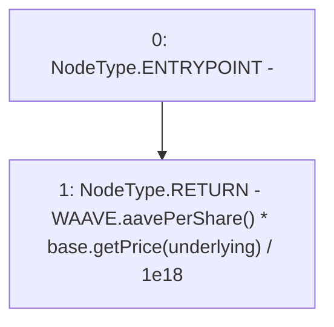

# Context: AAVEOracle.fetchPrice_v

**Contract:** `AAVEOracle` (Inherits: Ownable)
**Signature:** `fetchPrice_v() returns (uint256)`
**Method Selector ID:** `0x9c3bc3e6`
**Visibility:** `external`
**Environment-Free:** `Yes`
**Modifiers:** None

### State Variables Interaction
- **Reads:** WAAVE, base, underlying
- **Writes:** None

### Environment & Verification Flags
- **Uses Foundry Cheatcodes:** No
- **Has Echidna Properties:** No

### Internal Calls Tree
- None

### External Calls / Value Transfers
- `IWAAVE.TMP_36(uint256) = HIGH_LEVEL_CALL, dest:WAAVE(IWAAVE), function:aavePerShare, arguments:[]  `
- `IBaseOracle.TMP_37(uint256) = HIGH_LEVEL_CALL, dest:base(IBaseOracle), function:getPrice, arguments:['underlying']  `

### Control Flow Graph (CFG)


### Source Mapping
Declared in: `certora-ac-datasets/detasets/web3bugs/dataset/web3bugs/66/packages/contracts/contracts/Oracles/AAVETokenOracle.sol` on lines **28** to **30**

```solidity
  function fetchPrice_v() external returns (uint) {
    return WAAVE.aavePerShare()*base.getPrice(underlying)/1e18;
  }

```
