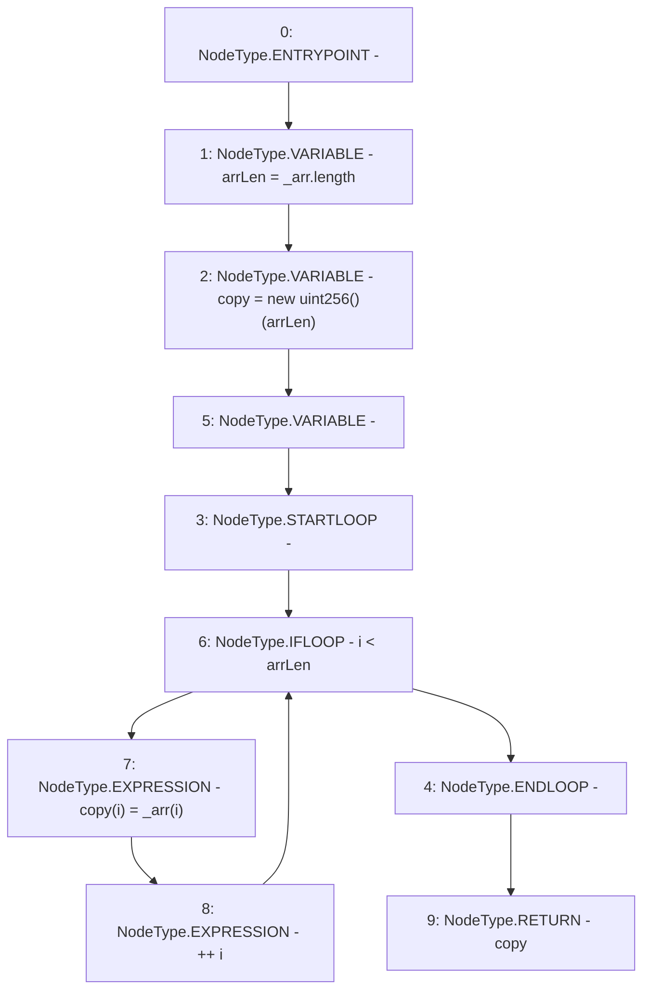

# Context: ActivePoolTester._getArrayCopy

**Contract:** `ActivePoolTester` (Inherits: ActivePool, YetiCustomBase, BaseMath, IActivePool, IPool, ICollateralReceiver, CheckContract, Ownable)
**Signature:** `_getArrayCopy(uint256[]) returns (uint256[])`
**Method Selector ID:** `Internal (No Method ID)`
**Visibility:** `internal`
**Environment-Free:** `Yes`
**Modifiers:** None

### State Variables Interaction
- **Reads:** None
- **Writes:** None

### Environment & Verification Flags
- **Uses Foundry Cheatcodes:** No
- **Has Echidna Properties:** No

### Internal Calls Tree
- None

### External Calls / Value Transfers
- None

### Control Flow Graph (CFG)


### Source Mapping
Declared in: `certora-ac-datasets/detasets/web3bugs/dataset/web3bugs/66/packages/contracts/contracts/Dependencies/YetiCustomBase.sol` on lines **192** to **199**

```solidity
    function _getArrayCopy(uint[] memory _arr) internal pure returns (uint[] memory){
        uint256 arrLen = _arr.length;
        uint[] memory copy = new uint[](arrLen);
        for (uint256 i; i < arrLen; ++i) {
            copy[i] = _arr[i];
        }
        return copy;
    }

```
