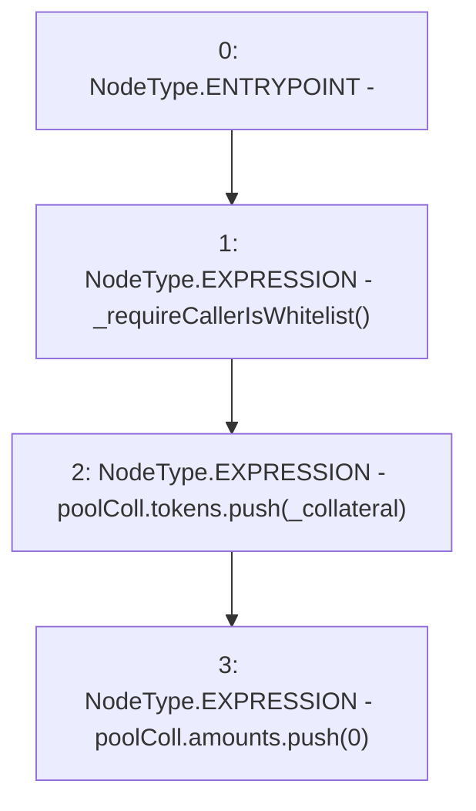

# Context: ActivePoolTester.addCollateralType

**Contract:** `ActivePoolTester` (Inherits: ActivePool, YetiCustomBase, BaseMath, IActivePool, IPool, ICollateralReceiver, CheckContract, Ownable)
**Signature:** `addCollateralType(address)`
**Method Selector ID:** `0xec0d5e0c`
**Visibility:** `external`
**Environment-Free:** `No (reads EVM state context)`
**Modifiers:** None

### State Variables Interaction
- **Reads:** poolColl
- **Writes:** poolColl

### Environment & Verification Flags
- **Uses Foundry Cheatcodes:** No
- **Has Echidna Properties:** No

### Internal Calls Tree
- None

### External Calls / Value Transfers
- None

### Control Flow Graph (CFG)


### Source Mapping
Declared in: `certora-ac-datasets/detasets/web3bugs/dataset/web3bugs/66/packages/contracts/contracts/ActivePool.sol` on lines **298** to **302**

```solidity
    function addCollateralType(address _collateral) external override {
        _requireCallerIsWhitelist();
        poolColl.tokens.push(_collateral);
        poolColl.amounts.push(0);
    }

```
