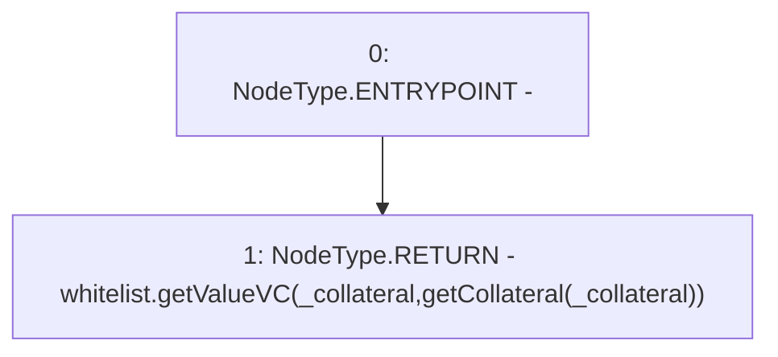

# Context: ActivePoolTester.getCollateralVC

**Contract:** `ActivePoolTester` (Inherits: ActivePool, YetiCustomBase, BaseMath, IActivePool, IPool, ICollateralReceiver, CheckContract, Ownable)
**Signature:** `getCollateralVC(address) returns (uint256)`
**Method Selector ID:** `0x3270a9e0`
**Visibility:** `external`
**Environment-Free:** `Yes`
**Modifiers:** None

### State Variables Interaction
- **Reads:** whitelist
- **Writes:** None

### Environment & Verification Flags
- **Uses Foundry Cheatcodes:** No
- **Has Echidna Properties:** No

### Internal Calls Tree
- None

### External Calls / Value Transfers
- `IWhitelist.TMP_344(uint256) = HIGH_LEVEL_CALL, dest:whitelist(IWhitelist), function:getValueVC, arguments:['_collateral', 'TMP_343']  `

### Control Flow Graph (CFG)


### Source Mapping
Declared in: `certora-ac-datasets/detasets/web3bugs/dataset/web3bugs/66/packages/contracts/contracts/ActivePool.sol` on lines **115** to **117**

```solidity
    function getCollateralVC(address _collateral) external view override returns (uint) {
        return whitelist.getValueVC(_collateral, getCollateral(_collateral));
    }

```
