# Context: ActivePoolTester.setAddresses

**Contract:** `ActivePoolTester` (Inherits: ActivePool, YetiCustomBase, BaseMath, IActivePool, IPool, ICollateralReceiver, CheckContract, Ownable)
**Signature:** `setAddresses(address,address,address,address,address,address,address,address)`
**Method Selector ID:** `0xd733cfd0`
**Visibility:** `external`
**Environment-Free:** `No (reads EVM state context)`
**Modifiers:**
- `onlyOwner`
  ```solidity
  modifier onlyOwner() {
          require(isOwner(), "CallerNotOwner");
          _;
      }
  ```

### State Variables Interaction
- **Reads:** None
- **Writes:** borrowerOperationsAddress, collSurplusPoolAddress, defaultPoolAddress, stabilityPoolAddress, troveManagerAddress, troveManagerLiquidationsAddress, troveManagerRedemptionsAddress, whitelist

### Environment & Verification Flags
- **Uses Foundry Cheatcodes:** No
- **Has Echidna Properties:** No

### Internal Calls Tree
- None

### External Calls / Value Transfers
- None

### Control Flow Graph (CFG)

```mermaid
flowchart TD
    Node_0["0: NodeType.ENTRYPOINT - "]
    Node_0 --> Node_23
    Node_1["1: NodeType.EXPRESSION - checkContract(_borrowerOperationsAddress)"]
    Node_1 --> Node_2
    Node_2["2: NodeType.EXPRESSION - checkContract(_troveManagerAddress)"]
    Node_2 --> Node_3
    Node_3["3: NodeType.EXPRESSION - checkContract(_stabilityPoolAddress)"]
    Node_3 --> Node_4
    Node_4["4: NodeType.EXPRESSION - checkContract(_defaultPoolAddress)"]
    Node_4 --> Node_5
    Node_5["5: NodeType.EXPRESSION - checkContract(_whitelistAddress)"]
    Node_5 --> Node_6
    Node_6["6: NodeType.EXPRESSION - checkContract(_troveManagerLiquidationsAddress)"]
    Node_6 --> Node_7
    Node_7["7: NodeType.EXPRESSION - checkContract(_troveManagerRedemptionsAddress)"]
    Node_7 --> Node_8
    Node_8["8: NodeType.EXPRESSION - checkContract(_collSurplusPoolAddress)"]
    Node_8 --> Node_9
    Node_9["9: NodeType.EXPRESSION - borrowerOperationsAddress = _borrowerOperationsAddress"]
    Node_9 --> Node_10
    Node_10["10: NodeType.EXPRESSION - troveManagerAddress = _troveManagerAddress"]
    Node_10 --> Node_11
    Node_11["11: NodeType.EXPRESSION - stabilityPoolAddress = _stabilityPoolAddress"]
    Node_11 --> Node_12
    Node_12["12: NodeType.EXPRESSION - defaultPoolAddress = _defaultPoolAddress"]
    Node_12 --> Node_13
    Node_13["13: NodeType.EXPRESSION - whitelist = IWhitelist(_whitelistAddress)"]
    Node_13 --> Node_14
    Node_14["14: NodeType.EXPRESSION - troveManagerLiquidationsAddress = _troveManagerLiquidationsAddress"]
    Node_14 --> Node_15
    Node_15["15: NodeType.EXPRESSION - troveManagerRedemptionsAddress = _troveManagerRedemptionsAddress"]
    Node_15 --> Node_16
    Node_16["16: NodeType.EXPRESSION - collSurplusPoolAddress = _collSurplusPoolAddress"]
    Node_16 --> Node_17
    Node_17["17: NodeType.EXPRESSION - BorrowerOperationsAddressChanged(_borrowerOperationsAddress)"]
    Node_17 --> Node_18
    Node_18["18: NodeType.EXPRESSION - TroveManagerAddressChanged(_troveManagerAddress)"]
    Node_18 --> Node_19
    Node_19["19: NodeType.EXPRESSION - StabilityPoolAddressChanged(_stabilityPoolAddress)"]
    Node_19 --> Node_20
    Node_20["20: NodeType.EXPRESSION - DefaultPoolAddressChanged(_defaultPoolAddress)"]
    Node_20 --> Node_21
    Node_21["21: NodeType.EXPRESSION - WhitelistAddressChanged(_whitelistAddress)"]
    Node_21 --> Node_22
    Node_22["22: NodeType.EXPRESSION - _renounceOwnership()"]
    Node_23["23: NodeType.EXPRESSION - onlyOwner()"]
    Node_23 --> Node_1
```


### Source Mapping
Declared in: `certora-ac-datasets/detasets/web3bugs/dataset/web3bugs/66/packages/contracts/contracts/ActivePool.sol` on lines **54** to **92**

```solidity
    function setAddresses(
        address _borrowerOperationsAddress,
        address _troveManagerAddress,
        address _stabilityPoolAddress,
        address _defaultPoolAddress,
        address _whitelistAddress,
        address _troveManagerLiquidationsAddress,
        address _troveManagerRedemptionsAddress,
        address _collSurplusPoolAddress
    )
        external
        onlyOwner
    {
        checkContract(_borrowerOperationsAddress);
        checkContract(_troveManagerAddress);
        checkContract(_stabilityPoolAddress);
        checkContract(_defaultPoolAddress);
        checkContract(_whitelistAddress);
        checkContract(_troveManagerLiquidationsAddress);
        checkContract(_troveManagerRedemptionsAddress);
        checkContract(_collSurplusPoolAddress);

        borrowerOperationsAddress = _borrowerOperationsAddress;
        troveManagerAddress = _troveManagerAddress;
        stabilityPoolAddress = _stabilityPoolAddress;
        defaultPoolAddress = _defaultPoolAddress;
        whitelist = IWhitelist(_whitelistAddress);
        troveManagerLiquidationsAddress = _troveManagerLiquidationsAddress;
        troveManagerRedemptionsAddress = _troveManagerRedemptionsAddress;
        collSurplusPoolAddress = _collSurplusPoolAddress;

        emit BorrowerOperationsAddressChanged(_borrowerOperationsAddress);
        emit TroveManagerAddressChanged(_troveManagerAddress);
        emit StabilityPoolAddressChanged(_stabilityPoolAddress);
        emit DefaultPoolAddressChanged(_defaultPoolAddress);
        emit WhitelistAddressChanged(_whitelistAddress);

        _renounceOwnership();
    }

```
