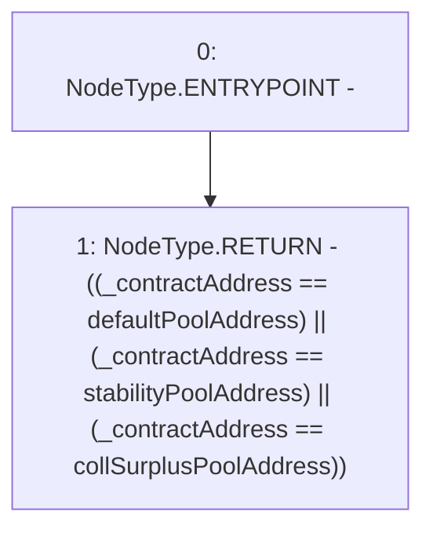

# Context: ActivePool._needsUpdateCollateral

**Contract:** `ActivePool` (Inherits: YetiCustomBase, BaseMath, IActivePool, IPool, ICollateralReceiver, CheckContract, Ownable)
**Signature:** `_needsUpdateCollateral(address) returns (bool)`
**Method Selector ID:** `Internal (No Method ID)`
**Visibility:** `internal`
**Environment-Free:** `Yes`
**Modifiers:** None

### State Variables Interaction
- **Reads:** collSurplusPoolAddress, defaultPoolAddress, stabilityPoolAddress
- **Writes:** None

### Environment & Verification Flags
- **Uses Foundry Cheatcodes:** No
- **Has Echidna Properties:** No

### Internal Calls Tree
- None

### External Calls / Value Transfers
- None

### Control Flow Graph (CFG)


### Source Mapping
Declared in: `certora-ac-datasets/detasets/web3bugs/dataset/web3bugs/66/packages/contracts/contracts/ActivePool.sol` on lines **219** to **221**

```solidity
    function _needsUpdateCollateral(address _contractAddress) internal view returns (bool) {
        return ((_contractAddress == defaultPoolAddress) || (_contractAddress == stabilityPoolAddress) || (_contractAddress == collSurplusPoolAddress));
    }

```
