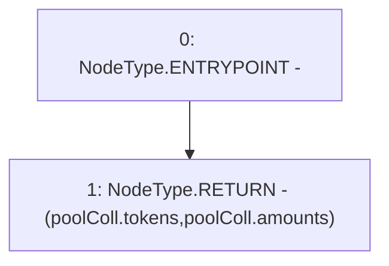

# Context: ActivePool.getAllCollateral

**Contract:** `ActivePool` (Inherits: YetiCustomBase, BaseMath, IActivePool, IPool, ICollateralReceiver, CheckContract, Ownable)
**Signature:** `getAllCollateral() returns (address[], uint256[])`
**Method Selector ID:** `0xc6ba0936`
**Visibility:** `public`
**Environment-Free:** `Yes`
**Modifiers:** None

### State Variables Interaction
- **Reads:** poolColl
- **Writes:** None

### Environment & Verification Flags
- **Uses Foundry Cheatcodes:** No
- **Has Echidna Properties:** No

### Internal Calls Tree
- None

### External Calls / Value Transfers
- None

### Control Flow Graph (CFG)


### Source Mapping
Declared in: `certora-ac-datasets/detasets/web3bugs/dataset/web3bugs/66/packages/contracts/contracts/ActivePool.sol` on lines **110** to **112**

```solidity
    function getAllCollateral() public view override returns (address[] memory, uint256[] memory) {
        return (poolColl.tokens, poolColl.amounts);
    }

```
