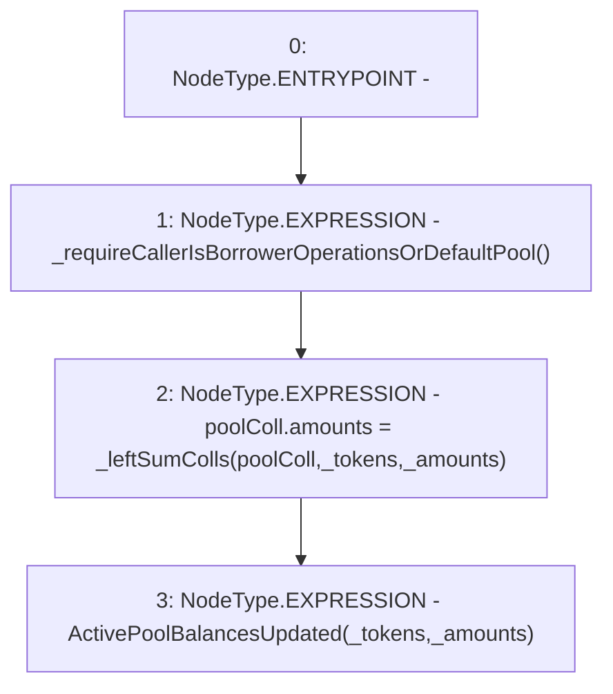

# Context: ActivePool.receiveCollateral

**Contract:** `ActivePool` (Inherits: YetiCustomBase, BaseMath, IActivePool, IPool, ICollateralReceiver, CheckContract, Ownable)
**Signature:** `receiveCollateral(address[],uint256[])`
**Method Selector ID:** `0xa7a24edd`
**Visibility:** `external`
**Environment-Free:** `No (reads EVM state context)`
**Modifiers:** None

### State Variables Interaction
- **Reads:** poolColl
- **Writes:** poolColl

### Environment & Verification Flags
- **Uses Foundry Cheatcodes:** No
- **Has Echidna Properties:** No

### Internal Calls Tree
- None

### External Calls / Value Transfers
- None

### Control Flow Graph (CFG)


### Source Mapping
Declared in: `certora-ac-datasets/detasets/web3bugs/dataset/web3bugs/66/packages/contracts/contracts/ActivePool.sol` on lines **291** to **295**

```solidity
    function receiveCollateral(address[] calldata _tokens, uint[] calldata _amounts) external override {
        _requireCallerIsBorrowerOperationsOrDefaultPool();
        poolColl.amounts = _leftSumColls(poolColl, _tokens, _amounts);
        emit ActivePoolBalancesUpdated(_tokens, _amounts);
    }

```
