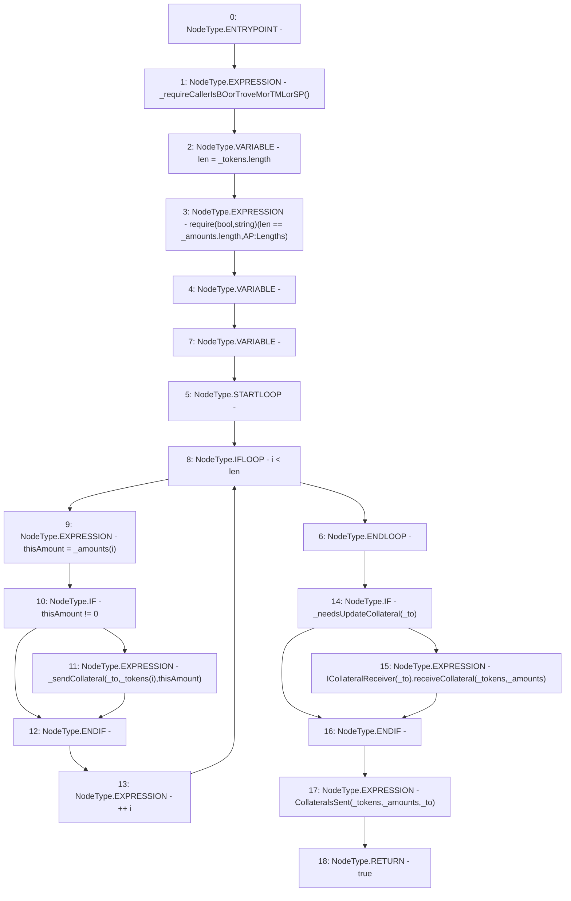

# Context: ActivePool.sendCollaterals

**Contract:** `ActivePool` (Inherits: YetiCustomBase, BaseMath, IActivePool, IPool, ICollateralReceiver, CheckContract, Ownable)
**Signature:** `sendCollaterals(address,address[],uint256[]) returns (bool)`
**Method Selector ID:** `0xd0d8c20d`
**Visibility:** `external`
**Environment-Free:** `No (reads EVM state context)`
**Modifiers:** None

### State Variables Interaction
- **Reads:** None
- **Writes:** None

### Assertion Checks & Business Requirements
- require/assert: `require(bool,string)(len == _amounts.length,AP:Lengths)`

### Environment & Verification Flags
- **Uses Foundry Cheatcodes:** No
- **Has Echidna Properties:** No

### Internal Calls Tree
- None

### External Calls / Value Transfers
- `ICollateralReceiver.HIGH_LEVEL_CALL, dest:TMP_104(ICollateralReceiver), function:receiveCollateral, arguments:['_tokens', '_amounts']  `

### Control Flow Graph (CFG)


### Source Mapping
Declared in: `certora-ac-datasets/detasets/web3bugs/dataset/web3bugs/66/packages/contracts/contracts/ActivePool.sol` on lines **159** to **178**

```solidity
    function sendCollaterals(address _to, address[] calldata _tokens, uint[] calldata _amounts) external override returns (bool) {
        _requireCallerIsBOorTroveMorTMLorSP();
        uint256 len = _tokens.length;
        require(len == _amounts.length, "AP:Lengths");
        uint256 thisAmount;
        for (uint256 i; i < len; ++i) {
            thisAmount = _amounts[i];
            if (thisAmount != 0) {
                _sendCollateral(_to, _tokens[i], thisAmount); // reverts if send fails
            }
        }

        if (_needsUpdateCollateral(_to)) {
            ICollateralReceiver(_to).receiveCollateral(_tokens, _amounts);
        }

        emit CollateralsSent(_tokens, _amounts, _to);
        
        return true;
    }

```
