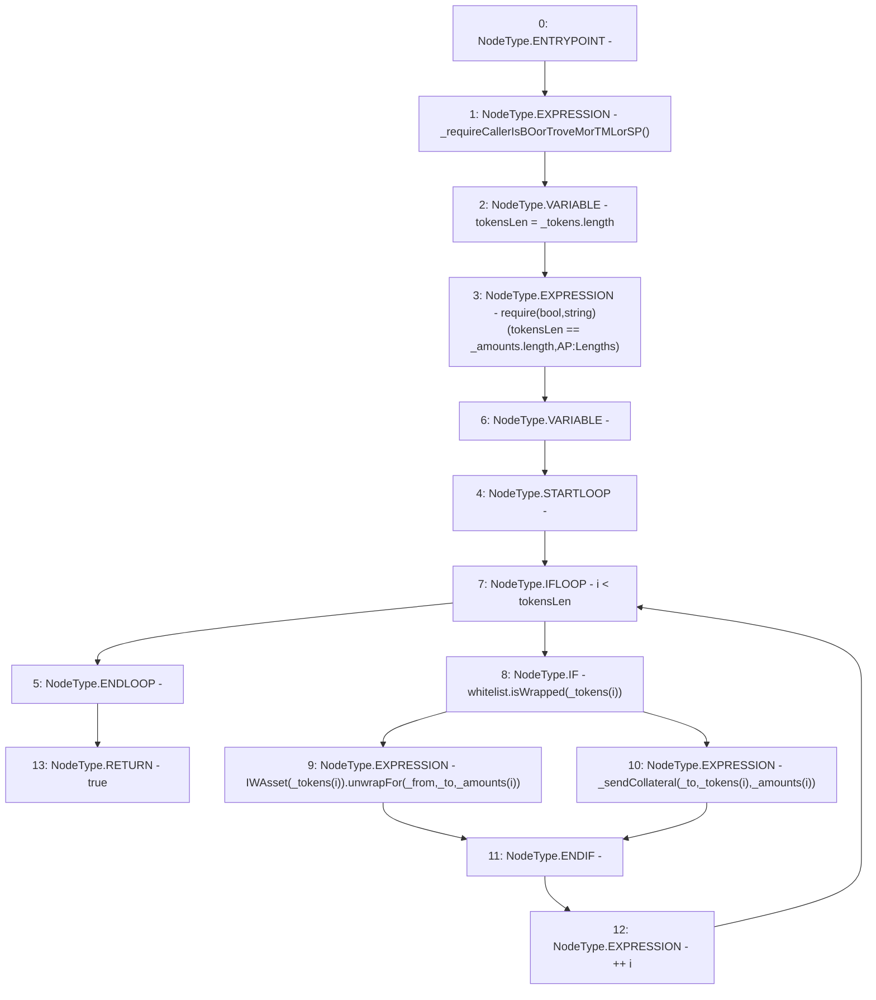

# Context: ActivePool.sendCollateralsUnwrap

**Contract:** `ActivePool` (Inherits: YetiCustomBase, BaseMath, IActivePool, IPool, ICollateralReceiver, CheckContract, Ownable)
**Signature:** `sendCollateralsUnwrap(address,address,address[],uint256[]) returns (bool)`
**Method Selector ID:** `0x3733a133`
**Visibility:** `external`
**Environment-Free:** `No (reads EVM state context)`
**Modifiers:** None

### State Variables Interaction
- **Reads:** whitelist
- **Writes:** None

### Assertion Checks & Business Requirements
- require/assert: `require(bool,string)(tokensLen == _amounts.length,AP:Lengths)`

### Environment & Verification Flags
- **Uses Foundry Cheatcodes:** No
- **Has Echidna Properties:** No

### Internal Calls Tree
- None

### External Calls / Value Transfers
- `IWAsset.HIGH_LEVEL_CALL, dest:TMP_112(IWAsset), function:unwrapFor, arguments:['_from', '_to', 'REF_134']  `
- `IWhitelist.TMP_111(bool) = HIGH_LEVEL_CALL, dest:whitelist(IWhitelist), function:isWrapped, arguments:['REF_131']  `

### Control Flow Graph (CFG)


### Source Mapping
Declared in: `certora-ac-datasets/detasets/web3bugs/dataset/web3bugs/66/packages/contracts/contracts/ActivePool.sol` on lines **184** to **197**

```solidity
    function sendCollateralsUnwrap(address _from, address _to, address[] calldata _tokens, uint[] calldata _amounts) external override returns (bool) {
        _requireCallerIsBOorTroveMorTMLorSP();
        uint256 tokensLen = _tokens.length;
        require(tokensLen == _amounts.length, "AP:Lengths");
        for (uint256 i; i < tokensLen; ++i) {
            if (whitelist.isWrapped(_tokens[i])) {
                // Collects rewards automatically for that amount and unwraps for the original borrower. 
                IWAsset(_tokens[i]).unwrapFor(_from, _to, _amounts[i]);
            } else {
                _sendCollateral(_to, _tokens[i], _amounts[i]); // reverts if send fails
            }
        }
        return true;
    }

```
