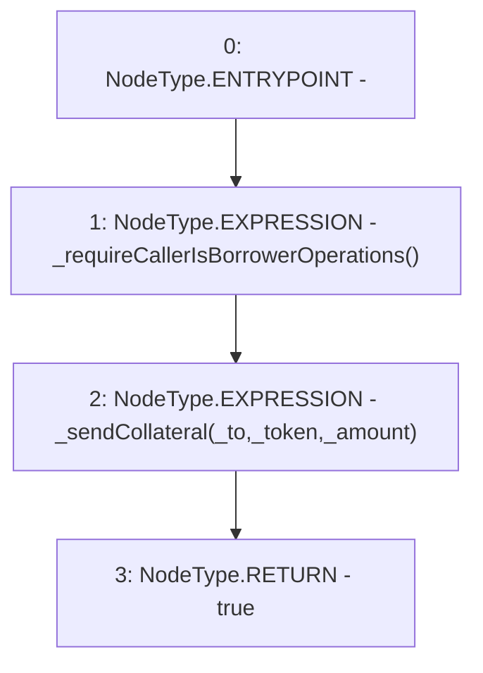

# Context: ActivePool.sendSingleCollateral

**Contract:** `ActivePool` (Inherits: YetiCustomBase, BaseMath, IActivePool, IPool, ICollateralReceiver, CheckContract, Ownable)
**Signature:** `sendSingleCollateral(address,address,uint256) returns (bool)`
**Method Selector ID:** `0x62f6105b`
**Visibility:** `external`
**Environment-Free:** `No (reads EVM state context)`
**Modifiers:** None

### State Variables Interaction
- **Reads:** None
- **Writes:** None

### Environment & Verification Flags
- **Uses Foundry Cheatcodes:** No
- **Has Echidna Properties:** No

### Internal Calls Tree
- None

### External Calls / Value Transfers
- None

### Control Flow Graph (CFG)


### Source Mapping
Declared in: `certora-ac-datasets/detasets/web3bugs/dataset/web3bugs/66/packages/contracts/contracts/ActivePool.sol` on lines **200** to **204**

```solidity
    function sendSingleCollateral(address _to, address _token, uint256 _amount) external override returns (bool) {
        _requireCallerIsBorrowerOperations();
        _sendCollateral(_to, _token, _amount); // reverts if send fails
        return true;
    }

```
