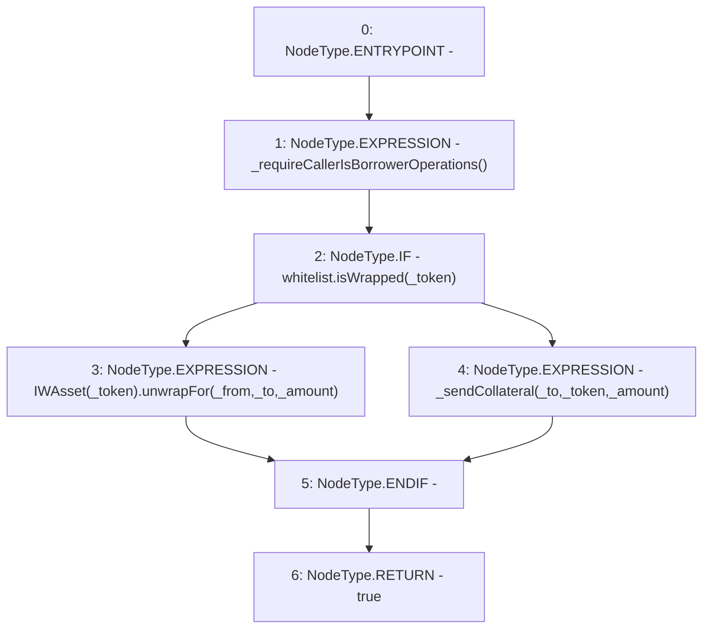

# Context: ActivePool.sendSingleCollateralUnwrap

**Contract:** `ActivePool` (Inherits: YetiCustomBase, BaseMath, IActivePool, IPool, ICollateralReceiver, CheckContract, Ownable)
**Signature:** `sendSingleCollateralUnwrap(address,address,address,uint256) returns (bool)`
**Method Selector ID:** `0xfde3efe0`
**Visibility:** `external`
**Environment-Free:** `No (reads EVM state context)`
**Modifiers:** None

### State Variables Interaction
- **Reads:** whitelist
- **Writes:** None

### Environment & Verification Flags
- **Uses Foundry Cheatcodes:** No
- **Has Echidna Properties:** No

### Internal Calls Tree
- None

### External Calls / Value Transfers
- `IWhitelist.TMP_118(bool) = HIGH_LEVEL_CALL, dest:whitelist(IWhitelist), function:isWrapped, arguments:['_token']  `
- `IWAsset.HIGH_LEVEL_CALL, dest:TMP_119(IWAsset), function:unwrapFor, arguments:['_from', '_to', '_amount']  `

### Control Flow Graph (CFG)


### Source Mapping
Declared in: `certora-ac-datasets/detasets/web3bugs/dataset/web3bugs/66/packages/contracts/contracts/ActivePool.sol` on lines **207** to **216**

```solidity
    function sendSingleCollateralUnwrap(address _from, address _to, address _token, uint256 _amount) external override returns (bool) {
        _requireCallerIsBorrowerOperations();
        if (whitelist.isWrapped(_token)) {
            // Collects rewards automatically for that amount and unwraps for the original borrower. 
            IWAsset(_token).unwrapFor(_from, _to, _amount);
        } else {
            _sendCollateral(_to, _token, _amount); // reverts if send fails
        }
        return true;
    }

```
