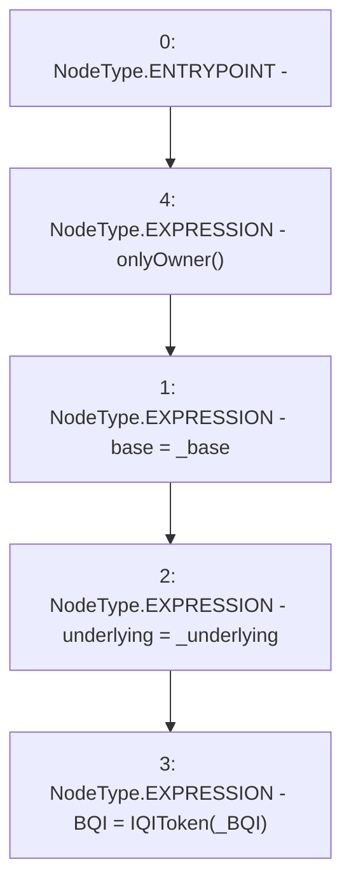

# Context: BQIOracle.setParam

**Contract:** `BQIOracle` (Inherits: Ownable)
**Signature:** `setParam(IBaseOracle,address,address)`
**Method Selector ID:** `0x06287db4`
**Visibility:** `external`
**Environment-Free:** `No (reads EVM state context)`
**Modifiers:**
- `onlyOwner`
  ```solidity
  modifier onlyOwner() {
          require(isOwner(), "CallerNotOwner");
          _;
      }
  ```

### State Variables Interaction
- **Reads:** None
- **Writes:** BQI, base, underlying

### Environment & Verification Flags
- **Uses Foundry Cheatcodes:** No
- **Has Echidna Properties:** No

### Internal Calls Tree
- None

### External Calls / Value Transfers
- None

### Control Flow Graph (CFG)


### Source Mapping
Declared in: `certora-ac-datasets/detasets/web3bugs/dataset/web3bugs/66/packages/contracts/contracts/Oracles/BQITokenOracle.sol` on lines **23** to **27**

```solidity
  function setParam(IBaseOracle _base, address _BQI, address _underlying) external onlyOwner {
    base = _base;
    underlying = _underlying;
    BQI=IQIToken(_BQI);
  }

```
