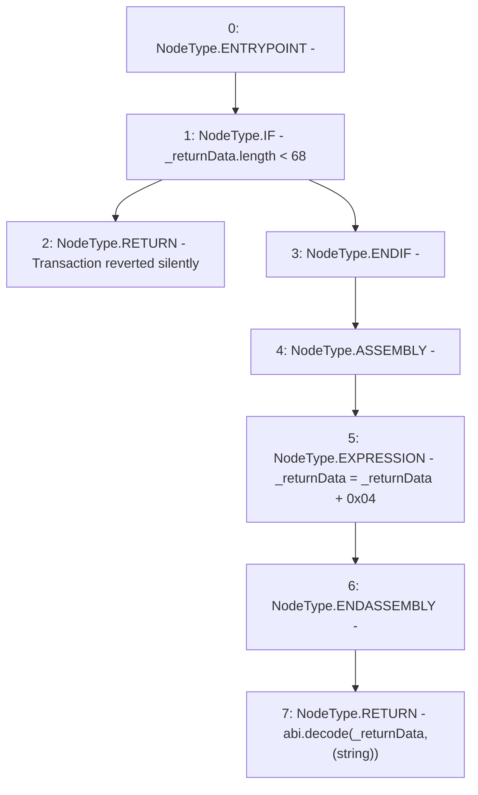

# Context: BoringBatchable._getRevertMsg

**Contract:** `BoringBatchable` (Inherits: BaseBoringBatchable)
**Signature:** `_getRevertMsg(bytes) returns (string)`
**Method Selector ID:** `Internal (No Method ID)`
**Visibility:** `internal`
**Environment-Free:** `Yes`
**Modifiers:** None

### State Variables Interaction
- **Reads:** None
- **Writes:** None

### Environment & Verification Flags
- **Uses Foundry Cheatcodes:** No
- **Has Echidna Properties:** No

### Internal Calls Tree
- None

### External Calls / Value Transfers
- None

### Control Flow Graph (CFG)


### Source Mapping
Declared in: `certora-ac-datasets/detasets/web3bugs/dataset/web3bugs/66/packages/contracts/contracts/YETI/BoringCrypto/BoringBatchable.sol` on lines **18** to **27**

```solidity
    function _getRevertMsg(bytes memory _returnData) internal pure returns (string memory) {
        // If the _res length is less than 68, then the transaction failed silently (without a revert message)
        if (_returnData.length < 68) return "Transaction reverted silently";

        assembly {
        // Slice the sighash.
            _returnData := add(_returnData, 0x04)
        }
        return abi.decode(_returnData, (string)); // All that remains is the revert string
    }

```
