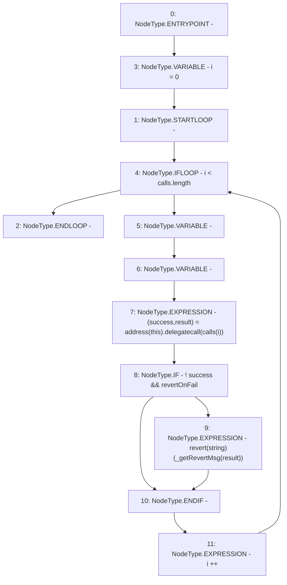

# Context: BoringBatchable.batch

**Contract:** `BoringBatchable` (Inherits: BaseBoringBatchable)
**Signature:** `batch(bytes[],bool)`
**Method Selector ID:** `0xd2423b51`
**Visibility:** `external`
**Environment-Free:** `Yes`
**Modifiers:** None

### State Variables Interaction
- **Reads:** None
- **Writes:** None

### Assertion Checks & Business Requirements
- revert: `revert(string)(_getRevertMsg(result))`

### Environment & Verification Flags
- **Uses Foundry Cheatcodes:** No
- **Has Echidna Properties:** No

### Internal Calls Tree
- None

### External Calls / Value Transfers
- `low-level-call`

### Control Flow Graph (CFG)


### Source Mapping
Declared in: `certora-ac-datasets/detasets/web3bugs/dataset/web3bugs/66/packages/contracts/contracts/YETI/BoringCrypto/BoringBatchable.sol` on lines **36** to **43**

```solidity
    function batch(bytes[] calldata calls, bool revertOnFail) external payable {
        for (uint256 i = 0; i < calls.length; i++) {
            (bool success, bytes memory result) = address(this).delegatecall(calls[i]);
            if (!success && revertOnFail) {
                revert(_getRevertMsg(result));
            }
        }
    }

```
