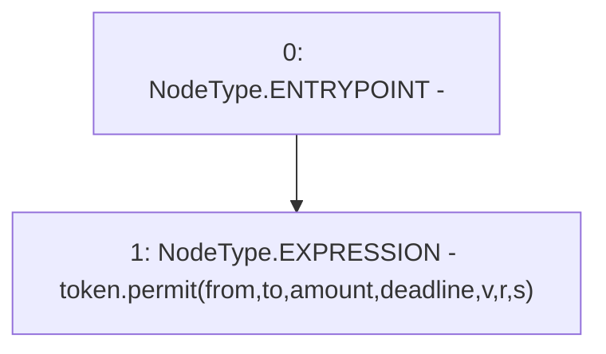

# Context: BoringBatchable.permitToken

**Contract:** `BoringBatchable` (Inherits: BaseBoringBatchable)
**Signature:** `permitToken(IERC20,address,address,uint256,uint256,uint8,bytes32,bytes32)`
**Method Selector ID:** `0x7c516e94`
**Visibility:** `public`
**Environment-Free:** `Yes`
**Modifiers:** None

### State Variables Interaction
- **Reads:** None
- **Writes:** None

### Environment & Verification Flags
- **Uses Foundry Cheatcodes:** No
- **Has Echidna Properties:** No

### Internal Calls Tree
- None

### External Calls / Value Transfers
- `IERC20.HIGH_LEVEL_CALL, dest:token(IERC20), function:permit, arguments:['from', 'to', 'amount', 'deadline', 'v', 'r', 's']  `

### Control Flow Graph (CFG)


### Source Mapping
Declared in: `certora-ac-datasets/detasets/web3bugs/dataset/web3bugs/66/packages/contracts/contracts/YETI/BoringCrypto/BoringBatchable.sol` on lines **51** to **62**

```solidity
    function permitToken(
        IERC20 token,
        address from,
        address to,
        uint256 amount,
        uint256 deadline,
        uint8 v,
        bytes32 r,
        bytes32 s
    ) public {
        token.permit(from, to, amount, deadline, v, r, s);
    }

```
