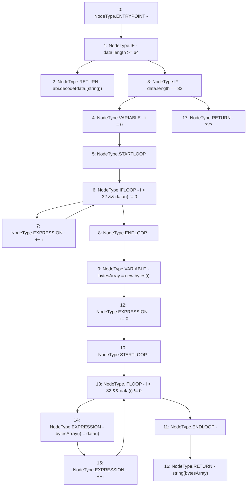

# Context: BoringERC20.returnDataToString

**Contract:** `BoringERC20` (Inherits: None)
**Signature:** `returnDataToString(bytes) returns (string)`
**Method Selector ID:** `Internal (No Method ID)`
**Visibility:** `internal`
**Environment-Free:** `Yes`
**Modifiers:** None

### State Variables Interaction
- **Reads:** None
- **Writes:** None

### Environment & Verification Flags
- **Uses Foundry Cheatcodes:** No
- **Has Echidna Properties:** No

### Internal Calls Tree
- None

### External Calls / Value Transfers
- None

### Control Flow Graph (CFG)


### Source Mapping
Declared in: `certora-ac-datasets/detasets/web3bugs/dataset/web3bugs/66/packages/contracts/contracts/YETI/BoringCrypto/BoringERC20.sol` on lines **15** to **31**

```solidity
    function returnDataToString(bytes memory data) internal pure returns (string memory) {
        if (data.length >= 64) {
            return abi.decode(data, (string));
        } else if (data.length == 32) {
            uint8 i = 0;
            while(i < 32 && data[i] != 0) {
                ++i;
            }
            bytes memory bytesArray = new bytes(i);
            for (i = 0; i < 32 && data[i] != 0; ++i) {
                bytesArray[i] = data[i];
            }
            return string(bytesArray);
        } else {
            return "???";
        }
    }

```
