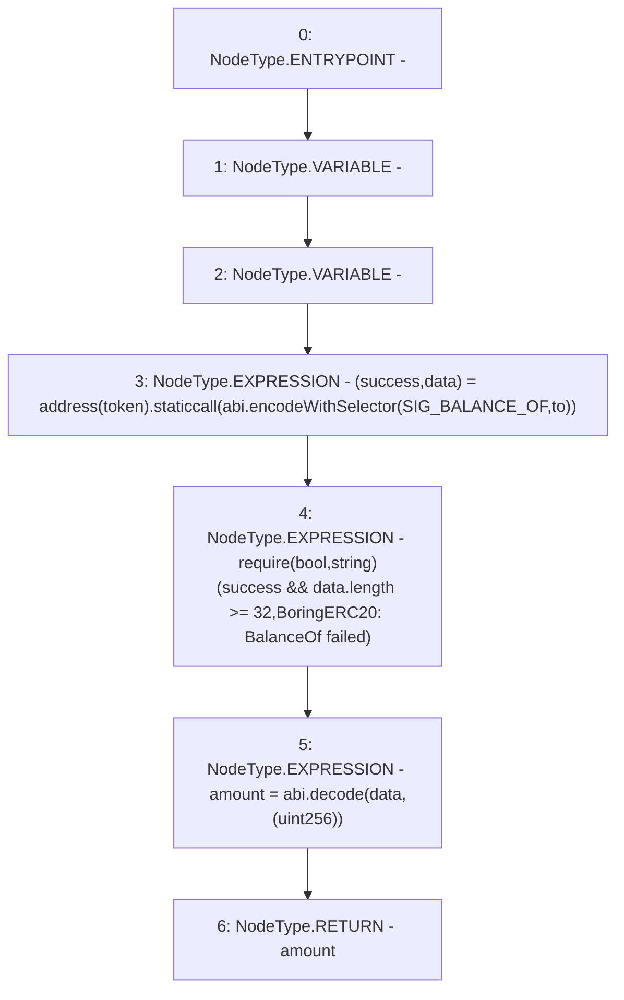

# Context: BoringERC20.safeBalanceOf

**Contract:** `BoringERC20` (Inherits: None)
**Signature:** `safeBalanceOf(IERC20,address) returns (uint256)`
**Method Selector ID:** `Internal (No Method ID)`
**Visibility:** `internal`
**Environment-Free:** `Yes`
**Modifiers:** None

### State Variables Interaction
- **Reads:** SIG_BALANCE_OF
- **Writes:** None

### Assertion Checks & Business Requirements
- require/assert: `require(bool,string)(success && data.length >= 32,BoringERC20: BalanceOf failed)`

### Environment & Verification Flags
- **Uses Foundry Cheatcodes:** No
- **Has Echidna Properties:** No

### Internal Calls Tree
- None

### External Calls / Value Transfers
- `low-level-call`

### Control Flow Graph (CFG)


### Source Mapping
Declared in: `certora-ac-datasets/detasets/web3bugs/dataset/web3bugs/66/packages/contracts/contracts/YETI/BoringCrypto/BoringERC20.sol` on lines **61** to **65**

```solidity
    function safeBalanceOf(IERC20 token, address to) internal view returns (uint256 amount) {
        (bool success, bytes memory data) = address(token).staticcall(abi.encodeWithSelector(SIG_BALANCE_OF, to));
        require(success && data.length >= 32, "BoringERC20: BalanceOf failed");
        amount = abi.decode(data, (uint256));
    }

```
