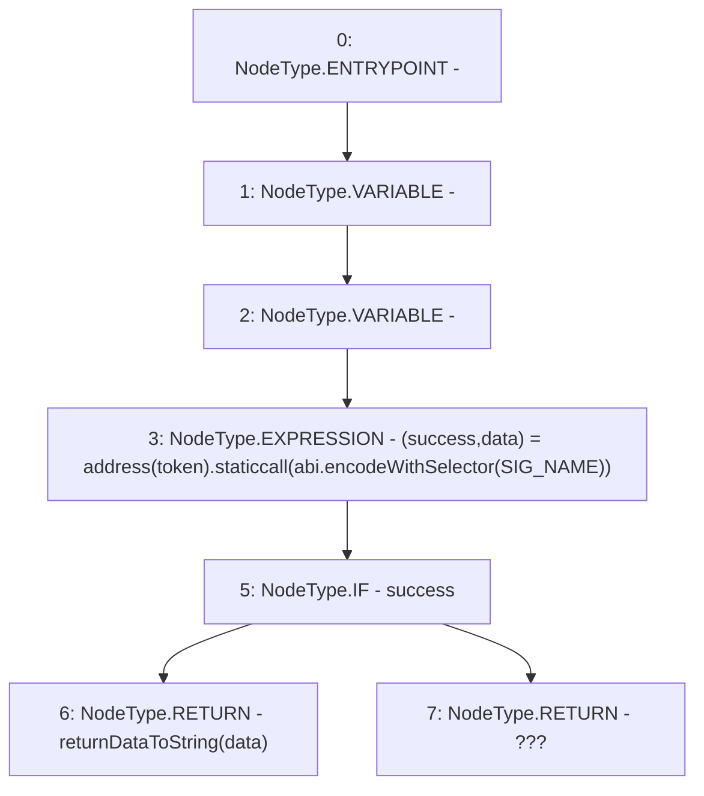

# Context: BoringERC20.safeName

**Contract:** `BoringERC20` (Inherits: None)
**Signature:** `safeName(IERC20) returns (string)`
**Method Selector ID:** `Internal (No Method ID)`
**Visibility:** `internal`
**Environment-Free:** `Yes`
**Modifiers:** None

### State Variables Interaction
- **Reads:** SIG_NAME
- **Writes:** None

### Environment & Verification Flags
- **Uses Foundry Cheatcodes:** No
- **Has Echidna Properties:** No

### Internal Calls Tree
- None

### External Calls / Value Transfers
- `low-level-call`

### Control Flow Graph (CFG)


### Source Mapping
Declared in: `certora-ac-datasets/detasets/web3bugs/dataset/web3bugs/66/packages/contracts/contracts/YETI/BoringCrypto/BoringERC20.sol` on lines **44** to **47**

```solidity
    function safeName(IERC20 token) internal view returns (string memory) {
        (bool success, bytes memory data) = address(token).staticcall(abi.encodeWithSelector(SIG_NAME));
        return success ? returnDataToString(data) : "???";
    }

```
