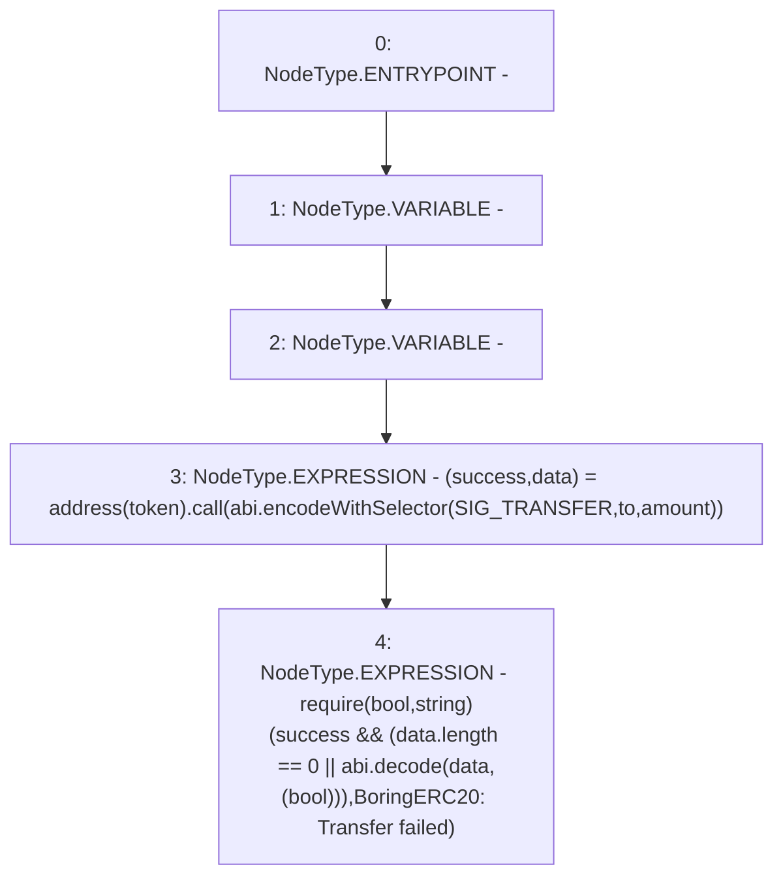

# Context: BoringERC20.safeTransfer

**Contract:** `BoringERC20` (Inherits: None)
**Signature:** `safeTransfer(IERC20,address,uint256)`
**Method Selector ID:** `Internal (No Method ID)`
**Visibility:** `internal`
**Environment-Free:** `Yes`
**Modifiers:** None

### State Variables Interaction
- **Reads:** SIG_TRANSFER
- **Writes:** None

### Assertion Checks & Business Requirements
- require/assert: `require(bool,string)(success && (data.length == 0 || abi.decode(data,(bool))),BoringERC20: Transfer failed)`

### Environment & Verification Flags
- **Uses Foundry Cheatcodes:** No
- **Has Echidna Properties:** No

### Internal Calls Tree
- None

### External Calls / Value Transfers
- `low-level-call`

### Control Flow Graph (CFG)


### Source Mapping
Declared in: `certora-ac-datasets/detasets/web3bugs/dataset/web3bugs/66/packages/contracts/contracts/YETI/BoringCrypto/BoringERC20.sol` on lines **72** to **79**

```solidity
    function safeTransfer(
        IERC20 token,
        address to,
        uint256 amount
    ) internal {
        (bool success, bytes memory data) = address(token).call(abi.encodeWithSelector(SIG_TRANSFER, to, amount));
        require(success && (data.length == 0 || abi.decode(data, (bool))), "BoringERC20: Transfer failed");
    }

```
