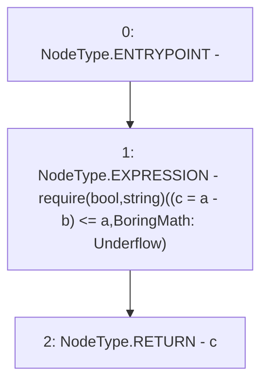

# Context: BoringMath64.sub

**Contract:** `BoringMath64` (Inherits: None)
**Signature:** `sub(uint64,uint64) returns (uint64)`
**Method Selector ID:** `Internal (No Method ID)`
**Visibility:** `internal`
**Environment-Free:** `Yes`
**Modifiers:** None

### State Variables Interaction
- **Reads:** None
- **Writes:** None

### Assertion Checks & Business Requirements
- require/assert: `require(bool,string)((c = a - b) <= a,BoringMath: Underflow)`

### Environment & Verification Flags
- **Uses Foundry Cheatcodes:** No
- **Has Echidna Properties:** No

### Internal Calls Tree
- None

### External Calls / Value Transfers
- None

### Control Flow Graph (CFG)


### Source Mapping
Declared in: `certora-ac-datasets/detasets/web3bugs/dataset/web3bugs/66/packages/contracts/contracts/YETI/BoringCrypto/BoringMath.sol` on lines **52** to **54**

```solidity
    function sub(uint64 a, uint64 b) internal pure returns (uint64 c) {
        require((c = a - b) <= a, "BoringMath: Underflow");
    }

```
