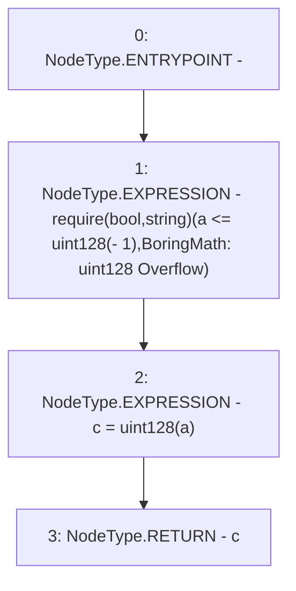

# Context: BoringMath.to128

**Contract:** `BoringMath` (Inherits: None)
**Signature:** `to128(uint256) returns (uint128)`
**Method Selector ID:** `Internal (No Method ID)`
**Visibility:** `internal`
**Environment-Free:** `Yes`
**Modifiers:** None

### State Variables Interaction
- **Reads:** None
- **Writes:** None

### Assertion Checks & Business Requirements
- require/assert: `require(bool,string)(a <= uint128(- 1),BoringMath: uint128 Overflow)`

### Environment & Verification Flags
- **Uses Foundry Cheatcodes:** No
- **Has Echidna Properties:** No

### Internal Calls Tree
- None

### External Calls / Value Transfers
- None

### Control Flow Graph (CFG)


### Source Mapping
Declared in: `certora-ac-datasets/detasets/web3bugs/dataset/web3bugs/66/packages/contracts/contracts/YETI/BoringCrypto/BoringMath.sol` on lines **19** to **22**

```solidity
    function to128(uint256 a) internal pure returns (uint128 c) {
        require(a <= uint128(-1), "BoringMath: uint128 Overflow");
        c = uint128(a);
    }

```
