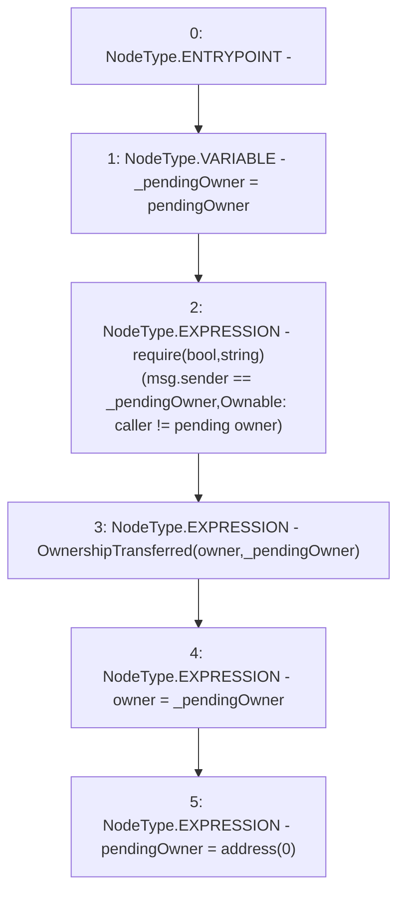

# Context: BoringOwnable.claimOwnership

**Contract:** `BoringOwnable` (Inherits: BoringOwnableData)
**Signature:** `claimOwnership()`
**Method Selector ID:** `0x4e71e0c8`
**Visibility:** `public`
**Environment-Free:** `No (reads EVM state context)`
**Modifiers:** None

### State Variables Interaction
- **Reads:** owner, pendingOwner
- **Writes:** owner, pendingOwner

### Assertion Checks & Business Requirements
- require/assert: `require(bool,string)(msg.sender == _pendingOwner,Ownable: caller != pending owner)`

### Environment & Verification Flags
- **Uses Foundry Cheatcodes:** No
- **Has Echidna Properties:** No

### Internal Calls Tree
- None

### External Calls / Value Transfers
- None

### Control Flow Graph (CFG)


### Source Mapping
Declared in: `certora-ac-datasets/detasets/web3bugs/dataset/web3bugs/66/packages/contracts/contracts/YETI/BoringCrypto/BoringOwnable.sol` on lines **47** to **57**

```solidity
    function claimOwnership() public {
        address _pendingOwner = pendingOwner;

        // Checks
        require(msg.sender == _pendingOwner, "Ownable: caller != pending owner");

        // Effects
        emit OwnershipTransferred(owner, _pendingOwner);
        owner = _pendingOwner;
        pendingOwner = address(0);
    }

```
