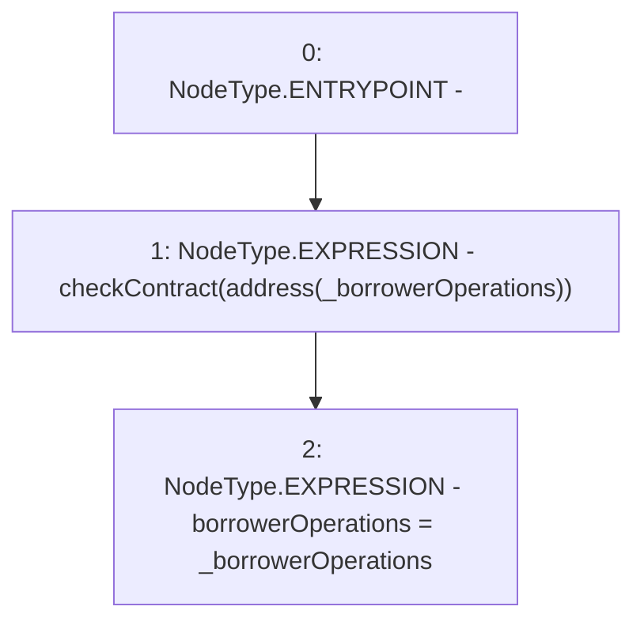

# Context: BorrowerOperationsScript.constructor

**Contract:** `BorrowerOperationsScript` (Inherits: CheckContract)
**Signature:** `constructor(IBorrowerOperations)`
**Method Selector ID:** `0xf8a6c595`
**Visibility:** `public`
**Environment-Free:** `Yes`
**Modifiers:** None

### State Variables Interaction
- **Reads:** None
- **Writes:** borrowerOperations

### Environment & Verification Flags
- **Uses Foundry Cheatcodes:** No
- **Has Echidna Properties:** No

### Internal Calls Tree
- None

### External Calls / Value Transfers
- None

### Control Flow Graph (CFG)


### Source Mapping
Declared in: `certora-ac-datasets/detasets/web3bugs/dataset/web3bugs/66/packages/contracts/contracts/Proxy/BorrowerOperationsScript.sol` on lines **12** to **15**

```solidity
    constructor(IBorrowerOperations _borrowerOperations) public {
        checkContract(address(_borrowerOperations));
        borrowerOperations = _borrowerOperations;
    }

```
