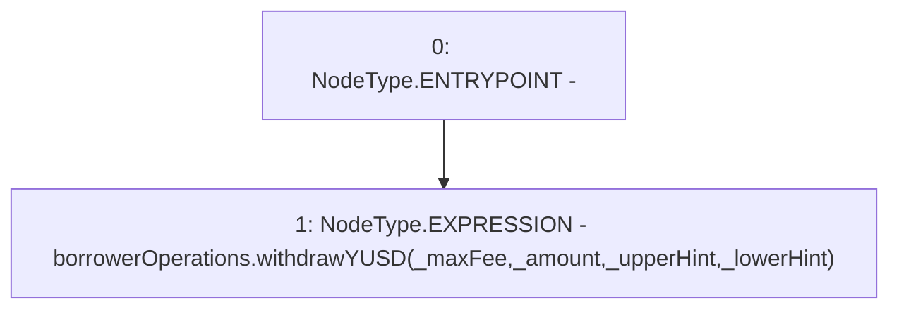

# Context: BorrowerOperationsScript.withdrawYUSD

**Contract:** `BorrowerOperationsScript` (Inherits: CheckContract)
**Signature:** `withdrawYUSD(uint256,address,address,uint256)`
**Method Selector ID:** `0x9fbcc347`
**Visibility:** `external`
**Environment-Free:** `Yes`
**Modifiers:** None

### State Variables Interaction
- **Reads:** borrowerOperations
- **Writes:** None

### Environment & Verification Flags
- **Uses Foundry Cheatcodes:** No
- **Has Echidna Properties:** No

### Internal Calls Tree
- None

### External Calls / Value Transfers
- `IBorrowerOperations.HIGH_LEVEL_CALL, dest:borrowerOperations(IBorrowerOperations), function:withdrawYUSD, arguments:['_maxFee', '_amount', '_upperHint', '_lowerHint']  `

### Control Flow Graph (CFG)


### Source Mapping
Declared in: `certora-ac-datasets/detasets/web3bugs/dataset/web3bugs/66/packages/contracts/contracts/Proxy/BorrowerOperationsScript.sol` on lines **35** to **37**

```solidity
    function withdrawYUSD(uint _amount, address _upperHint, address _lowerHint, uint _maxFee) external {
        borrowerOperations.withdrawYUSD(_maxFee, _amount, _upperHint, _lowerHint);
    }

```
