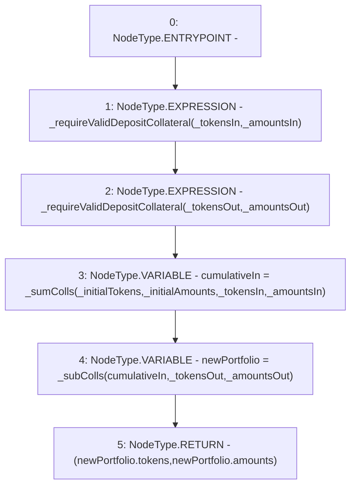

# Context: BorrowerOperationsTester._getNewPortfolio

**Contract:** `BorrowerOperationsTester` (Inherits: BorrowerOperations, ReentrancyGuard, IBorrowerOperations, CheckContract, Ownable, LiquityBase, YetiCustomBase, BaseMath, ILiquityBase)
**Signature:** `_getNewPortfolio(address[],uint256[],address[],uint256[],address[],uint256[]) returns (address[], uint256[])`
**Method Selector ID:** `Internal (No Method ID)`
**Visibility:** `internal`
**Environment-Free:** `Yes`
**Modifiers:** None

### State Variables Interaction
- **Reads:** None
- **Writes:** None

### Environment & Verification Flags
- **Uses Foundry Cheatcodes:** No
- **Has Echidna Properties:** No

### Internal Calls Tree
- None

### External Calls / Value Transfers
- None

### Control Flow Graph (CFG)


### Source Mapping
Declared in: `certora-ac-datasets/detasets/web3bugs/dataset/web3bugs/66/packages/contracts/contracts/BorrowerOperations.sol` on lines **1110** to **1131**

```solidity
    function _getNewPortfolio(
        address[] memory _initialTokens,
        uint256[] memory _initialAmounts,
        address[] memory _tokensIn,
        uint256[] memory _amountsIn,
        address[] memory _tokensOut,
        uint256[] memory _amountsOut
    ) internal view returns (address[] memory, uint256[] memory) {
        _requireValidDepositCollateral(_tokensIn, _amountsIn);
        _requireValidDepositCollateral(_tokensOut, _amountsOut);

        // Initial Colls + Input Colls
        newColls memory cumulativeIn = _sumColls(
            _initialTokens,
            _initialAmounts,
            _tokensIn,
            _amountsIn
        );

        newColls memory newPortfolio = _subColls(cumulativeIn, _tokensOut, _amountsOut);
        return (newPortfolio.tokens, newPortfolio.amounts);
    }

```
