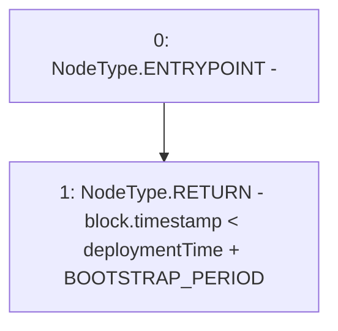

# Context: BorrowerOperationsTester._isBeforeFeeBootstrapPeriod

**Contract:** `BorrowerOperationsTester` (Inherits: BorrowerOperations, ReentrancyGuard, IBorrowerOperations, CheckContract, Ownable, LiquityBase, YetiCustomBase, BaseMath, ILiquityBase)
**Signature:** `_isBeforeFeeBootstrapPeriod() returns (bool)`
**Method Selector ID:** `Internal (No Method ID)`
**Visibility:** `internal`
**Environment-Free:** `No (reads EVM state context)`
**Modifiers:** None

### State Variables Interaction
- **Reads:** BOOTSTRAP_PERIOD, deploymentTime
- **Writes:** None

### Environment & Verification Flags
- **Uses Foundry Cheatcodes:** No
- **Has Echidna Properties:** No

### Internal Calls Tree
- None

### External Calls / Value Transfers
- None

### Control Flow Graph (CFG)


### Source Mapping
Declared in: `certora-ac-datasets/detasets/web3bugs/dataset/web3bugs/66/packages/contracts/contracts/BorrowerOperations.sol` on lines **1204** to **1206**

```solidity
    function _isBeforeFeeBootstrapPeriod() internal view returns (bool) {
        return block.timestamp < deploymentTime + BOOTSTRAP_PERIOD; // won't overflow
    }

```
