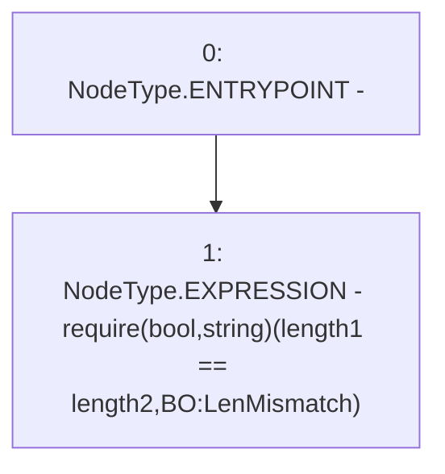

# Context: BorrowerOperationsTester._requireLengthsEqual

**Contract:** `BorrowerOperationsTester` (Inherits: BorrowerOperations, ReentrancyGuard, IBorrowerOperations, CheckContract, Ownable, LiquityBase, YetiCustomBase, BaseMath, ILiquityBase)
**Signature:** `_requireLengthsEqual(uint256,uint256)`
**Method Selector ID:** `Internal (No Method ID)`
**Visibility:** `internal`
**Environment-Free:** `Yes`
**Modifiers:** None

### State Variables Interaction
- **Reads:** None
- **Writes:** None

### Assertion Checks & Business Requirements
- require/assert: `require(bool,string)(length1 == length2,BO:LenMismatch)`

### Environment & Verification Flags
- **Uses Foundry Cheatcodes:** No
- **Has Echidna Properties:** No

### Internal Calls Tree
- None

### External Calls / Value Transfers
- None

### Control Flow Graph (CFG)


### Source Mapping
Declared in: `certora-ac-datasets/detasets/web3bugs/dataset/web3bugs/66/packages/contracts/contracts/BorrowerOperations.sol` on lines **1259** to **1261**

```solidity
    function _requireLengthsEqual(uint256 length1, uint256 length2) internal pure {
        require(length1 == length2, "BO:LenMismatch");
    }

```
